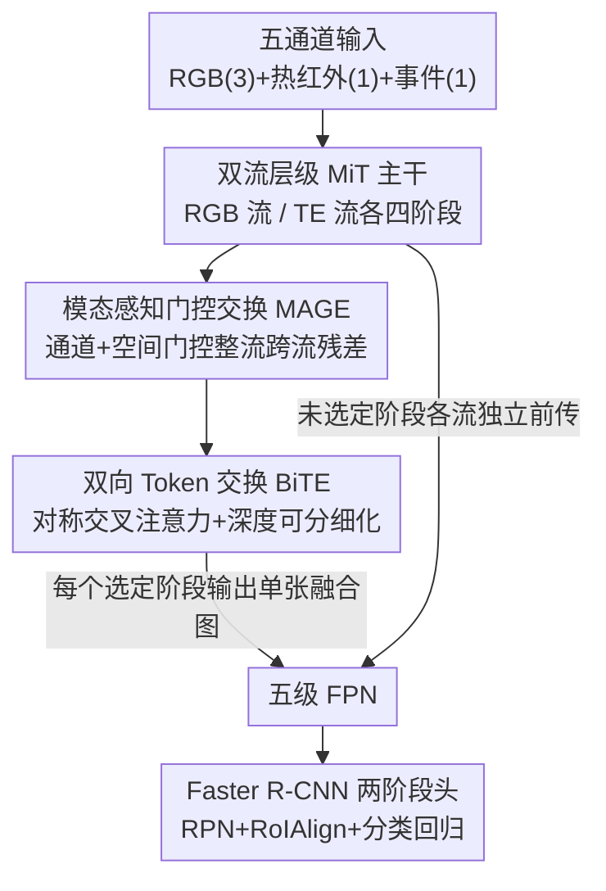

# Tri-Modal Fusion Transformers for UAV-based Object Detection

**会议**: CVPR 2026  
**论文**: [CVF Open Access](https://openaccess.thecvf.com/content/CVPR2026/html/Iaboni_Tri-Modal_Fusion_Transformers_for_UAV-based_Object_Detection_CVPR_2026_paper.html)  
**代码**: https://github.com/radlab-sketch/trimodal-uav-det (有)  
**领域**: 目标检测 / 多模态融合  
**关键词**: 无人机检测、三模态融合、热红外、事件相机、层级Transformer

## 一句话总结
针对无人机在弱光、运动模糊、场景剧变下单一传感器失效的问题，本文用双流层级 MiT Transformer 把 RGB、热红外、事件三种模态在主干网络的多个分辨率层级上做门控+token 双向交换融合，配套发布了首个同步对齐的三模态无人机数据集（10,489 帧 / 24,223 个车辆框），通过 61 组消融系统回答了「三模态该在哪一层、用什么算子融合」，并把 mAP 推到 84.24%。

## 研究背景与动机
**领域现状**：无人机感知在实际飞行中没有任何单一传感器是可靠的——可见光相机在弱光和运动下丢失结构信息，热红外（LWIR）在平台快速机动时饱和或模糊，事件相机虽能保留微秒级时间边缘但信号稀疏且含噪。学界已有大量工作把 RGB 和某一种互补模态配对（RGB-热红外、RGB-事件），但绝大多数检测流水线仍围绕 RGB 或顶多双模态搭建。

**现有痛点**：没有任何一对模态能在所有恶劣条件下都保持可靠——夜间靠热红外、高速运动靠事件、白天靠 RGB，三者各自只覆盖一部分失效模式。但「把三种模态塞进一个检测器」从未被系统研究过。三模态融合的难点远不止「堆通道」：LWIR 反映的是辐射对比度而非纹理，事件流编码的是无绝对强度的异步时间变化，RGB 提供高分辨率结构却在光照漂移下崩溃——三者在噪声特性、空间对齐敏感度、时间密度、语义可靠性上都不同。

**核心矛盾**：早融合（input 拼通道）无视这些模态差异，晚融合（高层特征合并）又丧失了在中间层联合塑造表征的能力。Transformer 主干天然提供跨模态交换的接口，但「在哪个分辨率、以什么机制融合」从没被系统探索过。更现实的障碍是：现有 RGB-热红外、RGB-事件数据集都不提供同步的三模态帧或分辨率对齐的标注，没有数据就无法做受控研究。

**本文目标**：把三模态融合当成一个**架构设计空间**来研究——拆成三个可控变量：融合放在哪一层（depth）、用什么算子（mechanism）、用哪些模态子集（subset）；同时造一个能支撑这种受控实验的数据集。

**切入角度**：主干保持各模态独立的流以保住模态特有结构，**只在选定的中间层耦合**，这样就能干净地研究「何时、何地、如何」融合最有效——所有配置对下游检测头都暴露相同的接口，性能差异只反映融合行为。

**核心 idea**：用一个双流层级 Transformer 加可插拔融合钩子，把「三模态在哪融、怎么融」变成一个能逐项消融的旋钮，而不是一个固定的端到端黑盒。

## 方法详解

### 整体框架
检测器吃的是一个五通道张量 $X \in \mathbb{R}^{B \times 5 \times H \times W}$：通道 0-2 是 RGB，通道 3 是热红外，通道 4 是事件帧。输入被拆成 RGB 流 $X_{rgb}$ 和「热红外-事件」（TE）流 $X_{TE}$，两条流各自过一个**权重独立**的四阶段 MiT（Mix Transformer）主干，在 stride 为 {4, 8, 16, 32} 的四个层级产出多尺度特征。在选定的若干阶段，主干插入一个融合块——它由 **MAGE**（模态感知门控交换）和 **BiTE**（双向 token 交换）两个子模块组成，把两条流整流并合并成单张特征图，且**保持空间分辨率和通道宽度不变**。融合后的特征送进标准五级 FPN，再接 Faster R-CNN 两阶段检测头。

这套设计的关键巧思是：因为融合不改变特征的形状（stride、width 都不动），所以无论融合放在单层、多层还是全部四层，FPN 和检测头都**无需任何改动**——这正是「把融合当可插拔算子来消融」能成立的工程前提。论文还比较了「RGB / 热红外 / 事件三条独立流」的三流方案，发现它把参数从 60.01M 涨到 88.18M 却没带来有意义的精度提升，因此默认采用「RGB vs. TE」两流方案，也更契合无人机 SWaP（尺寸/重量/功耗）约束。

### 关键设计

**1. 双流层级主干 + 分辨率对齐的融合钩子：把「在哪融」变成可控旋钮**

痛点是早/晚融合都无法在中间层有选择地耦合模态，而且没法做受控的「融合深度」研究。本文让 RGB 流和 TE 流各跑一个四阶段 MiT 主干：阶段 1 用 $7\times7/s4$ 的重叠 patch embedding，阶段 2-4 用 $3\times3/s2$；每个 transformer block 用 pre-norm、空间缩减注意力（spatial-reduction attention），并在 FFN 两层线性之间插一个 depthwise $3\times3$ 卷积来恢复局部空间耦合。两条流走完全相同的分辨率时间表（对 224×224 参考输入是 56→28→14→7，宽度 {64,128,320,512}），保证每个阶段两流形状对齐。每个阶段结尾把 token 重排回特征图，交给融合模块；**没被选中融合的阶段就各自独立前传**。这样四个阶段就成了四个「分辨率对齐的融合插槽」，既不破坏下游检测器接口，又让「单层 / 多层 / 全层融合」成为可干净对比的实验配置。

**2. MAGE 模态感知门控交换：只整流跨流残差，保住各自的模态身份**

如果直接把两条流加起来或拼起来，噪声大的模态会污染另一条流。MAGE 的做法是先把两流拼成联合描述子 $z = [x_{rgb} \,\|\, x_{TE}] \in \mathbb{R}^{B \times 2C \times H \times W}$，让门控基于**两个模态的联合证据**而非单流统计来决定。通道门控：对 $z$ 做全局平均池化和最大池化得到互补的全局摘要，过两层 $1\times1$ MLP（非线性 + sigmoid）产生有向的逐通道门 $w^c_{TE\to rgb}, w^c_{rgb\to TE} \in [0,1]$；空间门控：一个轻量 $1\times1\to$非线性$\to1\times1$ 头从 $z$ 预测逐像素掩码 $w^s_{TE\to rgb}, w^s_{rgb\to TE} \in [0,1]$。整流后的特征是

$$\hat{x}_{rgb} = x_{rgb} + w^s_{TE\to rgb} \cdot \left(w^c_{TE\to rgb} \cdot x_{TE}\right), \quad \hat{x}_{TE} = x_{TE} + w^s_{rgb\to TE} \cdot \left(w^c_{rgb\to TE} \cdot x_{rgb}\right)$$

关键在于：门**只调制跨流残差项**，每条流自己的恒等路径 $x_{rgb}$、$x_{TE}$ 原封不动。这样既保住了模态特有结构，又只在「两个模态证据一致」的通道和像素处做跨模态增强，在噪声或模态特异区域抑制传输——避免了一条流的杂波被无差别灌进另一条流。

**3. BiTE 双向 Token 交换：用对称交叉注意力把整流后的两流融成一张图**

MAGE 只是整流，还需要把两条流真正合并。BiTE 把 $\hat{x}_{rgb}, \hat{x}_{TE}$ 拍平成 token 序列 $T_{rgb}, T_{TE} \in \mathbb{R}^{B \times N \times C}$（$N = HW$），各自投影出 Query/Key/Value，再用**对称交叉注意力**更新每条流：$\tilde{T}_s = T_s + \mathrm{Softmax}\!\left(\frac{Q_s \bar{K}_s^\top}{\sqrt{d_k}}\right)\bar{V}_s$，其中 $s \in \{rgb, TE\}$，下标 $\bar{s}$ 表示另一条流。更新是残差式的，保住模态特有内容的同时引入跨模态上下文。然后把更新后的 token 拼接成 $Z = [\tilde{T}_{rgb}; \tilde{T}_{TE}] \in \mathbb{R}^{B \times N \times 2C}$，重排回图后用一个 depthwise $3\times3$ 卷积恢复局部性，再用 $1\times1$ 投影把宽度从 $2C$ 压回 $C$，得到融合图 $u \in \mathbb{R}^{B \times C \times H \times W}$。正是这步「压回 $C$、保持 stride」让 BiTE 能插在任意深度而下游 FPN/检测头无需改动。消融显示 MAGE 和 BiTE 缺一不可：BiTE-only 只有 76.88% mAP，MAGE-only 81.01%，合起来才到 84.24%。

**4. 把融合算子做成可插拔，并用 CSSA / GAFF 撑开设计空间对比**

本文的核心贡献不只是一个块，而是把「融合机制」也当成可替换变量。基线 MAGE+BiTE 之外，作者把另两族算子塞进同一套主干做对照：**CSSA**（通道切换 + 空间注意力）是轻量替代——先用全局平均池化 + 1D 卷积 + sigmoid 给每条流的通道打分，分数低于阈值 $\tau$ 的通道被另一流同序号通道替换，再用一个小卷积头从拼接后的张量预测空间门逐像素二选一；**GAFF**（引导式注意力融合）是高容量替代——每条流先过 squeeze-excitation 强调有用通道，再预测有向引导图让两模态互相做位置感知的残差注入，最后用直接或瓶颈 $1\times1$ 投影合并。三族算子都保持 stride 和宽度，能插在任意钩子。这个设计让论文能在完全相同的主干、检测器、训练设置下，干净地比较「融合深度 × 融合机制」两个轴——结论是 CSSA 适合浅层（s1）早融合、GAFF 适合在深层（s3/s4）选择性使用，而基线 MAGE+BiTE 整体最强。

### 损失函数 / 训练策略
所有模型训 15 epoch，SGD（momentum 0.9，weight decay $1\times10^{-4}$），cosine 学习率 + 前 500 iter 线性 warmup，基础学习率 0.02（global batch 16，随 batch 线性缩放）。输入用预对齐的原生分辨率 301×391，padding 到 32 的倍数以兼容 FPN。Anchor、proposal 分配、RoIAlign、损失、检测头设置在所有实验中固定，使性能差异只反映主干融合行为。作者发现更长的训练表并无收益、偶尔轻微过拟合，与数据集规模和 MiT 容量相符。

## 实验关键数据

### 主实验
数据集：10,489 帧、24,223 个车辆框（单类），6,412 白天 + 4,077 夜晚；事件帧由 $\Delta t \approx 33.3$ ms 时间窗内极性事件 binning 得到。共跑 61 组实验。

**主干容量（MAGE+BiTE，三模态输入）** —— 性能非单调，MiT-B1 性价比最优：

| 主干 | 参数 (M) | mAP | mAP50 |
|------|----------|------|-------|
| MiT-B0 | 27.79 | 80.63 | 97.85 |
| **MiT-B1** | 60.01 | **84.24** | **98.95** |
| MiT-B2 | 82.10 | 82.91 | 98.06 |
| MiT-B3 | 155.40 | 82.43 | 98.06 |
| MiT-B4 | 196.60 | 79.97 | 97.93 |

**模态消融与外部基线**（均用 MiT-B1 + MAGE+BiTE，外部模型仅 RGB+热红外）：

| 配置 | mAP | mAP50 |
|------|------|-------|
| RGB+热红外（本文双模态最强） | 83.42 | 98.22 |
| 热红外+事件 | 74.86 | 96.95 |
| RGB+事件 | 66.32 | 94.46 |
| YOLOv11-RGBT（外部） | 82.08 | – |
| DetFusion（外部） | 78.00 | – |
| 跨数据集 M3FD（RGB-热红外） | 81.79 | 97.36 |
| 跨数据集 RTDOD（RGB-热红外） | 69.21 | 93.87 |

三模态（84.24%）稳超所有双模态；其中 RGB+热红外（83.42%）已捕获大部分收益，事件主要在「运动模糊漏检恢复」「夜间热杂波误检抑制」这类特定失效场景下补足。

### 消融实验
**基线融合块的两个组件**（MiT-B1 三模态）：

| 融合变体 | mAP | 说明 |
|----------|------|------|
| BiTE-only | 76.88 | 去掉可靠性加权，直接 token 交换，掉 7.36 |
| MAGE-only | 81.01 | 去掉 token 交换，仅做 $2C\to C$ 合并，掉 3.23 |
| MAGE+BiTE | 84.24 | 完整模型 |

**CSSA 融合深度 × 阈值**（节选 τ=0.5）：s1 最佳 83.44%，s2=82.58%、s3=82.80%、s4=83.20%，多阶段（s23=82.32、s34=81.66、s1234=80.91）均不如单阶段——重复跨尺度通道切换反而侵蚀模态特有结构。**GAFF 放置**：单次插在深层最好（s4=83.41、s3=83.20），多阶段一致更弱；Phase 2 调参后 s3（r=4、shared、bottleneck）可达 84.02%。

**白天/夜晚训练**（MiT-B1 三模态，mAP）：

| 训练集 | All | Day | Night |
|--------|-----|-----|-------|
| 仅白天 | 79.0 | 85.0 | 70.5 |
| 仅夜晚 | 77.5 | 72.0 | 84.5 |
| 全天 | 82.24 | 84.0 | 80.0 |

### 关键发现
- **BiTE 比 MAGE 更关键**：单独 BiTE-only 掉到 76.88，说明「整流后再做 token 级双向交换」是融合质量的主力；但两者协同才到峰值，MAGE 的门控整流为 BiTE 提供了干净的输入。
- **融合深度是决定性变量，且机制依赖深度**：轻量 CSSA 偏好浅层（s1 早融合最好），高容量 GAFF 偏好深层（s4/s3 选择性融合），多阶段反复融合普遍掉点——这是全文最有价值的工程结论。
- **更大主干不等于更好**：B4（196.6M）甚至跌破 B0，说明在中等规模检测数据集 + 固定训练表下，超过 B1 的容量转化不成泛化，反而过拟合。
- **模态贡献有强弱**：热红外是最有信息量的副模态（RGB+热红外 83.42 远超 RGB+事件 66.32），事件是「锦上添花」而非主力，主要在特定失效区救场。
- **光照多样性必须进训练集**：单一光照训练会过拟合该光照，全天训练才在白天/夜晚间取得更均衡的折中。

## 亮点与洞察
- **「融合即设计空间」的方法论很干净**：通过让融合块严格保持 stride 和宽度，作者把「深度 × 机制 × 模态子集」三个轴解耦成可独立旋的旋钮，下游检测器零改动——这让 61 组消融的结论真正可比，是多模态融合论文里少见的受控实验范式，值得迁移到其他多传感器任务。
- **门控只动残差、不动恒等路径**这个细节很巧妙：它在「跨模态增强」和「保护模态身份不被杂波污染」之间给了一个结构性而非学出来的保证，比简单相加/拼接更鲁棒。
- **数据集本身是硬贡献**：首个同步、预对齐、分辨率一致标注的 RGB-热红外-事件无人机数据集，半自动标注协议（白天 YOLO 提案 + 人工复核，夜间在热红外平面纯手标）和 10.9% 漏检审计都做得扎实，填补了三模态受控研究的数据空白。
- **「事件相机在哪救场」给出了可解释的画面**：把事件的价值定位到「运动模糊漏检恢复」和「夜间热杂波误检抑制」两类具体场景，而非笼统说更好，对实际部署很有指导意义。

## 局限与展望
- **单类、单场景**：数据集只标了「车辆」一个类、且都在城市校园采集，泛化到多类、多场景（行人、复杂地形）尚未验证。
- **事件收益边际**：三模态相对 RGB+热红外只有「modest gain」，在工程上是否值得多挂一个事件相机（增加 SWaP 成本）需要按场景权衡——论文也承认大部分收益来自 RGB+热红外。
- **静态帧化的事件表示**：事件被 binning 成固定 33.3ms 窗的激活图，丢掉了事件相机最核心的异步/微秒时间分辨率，本质上把事件降格成了「另一张图」；作者在结论里也把「时间三模态融合」列为未来工作。
- **训练表偏短**：15 epoch、固定 schedule 下大主干过拟合，无法判断在更大数据/更长训练下结论是否依旧（如 B2+ 是否真不如 B1）。
- **可改进方向**：自适应模态选择（按帧/区域动态决定信任哪个模态）、保留事件异步性的时序融合，是顺理成章的下一步。

## 相关工作与启发
- **vs RGB-热红外 / RGB-事件双模态方法**（GAFF、CGFNet、CMAFF、CSSA 等）：它们都只融两种模态、且针对特定工况（夜间 RGB-热红外、高速 RGB-事件）。本文把三种模态统一进一个架构，并把这些算子当对照塞进同一主干做受控比较——贡献从「又一个融合块」上升到「融合设计空间的系统基准」。
- **vs CSSA 的硬通道替换 / GAFF 的引导残差合并**：本文基线 MAGE+BiTE 用「联合条件下的跨流残差门控 + token 级交换」，且严格保持 stride 和宽度，因此可直接插在层级主干的任意深度——这是它相对前两者的工程优势（可插拔性）。
- **vs CMX 等双编码器多模态框架**：同样用 MiT 风格层级编码器和阶段式融合，但 CMX 等只针对双模态、不暴露「融合深度/算子」的系统设计空间，本文显式开了四个分辨率对齐的融合钩子来做受控研究。
- **vs 外部检测器 YOLOv11-RGBT / DetFusion**：在本文数据集上三模态基线（84.24%）优于 YOLOv11-RGBT（82.08%）和 DetFusion（78.00%），但后两者只用 RGB+热红外，比较需注意输入模态不同这一 caveat。

## 评分
- 新颖性: ⭐⭐⭐⭐ 首个系统化的三模态（RGB-热红外-事件）无人机检测框架+数据集，方法论（融合即设计空间）干净；单个融合块本身是已有思路的组合而非全新机制。
- 实验充分度: ⭐⭐⭐⭐⭐ 61 组受控消融覆盖主干容量、融合深度、机制、模态子集、跨数据集、昼夜，结论扎实且可比。
- 写作质量: ⭐⭐⭐⭐ 动机和设计空间叙述清晰，公式和消融逻辑严谨；个别地方（事件帧化的局限）可更显性讨论。
- 价值: ⭐⭐⭐⭐ 数据集+受控基准对三模态融合社区是实打实的基础设施，工程结论（B1 最优、深度依赖机制、热红外为主力）对部署有直接指导。

<!-- RELATED:START -->

## 相关论文

- [\[CVPR 2026\] UAV-CB: A Complex-Background RGB-T Dataset and Local Frequency Bridge Network for UAV Detection](uav-cb_a_complex-background_rgb-t_dataset_and_local_frequency_bridge_network_for.md)
- [\[CVPR 2026\] Distribution-Aligned Multimodal Fusion for Robust Object Detection](distribution-aligned_multimodal_fusion_for_robust_object_detection.md)
- [\[CVPR 2026\] When Transformers Meet Mamba: A Hybrid Transformer-Mamba Network for Video Object Detection](when_transformers_meet_mamba_a_hybrid_transformer-mamba_network_for_video_object.md)
- [\[CVPR 2026\] Visual Prototype Conditioned Focal Region Generation for UAV-Based Object Detection](visual_prototype_conditioned_focal_region_generation_for_uav-based_object_detect.md)
- [\[CVPR 2026\] UAVGen: Visual Prototype Conditioned Focal Region Generation for UAV-Based Object Detection](uavgen_visual_prototype_conditioned_focal_region_generation_for_uav_based_object_detection.md)

<!-- RELATED:END -->
