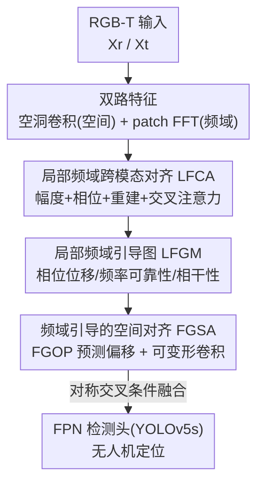

# UAV-CB: A Complex-Background RGB-T Dataset and Local Frequency Bridge Network for UAV Detection

**会议**: CVPR 2026  
**论文**: [CVF Open Access](https://openaccess.thecvf.com/content/CVPR2026/html/Huang_UAV-CB_A_Complex-Background_RGB-T_Dataset_and_Local_Frequency_Bridge_Network_CVPR_2026_paper.html)  
**代码**: https://github.com/hye999/UAV-CB （数据集将公开）  
**领域**: 目标检测 / RGB-T 多模态  
**关键词**: 无人机检测, RGB-T 融合, 频域建模, 复杂背景, 伪装目标

## 一句话总结
针对低空复杂背景下无人机"低对比度、弱边界、与杂乱纹理高度混淆"的检测难题，本文构建了刻意采样伪装/复杂场景的 RGB-T 数据集 UAV-CB（3,442 对图像、5 类背景），并提出在**局部频域**里做对齐的 LFBNet——先在频域统一两模态的幅度与相位，再用频域线索引导空间可变形配准，最终在 UAV-CB 上把 AP(0.5:0.95) 做到 54.4%，比此前最好的多模态基线 C2Former 高 5.3 个点。

## 研究背景与动机
**领域现状**：低空无人机检测是感知与反制系统的前端关键任务，单模态检测器（Faster R-CNN、YOLO 系列）和近年的 RGB-T 多模态方案都被用来定位无人机。可见光提供纹理、热成像在弱光/夜间稳健，二者互补理应提升鲁棒性。

**现有痛点**：现实低空场景里，无人机经常和建筑、植被、电力线、云层等结构在视觉上"融为一体"，呈现低对比度、弱边缘、与背景纹理强混淆，导致大量误检与漏检。而现有 UAV 数据集（Anti-UAV、DUT-Anti-UAV 等）虽然场景多样，却**没有刻意采样这种伪装与复杂背景的样本**，多数还偏向跟踪任务，无法支撑对真实低空复杂性下失败模式的分析。

**核心矛盾**：把无人机从复杂背景里"摘出来"，本质上需要比空间纹理更强的判别线索。频域表示能压制干扰、放大边缘/结构差异，但直接把频域和空间特征融合存在两个鸿沟——**频域-空间融合鸿沟**（空间特征有局部结构但缺全局频谱视角，全局 FFT 又丢失局部上下文）和**跨模态差异鸿沟**（RGB 与热成像本身光谱特性不一致，难以对齐）。

**本文目标**：(1) 造一个专门聚焦复杂背景与伪装的 RGB-T 无人机检测基准；(2) 设计一个能同时弥合上述两个鸿沟的检测网络。

**切入角度**：作者观察到 RGB 与热成像虽在光照纹理上不同，但在**频域里共享一致的几何结构**——高频对应边缘形状、低频对应强度能量。于是把对齐这件事搬到"局部频域"里做，既能利用频域对模态不敏感的特性做跨模态对齐，又用 patch 化保留局部上下文。

**核心 idea**：用"局部频域桥接"替代直接的频域-空间融合——在局部频谱里对齐两模态（LFCA），再用频域差异生成的引导图去驱动空间可变形配准（FGSA），把跨模态对齐和空间对齐串成两阶段。

## 方法详解

### 整体框架
LFBNet 输入一对 RGB-T 图像 $X_m\ (m\in\{r,t\})$，输出无人机检测框。网络先抽两路互补特征：空间特征 $F_m$ 由多尺度空洞卷积（atrous conv）得到；局部频域特征则把图像切成 patch $B_m^q$ 后做 2D FFT，得到每块的复频谱 $\mathcal{F}^m_q=\mathbf{A}^m_q e^{j\boldsymbol{\Phi}^m_q}$（幅度 $\mathbf{A}$ + 相位 $\boldsymbol{\Phi}$）。

随后两个核心模块串行工作：**LFCA**（Local Frequency Cross-Modal Alignment）在局部频域里对齐两模态，并产出一张**局部频域引导图 LFGM**；LFGM 再去引导 **FGSA**（Frequency-Guided Spatial Alignment）在空间域做频域感知的可变形融合。融合后的四尺度特征（N=4）送入基于 FPN 的检测头（YOLOv5s）完成定位。整体是"频域对齐 → 频域引导的空间对齐 → 检测"的两阶段对齐管线。

### 关键设计

**1. UAV-CB 数据集：刻意采样"看不见"的无人机**

现有数据集没专门覆盖伪装/复杂背景，模型在真实低空场景的失败模式无从分析。作者用 HP-DMS15 光电平台（同轴 RGB 1920×1080 + 非制冷热成像 640×512、8–14µm，硬件同步保证时空对齐）采集 DJI Matrice 350 RTK 和 Matrice 4E 两型无人机，从大量原始录像里**只挑出背景干扰强、伪装特征明显的帧**，最终得到 3,442 对 RGB-T 图像，覆盖建筑、植被、电力线、云、地面五类复杂背景。两个值得注意的设计选择：一是**故意不做像素级配准**——因为真实系统几乎不可能完美对齐，保留视差/传感器偏移更贴近实战、也逼着方法去处理模态错位；二是绝大多数目标占图面积 <5%，强化了小目标属性。数据按 6:2:2 划分并保持背景类别/尺度/机型分布均衡。

**2. LFCA：在局部频谱里统一两模态的能量与结构**

跨模态差异鸿沟的根源是 RGB 与热成像的光谱不一致。LFCA 抓住"频域里高频管边缘、低频管能量"这一共性，分三步对齐。**幅度对齐**先在每个 patch 内归一化去掉尺度偏差 $\tilde{\mathbf{A}}^m_q=\mathbf{A}^m_q/(\|\mathbf{A}^m_q\|_2+\epsilon)$，再用可学习系数 $\alpha_q\in[0,1]$ 自适应混合 $\mathbf{A}^a_q=\alpha_q\tilde{\mathbf{A}}^r_q+(1-\alpha_q)\tilde{\mathbf{A}}^t_q$，让两模态在不同光照/发射率下能量幅度一致。**相位对齐**用插值让热成像几何做粗对齐、RGB 边缘细化高频结构：

$$\boldsymbol{\Phi}^a_q = \boldsymbol{\Phi}^t_q + \beta_q \cdot \mathrm{wrap}(\boldsymbol{\Phi}^r_q - \boldsymbol{\Phi}^t_q)$$

其中 $\mathrm{wrap}(\cdot)$ 把相位差限制到 $[-\pi,\pi]$，$\beta_q$ 控制 RGB 结构细节的贡献量。对齐后用 $\mathcal{F}^a_q=\mathbf{A}^a_q e^{j\boldsymbol{\Phi}^a_q}$ 重建复频谱，经 iFFT 与 overlap-add 聚合回空间域得到模态一致的 $\mathbf{F}_{\mathrm{align}}$，最后用交叉注意力把对齐后的频域线索注回各模态空间特征 $\mathbf{F}^m_X=\mathrm{XAttn}(\mathbf{F}^m,\mathbf{F}_{\mathrm{align}})$。这样对齐发生在对模态不敏感的频域，比直接在空间域拼接/注意力更稳。

**3. LFGM：把频谱差异翻译成空间可读的引导线索**

LFCA 解决了频域一致性，但视差和传感器偏移造成的空间错位仍在。要修空间错位，得知道"哪里偏、偏多少、信哪个模态"。LFGM 为每个 patch 编码三类互补属性并拼成 6 维向量 $\mathbf{G}^{(q)}_{\mathrm{freq}}=[d_x,d_y,S_\phi,C_{hf},C_{lf},Coh]$。其中**相位位移**由相位差的正余弦给方向、L1 范数给强度：$[d_x,d_y]=[\sin(\Delta\boldsymbol{\Phi}_q),\cos(\Delta\boldsymbol{\Phi}_q)]$、$S_\phi=\|\Delta\boldsymbol{\Phi}_q\|_1$；**频率可靠性** $C_{hf},C_{lf}$ 用高/低频能量占比衡量该 patch 更该信哪个模态；**谱相干性** $Coh^{(q)}=|\sum\mathcal{F}^r_q(\mathcal{F}^t_q)^*|/\sqrt{\sum|\mathcal{F}^r_q|^2\sum|\mathcal{F}^t_q|^2}$ 度量两模态频谱相关度。所有 patch 向量经 overlap-add 投影回稠密的像素级引导图 $\mathbf{G}_{\mathrm{freq}}$，与空间特征对齐，专门为下一步的偏移预测提供"频域知情"的线索——这正是弥合频域-空间鸿沟的桥。

**4. FGSA：用频域引导的可变形卷积修空间错位**

有了 $\mathbf{G}_{\mathrm{freq}}$，FGSA 用它驱动可变形配准。**FGOP**（Frequency-Guided Offset Predictor）先做门控调制 $\tilde{\mathbf{G}}=\sigma(\mathrm{Conv}_{1\times1}([\mathbf{F}^r_X,\mathbf{F}^t_X]))\odot\mathbf{G}_{\mathrm{freq}}$ 自适应地决定频域先验该用多少，再用两层 3×3 卷积 + 1×1 投影预测偏移场 $\Delta\mathbf{p}=f_\theta([\mathbf{F}^r_X,\mathbf{F}^t_X,\tilde{\mathbf{G}}])$。这个偏移编码了频域知情的几何位移，送进可变形卷积按 $\hat{\mathbf{F}}^m(p_0)=\sum_k w_k\,\mathcal{S}(\mathbf{F}^m_X, p_0+p_k+\Delta p_k(p_0))$ 重采样。最后用对称交叉条件融合让两支双向交互：$\mathbf{F}_{\mathrm{out}}=\mathrm{Conv}_{3\times3}([\mathbf{F}^r,\hat{\mathbf{F}}^t])+\mathrm{Conv}_{3\times3}([\mathbf{F}^t,\hat{\mathbf{F}}^r])$，产出几何对齐且谱一致的多模态表示送入检测头。相比把对齐交给网络隐式学，频域线索给了偏移预测明确的方向与强度先验。

### 损失函数 / 训练策略
检测头基于 YOLOv5s/FPN，沿用标准检测损失。训练用 PyTorch + 单张 A100(40GB)，backbone ResNet-50，输入 640×512，SGD（momentum 0.9，weight decay 5e-4，初始 lr 0.01，cosine annealing），batch 16，UAV-CB 训 200 epoch；patch 大小固定 16×16。DroneVehicle 上训 400 epoch、输入 640×640 以与近期 RGB-T 检测器公平比较。RGB 图先按热成像视场裁剪做粗配准再 resize。

## 实验关键数据

### 主实验
UAV-CB 上 LFBNet 全面领先单模态与多模态检测器（AP，单位 %）：

| 方法 | 模态 | AP50 | AP75 | AP(0.5:0.95) | Param(M) | FLOPs(G) |
|------|------|------|------|------|------|------|
| RT-DETR (CVPR'24) | Visible | 73.4 | 43.7 | 44.2 | 12.0 | 98.6 |
| RT-DETR (CVPR'24) | Thermal | 79.5 | 52.7 | 49.2 | 12.0 | 98.6 |
| C2Former (TGRS'24) | RGB+T | 79.4 | 53.8 | 49.1 | 100.8 | 324.0 |
| SFDFusion (ArXiv'24, 也用频域) | RGB+T | 79.2 | 51.8 | 49.0 | 21.5 | 58.5 |
| **LFBNet (ours)** | RGB+T | **84.6** | **57.2** | **54.4** | 30.2 | 65.2 |

LFBNet 比此前最好的多模态基线 C2Former 在 AP(0.5:0.95) 上高 5.3 个点（54.4 vs 49.1），且参数/算力只有其约 1/3；比同样用频域信息的 SFDFusion 高 5.4 个点，说明"局部频域对齐 + 频域引导空间融合"比简单引入频域更能对齐模态、更抗伪装。

跨数据集泛化（DroneVehicle 地面目标 RGB-T 检测）：

| 方法 | mAP50 (%) |
|------|------|
| C2Former (TGRS'24) | 72.8 |
| OAFA (CVPR'24) | 79.4 |
| **LFBNet (ours)** | **80.1** |

尽管 LFBNet 是为 UAV-CB 设计的，迁到传感器配置/视角/场景都不同的 DroneVehicle 仍取得最高 mAP50，说明学到的是可泛化的 RGB-T 融合原则而非过拟合 UAV-CB。

### 消融实验
UAV-CB 验证集上逐模块叠加（AP(0.5:0.95), %）：

| 配置 | LFCA | FGSA | AP(0.5:0.95) | 说明 |
|------|------|------|------|------|
| YOLOv5s+Add | ✗ | ✗ | 38.5 | 简单相加融合基线 |
| + LFCA only | ✓ | ✗ | 47.9 | 频域对齐消除幅度/相位不一致，+9.4 |
| + FGSA only | ✗ | ✓ | 49.3 | 频域引导可变形采样修几何错位，+10.8 |
| Full LFBNet | ✓ | ✓ | 54.4 | 两者互补，+15.9 |

### 关键发现
- **两个模块各自就很强、合起来更强**：单加 LFCA 把基线从 38.5 抬到 47.9（+9.4），单加 FGSA 抬到 49.3（+10.8），二者全开到 54.4——LFCA 给出模态一致的频谱特征，FGSA 再精修空间对应，互补性明显。
- **频域对齐是真有用而非噱头**：和同样用频域的 SFDFusion 比仍高 5.4 个点，差距来自"局部 patch 频域 + 把频谱差异显式翻译成偏移引导"，而不是简单的频域增强。
- **效率友好**：30.2M 参数 / 65.2 GFLOPs，远低于 C2Former 的 100.8M / 324G，却拿到更高精度，对低空实时部署更现实。
- **不做像素配准的设定有价值**：数据集刻意保留模态错位，正好让 FGSA 的可变形对齐有用武之地，也更贴近真实系统。

## 亮点与洞察
- **把"对齐"搬进局部频域**：利用 RGB 与热成像在频域共享几何结构、且频域对模态相对不敏感的特性，在 patch 频谱里同时做幅度/相位对齐，比空间域拼接更稳——这个视角可迁移到其他难配准的多模态融合（如 RGB-D、可见光-SAR）。
- **LFGM 是点睛之笔**：它把抽象的频谱差异翻译成 6 维、空间可读的引导图（方向 $d_x,d_y$、强度 $S_\phi$、频率可靠性 $C_{hf},C_{lf}$、相干性 $Coh$），让后续可变形卷积的偏移预测有明确先验，而不是让网络"盲学"，这种"用物理量显式引导可变形采样"的思路很有复用价值。
- **数据集设计有方法论意识**：刻意采样伪装样本 + 故意不做像素配准，把数据集本身变成驱动鲁棒方法的杠杆，而非单纯堆量。
- **精度-效率双赢**：用三分之一算力超过重型 Transformer 基线，说明在该任务上"对齐质量"比"模型容量"更关键。

## 局限与展望
- **作者承认**：未来需提升 LFBNet 的域适应能力，并构建开放环境基准评估在未见天气/光照/场景下的泛化。
- **数据规模有限**：3,442 对图像、单一采集平台、两型 DJI 无人机，机型/传感器多样性偏窄，可能限制对其它无人机或异构传感器的泛化。
- **缺单模块组合的细化消融**：只给了 AP(0.5:0.95) 一项消融指标，LFCA 内部三步（幅度/相位/重建）、LFGM 三类线索各自贡献多少没有拆开，$\alpha_q,\beta_q$ 等可学习系数的敏感性也未分析。
- **频域 patch 化的代价**：固定 16×16 patch + overlap-add 的频域计算开销与 patch 尺寸的权衡未讨论，patch 边界是否引入伪影也没量化。

## 相关工作与启发
- **vs 相机伪装目标检测 (COD)**：COD 也处理"视觉不显著目标"，但它是单模态 RGB、做大而静的目标的像素级分割；本文是多模态、小而动的空中目标检测。作者借了 COD 的"伪装"视角，但用频域机制而非边界细化来增强判别。
- **vs 通用 RGB-T 融合 (C2Former / CMX)**：这些方法多在空间域用注意力/Transformer 做早中晚期融合，面向通用目标；LFBNet 改在局部频域对齐 + 频域引导可变形配准，专门应对小无人机的弱边界与模态错位，且更省算力。
- **vs SFDFusion 等频域方法**：同样用频域，但前者偏全局频域增强；本文强调"局部"频谱对齐并把频谱差异显式转成空间偏移引导，消融与对比都显示这带来 5+ 点提升。
- **vs Anti-UAV 等 RGB-T 基准**：Anti-UAV 引入了 RGB-T 但偏跟踪、未针对复杂背景；UAV-CB 刻意采样伪装/杂乱场景并保留模态错位，填补了复杂背景 RGB-T 检测基准的空白。

## 评分
- 新颖性: ⭐⭐⭐⭐ 把对齐搬进局部频域、用 LFGM 把频谱差异翻译成偏移引导，是 RGB-T 融合里少见且自洽的角度。
- 实验充分度: ⭐⭐⭐⭐ 主实验对比充分、有跨数据集泛化和效率对比；但消融只给一个指标、内部子模块未拆细。
- 写作质量: ⭐⭐⭐⭐ 动机—鸿沟—方法逻辑清晰，公式完整，图示到位。
- 价值: ⭐⭐⭐⭐ 数据集 + 方法都将开源，对低空反无人机感知是实用基准与强基线。

<!-- RELATED:START -->

## 相关论文

- [\[CVPR 2026\] Tri-Modal Fusion Transformers for UAV-based Object Detection](tri-modal_fusion_transformers_for_uav-based_object_detection.md)
- [\[CVPR 2026\] Visual Prototype Conditioned Focal Region Generation for UAV-Based Object Detection](visual_prototype_conditioned_focal_region_generation_for_uav-based_object_detect.md)
- [\[CVPR 2026\] UAVGen: Visual Prototype Conditioned Focal Region Generation for UAV-Based Object Detection](uavgen_visual_prototype_conditioned_focal_region_generation_for_uav_based_object_detection.md)
- [\[AAAI 2026\] AerialMind: Towards Referring Multi-Object Tracking in UAV Scenarios](../../AAAI2026/object_detection/aerialmind_towards_referring_multi-object_tracking_in_uav_sc.md)
- [\[CVPR 2026\] FB-CLIP: Fine-Grained Zero-Shot Anomaly Detection with Foreground-Background Disentanglement](fb-clip_fine-grained_zero-shot_anomaly_detection_with_foreground-background_dise.md)

<!-- RELATED:END -->
