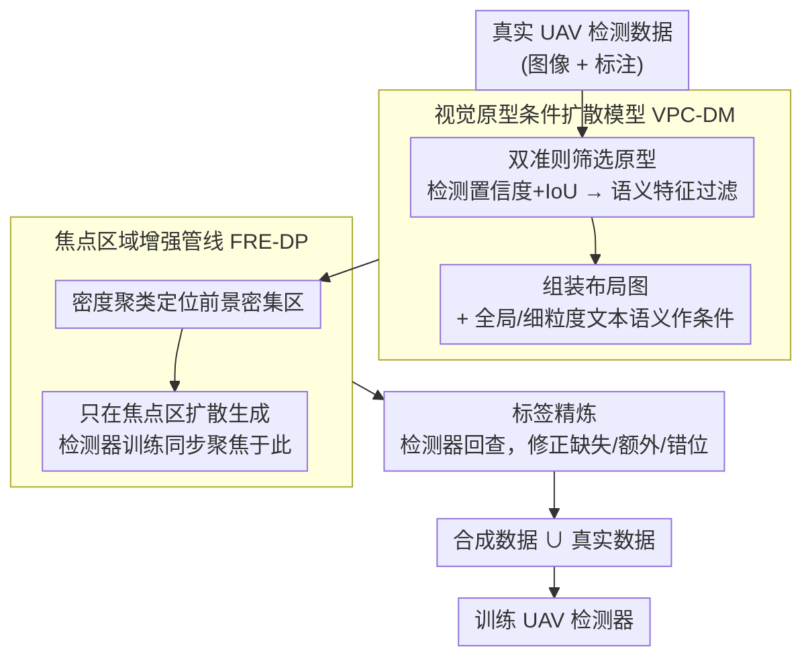

# UAVGen: Visual Prototype Conditioned Focal Region Generation for UAV-Based Object Detection

**会议**: CVPR 2026  
**arXiv**: [2604.02966](https://arxiv.org/abs/2604.02966)  
**代码**: [https://github.com/Sirius-Li/UAVGen](https://github.com/Sirius-Li/UAVGen)  
**领域**: 目标检测 / 无人机视觉  
**关键词**: UAV detection, layout-to-image generation, diffusion model, data augmentation, small object

## 一句话总结

提出 UAVGen，一个面向无人机目标检测的 layout-to-image 数据增强框架，通过视觉原型条件扩散模型和焦点区域增强管线解决小目标生成质量低、模型容量浪费和标签不一致问题。

## 研究背景与动机

无人机（UAV）目标检测面临严重的数据稀缺问题，尤其在动态变化环境中。基于扩散模型的 layout-to-image 数据增强方法虽然在通用检测中有效，但在 UAV 场景中表现受限。

作者分析了三个核心挑战：
1. **低质量视觉布局**：UAV 拍摄物体尺度小、频繁重叠，导致裁剪得到的布局图模糊或纠缠，影响扩散模型条件信号的清晰度
2. **模型容量分配不均**：UAV 图像中目标集中在小区域，大量区域信息量极低，扩散模型在无信息区域浪费大量容量
3. **合成图像与标注不一致**：扩散过程的随机性导致生成图像偏离输入布局，出现缺失生成、额外生成和标签错位，在小目标场景中更为严重

现有方法直接将通用 layout-to-image 方法应用于 UAV 检测，未针对上述特殊挑战做适配。UAVGen 是首个专门面向 UAV 检测器训练的数据合成方法。

## 方法详解

### 整体框架

UAVGen 要解决 UAV 检测的数据稀缺，以及通用 layout-to-image 增强在小目标场景失效的问题。它沿用「扩散模型合成带标注数据 + 真实数据联合训练检测器」的范式，但针对 UAV 的三个痛点串起一条定制流水线：先用视觉原型条件扩散模型（VPC-DM）——筛出清晰原型组装成布局图、配合文本语义一起作为条件——生成高保真的小目标图像；再用焦点区域增强管线（FRE-DP）把生成与检测器训练都聚焦到前景密集的小目标区域，不在大片背景上浪费容量；最后由标签精炼校正合成图与标注的错位，产出可直接喂给检测器的增广数据。下图给出三者串联的数据流：

### 关键设计

**1. 视觉原型条件扩散模型 VPC-DM：用筛过的清晰原型当条件，而非模糊裁剪**

UAV 物体尺度小、频繁重叠，直接裁剪得到的布局图模糊纠缠，扩散模型拿到的条件信号不清晰。VPC-DM 改用双准则筛选构造原型：先用预训练检测器检出所有目标按类别分组，保留高置信度且与真实框 IoU 超过阈值的候选；再基于语义特征二次过滤，确保选出的原型视觉清晰、语义明确。把这些原型组装成布局图像，配合全局与细粒度文本语义一起作为扩散条件，使生成的小目标更保真。

**2. 焦点区域增强管线 FRE-DP：只在密集小目标区生成，不把容量浪费在背景**

UAV 图像里目标集中在小片区域，大量背景信息量极低，全图生成会把扩散模型容量浪费在无信息区。FRE-DP 通过密度聚类等方法先定位前景密集区，只对这些焦点区域做合成，并让检测器训练也聚焦于此，既显著减少无效计算，又提升了关键区域的小目标生成质量。

**3. 标签精炼模块：用检测器回查修掉合成噪声**

扩散过程的随机性会让生成图偏离输入布局，出现缺失生成（真实标注有但未生成）、额外生成（生成了标注中不存在的目标）和位置错位三类标注错误，在小目标上尤其严重。标签精炼作为后处理，用检测模型对合成图重新检测，再与原始标注比对匹配，逐一修正这三类问题，避免标签噪声污染检测器训练。

### 损失函数 / 训练策略

扩散模型采用标准 LDM 训练范式，以视觉原型构建的布局图像和文本提示为条件。检测器在原始数据与合成数据的联合集上训练，使用标准检测损失。

## 实验关键数据

### 主实验

| 数据集 | 指标 | 本文 (UAVGen) | 之前 SOTA | 提升 |
|--------|------|-------------|----------|------|
| VisDrone (YOLO) | mAP | 显著提升 | 基础方法 | +3~5% |
| UAVDT | mAP | 最优 | 通用L2I方法 | 明显优势 |

### 消融实验

| 配置 | 关键指标 | 说明 |
|------|---------|------|
| w/o VPC-DM | mAP 下降 | 视觉原型对生成质量至关重要 |
| w/o FRE-DP | mAP 下降 | 全图生成效率低、小目标质量差 |
| w/o 标签精炼 | mAP 下降 | 标签噪声显著影响训练 |

### 关键发现

- 视觉原型的质量筛选比直接使用所有裁剪区域效果好得多
- 焦点区域生成策略避免了在大面积背景上浪费模型容量
- 标签精炼步骤对最终检测精度影响显著

## 亮点与洞察

- 首次将 layout-to-image 数据增强范式系统适配到 UAV 检测场景
- 双准则视觉原型选择思路简洁有效，融合检测置信度和语义特征两个维度
- 焦点区域策略巧妙避开了 UAV 图像中大量无信息背景的干扰
- 标签精炼作为后处理步骤，简单但必要，解决了合成数据标注噪声问题

## 局限与展望

- 依赖预训练检测器进行原型筛选和标签精炼，检测器本身的性能会影响流程
- 焦点区域的选择策略在极稀疏场景下可能不够鲁棒
- 未来可探索端到端训练整个数据增强-检测流程

## 相关工作与启发

- 与 GeoDiffusion、GLIGEN 等通用 layout-to-image 方法相比，UAVGen 针对 UAV 小目标特性做了深度定制
- 标签精炼的思路可推广到其他合成数据增强场景

## 评分

- 新颖性：⭐⭐⭐⭐ — 首个面向 UAV 检测的合成数据增强框架
- 技术深度：⭐⭐⭐⭐ — 视觉原型+焦点区域+标签精炼组合系统性强
- 实验充分度：⭐⭐⭐⭐ — 多数据集多检测器验证
- 实用价值：⭐⭐⭐⭐ — 直接解决 UAV 检测数据不足的实际问题

<!-- RELATED:START -->

## 相关论文

- [\[NeurIPS 2025\] ReCon: Region-Controllable Data Augmentation with Rectification and Alignment for Object Detection](../../NeurIPS2025/object_detection/recon_region-controllable_data_augmentation_with_rectification_and_alignment_for.md)
- [\[CVPR 2026\] Prompt-Free Universal Region Proposal Network](prompt-free_universal_region_proposal_network.md)
- [\[CVPR 2026\] Beyond Prompt Degradation: Prototype-Guided Dual-Pool Prompting for Incremental Object Detection](beyond_prompt_degradation_prototype-guided_dual-pool_prompting_for_incremental_o.md)
- [\[AAAI 2026\] VK-Det: Visual Knowledge Guided Prototype Learning for Open-Vocabulary Aerial Object Detection](../../AAAI2026/object_detection/vk-det_visual_knowledge_guided_prototype_learning_for_open-vocabulary_aerial_obj.md)
- [\[CVPR 2025\] Unseen Visual Anomaly Generation](../../CVPR2025/object_detection/unseen_visual_anomaly_generation.md)

<!-- RELATED:END -->
