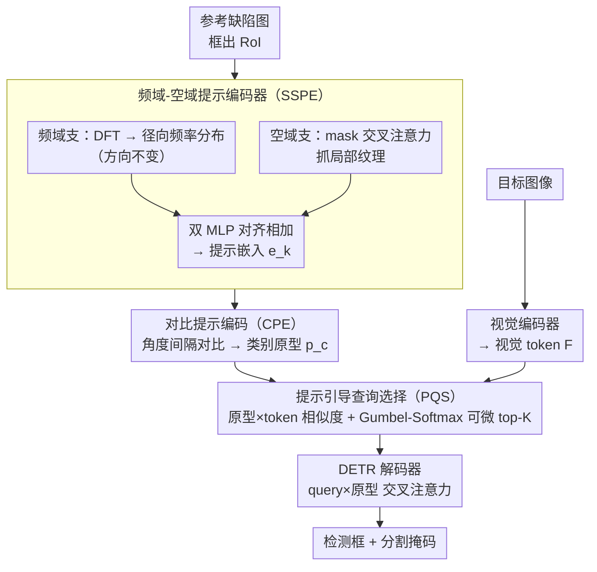

# UniSpector: Towards Universal Open-set Defect Recognition via Spectral-Contrastive Visual Prompting

**会议**: CVPR 2026  
**arXiv**: [2604.02905](https://arxiv.org/abs/2604.02905)  
**代码**: [https://geonuk-kimmm.github.io/UniSpector](https://geonuk-kimmm.github.io/UniSpector)  
**领域**:目标检测
**关键词**: 开放集缺陷检测、频域特征、对比提示编码、视觉提示、工业质检

## 一句话总结

本文提出 UniSpector 开放集工业缺陷检测框架，通过频域-空域双域特征融合（SSPE）和角度间隔对比提示编码（CPE）解决了视觉提示嵌入崩塌问题，在新构建的包含 360 种缺陷类别的 Inspect Anything benchmark 上，AP50 检测和分割分别比最佳基线高 19.7% 和 15.8%。

## 研究背景与动机

1. **领域现状**：工业质检需要检测各种未见过的缺陷类型。现有开放集检测方法（如 GroundingDINO、T-Rex2）主要面向自然图像，在工业缺陷场景下效果很差——缺陷通常是细微的纹理/颜色异常，与自然目标的特征分布差异巨大。
2. **现有痛点**：(1) 视觉提示方法在工业场景中存在"提示嵌入崩塌"——不同缺陷类型的提示向量在嵌入空间中高度重叠，无法区分；(2) 现有方法仅利用空域特征，忽略了缺陷的频域特征（如周期性纹理异常在频谱上更有鉴别力）。
3. **核心矛盾**：工业缺陷的视觉差异极其细微（常常只是微小的划痕、凹坑或色差），纯空域 RoI 特征难以捕捉这些差异，导致不同类别的提示向量坍缩为同一区域。
4. **本文目标**：设计一种能在频域和空域双重维度提取鉴别性缺陷特征的提示编码方案，并通过对比约束显式拉开不同缺陷类别的嵌入距离。
5. **切入角度**：观察到缺陷的频域特征（如周期条纹在频谱上的能量集中模式）比空域像素更稳定且更有区分度——这受启发于信号处理中频谱分析的经典思路。
6. **核心 idea**：双域提示编码（SSPE）+ 角度间隔对比学习（CPE）+ 提示引导查询选择（PQS），三位一体解决工业开放集检测。

## 方法详解

### 整体框架

UniSpector 要解决的是用一张参考缺陷图去检测/分割同类缺陷的开放集问题，难点在于工业缺陷的视觉差异极细微、纯空域提示向量容易在嵌入空间里坍缩。整条管线是一条"提示路 + 目标图路"分支再汇合的 DETR 结构：提示路从参考图像里框出缺陷 RoI 后，先由 SSPE 同时抽取频域和空域特征并融合成提示嵌入，这些嵌入再经 CPE 用角度间隔对比损失被显式拉开、按类取均值得到紧凑可分的类别原型；目标图路则由视觉编码器把目标图像编成视觉 token。两路在 PQS 汇合——用类别原型与视觉 token 算相似度、可微地挑出最相关的一批 query，送进 DETR 解码器与原型做交叉注意力，最终输出检测框和分割掩码。SSPE、CPE、PQS 三个模块分别针对"特征不够辨别""嵌入崩塌""query 选得不准"三个环节。

### 关键设计

**1. 频域-空域提示编码器（SSPE）：用频谱补回空域看不出的缺陷差异**

工业缺陷常常只是细微划痕、凹坑或周期性纹理异常，纯空域 RoI 像素难以把不同类别区分开。SSPE 在空域之外引入频域分支：对 RoI $R_k$ 做 2D DFT 得到频谱 $F_k(u,v)=\text{DFT}(R_k)$，再沿半径聚合成径向频率分布

$$h_k(\rho) = \frac{1}{|\Gamma_\rho|}\sum_{(u,v) \in \Gamma_\rho}|F_k(u,v)|$$

经径向频率编码器得到 $z_k^{\text{freq}}$。这里的径向聚合是关键——它把频谱按到原点的距离 $\rho$ 求平均，天然抹掉了方向信息，从而对"缺陷朝向随机"这一工业痛点免疫（同一种条纹异常无论横竖斜，径向能量分布都一致）。空域侧则用 mask 交叉注意力抓局部纹理细节得到 $z_k^{\text{spatial}}$，两支再经双 MLP 对齐相加融合成提示嵌入 $\mathbf{e}_k = f_{\text{align}}(z_k^{\text{spatial}}) + v_{\text{align}}(z_k^{\text{freq}})$。频域提供方向不变的全局周期特征、空域补足局部细节，两者互补让提示嵌入比纯空域更有区分度。

**2. 对比提示编码（CPE）：用角度间隔把崩塌的类别嵌入硬撑开**

即便特征更丰富，标准对比损失学出来的决策边界仍可能松散，不同缺陷类别的提示向量还是会挤在一起。CPE 借鉴人脸识别里 ArcFace 的角度间隔思路：先按同类嵌入均值算出类别原型 $\mathbf{p}_c$，再在余弦相似度上加一个间隔 $m$ 构造损失

$$\mathcal{L}_{\text{CPE}} = -\frac{1}{N}\sum_{k=1}^N \log\frac{\exp(\alpha\cos(\theta_{y_k,k}+m))}{\exp(\alpha\cos(\theta_{y_k,k}+m))+\sum_{c\neq y_k}\exp(\alpha\cos(\theta_{c,k}))}$$

其中 $\theta_{c,k}$ 是嵌入 $\mathbf{e}_k$ 与原型 $\mathbf{p}_c$ 的夹角，$\alpha$ 为缩放因子。给正确类的角度强加 $+m$ 的"罚分"，等于要求样本必须比间隔更靠近自己的原型才不亏，于是不同类别在角度空间被强制保持最小距离，类内紧凑、类间分离，正面对治嵌入崩塌。

**3. 提示引导查询选择（PQS）：让 query 选择既看提示信息又能端到端训练**

检测器需要从大量视觉 token 里挑出与目标缺陷相关的区域，可学习参数的 query 不带提示信息、启发式 top-K 又不可微无法联合优化。PQS 直接用视觉 token $\mathcal{F}$ 与类别原型 $\mathbf{p}$ 的余弦相似度当相关性分数，再用 Gumbel-Softmax 做可微的 top-K 选出最相关的 query，并以 Straight-Through Estimator 在前向离散选择、反向保留梯度。这样选择过程既显式依赖提示缺陷的原型、又能随检测损失一起端到端训练，兼顾了"选得准"和"可优化"。

### 损失函数 / 训练策略

总损失为 CPE 角度间隔对比损失加标准检测/分割损失，缩放因子 $\alpha$ 与间隔 $m$ 为超参数。模型基于 DINOv 架构，在 InsA 训练集上训练。

## 实验关键数据

### 主实验

| 方法 | GC10 | MagTile | Real-IAD | MVTec | 平均 AP50↑ |
|------|------|---------|----------|-------|------------|
| GroundingDINO | 9.6 | 26.7 | 0.3 | 1.4 | 5.4 |
| DINOv† | 16.5 | 48.4 | 21.0 | 15.9 | 17.1 |
| T-Rex2† | 32.4 | 49.0 | 25.1 | 24.4 | 32.7 |
| YOLOE† | 10.7 | 43.3 | 17.2 | 25.8 | 17.4 |
| **UniSpector†** | **38.2** | **63.3** | **69.1** | **53.5** | **40.9** |

### 消融实验

| 组件 | APb | AP50b | AP75b | APm | AP50m |
|------|-----|-------|-------|-----|-------|
| Baseline | 13.6 | 24.0 | 14.5 | 7.7 | 20.0 |
| +SSPE | 27.9 | 43.0 | 31.0 | 17.7 | 34.8 |
| +SSPE+CPE | 43.8 | 65.8 | 48.9 | 26.0 | 53.1 |
| +SSPE+CPE+PQS | **46.3** | **69.1** | **51.9** | **28.9** | **56.7** |

### 关键发现

- SSPE 贡献最大（AP50b +19.0），CPE 进一步提升 22.8，PQS 增加 3.3——三者叠加效果远超单独使用
- 跨域泛化（3CAD=14.1, VISION=15.3, VisA=32.8）虽然低于域内，但仍大幅超越基线
- 闭集性能（90.0 AP50b）与专用闭集检测器（YOLOv11 88.3, MaskDINO 91.7）接近，说明方法未因开放集设计而牺牲精度
- PQS 的可微 top-K 选择优于可学习参数和启发式 top-K（GC10 AP50b: 38.2 vs 34.4/35.6）

## 亮点与洞察

- **频域特征的巧妙引入**：在工业缺陷场景中，频域径向频率的方向不变性是一个非常精炼的设计——缺陷方向未知但频率特征稳定，这种问题-方法的匹配度极高
- **InsA benchmark 的构建贡献**：67k 图像、360 类缺陷的统一评测标准填补了工业领域缺乏大规模开放集基准的空白
- **ArcFace 思路迁移到检测领域**：角度间隔对比学习从人脸识别迁移到缺陷检测的提示编码中，跨领域迁移非常自然且效果显著

## 局限与展望

- 跨域性能下降明显（域内 40.9 vs 跨域 ~20），不同工厂的光照/纹理差异是主要挑战
- 提示质量依赖标注的参考图像，工业现场标注成本可能较高
- 频域特征对缺陷大小敏感——非常小的缺陷可能在频谱上信号不足
- 每次推理需要提供参考缺陷图像，无法像语言提示那样灵活描述新缺陷类型

## 相关工作与启发

- **vs T-Rex2**: T-Rex2 基于纯空域视觉提示，在工业场景中提示崩塌严重。UniSpector 通过频域特征从根本上提升了提示的鉴别力
- **vs GroundingDINO**: 基于文本提示的方法在工业场景效果极差（AP50=5.4），因为缺陷描述难以用文本精确表达
- **vs YOLOE**: 新近的 YOLO 系列实时检测器在缺陷场景下也表现不佳，说明自然图像的检测能力无法直接迁移到工业领域

## 评分

- 新颖性: ⭐⭐⭐⭐ 频域提示编码+角度间隔对比的组合设计新颖
- 实验充分度: ⭐⭐⭐⭐⭐ 完整消融+跨域+闭集对照+多基线+新benchmark
- 写作质量: ⭐⭐⭐⭐ 结构清晰，motivation 充分
- 价值: ⭐⭐⭐⭐ 工业质检的实际需求+benchmark贡献+方法可部署

<!-- RELATED:START -->

## 相关论文

- [\[CVPR 2026\] Evaluating Few-Shot Pill Recognition Under Visual Domain Shift](evaluating_few-shot_pill_recognition_under_visual_domain_shift.md)
- [\[CVPR 2026\] ViTPrompt: Training-Free Prompt Refinement with Visual Tokens for Open-Vocabulary Detection](vitprompt_training-free_prompt_refinement_with_visual_tokens_for_open-vocabulary.md)
- [\[CVPR 2026\] Prompt-Free Universal Region Proposal Network](prompt-free_universal_region_proposal_network.md)
- [\[ICML 2026\] Mixture Prototype Flow Matching for Open-Set Supervised Anomaly Detection](../../ICML2026/object_detection/mixture_prototype_flow_matching_for_open-set_supervised_anomaly_detection.md)
- [\[CVPR 2026\] SteelDefectX: A Coarse-to-Fine Vision-Language Dataset and Benchmark for Generalizable Steel Surface Defect Detection](steeldefectx_a_coarse-to-fine_vision-language_dataset_and_benchmark_for_generali.md)

<!-- RELATED:END -->
