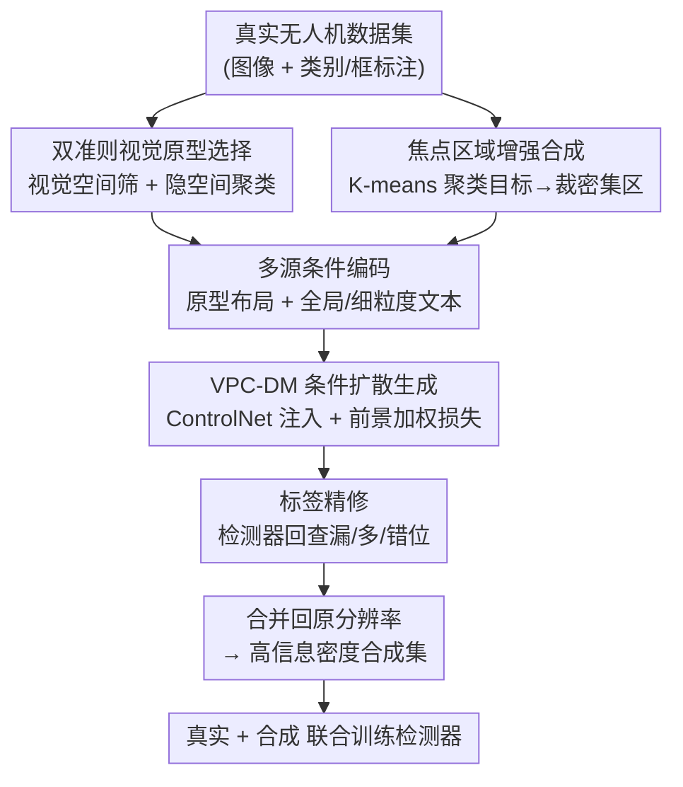

# Visual Prototype Conditioned Focal Region Generation for UAV-Based Object Detection

**会议**: CVPR 2026  
**论文**: [CVF Open Access](https://openaccess.thecvf.com/content/CVPR2026/html/Li_Visual_Prototype_Conditioned_Focal_Region_Generation_for_UAV-Based_Object_Detection_CVPR_2026_paper.html)  
**代码**: https://github.com/Sirius-Li/UAVGen  
**领域**: 目标检测 / 无人机视觉 / 扩散模型数据增强  
**关键词**: UAV目标检测, layout-to-image, 视觉原型, 焦点区域, 标签精修

## 一句话总结
UAVGen 用扩散模型为无人机目标检测合成带标注的训练数据：先用「视觉原型」把模糊的小目标布局条件换成高质量参考实例，再只在目标密集的「焦点区域」做生成、并用检测器回过头精修标签，在 VisDrone 上仅靠 738 张合成图就把 mAP 从 24.5 提到 25.9。

## 研究背景与动机

**领域现状**：无人机（UAV）航拍目标检测的最大瓶颈是高质量标注数据稀缺——飞行场景动态多变，标注成本高。近年来用扩散模型做「layout-to-image」数据增强成为新范式：给定布局（每个目标的类别 + 边界框），合成一张与之对应的带标注图像，直接当作检测器的额外训练数据。这类方法（GeoDiffusion、AeroGen 等）在通用检测 benchmark 上已被验证有效。

**现有痛点**：可这套范式搬到无人机场景就明显失灵——在通用检测上涨点的方法，到了 VisDrone / UAVDT 上几乎不涨甚至掉点（论文 Table 2 里 GLIGEN、GeoDiffusion、AeroGen 用在 SOTA 检测器 RemDet 上反而把 mAP 拉低了）。

**核心矛盾**：作者把这个性能鸿沟归结为无人机图像的三个固有特性：

- **布局条件本身就低质**：受飞行高度和固定视角限制，目标普遍又小又密、相互重叠，从真实图里直接裁出来的目标 patch 模糊、纠缠，作为扩散模型的条件信号既不清晰、又干扰训练，导致合成图保真度低。
- **模型容量被浪费在无信息区**：无人机图里目标只集中在一小块区域，大片画面是空旷背景。扩散模型会把大量容量「平均」分配到这些低信息区，反而抓不住小目标的细粒度特征。
- **图像与标注对不上**：扩散过程天生有随机性，生成图会偏离输入布局，产生「漏生成 / 多生成 / 框位错位」，这在小目标主导的无人机场景被进一步放大，相当于往训练集里注入标签噪声。

**本文目标 & 切入角度**：与其在全图上硬生成，不如分三步治三病——把布局条件「升级」成高保真原型、把生成「聚焦」到目标密集区、再把合成标签「校正」一遍。

**核心 idea**：提出 UAVGen，由两大模块组成——**VPC-DM（视觉原型条件扩散模型）** 解决条件低质，**FRE-DP（焦点区域增强数据流水线）** 同时解决容量错配与标签不一致。这是据作者所知第一个专门面向无人机检测器训练的数据合成方法。

## 方法详解

### 整体框架

UAVGen 沿用「扩散驱动数据增强」的经典范式：真实数据集 $D^{real}=\{(I_i^{real}, L_i^{real})\}$ 训练一个扩散模型 $G_\theta$，让它根据布局 $L^{real}$ 和辅助条件合成新图像，组成合成集 $D^{syn}$；最后把 $D^{real}\cup D^{syn}$ 一起喂给检测器训练：

$$\phi^* = \arg\min_\phi \mathcal{L}_{det}\big(F_\phi(D^{real}\cup D^{syn})\big).$$

UAVGen 在这条主线上插入两个改造点。第一步 **VPC-DM** 负责「生成得更真」：从真实数据里挑出一批高质量目标实例当「视觉原型」，再把原型 + 全局/细粒度文本拼成多源条件，通过 ControlNet 注入扩散模型，配合一个前景加权损失，专门盯住目标区域。第二步 **FRE-DP** 负责「生成得更准、更高效」：不在全图上生成，而是先把目标密集处聚成若干「焦点区域」、只在这些区域上跑生成，再合并回原分辨率；生成完用预训练检测器把标签精修一遍，剔除漏/多/错位。两步串起来，输出一个保真度高、标签干净的合成集。

### 关键设计

**1. 双准则视觉原型选择：把模糊的目标 patch 换成可信的高质量参考实例**

痛点很直接——训扩散模型做条件生成时，常规做法是把布局里所有目标区域直接裁出来当监督。但无人机目标又小又密又重叠，裁出来的 patch 充满噪声、质量参差，会让扩散训练不稳。作者的思路是：不要用「所有」目标，而是挑「干净」目标，称为视觉原型，分两层准则顺序筛选。

第一层在**视觉空间**筛外观清晰、定位准确的目标。用一个预训练检测器 $D(\cdot)$ 在 $D^{real}$ 上跑一遍，按预测类别分组得到 $G^c=\{(b_i^{det}, s_i)\}$；注意到每类的置信度 $s$ 大致服从正态分布 $N(\mu_c, \sigma_c^2)$，于是只保留**定位准（与真值框 IoU≥$\tau^{det}$）且置信度高于 $\alpha$ 分位数**的候选：

$$\mathcal{V}^c=\{b_i^{real}\mid (b_i^{det}, s_i)\in G^c,\ \mathrm{IoU}(b_i^{real}, b_i^{det})\ge\tau^{det},\ s_i\ge\Phi_c^{-1}(\alpha)\}.$$

第二层在**隐空间**进一步澄清细粒度类别边界、减少生成混淆。把每个候选 patch 用 VAE 编码器 $\mathcal{E}_{img}$ 编成隐表征，只保留那些**隐嵌入离类中心 $\mu^c$ 足够近**的候选，组成最终原型集 $P^c$：

$$P^c=\{b\in\mathcal{V}^c\mid \|\mathcal{E}_{img}(b)-\mu^c\|^2<\tau^{lat}\},\quad \mu^c=\frac{1}{|\mathcal{V}^c|}\sum_{b\in\mathcal{V}^c}\mathcal{E}_{img}(b).$$

之所以有效：模糊小目标是无人机条件信号最弱的环节，先用检测器置信度 + IoU 滤掉定位不准的，再用隐空间距离把外观跑偏（同类里的离群样本）的也滤掉，留下的是「这个类长什么样」最有代表性的一小撮——后续生成相当于拿着清晰范本去画，而不是拿模糊样本去猜。

**2. 多源条件编码：用原型拼出的布局图 + 双层文本，给扩散模型更强的可控信号**

光有原型还不够，得把它们组织成扩散模型能吃的条件。对布局里每个区域 $(b_j^{real}, c_j^{real})$，从对应类的原型集里采一个原型 $P_j$，按目标尺度做几何变换后**贴到一张全零空白画布的 $b_j^{real}$ 位置**，得到合成图 $I_j^{blank}$。再把所有区域的隐表征沿原型维度用一个 3D 卷积网络聚合成布局嵌入 $v_i$（N 个 $B\times C\times H\times W$ 特征堆成 $B\times N\times C\times H\times W$，融合为 $B\times1\times C\times H\times W$，原型不足 N 时用可学习 padding 补齐）：

$$v_i=\mathrm{Conv}\big(\mathcal{E}_{img}(I_1^{blank}),\dots,\mathcal{E}_{img}(I_{n_i}^{blank})\big).$$

文本侧给出两条互补提示：全局 prompt $t^g=$「An aerial image with car, bus, people…」直接编码成全局嵌入 $e_i^g$；对象级 prompt $t^{c_j}=$「An aerial image of {类别}」则借鉴 GLIGEN，把文本嵌入与框的傅里叶位置编码 $\mathcal{F}(b_j)$ 拼接、过 MLP，再用门控注意力 $GA(\cdot)$ 聚合成细粒度布局嵌入 $e_i^f$：

$$e_i^f=GA\Big(\big\{\mathrm{MLP}([\mathcal{E}_{text}(t^{c_j});\mathcal{F}(b_j^{real})])\big\}_{j=1}^{n_i}\Big).$$

为什么这样有效：单纯文本 prompt 说不清「这个小目标具体长啥样」，单纯布局框又只有位置没有外观。把**原型贴出来的视觉布局**（管外观+位置）和**双层文本**（管全局语义+对象类别）并起来，等于同时锁住「画什么、画在哪、整张图什么调性」，这正对应无人机条件信号弱的痛点。

**3. ControlNet 注入与前景加权损失：让监督信号偏向目标区**

视觉布局嵌入 $v_i$ 和细粒度文本嵌入 $e_i^f$ 通过 ControlNet 注入，产出布局感知条件特征 $\mathcal{C}_i=CN(x_t, t\mid v_i, e_i^f)$；全局嵌入 $e_i^g$ 和 $\mathcal{C}_i$ 一起引导去噪网络 $\epsilon_\theta$，既保住整体场景语义又保住细粒度目标布局。关键在损失——针对无人机「目标占比极小」的特点，用一张由布局 $L^{real}$ 导出的空间权重图 $w$ 对 denoising loss 做前景加权：

$$\mathcal{L}_{layout}=w\odot\mathbb{E}_{x_0,t,\epsilon}\big[\|\epsilon-\epsilon_\theta(x_t, t\mid e_i^g, \mathcal{C}_i)\|^2\big],$$

目标区域权重 >1、背景区域保持 1。这样梯度不会被大片背景稀释，模型容量被强制偏向小目标，直接回应了「容量浪费在无信息区」这条痛点。

**4. 焦点区域增强 + 标签精修：只在密集区生成、再回查校正标签**

这是 FRE-DP 的两件事，合起来同时治「容量错配」和「图标不一致」。

**焦点区域生成**：先算每个框 $b_j^{real}$ 的几何中心 $p_j$，对所有中心做 K-means 得到 $K$ 个簇心 $m_k$；再对每个簇心，通过**重叠最大化**求出焦点区域 $B_k$——在以 $m_k$ 为中心的等大候选窗里，选能把最多完整目标框包进来的那个：

$$B_k=\arg\max_{B\in\Omega(m_k)}\sum_j\mathbb{I}[b_j^{real}\cap B=b_j^{real}].$$

把这些目标密集的区域裁出来构成「高信息密度数据集」$D^{real}_{dense}$，**替代全图**作为 VPC-DM 的训练与生成目标；生成完再把焦点区域图像合并回原分辨率，组成 $D^{syn}_{dense}$。这一步妙在：小目标在低分辨率焦点区里相对更大、更清晰（消融 Table 4 印证：焦点区分辨率从 1024 降到 256，mAP 反而从 25.3 升到 25.9——区域越小、小目标生成质量越高）。

**标签精修**：合成图难免和输入布局对不上，作者把不一致分三类逐个修。先用预训练检测器在合成图上跑出预测 $L^{det}$，与真值框按 IoU≥$\tau^{ref}$ 匹配得配对集 $\mathcal{M}$。① **漏生成**：扩散模型没画出来的目标，只保留能被检测器对上、且置信度过 $\alpha$ 阈值的标签，把漏掉的从标注里删掉；② **多生成**：图里多出来的目标，若检测置信度过 $\beta$ 阈值就**补进标签**（把意外生成的真目标收编为正样本）；③ **错位**：对已配对的框，若检测置信度过 $\gamma$ 阈值就用检测框 $(b_j^{det}, c_j^{det})$ 替换原标注、否则保留原值。三个阈值 $\alpha,\beta,\gamma$ 都按检测器 $D(\cdot)$ 的精度来设。最终精修集 $D^{ref}=(I^{syn}, L^{ref})$ 才进检测器训练——相当于在「拿合成数据训练」前，先用一个检测器把标签噪声洗一遍。

### 损失函数 / 训练策略
核心训练目标就是上面的前景加权 denoising 损失 $\mathcal{L}_{layout}$。整套基于 FLUX 模型：学习率 1e-5、训 60K 步、batch 8、单张 A800、512×512 分辨率；扩散主干、文本编码器、VAE 编码器都用 FLUX 预训练权重并冻结，只微调其余参数。视觉原型选择和标签精修都用 Faster R-CNN 当那个预训练检测器 $D(\cdot)$。

## 实验关键数据

### 主实验

在 VisDrone 和 UAVDT 上，同时比 FID（生成质量，越低越好）和 AP（检测精度，越高越好）。FID 评测时只用 VPC-DM，可训练性评测用完整方法。

| 数据集 | 方法 | FID↓ | mAP↑ | AP50↑ | APs↑ |
|--------|------|------|------|-------|------|
| VisDrone | Real only | - | 24.5 | 42.1 | 15.4 |
| VisDrone | GeoDiffusion | 57.96 | 24.7 | 42.9 | 15.4 |
| VisDrone | AeroGen | 48.04 | 24.9 | 43.3 | 15.6 |
| VisDrone | **UAVGen** | **34.34** | **25.9** | **44.8** | **16.7** |
| UAVDT | Real only | - | 14.5 | 26.1 | 10.3 |
| UAVDT | AeroGen | 31.99 | 15.0 | 28.3 | 10.7 |
| UAVDT | **UAVGen** | **29.73** | **16.6** | **30.9** | **11.7** |

FID 在 VisDrone / UAVDT 上分别比次优低 13.7 / 2.3；mAP 在两库上分别 +1.4 / +2.1，UAVDT 的 AP50 更是大涨 4.8。值得注意：在 VisDrone 上这些增益**只用了 738 张合成图**，而对比方法都按训练集规模生成（6,474 张）。小目标指标 APs 也涨（VisDrone +1.3），而其他方法在小目标上几乎不动。

应用到 SOTA 检测器 RemDet-X（基于 YOLO）上，对比的反差更刺眼：

| 方法 | mAP↑ | AP50↑ | AP75↑ |
|------|------|-------|------|
| Real only | 29.8 | 48.1 | 30.8 |
| GLIGEN | 29.4 | 47.7 | 30.2 |
| GeoDiffusion | 29.4 | 47.8 | 30.2 |
| AeroGen | 28.8 | 46.9 | 29.6 |
| **UAVGen** | **30.2** | **48.7** | **31.1** |

对比方法全部把 SOTA 检测器**拖累到比 real-only 还低**，唯独 UAVGen 还能稳定涨点——说明已有数据增强对强检测器是负作用，而 UAVGen 的高保真+干净标签才真正补上了价值。

### 消融实验

VPC-DM 拆成视觉原型（VP）、布局嵌入（LE）；FRE-DP 拆成焦点区域生成（FR）、标签精修（LR）。基线 24.5 mAP / 42.1 AP50。

| Gen. | VP | LE | FR | LR | mAP↑ | AP50↑ | 说明 |
|------|----|----|----|----|------|-------|------|
| - | - | - | - | - | 24.5 | 42.1 | 仅真实数据 |
| ✓ | - | - | - | - | 23.8 | 42.1 | 裸生成反而掉点 |
| ✓ | ✓ | - | - | - | 24.1 | 42.4 | 加视觉原型 |
| ✓ | ✓ | ✓ | - | - | 25.2 | 43.8 | VPC-DM 完整 |
| ✓ | ✓ | ✓ | ✓ | - | 25.5 | 44.5 | +焦点区域 |
| ✓ | ✓ | ✓ | - | ✓ | 25.5 | 44.2 | +标签精修 |
| ✓ | ✓ | ✓ | ✓ | ✓ | **25.9** | **44.8** | 完整 UAVGen |

| 焦点区分辨率 | mAP↑ | AP50↑ | AP75↑ |
|------|------|-------|------|
| 1024 | 25.3 | 43.9 | 25.3 |
| 512 | 25.6 | 44.7 | 25.4 |
| 256 | **25.9** | **44.8** | **26.0** |

### 关键发现
- **「裸生成」是负收益**：不加任何模块直接拿合成图训练，mAP 从 24.5 掉到 23.8——印证了无人机场景下普通 layout-to-image 增强确实有害，必须靠 VP+LE+FR+LR 逐级把它从负变正。
- **VPC-DM 与 FRE-DP 贡献相当**：两者各自在 VPC-DM 基础上带来 +0.7 mAP，且叠加后达到峰值 25.9，说明「改条件质量」和「改生成区域+洗标签」是互补的两条线。
- **焦点区分辨率越低越好**：1024→256，mAP 单调上升。原因是把密集小目标裁进小分辨率窗口后，小目标在生成图里相对更大更清晰——这是反直觉但很有用的实践结论。
- **数据效率极高**：仅 100 张合成图就能追平用 6,474 张全量图的 AeroGen，合成图越多检测越好，体现 FRE-DP「把容量花在刀刃上」的价值。

## 亮点与洞察
- **「先选原型再生成」的思路可迁移**：把「拿所有样本当条件」换成「拿一小撮高质量代表当条件」，本质是用检测器置信度 + 隐空间聚类做了一次数据净化。这套双准则净化在任何「以真实样本为生成条件」的任务（医学小病灶、遥感小目标）都能复用。
- **焦点区域是对无人机稀疏分布的精准回应**：不在全图硬卷，而是 K-means + 重叠最大化框出目标密集区、只在那里生成——既省算力又提质量，且「低分辨率反而更好」的发现很实用。
- **标签精修把生成的随机性变成了收益**：多生成的目标不是丢弃而是「收编」为正样本，相当于让扩散模型的随机性帮检测器扩充正例，这个视角比单纯「对齐到输入布局」更聪明。
- **对 SOTA 检测器仍涨点**最有说服力：在已经很强的 RemDet 上，别家增强都掉点、只有它涨，说明高保真+干净标签才是数据增强对强模型有用的前提。

## 局限与展望
- **依赖预训练检测器的质量**：原型选择和标签精修都拿 Faster R-CNN 当裁判，三个阈值 $\alpha,\beta,\gamma$ 也按它的精度设。若该检测器在某类上本就弱，原型会选偏、标签会洗错，存在误差传递风险。
- **只在两个 UAV benchmark 上验证**：VisDrone / UAVDT 都是常见视角，作者自己也承认对「视角/高度变化带来的外观和尺度剧变」尚未充分应对，真实复杂无人机场景的鲁棒性待验。
- **向遥感/远距监控的外推是「计划中」而非已验证**：结论部分说 FRE-DP 的小目标优化「自然延伸」到遥感，但明确标注 validation planned for future work，目前没有实验支撑。
- **改进思路**：把裁判检测器换成更强的开集检测器、或对原型选择引入不确定性估计，可能缓解误差传递；阈值若能自适应每类难度而非全局设定，会更稳。

## 相关工作与启发
- **vs GeoDiffusion / AeroGen**：同属 layout-to-image 数据增强，但它们直接拿真实布局当条件、在全图生成，到无人机小目标场景就保真度低、标签噪声大；UAVGen 的差异是「换条件（视觉原型）+ 换区域（焦点区）+ 洗标签」三连击，因此能在小目标和 SOTA 检测器上反超。
- **vs GLIGEN**：UAVGen 的细粒度文本嵌入直接借鉴 GLIGEN 的「文本 + 傅里叶位置编码 + 门控注意力」做对象级 grounding，但额外叠了视觉原型布局图这条视觉条件线，针对无人机「文本说不清小目标外观」补足。
- **vs Copy-Paste / 渲染合成**：Copy-Paste 在目标边界留明显伪影、渲染法有 sim-to-real 域差；UAVGen 用扩散生成天然图像、再用焦点区域和标签精修压住小目标伪影与对齐问题。
- **启发**：「数据增强对强检测器普遍掉点」这个现象本身值得记住——它提示合成数据的价值高度依赖保真度和标签纯净度，盲目加合成数据可能适得其反。

## 评分
- 新颖性: ⭐⭐⭐⭐ 首个面向无人机检测器训练的数据合成框架，视觉原型 + 焦点区域 + 标签精修的组合针对性强，但各组件多为已有思路（ControlNet、GLIGEN、K-means）的巧妙拼装。
- 实验充分度: ⭐⭐⭐⭐ 两库双指标 + 通用/SOTA 双检测器 + 完整逐模块消融 + 分辨率/数据量分析，证据链扎实；但只两个 benchmark、遥感外推未验证。
- 写作质量: ⭐⭐⭐⭐ 三痛点对三模块的逻辑清晰，图表呼应，公式完整；个别符号和文字小瑕疵。
- 价值: ⭐⭐⭐⭐ 无人机检测数据稀缺是真痛点，738 张合成图就涨点、且对 SOTA 检测器仍有效，实用价值高，代码开源。

<!-- RELATED:START -->

## 相关论文

- [\[CVPR 2026\] UAVGen: Visual Prototype Conditioned Focal Region Generation for UAV-Based Object Detection](uavgen_visual_prototype_conditioned_focal_region_generation_for_uav_based_object_detection.md)
- [\[CVPR 2026\] Tri-Modal Fusion Transformers for UAV-based Object Detection](tri-modal_fusion_transformers_for_uav-based_object_detection.md)
- [\[CVPR 2026\] UAV-CB: A Complex-Background RGB-T Dataset and Local Frequency Bridge Network for UAV Detection](uav-cb_a_complex-background_rgb-t_dataset_and_local_frequency_bridge_network_for.md)
- [\[CVPR 2026\] Prompt-Free Universal Region Proposal Network](prompt-free_universal_region_proposal_network.md)
- [\[CVPR 2026\] Beyond Prompt Degradation: Prototype-Guided Dual-Pool Prompting for Incremental Object Detection](beyond_prompt_degradation_prototype-guided_dual-pool_prompting_for_incremental_o.md)

<!-- RELATED:END -->
