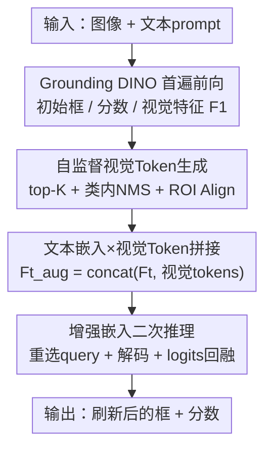

# ViTPrompt: Training-Free Prompt Refinement with Visual Tokens for Open-Vocabulary Detection

**会议**: CVPR 2026  
**论文**: [CVF Open Access](https://openaccess.thecvf.com/content/CVPR2026/html/Qin_ViTPrompt_Training-Free_Prompt_Refinement_with_Visual_Tokens_for_Open-Vocabulary_Detection_CVPR_2026_paper.html)  
**代码**: https://github.com/buerzlh/Test-timeAdaptation-for-Object-Detection (有)  
**领域**: 目标检测  
**关键词**: 开放词表检测, 测试时自适应, 视觉提示, Grounding DINO, 免训练

## 一句话总结
针对开放词表检测在域偏移下"框歪了也没人修"的问题，ViTPrompt 把首遍检测里高置信目标的 RoI 视觉 token 拼进文本提示，再跑一遍 Grounding DINO，靠免训练的两阶段推理同时刷新边界框和分类分数，在多个 OOD 基准上拿到 SOTA。

## 研究背景与动机
**领域现状**：测试时自适应目标检测（TTAOD）想让检测器在部署时遇到天气、光照、场景等分布偏移时无需重训也能保持性能。随着 CLIP、Grounding DINO 这类视觉语言模型（VLM）兴起，开放词表检测——用任意文本 prompt 检测任意类别——成为可能，自然有人把 TTA 搬到开放词表场景。

**现有痛点**：无论是基于 Faster R-CNN 的闭集 TTAOD（STFAR、MemCLR），还是基于 VLM 的开放词表 TTAOD（VLOD-TTA、BCA/BCA+），几乎都只在"提升分类置信度"上下功夫——做特征对齐、熵最小化、分类器重校准——而**完全不碰边界框**。结果是分数涨了，框却可能又自信又歪：雾天里目标尺度畸变、遮挡导致边界错位，模型给出高置信但空间上不准的定位。

**核心矛盾**：基于 VLM 的现有方法把 prompt 当成**静态输入**。Grounding DINO 的查询选择是靠"视觉特征 × 固定文本嵌入"的最大相似度来挑 query 的；一旦文本嵌入 $F_t$ 因为简短、歧义或域差而和域偏移后的视觉特征对不上，挑出来的 query 既会误分类、定位也会跑偏。BCA+ 虽然免训练，但只在**类别层面**做贝叶斯缓存，不会根据每个实例的视觉证据去改语言查询，对模糊或损坏的 proposal 适应力有限。

**本文目标**：在测试时**同时**精化边界框和分类分数，且要免反传、免参数更新、免外部记忆，能实时跑。

**切入角度**：作者的关键观察是——首遍前向里那些高置信检测，本身就携带着宝贵的视觉线索；把这些线索投影回语言空间去丰富语义上下文，就能让 cross-modal decoder 在第二遍重新关注更相关的图像区域。

**核心 idea**：用首遍检测自产的"实例级视觉 token"去增强文本 prompt，再跑一遍解码——同一套解码机制顺带就把框和分数都刷新了，全程不动模型权重。

## 方法详解

### 整体框架
ViTPrompt 是一个建立在冻结 Grounding DINO 上的**两阶段免训练推理管线**。给定一张测试图 $x_i$ 和文本 prompt（如 "truck . bicycle . person ."），Grounding DINO 的双编码器先产出增强视觉特征 $F_v\in\mathbb{R}^{N_I\times d}$、文本特征 $F_t\in\mathbb{R}^{K\times d}$（$d=256$，$K$ 为类别数，$F_t$ 充当动态分类器），再用语言引导的 query 选择 $I=\text{Top}_N(\text{Max}_{(-1)}(F_v F_t^\top))$ 挑出 $N=900$ 个 query，经 DETR 式解码得到框、分类 logits 和置信分数。

ViTPrompt 在这套基线之上加两步：**阶段一**用首遍输出筛出可靠实例、RoI-Align 抠出视觉 token；**阶段二**把这些 token 拼进文本嵌入得到 $F_t^{aug}$，再用它重做一遍 query 选择和解码，最后把扩展后的 logits 折回原始 $K$ 类。整条管线只多一次前向，不需要反传或缓存。

### 关键设计

**1. 自监督视觉 Token 生成：从首遍高置信检测里挑出"靠谱实例"再抠特征**

阶段二要往 prompt 里塞视觉证据，但首遍那 $N=900$ 个 proposal 鱼龙混杂，直接全塞进去只会引入噪声。所以这一步先做**筛选**：把所有 proposal 按分数 $s_q$ 降序排，取 top-$K$ 个 $\{b_k,p_k^{init},s_k\}_{k=1}^K$ 作为锚点；再令 $C=\{\arg\max(p_k^{init})\}$ 为这 top-$K$ 覆盖的"显著类别"，丢掉所有预测类不在 $C$ 里的 proposal，把适应范围限制在域相关语义上。接着对每个类 $c\in C$ 做**类内 NMS**：候选框 $b_q$ 与同类锚点 $b_k$ 算 IoU

$$\text{IoU}(b_q,b_k)=\frac{b_q\cap b_k}{b_q\cup b_k},$$

若 $\text{IoU}>\theta$（$\theta=0.6$）且 $s_q<s_k$ 则抑制 $b_q$，得到去冗余的精化集 $\{(b_m,p_m^{init},s_m)\}_{m=1}^M$。最后从**最大尺度特征图** $F_1\in\mathbb{R}^{d\times H'\times W'}$ 上，对每个框（按下采样因子 4 映射到特征坐标）做 RoI-Align 抠出定长视觉 token $v_m=\text{ROIAlign}(F_1,b_m)\in\mathbb{R}^d$。这一步是"自监督"的——监督信号完全来自模型自己首遍的高置信预测，不需要任何标注。

**2. 文本嵌入 × 视觉 Token 拼接：把实例视觉证据注入语言提示**

有了实例视觉 token，就把它们沿行维拼到原文本嵌入后面：

$$F_t^{aug}=\text{concat}(F_t,[v_1;v_2;\dots;v_M])\in\mathbb{R}^{(K+M)\times d}.$$

这一步是整个方法的灵魂——原来的 $F_t$ 是一组**静态、与图像无关**的语言向量，雾天来了它纹丝不动；而拼进来的 $v_m$ 是当前这张图、这些具体目标的视觉指纹。增强后的 $F_t^{aug}$ 等于给"动态分类器"补充了一批"图像条件下的类别原型"，让后续的 query 选择不再只盯着僵硬的文本嵌入，而能借实例视觉线索跨过域差。消融（表 4）证明：相比纯文本嵌入（等价于裸 Grounding DINO），这种 max 融合在 FoggyCityscapes/COCO-C 上分别带来 +0.21/+0.68 mAP。

**3. 增强嵌入二次推理 + 扩展 logits 回融：一遍解码同时刷新框与分数**

拿到 $F_t^{aug}$ 后，阶段二**原地替换** $F_t$ 重跑 query 选择与解码，不改任何架构或参数。先用增强嵌入重算 query 索引 $\hat I=\text{Top}_N(\text{Max}_{(-1)}(F_v(F_t^{aug})^\top))$——因为 $F_t^{aug}$ 里有实例视觉线索，新挑出的 query $\{\hat q_j\}=F_v[\hat I]$ 更贴合域偏移后的视觉特征。DETR 解码器再用 $F_v$ 和 $F_t^{aug}$ 精化这些 query，得到新的 proposal 嵌入 $\hat f_q$、扩展 logits $\hat l_q=\sigma(\hat f_q (F_t^{aug})^\top)\in\mathbb{R}^{K+M}$，以及用同一回归头重新回归的**新框** $\hat b_q$——注意框是从 $\hat f_q$ 重新解出来的，所以定位真的被刷新了，而不只是重打分。

由于 logits 现在有 $K+M$ 维（前 $K$ 维对应文本类、后 $M$ 维对应视觉 token），要折回原始 $K$ 类。每个视觉 token 都带着它来源 proposal 的类别 $\arg\max(p_m^{init})$，于是对每个类 $k$ 取文本维和所有同类视觉维里的**最大值**：

$$\bar l_q[k]=\max\Big(\{\hat l_q[k]\}\cup\{\hat l_q[K+m]\mid \arg\max(p_m^{init})=k\}\Big).$$

分数取 $\hat s_q=\max(\bar l_q)$，按 $\hat s_q\ge\tau_2$ 过滤得到最终检测。这个 max 回融的妙处在于：哪怕文本嵌入对某个雾中目标打分很低，只要某个视觉 token 给它打了高分，这个目标就能被"救"回来——这正是 ViTPrompt 能生成**新分类假设**、而非仅做事后校准的关键。

### 损失函数 / 训练策略
完全免训练：所有模型用预训练冻结权重，测试时不做任何梯度计算或参数更新。主要超参为视觉 token 数 $K$、NMS 阈值 $\theta=0.6$、置信阈值 $\tau_1=\tau_2=0.2$；prompt 模板沿用 BCA+ 的 "[class 1] . [class 2] . ⋯"。全部实验在单张 RTX 2080Ti 上完成。

> ⚠️ 关于 $K$：实现细节里写"每目标视觉 token 数 $K=5$"，但敏感性分析（图 3）又说最优在 $K=10$，两处不一致，以原文为准。

## 实验关键数据

### 主实验
在三个域偏移开放词表检测基准上评测，metric 为 mAP50。FoggyCityscapes 是物理雾仿真的真实自动驾驶场景；PASCAL-C / COCO-C 是对 VOC / COCO 施加 15 类损坏 × 5 级强度的合成基准。所有 TTA 方法均 backprop-free。

| 基准 (Swin-B) | 裸 GDINO | TDA | BCA+ | **ViTPrompt** | 较 BCA+ |
|--------------|---------|------|------|--------------|--------|
| FoggyCityscapes | 31.34 | 34.31 | 36.22 | **37.27** | +1.05 |
| PASCAL-C (avg) | 63.15 | 65.64 | 69.31 | **71.40** | +2.09 |
| COCO-C (avg) | 35.97 | 37.64 | 39.98 | **42.28** | +2.30 |

Swin-T 下同样全面领先（PASCAL-C 43.03 vs BCA+ 40.67；COCO-C 26.25 vs 25.06；FoggyCityscapes 29.10 vs 26.65），且**在 PASCAL-C / COCO-C 的每一种损坏类型上都刷新 SOTA**。雾天里 Bus（+2.64）、Bicycle（+4.15）这类被雾严重糊掉外观的难类提升尤其明显。

### 消融实验
| 配置 | FoggyCityscapes | COCO-C(avg) | 说明 |
|------|----------------|-------------|------|
| Text-only（无视觉融合，≈裸 GDINO） | 28.89 | 25.57 | 只用静态文本嵌入 |
| ViTPrompt（max 融合，Eq.7） | 29.10 | 26.25 | +0.21 / +0.68，证明视觉融合有效 |
| GDINO（mAP@0.5:0.95，Swin-T） | 15.65 | 15.27 | 严格 IoU 下的定位基线 |
| ViTPrompt（mAP@0.5:0.95，Swin-T） | **19.02** | **18.36** | +3.37 / +3.09，定位真被改善 |

效率上（表 6，Swin-T，600×600）：参数仅 +0.05M（58.30→58.35M），FLOPs 因 RoI 抠 token 与二次推理升到 252.26G（约 1.7×），但峰值显存与基线**完全相同**（2946MB）——靠即时复用 RoI 特征、不额外缓存。

### 关键发现
- **定位提升是真的**：在更严格的 mAP@0.5:0.95 上 +3.37/+3.09，说明 ViTPrompt 不是靠在 IoU=0.5 下刷分，而是确实把粗糙/错位的框纠正了——这正是它区别于所有"只改分数"TTA 的核心证据。
- **视觉融合贡献明确但增量温和**：表 4 显示去掉视觉融合就退化成裸 GDINO，掉 +0.21~+0.68；增量看着小，但考虑到 COCO-C 要在 80 类、严重损坏下适应，且每个损坏类都刷了 SOTA，含金量不低。
- **超参鲁棒**：top-$K$ 在 $K=10$ 附近最优，太少缺判别性、太多引噪声；NMS 阈值 $\theta$ 在 $[0.2,0.8]$ 内都稳定，说明增益**不是靠激进后处理**堆出来的。
- **随容量扩展性好**：COCO-C 上 Swin-T→Swin-B 的提升（+16.03）超过 BCA+（+14.92），region-aware prompting 能更好利用高容量特征。

## 亮点与洞察
- **"自产视觉 token 回灌 prompt"是个很轻的杠杆**：不引外部 CLIP、不缓存、不反传，只复用 Grounding DINO 自己最大尺度特征图的 RoI 区域，就把"图像证据"喂回了语言侧——这种"让模型用自己的高置信预测教自己"的自监督闭环很优雅。
- **一次解码同时改框和分数**：最巧的是框是从二次解码的 query 嵌入**重新回归**出来的，而不是另起一套定位修正模块；改 prompt → 改 query 选择 → 改解码，定位和分类被同一条因果链顺手都带上了。
- **扩展 logits 的 max 回融可迁移**：把"$K$ 个文本原型 + $M$ 个实例视觉原型"拼成统一分类器、再按类取 max 折回，这套思路可推广到任何"文本类别 + 少量视觉示例"的开放词表打分场景，相当于免训练的 test-time few-shot 原型增强。

## 局限与展望
- **依赖首遍高置信预测的质量**：整个视觉 token 都来自首遍的 top-$K$ 检测，如果域偏移严重到首遍连一个靠谱目标都给不出（全是低置信或全错），那拿来增强 prompt 的 token 本身就是噪声，方法会失效——作者未讨论这种崩溃边界。
- **计算翻倍**：要跑两遍前向，FLOPs ~1.7×，对真正实时（高帧率）部署仍是负担；虽然显存不变，但延迟代价没有量化报告。
- **只在 Grounding DINO 上验证**：方法强绑定 GDINO 的"region-to-text 原生对齐 + 语言引导 query 选择"机制，是否能迁到 OV-DETR、GLIP 等其他 OV 检测器未知。
- **超参不一致 + 增益偏小**：$K=5$ vs $K=10$ 的文本前后矛盾，且 mAP50 上对 BCA+ 的提升多在 1~2 点，部分场景增量温和。

## 相关工作与启发
- **vs BCA / BCA+**：BCA+ 也是免训练 TTAOD，用贝叶斯缓存在**类别层面**联合估计似然与先验，但它把 prompt 当静态、不按实例视觉证据改语言查询。ViTPrompt 下沉到**实例层面**，用 RoI 视觉 token 动态改 prompt，因此能纠正模糊/损坏 proposal，定位也一并刷新；代价是要多一遍前向。
- **vs TDA**：TDA 用轻量 cache 在测试时精化预测，但同样只动分数。ViTPrompt 的根本差异是**生成新的分类假设和新框**，而非事后校准既有 proposal。
- **vs TPT 类 prompt-tuning TTA**：TPT/DiffTPT 靠测试时反传优化文本 prompt，需要梯度、难实时。ViTPrompt 用前向抠 token 拼接代替梯度优化，免反传、显存不增，更适合部署。
- **vs 闭集 TTAOD（STFAR/MemCLR）**：它们绑定 Faster R-CNN、限定预设类别且依赖昂贵反传；ViTPrompt 站在开放词表 VLM 上，既支持任意类别又免训练。

## 评分
- 新颖性: ⭐⭐⭐⭐ 首个在开放词表 TTAOD 里同时改框与分数、且用"自产视觉 token 回灌 prompt"实现的免训练框架，切入点（没人修框）很准。
- 实验充分度: ⭐⭐⭐⭐ 三基准 × 两 backbone × 15 损坏全面对比，含定位专项（mAP@0.5:0.95）、融合消融、超参敏感性与效率分析，较扎实；但缺失首遍质量崩溃下的鲁棒性分析、延迟量化。
- 写作质量: ⭐⭐⭐⭐ 动机清晰、公式与算法完整、图示到位；扣分在 $K$ 超参前后矛盾。
- 价值: ⭐⭐⭐⭐ 即插即用、显存零增、对真实雾天自动驾驶等 OOD 场景有实用价值，代码开源。

<!-- RELATED:START -->

## 相关论文

- [\[CVPR 2026\] PET-DINO: Unifying Visual Cues into Grounding DINO with Prompt-Enriched Training](pet-dino_unifying_visual_cues_into_grounding_dino_with_prompt-enriched_training.md)
- [\[CVPR 2026\] WeDetect: Fast Open-Vocabulary Object Detection as Retrieval](wedetect_fast_open-vocabulary_object_detection_as_retrieval.md)
- [\[CVPR 2026\] SRA-Det: Learning Omni-Grained Open-Vocabulary Detection Beyond Category Names](sra-det_learning_omni-grained_open-vocabulary_detection_beyond_category_names.md)
- [\[CVPR 2026\] Prompt-Free Universal Region Proposal Network](prompt-free_universal_region_proposal_network.md)
- [\[CVPR 2026\] Consistency Beyond Contrast: Enhancing Open-Vocabulary Object Detection Robustness via Contextual Consistency Learning](consistency_beyond_contrast_enhancing_open-vocabulary_object_detection_robustnes.md)

<!-- RELATED:END -->
