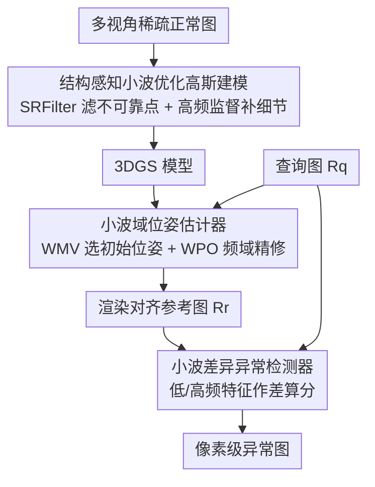

# Wavelet-Driven 3D Anomaly Detection under Pose-Agnostic and Sparse-View

**会议**: CVPR 2026  
**论文**: [CVF Open Access](https://openaccess.thecvf.com/content/CVPR2026/html/Shao_Wavelet-Driven_3D_Anomaly_Detection_under_Pose-Agnostic_and_Sparse-View_CVPR_2026_paper.html)  
**代码**: 待确认  
**领域**: 3D视觉 / 工业异常检测  
**关键词**: 位姿无关异常检测, 稀疏视角, 小波变换, 3D高斯, 频域定位

## 一句话总结
针对稀疏视角下位姿无关异常检测（PAD）会因观测不足而过拟合、位姿估计失准的问题，本文提出 Wave-Pose3D，把 3D 高斯重建、位姿估计、异常打分三个环节全部搬到小波频域里做，用低频管全局结构、高频管细节，在 10%/20% 稀疏视角下取得 SOTA。

## 研究背景与动机
**领域现状**：位姿无关异常检测（Pose-agnostic Anomaly Detection, PAD）要解决的是「测试图像位姿未知」时的 3D 缺陷定位。主流做法是先用多视角正常图像训一个 3D 表示（NeRF 或 3D Gaussian Splatting），再对查询图做位姿估计，最后比对渲染图与查询图在空间域的差异来算异常分。SplatPose、IGSPAD、PIAD 等近期工作都靠 3DGS 把重建和渲染做得又快又好。

**现有痛点**：这些方法全都默认有**密集多视角**输入，但工业现场采集大量视角既贵又不现实。一旦把视角砍到 10%–20%，整条 pipeline 就垮了——稀疏观测会让 3DGS 过拟合、几何细节丢失，重建出来的 3D 模型结构残缺；同时可靠的关键点对应变少，位姿估计误差被放大，渲染出现伪影，异常定位自然跟着错。论文 Figure 1 里 PIAD 在稀疏条件下位姿估歪、表面糊掉就是典型表现。

**核心矛盾**：标准 PAD 范式的三步（建表示、估位姿、算异常分）**全都在空间域（spatial domain）里做**。空间域对纹理缺失区、局部歧义、以及位姿轻微错位都非常敏感——这在密集视角下被冗余信息掩盖了，稀疏视角下就暴露无遗。

**本文目标**：让重建更完整、位姿更准、异常定位更鲁棒，三件事都要在稀疏视角下成立。

**切入角度**：作者的关键观察是——小波变换能把图像分解成一个低频分量（LL，刻画全局结构）和三个高频分量（LH/HL/HH，刻画水平/垂直/对角细节），天然带「空间-频率联合定位」。低频对噪声和错位不敏感、适合做全局对齐；高频精确刻画边缘纹理、适合补细节和抓微小缺陷。稀疏视角恰恰缺的就是「结构稳定性」和「细节保真度」，而这正好是低/高频各自擅长的。

**核心 idea**：把 PAD 的三个环节统统从空间域搬进**小波频域**，用低频组件做鲁棒的结构对齐、用高频组件做细节恢复与缺陷凸显，一套频域思路同时治好「过拟合、位姿失准、定位脆弱」三个病。

## 方法详解

### 整体框架
Wave-Pose3D 输入是某类物体的多视角正常图像 $\{R^i_c\}_{i=1}^N$（数量很少），输出是查询图 $R_q$ 上的像素级异常图。整条链路由三个串行模块组成：先用 **SWGM** 把稀疏图像建成一个去过拟合、保细节的 3DGS 表示；再用 **WPE** 在小波域里为查询图估出准确位姿，从而渲染出对齐良好的参考图 $R_r$；最后用 **WDAD** 在小波域比对 $R_r$ 与 $R_q$，产出异常分。三者共享同一个「小波分解 → 低频管结构、高频管细节」的设计哲学。

### 关键设计

**1. 结构感知 + 小波优化的高斯建模（SWGM）：稀疏视角下既抗过拟合又保细节**

稀疏视角下 3DGS 容易把噪声点也拟合进去，导致结构残缺、泛化差。SWGM 用两个机制对症下药。第一是**结构感知区域滤波（SRFilter）**：它给每个高斯点算一个「保留分」，综合两条线索——结构复杂度和深度一致性。结构复杂度用所有高斯点坐标的方差衡量，$s_{var}=\frac{\|v\|_2}{\max(\|v\|_2+\epsilon)}$，其中 $v=\mathrm{Var}(X)$，方差越大说明该处几何越剧烈波动、越可能是噪声；深度一致性用每个点到相机中心 $\Delta c$ 的距离归一化得到 $s_{depth,i}=\frac{d_i-\min(d)}{\max(d)-\min(d)+\epsilon}$，距离越小越可靠。两者融合出保留分 $r_i=\omega\cdot s_{depth,i}+(1-\omega)\cdot s_{low,i}$，其中 $s_{low,i}=(1-s_{depth,i})(1-s_{var,i})$ 是个偏向「低复杂度 + 高深度一致」的低频先验。再配一个余弦退火的丢弃率 $\delta_t=\delta_{min}+\frac{1}{2}(\delta_{max}-\delta_{min})(1+\cos(\frac{t}{T_{max}}\pi))$，最终保留概率 $p_i=\delta_t\cdot r_i$ 直接作用在每个高斯点的不透明度上，随机地把不可靠点压掉。这比直接 Dropout 更聪明——它不是均匀随机丢，而是按几何可靠性差异化地丢，所以泛化更好（消融里 Dropout 替换 SRFilter 直接掉 3.58 个点 I-AUROC）。

第二是**高频细节监督**：对渲染图和真值图都做小波变换，取三个方向的高频分量做 L1 一致性约束，$\mathcal{L}_{HF\text{-}cons}=\sum_{d\in\{H,V,D\}}\lambda_d\|c^{render}_d-c^{gt}_d\|_1$，权重设 $\lambda_H{=}\lambda_V{=}0.4,\lambda_D{=}0.2$（对角细节权重略低）。这一项强迫模型在频域里守住边缘和纹理，把稀疏视角下最容易糊掉的细节拉回来。总损失 $\mathcal{L}_{total}=\mathcal{L}_{color}+\mathcal{L}_{HF\text{-}cons}$。

**2. 小波域位姿估计器（WPE）：低频做全局对齐、高频做局部精修**

稀疏视角下可靠特征对应少，空间域的位姿初始化和优化都会大幅出错。WPE 分两阶段。**小波匹配验证（WMV）**负责初始化：先用查询图 $R_q$ 与各参考图的 MAE 粗筛，把 $N$ 张缩到 $n$ 张候选，降低后续匹配开销；然后把 $R_q$ 和候选都做小波变换，分别在高频和低频分量上用 EfficientLoFTR 做匹配，得到高频匹配分 $M^i_{HF}$ 和低频匹配分 $M^i_{LF}$，融合为 $M^i_{fusion}=\eta\cdot M^i_{HF}+(1-\eta)\cdot M^i_{LF}$，取分最高的那张无异常图的位姿作为初始位姿 $P_{init}$。这里 $\eta{=}0.8$ 偏重高频，因为初始匹配阶段细节对应比粗结构更能区分正确视角（消融里 $\eta{=}0.8$ 最优）。

**小波位姿优化（WPO）**负责精修：把相机位姿 $x=[S,\theta]$ 参数化到 $SE(3)$ 流形上（$T(x)=e^{[S]\theta}$），通过可微渲染拿到 $R(x)$，再在小波空间分别算低频和高频重建损失并加权，$\mathcal{L}_{opt}=\lambda_{opt}\mathcal{L}^{lf}_{opt}+(1-\lambda_{opt})\mathcal{L}^{hf}_{opt}$，这里 $\lambda_{opt}{=}0.4$。注意优化阶段权重偏向高频（$1-\lambda_{opt}=0.6$），和初始化阶段一样都在强调高频细节带来的精对齐。低频保证全局不跑偏、高频把局部抠准，这就是 WPE 在稀疏视角下比纯空间域稳的原因。

**3. 小波差异异常检测器（WDAD）：在频域作差，天生抗错位**

空间域算异常分有个硬伤——只要渲染图和查询图有轻微位姿/几何错位，逐像素作差就会把对齐误差误判成异常。WDAD 改在频域作差：用 EfficientNet-B4 从渲染图 $R_r$ 和查询图 $R_q$ 各抽多尺度特征，再做小波变换得到低频 $LF$ 和高频 $HF$，分别算 L2 差异 $S^l_L=\|LF^l_r-LF^l_q\|^2_2$、$S^l_H=\|HF^l_r-HF^l_q\|^2_2$，加权得最终异常分 $S=\alpha\cdot S^l_L+\beta\cdot S^l_H$，取 $\alpha{=}1,\beta{=}3$。频域作差的好处是它把「结构不一致」和「纹理噪声」解耦开了：低频差反映大尺度结构异常、高频差捕捉微小局部缺陷，而空间错位主要污染逐像素值、在频域里被天然抑制。$\beta{=}3$ 把高频权重抬高，是为了让检测器对细微局部缺陷更敏感。

## 实验关键数据

### 主实验
两个合成数据集 MAD_sim（20 个玩具物体）和 PIAD_synt（工业缺陷），均匀采样 10%/20% 视角模拟稀疏场景，指标用像素级（P）和图像级（I）AUROC。

| 方法 | MAD_sim(10%) I | MAD_sim(20%) I | PIAD_synt(10%) I | PIAD_synt(20%) I |
|------|------|------|------|------|
| OmniPoseAD | 57.0 | 59.7 | 61.9 | 69.7 |
| SplatPose | 58.4 | 60.0 | 65.3 | 71.0 |
| PIAD | 60.2 | 64.5 | 67.4 | 75.4 |
| DropGaussian | 62.3 | 67.5 | 70.1 | 77.8 |
| **Ours** | **64.6** | **69.1** | **73.2** | **82.3** |

四个设置全面领先，PIAD_synt(20%) 的图像级 AUROC 比次优 DropGaussian 高 4.5 个点。像素级同样最优（如 PIAD_synt(20%) P-AUROC 97.8 vs 97.3）。真实数据集 PIAD_real(20%) 上也最好（I-AUROC 87.6 vs DropGaussian 83.8）。

### 消融实验
在 PIAD_synt(20%) 上逐组件拆解（注：消融表中 baseline 的 I-AUROC 为 71.89，full 为 82.34）：

| 配置 | P AUROC | I AUROC | 说明 |
|------|---------|---------|------|
| Baseline | 95.89 | 71.89 | 无 SWGM，位姿/异常均空间域 |
| w/o SWGM | 97.69 | 80.05 | 去掉建模模块，I 掉 2.29 |
| w/o WPE | 97.51 | 78.65 | 换空间域位姿，I 掉 3.69 |
| w/o WDAD | 97.65 | 80.20 | 换空间域打分，I 掉 2.14 |
| **All** | **97.75** | **82.34** | 完整模型 |

SWGM 内部细分（Table 4）：去 SRFilter 或去 $\mathcal{L}_{HF\text{-}cons}$ 都掉点；尤其把 SRFilter 换成普通 Dropout，I-AUROC 从 82.34 跌到 78.76，验证差异化滤波比均匀丢弃更适合稀疏视角。

### 关键发现
- **WPE 贡献最大**：替换为空间域位姿估计后图像级 AUROC 掉 3.69 个点，是三个模块里掉点最多的——稀疏视角下位姿失准是最致命的瓶颈，频域多尺度对齐收益最大。
- **高频权重一致偏高**：WMV 的 $\eta{=}0.8$、WPO 的 $1-\lambda_{opt}{=}0.6$、WDAD 的 $\beta{=}3$，三处都把高频权重抬高，说明稀疏视角下「细节对应」比「粗结构对应」更能区分对错位姿和真异常。
- **像素级 AUROC 普遍接近饱和**（消融里都在 97 左右浮动、差异不到 0.5），真正拉开差距的是图像级 AUROC，说明各模块主要改善的是「整图是否含异常」的判别力。

## 亮点与洞察
- **「一套频域哲学打穿三个环节」很优雅**：重建、位姿、检测三件事原本各自为政，本文用同一个「低频管结构、高频管细节」的小波视角统一处理，模块间共享认知、互相强化，而不是堆三个不相干的 trick。
- **SRFilter 把「丢点」从随机变成有据可依**：用坐标方差当结构复杂度代理、用到相机距离当深度一致性代理，再配余弦退火丢弃率，等于给 3DGS 做了一个「按几何可靠性加权的软剪枝」，这个思路可迁移到任何稀疏视角 3DGS 重建任务。
- **频域作差抗错位的洞察很实用**：空间域逐像素差会把对齐误差误判为异常，搬到小波域后位姿微错位被天然抑制、结构异常与纹理噪声被解耦——这对所有「渲染-查询比对」式异常检测都有借鉴价值。

## 局限与展望
- **依赖合成为主的评测**：主战场是 MAD_sim 和 PIAD_synt 两个合成集，真实数据只在 PIAD_real 上做了一个 20% 设置，作者也坦言真实 PAD 数据集因 COLMAP 位姿误差导致可靠评测受限，泛化到真实工业噪声仍待验证。
- **像素级提升已近天花板**：消融显示各模块对像素级 AUROC 的改善很小（<0.5），主要收益集中在图像级，对「精确勾勒缺陷边界」这件事帮助有限。
- **多处超参手工设定**：$\lambda_d$、$\eta$、$\lambda_{opt}$、$(\alpha,\beta)$、$\omega$ 等都是经验调出来的固定值，跨数据集/物体类别是否需要重调、能否自适应，论文未深究。
- **小波基固定为 Haar**：只用了最简单的 Haar 小波，更高阶小波或可学习的频域分解是否带来增益是个自然的延伸方向。

## 相关工作与启发
- **vs OmniPoseAD（NeRF 派）**：OmniPoseAD 用 NeRF 学 3D 表示，训练慢、位姿优化效率低；本文用 3DGS 做表示，且把核心计算搬到频域，既快又在稀疏视角下更稳。
- **vs SplatPose / IGSPAD / PIAD（3DGS 空间域派）**：它们都用 3DGS 但三个环节都在空间域，默认密集视角，稀疏下位姿和检测全失稳；本文把同样的 3DGS 表示配上小波频域处理，专攻稀疏场景。
- **vs DropGaussian（稀疏重建派）**：DropGaussian 本是稀疏视角重建方法，本文为公平对比给它接上 PIAD 的位姿和异常模块。DropGaussian 位姿有时准但重建表面有伪影；本文的 SRFilter（差异化滤点）+ 高频监督让表面更干净，最终定位更准。

## 评分
- 新颖性: ⭐⭐⭐⭐ 把小波频域统一注入 PAD 三个环节、专攻稀疏视角，角度清晰且系统。
- 实验充分度: ⭐⭐⭐⭐ 两合成+一真实数据集、逐模块+超参消融齐全，但真实场景覆盖偏少。
- 写作质量: ⭐⭐⭐⭐ 动机推导顺、公式完整、图文对应清楚。
- 价值: ⭐⭐⭐⭐ 稀疏视角工业异常检测是真实痛点，频域抗错位思路可复用。

<!-- RELATED:START -->

## 相关论文

- [\[CVPR 2026\] Multi-view Crowd Tracking Transformer with View-Ground Interactions Under Large Real-World Scenes](multi-view_crowd_tracking_transformer_with_view-ground_interactions_under_large_.md)
- [\[CVPR 2026\] GS-CLIP: Zero-shot 3D Anomaly Detection by Geometry-Aware Prompt and Synergistic View Representation Learning](gs-clip_zero-shot_3d_anomaly_detection_by_geometry-aware_prompt_and_synergistic_.md)
- [\[CVPR 2026\] Reasoning-Driven Anomaly Detection and Localization with Image-Level Supervision](reasoning-driven_anomaly_detection_and_localization_with_image-level_supervision.md)
- [\[CVPR 2026\] Geometry-Aligned and Anomaly-Aware Reconstruction for 3D Anomaly Detection](geometry-aligned_and_anomaly-aware_reconstruction_for_3d_anomaly_detection.md)
- [\[ICCV 2025\] VOccl3D: A Video Benchmark Dataset for 3D Human Pose and Shape Estimation under Real Occlusions](../../ICCV2025/object_detection/voccl3d_a_video_benchmark_dataset_for_3d_human_pose_and_shape_estimation_under_r.md)

<!-- RELATED:END -->
