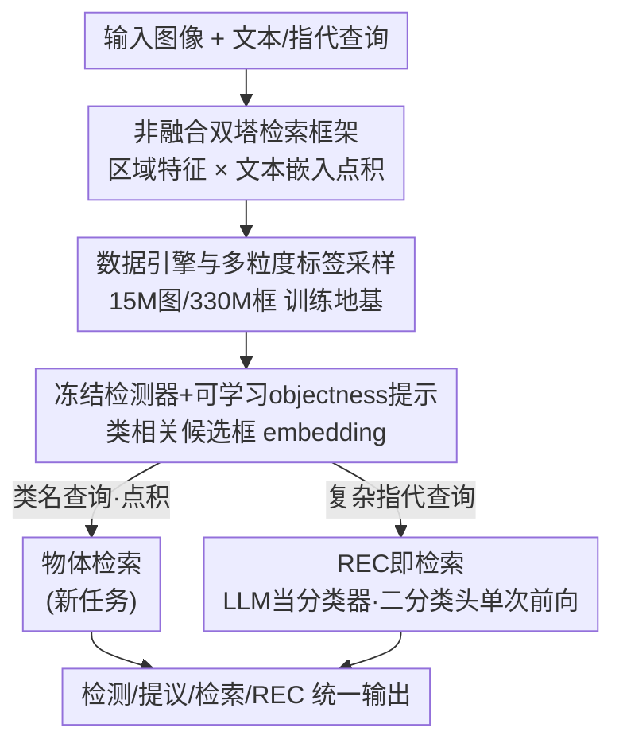

# WeDetect: Fast Open-Vocabulary Object Detection as Retrieval

**会议**: CVPR 2026  
**论文**: [CVF Open Access](https://openaccess.thecvf.com/content/CVPR2026/html/Fu_WeDetect_Fast_Open-Vocabulary_Object_Detection_as_Retrieval_CVPR_2026_paper.html)  
**代码**: https://github.com/WeChatCV/WeDetect  
**领域**: 开放词表目标检测  
**关键词**: 开放词表检测, 双塔检索, REC, 提议生成, CLIP

## 一句话总结
把开放词表检测彻底当成「区域 × 文本」的检索匹配问题来做：用无跨模态融合的双塔结构 WeDetect 拿到实时 SOTA 检测，再冻结它派生出通用提议生成器 WeDetect-Uni（顺带支持局部物体检索这一新任务），最后用一个把 REC 改造成「LLM 当分类器、一次前向并行打分」的 WeDetect-Ref，在 15 个 benchmark 上同时刷到高精度和高吞吐。

## 研究背景与动机
**领域现状**：开放词表目标检测（OVD）要靠文本 prompt 检测任意类别。当前精度最高的一批方法（GLIP、Grounding-DINO、LLMDet）普遍在视觉骨干和文本编码之间堆**深层跨模态融合层**，让区域特征和查询词反复交互来对齐。

**现有痛点**：融合层有两个硬伤。一是**慢**——融合让计算量暴涨；二是**特征不可复用**——融合后的视觉特征变成「查询相关」（query-specific），换一组文本就得重算。论文给的例子很扎心：Grounding-DINO 在 1203 类的 LVIS 上、chunk size 取 40，单张图要跑 **31 次前向**，每图延迟好几秒，根本没法实际部署。

**核心矛盾**：高精度（深融合）和高效率（特征可共享）之间被现有范式架在了对立面。融合带来对齐，但也锁死了特征复用与速度。

**本文目标**：要一个既快、又能达到甚至超过融合模型精度、还能一图多用（检测 / 提议 / 检索 / REC）的开放词表系统。

**切入角度**：作者抓住「非融合（non-fusion）双塔范式」的一个本质特征——它的识别其实就是**检索**：在共享嵌入空间里，把图像区域特征和文本查询做点积匹配。一旦把识别看成检索，视觉特征就和查询解耦了，可以预抽取、缓存、跨 prompt 复用，效率和通用性天然占优。

**核心 idea**：用「检索」统一整条管线——区域特征只算一次，所有下游任务（检测、提议、物体检索、REC）都退化成「在共享空间里做点积/打分」，用这条主线撑起一个模型家族 WeDetect / WeDetect-Uni / WeDetect-Ref。

## 方法详解

### 整体框架
WeDetect 是一个**检索范式的模型家族**，三件套层层派生、共享主干：

1. **WeDetect**——一个 CLIP 初始化、ConvNeXt 骨干的双塔实时检测器，分类靠「图像网格特征 × 类别文本嵌入」的点积完成，**全程不用融合层**，是整个家族的检测地基。
2. **WeDetect-Uni**——把 WeDetect 整体冻结，只训练一个可学习的 objectness prompt，变成「不需要用户输入文本」的通用提议生成器；关键是它吐出的提议框 embedding 仍然是**类相关**的，于是顺手定义了一个新任务「物体检索（object retrieval）」——在图库里检索包含某类小物体（如烟头）的图。
3. **WeDetect-Ref**——面向复杂指代表达（REC）：先用 WeDetect-Uni 抽一批候选框，再把 LLM（Qwen3-VL）改造成**分类器**，对每个候选框二分类「是不是查询目标」，一次前向并行打分，丢掉了逐 token 解码。

三者的数据流是串行的：图像 → WeDetect 检测 / WeDetect-Uni 抽候选 → 候选要么进物体检索（点积），要么进 WeDetect-Ref（LLM 二分类）。

### 关键设计

**1. 非融合双塔检索框架：把识别降级成一次点积，换来可复用特征与实时速度**

针对「融合层又慢又锁死特征复用」这个痛点，WeDetect 彻底砍掉跨模态融合。结构上文本侧用 XLM-RoBERTa 编码类名，视觉侧走 YOLO 风格的 ConvNeXt 骨干 + CSPRepBiFPAN neck + YOLO-World 对比头产生多尺度特征；分类不再让区域和查询深度交互，而是直接做图像网格特征与类别文本嵌入的点积 $s_{ij} = \langle v_i, t_j \rangle$，再配区域-文本对比损失和框回归损失（标签分配同 YOLO-World）。这样做之所以有效，是因为视觉特征和文本查询**解耦**了——区域特征只需算一次就能对任意一组类名复用，省掉了 Grounding-DINO 那种「1203 类要分 31 次前向」的重复计算。骨干特意选 ConvNeXt 而非主流 CLIP 的 ViT，也是因为 ViT 的 plain 结构缺天然多尺度，对检测不友好；作者为此专门预训练了一个 ConvNeXt 版 CLIP 来初始化双塔。

**2. 数据引擎与多粒度标签采样：用「全召回检测器 + MLLM 打标 + 训练时随机采样」喂出细粒度对齐**

非融合范式的对齐全靠数据质量撑，而开源 grounding 数据（如 GoldG）在规模、图像多样性、标注完整性和文本多样性上都不够。作者搭了一条自动数据引擎：先从 SAM-1B / LAION / CC12M 等采样 15M 张多样图，用 raw caption 里的稀有名词来平衡概念分布；再训一个 objectness 检测器**全量召回**图中所有目标框（保证标注完整性），配 SAM 出 mask；然后用微调过的 Qwen2.5-VL 7B 给每个框生成**层次化、实例特定**的标签，例如一只狗标成「animal, dog, a yellow dog」（粗→细），最终得到 15M 图、330M 框。微调时特意强化两种能力——**结构化输出**（按固定模板先粗后细）和**拒识**（错误框直接不打标、当作对前一步提议的二次校验并丢弃），并把 SAM mask 画到原图上 + 文本框坐标一起喂给标注器以增强局部感知。训练阶段再加一招**多粒度标签采样**：每次迭代为每个物体从候选标签里独立随机抽一个，这等价于一种数据增强——它不仅给单个物体提供丰富监督，还为整个 batch 构造出「训练时刻特定」的多样词表，提供大量多样负样本，显著拉高开放词表性能。配合三阶段训练（先 CLIP 式图像级对比预训练 → 冻骨干+文本编码器只训 neck/head → 全参端到端），把图像级知识平滑迁到区域级。

**3. WeDetect-Uni：冻结检测器 + 一个 objectness 提示，让提议框 embedding 保持「类相关」并撑起物体检索新任务**

传统 class-agnostic 提议网络（RPN 等）的框 embedding 是「类无关」的，只能定位不能识别。WeDetect-Uni 反其道而行：把整个 WeDetect 检测器**冻结**，只训练一个通用 objectness prompt 做分类（本质是 linear probing）。因为底座特征已经判别性极强，单个可学习 prompt 就能拿到高召回。关键收益是——检测器冻结意味着 top 提议对应的框 embedding 仍然**类相关**，可直接用于分类。作者据此定义新任务**物体检索**：用一组物体 embedding（而非 CLIP 那样整图一个向量）来表示图像，把 top 提议框 embedding 预抽取并缓存；查询来时只需对查询类名做一次点积 $\mathrm{sim} = \langle e_{\text{box}}, e_{\text{query}} \rangle$ 就能快速召回包含该物体的图。这填补了 CLIP 图像级检索的盲区——它专攻「局部、小物体」语义（如检索含烟头的图），和图像级检索互补。

**4. WeDetect-Ref：把 REC 当检索，LLM 退化成分类器，一次前向并行打分**

复杂指代表达（指定外观、材质、位置甚至需要常识推理）超出传统检测器的语言理解力，自然想用大模型；但 LLM 做 REC 有两个老问题——其一，LLM 用语言建模目标训练、数字被拆成离散 token 用交叉熵优化，**对精确框坐标不敏感**（回归缺陷）；其二，next-token 逐字解码导致**延迟随目标数线性增长**。WeDetect-Ref 把 REC 重述成检索：先用 WeDetect-Uni 抽出候选框集 $\{B_i\}_{i=1}^n$，对每个框用 RoIAlign 从 MLLM 视觉编码器抽多尺度特征、经线性 object projector 压成单个 token $\{o_i\}$；把整图 token $I$、用户查询 $q$、物体 token $\{o_i\}$ 拼起来送入 LLM，再在物体 token 的隐状态上套一个新引入的**二分类头**判断「是否属于查询」：

$$\{h_i\}_{i=1}^n = \mathrm{LLM}(I, q, \{o_i\}_{i=1}^n), \quad \{s_i\}_{i=1}^n = \mathrm{Sigmoid}(\mathrm{Classifier}(\{h_i\}))$$

这套范式一举绕开两个缺陷：丢掉了语言建模的框回归劣势（框由 Uni 给、LLM 只管选），又因为**抛弃 next-token、所有物体在单次前向里并行打分**，推理时间和目标数解耦（不随物体增多线性变长）。训练用三阶段配方：① 只训 region projector，用 700K 图/区域级 caption 让 LLM「认识」物体 token；② 解冻 LLM+projector 做区域感知微调（约 1.7M 指令数据，视觉编码器仍冻）；③ 丢掉语言建模头、换二分类头，用 sigmoid focal loss + IoU 软标签（IoU>0.5 为正样本）把 LLM 训成分类器。

### 损失函数 / 训练策略
- **WeDetect**：区域-文本对比损失（分类）+ 框回归损失，三阶段训练（图像级对比预训练 → 冻骨干训 neck/head → 全参端到端）。
- **WeDetect-Uni**：冻结全检测器，仅 objectness prompt 做 linear-probing 式分类。
- **WeDetect-Ref**：三阶段（projector → 区域感知 → 区域分类），第三阶段用 sigmoid focal loss + IoU 软标签。

## 实验关键数据

### 主实验：零样本检测（Table 1，LVIS / COCO，FPS 在 COCO 上测）
| 模型 | 骨干 | #参数 | FPS | LVIS-minival AP | LVIS AP | 说明 |
|------|------|-------|-----|-----------------|---------|------|
| YOLO-World-L | YOLOv8-L | 48M | 54.6 | 35.4 | 26.8 | 实时基线 |
| **WeDetect-Tiny** | ConvNeXt-T | 33M | **62.5** | **37.4** | **31.4** | 比 YOLO-World-L 还快、且 +2.0/+4.6 AP |
| T-Rex2 | Swin-L | — | — | 54.9 | 45.8 | 之前 SOTA |
| LLMDet | Swin-L | 343M | 2.1 | 50.6 | 42.0 | 融合大模型 |
| **WeDetect-Large** | ConvNeXt-L | 490M | 6.0 | **55.0** | **49.4** | 比 T-Rex2 +3.6、比 LLMDet +7.4 AP，速度 3× 于 Grounding-DINO |

要点：小模型 WeDetect-Tiny 同时在精度（LVIS +4.6 AP）和速度（62.5 vs 54.6 fps）上压过专为效率优化的 YOLO-World-L；大模型把非融合范式推到 LVIS 49.4 AP 的新 SOTA。

### REC（Table 2，RefCOCO/+/g Top-1 acc，FPS 在 RefCOCO 上测）
| 模型 | FPS | RefCOCO/+/g 平均 | 说明 |
|------|-----|------------------|------|
| Qwen3-VL 4B（基线） | 0.4 | 86.6 | next-token 解码 |
| Grounding-DINO-L | 3.1 | 86.6 | 传统检测器 |
| **WeDetect-Ref 4B** | **5.3** | **93.2** | 比 Qwen3-VL 4B +6.6，且约 13× 加速 |
| **WeDetect-Ref 2B** | 6.6 | 91.3 | 2B 也超过一众更大模型 |

WeDetect-Ref 4B 用 100 个提议、4B 参数就超过带 thinking 的更大模型，且因单次前向并行打分，比同尺寸 Qwen3-VL 快约 13 倍。它还是**首个在 COCO 检测上破 50 AP 的 LMM**（50.0 AP），首次匹配传统检测器水平；而 Qwen2.5-VL 7B 因 next-token 漏召回只有 17.7 AP。

### 物体检索（Table 4，新任务，类名当查询）
| 模型 | COCO F1 | LVIS Recall | 说明 |
|------|---------|-------------|------|
| OpenAI CLIP | 46.4 | 30.4 | 图像级检索 |
| FG-CLIP2 | 57.7 | 43.1 | 细粒度优化 |
| **WeDetect-Large-Uni（300 提议）** | **83.6** | **57.5** | 比 CLIP F1 +37.2 |

### 消融（Table 6 检测 / Table 7 Ref，均在 LVIS-minival / 部分数据上）
| 配置 | 关键指标 | 说明 |
|------|---------|------|
| WeDetect-Base 完整 | 47.3 AP | 基线 |
| w/o 粗粒度标签 | 46.4 AP（−0.9） | 只留细粒度 |
| w/o 细粒度标签 | 45.1 AP（−2.2） | 只留粗粒度，掉最多 |
| w/o 三阶段训练 | 45.5 AP（−1.8） | head/neck 没初始化会扰乱 CLIP 特征 |
| WeDetect-Ref 用 BCE 替 focal loss | COCO −4.4 AP | focal loss 更适配 |
| WeDetect-Ref w/o 负样本检测数据 | COCO −5.4 AP / APs −7.0 | 负监督关键 |
| WeDetect-Ref 每物体 25 token | 几乎无提升、上下文 ×25 | 单 token 已够 |

### 关键发现
- **多粒度标签是检测涨点主力**：去掉细粒度掉 2.2 AP、去掉粗粒度掉 0.9 AP，二者同时用才最优——说明文本多样性直接决定细粒度视觉-语言对齐质量。
- **负样本监督对 REC/检测至关重要**：给 WeDetect-Ref 加负检测数据能涨 5.4 AP、小物体涨 7.0 APs；负样本教模型「拒识不存在的查询」，正是 LMM 检测的老大难。
- **单 token 表示足够**：每物体压成 1 个 token 与用 25 个 token 精度几乎相同，但后者上下文长度暴涨 25 倍——整图上下文已保留足够物体细节。
- **对提议顺序鲁棒**：训练时正样本可出现在任意位置，模型对候选打乱不敏感（causal mask 下仍稳定）。

## 亮点与洞察
- **「检索」当作统一公约数**：检测、提议、物体检索、REC 四个看似不同的任务，被归约成同一个「共享空间里的匹配/打分」操作——这是全文最漂亮的一笔，让一套特征四处复用，是效率优势的根。
- **冻结检测器换来「类相关提议」**：通常提议网络是类无关的，作者用「冻结底座 + 只训一个 objectness prompt」既拿到高召回，又意外保住了框 embedding 的类相关性，直接孵化出物体检索这个新任务，工程上极省成本（linear probing 级训练量）。
- **把 LLM 从「生成器」改造成「分类器」**：REC 即检索的设计同时治了 LMM 检测的两个病——框回归不准（框交给 Uni）和逐 token 慢（二分类头一次前向），还顺带解决了「漏召回 / 不会拒识」，首次让 LMM 在 COCO 检测破 50 AP。这个「LLM 当分类器、一次前向并行打分」的思路很可迁移到其他「从候选里挑目标」的多模态任务（如视频时序定位，作者也确实受 VideoITG 启发）。
- **数据引擎的拒识即校验**：让打标 MLLM「对错误框不打标」，等于用打标这一步反过来过滤上游提议器的误检，一举两得。

## 局限与展望
- **重数据**：15M 图 / 330M 框的自建数据引擎是性能基石，复现门槛和算力成本高；非融合范式对数据质量的依赖比融合范式更强。
- **WeDetect-Ref 依赖候选质量**：REC 精度上限被 WeDetect-Uni 的召回率卡住——如果目标根本没被 Uni 提议出来，LLM 分类器再强也选不出（检索范式的固有短板，作者未深入讨论召回失败的占比）。
- **物体检索是新任务、缺统一基准**：评测借用 COCO/LVIS 改造，阈值设定（直接套 COCO 阈值评 LVIS）较 ad-hoc，跨数据集可比性有限。
- **小物体仍偏弱**：消融里小物体 AP（APs）对负样本数据极敏感，说明细粒度/小目标场景的鲁棒性还有提升空间。

## 相关工作与启发
- **vs Grounding-DINO / GLIP / LLMDet（深融合 OVD）**：它们靠跨模态融合层提精度但慢且特征不可复用（1203 类要 31 次前向）；WeDetect 砍掉融合、纯点积检索，在更高精度下快 3–6 倍，证明「融合不是高精度的必要条件，数据 + 检索范式也能到 SOTA」。
- **vs YOLO-World（非融合实时检测）**：同属双塔/对比头路线，但 WeDetect 用 ConvNeXt CLIP 预训练 + 数据引擎 + 多粒度采样把非融合范式推到新高度，Tiny 版在更快速度下 LVIS +4.6 AP。
- **vs ChatRex / Octopus / VLM-FO1（LMM-based REC，预抽提议）**：这些虽也预抽候选给 LLM 参考，但仍沿用 next-token 逐字解码，速度受限；WeDetect-Ref 改成二分类头单次前向，13× 加速且精度更高。
- **vs CLIP / FG-CLIP（图像级检索）**：CLIP 把整图编码成单向量、只懂全局语义；WeDetect-Uni 用一组类相关物体 embedding 表示图，专攻局部小物体检索（F1 +37.2），与图像级检索互补。

## 评分
- 新颖性: ⭐⭐⭐⭐⭐ 用「检索」统一检测/提议/物体检索/REC 四任务，并提出物体检索新任务与「LLM 当分类器」的 REC 范式，视角统一且落地。
- 实验充分度: ⭐⭐⭐⭐⭐ 覆盖 15 个 benchmark、多尺度模型、检测/REC/检索三线对比 + 充分消融，速度与精度双维度都给足。
- 写作质量: ⭐⭐⭐⭐ 结构清晰、动机层层递进，三件套关系讲得明白；个别召回失败/数据细节留到 Appendix 略可惜。
- 价值: ⭐⭐⭐⭐⭐ 实时 SOTA + 可复用特征 + 开源代码，对实际部署和后续「检索范式多模态感知」很有借鉴意义。

<!-- RELATED:START -->

## 相关论文

- [\[CVPR 2026\] Consistency Beyond Contrast: Enhancing Open-Vocabulary Object Detection Robustness via Contextual Consistency Learning](consistency_beyond_contrast_enhancing_open-vocabulary_object_detection_robustnes.md)
- [\[CVPR 2026\] NoOVD: Novel Category Discovery and Embedding for Open-Vocabulary Object Detection](noovd_novel_category_discovery_and_embedding_for_open-vocabulary_object_detectio.md)
- [\[CVPR 2026\] Parameter-Efficient Semantic Augmentation for Enhancing Open-Vocabulary Object Detection](parameter-efficient_semantic_augmentation_for_enhancing_open-vocabulary_object_d.md)
- [\[CVPR 2026\] ViTPrompt: Training-Free Prompt Refinement with Visual Tokens for Open-Vocabulary Detection](vitprompt_training-free_prompt_refinement_with_visual_tokens_for_open-vocabulary.md)
- [\[CVPR 2026\] SRA-Det: Learning Omni-Grained Open-Vocabulary Detection Beyond Category Names](sra-det_learning_omni-grained_open-vocabulary_detection_beyond_category_names.md)

<!-- RELATED:END -->
