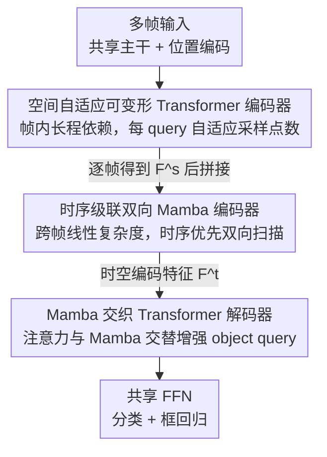

# When Transformers Meet Mamba: A Hybrid Transformer-Mamba Network for Video Object Detection

**会议**: CVPR 2026  
**论文**: [CVF Open Access](https://openaccess.thecvf.com/content/CVPR2026/html/Qi_When_Transformers_Meet_Mamba_A_Hybrid_Transformer-Mamba_Network_for_Video_CVPR_2026_paper.html)  
**领域**: 视频目标检测  
**关键词**: 视频目标检测, Transformer-Mamba 混合, 状态空间模型, 可变形注意力, 时序建模

## 一句话总结
TMambaDet 把 Transformer 和 Mamba 在视频目标检测里做了一次明确分工——帧内空间用自适应可变形 Transformer 建模、帧间时序用线性复杂度的双向 Mamba 建模、解码器把两者交织起来对齐 query 与时空特征，在 ImageNet VID 上以 ResNet-101 拿到 87.9% mAP 且单帧只要 20.6 ms。

## 研究背景与动机

**领域现状**：视频目标检测的核心红利是「时序」——相邻帧能提供运动线索和语义一致性，帮助检测被遮挡、模糊、运动模糊的目标。近年主流是基于 Transformer 的方法（TransVOD、FAQ、CETR、PTSEFormer 等），它们用空间 Transformer 聚合帧内外观特征、用时序 Transformer 跨帧传播信息，靠注意力强大的长程建模能力刷点。

**现有痛点**：Transformer 的注意力是序列长度的二次复杂度。帧内特征数量不大还能承受，但视频目标检测要把多帧（本文测试时用 25 帧）的特征拼起来做跨帧建模，特征量随帧数线性增长，注意力计算量随之二次膨胀，时序建模这一步变得非常贵。已有的高效 Transformer（MobileViT、TinyViT）虽然能压复杂度，却是以牺牲一部分长程建模能力换效率，鱼和熊掌难以兼得。

**核心矛盾**：长程建模能力与长序列处理效率之间存在 trade-off。Transformer 长程强但效率差；Mamba（一种状态空间模型）以**线性复杂度**建长程依赖，效率高、特别适合跨帧时序，但因为隐藏状态尺寸固定，上下文学习能力和多任务泛化通常弱于 Transformer。两者优势恰好互补，而 Mamba 在视频目标检测上还是空白。

**本文目标 / 切入角度**：与其在「全 Transformer」或「全 Mamba」之间二选一，不如让两者各干各擅长的——空间维度交给 Transformer（特征少、要强上下文），时序维度交给 Mamba（特征多、要高效率），解码阶段再把两条范式交织起来增强 query。

**核心 idea**：用「空间 Transformer + 时序 Mamba + 两者交织的解码器」这套混合架构，把帧内长程建模和帧间高效时序建模拆开各取所长，做成视频目标检测领域第一个 Transformer-Mamba 混合框架 TMambaDet。

## 方法详解

### 整体框架
TMambaDet 建在 Deformable DETR 之上，是一条「主干提特征 → 空间编码 → 时序编码 → 交织解码 → 检测头」的串行流水线。每一帧先过共享主干（ResNet-101 或 Swin-B）抽特征，投影展平成 token，加上 Deformable DETR 给的位置编码后送入 **SADT 空间编码器**，逐帧建模帧内长程依赖、聚合空间特征，得到空间编码特征 $F^s$。随后把多帧的 $F^s$ 拼接，送入 **TCBM 时序编码器**，以线性复杂度跨帧聚合时序信息，得到时空编码特征 $F^t$。$F^t$ 连同 Deformable DETR 预测的 object query 一起进入 **MaET 解码器**，让 query 与时空特征充分交互、做细粒度对齐，输出时空解码特征。最后一个共享 FFN 对解码特征做分类与框回归，得到检测结果。

三个核心模块对应三种「分工」：SADT 管空间表征、TCBM 管时序表征、MaET 管实例级 query 表征，三者依次增强不同层面的特征。

### 关键设计

**1. SADT 空间自适应可变形 Transformer 编码器：让复杂目标分到更多采样点**

视频帧里背景占了一大片，直接上原始 Transformer 编码器会在无用区域上烧掉大量算力；已有的 mask 机制方法又得手调额外超参或启发式规则。SADT 在 Deformable DETR 的可变形注意力（每个 query 只看一小撮可学习偏移指定的采样点）基础上改进出**自适应可变形注意力（MADAttn）**。标准可变形注意力对所有 query 用固定数量的采样点，不管这个 query 对应的是简单目标还是复杂目标；SADT 的关键改动是让采样点数量**随 query 特征自适应**——遮挡、模糊这类复杂目标分到更多采样点，简单目标分到更少。

具体地，多尺度自适应可变形注意力写成
$$\text{MADAttn}(z_q,\hat p_q,\{x_l\}_{l=1}^{L})=\sum_{h=1}^{H}W_h\Big[\sum_{l=1}^{L}\sum_{k=1}^{K_q}O_{hlqk}\cdot W_h' x_l\big(\psi_l(\hat p_q)+\Delta p_{hlqk}\big)\Big],$$
其中 $z_q$ 是 query 特征、$\hat p_q$ 是参考点归一化坐标、$O_{hlqk}$ 是归一化注意力权重、$\Delta p_{hlqk}$ 是采样偏移、$K_q$ 是该 query 的采样点总数。采样点数 $K_q$ 由一个轻量 MLP 加 Sigmoid 在 query 特征上预测出采样强度分数 $\alpha\in(0,1)$，再线性映射成离散值：
$$K_q=\text{round}\big(K_{\min}+\alpha\cdot(K_{\max}-K_{\min})\big),$$
本文取 $K_{\min}=2,K_{\max}=8$。这样把算力按目标难度动态分配，既不像固定大 $K$ 那样全程烧算力，也不像固定小 $K$ 那样对难目标采样不足，实测在同等 mAP 下显著省时间。

**2. TCBM 时序级联双向 Mamba 编码器：用时序优先双向扫描换线性复杂度的跨帧建模**

跨帧建模是复杂度爆炸的重灾区——特征量随帧数增长，用 Transformer 做时序注意力是二次的。TCBM 改用 Mamba 把跨帧依赖建模压到线性复杂度。它把 SADT 输出的 $F^s$ 先做 LayerNorm，再分成两路：第一路过线性投影 + Conv1d + **时序优先前向 SSM（TF-SSM）**抓前向长程时序依赖，第二路过线性投影 + 激活，两路用 Hadamard 积融合成前向表示
$$F^{mid}=\text{TF-SSM}(\text{Conv1d}(\text{Linear}(\text{LN}(F^s)))),\quad F^{fwd}=F^{mid}\otimes\sigma(\text{Linear}(\text{LN}(F^s))).$$
之后**级联**一组同构操作（LN + Linear + Conv1d + 反向 **TB-SSM**）按相反空间顺序抓后向时序依赖，输出时空编码特征 $F^t$。

它的核心是一个新的**时序优先双向扫描算法**：把待处理特征记为 $F^s_{i,j}$（$i$ 是帧的时序索引、$j$ 是帧内空间位置），前向扫描固定某个空间坐标 $j$、先沿时间轴把所有帧扫完（$F^s_{0,0},F^s_{1,0},\dots,F^s_{N,0}$），再换下一个空间坐标，直到遍历完；后向扫描则从最后一个空间位置 $j=M$ 出发同样沿时间轴正向扫，逐步退回 $j=0$。和已有 Mamba 方法常见的「空间优先」扫描不同，TCBM 显式优先沿时间维度连续扫描，让同一空间位置上的跨帧动态被连贯地建模，这正是视频目标检测最需要的时序一致性。

**3. MaET Mamba 交织 Transformer 解码器：在解码端把注意力和 Mamba 叠在一起精修 query**

已有方法让 object query 与编码特征交互时，基本都困在注意力范式里（cross-attention、memory/guided cross-attention 等变体），始终没跳出注意力本身的局限。MaET 把 Mamba 嵌进标准 Transformer 解码器，在原有结构上**加入一个多尺度自适应可变形注意力层和一个级联双向 Mamba 层**，让 query 同时吃到两种范式的好处。一个解码步依次是：object query 先过多头自注意力让 query 之间互通信息，再过多尺度自适应可变形注意力从编码特征 $F^t$ 聚合上下文，最后过级联双向 Mamba 在前后两个方向整合长程上下文：
$$Q_{SA}=\text{MHSAttn}(Q,Q,Q),\quad Q_{DA}=\text{MADAttn}(Q_{SA},P,F^t),\quad Q_{MA}=\text{CBi-Mamba}(Q_{DA}),$$
$Q_{MA}$ 再过 FFN 产出时空解码特征。注意力负责把 query 精准对齐到编码特征里的信息区域，Mamba 负责高效补充长程上下文，两者交织让每个 query 拿到更丰富的实例级语义。

### 损失函数 / 训练策略
损失沿用 Deformable DETR。训练时按 random sampling 策略从同一视频片段额外随机采 4 帧（加上当前帧），测试时用 25 帧输入。ImageNet VID 上用 ImageNet VID + DET 训练、短边 resize 到 600，4 张 RTX 5090 跑 140K 迭代，AdamW，前 100K 学习率 $1\times10^{-4}$、后 40K 降到 $1\times10^{-5}$。每帧 object query 数在 ImageNet VID / EPIC-KITCHENS-55 上分别为 60 / 300。

## 实验关键数据

### 主实验

ImageNet VID（mAP@IoU=0.5，Time⋆ 为同一张 RTX 5090 重测）：

| 方法 | 主干 | mAP (%) | Time⋆ (ms) |
|------|------|---------|------------|
| TransVOD Lite | ResNet-101 | 80.5 | 28.4 |
| DGC-Net | ResNet-101 | 86.3 | — |
| TGBFormer | ResNet-101 | 86.5 | — |
| **TMambaDet** | ResNet-101 | **87.9** | **20.6** |
| YOLOV++ | Swin-B | 90.7 | 15.7 |
| ODND | Swin-B | 91.3 | — |
| **TMambaDet** | Swin-B | **92.1** | 39.0 |

ResNet-101 下比 TGBFormer 高 1.4 mAP、比 ClipVID 高 3.2 mAP、比 CETR 高 8.3 mAP，且 20.6 ms 是同组里最快之一；换 Swin-B 拿到 92.1% 超过所有对手。

EPIC-KITCHENS-55（泛化性验证）：

| 方法 | 主干 | mAP (%) | Time (ms) |
|------|------|---------|-----------|
| LSTFE-Net | ResNet-101 | 41.9 | 85.9 |
| **TMambaDet** | ResNet-101 | **45.1** | **23.2** |
| YOLOV++ | Swin-B | 48.3 | 18.7 |
| **TMambaDet** | Swin-B | **50.8** | 41.3 |

同主干下全面领先，说明混合架构的增益不局限于单一数据集。

### 消融实验

各组件贡献（baseline 为 Deformable DETR，下标为相对 (a) 的总 mAP 增益）：

| 配置 | SADT | TCBM | MaET | overall | fast (运动快) |
|------|:----:|:----:|:----:|---------|---------------|
| (a) baseline | | | | 78.3 | 57.8 |
| (b) +SADT | ✓ | | | 80.6 | 62.5 |
| (c) +TCBM | | ✓ | | 83.8 | 67.5 |
| (d) +MaET | | | ✓ | 80.9 | 63.0 |
| (e) +TCBM+MaET | | ✓ | ✓ | 86.1 | 71.3 |
| (f) 完整 TMambaDet | ✓ | ✓ | ✓ | **87.9** | **73.1**（+15.3） |

SADT 采样模式（固定 vs 自适应）：

| 采样模式 | ImageNet VID mAP (%) | Time (ms) |
|----------|----------------------|-----------|
| Fixed (K=2) | 85.3 | 15.3 |
| Fixed (K=4) | 87.4 | 21.1 |
| Fixed (K=6) | 87.6 | 30.2 |
| Fixed (K=8) | 87.5 | 40.0 |
| **Adaptive (Ours)** | **87.9** | **20.6** |

扫描算法对比：

| 算法 | ImageNet VID mAP (%) | EPIC mAP (%) |
|------|----------------------|--------------|
| S4 Scan | 85.7 | 43.1 |
| S6 Scan | 86.4 | 43.8 |
| Bi-S6 Scan | 87.3 | 44.6 |
| **TPBS (Ours)** | **87.9** | **45.1** |

### 关键发现
- **TCBM 时序模块贡献最大**：单加 TCBM（c）就把 baseline 从 78.3 拉到 83.8（+5.5），远超单加 SADT（+2.3）或单加 MaET（+2.6），印证「视频目标检测最缺的是高效跨帧时序建模」这一判断。
- **增益集中在快速运动目标**：完整模型在 fast 子集上从 57.8 涨到 73.1（+15.3），比 slow（+6.9）/ medium（+10.3）大得多——运动越剧烈、单帧外观越难，越依赖时序聚合，混合架构的价值越明显。
- **自适应采样是精度-效率甜点**：固定 $K$ 越大 mAP 越高但越慢（K=8 要 40 ms），自适应模式只用 20.6 ms 就拿到最高的 87.9 mAP，说明把采样预算按目标难度分配比无脑加点更划算。
- **时序优先双向扫描优于通用 Mamba 扫描**：TPBS 比 Bi-S6 高 0.6 mAP、比单向 S6 高 1.5 mAP，验证了「沿时间维度优先连续扫描」对视频任务的针对性收益。
- **层数有最优点**：Mamba 编码器层数从 1→3 涨到 87.9 后再加反而掉点（4 层 87.7、5 层 87.1），3 层是最佳深度。

## 亮点与洞察
- **范式分工而非二选一**：把 Transformer 和 Mamba 按「空间 vs 时序」的特征量差异精准分工，是非常清爽的设计哲学——帧内特征少、要强上下文交给注意力，帧间特征多、要高效率交给线性 Mamba，恰好踩中两者各自的舒适区。
- **自适应采样点数的小而美**：用一个 MLP+Sigmoid 预测采样强度 $\alpha$、再线性映射成离散采样点数 $K_q$，把「难目标多看、易目标少看」做成可学习的算力分配，思路可直接迁移到其他可变形注意力检测器上省时间。
- **时序优先扫描**：Mamba 视觉应用里扫描顺序是关键超设计，本文反主流地优先沿时间轴扫而非空间轴，把视频的时序连续性显式编码进 SSM 的状态传播，是个值得借鉴的「领域先验注入扫描顺序」的范例。
- **解码端交织注意力与 Mamba**：MaET 在解码器里串「自注意力 → 可变形注意力 → 双向 Mamba」，让 query 既被精准对齐又被高效补长程上下文，提供了一种 query refinement 的新模板。

## 局限与展望
- **仍依赖 Deformable DETR 框架**：整体建在 Deformable DETR 之上，object query 也由它预测，混合架构的收益部分受限于这个底座本身的上限。
- **超参需手调**：$K_{\min}/K_{\max}$、各模块层数（SADT 4 层、TCBM 3 层、MaET 4 层）、测试用 25 帧等都是经验设定，换数据集/场景可能要重新搜参（其敏感性分析放在补充材料里）。
- **只验证了固定窗设置**：测试时一次喂 25 帧，论文未讨论严格在线、流式或更长视频下的延迟与显存表现，实际部署的时序窗口约束有待评估。
- **泛化基准有限**：EPIC-KITCHENS-55 上很多对比方法是作者自己复现的（原始结果不公开），横向比较需留一点 caveat。

## 相关工作与启发
- **vs TransVOD / CETR / PTSEFormer（全 Transformer 视频检测）**：它们用时序 Transformer 跨帧传播，受困于二次复杂度且效率随帧数恶化；TMambaDet 把跨帧那一步换成线性 Mamba，既快又能建更长时序，ResNet-101 下比 TransVOD Lite 高 7.4 mAP 且更快。
- **vs Deformable DETR / Adaptive DETR（可变形注意力）**：Adaptive DETR 按特征尺度重要性分配采样点，TMambaDet 则按**每个 query 自身特征**预测采样点数，粒度更细、更贴合「目标难度差异」。
- **vs Samba / Sigma / EAMamba（视觉 Mamba）**：这些工作把 Mamba 用在分割/复原等任务并设计各种空间扫描；TMambaDet 首次把 Mamba 引入视频目标检测，并用时序优先扫描替代它们的空间优先扫描，针对视频时序做了适配。

## 评分
- 新颖性: ⭐⭐⭐⭐ 首个把 Transformer-Mamba 混合用于视频目标检测，自适应采样点数与时序优先扫描都有新意，但组件多为已有思想的针对性组合。
- 实验充分度: ⭐⭐⭐⭐⭐ 两个数据集 + 双主干 + 组件/采样/扫描/层数全套消融，运动速度分桶分析尤其有说服力。
- 写作质量: ⭐⭐⭐⭐ 结构清晰、公式与扫描算法描述详尽，图文对应到位。
- 价值: ⭐⭐⭐⭐ 在精度-效率 trade-off 上给出有竞争力的解，混合范式的分工思路对其他视频任务有迁移价值。

<!-- RELATED:START -->

## 相关论文

- [\[CVPR 2026\] D2FANet: Enhancing Video Object Detection with Dual-Domain Feature Aggregation Network](d2fanet_enhancing_video_object_detection_with_dual-domain_feature_aggregation_ne.md)
- [\[AAAI 2026\] Temporal Object-Aware Vision Transformer for Few-Shot Video Object Detection](../../AAAI2026/object_detection/temporal_object-aware_vision_transformer_for_few-shot_video_object_detection.md)
- [\[CVPR 2026\] DA-Mamba: Learning Domain-Aware State Space Model for Global-Local Alignment in Domain Adaptive Object Detection](da-mamba_learning_domain-aware_state_space_model_for_global-local_alignment_in_d.md)
- [\[CVPR 2026\] Tri-Modal Fusion Transformers for UAV-based Object Detection](tri-modal_fusion_transformers_for_uav-based_object_detection.md)
- [\[ICML 2025\] When Every Millisecond Counts: Real-Time Anomaly Detection via the Multimodal Asynchronous Hybrid Network](../../ICML2025/object_detection/when_every_millisecond_counts_real-time_anomaly_detection_via_the_multimodal_asy.md)

<!-- RELATED:END -->
