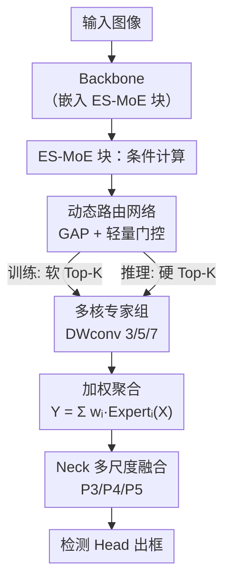

# YOLO-Master: MOE-Accelerated with Specialized Transformers for Enhanced Real-time Detection

**会议**: CVPR 2026  
**论文**: [CVF Open Access](https://openaccess.thecvf.com/content/CVPR2026/html/Lin_YOLO-Master_MOE-Accelerated_with_Specialized_Transformers_for_Enhanced_Real-time_Detection_CVPR_2026_paper.html)  
**代码**: https://github.com/Tencent/YOLO-Master  
**领域**: 目标检测  
**关键词**: 实时检测、稀疏专家混合(MoE)、条件计算、动态路由、YOLO

## 一句话总结
YOLO-Master 把稀疏 MoE（ES-MoE 块）塞进 YOLO 的 backbone，让网络按图像复杂度动态激活不同专家，在 MS COCO 上以 1.62ms 延迟拿到 42.4% AP，比 YOLOv13-N 高 0.8% mAP 且快 18%。

## 研究背景与动机
**领域现状**：实时目标检测（RTOD）这个赛道几乎被 YOLO 系列垄断，从 YOLOv5 到 YOLOv13，每一代都靠改 backbone（更强特征）、改 neck（更好的多尺度融合）、或换训练策略（NMS-free、选择性注意力）来把"精度-速度"的 Pareto 前沿往外推一点。

**现有痛点**：所有这些 YOLO 都是**静态稠密计算**——不管输入是一张空旷的高速公路还是一张挤满小目标的航拍图，都走同一套固定网络、花同样多的算力。结果就是简单场景算力浪费、复杂场景算力不够，既有计算冗余又有精度上限。

**核心矛盾**：网络容量和计算预算是在**设计时就被钉死的**，缺乏一种根据输入内容动态分配资源的机制。为复杂城市场景调优的检测器在简单场景里是过参数化的，为速度调优的检测器在困难样本上又容量不足，二者无法兼得。

**切入角度**：作者借鉴了大语言模型里 MoE 的经验——**稀疏激活**让不同输入选择性地激活不同的参数子集，能同时提升效率和适应性。那么能不能把这套条件计算搬进实时检测，让"该省的省、该花的花"？此前虽有人把 MoE 塞进 ViT 检测器，但开销太大无法实时。

**核心 idea**：在 YOLO 的 CNN backbone 里嵌入一个**轻量稀疏 MoE 块（ES-MoE）**，用一个 GAP 驱动的动态路由网络按场景复杂度选择性地激活少数专家，从而打破"容量 vs 算力"的静态权衡——这是首个面向轻量实时检测器的 MoE 条件计算框架。

## 方法详解

### 整体框架
YOLO-Master 以近期 YOLO（如 YOLOv12）为骨架，唯一的结构改动是把若干卷积块替换成 **ES-MoE（Efficient Sparse Mixture-of-Experts）块**。一张图进来后走 backbone 提特征 → neck 做多尺度融合（P3/P4/P5）→ head 出框，这条主干和普通 YOLO 一样；区别在于 backbone 里的 ES-MoE 块会**根据这张图本身的复杂度，动态决定调用哪几个专家**。

ES-MoE 块内部信息流是：输入特征图 $X \in \mathbb{R}^{C\times H\times W}$ →（i）**动态路由网络**用 GAP 把全局信息压成描述子、经轻量 gating 算出每个专家的权重 → （ii）**Softmax 门控 + Top-K 选择**挑出最相关的 K 个专家 → （iii）被选中的专家（不同感受野的深度可分离卷积）各自处理特征 → **加权聚合**成增强特征图 $Y$。关键在于训练和推理用**两套不同的路由策略**：训练时软 Top-K 保梯度，推理时硬 Top-K 真稀疏。

论文还系统消融了 ES-MoE 该放哪：可放 backbone、neck 或两者都放，但实验发现**只放 backbone 最优**（neck-only 掉 2.6%、both 反而崩到 -5.9%），所以最终配置是 backbone-only。

### 关键设计

**1. ES-MoE 块：让检测器按场景复杂度做条件计算**

针对"静态稠密计算对所有输入一视同仁"这个根本痛点，ES-MoE 把一个卷积块换成一组并行专家 + 一个路由器，使得**容量随输入动态伸缩**。给定输入 $X$，门控函数 $g_i(\cdot)$ 先算出每个专家的权重，再选出权重最高的 Top-K 个专家（$K \ll E$）做稀疏激活，最后把这 K 个专家的输出按权重融合：

$$w_i = \frac{\exp(g_i(X))}{\sum_{j=1}^{E}\exp(g_j(X))}, \qquad Y = \mathrm{Norm}\!\left(\sum_{i\in T_K} w_i\cdot \mathrm{Expert}_i(X)\right)$$

其中 $T_K$ 是被选中专家的下标集合，$\mathrm{Norm}(\cdot)$ 是稳定聚合特征的归一化。这样简单场景只激活少数专家、省算力，复杂场景调动更多容量、保精度——这正是 attention 类方法做不到的：注意力只是给特征重新加权，计算量并不变，而 MoE 是**真的少算了几条卷积通路**。

**2. 多核高效专家组：用不同感受野覆盖多尺度，又不拖慢推理**

专家如果用标准卷积，$E$ 一大参数和 FLOPs 就爆了，无法实时。作者让每个专家都用**深度可分离卷积（DWconv）**做基本单元，把空间滤波（depthwise）和通道融合（pointwise）解耦，从而在专家数较多时仍保持轻量：

$$\mathrm{Expert}_i(X) = \mathrm{DWconv}_{k_i,\,C_{in}\to C_{out}}(X)$$

更巧的是每个专家用**不同的奇数核尺寸** $k_i\in\{3,5,7,\dots\}$，借鉴 Inception 的多核思路，让不同专家天然擅长不同尺度的局部模式。路由器据此可以"按需调度"——遇到密集小目标就多调小核专家，遇到大目标就调大核专家。这比单一固定核的卷积块表达力更强，且因为是 DWconv，多尺度能力几乎不增加成本。

**3. GAP 驱动的轻量门控网络：让路由本身不成为瓶颈**

路由决策如果太重，省下的算力又被门控吃回去了。作者用极简门控：先 **GAP** 把特征图压成全局描述子 $P=\mathrm{GAP}(X)\in\mathbb{R}^{C\times 1\times 1}$（用全局信息而非局部特征，给整张图统一指导），再过两层 $1\times1$ 卷积算 logits：

$$\Lambda = \mathrm{Conv}^{out=E}_{1\times1}\big(\mathrm{SiLU}(\mathrm{Conv}^{out=C_{red}}_{1\times1}(P))\big)$$

中间维度 $C_{red}=\max(C/\gamma, 8)$（通道压缩比 $\gamma=8$）。关键性质是：生成 logits 的计算量只取决于通道数 $C$ 和专家数 $E$，**与特征图空间分辨率 $H\times W$ 无关**——所以即便在高分辨率特征图上做路由也几乎不增加开销，这是它能放进实时检测器的前提。

**4. 分阶段路由策略：训练软 Top-K 保梯度，推理硬 Top-K 真稀疏**

朴素 MoE 有个两难：推理要稀疏（只算 K 个专家）才快，但训练时如果直接砍掉非 Top-K 专家的权重，那些专家就拿不到梯度、学不动。作者用**训练/推理解耦**化解。训练时用 **Soft Top-K**：先 softmax 得初始权重 $\Omega'$，找出 Top-K 的下标集 $I_K$ 构造硬掩码 $M_K$，再逐元素相乘并对非零项重归一化：

$$\Omega_{train} = \frac{\Omega'\odot M_K}{\sum_{j}(\Omega')_j\odot(M_K)_j + \epsilon}$$

因为 $\Omega'$（含全部专家）参与了计算，权重对 logits $\Lambda$ 仍是连续可导的，梯度能正常回流。推理时切到 **Hard Top-K**：直接取最大的 K 个 logits 做 softmax、其余专家权重硬置零，前向只真正调用 K 个专家模块：

$$\Omega_{infer,i} = \begin{cases}\dfrac{\exp(\Lambda_i)}{\sum_{j\in I_K}\exp(\Lambda_j)} & i\in I_K \\[2mm] 0 & \text{otherwise}\end{cases}$$

模型靠 `self.training` 标志自动在两套权重间切换。这一招让"训练充分学习"和"推理硬件加速"两个目标同时成立，是 MoE 能在实时检测落地的核心工程设计。

### 损失函数 / 训练策略
总损失为标准 YOLOv8 检测损失加一个为 MoE 定制的负载均衡损失：$L_{Total} = L_{YOLO} + \lambda_{LB}\cdot L_{LB}$。其中 $L_{YOLO}=L_{cls}+L_{loc}+L_{DFL}$（分类 + CIoU/DIoU 定位 + Distribution Focal Loss）。

负载均衡损失 $L_{LB}$ 用来防止**专家坍缩**——路由器容易把绝大多数输入都丢给少数几个"初始化更好"的强专家，导致其他专家形同虚设。先统计每个专家在整个 batch、所有空间位置上的平均利用率 $\mu_i$，再用 MSE 把它逼近理想均匀利用率 $1/E$：

$$L_{LB} = \frac{1}{E}\sum_{i=1}^{E}\left(\mu_i - \frac{1}{E}\right)^2$$

有意思的是，损失消融发现**去掉 DFL、只用 MoE 损失（权重 1.5）反而最好**（62.2% mAP）：DFL 和强 MoE 损失同时存在时训练曲线剧烈震荡，而 MoE-only 收敛平滑，二者似乎存在优化冲突。

## 实验关键数据

在五个数据集（MS COCO、PASCAL VOC、VisDrone、KITTI、SKU-110K）上对比 Nano 级检测器，统一 600 epoch、640² 分辨率、BS 256、SGD。

### 主实验

| 数据集 | 指标 | YOLO-Master-N | YOLOv13-N | 提升 |
|--------|------|------|----------|------|
| MS COCO | mAP | 42.4% | 41.6% | +0.8% |
| PASCAL VOC | mAP | 62.1% | 60.7% | +1.4% |
| VisDrone | mAP | 19.6% | 17.5% | +2.1% |
| KITTI | mAP | 69.2% | 67.7% | +1.5% |
| SKU-110K | mAP | 58.2% | 57.5% | +0.7% |
| 效率 | 延迟 | 1.62ms | 1.97ms | 快 18% |

亮点是 YOLO-Master-N 不仅全面超越 YOLOv13-N，延迟还更低（1.62ms vs 1.97ms），仅比最快的 YOLOv11-N 慢 8%。增益最大的是 VisDrone（+2.1%，密集小目标航拍）和 KITTI（+1.5%，精定位），印证条件计算对复杂/密集场景特别有效；SKU-110K 平均每图 147 个目标的极拥挤场景下也能稳定提升。

### 消融实验

| 配置 | mAP | 参数(M) | 说明 |
|------|---------|------|------|
| Baseline | 60.8% | 2.63 | 无 ES-MoE |
| Neck-only | 58.2% | 2.49 | -2.6%，缺多样输入特征无法专化 |
| Full（both） | 54.9% | 2.76 | -5.9%，级联路由梯度互相干扰 |
| **Backbone-only** | **62.1%** | 2.66 | **+1.3%，最优** |

| 专家数 / Top-K | mAP / sparsity | 结论 |
|------|---------|------|
| 2 experts | 61.0% | 容量不足，-1.3% |
| **4 experts** | **62.3%** | 最优平衡 |
| 8 experts | 62.0% | 参数 +33% 但无收益，过参数化 |
| Top-1 | 61.3% / 75% | 表达力不足 |
| **Top-2** | **61.8% / 50%** | 甜点：稀疏 + 精度兼得 |
| Top-4 | 61.9% / 0% | 退化为稠密，无加速 |

### 关键发现
- **ES-MoE 越多越好是错的**：放 backbone 最优，放 neck 掉点，两个都放反而崩 5.9%。作者归因于级联路由器在反向传播时产生冲突梯度、破坏专家专化——这是个反直觉但重要的设计原则：放置位置比数量更关键。
- **K=2 是甜点**：Top-2 用 50% 稀疏度拿到几乎最高精度，再多激活专家收益递减，与近期 MoE 文献"视觉任务 K>2 收益递减"的结论一致。
- **4 个专家足矣**：8 个专家参数多 33% 却不涨点，说明检测的多尺度变化用适度专家多样性就能覆盖。
- **附带的分类能力**：表 3(b) 显示同样结构在 ImageNet 上 Top-1 达 76.6%，远超 YOLOv12-N 的 71.7%，说明 ES-MoE 学到的特征本身更强。

## 亮点与洞察
- **训练/推理解耦的路由**是最实用的一招：软 Top-K 让所有专家在训练时都能拿梯度、硬 Top-K 让推理真正只算 K 个专家，一次性解决了 MoE"训练要稠密、部署要稀疏"的老矛盾，且实现只靠一个 `self.training` 开关，工程上极轻。
- **门控复杂度与空间分辨率无关**（只依赖 $C$ 和 $E$）是把 MoE 塞进实时检测的关键前提——否则在高分辨率特征图上做路由本身就会变成瓶颈。
- **"放置位置 > 模块数量"的发现**很有迁移价值：很多人加模块习惯"哪里都加一点"，这篇用 -5.9% 的惨痛消融提醒，级联条件计算模块会互相干扰路由梯度。
- 把"多核 DWconv 专家组"和路由结合，等于让网络**学会按场景动态选感受野**，比固定多核并联（如 RepVGG/Inception 把所有核都算）更省。

## 局限与展望
- **只验证了 Nano 尺度**：主表全是 -N 模型，仅 COCO 上有一行 Master-S。MoE 在更大模型（M/L/X）上的收益和稀疏加速比尚不清楚。
- **延迟测量口径**：1.62ms 是理论硬 Top-K 的理想值，但稀疏 MoE 在真实硬件（尤其边缘 NPU/TensorRT）上的稀疏卷积调度往往拿不到理论加速，论文未给端侧部署的实测吞吐。
- **DFL 与 MoE 损失冲突**只给了"训练曲线震荡"的假设性解释，未深究根因，去掉 DFL 是否在其他数据集上都安全存疑。
- **"Specialized Transformers"名不副实**：标题写 Transformers，但方法核心是 CNN 上的多核 DWconv 专家 + 卷积门控，并没有真正的 Transformer 专家，标题略有误导。⚠️ 以原文为准。

## 相关工作与启发
- **vs YOLOv11/v12/v13**: 它们都是静态稠密计算，靠改 backbone/neck/注意力提升固定容量；本文换思路用条件计算让容量随输入伸缩，在同等甚至更低延迟下涨点，且对密集/小目标场景增益最大。
- **vs RT-DETR**: RT-DETR 用 Transformer 架构换精度-速度平衡，但仍是静态计算、无动态资源分配；YOLO-Master 用 MoE 补上了这块。
- **vs ViT-based MoE 检测器**: 此前把 MoE 塞进 ViT 检测器开销大、无法实时；本文是首个面向轻量 CNN 实时检测器、在特征金字塔上做路由的 MoE 框架。
- **vs 注意力（SE/CBAM/self-attention）**: 注意力是静态地给特征加权、计算量不减；MoE 是条件地激活专家、真正按需分配算力，二者一个改"权重"一个改"算哪些"。

## 评分
- 新颖性: ⭐⭐⭐⭐ 首个面向轻量实时检测器的 MoE 条件计算框架，训练/推理解耦路由的落地设计扎实
- 实验充分度: ⭐⭐⭐⭐ 五个数据集 + 完整消融（位置/专家数/Top-K/损失），但只覆盖 Nano 尺度、缺端侧实测
- 写作质量: ⭐⭐⭐⭐ 动机和方法清晰、公式完整，但标题"Specialized Transformers"与实际 CNN 方法不符
- 价值: ⭐⭐⭐⭐ 在不牺牲速度的前提下提升 YOLO 精度，对密集/小目标场景增益明显，代码开源

<!-- RELATED:START -->

## 相关论文

- [\[CVPR 2026\] YOLO-ULM: Ultra-Lightweight Models for Real-Time Object Detection](yolo-ulm_ultra-lightweight_models_for_real-time_object_detection.md)
- [\[CVPR 2026\] AKCMamba-YOLO: Selective State Space Models For Real-Time Object Detection](akcmamba-yolo_selective_state_space_models_for_real-time_object_detection.md)
- [\[AAAI 2026\] YOLO-IOD: Towards Real Time Incremental Object Detection](../../AAAI2026/object_detection/yolo-iod_towards_real_time_incremental_object_detection.md)
- [\[CVPR 2026\] MoECLIP: Patch-Specialized Experts for Zero-shot Anomaly Detection](moeclip_patch-specialized_experts_for_zero-shot_anomaly_detection.md)
- [\[CVPR 2026\] Does YOLO Really Need to See Every Training Image in Every Epoch?](does_yolo_really_need_to_see_every_training_image_in_every_epoch.md)

<!-- RELATED:END -->
