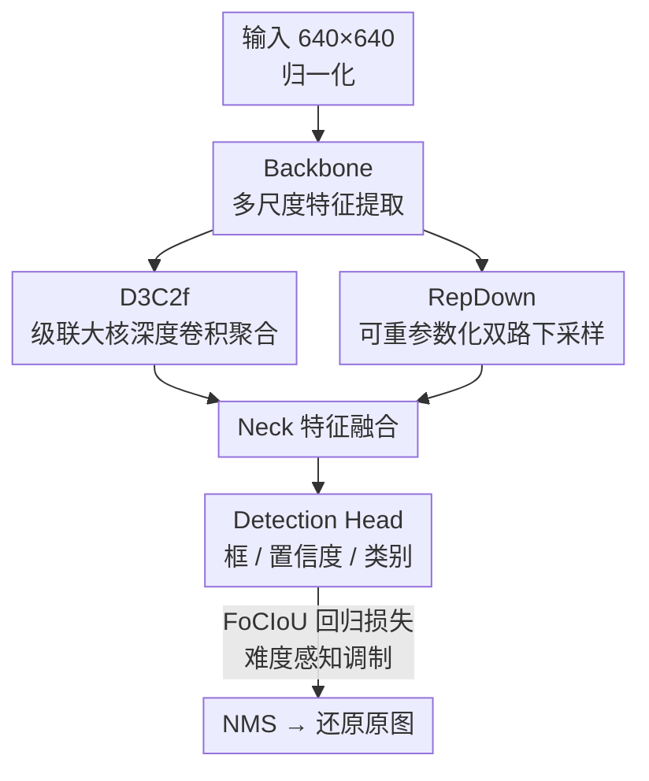

# YOLO-ULM: Ultra-Lightweight Models for Real-Time Object Detection

**会议**: CVPR 2026  
**论文**: [CVF Open Access](https://openaccess.thecvf.com/content/CVPR2026/html/Han_YOLO-ULM_Ultra-Lightweight_Models_for_Real-Time_Object_Detection_CVPR_2026_paper.html)  
**代码**: 待确认  
**领域**: 目标检测  
**关键词**: 实时检测、轻量化、大核深度卷积、重参数化下采样、IoU 损失

## 一句话总结
在 YOLOv12 骨架上替换两类高耗算子（特征聚合换成基于级联大核深度卷积的 D3C2f、下采样换成可重参数化的双路 RepDown），再配一个对难易样本自适应的 FoCIoU 损失，做出一个从零训练、参数和算力都更省、精度反而超过 YOLOv11/12/13 与 RT-DETR 的超轻量实时检测器。

## 研究背景与动机

**领域现状**：实时检测里 YOLO 系列长期占据速度-精度最优折中。当前主流分两条路线——基于注意力的（YOLOv12 的 A2C2f）建模能力强，但二次复杂度和访存瓶颈拖慢实时性；基于 CNN 的（YOLOv8 的 C2f、YOLOv11 的 C3k2）在等算力下能比注意力变体快约 3×，是落地主力。

**现有痛点**：作者把矛头精确指向 YOLO 三个最吃算力的环节，并用统一输入下的实测数据量化了它们的低效。以特征聚合为例，对 $X_{in}\in\mathbb{R}^{1024\times20\times20}$，C2f 因为堆叠多个 Bottleneck 要 7.35M 参数 / 2.94G FLOPs，C3k2 降到 2.0G FLOPs 但仍有 4.99M 参数，A2C2f 用注意力把 FLOPs 压到 2.33G、参数却涨到 5.81M，访存瓶颈把理论加速吃掉。下采样环节，标准 Conv 要 4.72M 参数 / 1.89G FLOPs；YOLOv9 的 ADown 双路把参数压到 1.31M，却带来高频信息丢失；YOLOv10 的 SCDown 更省（0.54M），却削弱了局部相关性。损失环节，CIoU 依赖经验调参，形状剧变时训练不稳，且没有针对难易样本的自适应加权，会过度关注容易样本。

**核心矛盾**：现有轻量化方法过度追求速度，忽视了特征提取与跨阶段空间变换中重要信息的丢失，于是要么为精度牺牲速度、要么为速度牺牲精度，缺一个能同时省参数、省算力又不掉点的统一范式。

**本文目标**：把上面三个低效环节各自换成一个「双驱动（效率 + 精度）」的新算子，整体重塑 YOLO 的特征聚合、下采样、回归损失，做出一个超轻量但高精度的实时检测器。

**核心 idea**：用级联大核深度卷积重做特征聚合（D3C2f）、用可重参数化双路深度卷积重做下采样（RepDown）、用难度感知的 IoU 项重做回归损失（FoCIoU），三者叠加在 YOLOv12 上，并按需调骨架通道扩张比，得到 YOLO-ULM 及其更快的 Turbo 版本。

## 方法详解

### 整体框架
YOLO-ULM 不另起炉灶，而是站在 YOLOv12 的 backbone-neck-head 范式上做「换算子 + 调参数」的外科手术。输入图像统一缩放到 $640\times640$ 并归一化，backbone 提取多尺度特征（其中 `C3k=False` 时 C3k2 退化为 C2f），neck 做特征融合，head 预测框、置信度和类别，最后 NMS 滤除冗余框并还原到原图尺寸。

改动集中在三处：① 把深层网络（高维通道空间）里的特征聚合模块换成 **D3C2f**，用大核深度卷积补回小核在深层受限的感受野；② 把 backbone 和 neck 里的下采样换成 **RepDown**，训练时双路、推理时重参数化成单路 $7\times7$ 深度卷积；③ 回归损失从 CIoU 换成 **FoCIoU**，加一个难度感知的动态梯度调制。此外还对图 2 里被「过度压缩」的两个 C3k2 模块把输入通道扩张比从 0.25 调回 0.5（缓解信息过压），并重新标定 Conv 的分组数（缓解过度分组带来的组间通信瓶颈）。通过设不同宽度缩放因子得到 N/S/M/L/X 五个变体；再精修 backbone 参数得到主打更低延迟的 Turbo 系列。

### 关键设计

**1. D3C2f：用级联大核深度卷积补回深层受限的感受野**

痛点是 C2f / C3k2 在金字塔各层一律用小核，深层网络感受野被锁死，抓不到高层语义、大目标检测受损；同时多分支 Bottleneck 和全通道卷积带来计算冗余。作者提出 D3 块——级联三个深度卷积：先用一个 $3\times3$ 深度可分离卷积（DSConv，由 $1\times1$ pointwise + $3\times3$ depthwise 组成，分组数 $C=eC_{in}$，$e$ 为压缩比）做空间与通道解耦；再插一个 $7\times7$ 大核深度卷积用分组方式扩张感受野、补全局建模；由于前面把跨通道交互拆成了两个独立阶段会削弱复杂关系建模，再级联一个 $3\times3$ DSConv 把跨通道-空间交互和细粒度特征找回来；最后加残差连接稳梯度。把 D3 块嵌进类 C2f 的结构就是 D3C2f：用切片（sliced）策略把中间特征切两半，一半直送 Concat、另一半过 $N$ 个 D3 块，降低拼接时的峰值显存。

为什么有效——以 $C_{in}=C_{out}=C$、扩张比 $e=0.5$、开启 shortcut、$n=1$ 为例，D3C2f 的参数和算力可降到 $O(4.5C^2+67C)$ 与 $O(4.5HWC^2+67HWC)$，而 C2f 因内部多个 Bottleneck 是 $O(7C^2)$ 与 $O(7HWC^2)$。当通道数 $C$ 较大时（正是深层网络的情形），D3C2f 相比 C2f 算力降约 35.7%，所以它被专门放在 YOLO 的高维通道空间实现整体结构轻量化。

**2. RepDown：训练时双路异构感受野、推理时重参数化成单路**

痛点是标准 Conv 下采样参数冗余、ADown 的池化重设计会丢高频。RepDown 设计了「通道-空间双解耦 + 异构感受野并行融合」：先用一个 $1\times1$ pointwise 卷积以低成本 $O(C_{in}C_{out}HW+2C_{out})$ 升通道；再分两条 stride=2 的空间路——主路用 $7\times7$ 深度卷积做大尺度空间预聚合，辅路用 $3\times3$ 深度卷积保住边缘纹理等高频成分；两路逐元素相加做跨尺度语义融合。若 $C_{out}=2C_{in}=2C$，借双路参数共享其参数只线性增长 $O(31HWC)$，把复杂度从标准卷积分支的二次 $O(C^2)$ 降到线性 $O(C)$。

关键在推理时的重参数化：把训练得到的双分支通过零填充对齐核尺寸，再把两支的权重与偏置逐元素相加，等价合并成一个 $7\times7$ 深度卷积——训练时保留多尺度提取能力，推理时退化成高效单分支。整体上 RepDown 把下采样的参数 / 算力压到 $O(2C^2+128C)$ 与 $O(2HWC^2+29HWC)$，明显低于 Conv 的 $O(18C^2)$/$O(4.5HWC^2)$ 和 ADown 的 $O(5C^2+2C)$/$O(1.25HWC^2+4.6HWC)$，且因为深层大通道层最吃下采样成本，RepDown 就部署在这些层收益最大。

**3. FoCIoU：给 CIoU 加一个难度感知的动态梯度调制**

痛点是 CIoU 没有难易样本自适应机制，训练不稳且偏向容易样本。FoCIoU 完整保留 CIoU 原式 $\text{CIoU}=\text{IoU}-\frac{\rho^2(b_{pred},b_{gt})}{c^2}-\alpha v$（$\rho$ 为中心点距离、$c$ 为最小外接框对角线、$v$ 度量宽高比差异、$\alpha=\frac{v}{(1-\text{IoU})+v}$），在此之上引入基于 Focaler-IoU 的非线性区间映射 $\text{IoU}_{MF}$：

$$\text{IoU}_{MF}=\begin{cases}0, & \text{IoU}<m\\[2pt]\dfrac{(\text{IoU}-m)^\beta}{(n-m)^\beta}, & m\le\text{IoU}\le n\\[2pt]1, & \text{IoU}>n\end{cases}$$

其中 $\beta$ 是非线性难度感知因子（$\beta$ 越大越强调难样本，为防过拟合设 $\beta=2$），$m,n\in[0,1]$ 是区间端点。最终损失为 $l_{FoCIoU}=1-\text{CIoU}+\text{IoU}-\text{IoU}_{MF}$，再按类别权重归一化聚合所有 anchor。其精妙处在于差值项 $\Delta=\text{IoU}-\text{IoU}_{MF}$ 实现了动态梯度调制：容易样本（高 IoU）$\Delta\to0$，让额外梯度项消失；困难样本（低 IoU）$\Delta\to1$，放大梯度增加关注——不加任何参数和 FLOPs 就把训练注意力自适应地往难样本上偏。

### 损失函数 / 训练策略
五个变体全部在 COCO 上**从零训练（无预训练权重）**，用 SGD（momentum 0.937、weight decay $5\times10^{-4}$），初始学习率 $1\times10^{-2}$ 线性衰减到 $1\times10^{-4}$；数据增强用 Mosaic、Mixup、copy-paste。延迟在 T4 GPU + TensorRT FP16 下测。Turbo 版沿用同一套设置，只精修 backbone 参数换取更低延迟。

## 实验关键数据

### 主实验
COCO `val` 上与 SOTA 实时检测器对比（mAP 为 IoU 0.50:0.95，延迟为 T4 + TensorRT FP16，↑越大越好 / ↓越小越好）：

| 变体 | 模型 | FLOPs(G)↓ | 参数(M)↓ | mAP↑ | 延迟(ms)↓ |
|------|------|-----------|----------|------|-----------|
| N | YOLOv11-N | 6.5 | 2.6 | 39.4 | 1.50 |
| N | YOLOv12-N | 6.5 | 2.6 | 40.6 | 1.64 |
| N | YOLOv13-N | 6.5 | 2.5 | 41.6 | 1.97 |
| N | **YOLO-ULM-N** | 6.4 | **2.1** | **41.6** | 1.52 |
| N | **YOLO-ULM-Turbo-N** | 5.8 | 2.1 | 40.7 | **1.48** |
| S | RT-DETR-R18 | 60.0 | 20.0 | 46.5 | 4.58 |
| S | YOLOv12-S | 21.4 | 9.3 | 48.0 | 2.61 |
| S | **YOLO-ULM-S** | 21.2 | **7.4** | **48.1** | 2.55 |
| L | RT-DETR-R50 | 136.0 | 42.0 | 53.1 | 6.90 |
| L | YOLOv13-L | 88.4 | 27.6 | 53.4 | 8.63 |
| L | **YOLO-ULM-L** | 95.1 | **22.8** | **54.1** | 6.32 |
| X | YOLOv12-X | 199.0 | 59.1 | 55.2 | 11.79 |
| X | **YOLO-ULM-X** | 213.1 | **51.0** | **55.6** | 11.47 |

要点：N 档以更少参数（2.1M vs 2.6M）打平 YOLOv13-N 的 41.6% mAP，却把延迟从 1.97ms 降到 1.52ms（约快 22.8%），并超 YOLOv11/12-N 各 2.2% / 1.0%。S 档 YOLO-ULM-Turbo 比 RT-DETR-R18 高 1.2% mAP，FLOPs 少 68.7%、参数少 64%。L/X 档分别超 YOLOv11/12/13 同档约 0.4%~1.0% mAP，同时参数显著更少。

分尺寸 AP（Table 2，单位 %）显示精度增益不偏科：

| 模型 | mAP | AP_small | AP_medium | AP_large |
|------|-----|----------|-----------|----------|
| YOLO-ULM-N | 41.6 | 21.5 | 45.8 | 60.7 |
| YOLO-ULM-M | 52.8 | 35.2 | 58.6 | 69.5 |
| YOLO-ULM-X | 55.6 | 40.6 | 61.0 | 71.8 |

### 消融实验
Table 3（N / M 变体，逐个叠加组件；row 1/6 为基线）：

| # | 变体 | D3C2f | RepDown | FoCIoU | FLOPs(G) | 参数(M) | mAP |
|---|------|-------|---------|--------|----------|---------|-----|
| 1 | 基线-N | ✗ | ✗ | ✗ | 6.7 | 2.6 | 40.7 |
| 2 | Ours-N | ✓(7) | ✗ | ✗ | 6.7 | 2.6 | 40.9 |
| 3 | Ours-N | ✓(7) | ✓(7,P) | ✗ | 6.5 | 2.1 | 41.0 |
| 4 | Ours-N | ✓(7) | ✓(7,P) | ✓ | 6.5 | 2.1 | 41.2 |
| 5 | Ours-N | ✓(5) | ✓(7) | ✓ | 6.4 | 2.1 | 41.6 |
| 6 | 基线-M | ✗ | ✗ | ✗ | 72.6 | 20.6 | 52.6 |
| 8 | Ours-M | ✓(7) | ✓(7,P) | ✗ | 70.2 | 16.0 | 52.5 |
| 9 | Ours-M | ✓(7) | ✓(7,P) | ✓ | 70.2 | 16.0 | 52.8 |

算子级对比（Table 4，均在 N 变体）：

| 类别 | 模块 | 参数(M) | mAP / AP50 |
|------|------|---------|-----------|
| 特征聚合 (a) | C3 / C2f / **D3C2f** | 2.5 / 2.7 / 2.6 | 40.4 / 40.8 / **40.9** |
| 下采样 (b) | Conv / ADown / **RepDown** | 2.6 / 2.3 / **2.1** | 40.9 / 40.7 / **41.2** |
| RepDown 核 (d) | 5×5 / **7×7** / 9×9 | — | AP50 41.3 / **41.6** / 41.2 |

### 关键发现
- **RepDown 是省参数主力**：N 档加它参数从 2.6M 降到 2.1M（−3.0%）、FLOPs 降 19.2%；M 档参数从 20.2M 降到 16.0M（−20.8%）、FLOPs 降约 2.9%，几乎不掉点。三组件叠加让 N 档 mAP +0.9%、同时 M 档参数减 22.3% / FLOPs 减 3.3%。
- **D3C2f 在等复杂度下小幅提精度**：相比 C2f 少 3.7% 参数 / 1.5% FLOPs 还高 0.1% mAP，比 C3 在同复杂度下高 0.5% mAP；M 档加它精度持平但更省。
- **FoCIoU 是零成本增益**：不加任何参数和 FLOPs，N / M 档分别 +0.2% / +0.3% mAP，印证难度感知调制确实有用。
- **核尺寸有甜点**：RepDown 用 $7\times7$ 比 $5\times5$/$9\times9$ 都好（AP50 41.6 vs 41.3 / 41.2），过大反而精度回落、延迟上升；最终 N 配置选 D3C2f 用 5×5 + RepDown 用 7×7 取得 41.6% 的最佳点。

## 亮点与洞察
- **「换算子不改范式」的工程哲学**：不重设计整网，只精准替换 YOLO 里三个被量化证明最低效的环节，可迁移性强——这套 D3C2f / RepDown 思路理论上能直接嫁接到任意 YOLO 变体上。
- **训练-推理结构解耦**：RepDown 训练双路学异构感受野、推理重参数化合并为单路 $7\times7$，把「多尺度表达力」和「单分支推理速度」两个通常打架的目标同时拿到，是重参数化思想用在下采样上的漂亮落地。
- **损失里的难度调制几乎免费**：FoCIoU 用一个差值项 $\Delta=\text{IoU}-\text{IoU}_{MF}$ 就实现 focal 式的难样本聚焦，不引入超参敏感的额外分支，零算力换稳定增益，值得借鉴到其它回归任务。
- **从零训练仍超越对手**：不靠预训练权重就压过 YOLOv11/12/13 与 RT-DETR，说明增益来自结构本身而非额外数据。

## 局限与展望
- **增益偏小且分散**：N 档相对最强基线 YOLOv13 是「持平精度 + 提速」，多数档位 mAP 提升在 0.4%~1.0%，更多是「同精度更省」而非精度大跨步；是否到达统计显著作者未讨论。
- **延迟收益不全面**：X 档 FLOPs（213.1G）甚至高于 YOLOv12-X（199.0G），轻量化主要体现在参数量而非算力，"ultra-lightweight" 在大档位名不副实。
- **只验证 COCO 单数据集**：未在小目标密集（如航拍 DOTA）或域迁移场景验证，而 RepDown 主打保边缘高频，最能发挥的小目标场景反而缺针对性实验。
- **改进方向**：可探索把 D3C2f 的核尺寸/压缩比做成随层自适应（类似 LSKNet 的弹性核），或把 FoCIoU 的 $\beta,m,n$ 在训练中动态调度，进一步榨取精度。

## 相关工作与启发
- **vs YOLOv12（A2C2f 注意力）**: YOLOv12 用轻量注意力-卷积混合提精度，但访存瓶颈抵消理论加速；本文回到纯 CNN、用大核深度卷积补感受野，在等档位上参数更少、延迟更低，论证「等算力 CNN 比注意力快约 3×」的工程取向。
- **vs YOLOv9 ADown / YOLOv10 SCDown**: 二者为省参数牺牲了高频信息或局部相关性；RepDown 用双路异构感受野 + 推理重参数化，既保高频又单分支推理，精度与效率兼得。
- **vs RTMDet / ConvNeXt / YOLO-MS / LSKNet（大核卷积）**: 它们用固定或层级核组合，难建模高维通道特征且有冗余；本文级联 + 并行深度卷积的组合在通道维上更紧凑，针对检测做了专门取舍。
- **vs CIoU / Focaler-IoU**: 在 CIoU 几何约束之上嫁接 Focaler 的非线性区间映射，把「几何精修」和「难易样本自适应」合到一个损失里，是两条损失改进路线的融合。

## 评分
- 新颖性: ⭐⭐⭐⭐ 三个组件各有巧思（级联大核、下采样重参数化、损失难度调制），但都属在成熟思路上的组合改良而非全新范式。
- 实验充分度: ⭐⭐⭐⭐ 五档全做、主表 + 分尺寸 + 逐组件 + 算子级 + 核尺寸消融齐全，但仅限 COCO 单数据集、缺小目标专项验证。
- 写作质量: ⭐⭐⭐⭐ 用统一输入量化各算子开销、动机扎实，公式与复杂度推导清楚。
- 价值: ⭐⭐⭐⭐ 即插即用的轻量算子对工业实时检测落地有直接参考价值，从零训练即超 SOTA 含金量高。

<!-- RELATED:START -->

## 相关论文

- [\[CVPR 2026\] AKCMamba-YOLO: Selective State Space Models For Real-Time Object Detection](akcmamba-yolo_selective_state_space_models_for_real-time_object_detection.md)
- [\[CVPR 2026\] YOLO-Master: MOE-Accelerated with Specialized Transformers for Enhanced Real-time Detection](yolo-master_moe-accelerated_with_specialized_transformers_for_enhanced_real-time.md)
- [\[AAAI 2026\] YOLO-IOD: Towards Real Time Incremental Object Detection](../../AAAI2026/object_detection/yolo-iod_towards_real_time_incremental_object_detection.md)
- [\[CVPR 2026\] Does YOLO Really Need to See Every Training Image in Every Epoch?](does_yolo_really_need_to_see_every_training_image_in_every_epoch.md)
- [\[CVPR 2026\] CD-Buffer: Complementary Dual-Buffer Framework for Test-Time Adaptation in Adverse Weather Object Detection](cd-buffer_complementary_dual-buffer_framework_for_test-time_adaptation_in_advers.md)

<!-- RELATED:END -->
