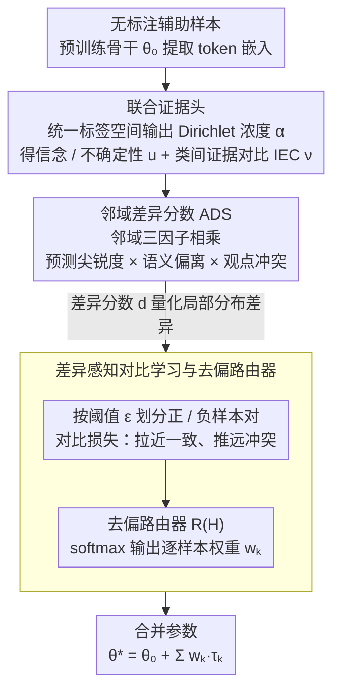

<!-- 由 src/gen_stubs.py 自动生成 -->
# BD-Merging: Bias-Aware Dynamic Model Merging with Evidence-Guided Contrastive Learning

**会议**: CVPR 2026  
**arXiv**: [2603.03920](https://arxiv.org/abs/2603.03920)  
**代码**: 暂无  
**领域**:优化
**关键词**: Model Merging, Multi-Task Learning, Evidential Deep Learning, Distribution Shift, Contrastive Learning, uncertainty estimation

## 一句话总结

提出 BD-Merging 框架，通过 Dirichlet 证据建模 + 邻域差异分数（ADS）+ 差异感知对比学习，训练去偏路由器来自适应分配模型合并权重，显著提升合并模型在测试时分布偏移和未见任务上的鲁棒性与泛化能力。

## 研究背景与动机

**模型合并（Model Merging）的兴起**：多任务学习需要大量数据和计算资源，且受隐私限制无法共享数据。模型合并通过整合独立微调的检查点，无需重新训练即可实现多任务能力，成为高效替代方案。

**分布偏移下的可靠性被忽视**：现有 MM 方法普遍假设测试数据与训练/辅助数据分布一致，但现实中传感器噪声、传输失真、环境变化等导致测试时输入分布偏移，严重削弱合并模型的性能。

**测试时偏差（Test-time Bias）**：实验表明即使轻微的自然扰动也会导致所有现有方法准确率显著下降（如 Task Arithmetic 在 L3 级别下降 16.8%），说明当前方法缺乏对输入级噪声的鲁棒性。

**未见任务泛化不足**：AdaMerging 在已见任务上达 90.79%，但在未见任务上骤降至 49.83%，暴露出严重的过拟合问题。依赖辅助数据的方法在分布不匹配时反而放大分布差距。

**缺乏细粒度样本级别对齐**：现有方法无法捕捉样本级的分布差异，仅在全局或任务级调整权重，无法应对异构分布偏移带来的冲突知识和有偏集成问题。

**核心洞察**：利用证据不确定性（evidential uncertainty）捕捉分布差异，以此指导自适应表示对齐，是解决 MM 分布偏移问题的关键突破口。

## 方法详解

### 整体框架

BD-Merging 想解决的是同一个合并模型在测试时遇到分布偏移、或被喂入未见任务时性能崩盘的问题，而它的思路是：先把"这个输入到底有多反常"量化出来，再让一个轻量路由器据此为每个样本临时调配合并权重。具体来说，输入先经过预训练骨干提取特征，附在骨干上的证据头在统一标签空间里输出一组 Dirichlet 浓度参数，由此得到信念、不确定性等证据量；接着邻域差异分数（ADS）用这些证据量衡量当前样本和它的邻居有多不一致，从而把"分布内的正常样本"和"被扰动/陌生的异常样本"区分开；最后差异感知对比学习用 ADS 划分正负样本对，训练一个去偏路由器，为每个样本（乃至每一层）输出一组合并权重 $\{w_k\}$，把多个任务向量加权拼成最终参数 $\theta^* = \theta_0 + \sum_k w_k \tau_k$。整个流程不需要任何标注，完全在无监督设置下完成。

### 关键设计

**1. 联合证据头：在重叠标签空间里量出"这个预测有多不可信"**

测试时分布偏移最棘手的地方，是它会放大多任务重叠标签空间里的语义歧义——同一张被扰动的图，模型可能在两个相邻类之间反复摇摆，而传统证据深度学习（EDL）只看"总证据量"和"最高类置信度"，根本分不清这种跨任务的语义漂移。BD-Merging 在预训练骨干上附加一个证据头，在统一标签空间 $\mathcal{Y} = \bigcup_{k=1}^{K} \mathcal{Y}_k$ 上为每个样本输出 Dirichlet 浓度参数 $\boldsymbol{\alpha}$，进而算出信念质量 $b_c$、不确定性 $u$ 和预测概率 $p_c$。关键的补强是引入类间证据对比（IEC）指标

$$\nu = \frac{S}{\alpha_{\hat{c}^{(1)}}} \cdot \frac{L}{S} \cdot \frac{\alpha_{\hat{c}^{(2)}}}{\alpha_{\hat{c}^{(1)}}}$$

它把预测集中度、类间竞争、语义模糊性三件事拧成一个标量：第一项看最优类证据相对总证据量是否突出，后两项则衡量第二高类与最高类的胶着程度。正因为 IEC 显式刻画了"第一名和第二名拉不开差距"这种类间依赖，它能比单一不确定性更细粒度地辨别预测失败的类型。

**2. 邻域差异分数（ADS）：用三个互补视角拼出局部分布差异的全貌**

有了样本级的证据量还不够——要判断一个样本是否"反常"，得看它和周围邻居比起来是否格格不入。ADS 对每个样本 $x_i$ 在特征空间里取半径 $r$ 的邻域集 $\mathcal{A}_r(x_i)$，再把三个互补因子相乘成最终的差异分数 $d_{ik}$。单看任何一个因子都会漏掉一部分信息，三者相乘才能从"不确定性、语义、置信冲突"三个维度给出统一的局部差异视图。

第一个因子 Prediction Sharpness 衡量邻域整体的认识论不确定性，即邻居们的预测够不够"尖"：

$$\mathrm{Sharp}(x_i) = \mathbb{E}_{x_j \in \mathcal{A}_r}\, \log\!\left(\frac{S_j}{\max_c \alpha_{jc}} - 1\right)$$

第二个因子 Semantic Divergence 量化目标样本与邻居在类级分布上的偏差，把每个样本的浓度参数归一成概率后做 $L_1$ 距离：

$$\mathrm{Div}(x_i) = \mathbb{E}_{x_j \in \mathcal{N}_r}\, \left\| \frac{\boldsymbol{\alpha}_i}{S_i} - \frac{\boldsymbol{\alpha}_j}{S_j} \right\|_1$$

第三个因子 Opinion Conflicts 专挑那些"都很自信却互相矛盾"的样本对——只有当两个样本都低不确定性（$(1-u_i)(1-u_k)$ 接近 1）、预测又对不上时才会被放大：

$$\mathrm{Conf}(x_i, x_k) = \sum_c |p_{ic} - p_{kc}| \cdot (1-u_i)(1-u_k)$$

三因子联合后，分布内的正常样本 ADS 偏低，被扰动或来自未见任务的输入 ADS 显著抬高，从而为下一步的对比划分提供干净的信号。

**3. 差异感知对比学习与去偏路由器：把差异信号翻译成逐样本的合并权重**

固定权重合并的通病是异构任务之间互相干扰——一组对所有输入都一样的权重，注定要在不同任务上做妥协。BD-Merging 让 ADS 直接驱动一次对比学习：以阈值 $\epsilon$ 把邻域切成正样本集 $\mathcal{M}_r^+(i)$（$d_{ik} < \epsilon$，分布一致）和负样本集 $\mathcal{M}_r^-(i)$（$d_{ik} \geq \epsilon$，分布冲突），对比损失把一致的样本表示拉近、把冲突的推远，相当于让特征空间按"分布是否对齐"重新组织。在此之上训练一个去偏路由器（两层 MLP），它读取骨干的 token 嵌入 $\mathbf{H}$，输出逐样本的合并权重

$$\{w_k\} = \mathrm{softmax}\big(R(\mathbf{H})\big), \qquad \theta^* = \theta_0 + \sum_k w_k \cdot \tau_k$$

于是每个输入都能拿到一组为它量身定制的任务向量组合：分布正常的样本沿用稳健配比，反常样本则被路由器临时偏向更可靠的任务分支。正是这种由证据信号牵引的动态分配，让合并模型在减少任务干扰的同时也具备了对陌生分布的适应力。

## 损失函数与训练策略

整体训练分两阶段：

**阶段一：证据头训练**

$$\mathcal{L}_{\mathrm{Head}} = \mathcal{L}_{\mathrm{Ent}} + \gamma \mathcal{L}_{\mathrm{Inv}}$$

- $\mathcal{L}_{\mathrm{Ent}}$：熵最小化 + KL 散度正则到非信息先验，鼓励尖锐预测同时避免过度自信
- $\mathcal{L}_{\mathrm{Inv}}$：逆相关损失，约束不确定性 $u$ 与 IEC $\nu$ 之间保持反比关系

**阶段二：路由器训练**

$$\mathcal{L}_{\mathrm{BD}} = \mathcal{L}_{\mathrm{Unsup}} + \eta \mathcal{L}_{Dis}$$

- $\mathcal{L}_{\mathrm{Unsup}}$：Shannon 熵最小化，增强合并预测的确定性
- $\mathcal{L}_{Dis}$：差异感知对比损失，基于 ADS 划分正负样本对

所有正则系数（$\lambda, \gamma, \eta$）均设为 0.1，训练 300 epochs，batch size 16。

## 实验关键数据

**表1：测试时偏差下的性能（ViT-B/32，8 个任务平均准确率）**

| 方法 | Clean | L1 (↓) | L2 (↓) | L3 (↓) |
|------|-------|--------|--------|--------|
| Task Arithmetic | 69.09 | 64.07 (−7.3%) | 60.30 (−12.7%) | 57.50 (−16.8%) |
| Ties-Merging | 72.92 | 68.14 (−6.6%) | 64.34 (−11.8%) | 61.51 (−15.6%) |
| AdaMerging (Layer) | 74.33 | 69.00 (−7.2%) | 64.46 (−13.3%) | 61.22 (−17.6%) |
| Twin-Merging | 84.10 | 79.13 (−5.9%) | 74.17 (−11.8%) | 70.88 (−15.7%) |
| AdaMerging w/Surgery | 84.40 | 79.02 (−6.4%) | 74.33 (−11.9%) | 70.97 (−15.9%) |
| **BD-Merging (Layer)** | **87.15** | **83.31 (−4.4%)** | **78.78 (−9.6%)** | **75.36 (−13.5%)** |

BD-Merging 在所有扰动级别下均为最优，且性能衰退幅度最小（L1 仅降 4.4% vs 其他 5.9%–7.3%）。

**表2：已见 vs 未见任务泛化（4 见 + 4 未见）**

| 方法 | 已见任务 Avg | 未见任务 Avg |
|------|-------------|-------------|
| AdaMerging | 90.79 | 49.83 |
| Twin-Merging | 93.06 | 53.03 |
| **BD-Merging** | **94.53** | **55.01** |

BD-Merging 同时提升已见和未见任务的准确率，泛化-专化平衡最优。

**表3：消融实验（Clean / Corrupted L2）**

| 变体 | Clean | Corrupted |
|------|-------|-----------|
| BD-Merging | 87.15 | 78.78 |
| w/o Router | 78.31 (−8.84) | 67.25 (−11.53) |
| w/o ADS | 84.48 (−2.67) | 75.44 (−3.34) |
| w/o $\mathcal{L}_{Dis}$ | 83.34 (−3.81) | 74.26 (−4.52) |
| w/o Div(·) | 85.36 (−1.79) | 76.28 (−2.50) |

去偏路由器是最关键组件（移除后下降 ~9/11 点），ADS 三因子中 Div(·) 贡献最大。

## 亮点与洞察

1. **问题定义精准**：首次系统研究模型合并在测试时分布偏移下的可靠性问题，明确提出测试时偏差和未见任务泛化两大挑战。
2. **证据建模与对比学习的巧妙结合**：用 EDL 产生的不确定性信号指导对比学习的正负样本划分，形成闭环——证据建模发现差异 → ADS 量化差异 → 对比学习利用差异。
3. **效率-性能平衡**：BD-Merging 在接近单独微调模型性能的同时，计算开销远低于 AdaMerging w/Surgery 等方法。
4. **路由器可解释性好**：不同未见任务的路由权重分布呈现清晰的任务特异性模式（如 Cars 集中分配 vs SUN397 均匀分配），具有直观的可解释性。

## 局限与展望

1. **仅验证图像分类**：8 个数据集均为图像分类，缺乏对 NLP、多模态等其他模态和任务类型的验证，泛化性存疑。
2. **邻域构建开销**：ADS 需要计算特征空间中的邻域集，对于大规模数据集可能带来额外计算负担，论文未讨论可扩展性。
3. **超参数敏感性**：邻域半径 $r$、阈值 $\epsilon$、多个损失系数均需调优，论文中所有系数简单设为 0.1，但不同场景下可能需要精细调整。
4. **未见任务提升有限**：虽然 BD-Merging 在未见任务上优于基线（55.01% vs 53.03%），但绝对水平仍远低于预训练模型（56.99%），提升空间较大。
5. **路由器结构固定**：两层 MLP 路由器的设计较简单，可探索更复杂的注意力机制或 mixture-of-experts 结构。

## 相关工作与启发

- **Task Arithmetic / Ties-Merging / DARE**：静态权重合并方法，不考虑输入级自适应，在分布偏移下鲁棒性差。BD-Merging 通过动态路由器超越了这类固定权重范式。
- **AdaMerging**：学习任务/层级自适应权重，但基于辅助数据优化，在辅助分布与测试分布不匹配时会过拟合。BD-Merging 的证据引导机制直接在测试特征上建模不确定性，减少对辅助数据分布的依赖。
- **Twin-Merging**：动态整合模块化知识，效率较高但精度受限。BD-Merging 在精度和效率之间取得更好的平衡。
- **Surgery**：通过外科手术式调整提升合并质量，但计算开销大。BD-Merging 达到相近精度的同时开销更小。
- **Evidential Deep Learning**：BD-Merging 将 EDL 从传统 OOD 检测任务扩展到模型合并场景，为 EDL 的应用开辟了新方向。

## 评分

- **新颖性**: ⭐⭐⭐⭐ — 将证据学习引入模型合并并设计 ADS + 对比学习闭环，思路新颖且工程完整
- **实验充分度**: ⭐⭐⭐⭐ — 多级扰动、已见/未见任务、消融、路由器分析、多骨干验证覆盖全面，但缺乏非视觉任务
- **写作质量**: ⭐⭐⭐⭐ — 动机清晰、公式推导完整、图表丰富，问题定义和方法衔接流畅
- **价值**: ⭐⭐⭐⭐ — 首次系统研究 MM 的分布偏移鲁棒性，对实际部署场景有重要参考价值

<!-- RELATED:START -->

## 相关论文

- [\[CVPR 2026\] Model Merging in the Essential Subspace](model_merging_in_the_essential_subspace.md)
- [\[CVPR 2026\] ACE-Merging: Data-Free Model Merging with Adaptive Covariance Estimation](ace-merging_data-free_model_merging_with_adaptive_covariance_estimation.md)
- [\[CVPR 2026\] DC-Merge: Improving Model Merging with Directional Consistency](dc-merge_improving_model_merging_with_directional_consistency.md)
- [\[CVPR 2026\] Defending Unauthorized Model Merging via Dual-Stage Weight Protection](defending_unauthorized_model_merging_via_dual-stage_weight_protection.md)
- [\[CVPR 2026\] Label-Free Cross-Task LoRA Merging with Null-Space Compression](label-free_cross-task_lora_merging_with_null-space_compression.md)

<!-- RELATED:END -->
