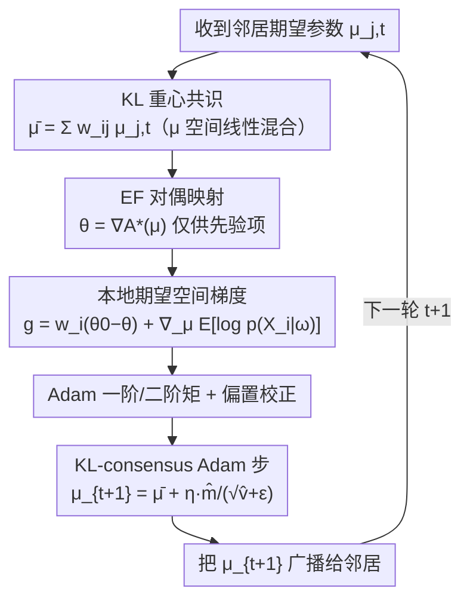

# Beyond Euclidean Gossip: KL-Barycentric Consensus on Heterogeneous and Imbalanced Images

**会议**: CVPR 2026  
**论文**: [CVF OpenAccess](https://openaccess.thecvf.com/content/CVPR2026/html/Xu_Beyond_Euclidean_Gossip_KL-Barycentric_Consensus_on_Heterogeneous_and_Imbalanced_Images_CVPR_2026_paper.html)  
**代码**: https://github.com/x-lu/Beyond-euclidean-gossip  
**领域**: 分布式优化 / 去中心化学习  
**关键词**: 去中心化学习, 变分推断, 自然梯度, KL重心, 信息几何  

## 一句话总结
针对完全去中心化训练在 non-i.i.d. 数据和客户端规模不均衡下崩坏的问题，本文把"邻居间平均模型参数"这个 Euclidean gossip 操作，换成在指数族期望参数空间里做线性混合——它恰好等价于一次曲率感知的 KL 重心共识（自然梯度步），无需构造或求逆 Fisher 矩阵就把单轮复杂度从 $O(d^3)$ 降到 $O(d)$，并给出一个开销与 Adam 几乎相同的实现 KL-consensus Adam，在 CIFAR-100 上比 Euclidean 共识基线高出约 20% 准确率。

## 研究背景与动机
**领域现状**：完全去中心化学习去掉了中心服务器，每个客户端（如医院）只和图上的邻居通信、数据严格本地化，特别适合隐私和合规敏感的场景。主流做法几乎都在 **Euclidean 空间**里达成共识：Gossip-SGD 直接广播模型权重做成对平均，SGP 加一个 push-sum 标量去偏，GT-SGD 额外通信一个 tracker 去估计全局梯度，QGM 用邻居参数维护一个近似全局的动量。在图连通良好、数据同分布时，它们都能逼近集中式训练的精度。

**现有痛点**：这些方法的共识本质都是"对原始信息做均匀加权平均"，**完全忽略了参数流形的曲率和客户端的可靠性**。于是一个样本极少、噪声大、甚至 OOD 的小客户端，和一个数据又多又干净的大客户端，在平均时被赋予了同等权重。一旦遇到现实里常见的统计异质性（不同医院的患者群体、采集协议、设备差异导致 covariate shift）叠加样本量不均衡，朴素平均会被大站点拉偏、放大分布漂移，训练既不稳又掉点。

**核心矛盾**：去中心化变分贝叶斯（DVB）本来给出了一个原则性的出路——协调各客户端的 ELBO、用后验的 KL 来度量"谁更可信"。但经典 DVB 要么要求共轭指数族、闭式更新，要么需要全局 ELBO 计算，**根本无法扩展到现代深度网络的百万级参数**。所以问题变成：能不能既享受信息几何（KL/Fisher 度量）带来的曲率感知与抗异质性，又不付出构造/求逆 Fisher 矩阵的 $O(d^3)$ 代价？

**本文目标**：(1) 把去中心化共识从 Euclidean 几何搬到 Fisher–Rao 流形，让混合步与曲率对齐；(2) 找到一个无需 Fisher 矩阵、通信量与 Euclidean gossip 持平的实现；(3) 给出凸情形下的收敛保证；(4) 落地成一个能即插即用、开销≈Adam 的优化器。

**切入角度**：作者抓住了指数族（EF）的对偶性——后验从自然参数 $\theta$ 映到期望参数 $\mu = \nabla A(\theta)$ 是一个精确恒等映射，且这个映射只依赖变分族是 EF，**与深度网络似然是否非凸无关**。在 $\mu$ 空间里，自然梯度退化成普通 Euclidean 梯度，而对 $\mu$ 做线性平均恰好就是前向 KL 重心。

**核心 idea**：用"在期望参数 $\mu$ 空间做线性 gossip"替代"在权重空间做线性 gossip"——前者表面上同样廉价，实质上却是一次几何正确的 KL 重心共识。

## 方法详解

### 整体框架
方法解决的是 Eq.(3) 的去中心化共识优化：每个客户端 $i$ 维护本地变分参数，只和邻居 $N_i$ 通信，目标是在不依赖中心协调者的前提下，让所有客户端就一个高质量的变分后验达成一致。整体思路分三层：先在 **自然参数 $\theta$ 空间**把"邻居混合 + 自然梯度上升"写成一步去中心化镜像下降（4.1）；再利用 EF 对偶把这一步**搬到期望参数 $\mu$ 空间**，证明对 $\mu$ 的线性混合就是 KL 重心共识、自然梯度变成普通梯度，从而绕开 Fisher 矩阵（4.2）；最后把这套递推具体实例化成跑在 $\mu$ 上的 Adam（4.3），并在凸情形下证明收敛（4.4）。

下图是 KL-consensus Adam 每个客户端单轮迭代（Algorithm 1）的数据流：

### 关键设计

**1. 自然梯度 VI 共识：把混合步放到 Fisher–Rao 流形上**

Euclidean gossip 在权重空间直接平均，但当各客户端梯度异质时，权重空间的平均方向**未必对应 KL 信任域里的一步**，可能与流形几何错位，从而拖慢甚至破坏训练。本文改在自然参数上做去中心化更新：

$$\theta_{i,t+1} = \sum_{j\in N_i} w_{ij}\,\theta_{j,t} + \eta_t\,\tilde\nabla_\theta L_i(\theta_{i,t})$$

第一项是图诱导的平均算子，其不动点满足边上 $\theta_i=\theta_j$，在谱隙条件下收缩分歧；第二项是 Fisher–Rao 几何下的最速上升方向，其中自然梯度 $\tilde\nabla_\theta L = F(\theta)^{-1}\nabla_\theta L$，而对 EF 后验有 $F(\theta)=\nabla^2 A(\theta)$，正好诱导出参数流形上的 KL（信息）几何。把本地目标展开，先验项的自然梯度有干净形式 $w_i(\theta_0-\theta_{i,t})$，于是单步分解为三件事：**邻居混合**（收缩分歧）、**共轭先验拉力**（把每个客户端的后验锚回共享先验、起稳定作用）、**本地数据驱动的自然梯度**（只有这一项依赖似然）。这让更新天然具备曲率感知和重参数化不变性，对异质性更鲁棒。

**2. 期望参数映射：让 KL 重心共识变成一次廉价线性混合**

设计 1 的更新虽然几何正确，但深度网络里显式构造/求逆 Fisher 矩阵代价是 $O(d^3)$，不可行。本文的关键一招是切换到 EF 的**期望参数** $\mu = \nabla A(\theta) = \mathbb{E}_{q_\theta}[\phi(\omega)]$。在最小坐标下 $F(\theta)=\nabla^2 A(\theta)$，因此自然梯度恰好等于对偶目标在 $\mu$ 空间的普通梯度：$\tilde\nabla_\theta L_i = \nabla_\mu L_i^*(\mu)$。于是整步可以**完全在 $\mu$ 空间进行**，只在需要时映回：

$$\mu_{i,t+1} = \sum_{j\in N_i} w_{ij}\,\mu_{j,t} + \eta_t\,\nabla_\mu L_i^*(\mu_{i,t}),\qquad \theta_{i,t+1}=\nabla A^*(\mu_{i,t+1})$$

为什么这一步是"几何正确"而非凑数？因为在指数族里，对 $\mu$ 做加权线性平均**正是前向 KL 重心（M-projection）**：$q^\star=\arg\min_{q\in\mathrm{EF}}\sum_i w_i\,\mathrm{KL}(q_{\theta_i}\|q)$ 的解满足 $\mu^\star=\sum_i w_i\mu_i$、$\theta^\star=\nabla A^*(\mu^\star)$。这意味着"在 $\mu$ 上做标准 gossip"和"在权重上做标准 gossip"通信量完全相同（都只传一份参数向量），但前者隐式实现了一次曲率正确的 KL 共识。更进一步，Eq.(6) 可写成 $\mu$ 空间上的镜像下降——以 $A^*$ 诱导的 Bregman 散度为正则、再朝邻居一致性正则——说明这是有原则的"下降+混合"递推，而非临时拼凑。复杂度也因此从 $O(d^3)$ 降到 $O(d)$。

**3. KL-consensus Adam：用 Adam 的矩缓存实现自然梯度，开销不变**

要让上面的理论在深度学习里真正可用，需要一个具体优化器。本文把递推实例化为：在期望空间梯度 $g_{i,t}=\nabla_\mu L_i^*(\mu_{i,t})$ 上跑 Adam，同时在 $\mu$ 上做邻居混合实现 KL 共识（即 "KL-consensus in $\mu$ + Adam step on $\nabla_\mu L_i^*$"）。由于 $\mu$ 空间的 Euclidean 梯度就等于 $\theta$ 空间的自然梯度，所以这个实现**天然 Fisher-free**，却继承了 Adam 的逐坐标自适应。每个客户端只维护一个对角高斯后验 $q(\omega)=\mathcal{N}(m,\mathrm{diag}(\sigma^2))$，其期望参数与对偶映射都是 $O(d)$ 闭式：

$$\mu_1=m,\quad \mu_2=m^2+\sigma^2;\qquad \theta_1=m/\sigma^2,\quad \theta_2=-\tfrac12\sigma^{-2}$$

似然梯度项 $\nabla_\mu \mathbb{E}_{q_{\mu_{i,t}}}[\log p(X_i|\omega)]$ 用和标准 Adam 完全一样的单样本蒙特卡洛近似（MC=1，只在当前均值处做一次前向/反向，不额外采样），因此计算和显存几乎与普通 Adam 持平。Algorithm 1 把流程串成：邻居混合 $\bar\mu_{i,t}\leftarrow\sum_j w_{ij}\mu_{j,t}$ → 对偶映射取先验项 → 算本地梯度 $g_{i,t}=w_i(\theta_0-\theta_{i,t})+\nabla_\mu\mathbb{E}[\log p(X_i|\omega)]$ → Adam 一阶/二阶矩与偏置校正 → 期望参数更新 $\mu_{i,t+1}=\bar\mu_{i,t}+\eta_t\,\hat m_{i,t+1}/(\sqrt{\hat v_{i,t+1}}+\epsilon)$ → 广播 $\mu_{i,t+1}$。值得强调，这只是一个范例：任何能给出自然梯度/Fisher 预条件步的优化器（K-FAC、Adafactor、Shampoo 等）都能插进同一套信息形式共识。

**4. 凸情形下的收敛保证**

为了说明"下降+混合"不是经验技巧，作者把 Eq.(4) 视为对全局目标 $L(\theta)=\sum_i L_i(\theta)$ 的去中心化镜像下降，镜像映射取 EF 的 log-partition $A$；经 EF 对偶，它等价于在 $\mu$ 空间对 $f(\mu)=-L^*(\mu)$ 做带共识算子的普通梯度下降。在"图无向连通、混合矩阵 $W$ 对称双随机、谱隙 $1-\lambda$（$\lambda=\max\{|\lambda_2(W)|,|\lambda_M(W)|\}<1$）、梯度光滑无偏方差有界"的标准假设下，Theorem 1 给出：凸 $f$ 配递减步长时平均迭代达到标准去中心化速率 $O\!\big(\tfrac{1}{(1-\lambda)T}\big)$；$\mu_c$-强凸 $f$ 配足够小常步长时线性收敛到一个由方差控制的邻域 $O\!\big(\tfrac{\eta}{1-\lambda}\big)$。网络效应只通过谱隙 $1-\lambda$ 进入，曲率则被 $\mu$ 空间的 EF 信息几何预条件掉。作者明确不宣称深度网络的全局最优，但该分解给出了"客户端漂移受控、分歧误差随混合收缩"的可验证预测。

### 损失函数 / 训练策略
本地目标是分裂后的 ELBO（Eq.2）：$L_i(\theta_i)=w_i\,\mathbb{E}_{q_{\theta_i}}[\log \tfrac{p(\theta)}{q_{\theta_i}(\theta)}]+\mathbb{E}_{q_{\theta_i}}[\log p(X_i|\omega)]$，其中 $w_i$ 把全局 KL 正则按客户端分摊。相对 Adam 只多两个超参且都用数据规模加权：KL 分摊权重 $w_i=N_i/N$，混合权重 $w_{ij}=N_i/(N_i+N_j)$。

## 实验关键数据

### 主实验
在 CIFAR-100（ResNet-50+GroupNorm，从零训练，无数据增强；集中式 SGD 上界 64.57%）上，用 Dirichlet 浓度 $\alpha$ 控制 non-i.i.d. 严重度（越小越异质）、用 $\beta$ 控制样本量不均衡（越小越偏斜）。8 客户端结果（Table 1）：

| 配置（8 clients） | Gossip-SGD | SGP | GT-SGD | QGM | Euclidean-Adam | **KL-consensus Adam** |
|---|---|---|---|---|---|---|
| $\alpha=1.0$ | 21.23 | 14.79 | 40.08 | 54.32 | 53.72 | **60.10** |
| $\alpha=0.1$ | 16.98 | 12.05 | 27.73 | 49.10 | 46.72 | **57.55** |
| $\alpha=0.01$ | 10.77 | 8.89 | 28.61 | 40.85 | 35.18 | **54.39** |
| $\beta=0.5$（$\alpha{=}0.1$） | 13.31 | 12.06 | 29.60 | 43.53 | 47.25 | **53.84** |
| $\beta=0.02$（$\alpha{=}0.1$） | 13.53 | 10.93 | 24.93 | 42.85 | 44.87 | **52.82** |

异质/不均衡越严重，与基线差距越大：在 $\alpha=0.01$ 时领先次优的 QGM 约 13.5 个点，且最接近集中式上界。16 客户端（Table 2）趋势一致，KL-consensus Adam 在所有设置稳居第一（如 $\alpha=0.01$：42.09% vs QGM 34.73%）。医学图像分割 Kvasir-SEG（U-Net+ResNet-34 编码器，集中式 Dice 0.796 / IoU 0.699）上同样全面领先（Table 3，$\alpha=0.1$：Dice 0.767 vs QGM 0.720）。

### 消融实验
核心消融是与 **Euclidean-Adam** 对照——它用完全相同的本地 Adam（minibatch 梯度、EMA 矩、偏置校正、逐坐标缩放）和同样通信预算，**唯一区别是把 $\mu$ 空间的 KL 重心融合换回权重空间的 Euclidean 混合**，因此只改变了共识步的几何。

| 配置（8 clients，CIFAR-100） | $\alpha=1.0$ | $\alpha=0.1$ | $\alpha=0.01$ | 说明 |
|---|---|---|---|---|
| Euclidean-Adam（w/o KL 共识） | 53.72 | 46.72 | 35.18 | 仅 Adam 自适应，权重空间平均 |
| **KL-consensus Adam（Full）** | 60.10 | 57.55 | 54.39 | 信息几何共识，异质下掉点更慢 |

异质从 $\alpha=1.0$ 加到 $0.01$ 时，Euclidean-Adam 掉了约 18.5 个点，而 KL-consensus Adam 只掉约 5.7 个点——说明鲁棒性增益来自"几何正确的 KL 共识控制了客户端漂移"，而非 Adam 自适应本身。

### 关键发现
- **几何才是关键变量**：Euclidean-Adam vs KL-consensus Adam 仅差共识步几何，却在重异质下拉开近 19 个点；QGM 作为次优是因为动量"部分"捕捉了曲率。
- **共识误差可收敛**：作者跟踪逐参数分歧 $E_t=\tfrac1d\sum_i\|\mu_{i,t}-\bar\mu_t\|_2^2$，初始短暂上升后稳步下降并保持很低（log 尺度），印证理论里的分歧收缩；训练损失曲线在 $\alpha=0.1$ 下早期发散、约 epoch 100 对齐，2% 样本的小客户端约 epoch 110 收敛。
- **抗噪声与拓扑鲁棒**：对部分客户端做 JPEG 压缩降质（$\tau$ 个噪声客户端）后仍稳居第一（Table 4，$\tau=3$：Dice 0.750）；换成两环网关图、层级树图（Table 5）性能与环形拓扑基本持平。

## 亮点与洞察
- **"换空间不换协议"的巧思**：通信内容、通信量、本地计算都和 Euclidean gossip 一样，只是把被平均的量从权重换成期望参数 $\mu$，就把一次廉价线性混合升级成几何正确的 KL 重心共识——这是全文最"啊哈"的地方：免费午餐来自 EF 对偶，而不是更大的通信预算。
- **Fisher-free 的自然梯度**：利用 $\mu$ 空间 Euclidean 梯度 = $\theta$ 空间自然梯度，绕开 $O(d^3)$ 的 Fisher 求逆，把信息几何方法真正带进深度网络规模，复杂度 $O(d)$。
- **即插即用**：共识算子与优化器解耦，Adam 只是一个范例，K-FAC/Shampoo/Adafactor 等任何 Fisher 预条件优化器都能套同一套信息形式共识，迁移性强。
- **可迁移思路**：把"在哪个参数化空间做平均"当成一个可设计的自由度——这个视角可迁移到联邦学习的服务器聚合、模型融合（model merging）、多教师蒸馏等任何需要"平均多个分布/模型"的场景。

## 局限与展望
- **理论与实践的缺口**：收敛保证只覆盖凸目标，作者明确不宣称深度网络的全局最优，强凸情形也只到方差控制邻域；非凸下的保证仍是开放问题。
- **后验表达力受限**：实现假设对角高斯后验、单样本 MC（MC=1），忽略了参数间相关性，可能在某些任务上低估不确定性；这是"Adam 级开销"换来的代价。
- **依赖良连通图与双随机混合矩阵**：性能受谱隙 $1-\lambda$ 影响，极稀疏或时变/有向通信图下的表现未充分验证（实验只覆盖环、两环、树几种静态拓扑）。
- **评测范围**：仅 CIFAR-100 与 Kvasir-SEG 两个数据集、最多 16 客户端，未涉及更大规模联邦/更复杂模型（如 Transformer）或真实跨机构部署，泛化性有待进一步检验。

## 相关工作与启发
- **vs Gossip-SGD / SGP / GT-SGD / QGM（Euclidean 共识）**: 它们在权重/动量空间均匀平均，忽略曲率与客户端可靠性；本文在期望参数空间做 KL 重心共识，曲率感知、抗异质，且通信量与 Gossip-SGD 持平。QGM 因动量部分捕捉曲率而成为最强基线，但仍显著落后。
- **vs Li et al.（自然梯度 + 梯度跟踪 DVB）**: 他们用自然梯度解本地 ELBO，但通信的是带估计器的 vanilla 梯度，本质仍是 Euclidean 共识且有额外通信开销；本文直接在 $\mu$ 空间线性混合就完成信息几何共识，无需 tracker。
- **vs Gong et al.（贝叶斯变分联邦）**: 他们显式用共轭后验 KL 达成共识，要求模型共轭、无法用于大参数深度网络；本文用期望空间线性混合隐式实现 KL 共识，避免显式 KL 计算和共轭性假设，可扩展到深度网络。

## 评分
- 新颖性: ⭐⭐⭐⭐⭐ 把"在期望参数空间做线性 gossip = 前向 KL 重心共识"这一 EF 对偶洞察用进去中心化深度学习，视角干净且有说服力。
- 实验充分度: ⭐⭐⭐⭐ 异质/不均衡/噪声/多拓扑都覆盖且对照消融干净，但数据集只有两个、客户端规模偏小、缺更大模型验证。
- 写作质量: ⭐⭐⭐⭐ 理论推导清晰、图示到位，但符号密集、部分公式排版（缓存中）需对照原文。
- 价值: ⭐⭐⭐⭐⭐ 几乎零额外开销就能换来对异质/不均衡的强鲁棒性，对隐私敏感的跨机构去中心化训练很实用，且共识算子可即插即用到其他优化器。

<!-- RELATED:START -->

## 相关论文

- [\[ICLR 2026\] Incentives in Federated Learning with Heterogeneous Agents](../../ICLR2026/optimization/incentives_in_federated_learning_with_heterogeneous_agents.md)
- [\[ICLR 2026\] Learning to Recall with Transformers Beyond Orthogonal Embeddings](../../ICLR2026/optimization/learning_to_recall_with_transformers_beyond_orthogonal_embeddings.md)
- [\[ICLR 2026\] The Affine Divergence: Aligning Activation Updates Beyond Normalisation](../../ICLR2026/optimization/the_affine_divergence_aligning_activation_updates_beyond_normalisation.md)
- [\[NeurIPS 2025\] Unveiling the Power of Multiple Gossip Steps: A Stability-Based Generalization Analysis in Decentralized Training](../../NeurIPS2025/optimization/unveiling_the_power_of_multiple_gossip_steps_a_stability-based_generalization_an.md)
- [\[CVPR 2026\] Enhancing Visual Representation with Textual Semantics: Textual Semantics-Powered Prototypes for Heterogeneous Federated Learning](enhancing_visual_representation_with_textual_semantics_textual_semantics_powered_p.md)

<!-- RELATED:END -->
