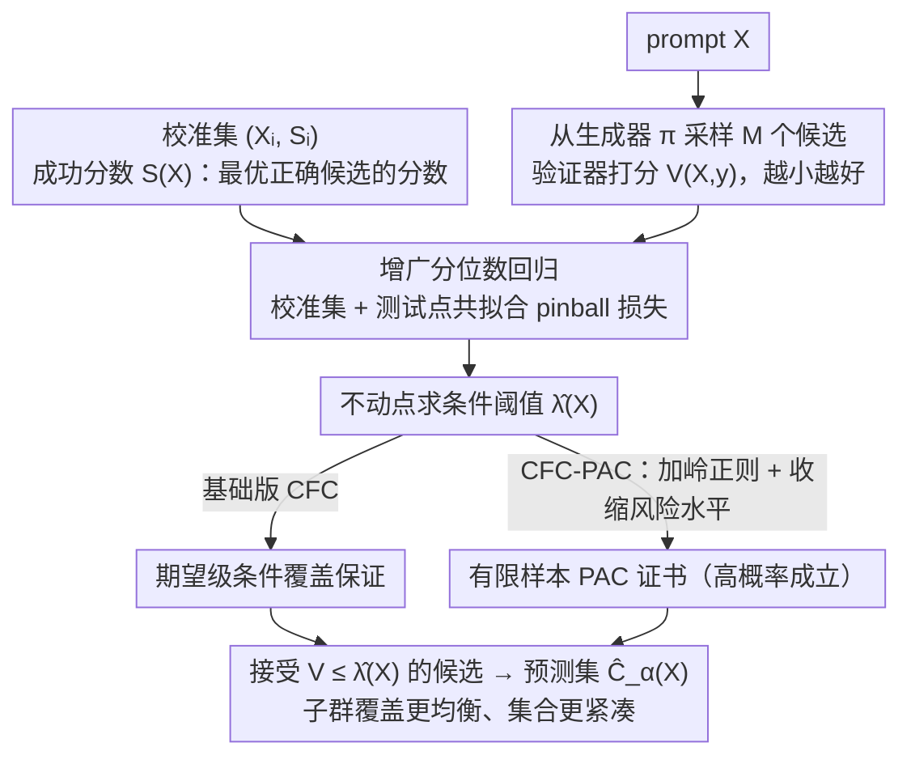

# Conditional Factuality Controlled LLMs with Generalization Certificates via Conformal Sampling

**会议**: CVPR 2026  
**arXiv**: [2603.27403](https://arxiv.org/abs/2603.27403)  
**代码**: [GitHub](https://github.com/) (论文中提及)  
**领域**:优化
**关键词**: 保形预测, 条件覆盖率, LLM幻觉控制, 集值预测, PAC保证

## 一句话总结

提出 CFC（Conditional Factuality Control），一种后验保形框架，通过增广分位数回归学习特征条件化的接受阈值，为LLM/VLM采样输出提供条件覆盖率保证，在保持紧凑预测集的同时显著改善难题子群的可靠性。

## 研究背景与动机

大语言模型（LLM）在推理和生成任务上取得了显著进展，但幻觉问题仍是可靠性的主要障碍。现有的不确定性控制方法面临的核心问题：

1. **保形预测（CP）的边际保证不足**：标准CP使用单一全局阈值，仅提供边际覆盖率保证——在所有prompt上的平均覆盖率达标，但**难题可能系统性欠覆盖，简单题过度覆盖**
2. **异质性被掩盖**：长数学题或罕见实体等难题的覆盖率可能远低于目标，而简单题的覆盖率不必要地高，导致预测集膨胀
3. **条件覆盖率才是真正需要的**：安全关键应用需要保证覆盖率不仅在平均意义上成立，还要在特定特征或子群上成立

CFC的动机是：用一个**特征条件化的阈值**替代全局阈值，使接受标准能自适应prompt难度——难题用更宽松的阈值，简单题用更严格的阈值。

## 方法详解

### 整体框架

CFC是一个纯后验层（post-hoc），不需要微调基础生成模型。工作流程：
1. 给定prompt $X$，从基础生成器采样 $M$ 个候选回答
2. 用验证器对每个候选打分 $V(X, y) \in [0,1]$（越小越好）
3. 定义潜在成功分数 $S(X) = \inf\{V(X,y) : y \in C(X), A(X,y)=1\}$
4. 通过增广分位数回归学习条件化阈值 $\hat{\lambda}_\alpha(X)$
5. 接受所有分数低于阈值的候选：$\hat{C}_\alpha(X) = \{y : V(X,y) \leq \hat{\lambda}_\alpha(X)\}$

### 关键设计

**1. 增广分位数回归：让接受阈值随 prompt 难度自适应**

标准 CP 的病根在于一个全局阈值要同时伺候难题和简单题，结果难题系统性欠覆盖。CFC 的解法是把这个标量阈值换成一条由特征映射 $\Phi(X)$ 决定的函数，沿用 Gibbs et al. 的函数类条件保形框架，用分位数回归把它拟合出来。具体地，对每个待测候选分数 $s \in [0,1]$，先把校准集和该测试点一起喂进一个增广的 pinball 损失里求最优系数：

$$\beta_s = \arg\min_\beta \Big[\tfrac{1}{N+1}\sum_{i=1}^N \rho_{1-\alpha}(S_i - \Phi(X_i)^\top\beta) + \tfrac{1}{N+1}\rho_{1-\alpha}(s - \Phi(X_{N+1})^\top\beta)\Big]$$

其中 $\rho_{1-\alpha}(u) = u(1-\alpha - \mathbb{1}\{u<0\})$ 是 pinball（分位数）损失。把测试点也算进损失项正是「增广」二字的来源——它让阈值的构造和保形预测的可交换性对齐，从而拿到精确的覆盖率保证而非近似。部署时的阈值取最大不动点 $\hat{\lambda}_\alpha(X) = \sup\{s \in [0,1] : s \leq g_X(s)\}$。这样一来，长数学题、罕见实体这类难 prompt 会因为 $\Phi(X)$ 的取值自动拿到更宽松的阈值（接受更多候选、保住覆盖），简单题则收紧阈值（少接受、预测集更小），全局平均覆盖率背后的子群异质性被显式地铺平。

**2. CFC-PAC 变体：把期望级保证升级成高概率保证**

基础版 CFC 给的是期望意义上的覆盖率达标，但安全关键场景往往需要「以高概率成立」的硬承诺。CFC-PAC 在分位数回归里加一项岭正则 $\tfrac{\lambda}{2}\|\beta\|_2^2$ 稳住高方差下的拟合，再主动把名义风险水平收缩一点：用 $\alpha_{eff} = \alpha - \varepsilon_N(\delta)$ 代替 $\alpha$。代价是阈值更保守、预测集略大，换来的是一张有限样本 PAC 证书——以至少 $1-\delta$ 的概率，部署规则的真实覆盖率不低于 $1-\alpha$。这里的松弛量 $\varepsilon_N(\delta) = O(\sqrt{\log(1/\delta)/N})$ 随校准样本量 $N$ 增大而收缩，意味着数据越多、为这份高概率承诺付出的保守度就越小，逼近基础版 CFC 的效率。

**3. 效率分析：条件阈值为什么不仅更可靠、还更省空间**

直觉上「为难题放松阈值」似乎会让预测集整体变大，但论文证明在温和假设下（分数分布的单调性与凹性），条件规则的**预期预测集大小严格小于**边际 CP 规则。关键在于全局阈值是一种「一刀切的折中」：它对简单题给得过松、对难题给得过紧，两头都不划算。条件规则把省下来的额度精确分配——简单 prompt 用更紧的阈值少接受候选，难 prompt 用更松的阈值兜住覆盖，由 Jensen 不等式（利用分数分布的凹性）保证这种再分配后的整体期望集合更小。当分位数回归一致时，CFC 还会渐近继承 oracle 阈值的效率。

### 损失函数 / 训练策略

- 核心优化目标是pinball损失（分位数回归损失），不涉及神经网络训练
- 特征映射 $\Phi(X)$ 的选择：GSM8K使用二次基 $[1, T(X), T(X)^2]$（$T(X)$为平均验证器损失）；TriviaQA使用基于答案分布熵和验证器损失的校准定义特征图
- 纯后验方法，不微调任何模型

## 实验关键数据

### 主实验

**合成数据（$\alpha=0.10$）：**

| 方法 | ECR | APSS↓ | GSC↑ |
|------|-----|-------|------|
| TopK | 90.6 | 16.00 | 58.2 |
| ICP | 90.2 | 16.71 | 57.4 |
| Learnt CP | 90.2 | 15.72 | 84.3 |
| **CFC** | **90.3** | **15.53** | **88.7** |
| **CFC-PAC** | **90.8** | **15.87** | **89.1** |

**GSM8K（$\alpha=0.05$）：**

| 方法 | ECR | APSS↓ | GSC↑ |
|------|-----|-------|------|
| ICP | 95.09 | 4.73 | 79.85 |
| CFC | 94.82 | **2.35** | **88.48** |
| CFC-PAC | 95.24 | 4.59 | **88.79** |

**Flickr8k VLM（$\alpha=0.03$）：**

| 方法 | ECR | APSS↓ | GSC↑ |
|------|-----|-------|------|
| ICP | 95.58 | 1.84 | 85.21 |
| **CFC-PAC** | **97.27** | 1.42 | **95.21** |

### 消融实验

| 配置 | 关键指标 | 说明 |
|------|---------|------|
| 仅Learnt CP（无保形修正）| GSC 84.3 | 学习好的阈值有帮助但不够 |
| CFC + 保形修正 | GSC 88.7 | 精确保形修正额外提升子群可靠性 |
| Entropy-linear Φ | GSC 45.1 (CFC) | 特征映射选择影响显著 |
| Chosen Φ | GSC 62.8 (CFC) | 合理特征映射是关键 |
| N=5 vs N=20采样 | APSS 2.35 vs 7.97 | 大采样预算膨胀预测集但GSC提升有限 |

### 关键发现

1. **条件阈值有效平坦化子群覆盖率**：在所有数据集上，CFC将最难子群的欠覆盖率问题显著缓解
2. **效率优势**：CFC在保持覆盖率的同时产生更小的预测集（GSM8K上APSS从4.73降至2.35）
3. **迁移到VLM**：同一后验层直接应用于Qwen2-VL-7B-Instruct，无需修改
4. **特征映射设计重要**：合理的难度代理（如验证器损失均值）对性能影响大
5. **PAC变体更保守但更可靠**：CFC-PAC更接近目标覆盖率，代价是略大的预测集

## 亮点与洞察

- **理论-实践统一**：条件覆盖率保证、PAC证书、效率分析三者一体，理论严谨且实验验证充分
- **极简设计**：纯后验、无训练、模型无关——可直接应用于任何LLM/VLM采样管线
- **效率分析的优雅**：通过Jensen不等式的凸性论证证明条件规则比边际规则更高效
- **实用性强**：5个候选+简单二次特征映射就能获得显著改善
- **CFC vs CFC-PAC的分工**：CFC最省空间、CFC-PAC最接近目标覆盖率，用户可按需选择

## 局限与展望

1. **特征映射需要手工设计**：$\Phi(X)$ 的选择依赖领域知识（如使用验证器损失作为难度代理），自动化特征选择值得探索
2. **假设可交换性**：校准集和测试集需满足可交换性假设，covariate shift场景下可能失效
3. **依赖外部验证器**：验证器质量直接影响CFC性能，但论文未讨论验证器本身的不确定性
4. **分位数回归在高维特征下的收敛速度**：论文使用低维特征（1-3维），高维特征映射的样本复杂度待分析
5. **仅在中小规模LLM上验证**：Llama-3-8B、Qwen2-VL-7B，更大模型上的表现未知

## 相关工作与启发

- 构建在 Gibbs et al. (2023) 的函数类条件保形框架上，核心贡献是将其适配到LLM采样场景
- 与 Best-of-N 解码和 pass@N 评估范式兼容，CFC可看作对这些策略的可靠性增强
- 条件覆盖率 vs 边际覆盖率的讨论对所有需要不确定性量化的AI系统都有参考价值
- PAC-Bayes风格的有限样本保证为部署阶段的合规性审计提供了工具

## 评分

- 新颖性: ⭐⭐⭐⭐ — 将条件保形预测适配到LLM场景有创新但非全新范式
- 实验充分度: ⭐⭐⭐⭐ — 合成+真实+VLM三层验证，含充分消融
- 写作质量: ⭐⭐⭐⭐⭐ — 数学推导清晰，图示直观，动机到方法到实验逻辑顺畅
- 价值: ⭐⭐⭐⭐ — 为LLM可靠性部署提供了实用且有理论保障的工具

<!-- RELATED:START -->

## 相关论文

- [\[ICML 2026\] Colorful Pinball: Density-Weighted Quantile Regression for Conditional Guarantee of Conformal Prediction](../../ICML2026/optimization/colorful_pinball_density-weighted_quantile_regression_for_conditional_guarantee_.md)
- [\[CVPR 2026\] Semi-Supervised Conformal Prediction With Unlabeled Nonconformity Score](semi-supervised_conformal_prediction_with_unlabeled_nonconformity_score.md)
- [\[CVPR 2026\] FedAdamom: Adaptive Momentum for Improved Generalization in Federated Optimization](fedadamom_adaptive_momentum_for_improved_generalization_in_federated_optimizatio.md)
- [\[ICML 2025\] FedSWA: Improving Generalization in Federated Learning with Highly Heterogeneous Data via Momentum-Based Stochastic Controlled Weight Averaging](../../ICML2025/optimization/fedswa_improving_generalization_in_federated_learning_with_highly_heterogeneous_.md)
- [\[CVPR 2026\] HFedATM: Hierarchical Federated Domain Generalization via Optimal Transport and Regularized Mean Aggregation](hfedatm_hierarchical_federated_domain_generalization_via_optimal_transport_and_r.md)

<!-- RELATED:END -->
