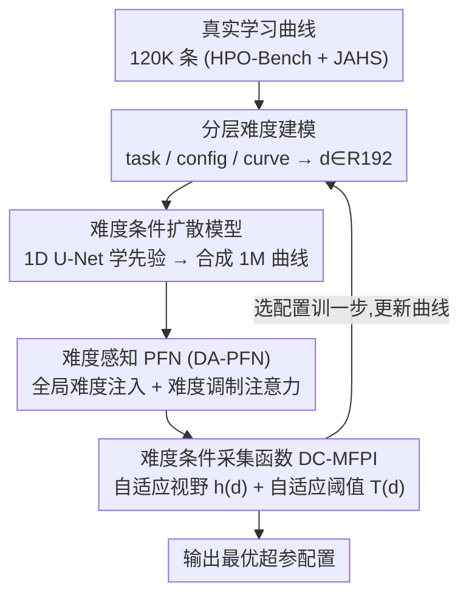

# DABO: Difficulty-Aware Bayesian Optimization with Diffusion-Learned Priors

**会议**: CVPR 2026  
**论文**: [CVF Open Access](https://openaccess.thecvf.com/content/CVPR2026/html/Li_DABO_Difficulty-Aware_Bayesian_Optimization_with_Diffusion-Learned_Priors_CVPR_2026_paper.html)  
**代码**: 未公开  
**领域**: 贝叶斯优化 / 超参数优化  
**关键词**: 超参数优化, Freeze-Thaw 贝叶斯优化, 难度感知, 条件扩散模型, PFN 代理模型  

## 一句话总结
DABO 把"优化难度"作为一等条件变量贯穿整条 freeze-thaw 超参数优化流水线——用三层难度刻画 + 条件扩散模型生成 100 万条带难度标注的合成学习曲线，训出难度感知的 PFN 代理与自适应采集函数，在 75 个任务上比当前 SOTA（ifBO）平均降低 11–18% 的 regret，且越难的任务收益越大。

## 研究背景与动机
**领域现状**：深度学习的超参数优化（HPO）代价高昂，因为每个配置都要真训练。多保真度方法（Hyperband、ASHA、BOHB）用低保真度近似来省钱，但粗粒度的晋升时间表常常过早砍掉有潜力的配置。Freeze-Thaw 贝叶斯优化更灵活，允许"冻结/解冻"配置、按细粒度一步步分配预算。当前最强的 ifBO 用 Prior-data Fitted Network（PFN）做单次前向的贝叶斯推断，比在线训练代理快 10–100 倍，是公认 SOTA。

**现有痛点**：包括 ifBO 在内的所有方法都是 **difficulty-agnostic（难度盲）**——对所有任务和配置一视同仁，忽略了不同超参数 landscape 之间巨大的难度差异。结果是在简单平滑区域浪费预算、在复杂崎岖区域探索不足。论文 Figure 1 给的对比很直观：同样是难度盲的 ifBO，在平滑任务上还行，但在崎岖高难度任务上几乎崩盘，而难度感知方法在那里能拿到 43% 更低的 regret。

**核心矛盾**：难度盲在三个层面同时发作——代理模型用统一架构、不管 landscape 复杂度；采集函数对易/难配置用同一套探索视野和阈值；数据生成依赖手工设计的参数化先验（power law、指数等 4 个基函数），根本表达不了多阶段收敛、配置敏感的停滞这类难度相关的曲线动态。

**本文目标**：把难度这件事系统性地注入 HPO 的全链路——数据生成、代理建模、决策三个环节都要"知道"当前难度。

**切入角度**：作者借鉴适应度 landscape 分析（ruggedness、modality）和元学习理论，提出难度可以被**显式分层度量**且不需要学习编码器；同时用学到的、数据驱动的先验替换手工参数先验。

**核心 idea**：把"优化难度"做成贯穿全流程的一等条件变量——分层量化难度 → 用条件扩散模型从真实曲线学难度感知的先验 → 难度感知代理 + 难度自适应采集函数，把资源从"以配置为中心"转向"以难度为中心"分配。

## 方法详解

### 整体框架
DABO 解决的是 freeze-thaw HPO 的"难度盲"问题，整体分**离线 + 在线**两相。离线相：先从真实学习曲线算出分层难度描述子，训一个以难度为条件的扩散模型，再用它批量合成 100 万条带难度标注的曲线，拿这些合成数据训练难度感知代理 DA-PFN；在线相：部署 DA-PFN 配合难度自适应采集函数 DC-MFPI，每一步算当前难度、预测自适应视野处的性能、选最优配置继续训练，循环到预算耗尽。

四个核心组件按"难度怎么算 → 怎么把难度灌进数据 → 怎么把难度灌进代理 → 怎么把难度灌进决策"串成一条链：

> 框架↔关键设计一致：上图四个贡献节点（分层难度建模、难度条件扩散、DA-PFN、DC-MFPI）正是下面四个关键设计，顺序一致；首尾的"真实曲线/输出配置"是脚手架不单列。

### 关键设计

**1. 分层难度建模：把"有多难"拆成全局/局部/曲线三个可解释的层次**

难度盲的根因之一是没有一个统一的量去描述"这个 landscape 有多崎岖"。DABO 用**显式特征提取、不学编码器**的方式分三层量化。最高层 **task complexity（任务复杂度）** 刻画全局搜索空间：给定多条配置曲线 $D=\{(\lambda_i,C_i)\}$，算可达性能跨度 $\phi_1=\max_i C_i[b_i]-\min_i C_i[b_i]$、轨迹多样性 $\phi_2=\frac{1}{N(N-1)}\sum_{i\neq j}\mathrm{DTW}(C_i,C_j)$（用动态时间规整衡量曲线形态差异）、收敛异质性 $\phi_3=\mathrm{Std}_i\big((C_i[b_i]-C_i[1])/b_i\big)$。中间层 **configuration sensitivity（配置敏感度）** 量化局部崎岖度，对每个配置看它 $k$ 近邻（$k=10$）的最终性能方差 $\psi_1$ 和归一化的性能梯度 $\psi_2(\lambda)=\frac{1}{k}\sum_{j\in N_k(\lambda)}\frac{|C_j[b_{max}]-\bar C[b_{max}]|}{\|\lambda_j-\lambda\|_2+\epsilon}$——梯度大说明这里是陡峭的"性能悬崖"。最细层 **curve characteristics（曲线特征）** 从单条部分曲线读优化信号：平均改善率 $\omega_1$、相对波动率 $\omega_2$、饱和度 $\omega_3$。三组特征各过一个 128 隐层的 MLP 投到 64 维，拼成完整难度描述子：

$$d(\lambda,t)=[d_{task};\,d_{cfg}(\lambda);\,d_{crv}(t)]\in\mathbb{R}^{192}$$

这个 $d$ 是后面所有组件的条件输入，三层各管全局、局部、即时三个视角，互补且可解释。

**2. 难度条件扩散：用学到的曲线分布替换 ifBO 的 4 个手工基函数**

ifBO 性能的天花板就卡在它的合成训练数据——只有 power law、指数等少数参数形式，表达力差。DABO 直接从约 12 万条真实曲线（HPO-Bench 约 8 万 + JAHS-Bench-201 约 4 万，与测试集严格不重叠）学一个**以超参 $\lambda$ 和难度 $d$ 为条件的扩散模型**。前向过程对干净曲线 $C_0\in\mathbb{R}^{b_{max}}$（$b_{max}=50$）加 $T=1000$ 步高斯噪声，$q(C_t|C_0)=\mathcal{N}(C_t;\sqrt{\bar\alpha_t}C_0,(1-\bar\alpha_t)I)$（cosine 噪声表）；反向过程用 **1D U-Net** 学条件分布 $p(C|\lambda,d)$，编码器四级下采样通道 $[64,128,256,512]$，并在每个分辨率用 **cross-attention 注入条件**，其 key/value 来自拼接向量 $c=\mathrm{Concat}[\mathrm{Embed}(\lambda),d(\lambda,b_{max}),\mathrm{PosEnc}(t)]$。训练就是标准去噪 score matching：

$$L_{diff}=\big\|\epsilon-\epsilon_\theta(\sqrt{\bar\alpha_t}C_0+\sqrt{1-\bar\alpha_t}\epsilon,\,t,\,\lambda,\,d)\big\|^2$$

训完后用 DDIM 50 步采样：先采任务级难度 $d_{task}\sim\mathcal{N}(0,I_{64})$ 定全局复杂度，每任务采 500 个配置（用 GP 建模邻居最终性能来算配置级难度），合成 **2000 个任务、共 100 万条带难度标注的曲线**。相比参数化先验，扩散先验更有表达力（能逼近任意分布而非 4 种形式）、数据驱动（从真实曲线学）、且难度可控（显式 $d$ 条件保证合成语料覆盖各难度等级）——后面用 FCD/MMD 验证它比 ifBO 的合成曲线离真实数据近 2.3 倍。

**3. 难度感知 PFN（DA-PFN）：让代理在 in-context 推断里"按难度分层"看上下文**

代理的任务是单次前向就对学习曲线做贝叶斯推断（PFN 范式），省掉 GP 每轮重训的开销。输入是观测点上下文 $H=\{(\lambda_i,t_i,f_i)\}$ 和查询 $(\lambda_q,t_q)$，每个 token 把超参、时间步、性能、难度描述子拼起来：$z_i=[\mathrm{Embed}(\lambda_i);\mathrm{PosEnc}(t_i);\mathrm{Embed}(f_i);d(\lambda_i,t_i)]$（查询点的性能位 mask 成 0）。DABO 的关键改造是把难度灌进 Transformer 计算的两处：**全局难度注入**——第一层前给所有 token 加一个偏置 $z_i^{(0)}\leftarrow z_i+\mathrm{MLP}_{global}(d_{task})$，让模型一上来就知道整体任务有多复杂；**难度调制注意力**——在每个自注意力层里按难度相似度给注意力加乘子：

$$\mathrm{Attn}(Q,K,V,D)=\mathrm{softmax}\!\Big(\frac{QK^\top}{\sqrt{d_k}}\odot S\Big)V,\quad S_{ij}=1+\gamma\cdot\exp(-\|D_i-D_j\|^2)$$

其中 $\gamma=0.5$。这相当于让模型更关注"难度特征相近"的上下文点，实现难度分层的 in-context 学习。网络 6 层 Transformer、维度 512、8 头，约 17.2M 参数，输出头投到 $[0,1]$ 上 1000 个 bin 的离散分布，按交叉熵 $L_{\text{DA-PFN}}=-\log p_\theta(f_q|H,\lambda_q,t_q,d_q)$ 训练。效果上它对难配置会自动放宽不确定性，避免像 FT-PFN 那样过度自信。

**4. 难度条件采集函数 DC-MFPI：按局部难度动态调探索视野和改进阈值**

代理预测好了，还要决定"下一步训哪个配置"。直觉是：在崎岖高难区要谨慎——用短的前瞻视野频繁复审、别把预算押死在烂局部最优；在平滑低难区可以激进——用长视野摊薄预测开销、用紧的改进阈值聚焦明显有戏的候选。DABO 用两个难度条件超参实现。**自适应视野** 随配置级难度指数衰减：$h(d)=\max\big(1,\lfloor b_{max}\cdot\exp(-\alpha\|d_{cfg}\|_2)\rfloor\big)$，$\alpha=1/32$；难配置（$\|d_{cfg}\|\approx8$）拿约 39 步短视野，易配置（$\approx1$）拿约 48 步长视野。**自适应阈值** 随任务级难度放松：$T(d)=f_{best}+\tau(\|d_{task}\|)\cdot(1-f_{best})$，其中 $\tau(x)=10^{-1-\beta x}$，$\beta=1/4$；复杂任务阈值很松（$\tau\approx10^{-3}$）鼓励多探索，简单任务阈值紧（$\tau\approx10^{-1}$）只保留显著超过当前最优的候选。两者组合成 **DC-MFPI（难度条件多保真改进概率）**：

$$\mathrm{DC\text{-}MFPI}(\lambda)=\frac{1}{K}\sum_{k=1}^{K}\mathbb{I}[f_k>T(d)],\quad f_k\sim p_\theta(\cdot\mid H,\lambda,b_\lambda+h(d),d)$$

$K=50$ 个样本从 DA-PFN 在自适应视野处的预测分布采出，选 $\lambda^+=\arg\max_\lambda \mathrm{DC\text{-}MFPI}(\lambda)$ 进入下一轮 freeze-thaw 训练。

### 损失函数 / 训练策略
两段离线训练：扩散模型用 AdamW（lr $2\times10^{-4}$、batch 128）在 4×A40 上训 500 epoch ≈72 小时；DA-PFN 用 episodic 采样（每次从合成数据采一个任务、上下文规模 $M\sim\mathrm{Uniform}(10,300)$），AdamW（lr $10^{-4}$、weight decay $10^{-5}$、batch 64）在 8×A40 上训 300 epoch ≈96 小时。两段合计 1056 GPU-小时，但这是一次性、可摊销到所有未来 HPO 任务的开销。

## 实验关键数据

### 主实验
75 个任务（LCBench 35 个表格分类 + PD1 16 个视觉/NLP + Taskset 24 个 NLP），预算 $B=1000$ 步，10 个随机种子，指标为归一化 regret。扩散模型只在 HPO-Bench / JAHS-Bench-201 上训，与测试集零重叠。

**代理质量**（held-out 曲线，越高的 Log-Lik、越低的 MSE 越好）：

| 方法 | LCBench Log-Lik↑ | LCBench MSE↓ | PD1 Log-Lik↑ | Taskset Log-Lik↑ | 推理(秒) |
|------|------|------|------|------|------|
| DPL | −11.98 | 0.007 | −11.02 | −20.35 | 41.96 |
| DyHPO | −0.37 | 0.012 | −0.46 | −0.38 | 59.95 |
| FT-PFN (ifBO) | 2.12 | 0.004 | 1.13 | 3.02 | 0.72 |
| **DA-PFN (本文)** | **2.84** | **0.0034** | **2.50** | **3.31** | 2.05 |

DA-PFN 的 log-likelihood 全面领先，比 ifBO 的 FT-PFN 提升 10–30%，PD1 上尤其明显（2.50 vs 1.13），说明扩散数据捕获了更丰富的曲线分布、不确定性校准更好。推理 2.05 秒虽比 FT-PFN 的 0.72 秒慢（多在 k-NN 算难度），但仍比在线训练方法快 20–30 倍。

**端到端 HPO regret**（$B=1000$ 最终归一化 regret，越低越好）：

| 方法 | LCBench | PD1 | Taskset |
|------|------|------|------|
| Random Search | 0.082 | 0.124 | 0.156 |
| ASHA | 0.034 | 0.065 | 0.081 |
| DyHPO | 0.021 | 0.039 | 0.052 |
| ifBO (前 SOTA) | 0.016 | 0.034 | 0.044 |
| **DABO (本文)** | **0.014** | **0.028** | **0.039** |

相对 ifBO 分别降低 **12.5% / 17.6% / 11.4%**，PD1 和 Taskset 上 Wilcoxon 检验显著（$p<0.05$）。anytime 性能也更强：PD1 上达到 ifBO 最终 regret 的 90% 只用约少 15% 预算（$t=720$ vs $850$）。

### 消融实验
LCBench 上拆三个组件：Diff（扩散数据生成）、DA（DA-PFN 难度条件）、Acq（难度自适应采集）。

| 配置 | Regret↓ | 相对 ifBO 提升 | 说明 |
|------|------|------|------|
| ifBO（基线） | 0.016 | — | 难度盲 SOTA |
| 仅 Diff | 0.0152 | 5% | 学到的先验 > 基函数 |
| 仅 DA | 0.0148 | 7.5% | 难度感知表示贡献最大 |
| 仅 Acq | 0.0154 | 3.75% | 分配策略收益最小 |
| Diff + DA | 0.0142 | 11.25% | 协同超过单项之和 |
| **Full (Diff+DA+Acq)** | **0.0140** | **12.5%** | 完整模型 |

### 关键发现
- **难度条件（DA）是单项贡献最大的组件**（7.5%），扩散数据生成（5%）次之、自适应采集（3.75%）最小；Diff+DA 组合有明显协同效应（11.25%）——说明给模型喂真实曲线模式 + 让它感知难度是互补的。
- **难度越高、收益越大**：每任务 regret 改善与任务难度 $\|d_{task}\|$ 正相关（Pearson $r=0.804$，$p<0.001$），75 个任务里 12 个提升超 20%，集中在 PD1 的 ImageNet-ResNet、Taskset 的 8 超参 transformer 这类复杂任务；简单平滑任务上 DABO 和 ifBO 表现接近——验证了"难度感知在最需要的地方最有用"。
- **数据保真度**：扩散合成曲线用 FCD（1.24 vs 2.83）和 MMD（0.018 vs 0.042）衡量，比 ifBO 参数化先验离真实数据近约 2.3 倍。
- **在线开销可忽略**：DA-PFN 每轮比 FT-PFN 多约 130ms（主要是难度计算），1000 步全程多约 2 分钟，相对被优化的模型训练（数小时到数天）微不足道。

## 亮点与洞察
- **把"难度"提升为一等条件变量、贯穿数据→代理→决策三环**：很多工作只在单点（如采集函数）做自适应，DABO 用同一个分层难度描述子 $d$ 统一条件化所有下游组件，是这套方法连贯好用的根本——这个"统一条件变量贯穿 pipeline"的范式可迁移到其他需要难度/不确定性自适应的迭代优化任务（如 NAS、AutoML 调度）。
- **用条件扩散学曲线先验替换手工基函数**：PFN 的质量本质受限于合成训练数据的真实度，DABO 第一个把条件扩散用到学习曲线合成上，直接把"先验表达力"这个瓶颈打开——这个思路对任何"靠合成数据 meta-train 的 in-context 模型"都有借鉴价值。
- **难度调制注意力 $S_{ij}=1+\gamma\exp(-\|D_i-D_j\|^2)$ 很轻量**：只在标准注意力上乘一个基于难度相似度的乘子，就实现了难度分层的 in-context 学习，几乎不加参数，是个可复用的小 trick。
- **难度感知带来"按需校准的不确定性"**：DA-PFN 对难配置自动放宽后验、对易配置收紧，避免了 DPL 那种低 MSE 但 log-likelihood 灾难性差（−20.35）的过度自信——提醒做代理模型时校准比点估计误差更重要。

## 局限与展望
- **离线训练成本高**：1056 GPU-小时的一次性投入，虽可摊销但对资源有限者门槛不低；扩散 + DA-PFN 两段训练都依赖 A40 级算力。
- **在线难度计算有开销**：每轮多约 130ms 主要来自配置敏感度的 k-NN 搜索，作者也承认可用近似最近邻加速，但目前未做。
- **泛化边界存疑** ⚠️：扩散先验从 HPO-Bench/JAHS 学，虽与测试集不重叠，但都属"已知 benchmark 家族"；面对全新架构族/搜索空间的真实分布外曲线能否同样有效，论文未充分验证。
- **部分组件超参靠手调**：$\gamma=0.5$、$\alpha=1/32$、$\beta=1/4$ 等控制难度调制强度/视野衰减/阈值松弛的系数都是固定值，缺敏感性分析（论文称放在补充材料），实际换 benchmark 是否要重调不清楚。
- **改进方向**：把难度自适应采集（贡献最小的 3.75%）做得更强，或让难度描述子端到端可学（现在是手工特征），可能进一步释放收益。

## 相关工作与启发
- **vs ifBO（FT-PFN）**：ifBO 是难度盲的前 SOTA，用 4 个手工基函数合成 PFN 训练数据、对所有配置一视同仁；DABO 沿用 freeze-thaw + PFN 框架，但把数据先验换成条件扩散、给代理加难度条件、给采集函数加难度自适应——本质是"难度盲 → 难度感知"的范式升级，难任务上优势尤其大。
- **vs LC-PFN**：LC-PFN 最早为"单曲线外推/早停"引入了难度概念，是本文最直接的前身；DABO 把难度从单曲线层面扩展到 task/config/curve 三层、并贯穿整个 HPO 决策流程。
- **vs Fitness Landscape Analysis / 元学习难度建模**：传统 FLA 用 ruggedness、modality 等静态特征刻画搜索空间、多用于算法选择，元学习理论把难度连到 few-shot 可学性；DABO 借了它们的"难度可量化"思想，但把这些特征做成统一难度 embedding 去条件化生成模型和代理，是把分析工具变成优化驱动力。
- **vs 扩散生成先验工作**：以往 PFN/表格数据工作用简单手工生成过程做先验，DABO 用 score-based 条件扩散学数据驱动先验，是首个把条件扩散用于超参学习曲线合成的工作。

## 评分
- 新颖性: ⭐⭐⭐⭐⭐ 首次把"难度"做成贯穿数据/代理/决策全链路的一等条件变量，并首个用条件扩散合成学习曲线先验
- 实验充分度: ⭐⭐⭐⭐ 75 任务 3 benchmark、代理质量+端到端+消融+难度相关性齐全，但部分敏感性分析放在补充材料未展开
- 写作质量: ⭐⭐⭐⭐⭐ 难度盲的问题陈述清晰，公式与机制讲得到位，图表支撑充分
- 价值: ⭐⭐⭐⭐ 对崎岖高难 HPO 任务有实打实收益且 anytime 性能更好，但离线训练成本和代码未公开会影响落地

<!-- RELATED:START -->

## 相关论文

- [\[ICML 2026\] Cost-Aware Stopping for Bayesian Optimization](../../ICML2026/optimization/cost-aware_stopping_for_bayesian_optimization.md)
- [\[CVPR 2026\] Learning to Learn Weight Generation via Local Consistency Diffusion](learning_to_learn_weight_generation_via_local_consistency_diffusion.md)
- [\[ICLR 2026\] Celo2: Towards Learned Optimization Free Lunch](../../ICLR2026/optimization/celo2_towards_learned_optimization_free_lunch.md)
- [\[ICML 2026\] Multi-Objective Bayesian Optimization via Adaptive ε-Constraints Decomposition](../../ICML2026/optimization/multi-objective_bayesian_optimization_via_adaptive_varepsilon-constraints_decomp.md)
- [\[CVPR 2026\] BD-Merging: Bias-Aware Dynamic Model Merging with Evidence-Guided Contrastive Learning](bd-merging_bias-aware_dynamic_model_merging_with_evidence-guided_contrastive_lea.md)

<!-- RELATED:END -->
