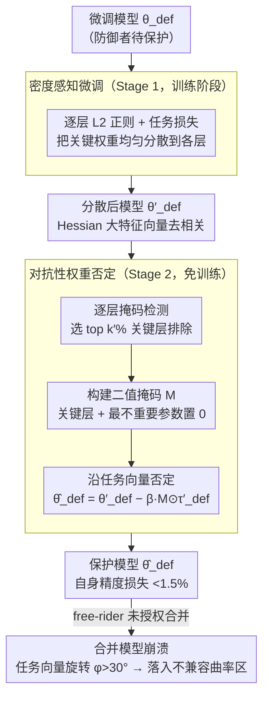

# Defending Unauthorized Model Merging via Dual-Stage Weight Protection

**会议**: CVPR 2026  
**arXiv**: [2511.11851](https://arxiv.org/abs/2511.11851)  
**代码**: 无（暂未开源）  
**领域**:优化
**关键词**: 模型合并防御, 知识产权保护, 权重保护, 对抗性扰动, 模型安全

## 一句话总结
提出 MergeGuard，一种主动式双阶段权重保护框架：Stage 1通过L2正则化分散任务关键权重，Stage 2注入结构化扰动破坏合并兼容性，在保持保护模型<1.5%性能损失的同时使合并模型精度下降高达90%。

## 研究背景与动机
**领域现状**：预训练-微调范式成为现代AI基石，Hugging Face/GitHub等开放仓库托管数以千计的公开模型。模型合并（Model Merging）技术（WA、TA、TIES、AdaMerging等）可通过参数级组合直接构建多任务模型，无需额外训练。

**现有痛点**：Free-rider可下载特定许可下的微调模型并合并创建新的多能力模型用于再分发或商业用途——参数混合本身就隐藏了各权重来源，使得知识产权侵犯难以追踪和问责。

**核心矛盾**：防御者只能修改自己模型的参数，无法预知攻击者的模型、合并策略或目标任务，防御高度不确定；同时需在保持原始任务精度与抑制合并模型效能之间取得平衡。

**本文目标** 设计一种主动防御机制，使得任意后续模型合并都会导致功能退化，同时保持原模型的任务性能。

**切入角度**：观察到现代模型合并方法（TIES、AdaMerging）依赖稀疏化分散任务参数来减少干扰——MergeGuard反向利用这一点，先分散再扰动，使合并时产生破坏性干涉。

**核心 idea**：通过密度感知微调分散权重+对抗性权重否定注入扰动，双阶段重塑参数几何使合并模型处于不兼容曲率区域。

## 方法详解

### 整体框架

MergeGuard 是一种主动防御：防御者只能改自己模型的参数，目标是让任何后续未授权的模型合并都失效，同时保住自己模型的任务精度。它对防御者模型 $\theta_{def}$ 分两阶段处理：Stage 1（密度感知微调 Density-Aware Finetuning，训练阶段）用 L2 正则把任务关键权重均匀分散开，Stage 2（对抗性权重否定 Adversarial Weight Negation，免训练阶段）沿任务向量方向选择性注入扰动，两步把参数几何重塑到一个让合并模型落入「不兼容曲率区域」的状态——曲率不兼容的理论分析进一步说明为什么这点小旋转就足以让任何合并崩溃。

### 关键设计

**1. 密度感知微调（Stage 1）：反向利用合并方法的稀疏化假设**

现代合并方法（TIES、AdaMerging）靠稀疏化分散任务参数来减少干扰，MergeGuard 反过来用这点：在标准交叉熵上加逐层 L2 正则

$$L_{Total} = L_{CE} + \alpha \sum_{\ell=1}^{L} \|\theta^{(\ell)}\|_2^2$$

（视觉任务为分类损失 + L2，LLM 为下一 token 预测损失 + L2）。L2 逐层独立应用，平滑大权值、把重要信息均匀摊到各层。权重越分散，后续合并时越容易被放大/稀释/干扰，从源头让合并不稳定。

**2. 对抗性权重否定（Stage 2）：免训练地旋转任务向量方向**

只分散还不够，还要主动破坏合并兼容性，且不能再训练。Stage 2 三步走：先做逐层掩码检测，遮蔽每层后测精度下降，选出 top $k'\%$ 关键层排除；再构建二值掩码 $M$，把关键层和最不重要的 $(1-k)(1-k')\%$ 参数置 0、其余置 1；最后沿任务向量方向偏移 $\hat{\theta}_{def} = \theta'_{def} - \beta \cdot M \odot \tau'_{def}$，其中 $\tau'_{def} = \theta'_{def} - \theta_{pre}$ 是防御者的任务向量（LLM 中排除 embed_tokens、norm、lm_head 以防坍塌）。这样只在被选中的参数上旋转方向，对自身精度影响小、却显著破坏合并。

**3. 曲率不兼容的理论分析：为什么小旋转就够**

合并干扰增量近似为

$$\Delta \mathcal{L}_{merge} \approx \lambda_1 \lambda_2 \|\tau'_{def}\| \|\tau_{fr}\| (1 - \cos\phi)$$

即使任务向量旋转角 $\phi > 30°$ 就足以把合并模型推出共享 basin、产生破坏性干涉。Stage 1 让 Hessian 大特征值对应的特征向量去相关，Stage 2 进一步旋转任务向量方向，两者叠加正好把 $\phi$ 撑大到失效区。

### 损失函数 / 训练策略

所有实验固定 $k'=10$, $k=0.1$, $\alpha=0.01$, $\beta=1$，无需任务特定调参。

## 实验关键数据

### 主实验：ViT-L-14 图像分类——保护前后精度与合并后精度

| 数据集 | 微调模型 $\theta_{def}$ | 保护模型 $\hat{\theta}_{def}$ | 合并精度(TA) $\theta_{merge}$ | 合并精度(TA) $\hat{\theta}_{merge}$ |
|--------|----------------------|---------------------------|----------------------------|---------------------------------|
| RESISC45 | 97.37 | 97.25 | 86.6 | **56.50** |
| EuroSAT | 99.81 | 95.46 | 94.1 | **54.94** |
| GTSRB | 99.24 | 98.25 | 86.7 | **12.91** |
| MNIST | 99.69 | 99.27 | 98.9 | **11.35** |
| DTD | 84.15 | 82.16 | 65.6 | **46.65** |

保护模型自身精度损失<4.4%，但合并后精度暴跌（GTSRB: 86.7→12.9, MNIST: 98.9→11.4）。

### 与基线对比（TA合并方法下的平均精度下降）

| 方法 | 保护模型平均精度 | 合并后平均精度下降 |
|------|----------------|-------------------|
| PaRaMS（唯一基线）| ~与原模型相当 | **30.76** |
| **MergeGuard (Ours)** | ~与原模型相当(<1.5%损失) | **52.11** |

MergeGuard的平均精度下降比PaRaMS多 **21.35个百分点**。

### 关键发现
- 在LLM上效果更显著：Gemma2在GSM8K上从69.6%降至1.52%，HumanEval从64.02%降至21.34%
- 对所有主流合并方法（WA/TA/TIES/ADA）均有效——ADA最难防御但仍造成显著下降
- 两种自适应攻击均无法破解：(i) 减去保护参数的缩放副本；(ii) 估计扰动向量后正交投影——均失败因任务信息已分散且扰动不可观测
- 固定超参数即可跨任务/架构工作，无需任务特定调参

## 亮点与洞察
- **防御思路精巧**：反向利用合并方法依赖的稀疏化假设——先"反稀疏化"分散权重，再注入方向对抗
- **理论支撑充分**：曲率不兼容的分析提供了清晰的直觉（任务子空间旋转+basin分离）
- **实用性强**：Stage 2完全免训练，超参数固定，对ViT/Llama2/Gemma2/Mistral等多种架构普适
- **首篇系统性防御**：PaRaMS之外唯一的主动防御工作，且效果大幅超越

## 局限与展望
- 仅针对全参数微调，不适用于PEFT方法（LoRA、浅层调优）——因PEFT不暴露完整任务向量
- L2正则化可能影响模型在复杂任务上的表达能力（EuroSAT精度下降4.4%）
- 防御假设攻击者使用参数级合并——若攻击者改用知识蒸馏则防御失效（论文承认但认为蒸馏成本高）
- Stage 2的层重要性排序基于全局掩码精度下降，更细粒度的重要性度量可能更优

## 相关工作与启发
- **模型合并方法**：WA→TA→TIES→AdaMerging→DARE，不断改进合并质量，但也增加了IP风险
- **PaRaMS**：唯一前作，通过参数重排列+随机多头缩放保持功能等价但破坏合并——MergeGuard效果更强
- **模型水印/指纹**：被动检测方法，与MergeGuard的主动防御互补
- 启发：防御与攻击之间的"军备竞赛"——未来攻击者可能设计能应对分散权重的合并策略

## 评分 ⭐
- 新颖性: ⭐⭐⭐⭐ — 双阶段"分散+旋转"的防御思路新颖，理论分析清晰
- 实验充分度: ⭐⭐⭐⭐⭐ — 覆盖视觉/语言多架构、多合并方法、自适应攻击、SD图像生成
- 写作质量: ⭐⭐⭐⭐ — 攻防场景建模清晰，理论推导严谨
- 价值: ⭐⭐⭐⭐ — 对模型IP保护有重要实践意义，填补了主动防御的空白

<!-- RELATED:START -->

## 相关论文

- [\[CVPR 2026\] Model Merging in the Essential Subspace](model_merging_in_the_essential_subspace.md)
- [\[CVPR 2026\] ACE-Merging: Data-Free Model Merging with Adaptive Covariance Estimation](ace-merging_data-free_model_merging_with_adaptive_covariance_estimation.md)
- [\[CVPR 2026\] BD-Merging: Bias-Aware Dynamic Model Merging with Evidence-Guided Contrastive Learning](bd-merging_bias-aware_dynamic_model_merging_with_evidence-guided_contrastive_lea.md)
- [\[CVPR 2026\] DC-Merge: Improving Model Merging with Directional Consistency](dc-merge_improving_model_merging_with_directional_consistency.md)
- [\[NeurIPS 2025\] Train with Perturbation, Infer after Merging: A Two-Stage Framework for Continual Learning](../../NeurIPS2025/optimization/train_with_perturbation_infer_after_merging_a_two-stage_framework_for_continual_.md)

<!-- RELATED:END -->
