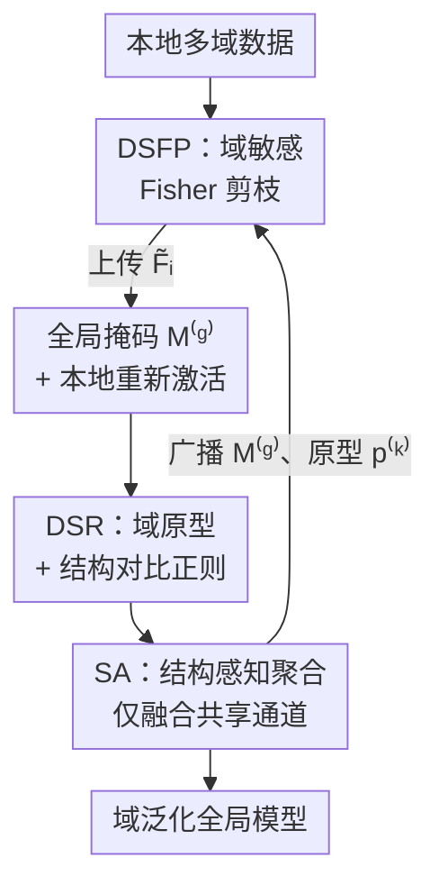

# Domain Sensitive Federated Learning with Fisher-Informed Pruning

**会议**: CVPR 2026  
**论文**: [CVF Open Access](https://openaccess.thecvf.com/content/CVPR2026/html/Lin_Domain_Sensitive_Federated_Learning_with_Fisher-Informed_Pruning_CVPR_2026_paper.html)  
**代码**: 无  
**领域**: 联邦学习 / 模型剪枝 / 优化  
**关键词**: 联邦学习, 域偏移, Fisher 信息剪枝, 个性化稀疏模型, 结构对比正则  

## 一句话总结
FEDFIP 用每个域的 Fisher 信息估计通道重要性，在服务器端拼出一个全局共享剪枝掩码、客户端再「重新激活」少量本地关键通道，配合域原型结构对比正则和「只聚合共享通道」的聚合策略，在多域联邦场景里既显著压小模型、又比一众 FL baseline 更准更稳。

## 研究背景与动机
**领域现状**：联邦学习（FL）让多个客户端在不交换原始数据的前提下协同训练一个共享模型，FEDAVG 是最经典的范式——本地多步更新后把参数传给服务器加权平均。为降低通信和计算开销，剪枝被广泛引入，让客户端只训练和上传一个紧凑子网络。

**现有痛点**：真实场景里一个客户端往往同时持有来自**多个分布域**的数据（intra-client domain skew），而绝大多数 FL 方法默认每个客户端只有单一域。域偏移会带来两个具体问题：一是不同域的梯度方向相互冲突，异构更新彼此抵消或被某个主导域吞掉，拖慢收敛、损害稳定；二是全局模型被迫迁就互不兼容的特征分布，难以学到域不变表示，最终在主导域上过拟合、把弱势域边缘化。

**核心矛盾**：作者把矛盾收敛成两个挑战。**挑战 I（域异构剪枝下的结构错位）**——不同域诱导出截然不同的通道重要性，一刀切的统一掩码会丢掉某些域本地关键的通道，且单一稀疏结构无法满足「有的域要更宽更深、有的域适合紧凑专用通路」的差异需求，破坏聚合一致性。**挑战 II（结构歧义与跨域语义纠缠）**——即使保留了本地重要通道，结构相似的通道仍可能被复用去编码语义不同的域，让共享稀疏骨干混入互斥语义，削弱域判别力；而传统个性化/聚合只在客户端粒度操作，忽视了更细的域级差异。

**核心 idea**：与其追求一个「对所有域都好」的全局稀疏结构，不如让剪枝**域敏感**——用 Fisher 信息在域粒度上度量通道重要性，全局共享掩码保证结构对齐与压缩，客户端再按本地 Fisher 重新激活少量私有通道实现个性化；并用域原型 + 结构对比正则把不同域在结构空间里拉开，最后只聚合共享子结构以保住全局一致性。

## 方法详解

### 整体框架
FEDFIP 解决的是「多域联邦下既要压小模型、又要兼顾全局对齐与本地个性化」。输入是各客户端的本地多域数据集 $D_i=\bigcup_{k=1}^{K_i} D_i^{(k)}$，输出是一个域泛化的全局稀疏模型 + 每个客户端的个性化稀疏子网络。整条流水线在每轮通信里由三个核心模块串起来：

- **DSFP（域敏感 Fisher 剪枝）**：客户端按域估计通道 Fisher 重要性 → 服务器聚合成全局重要性、卡阈值得到全局掩码 $M^{(g)}$ → 客户端用本地 Fisher 重新激活少量被全局剪掉但本地重要的通道，得到个性化稀疏模型。
- **DSR（域敏感正则）**：服务器从客户端上传的结构向量构造每个域的原型 $p^{(k)}$（EMA 平滑）并广播；客户端用结构对比损失把本域结构拉近自己的原型、推远其它域原型。
- **SA（结构感知聚合）**：客户端只上传全局共享通道 $C_{\text{shared}}$ 上的参数，服务器只对这些对齐通道做加权平均；重新激活的私有通道只参与本地前向/反向、不进聚合。

### 关键设计

**1. DSFP：用每域 Fisher 信息把「全局对齐」和「本地个性化」拆成两层掩码**

针对挑战 I——统一掩码会丢掉某些域本地关键的通道。DSFP 的核心是把通道选择拆成「全局共享 + 本地重新激活」两步。第一步，对客户端 $i$ 的第 $k$ 个域，用任务损失梯度的平方（Fisher 信息矩阵的对角近似）估计通道 $j$ 的重要性：

$$F_{i,j}^{(k)} = \mathbb{E}_{x\sim D_i^{(k)}}\Big[\big(\tfrac{\partial L_{\text{task}}(x;w)}{\partial w_j}\big)^2\Big]$$

这只需一次额外反向传播、不涉及二阶运算。为省通信，再按域权重 $\alpha_i^{(k)}=|D_i^{(k)}|/|D_i|$ 压成一个加权平均向量 $\tilde F_{i,j}=\sum_k \alpha_i^{(k)}F_{i,j}^{(k)}$ 上传（细粒度的 $F_{i,j}^{(k)}$ 留本地）。服务器按数据量加权聚合成全局重要性 $F_j^{(g)}=\sum_i \frac{|D_i|}{\sum_m|D_m|}\tilde F_{i,j}$，按目标稀疏率 $\rho$ 保留 top-$\rho C$ 个通道，得到全局掩码 $M_j^{(g)}=\mathbb{1}(F_j^{(g)}\ge\theta_\rho)$。

第二步是这个设计的精髓——**保守的本地重新激活**：客户端拿回 $M^{(g)}$ 后，从被全局剪掉的通道里（$M_j^{(g)}=0$）挑出本地重要性超阈值 $\phi$ 的，激活指示 $R_{i,j}=\mathbb{1}(\tilde F_{i,j}>\phi)(1-M_j^{(g)})$，最终掩码 $M_{i,j}^{\text{final}}=M_j^{(g)}\vee R_{i,j}$。这样保留的共享通道保证所有客户端结构对齐（聚合才有效），重新激活的私有通道只补本地缺失的表达力；后者训练时参与前向/反向但**不上传不聚合**，所以既不破坏全局一致性也不增加通信。

**2. DSR：把每个域的「通道重要性分布」当成结构签名，用对比损失拉开不同域**

针对挑战 II——结构相似的通道被复用去编码语义不同的域，造成跨域语义纠缠。DSR 的洞察是：**一个域的「在共享子网上哪些通道重要」本身就是它的结构指纹**，可以拿去做对比对齐。客户端先在全局保留通道上算归一化重要性向量（落在概率单纯形上）：

$$V_{i,j}^{(k)} = \frac{F_{i,j}^{(k)}\cdot M_j^{(g)}}{\sum_{j'} F_{i,j'}^{(k)}\cdot M_{j'}^{(g)}}$$

服务器按域内样本量加权聚合成域原型 $\tilde p^{(k)}$，并用 EMA $p^{(k)}\leftarrow\mu\, p^{(k)}+(1-\mu)\tilde p^{(k)}$ 平滑后广播，抑制数据异构带来的震荡。客户端把自己的 $V_i^{(k)}$ 当 anchor、对应原型 $p^{(k)}$ 当正样本、其它域原型当负样本，用余弦相似度做 softmax 对比损失：

$$L_{\text{con}} = -\sum_{k=1}^{K_i}\log\frac{\exp(\text{sim}(V_i^{(k)},p^{(k)}))}{\sum_{k'=1}^{K}\exp(\text{sim}(V_i^{(k)},p^{(k')}))}$$

总损失为 $L_i^{\text{total}}=L_i(w)+\lambda\,L_{\text{con}}$。妙处在于整个正则**只在 Fisher 结构向量上做**，不碰原始输入也不碰特征嵌入，因此既隐私友好又能跨客户端对齐——强化域内一致性的同时拉开域间判别性，让共享稀疏骨干别再混淆语义不同的域。

**3. SA：异构个性化架构下，只聚合「结构对齐」的共享通道**

由于第 1 个设计让每个客户端有了不同的个性化稀疏结构（共享骨干 + 各自重新激活的通道），标准 FL「所有人同构、直接平均」不再成立。SA 的做法是只融合结构对齐的参数：服务器仅对共享通道集合 $C_{\text{shared}}=\{j\mid M_j^{(g)}=1\}$ 做加权平均

$$w_j^{t+1}=\sum_{i=1}^{N}\frac{|D_i|}{\sum_m|D_m|}\cdot w_{i,j}^{t},\quad \forall j\in C_{\text{shared}}$$

不在 $M^{(g)}$ 里的重新激活通道完全保留本地、永不参与全局更新。但因为本地训练是在**完整个性化模型**上做的，这些私有通道仍通过前向/反向间接影响共享通道的优化——于是全局模型既能吸收本地域特定信息、又不破坏跨客户端的结构一致性，把个性化稀疏训练和全局一致演化统一起来。

## 实验关键数据

### 主实验
三个多域图像分类基准（Digits / Office-Caltech / PACS，均 4 域、ResNet-18 骨干、20 客户端、100 轮通信），每个客户端被分配多个域的数据以模拟域偏移。指标为各域 Top-1 准确率均值（AVG，越高越好）与标准差（STD，越低越稳）。

| 方法 | Digits AVG | Office-Caltech AVG | PACS AVG |
|------|-----------|--------------------|----------|
| FEDAVG | 74.35 | 55.39 | 77.89 |
| MOON | 74.11 | 54.91 | 78.76 |
| DAPPERFL（剪枝类） | 75.87 | 60.53 | 80.58 |
| FEDHEAL | 76.22 | 63.12 | 80.65 |
| FDSE（次优） | 76.19 | 63.28 | 81.37 |
| **FEDFIP（本文）** | **76.48** | **64.44** | **82.02** |

FEDFIP 在三个基准上全部拿到最高 AVG：Digits 比次优 FEDHEAL 高 0.26 个点，Office-Caltech 比最强 baseline FDSE 高 1.16 个点，PACS 也继续领先 FDSE。且在 Office-Caltech / PACS 上 STD 最低（5.99 / 8.36），说明跨域方差更小、训练更稳。论文强调多数 baseline 都假设客户端单域，而 FEDFIP 显式建模每域结构，所以在本地数据横跨多域时优势明显。

### 消融实验
三个模块（DSFP / DSR / SA）增量叠加，下表为 Office-Caltech：

| 配置 | AVG | STD | 说明 |
|------|-----|-----|------|
| Baseline（FEDAVG） | 55.39 | 11.46 | 无任何模块 |
| DSFP + SA | 58.78 | 8.92 | 仅域敏感剪枝单独就大涨 |
| DSFP + DSR | 61.93 | 7.11 | 加结构对比正则进一步提升 |
| DSFP + SA（另组合） | 63.14 | 6.18 | 结构感知聚合贡献 |
| Full（DSFP+DSR+SA） | **64.44** | **5.99** | 三模块互补，最高最稳 |

Digits、PACS 上趋势一致：DSFP 单独引入就显著拉高（域敏感剪枝是性能主力），DSR 和 SA 各自再带来稳定增益，全开时同时取得最高准确率和最低方差。

### 关键发现
- **DSFP 是性能主力**：三个数据集上单独加 DSFP 相比 baseline 提升最大，验证「在域粒度上做剪枝、保留各域关键通道」是核心收益来源。
- **压缩与精度可兼得**：在 Digits 上稀疏率 $\rho$ 从 0.2→0.8，参数量 2.17M→9.24M、FLOPs 66M→262M，AVG 从 57.58%→74.44%——$\rho$ 越大保留越多信息通道、性能越高；FEDFIP 相比 FDSE 显著降参降 FLOPs，相比同为剪枝类的 DAPPERFL 在效率-性能权衡上更优（DAPPERFL 因对 intra-client 域偏移适应差而掉点）。
- **超参敏感性**：$\rho$ 增大单调提升；本地阈值 $\phi$ 过高会一直掉点（激活通道太少）；原型 EMA 系数 $\mu$、对比权重 $\lambda$ 都有中间最优区间（论文调参范围 $\mu\in\{0.4,0.5\}$、$\lambda\in\{0.005,0.01\}$）。

## 亮点与洞察
- **把剪枝掩码拆成「全局共享 + 本地重新激活」两层**，第一次把「联邦剪枝的结构对齐」和「个性化表达力」这对矛盾在同一个掩码框架里解开——私有通道训练时用、聚合时不传，零额外通信换来个性化。
- **用 Fisher 重要性向量当域的「结构签名」做对比学习**，整个正则不碰原始数据和特征嵌入，隐私友好又能跨客户端对齐，是把对比学习搬进结构空间的巧思，可迁移到其它「需要在参数/结构层面区分子群」的联邦任务。
- **复用同一份 Fisher 信息贯穿三件事**：全局剪枝、本地重新激活、结构对比正则都吃同一个 $F_{i,j}^{(k)}$，一次反向传播的开销被摊薄到整条流水线，工程上很经济。

## 局限性 / 可改进方向
- ⚠️ 实验只在 ResNet-18 + 三个小型 4 域图像分类基准上验证，未涉及更大模型或 NLP/检测等任务，域数固定为 4、客户端 20，规模偏小，向大规模异构联邦的可扩展性待验证。
- 引入了 4 个需要调的超参（$\rho,\phi,\mu,\lambda$），且超参研究显示性能对它们较敏感；在真实联邦里无法集中调参，如何自适应设定是个现实障碍。
- 重新激活通道「只本地不聚合」虽然省通信，但意味着每个客户端实际跑的是更大的个性化模型——论文报告的参数/FLOPs 节省主要体现在共享骨干和通信侧，本地计算节省可能被重新激活部分抵消一些（作者称总体 wall-clock 可比或更省，但未给细分计时 ⚠️ 以原文为准）。

## 相关工作与启发
- **vs FEDAVG / FEDPROX / MOON（通用数据异构）**：它们用近端项、对比正则等约束本地更新来对抗 non-IID，但只建模样本/标签不均衡，不显式建模结构或语义层面的域偏移；FEDFIP 直接在通道结构粒度上区分域，因而在 intra-client 多域场景更强。
- **vs FDSE / DAPPERFL（域偏移 + 剪枝）**：FDSE、DAPPERFL 处理 inter-client 域偏移但忽视一个客户端内部就跨多域的情况；DAPPERFL 同样靠剪枝省资源却因适应性不足掉点。FEDFIP 用每域 Fisher + 本地重新激活同时建模 inter/intra-client 异构，在效率-精度权衡上更优。
- **vs 原型类域泛化 FL（FEDLSA 等）**：传统原型多维护类级原型、对齐特征嵌入；FEDFIP 把原型建在「Fisher 结构向量」上而非特征空间，规避了传输特征/嵌入的隐私与通信代价，思路上把原型对齐从特征层抬到了结构层。

## 评分
- 新颖性: ⭐⭐⭐⭐ 「双层掩码 + Fisher 结构签名对比」组合新颖，把联邦剪枝的对齐-个性化矛盾解得干净
- 实验充分度: ⭐⭐⭐ 覆盖三基准 + 完整消融/超参分析，但模型与任务单一、规模偏小
- 写作质量: ⭐⭐⭐⭐ 两挑战→三模块的逻辑清晰，公式与流程交代完整
- 价值: ⭐⭐⭐⭐ 同时解决多域联邦的性能、稳定性和通信开销，实用性强

<!-- RELATED:START -->

## 相关论文

- [\[CVPR 2025\] Federated Learning with Domain Shift Eraser](../../CVPR2025/optimization/federated_learning_with_domain_shift_eraser.md)
- [\[CVPR 2026\] HFedATM: Hierarchical Federated Domain Generalization via Optimal Transport and Regularized Mean Aggregation](hfedatm_hierarchical_federated_domain_generalization_via_optimal_transport_and_r.md)
- [\[CVPR 2026\] FedRAC: Rolling Submodel Allocation for Collaborative Fairness in Federated Learning](fedrac_rolling_submodel_allocation_for_collaborative_fairness_in_federated_learn.md)
- [\[CVPR 2026\] FedRG: Unleashing the Representation Geometry for Federated Learning with Noisy Clients](fedrg_unleashing_the_representation_geometry_for_federated_learning_with_noisy_c.md)
- [\[CVPR 2026\] FedAlign: Differentially Private Distribution Alignment for Non-IID Federated Learning](fedalign_differentially_private_distribution_alignment_for_non-iid_federated_lea.md)

<!-- RELATED:END -->
