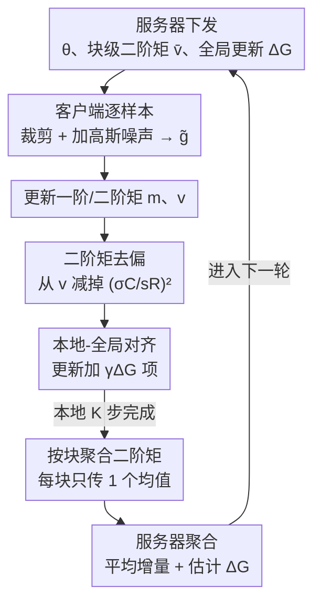

# DP-FedAdamW: An Efficient Optimizer for Differentially Private Federated Large Models

**会议**: CVPR 2026  
**论文**: [CVF Open Access](https://openaccess.thecvf.com/content/CVPR2026/html/Liu_DP-FedAdamW_An_Efficient_Optimizer_for_Differentially_Private_Federated_Large_Models_CVPR_2026_paper.html)  
**代码**: https://github.com/junkangLiu0/DP-FedAdamW  
**领域**: 优化器 / 联邦学习 / 差分隐私  
**关键词**: 差分隐私联邦学习, AdamW, 二阶矩去偏, 客户端漂移, 大模型微调  

## 一句话总结
这篇论文发现把 AdamW 直接搬到差分隐私联邦学习（DPFL）里会失灵，定位出"二阶矩方差放大、DP 引入的二阶矩偏置、客户端漂移加剧"三个病因，提出首个面向 DPFL 的 AdamW 优化器 DP-FedAdamW——用按块聚合二阶矩、显式扣掉 DP 噪声偏置、本地更新对齐全局方向三招对症下药，在 Tiny-ImageNet（Swin-Base, ε=1）上比 SOTA 高 5.83%。

## 研究背景与动机
**领域现状**：联邦学习（FL）让多个客户端在不共享原始数据的前提下协同训练；为了给参数更新提供形式化隐私保证，差分隐私联邦学习（DPFL）在本地梯度上做裁剪 + 加高斯噪声（即 DP-SGD 那一套）。但绝大多数 DPFL 算法都建立在 SGD 之上（DP-FedAvg、DP-SCAFFOLD、DP-FedSAM 等）。

**现有痛点**：当模型换成 Swin Transformer、RoBERTa 这类参数量大、对优化器极度敏感的大模型时，DP-SGD 风格的本地更新（裁剪 + 噪声严重扭曲梯度）会放大不稳定、拖慢收敛。自然想到用在大模型上更强的 AdamW，但作者实验发现：把 AdamW 直接放到 DPFL 里（记作 DP-LocalAdamW），效果常常和 SGD 持平，甚至更差——比如 Swin-Tiny / CIFAR-100 / α=0.1 下还不如 DP-FedAvg-LS。AdamW 在 DPFL 里"水土不服"。

**核心矛盾**：AdamW 的优势全靠它的自适应矩估计（一阶矩 $m$、二阶矩 $v$）来做逐参数步长缩放。可在 DPFL 里，非 IID 数据 + DP 噪声同时作用在梯度上，把这套矩统计量"污染"了。作者把病因拆成三条：(i) 非 IID 让客户端梯度发散、DP 噪声又抬高方差，二者叠加把二阶矩估计的方差放大，自适应缩放变得不稳；(ii) 梯度裁剪 + 加噪给二阶矩引入了一个系统性的"加性偏置"，且这个偏置和 Adam 本身的初始化偏置不同源，bias-correction（除以 $1-\beta_2^k$）根本除不掉；(iii) DP 裁剪和噪声等效缩小了有效样本量、放大了本地过拟合，使本就存在的客户端漂移更严重。

**本文目标**：让 AdamW 在"非 IID + 隐私噪声"双重约束下恢复它本该有的收敛与泛化优势。

**核心 idea**：不改 AdamW 的外壳，而是沿三条互补的轴线"修复被扭曲的矩统计"——按参数块聚合二阶矩压方差、显式从二阶矩里减掉 DP 噪声偏置、给本地更新加一个指向全局下降方向的对齐项。

## 方法详解

### 整体框架
DP-FedAdamW（论文也写作 DP-FedAdamW / DPFedAdamW）的运行框架仍是标准 FL 的"下发-本地多步-上传-聚合"循环，但在本地 AdamW 更新和服务器聚合两处都做了针对 DP 的改造。每一通信轮 $t$：服务器把全局模型 $\theta^t$、上一轮聚合的块级二阶矩 $\bar v^t$、全局更新估计 $\Delta_G^t$ 一起广播给被选中的 $S$ 个客户端；客户端用 $\bar v^t$ 初始化本地二阶矩，跑 $K$ 步本地 AdamW（每步都做逐样本裁剪 + 加噪满足 DP，并在更新规则里用上去偏项和全局对齐项）；本地结束后只上传模型增量 $\theta_i^{t,K}-\theta_i^{t,0}$ 和**按块求平均**后的二阶矩 $\bar v_i$；服务器把增量平均得到新全局模型，把块级二阶矩平均得到 $\bar v^{t+1}$，并据增量估计出全局更新方向 $\Delta_G^{t+1}$。

三个改造点一一对应三个病因：二阶矩按块聚合（治方差放大）、二阶矩去偏（治 DP 偏置）、本地-全局对齐（治客户端漂移）。

### 关键设计

**1. 二阶矩按块聚合：把抖动的 preconditioner 平滑成块级共享步长**

针对病因 (i)——非 IID + DP 噪声把二阶矩方差放大。论文先给出方差放大的机制：$v$ 是噪声梯度平方 $\tilde g\odot\tilde g$ 的指数滑动平均，$\mathrm{Var}(v^t)\approx \frac{(1-\beta_2)^2}{1-\beta_2^2}\mathrm{Var}(\tilde g^t\odot\tilde g^t)$，而 $\tilde g\odot\tilde g$ 把噪声平方放大、$\beta_2\approx 0.999$ 又让平均很慢，于是 $v$ 的方差在 DP + 异质下迅速累积、主导了优化噪声（图 3a 实测非 IID+DP 下 $v$ 方差又高又收敛慢）。

做法是不再逐坐标用自己的二阶矩，而是把参数按网络结构切成 $B$ 个块、块内共享一个二阶矩均值：$\bar v_b=\frac{1}{|v_b|}\sum_{i\in v_b}v_i$。切块和模型架构对齐——注意力相关参数按注意力头粒度切（每个头的 Q/K/V 切片各算一块），attn.proj 和每个 MLP 层各算一块，Embedding 层、输出层各一块；CNN（ResNet）则每个卷积层 / 残差块算一块。块内取均值既抹平了单坐标因噪声产生的剧烈抖动、得到更稳的自适应缩放，又把上传量从"和参数同维的二阶矩向量"压成"$B$ 个块级标量"，通信开销保持 $1\times$（消融里 Agg-mean-v 只用 5.7M 通信，对照逐坐标聚合 Agg-v 要 11.4M）。

**2. 二阶矩去偏（BC）：从分母里精确扣掉 DP 噪声鼓起来的那一块**

针对病因 (ii)——DP 加噪给二阶矩注入了一个 Adam 自带 bias-correction 除不掉的加性偏置。论文推导出这个偏置的闭式量：因为加的高斯噪声方差是 $(\sigma C/sR)^2$，所以 $\mathbb{E}[\tilde g\odot\tilde g]=\mathbb{E}[\bar g\odot\bar g]+\sigma^2C^2/(sR)^2\,I$，传导到二阶矩就是 $\mathbb{E}[v^{t,k}]=\mathbb{E}[v^{t,k}]_{\text{w/o DP}}+(1-\beta_2^k)\,\sigma^2C^2/(sR)^2\,I$。这是个常数级别的"系统性鼓包"（图 4b 显示带 DP 的 $\sqrt{v}$ 分布中心整体平移约 $\sqrt{\sigma^2C^2/(sR)^2}$），会让 AdamW 把所有方向的步长都压小。

修法很直接：在算自适应缩放 $\vartheta$ 时，把这个偏置从分母里减掉——

$$\vartheta_i^{t,k}=1\Big/\Big(\sqrt{\hat v_i^{t,k}-\big(\tfrac{\sigma C}{sR}\big)^2}+\tau\Big)$$

其中 $\hat v$ 是去过初始化偏置的二阶矩、$\tau$ 是 AdamW 的数值稳定项。注意这里的"无偏"是相对**裁剪后梯度**的二阶矩而言（⚠️ 以原文为准）。减掉之后自适应步长不再被 DP 噪声系统性压低，缩放回到该有的尺度。

**3. 本地-全局对齐：给本地 AdamW 一步加一个软拉回全局下降方向的力**

针对病因 (iii)——本地自适应 + DP 让客户端往各自的局部最优跑、漂移加剧。论文在本地更新规则里加了一个对齐项：

$$\theta_i^{t,k+1}=\theta_i^{t,k}-\eta\big(\hat m_i^{t,k}\odot\vartheta_i^{t,k}-\lambda\theta_i^{t,k}+\gamma\Delta_G^t\big)$$

其中 $\Delta_G^t=\frac{-1}{SK\eta}\sum_{i=1}^S(\theta_i^{t,K}-\theta_i^{t,0})$ 是用上一轮 $S$ 个客户端增量估计出的全局更新方向，$\gamma$ 是对齐强度。它的好处是"自适应"：当某客户端的更新本来就顺着全局趋势走时，这一项几乎不起作用；只有当非 IID 数据和 DP 操作把本地方向带偏时，$\gamma\Delta_G^t$ 才把轨迹往全局路径上拽回来，从而收紧各客户端模型的离散度、降低聚合时的跨客户端方差。$\gamma$ 是个有甜点的旋钮：消融里从 0 增到 0.5 持续涨点，超过 0.5 反而略掉（过强对齐会过度约束本地更新），故默认 $\gamma=0.5$。

### 损失函数 / 训练策略
优化目标是标准 FL 群体风险 $f(\theta)=\frac1N\sum_i f_i(\theta)$；隐私核算用 Rényi DP（RDP）做组合与子采样的紧界。理论上作者证了两点：(1) 收敛率 $O\!\big(\sqrt{L\Delta\sigma_l^2/(SKT\tau^2)}+L\Delta/T+\sigma^2G_g^2/(s^2R^2)\big)$，比 DP-LocalAdamW 的率更快（少了 $\sigma_g^2$ 项），且**不需要任何有界异质性假设**——这正是全局更新估计 $\Delta_G$ 压住漂移带来的；(2) 给出 $(\varepsilon,\delta)$ 的样本级隐私保证。超参：Transformer 用 $T{=}100,K{=}20$、batch 16，ResNet-18 用 $T{=}300,K{=}50$、batch 50，$\beta_1{=}0.9,\beta_2{=}0.999$，$\gamma{=}0.5$，$\lambda{=}0.01$，噪声乘子 $\sigma{=}1$，cosine 学习率衰减。

## 实验关键数据

### 主实验
覆盖 7 个数据集（视觉 CIFAR-10/100、Tiny-ImageNet；语言 GLUE 的 SST-2/QQP/QNLI/MNLI）和三类架构（GNResNet-18、ViT/Swin、RoBERTa），用 Dirichlet(α) 模拟非 IID，所有方法同噪声乘子 σ 公平对比（DP-FedSAM 因每步注两次独立噪声，约花 2× 隐私预算）。

| 设置 | 指标 | DP-FedAdamW | 最强基线 | 提升 |
|------|------|------------|----------|------|
| Tiny-ImageNet, Swin-Base, ε=1, α=0.1 | Acc(%) | 34.23 | 28.40 (DP-LocalAdamW) | +5.83 |
| CIFAR-10, Swin-Base, ε=1, α=0.1 | Acc(%) | 77.50 | 71.57 (DP-FedAvg-LS) | +5.93 |
| CIFAR-100, ResNet-18, α=0.1 | Acc(%) | 33.55 | 28.70 (DP-LocalAdamW) | +4.85 |
| CIFAR-100, Swin-Base, Tiny-ImageNet α=0.1 | Acc(%) | 50.76 | 48.08 (DP-FedSAM) | +2.68 |
| MNLI, RoBERTa-Base, α=0.8 | Acc(%) | 78.68 | 75.20 (DP-LocalAdamW) | +3.48 |

DP-FedAdamW 在所有视觉/语言设置、所有异质度下都拿到最好精度；且隐私越强（ε 越小）相对优势越大，说明它换来了更好的"隐私-效用 trade-off"。

### 消融实验
组件消融（Swin-Base, α=0.1，相对 DP-LocalAdamW 逐个加回三件套；Agg=按块聚合, BC=去偏, Align=对齐）：

| 配置 | CIFAR-100 | Tiny-ImageNet | 说明 |
|------|-----------|---------------|------|
| DP-LocalAdamW | 65.28 | 46.52 | 朴素 AdamW 基线 |
| w/o Agg | 66.41 | 47.35 | 去掉块聚合 |
| w/o BC | 67.02 | 48.11 | 去掉去偏 |
| w/o Align | 66.37 | 47.82 | 去掉对齐 |
| DP-FedAdamW (full) | 67.42 | 50.73 | 三件套全开 |

聚合策略消融（CIFAR-100, Swin-Base, α=0.1）显示逐坐标聚合 Agg-v 要 11.4M 通信，而块均值 Agg-mean-v 只用 5.7M 就拿到几乎一样的精度（67.45 / 50.76）；γ 消融在 0.5 处取得峰值。

### 关键发现
- 三个组件各自都涨点，组合最优；在 Tiny-ImageNet 上 Align 缺失掉点最明显（50.73→47.82），印证客户端漂移是大模型 DPFL 的主瓶颈。
- 块级均值聚合（Agg-mean-v）几乎不增通信就能拿到逐坐标聚合的收益，是"稳方差又省带宽"的甜点。
- 把 DP 直接套到现成的联邦自适应优化器（DP-FedOpt(Adam)、DP-FAFED、DP-FedLADA）收益有限，DP-FedAdamW 在 CIFAR-100/Tiny-ImageNet 上仍领先 SOTA DP 基线约 1.42% / 2.91%（表 9）。
- DP-FedSAM 虽在等噪声下有时强，但它实际花了约 2× 隐私预算；在小 ε（ε=1）严格隐私下甚至大幅掉队（CIFAR-10 仅 53.51%）。

## 亮点与洞察
- **把"AdamW 在 DPFL 失灵"量化成三个可定位的病因**，且每个都给了机制公式（方差放大式、二阶矩偏置闭式、漂移图示），不是泛泛而谈——这种"先诊断后开方"的结构很值得借鉴。
- **DP 偏置的闭式扣除**很巧：既然加的高斯噪声方差已知是 $(\sigma C/sR)^2$，那它对二阶矩的污染就是个可算的常数，直接从分母减掉即可，几乎零成本却恢复了自适应缩放的尺度。
- **块级二阶矩聚合一箭双雕**：同时解决"方差抖"和"通信翻倍"，按注意力头/层切块的粒度设计也能迁移到其他需要传二阶统计量的联邦自适应优化器。
- **不需有界异质性假设的收敛证明**：靠全局更新估计 $\Delta_G$ 压漂移，这让理论结论比依赖异质性上界的前作（如 FedLADA）适用面更广。

## 局限与展望
- 三件套都依赖一些已知量（噪声乘子 σ、裁剪范数 C、batch 大小 sR）来精确扣偏置，若这些量估计不准或随训练动态变化，BC 的"精确减"可能引入新误差（⚠️ 论文未深入讨论这一鲁棒性）。
- 块切分粒度（按头 / 按层）是人工对齐架构定的，换到非 Transformer/CNN 的结构（如图网络、MoE）时怎么切块未给通用准则。
- 对齐系数 γ 用固定 0.5，是否该随轮次或异质度自适应调整、对齐项会不会在极端非 IID 下过度拉平个性化，仍可进一步探究。
- 评测集中在分类任务（视觉分类 + GLUE 理解），生成式大模型微调下的表现未覆盖。

## 相关工作与启发
- **vs DP-FedAvg / DP-SCAFFOLD / DP-FedAvg-LS（SGD 系）**：它们用 DP-SGD 风格本地更新，对大 Transformer 收敛慢、不稳；DP-FedAdamW 把自适应优化引入 DPFL 并修好了矩统计，在大模型上明显更强。
- **vs DP-FedSAM**：靠 SAM 找平坦极小提鲁棒，但每步注两次噪声、实际花约 2× 隐私预算，小 ε 下大幅掉点；DP-FedAdamW 保持 1× 预算且小 ε 优势更大。
- **vs DP-LocalAdamW**：即朴素 AdamW+DP，是本文的"病人"，三件套全是冲它的三个病因去的，全设置稳定超越。
- **vs DP-FedOpt(Adam) / DP-FAFED / DP-FedLADA**：这些联邦自适应优化器原本没考虑 DP 噪声，简单套 DP 收益有限；DP-FedAdamW 显式针对 DP 噪声去偏 + 稳方差，是首个为 DPFL 量身设计的 AdamW 优化器。

## 评分
- 新颖性: ⭐⭐⭐⭐⭐ 首个面向 DPFL 的 AdamW 优化器，三病因诊断 + 三对症设计，DP 偏置闭式扣除尤其漂亮。
- 实验充分度: ⭐⭐⭐⭐⭐ 7 数据集 × 3 架构 × 多 α/ε，组件/聚合策略/γ 消融齐全，含与 DP 自适应优化器横比。
- 写作质量: ⭐⭐⭐⭐ 诊断-处方结构清晰、公式给得足；个别记号（DP-FedAdamW/DPFedAdamW 混用、收敛率符号密集）略增阅读成本。
- 价值: ⭐⭐⭐⭐⭐ 解决了大模型隐私联邦微调的现实痛点，方法即插即用、有理论与代码，落地性强。

<!-- RELATED:START -->

## 相关论文

- [\[CVPR 2026\] FedAlign: Differentially Private Distribution Alignment for Non-IID Federated Learning](fedalign_differentially_private_distribution_alignment_for_non-iid_federated_lea.md)
- [\[ICML 2026\] LiMuon: Light and Fast Muon Optimizer for Large Models](../../ICML2026/optimization/limuon_light_and_fast_muon_optimizer_for_large_models.md)
- [\[ICML 2026\] Memory-Efficient LLM Pretraining via Minimalist Optimizer Design](../../ICML2026/optimization/memory-efficient_llm_pretraining_via_minimalist_optimizer_design.md)
- [\[CVPR 2026\] Generalized and Personalized Federated Learning with Black-Box Foundation Models via Orthogonal Transformations](generalized_and_personalized_federated_learning_with_black-box_foundation_models.md)
- [\[CVPR 2026\] GR-Gauge: Cost-efficient Training Configuration By Gauging the Gradient Redundancy](gr-gauge_cost-efficient_training_configuration_by_gauging_the_gradient_redundanc.md)

<!-- RELATED:END -->
