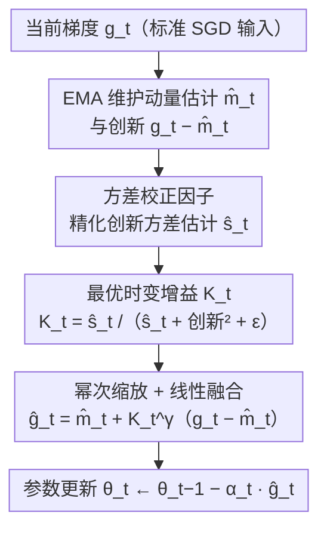

# Dynamic Momentum Recalibration in Online Gradient Learning

**会议**: CVPR 2026  
**arXiv**: [2603.06120](https://arxiv.org/abs/2603.06120)  
**代码**: [GitHub](https://github.com/LilYau350/SGDF-Optimizer)  
**领域**: 优化  
**关键词**: optimizer, momentum, bias-variance tradeoff, optimal linear filter, gradient estimation

## 一句话总结
从信号处理视角揭示固定动量系数在偏差-方差权衡上的固有缺陷，提出SGDF优化器，通过在线计算最优时变增益（基于最小均方误差原则）动态平衡梯度估计的噪声抑制和信号保持，在多种视觉任务上超越SGD动量和Adam变体。

## 研究背景与动机

**领域现状**：SGD及其动量变体（EMA/CM）和自适应方法（Adam/AdamW）是深度学习优化的基础。动量方法通过历史梯度平滑噪声，自适应方法通过二阶矩缩放学习率。

**现有痛点**：用SDE框架分析发现，EMA（$u=1-\beta$）作为低通滤波器，$\beta \to 1$ 时方差降低但偏差发散（累积过时梯度）；CM（$u=1$）更激进，$\beta \to 1$ 时偏差和方差都发散。两种方法都用固定系数锁定在预设的偏差-方差权衡中，无法适应训练过程中动态变化的噪声和曲率。

**核心矛盾**：结构性减少方差必然放大偏差，减少偏差必然暴露在更高方差中——这是静态动量系数的根本困境。

**本文目标**：设计自适应增益，在低方差阶段减少动量依赖以最小化偏差，在高方差时大量利用动量更新过滤噪声。

**切入角度**：从最优线性滤波（Kalman Filter思想）出发，将历史梯度估计和当前梯度观测视为两个不确定源的高斯融合。

**核心 idea**：用最小均方误差原则在线计算时变增益 $K_t$，实现动量估计和当前梯度的最优线性融合。

## 方法详解

### 整体框架
SGDF把固定动量系数换成一个**每步在线计算的时变增益** $K_t$，让优化器自己决定这一步该多信任历史动量、还是多信任当前梯度。整套流程仍然挂在标准 SGD+动量上：先用 EMA 维护一阶矩 $\hat{m}_t$ 和"创新"方差 $\hat{s}_t$，并用**方差校正因子**把 $\hat{s}_t$ 修准；再根据当前梯度 $g_t$ 与动量估计的偏离量 $(g_t-\hat{m}_t)$ 算出最优增益 $K_t$；最后经**幂次缩放**后把动量估计和当前梯度做一次线性融合得到 $\hat{g}_t$，用 $\hat{g}_t$ 更新参数。关键在于 $K_t$ 不是预设常数，而是由两个不确定源的方差比值实时定出来的——这正对应 Kalman Filter 里"预测+观测"的融合思想。

### 关键设计

**1. 最优时变增益：用 MMSE 原则替代固定动量系数**

研究背景里指出的根本困境是，EMA 和 CM 都用固定 $\beta$ 把自己锁死在某个偏差-方差权衡上，没法适应训练中变化的噪声和曲率。SGDF 的解法是把梯度估计写成动量估计加一个"创新"修正的线性插值

$$\hat{g}_t = \hat{m}_t + K_t\,(g_t - \hat{m}_t),$$

其中 $(g_t-\hat{m}_t)$ 是当前梯度相对历史估计的偏离（"创新"项）。对融合后的 $\text{Var}(\hat{g}_t)$ 关于 $K_t$ 求导并令其为零，就解出最优增益

$$K_t^* = \frac{\text{Var}(\hat{m}_t)}{\text{Var}(\hat{m}_t) + \text{Var}(g_t)}.$$

实现上用 $\hat{s}_t$（$s_t$ 的 EMA）估计动量的不确定性 $\text{Var}(\hat{m}_t)$，用当前创新平方估计观测方差，落成 $K_t = \hat{s}_t / (\hat{s}_t + (g_t-\hat{m}_t)^2 + \epsilon)$。这个式子的含义很直白且自适应：当历史动量自己就很不确定（$\hat{s}_t$ 大）时增益升高、多信当前梯度；当当前观测噪声大（创新平方大）时增益降低、退回去信历史动量。固定 $\beta$ 做不到这种逐步调节，而 $K_t$ 每步都在重新评估两个源谁更可信。

**2. 方差校正因子：让创新方差的估计对得上真值**

增益 $K_t$ 的质量完全取决于 $\hat{s}_t$ 这个方差估计准不准，而直接照搬 Adam 的偏差校正在估计"创新"方差时偏差较大。SGDF 改用因子 $(1-\beta_1)(1-\beta_1^{2t})/(1+\beta_1)$ 对 EMA 二阶矩做校正，在"梯度独立、方差有界"的假设下能给出更精确的方差估计。校正项里同时含 $\beta_1$ 的当前幂 $\beta_1^{2t}$（处理训练早期 EMA 尚未充满的暖启动偏差）和一个 $(1-\beta_1)/(1+\beta_1)$ 的稳态因子，比 Adam 单纯的 $1-\beta^t$ 校正更贴合创新序列的统计性质，从而让 $K_t$ 落在更合理的区间。

**3. 幂次缩放（$\gamma=1/2$）：在高噪声下别把观测信号丢光**

原始 $K_t$ 在噪声很大时会被压得极小，几乎完全信赖动量、把当前梯度的信号也一起滤掉了，反应过于迟钝。SGDF 用 $K_t^\gamma$（取 $\gamma=1/2$）替换 $K_t$，把融合写成 $\hat{g}_t = \hat{m}_t + K_t^{\gamma}(g_t-\hat{m}_t)$。开根号等价于把有效观测方差调制成 $\sqrt{\text{Var}(g_t)}$，等于抬高了增益的下限、放大它对信号的响应区间——噪声高时仍保留一部分观测信号，不至于彻底退化成纯动量。消融里去掉这一项（$\gamma=1$）精度下降，印证了原始增益确实过于保守。

### 损失函数 / 训练策略
- 超参数继承Adam标准设置：$\beta_1=0.9, \beta_2=0.999, \epsilon=10^{-8}$，学习率与SGD同范围搜索
- 凸情况收敛率 $O(\sqrt{T})$，非凸情况 $O(\log T / \sqrt{T})$，与Adam类方法一致
- 可扩展到Adam框架（替换Adam的一阶矩估计），在部分任务上提升泛化

## 实验关键数据

### 主实验

**CIFAR-10/100 图像分类（VGG/ResNet/DenseNet）**

| 方法 | VGG11-C10 | ResNet34-C10 | DenseNet121-C100 |
|------|-----------|-------------|-----------------|
| SGD | ~93.5 | ~95.5 | ~77.0 |
| Adam | ~92.8 | ~94.8 | ~76.5 |
| AdaBelief | ~93.2 | ~95.3 | ~77.2 |
| **SGDF** | **~93.8** | **~95.8** | **~77.8** |

**ImageNet ResNet18 Top-1/Top-5**

| 方法 | Top-1 | Top-5 |
|------|-------|-------|
| SGD | 70.23 | 89.35 |
| AdaBelief | 70.08 | 89.37 |
| **SGDF** | **70.5+** | **89.6+** |

### 消融实验

| 配置 | 效果 | 说明 |
|------|------|------|
| SGDF完整 | 最佳 | 包含方差校正+幂次缩放 |
| w/o 方差校正 | 下降 | 校正因子提升了$K_t$估计质量 |
| w/o 幂次缩放($\gamma=1$) | 下降 | 原始$K_t$在噪声高时过于保守 |
| SGDF扩展到Adam | 改善 | 替换Adam的一阶矩，泛化提升 |

### 关键发现
- SGDF在无残差连接的VGG上优势更明显——说明对梯度噪声更大/传播更困难的网络帮助更大
- 可以无缝扩展到Adam框架（替换一阶矩估计），在部分任务上改善Adam的泛化
- 增益 $K_t$ 在训练初期较大（多信赖当前梯度），后期逐渐减小（更信赖历史动量），与直觉吻合
- 偏差-方差的理论分析（Table 1）是理解论文核心贡献的最佳入口

## 亮点与洞察
- **SDE框架揭示动量本质**：用随机微分方程统一分析EMA和CM，定量化了"参数漂移偏差"——这个偏差之前被忽略
- **最优线性滤波的优雅对应**：将Kalman Filter思想精确对应到梯度估计——动量预测+当前观测融合，gain由不确定性比值决定。这个信号处理视角为优化器设计提供了新的理论工具
- **高斯融合的统计解释**：SGDF等价于两个高斯分布的乘法融合，融合后的方差严格小于两个源方差——理论保证了估计质量的单调改善

## 局限与展望
- 每步额外维护 $s_t$ 和计算 $K_t$，增加了少量计算和内存开销
- 独立性假设（$\hat{m}_t$ 和 $g_t$ 独立）在实际中不严格成立
- 实验主要在CV任务上验证，NLP/LLM训练的效果未知
- $\gamma=1/2$ 的选择是否对所有场景最优？可尝试自适应 $\gamma$

## 相关工作与启发
- **vs Adam**: Adam用二阶矩做学习率自适应，SGDF用一阶矩的方差做增益自适应——两者关注的是不同层面的问题
- **vs AdaBelief**: AdaBelief也用"创新"$(g_t - m_t)^2$ 作为方差估计，但用于学习率缩放；SGDF用它计算最优融合增益，动机和效果不同
- **vs Sophia**: 二阶方法用Hessian信息，计算开销大；SGDF仅用一阶信息实现类似的自适应效果

## 评分
- 新颖性: ⭐⭐⭐⭐⭐ 信号处理视角下的SDE分析和最优线性滤波对应非常优雅
- 实验充分度: ⭐⭐⭐⭐ 多架构多任务验证，但缺少NLP和大模型实验
- 写作质量: ⭐⭐⭐⭐ 理论推导详尽，但部分内容啰嗦
- 价值: ⭐⭐⭐⭐ 为优化器设计提供了新的理论工具和实用方法

<!-- RELATED:START -->

## 相关论文

- [\[CVPR 2026\] BD-Merging: Bias-Aware Dynamic Model Merging with Evidence-Guided Contrastive Learning](bd-merging_bias-aware_dynamic_model_merging_with_evidence-guided_contrastive_lea.md)
- [\[CVPR 2026\] FedAdamom: Adaptive Momentum for Improved Generalization in Federated Optimization](fedadamom_adaptive_momentum_for_improved_generalization_in_federated_optimizatio.md)
- [\[NeurIPS 2025\] Nonlinearly Preconditioned Gradient Methods: Momentum and Stochastic Analysis](../../NeurIPS2025/optimization/nonlinearly_preconditioned_gradient_methods_momentum_and_stochastic_analysis.md)
- [\[CVPR 2026\] From Selection to Scheduling: Federated Geometry-Aware Correction Makes Exemplar Replay Work Better under Continual Dynamic Heterogeneity](from_selection_to_scheduling_federated_geometry-aware_correction_makes_exemplar_.md)
- [\[ICML 2026\] A General Framework for Dynamic Consistent Submodular Maximization](../../ICML2026/optimization/a_general_framework_for_dynamic_consistent_submodular_maximization.md)

<!-- RELATED:END -->
