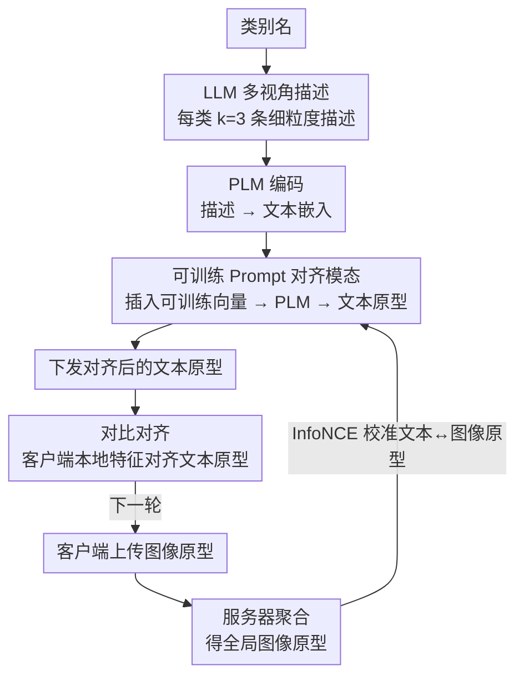

# Enhancing Visual Representation with Textual Semantics: Textual Semantics-Powered Prototypes for Heterogeneous Federated Learning

**会议**: CVPR 2026 Highlight  
**arXiv**: [2503.13543](https://arxiv.org/abs/2503.13543)  
**代码**: [GitHub](https://github.com/XinghaoWu/FedTSP)  
**领域**: 优化  
**关键词**: 联邦学习, 原型学习, 语义关系, 预训练语言模型, 数据异质性

## 一句话总结

针对联邦原型学习中现有方法破坏类间语义关系的问题，提出FedTSP方法利用预训练语言模型构建保留语义结构的文本原型，在异构联邦学习中显著提升性能并加速收敛。

## 研究背景与动机

联邦原型学习（FedPL）是处理联邦学习中数据异质性的有效策略，核心思想是让客户端协同构建全局原型，并让本地特征与之对齐。现有方法（如AlignFed、FedTGP）通常追求最大化原型间的类间距离以增强判别性，但这种做法存在一个被忽视的问题：在增大类间距离的同时，不可避免地破坏了类之间的语义关系。

例如，"马"和"狗"属于语义相近的动物类别，它们的原型距离应当小于"马"和"卡车"之间的距离。但均匀分布在超球面上的原型无法保留这种层次化的语义结构。作者通过Spearman相关系数和语义间隔（semantic gap）两个定量指标验证了这一发现。

直接从有限且异质的客户端数据中学习语义关系是困难的。然而，预训练语言模型（PLM）如BERT在大规模文本语料上已经捕获了丰富的语义关系。这启发了本文的核心idea：能否将文本语义知识注入联邦学习的原型中，使其在异质数据下也能保留类间关系？

## 方法详解

### 整体框架

FedTSP 要解决的是：联邦原型学习里大家都在拼命拉大原型间距以提升判别性，却把"马和狗比马和卡车更近"这种类间语义结构给抹平了。它的破局点是不再从客户端数据里硬学原型，而是从一个外部"语义老师"——预训练语言模型（PLM）——里把现成的语义结构搬过来。整条流水线是：先让 LLM 为每个类别写多条文本描述，再用 PLM（BERT 或 CLIP 文本塔）把描述编码成带语义结构的**文本原型**；这些原型语义对了但和图像不在一个空间，于是在服务器端用一段可训练 Prompt 把文本原型校准到聚合后的**图像原型**上；最后客户端不用 L2 而是用对比损失，让本地特征去对齐这套保留了语义关系的文本原型，从而把语义结构传导进各自的个性化模型。整个过程每轮迭代：客户端上传图像原型 → 服务器对齐并下发文本原型 → 客户端对齐本地特征，往复直至收敛。

### 关键设计

**1. LLM 多视角描述：给类别一个有上下文的"语义身份证"**

手工提示 "A photo of a {CLASS}" 在不同类之间只有类名一处不同，PLM 编码出来的原型几乎只反映词向量本身，语义上下文极薄，还会撞上歧义（"apple" 到底是水果还是公司）。FedTSP 改用 LLM 为每个类别生成 $k=3$ 条覆盖不同方面的细粒度描述，套进模板 "A photo of {CLASS}: {description}"。多条描述从外观、习性、所属类等角度补全语境，编码后的文本原型才真正带上了"这个类和哪些类相近"的信息，也顺手消解了单词歧义。

**2. 可训练 Prompt 对齐模态：让没见过图像的 BERT 也能用**

文本原型语义结构是对的，但 PLM（尤其 BERT）预训练时根本没碰过图像，文本特征和客户端图像特征处在两个不对齐的空间，直接拿来对齐会因模态鸿沟而失真。做法是在文本嵌入序列的前 $m$ 个位置插入一组可训练的 embedding 向量替换原 token，在服务器端用 InfoNCE 损失把这段 prompt 学到能让文本原型贴合聚合后的图像原型：

$$\mathcal{L}_{\text{prompt}} = -\sum_{c} \log \frac{\exp(\text{sim}(t_c, p_c)/\tau)}{\sum_{c'} \exp(\text{sim}(t_c, p_{c'})/\tau)}$$

其中 $t_c$ 是类 $c$ 的文本原型、$p_c$ 是聚合的图像原型。这样既保住了 PLM 自带的语义结构，又把文本塔校准进了视觉空间——这也是为什么 BERT 虽无图文预训练，效果仍能逼近 CLIP。

**3. 对比对齐而非 L2：高基线相似度下排序比绝对距离更可信**

PLM 生成的原型之间基线相似度本来就高——实测即使最不相似的两个类相似度也有 $0.73$，整套原型挤在超球面的一小块上。此时若用 L2 距离硬把本地特征拉向文本原型，会把"相似度 0.73 的不相关类"当成真的相似而误导模型。FedTSP 因此放弃绝对距离，改用对比学习损失，只在意类间**相对**相似度的排序：让本地特征对其真类原型的相似度排在所有类之上即可，由温度参数 $\tau$ 调节对相对差异的敏感度。语义结构靠"谁该比谁更近"的相对关系传导，而不被虚高的绝对相似度带偏。

### 损失函数 / 训练策略

服务器端用 InfoNCE 损失更新可训练 prompt，对齐文本原型与聚合的图像原型；客户端则同时优化交叉熵分类损失和对比对齐损失（温度 $\tau$ 控制对相对相似度的敏感度）。针对类名可能泄露隐私的场景，作者还给出差分隐私扩展：对文本嵌入注入高斯噪声以满足 $(\epsilon,\delta)$-DP 保证，实验显示 $\epsilon \geq 1$ 时性能几乎无损。

## 实验关键数据

### 主实验

| 数据集 | 指标 | FedTSP-BERT | 之前SOTA | 提升 |
|--------|------|-------------|----------|------|
| CIFAR-10 (α=0.1) | Acc | 87.52% | 86.80% (FedKD) | +0.72% |
| CIFAR-100 (α=0.1) | Acc | 46.08% | 42.82% (FedMRL) | +3.26% |
| TinyImageNet (α=0.1) | Acc | 34.82% (CLIP) | 32.79% (FedKD) | +2.03% |

### 消融实验

| 配置 | 关键指标 | 说明 |
|------|----------|------|
| 对比学习 vs L2对齐 | +2-3% | 对比学习更适合处理高基线相似度 |
| LLM描述 vs 手工模板 | +1-2% | 细粒度描述提供更丰富的语义上下文 |
| CLIP vs BERT | 接近 | BERT虽无图像预训练，但通过可训练prompt可弥合 |

### 关键发现

- FedTSP在强异质性（α=0.1）下提升更显著，说明文本原型对异质数据更鲁棒
- FedTSP-BERT在Top-5准确率上提升更大，说明语义关系有效：即使分类错误，也倾向于放在语义相近的类中
- 隐私保护版本在ε≥1时性能几乎不受影响

## 亮点与洞察

- 首次将PLM/LLM的语义知识引入联邦原型学习，视角新颖
- 发现并量化了现有方法破坏语义关系的问题
- FedTSP兼容CLIP和BERT等不同PLM，且不依赖CLIP的视觉-语言对齐
- 可同时处理数据异质性和模型异质性

## 局限与展望

- 服务器需要部署PLM，增加了服务器端的计算成本
- LLM生成描述的质量依赖于类别名称的明确性
- 未探索更大规模数据集（如ImageNet）和更多样的PLM架构
- 隐私保护扩展仅考虑了类名隐私，未覆盖更广泛的隐私场景

## 相关工作与启发

- **vs FedProto/FedTGP**: 这些方法从客户端数据聚合原型或最大化类间距离，破坏了语义关系；FedTSP从文本模态构建原型，天然保留语义结构
- **vs CLIP-based FL**: CLIP-based方法旨在增强CLIP本身，FedTSP则将语义知识转移给轻量级客户端模型，不依赖CLIP
- **vs FedETF/FedNH**: 使用固定的ETF/均匀分布分类器作为原型，无法编码语义关系

## 评分

- 新颖性: ⭐⭐⭐⭐ 首次将PLM语义知识引入联邦原型学习，视角独特
- 实验充分度: ⭐⭐⭐⭐ 多数据集、多异质性设置、多PLM、消融实验完整
- 写作质量: ⭐⭐⭐⭐ 动机清晰，可视化直观，语义对齐和间隔指标设计精巧
- 价值: ⭐⭐⭐⭐ 为联邦学习提供了利用语言模型语义知识的新范式

<!-- RELATED:START -->

## 相关论文

- [\[ICML 2026\] Learning Context-Conditioned Predicate Semantics via Prototype Feedback](../../ICML2026/optimization/learning_context-conditioned_predicate_semantics_via_prototype_feedback.md)
- [\[CVPR 2026\] FedRG: Unleashing the Representation Geometry for Federated Learning with Noisy Clients](fedrg_unleashing_the_representation_geometry_for_federated_learning_with_noisy_c.md)
- [\[ICLR 2026\] Incentives in Federated Learning with Heterogeneous Agents](../../ICLR2026/optimization/incentives_in_federated_learning_with_heterogeneous_agents.md)
- [\[CVPR 2026\] HyperNAS: Enhancing Architecture Representation for NAS Predictor via Hypernetwork](hypernas_enhancing_architecture_representation_for_nas_predictor_via_hypernetwor.md)
- [\[AAAI 2026\] SMoFi: Step-wise Momentum Fusion for Split Federated Learning on Heterogeneous Data](../../AAAI2026/optimization/smofi_step-wise_momentum_fusion_for_split_federated_learning_on_heterogeneous_da.md)

<!-- RELATED:END -->
