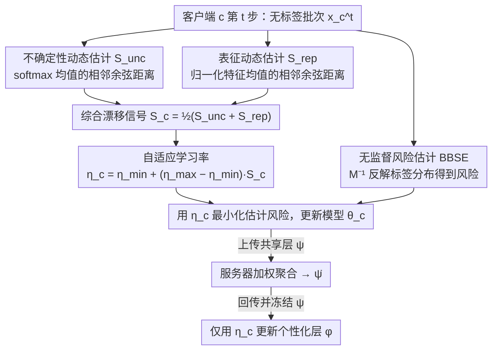

# Fed-ADE: Adaptive Learning Rate for Federated Post-adaptation under Distribution Shift

**会议**: CVPR2026  
**arXiv**: [2603.01040](https://arxiv.org/abs/2603.01040)  
**代码**: [h2w1/Fed-ADE](https://github.com/h2w1/Fed-ADE)  
**领域**: 优化  
**关键词**: federated learning, distribution shift, adaptive learning rate, online adaptation, unsupervised adaptation

## 一句话总结

提出 Fed-ADE 框架，通过 uncertainty dynamics estimation 和 representation dynamics estimation 两个轻量级分布漂移信号，为每个客户端在每个时间步自适应调整学习率，实现联邦部署后无监督适应。

## 研究背景与动机

**部署后分布漂移普遍存在**：边缘设备（手机、IoT、自动驾驶）持续接收非平稳数据流，预训练模型因分布漂移快速退化。

**异构性双重挑战**：联邦学习中同时面临 shift heterogeneity（每个客户端经历不同时间动态的分布漂移）和 data heterogeneity（客户端本地数据在规模、领域上本身就不同）。

**固定学习率的致命缺陷**：学习率过小导致欠拟合，过大导致发散；在数百个异构客户端上使用统一固定学习率无法适配各自不同的分布漂移速度。

**无监督约束**：部署后无法获取真实标签，使得学习率选择更加困难，传统的基于损失的调度策略不可直接使用。

**现有方法局限**：Fed-POE 等方法依赖多模型集成或代价高昂的超参搜索，引入额外通信和计算开销；集中式方法（ATLAS、FTH）无法利用跨客户端的共享知识。

**核心问题**：如何在无标签、异构、时变分布漂移的联邦场景下，为每个客户端自动选择合适的学习率？

## 方法详解

### 整体框架

Fed-ADE 采用 partial-sharing 的个性化联邦学习架构：每个客户端模型 $\theta_c$ 被分为共享层 $\psi_c$（与服务器通信）和个性化层 $\phi_c$（本地保留）。在每轮通信中：(1) 客户端用自适应学习率 $\eta_c^t$ 更新全部参数；(2) 上传 $\psi_c$ 到服务器加权聚合；(3) 接收聚合后的 $\bar{\psi}$ 并冻结共享层，仅用自适应学习率更新个性化层。核心创新在于学习率的自适应计算：

$$\eta_c^t = \eta_{\min} + (\eta_{\max} - \eta_{\min}) \cdot \mathcal{S}_c^t$$

其中 $\mathcal{S}_c^t \in [0,1]$ 是综合分布漂移信号，由两个互补的估计器组合：$\mathcal{S}_c^t = \frac{1}{2}(\mathcal{S}_{\text{unc}}^t + \mathcal{S}_{\text{rep}}^t)$。整套方法的难点不在更新规则本身，而在于无标签时怎么知道"漂移了多少"——下面四个设计依次解决信号怎么测、风险怎么估、以及这套调度为什么有理论最优性。

### 关键设计

**1. 不确定性动态估计（Uncertainty Dynamics Estimation）：用预测置信度的时间变化感知 label shift**

部署后拿不到标签，最直接的漂移信号其实藏在模型自己的输出里。Fed-ADE 把当前批次所有样本的 softmax 向量取平均，得到一个类级别的平均置信度摘要 $\mathbf{q}_c^t = \frac{1}{|\mathbf{x}_c^t|} \sum_{x} \mathcal{H}(\theta_c; x)$——它无需标签，相当于一个熵代理，刻画了模型当下"觉得数据属于哪些类"。当类别分布发生 label shift 时，这个平均向量的方向会跟着偏转，于是用相邻两步之间的余弦距离来量化变化幅度：

$$\mathcal{S}_{\text{unc}}^t = 1 - \cos(\mathbf{q}_c^{t-1}, \mathbf{q}_c^t)$$

之所以取批次级平均而非单样本，是为了消掉单个样本带来的随机抖动，让信号反映分布层面的迁移；而整个估计只需缓存上一步的 $\mathbf{q}_c^{t-1}$，内存开销仅 $O(|\mathcal{I}|)$（类别数），轻到可以挂在每个边缘客户端上。

**2. 表征动态估计（Representation Dynamics Estimation）：在嵌入空间补上 covariate shift 的那一维**

label shift 信号看的是输出端，但输入图像被加噪、换域这类 covariate shift 不一定立刻反映到 softmax 上，所以需要一个看特征端的互补信号。这里取共享层提取的特征、做 $\ell_2$ 归一化后求批次平均 $\mathbf{z}_c^t = \frac{1}{|\mathbf{x}_c^t|} \sum_x \frac{h_{\psi_c}(x)}{\|h_{\psi_c}(x)\|_2}$，同样用相邻两步的余弦距离衡量特征方向的漂移：

$$\mathcal{S}_{\text{rep}}^t = \frac{1}{2}\bigl(1 - \cos(\mathbf{z}_c^{t-1}, \mathbf{z}_c^t)\bigr)$$

$\ell_2$ 归一化是关键一步——它让余弦距离只对特征的方向变化敏感，而不被特征尺度的大小差异干扰；前面那个 $\frac{1}{2}$ 缩放则把取值范围从 $[0,2]$ 压回 $[0,1]$，使它和 uncertainty 信号处在同一量纲、能直接平均。和上一个信号一样，它完全本地计算、不需要标签，额外内存只有 $O(d)$（特征维度）。

**3. 无监督风险估计：没有标签，就用 BBSE 把标签分布"反解"出来**

要更新模型就得有优化目标，但无标签场景下连期望风险都算不出来。Fed-ADE 借助 Black-box Shift Estimation（BBSE）绕开这个困境：服务器侧预先用带标签的预训练数据算出一个混淆矩阵 $\mathbf{M}$，客户端只需统计当前批次的伪标签分布 $\mathbf{Q}_{c,\hat{y}}^t$，就能把真实标签分布反解出来：

$$\mathbf{Q}_{c,y}^t \approx \mathbf{M}^{-1} \mathbf{Q}_{c,\hat{y}}^t$$

有了这个分布，就能把有监督风险拆成各类别子风险的加权和、再用估计出的标签分布当权重，得到无监督风险估计 $\widehat{\mathcal{F}}_c^t(\theta_c)$；其中各类别的初始子风险可以用预训练数据的经验值替代。这样一来，整条更新链路从信号到目标都不依赖在线标签。

**4. 理论保证：把漂移代理和 dynamic regret 接起来，证明这套调度是 min-max 最优的**

前面三个设计都是工程构造，论文最后回答了一个更根本的问题——基于 $\mathcal{S}_c^t$ 去调学习率，到底有没有最优性保证。作者先证明累积漂移代理 $\bar{\mathcal{S}}_c$ 能准确近似真实分布漂移（Theorem 1 & 2），从而把可观测的代理信号和不可观测的真实漂移量挂上钩；在此基础上，当学习率取 $\eta^* = \Theta(T^{-1/3} \bar{\mathcal{S}}_c^{1/3})$ 时，动态遗憾满足

$$\mathbb{E}[\text{Reg}_T] = \mathcal{O}(\bar{\mathcal{S}}_c^{1/3} T^{2/3})$$

恰好匹配无监督 label shift 下在线学习的 min-max 最优界。这条界的意义在于：它说明"漂移得越快、学习率就该越大"这个直觉不只是经验调参，而是在非平稳环境下逼近理论下界的最优策略。

## 实验关键数据

**Table 1: Label Shift 场景（平均准确率 %）**

| 数据集 | 漂移类型 | FTH | ATLAS | Fed-POE | FedCCFA | FixLR(Mid) | **Fed-ADE** |
|--------|---------|-----|-------|---------|---------|------------|-------------|
| Tiny ImageNet | Lin. | 78.2 | 76.5 | 87.1 | 84.7 | 88.2 | **89.1** |
| Tiny ImageNet | Sin. | 77.9 | 76.8 | 87.5 | 84.8 | 88.0 | **88.9** |
| CIFAR-10 | Lin. | 31.4 | 36.5 | 71.3 | 65.8 | 70.8 | **73.8** |
| CIFAR-10 | Sin. | 40.3 | 43.7 | 71.4 | 65.8 | 70.5 | **73.6** |
| LAMA | Lin. | 68.3 | 79.5 | 85.4 | 95.6 | 95.2 | **95.8** |
| LAMA | Squ. | 70.5 | 79.8 | 84.2 | 92.0 | 95.4 | **96.4** |

**要点**：Fed-ADE 在所有 label shift 场景均取得最优；相比 FixLR 平均提升约 1-3%，相比 Fed-POE 提升约 2-4%。

**Table 2: Covariate Shift 场景 + 消融实验**

| 数据集 | 漂移类型 | FTH | ATLAS | Fed-POE | FixLR(Mid) | **Fed-ADE** |
|--------|---------|-----|-------|---------|------------|-------------|
| CIFAR-10-C | Lin. | 23.7 | 13.9 | 44.5 | 63.9 | **64.4** |
| CIFAR-10-C | Squ. | 23.8 | 14.1 | 48.5 | 64.5 | **65.4** |
| CIFAR-100-C | Lin. | 9.2 | 3.5 | 27.3 | 43.4 | **45.8** |
| CIFAR-100-C | Sin. | 7.6 | 2.9 | 27.5 | 42.1 | **46.7** |

**消融**（CIFAR-10 Lin.）：Fed-ADE(full) 73.8% > w/o $\mathcal{S}_{\text{unc}}$ 71.3% > w/o $\mathcal{S}_{\text{rep}}$ 73.1% > Fixed LR 70.8%。两个信号互补：$\mathcal{S}_{\text{unc}}$ 对 label shift 更敏感，$\mathcal{S}_{\text{rep}}$ 对 covariate shift 更敏感。

**计算效率**：Fed-ADE 平均 wall time ≈109 秒，比 localized 方法快 17–24 倍，比 FedCCFA 快约 2 倍。

## 亮点与洞察

1. **极其轻量的设计**：两个漂移估计器仅需缓存上一步的均值向量（$O(|\mathcal{I}|) + O(d)$），无需额外通信、无需标签、无需集成多个模型。
2. **理论与实践统一**：证明了 $\mathcal{S}_c^t$ 可近似真实分布漂移，并推导出 $\mathcal{O}(\bar{\mathcal{S}}_c^{1/3} T^{2/3})$ 的 min-max 最优动态遗憾，在联邦无监督适应领域较为少见。
3. **余弦相似度的优越性**：消融实验表明 cosine similarity 优于 KL 散度、Wasserstein 距离和 Bayesian CPD，原因是余弦度量有界且基于方向，对伪标签噪声和类别不平衡更鲁棒。
4. **跨模态泛化**：在图像（Tiny ImageNet, CIFAR-10/100, CIFAR-C）和文本（LAMA）基准上均表现优异，证明方法不依赖特定模态。
5. **对预训练分布不敏感**：当预训练数据服从高斯或指数衰减分布（而非均匀分布）时，Fed-ADE 仍保持稳定性能。

## 局限与展望

1. **两个信号的等权组合**：$\mathcal{S}_c^t = \frac{1}{2}(\mathcal{S}_{\text{unc}}^t + \mathcal{S}_{\text{rep}}^t)$ 是简单平均，未根据当前漂移类型自适应加权，可能比自动选权（如注意力机制）逊色。
2. **仅验证了 label shift 和 covariate shift**：未涉及 concept drift（$P(y|x)$ 变化）、prior probability shift 等更复杂的漂移类型。
3. **$\eta_{\min}$ 和 $\eta_{\max}$ 仍需手动设定**：虽然论文表明对超参不敏感，但图像和文本基准使用了不同的边界值，未提供自动选择策略。
4. **客户端数量固定为 100**：未探讨大规模（1000+）或极少客户端场景下的表现和收敛速度。
5. **BBSE 的混淆矩阵依赖**：需要预训练数据来计算混淆矩阵 $\mathbf{M}$，若预训练数据不可用或代表性差，估计质量可能受影响。

## 相关工作与启发

- **与 ATLAS/FTH 的对比**：这些 localized 方法在联邦场景下性能极差（CIFAR-10 上仅 30-40%），说明跨客户端知识共享至关重要。
- **与 Fed-POE 的对比**：Fed-POE 通过集成策略提升适应性，但计算开销大、不感知漂移程度；Fed-ADE 通过轻量漂移信号直接调控学习率，更高效。
- **对 TTA / continual learning 的启发**：uncertainty + representation 双信号检测漂移的思路可迁移到 test-time adaptation 和持续学习领域。
- **自适应学习率的新范式**：不同于 Adam 等基于梯度统计量的自适应方法，Fed-ADE 基于数据分布变化信号调整学习率，是一种新的思路。

## 评分

- **新颖性**: ⭐⭐⭐⭐ — 两个互补的轻量级漂移信号驱动自适应学习率的思路新颖，联邦部署后无监督适应场景下的探索有价值，但核心技术（cosine distance、BBSE）均为已有工具的组合。
- **实验充分度**: ⭐⭐⭐⭐⭐ — 涵盖 5 个数据集、2 类漂移、4 种时间调度、多组消融（相似度度量、估计器、预训练分布、学习率边界），非常全面。
- **写作质量**: ⭐⭐⭐⭐ — 结构清晰、符号一致、理论部分严谨；但 Table 1 信息密度极高导致可读性稍差。
- **价值**: ⭐⭐⭐⭐ — 解决了联邦后部署适应中学习率选择这一实际痛点，轻量、高效、有理论保证，对联邦学习和在线适应社区有参考价值。

<!-- RELATED:START -->

## 相关论文

- [\[CVPR 2026\] FedSST: Rethinking Fair Federated Graph Learning under Structural Shift](fedsst_rethinking_fair_federated_graph_learning_under_structural_shift.md)
- [\[CVPR 2026\] FedAlign: Differentially Private Distribution Alignment for Non-IID Federated Learning](fedalign_differentially_private_distribution_alignment_for_non-iid_federated_lea.md)
- [\[CVPR 2025\] Federated Learning with Domain Shift Eraser](../../CVPR2025/optimization/federated_learning_with_domain_shift_eraser.md)
- [\[CVPR 2026\] OS-FED: One Snapshot Is All You Need](os-fed_one_snapshot_is_all_you_need.md)
- [\[CVPR 2026\] FedAdamom: Adaptive Momentum for Improved Generalization in Federated Optimization](fedadamom_adaptive_momentum_for_improved_generalization_in_federated_optimizatio.md)

<!-- RELATED:END -->
