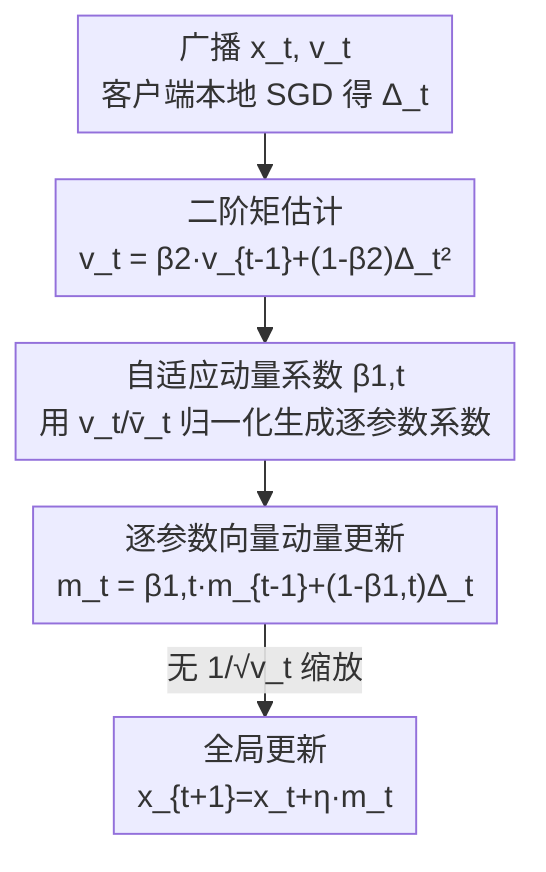

# FedAdamom: Adaptive Momentum for Improved Generalization in Federated Optimization

**会议**: CVPR 2026  
**论文**: [CVF Open Access](https://openaccess.thecvf.com/content/CVPR2026/html/Hou_FedAdamom_Adaptive_Momentum_for_Improved_Generalization_in_Federated_Optimization_CVPR_2026_paper.html)  
**代码**: https://github.com/Tenshawn/FedAdamom  
**领域**: 联邦学习 / 优化  
**关键词**: 联邦学习, 自适应优化, 自适应动量, 平坦极小, 扩散理论  

## 一句话总结
本文用扩散理论解释了「FedAdam 收敛快但泛化差」的根因——自适应学习率削弱了对平坦极小的偏好——并据此提出 FedAdamom：把自适应机制从学习率挪到**动量系数**上，从而既保住快速逃离鞍点的能力、又恢复对平坦极小的选择，在 CIFAR-10/100、Tiny-ImageNet 与 LEAF 上同时取得更快收敛和更高精度。

## 研究背景与动机

**领域现状**：联邦学习（FL）里，服务器把全局模型广播给若干客户端，客户端各自用本地数据做 SGD，再把更新传回服务器聚合。FedAvg 是基线，本质等价于在服务器侧对「伪梯度」$\Delta_t$ 做一步 SGD。为了加速训练，FedAdam 这类**自适应联邦优化器**把 Adam 搬到服务器侧，用二阶矩做自适应学习率，收敛明显更快，已成为最常用的加速方案之一。

**现有痛点**：FedAdam 虽然收敛快，但在高度异质（non-i.i.d.）数据下**泛化往往没有显著提升，甚至更差**。集中式训练里早有观察：Adam 倾向收敛到更尖锐（sharp）的极小，而尖锐极小通常对应更差的泛化。FedAdam 把这个毛病带进了 FL，且此前对其优化/泛化机制缺乏理论解释。

**核心矛盾**：作者用扩散理论把问题拆成两件事——**逃离鞍点**（影响收敛速度）和**逃离尖锐极小、选中平坦极小**（影响泛化）。理论分析发现：FedAvg/FedAvgM 的逃逸时间满足 $\log(\tau)=O(H_{ae}^{-1})$，而 FedAdam 是 $\log(\tau)=O(H_{ae}^{-1/2})$。这意味着 FedAdam 的全局更新**对 Hessian（极小的尖锐度）依赖更弱**，逃离尖锐极小时不够「挑剔」——它逃鞍点快靠的是把动量漂移和扩散都变得近似各向同性、与 Hessian 无关，但这同一性质恰恰让它对平坦极小的偏好被削弱。而且本地与全局的 loss landscape 在异质数据下并不一致，本地选平坦极小不保证全局也平坦。

**本文目标**：在不增加通信/计算开销的前提下，设计一个既能像自适应方法那样快速逃鞍点、又能像 FedAvg 那样选中平坦极小的全局优化器。

**核心 idea**：罪魁是「自适应学习率」里的 $1/\sqrt{v_t}$ 缩放破坏了对 Hessian 的敏感度。那就**把自适应从学习率搬到动量参数**上——保留二阶矩信息带来的鞍点逃逸优势，同时去掉对平坦极小选择的伤害。

## 方法详解

### 整体框架
FedAdamom 是一个**服务器侧的全局优化器**，每一轮通信的骨架和 FedAvg/FedAdam 完全一样（广播 → 客户端本地 SGD → 上传更新 → 服务器聚合更新），唯一改动发生在「服务器如何用聚合后的伪梯度更新全局模型」这一步。

具体地，第 $t$ 轮：服务器选一批客户端 $S_t$，把全局参数 $x_t$（以及二阶矩 $v_t$）广播下去；每个客户端做 $K$ 步本地 SGD 得到位移 $\Delta x_t^i = x_{t,K}^i - x_{t,0}^i$ 并回传；服务器聚合成伪梯度 $\Delta_t = \frac{1}{s}\sum_{i\in S_t}\Delta x_t^i$。关键在于：FedAdam 会用 $x_{t+1}=x_t+\eta\,m_t/(\sqrt{v_t}+\epsilon)$ 这种**带 $1/\sqrt{v_t}$ 缩放**的更新，而 FedAdamom 把二阶矩 $v_t$ 转而用来**生成一个逐参数的动量系数** $\beta_{1,t}$，再用普通动量更新 $x_{t+1}=x_t+\eta\,m_t$——更新式里**没有**除以 $\sqrt{v_t}$。

### 关键设计

**1. 扩散理论诊断：定位「自适应学习率换来速度、赔上泛化」的根因**

这是全文的理论地基，也是后面算法设计的直接动机。作者把 SGD 逃离临界点的过程建模成由 Langevin 方程 $dx=-\nabla f(x)dt+[\eta C(x)]^{1/2}dW_t$ 驱动的扩散过程，其概率密度服从 Fokker–Planck 方程，于是逃离尖锐极小 $a$ 经鞍点 $b$ 到平坦极小 $d$ 的**平均逃逸时间** $\tau$ 可以解析地算出来。对三种优化器分别推导：

$$\log(\tau_{\text{FedAvg}})=O\!\Big(\tfrac{2B\Delta f}{\eta\eta_l H_{ae}}\Big),\quad \log(\tau_{\text{FedAvgM}})=O\!\Big(\tfrac{2(1-\beta)B\Delta f}{\eta\eta_l H_{ae}}\Big),\quad \log(\tau_{\text{FedAdam}})=O\!\Big(\tfrac{2\sqrt{B}\Delta f}{\eta\eta_l\sqrt{H_{ae}}}\Big)$$

两条结论很关键：其一，FedAvg 和 FedAvgM 都是 $O(H_{ae}^{-1})$，说明**动量本身对逃离极小没有影响**（只影响鞍点逃逸/速度）；其二，FedAdam 是 $O(H_{ae}^{-1/2})$，对逃逸方向 Hessian 特征值 $H_{ae}$ 的依赖被削弱了一半幂次。$H_{ae}$ 越大（极小越尖）时，FedAvg 的逃逸时间下降得比 FedAdam 更剧烈——也就是 FedAvg 更「敢」逃离尖锐极小、最终停在更平坦处。这就解释了为什么 FedAdam 收敛快却泛化差：**正是自适应学习率让全局更新近似各向同性、与 Hessian 解耦**，鞍点逃逸因此加速，但选平坦极小的能力同时被牺牲。

**2. 自适应动量参数 $\beta_{1,t}$：把「自适应」从学习率搬到动量**

既然病根是 $1/\sqrt{v_t}$ 缩放，FedAdamom 干脆**不再用二阶矩去缩放步长**，而是用它来构造一个自适应的动量系数。具体地，服务器照常维护二阶矩 $v_t=\beta_2 v_{t-1}+(1-\beta_2)\Delta_t^2$，取其所有元素均值 $\bar v_t=\frac{1}{d}\sum_i v_{t,i}$，然后令

$$\beta_{1,t}=\Big(1-\frac{v_t}{\bar v_t}\Big)\cdot\mathrm{Clip}(0,\,1-\epsilon)$$

直觉是：某个坐标的二阶矩 $v_{t,i}$ 相对全局均值偏大（梯度方差大、噪声强）时，$1-v_{t,i}/\bar v_t$ 变小，该坐标的动量系数 $\beta_{1,t}$ 被压低、动量记忆更短；反之方差小的方向动量更持久。Clip 到 $[0,1-\epsilon]$ 保证它是合法的动量系数。随后用它做普通动量更新 $m_t=\beta_{1,t}m_{t-1}+(1-\beta_{1,t})\Delta_t$，再 $x_{t+1}=x_t+\eta m_t$。这样自适应性被保留在「动量记忆长度」上，而**全局步长不再被 $1/\sqrt{v_t}$ 各向异性地拉扯**。

**3. 逐参数向量化动量 + 去掉 $1/\sqrt{v}$ 缩放：同时保住鞍点逃逸与平坦极小选择**

$\beta_{1,t}$ 不是一个标量而是一个**与参数同维的向量**，逐坐标自适应（parameter-wise）。作者重新推导 FedAdamom 在鞍点附近的均方位移，发现其动量漂移项 $\frac{\sum_i|H_i|\eta^2\eta_l^2}{nB}+\frac{|H_i|\eta^2\eta_l^2 T}{B}$ 仍然近似各向同性、与 Hessian 无关——**所以鞍点逃逸效率不丢**（这正是 FedAdam 快的来源）。同时，由于更新式里没有了 $1/\sqrt{v_t}$ 缩放，逃离极小的行为重新与 Hessian 挂钩：

$$\log(\tau_{\text{FedAdamom}})=O\!\Big(\tfrac{2B\Delta f}{\eta\eta_l H_{ae}}\Big)=O(H_{ae}^{-1})$$

也就是和 FedAvg 同阶、**恢复了对平坦极小的偏好**，并保证了全局更新与本地更新在「逃离尖锐极小」上的一致性。一句话：FedAdamom 在「鞍点逃逸」上像 FedAdam，在「平坦极小选择」上像 FedAvg，把两者优点合到了一起，且不增加任何通信或客户端计算开销。

### 损失函数 / 训练策略
没有额外损失项，目标仍是标准 FL 全局经验风险 $\min_x \frac{1}{n}\sum_i F_i(x)$。作者进一步在一般非凸、部分参与设定下给出收敛上界：当 $\eta_l=O(1/(LK\sqrt T))$、$\eta=O(\sqrt{sK})$ 时，

$$\frac{1}{T}\sum_{t=0}^{T-1}\mathbb{E}\|\nabla f(x_t)\|^2\le O\!\Big(\tfrac{L\Theta_0}{\sqrt{sKT}}+\tfrac{\beta_{1,\max}}{1-\beta_{1,\max}}\big(\tfrac{\sigma_l^2}{KT}+\tfrac{\sigma_g^2}{T}+\Psi\big)\Big)$$

该速率与现有 FL 方法（FedAdam 等）最优收敛率相当，且证明**不依赖** FedAdam 所需的全局/本地有界梯度假设。

## 实验关键数据

### 主实验
设置：100 客户端、每轮 5% 参与（中等规模），ResNet-18，Dirichlet 划分异质数据。报告达到目标精度所需的通信轮数（越少越好）和固定轮数下的准确率（越高越好）。

| 数据集 | 指标 | FedAdamom | 最强基线 | 提升 |
|--------|------|-----------|----------|------|
| CIFAR-10 | Acc@1000R | **88.93** | FADAS 88.14 | +0.79 |
| CIFAR-10 | 到 81% 所需轮数 | **307** | FedCAda 325 | −18 轮 |
| CIFAR-100 | Acc@1000R | **57.58** | FADAS 54.67 | +2.91 |
| CIFAR-100 | 到 50% 所需轮数 | **392** | FedAvgM 435 | −43 轮 |
| Tiny-ImageNet | Acc@1000R | **47.38** | FADAS 43.83 | +3.55 |
| Tiny-ImageNet | 到 40% 所需轮数 | **353** | FADAS 517 | −164 轮 |

对照 FedAdam：CIFAR-100 1000R 从 53.67% → 57.58%（+3.9），Tiny-ImageNet 从 41.75% → 47.38%（+5.6）——越是高异质、难任务，FedAdamom 相对 FedAdam 的泛化优势越大。

LEAF 真实异质数据集（2000 客户端、每轮采 5 个，含特征偏移与数据不均衡）上同样领先：

| 数据集 | 指标 | FedAdamom | 最强基线 |
|--------|------|-----------|----------|
| FEMNIST | Acc@500R | **82.85** | FedAvgM 82.32 |
| CelebA | Acc@500R | **89.95** | FedAvgM 89.41 |
| Shakespeare | Acc@1000R | **48.02** | FedYogi 47.10 |

### 消融 / 敏感性实验
CIFAR-10、1000 轮、100 客户端 5% 参与，扫描二阶矩衰减 $\beta_2$：

| $\beta_2$ | 0.01 | 0.05 | 0.1 | 0.2 | 0.3 |
|------|------|------|------|------|------|
| Dir(0.3) Acc | 88.75 | **88.93** | 88.73 | 88.42 | 88.13 |
| i.i.d. Acc | 91.73 | **91.83** | 91.47 | 91.41 | 91.32 |

$\beta_2$ 在 0.01–0.3 范围内精度都稳定在高位，峰值在 0.05，说明对该超参不敏感、易调。

### 关键发现
- **泛化提升主要来自「换位置的自适应」**：把自适应从学习率移到动量后，CIFAR-100/Tiny-ImageNet 这类难任务上对 FedAdam 的增益最大（+3.9 / +5.6），印证了「$1/\sqrt v$ 缩放伤害平坦极小选择」这一理论判断。
- **loss landscape 可视化**：FedAdamom 收敛到的全局极小明显比 FedAdam/FedAvgM 更平坦、loss 更低，直接对应更好泛化。
- **逃逸率实验验证理论**：在 Styblinski-Tang 测试函数上，FedAdamom 与 FedAvgM 满足 $-\log(\Gamma)=O(k^{-1})$（Pearson 0.998），FedAdam 则只满足 $O(k^{-1/2})$，定量证实 FedAdam 逃离尖锐极小对 Hessian 依赖更弱。
- **开销对比**：FedCAda 每轮需 3 倍通信（同时传模型和梯度信息），FAFED 为全参与设计、部分参与时性能骤降；FedAdamom 只传模型参数，无额外开销却整体更优。

## 亮点与洞察
- **「病根诊断 → 对症下药」的范式很干净**：先用扩散理论把 FedAdam 的快收敛和差泛化拆成鞍点逃逸 vs 平坦极小选择两个机制，定位到 $1/\sqrt v$ 缩放是元凶，再精准地只动这一处——理论和算法的因果链非常清晰。
- **「自适应可以放在动量上而非步长上」是可迁移的思路**：自适应优化器默认把二阶矩用作步长缩放，本文展示了用它去调动量记忆长度是另一条路，这一视角或可迁移回集中式 Adam 类优化器，去缓解其尖锐极小问题。
- **零额外开销**：相比很多 FL 改进要加通信或客户端计算，FedAdamom 只改服务器侧一行更新逻辑，落地成本极低。
- **理论自洽**：逃逸时间幂次（$O(H_{ae}^{-1})$ vs $O(H_{ae}^{-1/2})$）既给出解释又被合成函数实验定量验证，理论不是摆设。

## 局限与展望
- 理论分析依赖二次近似、准平衡、低温三条假设（Assumption 1–3），它们在真实深网的复杂 landscape 上是否始终成立未充分讨论，结论应理解为机制性解释而非严格保证。⚠️ 部分推导细节在附录，正文给的是结果式。
- 实验集中在图像分类（ResNet-18/LeNet 类 CNN）和 LEAF，没有覆盖更大模型或 NLP/检测等任务，自适应动量在这些场景的收益待验证。
- $\beta_{1,t}=(1-v_t/\bar v_t)\cdot\mathrm{Clip}$ 用全局均值 $\bar v_t$ 归一化，当二阶矩分布极端长尾时该归一化是否稳健、Clip 边界 $\epsilon$ 的选取影响，文中未深入。
- 可改进方向：把「自适应学习率 + 自适应动量」做成可调混合，或让 $\beta_{1,t}$ 的构造对数据异质度 $\alpha$ 自适应，可能在极端异质下进一步提升。

## 相关工作与启发
- **vs FedAdam / FedYogi / FedAdagrad**: 它们把自适应放在**学习率**上（$1/\sqrt{v_t}$ 缩放），收敛快但削弱平坦极小选择、泛化受损；FedAdamom 把自适应放在**动量系数**上，保住鞍点逃逸同时恢复平坦极小偏好。
- **vs FedAvgM**: 二者逃逸极小都满足 $O(H_{ae}^{-1})$、都能选平坦极小，但 FedAvgM 用固定标量动量、鞍点逃逸不如自适应方法；FedAdamom 用二阶矩驱动的逐参数自适应动量，鞍点逃逸更快。
- **vs FedCAda / FAFED / FADAS**: 这些自适应 FL 方法或需额外通信（FedCAda 3×）、或为全参与设计（FAFED 部分参与退化）、或引入异步机制；FedAdamom 不加任何通信/计算开销，且在多数设置上精度与收敛速度都更优。

## 评分
- 新颖性: ⭐⭐⭐⭐⭐ 「把自适应从学习率搬到动量」配合扩散理论诊断，角度新颖且有理论支撑
- 实验充分度: ⭐⭐⭐⭐ 覆盖 CIFAR/Tiny-ImageNet/LEAF 与多基线、含 landscape 与逃逸率验证，但任务域偏图像分类
- 写作质量: ⭐⭐⭐⭐ 理论—动机—算法因果链清晰，但核心推导多在附录、正文略需对照
- 价值: ⭐⭐⭐⭐⭐ 零开销改一行更新逻辑即换来稳定泛化提升，FL 实践友好

<!-- RELATED:START -->

## 相关论文

- [\[NeurIPS 2025\] Efficient Adaptive Federated Optimization](../../NeurIPS2025/optimization/efficient_adaptive_federated_optimization.md)
- [\[CVPR 2026\] HFedATM: Hierarchical Federated Domain Generalization via Optimal Transport and Regularized Mean Aggregation](hfedatm_hierarchical_federated_domain_generalization_via_optimal_transport_and_r.md)
- [\[ICML 2025\] FedSWA: Improving Generalization in Federated Learning with Highly Heterogeneous Data via Momentum-Based Stochastic Controlled Weight Averaging](../../ICML2025/optimization/fedswa_improving_generalization_in_federated_learning_with_highly_heterogeneous_.md)
- [\[CVPR 2026\] Fed-ADE: Adaptive Learning Rate for Federated Post-adaptation under Distribution Shift](fed-ade_adaptive_learning_rate_for_federated_post-adaptation_under_distribution_.md)
- [\[CVPR 2026\] Dynamic Momentum Recalibration in Online Gradient Learning](dynamic_momentum_recalibration_in_online_gradient_learning.md)

<!-- RELATED:END -->
