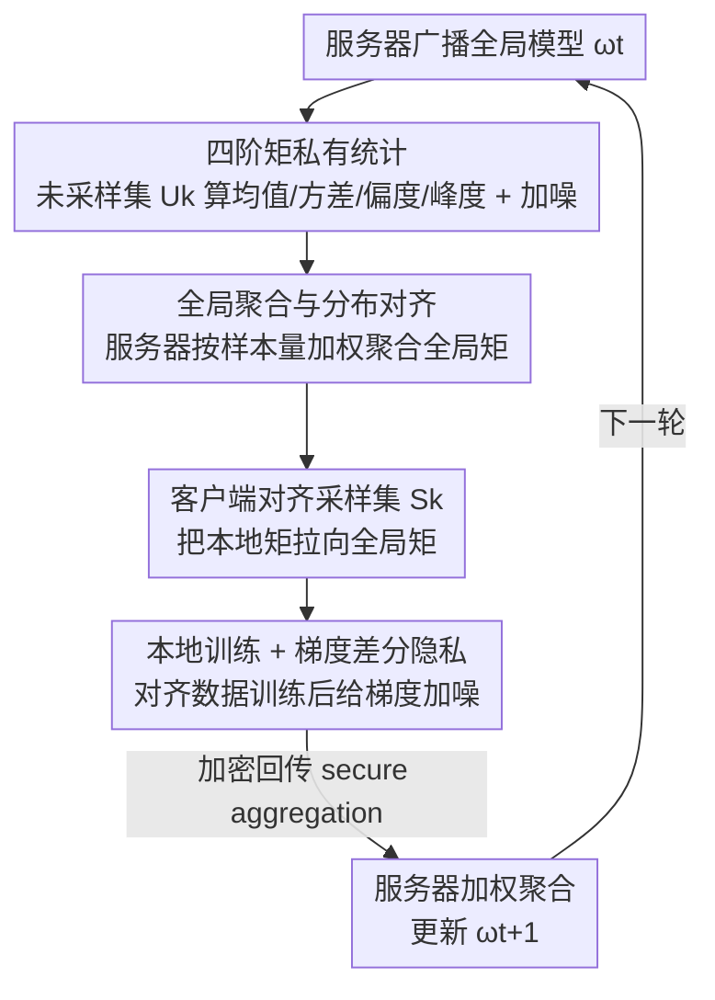

# FedAlign: Differentially Private Distribution Alignment for Non-IID Federated Learning

**会议**: CVPR 2026  
**论文**: [CVF Open Access](https://openaccess.thecvf.com/content/CVPR2026/html/Wu_FedAlign_Differentially_Private_Distribution_Alignment_for_Non-IID_Federated_Learning_CVPR_2026_paper.html)  
**代码**: 未公开  
**领域**: 联邦学习 / 优化  
**关键词**: 联邦学习, Non-IID, 差分隐私, 分布对齐, 统计矩  

## 一句话总结
FedAlign 让每个客户端把本地数据的前四阶统计矩（均值、方差、偏度、峰度）加噪上传，服务器聚合成全局参考分布再广播回去，客户端据此对齐本地采样数据的分布——在差分隐私约束下同时缓解 Non-IID 异质性和隐私泄露，CIFAR-10 上比最强基线再涨约 4%。

## 研究背景与动机
**领域现状**：联邦学习（FL）让多个客户端在不共享原始数据的前提下协作训练全局模型，标准做法是 FedAvg 按样本量加权聚合本地更新。

**现有痛点**：现实中客户端数据通常是 Non-IID 的，论文把异质性拆成三类——标签偏斜（label skew）、数量偏斜（quantity skew）、特征偏斜（feature skew）。这些偏斜让本地模型各自漂离全局最优，导致收敛慢、优化方差大、最终精度低。更隐蔽的是，异质性还会**放大隐私风险**：分布越不同，客户端梯度越"独特"，越容易被模型反演、成员推断、梯度泄露等攻击还原出信息。

**核心矛盾**：异质性损害收敛、Non-IID 又加剧隐私泄露，两个问题是耦合的；而现有的差分隐私 FL（DP-FL）通过给梯度注噪来防泄露，却进一步在隐私、效用、收敛速度之间陷入三难权衡。已有的异质性优化方法（FedProx、SCAFFOLD、FedNova、FedRDN 等）大多**缺少理论刻画**：到底客户端分布差异是怎么影响全局收敛的，说不清楚。

**本文目标**：在 client-level 差分隐私约束下，同时（1）缓解 Non-IID 对收敛的伤害、（2）给出"分布差异↔收敛"的定量理论。

**切入角度**：作者把数据异质性归结为**统计矩的差异**——既然 Non-IID 本质是各客户端分布不一致，那就直接在统计矩层面把本地分布"拉向"一个全局参考分布，且这个对齐过程只交换加噪后的统计量，从不碰原始数据。

**核心 idea**：用"加噪统计矩对齐"代替"共享数据/表示"来抹平客户端分布差异——客户端上传扰动后的均值/方差/偏度/峰度，服务器聚合出全局矩，客户端据此对齐本地数据，从而在保隐私的同时加速收敛。

## 方法详解

### 整体框架
FedAlign 在每个通信轮里跑一条"广播模型 → 私有统计 → 聚合对齐 → 训练上传"的流水线。关键的巧思是客户端把本地数据切成两份：**未采样集 $U_k$** 专门用来估计本地分布的统计矩（加噪后上传），**采样集 $S_k$** 才真正参与本轮训练，但训练前先按全局矩对齐。这样既保证了对齐方向来自"全局视角"，又让隐私噪声只加在统计量和梯度上，不污染训练数据本身。整个框架由四个模块串成：服务器广播全局模型 → 客户端在未采样集上算四阶矩并加噪上传 → 服务器加权聚合成全局矩并广播 → 客户端对齐采样集后本地训练、再给梯度加噪回传聚合。

### 关键设计

**1. 四阶矩私有统计：用"未采样集"估分布、采样集做训练**

针对的痛点是——要对齐分布就得知道每个客户端的分布长什么样，但直接交换数据/表示会泄露隐私。FedAlign 让每个客户端 $k$ 把本地数据切成采样集 $S_k$（参与训练）和未采样集 $U_k$（仅用于估分布），在 $U_k$ 上计算前四阶统计矩：均值 $\mu_k$、方差 $\sigma_k^2$、偏度 $s_k$、峰度 $\kappa_k$，其中

$$\mu_k = \frac{1}{|U_k|}\sum_{x_i\in U_k} x_i,\qquad \sigma_k^2 = \frac{1}{|U_k|}\sum_{x_i\in U_k}(x_i-\mu_k)^2$$

$$s_k = \frac{1}{|U_k|}\sum_{x_i\in U_k}\frac{(x_i-\mu_k)^3}{\sigma_k^3},\qquad \kappa_k = \frac{1}{|U_k|}\sum_{x_i\in U_k}\frac{(x_i-\mu_k)^4}{\sigma_k^4}$$

四个矩各有分工：均值反映亮度/色彩强度等中心偏置，方差刻画离散度，偏度描述分布的非对称性，峰度描述尖峰/重尾。用一个独立子集（$U_k$）来估分布、而不是用训练集本身，避免了"既拿来训练又拿来上报统计"带来的额外隐私敏感度耦合。

**2. 全局聚合与分布对齐：把本地数据拉向"理想全局分布"**

光有本地矩还不够，要让所有客户端朝同一个方向收敛，就需要一个全局参考。服务器收到各客户端的加噪统计量后，按样本量 $n_k/N$（$N=\sum_k n_k$）加权聚合出全局矩：

$$\bar\mu = \sum_{k=1}^{K}\frac{n_k}{N}\tilde\mu_k,\quad \bar\sigma^2 = \sum_{k=1}^{K}\frac{n_k}{N}\tilde\sigma_k^2,\quad \bar s = \sum_{k=1}^{K}\frac{n_k}{N}\tilde s_k,\quad \bar\kappa = \sum_{k=1}^{K}\frac{n_k}{N}\tilde\kappa_k$$

作者把这组全局矩视为当前 Non-IID 场景下的"理想最优分布"——类似一种全局信息驱动的数据增广目标。服务器把 $\{\bar\mu,\bar\sigma^2,\bar s,\bar\kappa\}$ 广播回去，每个客户端再把采样集 $S_k$ 的统计矩**对齐**到全局矩：$S_k' = \text{Align}(S_k;\ \mu_g,\sigma_g^2,\gamma_g,\kappa_g)$，对齐后的数据才用于本地训练。⚠️ 论文只说"通过调整均值和方差来对齐"（all experiments align means and variances），没有给出 $\text{Align}(\cdot)$ 的显式变换公式；从描述看应是矩匹配式的线性重标定（把 $S_k$ 标准化后按全局均值/方差重新缩放平移），具体实现以原文/附录为准。消融也证实——均值和方差主导了"期望梯度偏置"和客户端漂移，是对齐的主力；偏度、峰度只起次要的尾部/非对称性修正。

**3. 双层差分隐私：统计量与梯度各加一次高斯噪声**

只要有信息出客户端就有泄露风险，而 FedAlign 出客户端的有两样东西——统计矩和梯度，所以两处都要保护。统计矩在上传前先裁剪（clip 到 $S_{stat}$）再加高斯噪声以满足 $(\varepsilon,\delta)$-DP：

$$\tilde\mu_k = \mu_k + \mathcal{N}(0,\sigma_{dp}^2),\quad \tilde\sigma_k^2 = \sigma_k^2 + \mathcal{N}(0,\sigma_{dp}^2)\ \ (\text{偏度、峰度同理})$$

本地训练完成后，梯度也先裁剪界定敏感度、再加噪：$\tilde g_k^t = g_k^t + \mathcal{N}(0,\sigma^2 I)$，最后通过 secure aggregation 加密回传。服务器全程只看到加噪统计量和加噪梯度，碰不到原始数据，也碰不到未扰动的梯度。这种"统计+梯度"双层注噪是 FedAlign 与只在梯度上做 DP 的 DP-FL（如 Fed-SMP、McMahan 等）的本质区别——分布对齐这条新增的信息通道必须自己也配 DP。

**4. 统计差异↔收敛界的理论桥梁：把"对齐"和"收敛"定量挂钩**

这是论文区别于一众经验性异质性方法的地方——它没停在"对齐有用"，而是证明了对齐为什么能加速收敛。Theorem 1 把客户端梯度与全局 DP 梯度的期望平方距离分解为五项：期望梯度偏置、本地方差、跨客户端协方差、全局协方差结构、DP 噪声方差。然后四个 Proposition 分别量化四阶矩的影响：均值差 $\Delta_{\mu,k}=\|\mu_k-\mu\|^2$ 上界住梯度偏置（$\|g_k-g\|^2\le\|H(w)\|_F^2\cdot\Delta_{\mu,k}$）；方差影响梯度方差；偏度满足 $\|g_k^{DP}-g^{DP}\|^2\propto|\gamma_k-\bar\gamma|^2$；峰度通过 $\big(1+\frac{\kappa_k-3}{4}\big)$ 因子调制梯度方差。最终 Theorem 2 给出非凸 $L$-smooth 下的收敛界：

$$\frac{1}{T}\sum_{t=0}^{T-1}\mathbb{E}\big[\|\nabla F(w_t)\|^2\big] \le \frac{2\Delta F}{\eta T} + \eta L\big(\sigma_{\min}^2 + \Gamma_{stat} + \sigma_{DP}^2\big)$$

其中统计差异项 $\Gamma_{stat}$ 由四阶矩的客户端间偏差加权构成，DP 噪声方差 $\sigma_{DP}^2 = 8C^2\log(1.25/\delta)/\varepsilon^2$ 与隐私预算挂钩。这个界直白地说明：把 $\Gamma_{stat}$（即矩差异）压小，收敛上界就降——于是"对齐统计矩"就直接等价于"收紧收敛界"，理论和方法闭环。

### 损失函数 / 训练策略
本地用标准 SGD：$w_{k,e+1}^t = w_{k,e}^t - \eta_l\nabla f_k(w_{k,e}^t; S_k')$ 跑 $\tau$ 个本地 epoch，本地梯度取 $g_k^t = (w^t - w_{k,\tau}^t)/(\eta_l\tau)$；全局更新 $w_{t+1} = w_t - \eta\sum_{k\in W_t}\frac{n_k}{N}\tilde\Delta_k^t$。关键超参是统计噪声尺度 $\sigma_{stat}$、梯度噪声尺度 $\sigma_{grad}$、裁剪阈值 $S_{stat}/C$，以及消融重点考察的"全局未采样数据比例" $\rho$。

## 实验关键数据

### 主实验
数据集 CIFAR-10 / MNIST，架构 CNN 与 ResNet50，Non-IID 用 Dirichlet $\alpha=0.5$ 划分 + 高斯噪声 $\mathcal{N}(0,\beta)$ 模拟特征偏斜。基线含 FedAvg、FedProx、SCAFFOLD、FedNova、FedRDN。

| Non-IID 设置 | 方法 | CIFAR-10 (%) | MNIST (%) |
|--------------|------|------|------|
| $\alpha=0.5,\ \beta=0.05$ | FedAvg | 49.1 | 99.13 |
| | FedProx | 51.1 | 99.08 |
| | SCAFFOLD | 49.6 | 99.22 |
| | FedNova | 52.4 | 99.04 |
| | FedRDN | 52.8 | 98.92 |
| | **FedAlign** | **54.9** | **99.26** |
| $\alpha=0.5,\ \beta=0.1$ | FedAvg | 50.7 | 99.02 |
| | FedProx | 50.5 | 99.05 |
| | SCAFFOLD | 48.1 | 99.12 |
| | FedNova | 49.0 | 99.08 |
| | FedRDN | 49.8 | 98.94 |
| | **FedAlign** | **54.3** | **99.12** |

在 $\beta=0.05$ 下 FedAlign 的 CIFAR-10 精度比 FedAvg/FedProx/SCAFFOLD/FedNova/FedRDN 分别相对提升 11.9% / 7.5% / 10.7% / 4.8% / 3.9%；噪声加大到 $\beta=0.1$ 时基线普遍掉点（SCAFFOLD 跌到 48.1%），FedAlign 仍守住 54.3%，鲁棒性优势更明显。ResNet50 上结论一致。

### 消融实验
| 配置 | 现象 | 说明 |
|------|------|------|
| 未采样数据比例 $\rho$ | $\rho$ 越大精度越高、收敛越稳 | 用全量 $U_k$ 比只用 40% 在 100 轮时高约 **16%** 精度 |
| 仅对齐均值 | 有效但不足 | 均值主导梯度偏置 |
| 仅对齐方差 | 有效但不足 | 方差影响梯度方差 |
| 对齐均值+方差 | 提升显著 | 二者共同主导漂移，是对齐主力 |
| 对齐全部四阶矩 | 最优 | 高阶矩再修正尾部/非对称，进一步压低矩差异 |

### 关键发现
- **均值+方差是对齐的主力**：消融显示一二阶矩决定了期望梯度偏置和客户端间漂移，偏度/峰度只做次要的尾部与非对称修正——这与理论里 $\Gamma_{stat}$ 中各矩的权重一致。
- **全局统计估得越准越好**：$\rho$ 越大，聚合出的全局矩越接近真实分布，对齐指引越强，100 轮时全量 vs 40% 相差约 16% 精度——说明 FedAlign 的收益直接来自"全局参考分布的估计质量"。
- **噪声越大优势越突出**：$\beta$ 从 0.05 到 0.1 时多数基线掉点，FedAlign 几乎不掉，说明矩对齐对特征偏斜的鲁棒性强于单纯的更新校正（SCAFFOLD/FedNova）。

## 亮点与洞察
- **"未采样集估分布、采样集做训练"的切分很巧**：用一个独立子集来上报统计矩，既给对齐提供了分布信息，又把统计上报和训练数据解耦，降低了隐私敏感度的纠缠——这个 sampled/unsampled 切分思路可迁移到任何"既要训练又要上报本地统计"的联邦场景。
- **把异质性彻底统计矩化**：作者没把 Non-IID 当成黑盒，而是用四阶矩把它量化，再用 Theorem 1/2 把"矩差异"和"收敛界"显式挂钩，让"对齐统计矩 = 收紧收敛上界"成为可证命题——这是它比 FedProx/SCAFFOLD 等经验方法更扎实的地方。
- **对齐这条新通道自带 DP**：很多方法引入"共享统计/表示"来缓解 Non-IID 却忽略它本身就是泄露口，FedAlign 在统计量和梯度上各加一层高斯噪声，提醒做隐私 FL 时任何出客户端的量都要纳入隐私预算。

## 局限与展望
- **对齐变换 $\text{Align}(\cdot)$ 未给显式公式**：⚠️ 正文只说"调整均值和方差"，没写出具体的重标定/匹配公式，复现需查附录；偏度、峰度怎么对齐尤其语焉不详。
- **数据规模偏小**：实验只在 CIFAR-10 / MNIST 上，CIFAR-10 绝对精度仅约 55%（CNN），没有 CIFAR-100、Tiny-ImageNet 等更难任务，也没报告大模型/大规模客户端下的表现。
- **隐私-效用曲线不完整**：正文给了 $\sigma_{DP}^2$ 与 $(\varepsilon,\delta)$ 的关系，但主表没系统扫不同 $\varepsilon$ 下的精度退化曲线，难判断在严格隐私预算下对齐收益还剩多少。
- **特征偏斜用高斯噪声模拟**：用 $\mathcal{N}(0,\beta)$ 注噪来制造 feature skew 偏理想化，真实跨域/跨设备的特征偏移是否同样能被低阶矩对齐覆盖，存疑。

## 相关工作与启发
- **vs FedProx / SCAFFOLD**：它们在**更新/梯度**层面纠偏（近端项约束、控制变量校正方向），FedAlign 在**数据分布**层面对齐（训练前就把本地数据矩拉向全局），并额外给出收敛界的统计矩刻画——属于在更前端动手且有理论支撑。
- **vs FedRDN / FedMix（数据增广派）**：FedRDN 随机注入其他客户端统计、FedMix 共享平均表示来增多样性，但大多只用有限统计、未充分处理客户端间漂移；FedAlign 用全局聚合的四阶矩做有方向的对齐，且每个统计量都过 DP，隐私更严谨。
- **vs Fed-SMP / McMahan DP-FL**：它们只在梯度/更新上做 DP，且在 Non-IID + 深网络下精度明显下降、缺收敛分析；FedAlign 把 DP 扩到统计通道，并补上了 Non-IID 下的收敛界，正面回应了已有 DP-FL"忽略异质性、缺收敛分析"的缺口。

## 评分
- 新颖性: ⭐⭐⭐⭐ 把 Non-IID 异质性用四阶矩量化并在 DP 下做分布对齐、还配上收敛界理论，角度清晰
- 实验充分度: ⭐⭐⭐ 仅 CIFAR-10/MNIST，缺更难数据集与隐私预算扫描，规模偏小
- 写作质量: ⭐⭐⭐⭐ 理论推导层层递进，但对齐变换的关键实现细节交代不足
- 价值: ⭐⭐⭐⭐ "统计矩对齐 + 双层 DP + 收敛界"是一套可迁移、可证明的联邦异质性思路

<!-- RELATED:START -->

## 相关论文

- [\[CVPR 2026\] DP-FedAdamW: An Efficient Optimizer for Differentially Private Federated Large Models](dp-fedadamw_an_efficient_optimizer_for_differentially_private_federated_large_mo.md)
- [\[CVPR 2026\] Fed-ADE: Adaptive Learning Rate for Federated Post-adaptation under Distribution Shift](fed-ade_adaptive_learning_rate_for_federated_post-adaptation_under_distribution_.md)
- [\[CVPR 2026\] Domain Sensitive Federated Learning with Fisher-Informed Pruning](domain_sensitive_federated_learning_with_fisher-informed_pruning.md)
- [\[CVPR 2026\] FedRG: Unleashing the Representation Geometry for Federated Learning with Noisy Clients](fedrg_unleashing_the_representation_geometry_for_federated_learning_with_noisy_c.md)
- [\[CVPR 2026\] FedRAC: Rolling Submodel Allocation for Collaborative Fairness in Federated Learning](fedrac_rolling_submodel_allocation_for_collaborative_fairness_in_federated_learn.md)

<!-- RELATED:END -->
