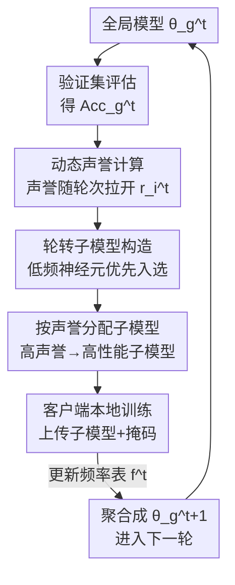

# FedRAC: Rolling Submodel Allocation for Collaborative Fairness in Federated Learning

**会议**: CVPR 2026  
**论文**: [CVF Open Access](https://openaccess.thecvf.com/content/CVPR2026/html/Wang_FedRAC_Rolling_Submodel_Allocation_for_Collaborative_Fairness_in_Federated_Learning_CVPR_2026_paper.html)  
**代码**: https://github.com/ZiHuiWangpcl1/FedRAC  
**领域**: 联邦学习 / 协作公平性  
**关键词**: 联邦学习, 协作公平性, 子模型分配, 动态声誉, 神经元均衡训练

## 一句话总结
FedRAC 通过"随训练进程动态拉开的声誉计算"+"按历史频率轮转构造子模型再按声誉分配"两个模块，既让贡献高的客户端拿到更好的子模型（公平），又保证全局模型每个神经元被均匀训练（不掉精度），在公平性和准确率上同时超过现有协作公平方法。

## 研究背景与动机

**领域现状**：联邦学习（FL）让多个客户端在不共享原始数据的前提下协同训练一个全局模型。但现实中各客户端贡献不均——数据规模和质量差异很大。为了激励高贡献客户端长期参与，"协作公平性"（Collaborative Fairness, CF）成为 FL 的关键诉求：要让客户端拿到的奖励（模型质量）与它的贡献成正比。现有 CF 方法分两类——梯度类（按声誉比例分配聚合梯度）和子模型类（按声誉把"含重要神经元的子模型"分给客户端）。

**现有痛点**：作者指出现有方法在追求公平的同时牺牲了全局模型精度，根因有三个。其一，**声誉计算阶段用固定比例**：现有方法在整个训练过程中给客户端分配固定的声誉占比，忽略了全局模型性能是逐渐变好的——训练早期模型本身就差，此时若死守固定比例就会让低贡献客户端在早期奖励不足、训练不充分，最终拖垮聚合模型。其二，**梯度类导致模型间不一致**（inter-model）：客户端互相交换的梯度未必匹配彼此需求，导致各客户端本地模型 $\theta_1^t,\theta_2^t,\theta_3^t$ 大幅发散，实际拿到的奖励和期望的对不上。其三，**子模型类导致模型内不一致**（intra-model）：按神经元重要性分配会让不同神经元的训练频率严重不均，一些神经元（图中的 b、c、d、e）训练次数过少。

**核心矛盾**：公平（让高贡献者拿更好的模型，势必让某些客户端只训练部分参数）和精度（全局模型每个神经元都要被充分训练）之间存在张力。现有方法要么牺牲早期低贡献者、要么造成训练频率/方向不一致，都以掉精度为代价换公平。

**本文目标与切入角度**：作者要在"不牺牲全局模型精度"的前提下实现 CF。切入点是两个观察：(1) 声誉不该是静态的，而应**随训练动态演化**——早期客户端之间声誉差距应小（让弱者也能受训），后期再逐渐拉开；(2) 子模型分配不该只看神经元重要性，而应**按神经元历史被分配的频率轮转**，让所有神经元被均匀训练。

**核心 idea**：用"动态声誉 + 按频率轮转的子模型分配"替代"固定比例 + 按重要性分配"，在保证全局模型每个神经元均匀受训的前提下，把高性能子模型分给高声誉客户端。

## 方法详解

### 整体框架

FedRAC 是一个服务器-客户端的 FL 框架，每一轮做两件事：先在服务器上算出每个客户端的**动态声誉** $r_i^t$，再据此把一组"按神经元频率轮转构造出来的子模型"分配给客户端去本地训练，最后聚合。整体可拆成两个阶段（对应论文 Section 4.1 / 4.2）：

- **阶段一·动态声誉计算**：服务器先用验证集评出当前全局模型性能 $\mathrm{Acc}_g^t$，再用动态声誉函数结合客户端贡献 $c_i$ 算出本轮声誉 $r_i^t$。关键是这个声誉随轮次演化——早期客户端间差距小，后期逐渐拉开。
- **阶段二·轮转子模型分配**：分两小步。**子模型构造**——服务器维护一张神经元历史分配频率表 $f^t$，每轮把"被分配次数最少"的神经元优先排进新子模型，保证所有神经元被分配的次数一致；**子模型分配**——评估这组子模型在验证集上的性能，按声誉把高性能子模型分给高声誉客户端。客户端本地训练后上传子模型和掩码，服务器聚合成下一轮全局模型并更新频率表。

### 关键设计

**1. 动态声誉计算：让低贡献者在早期也能受到充分训练**

针对"固定比例在早期亏待低贡献者"这个痛点，FedRAC 让声誉随训练动态演化。先把贡献 $c_i$ 用指数归一化放大差异：

$$c_i^n = \frac{e^{\beta \cdot c_i}}{\max(e^{\beta \cdot c_i})} \times 100$$

其中 $\beta$ 是超参，用来更显著地区分客户端贡献。然后按贡献和当前全局模型性能 $\mathrm{Acc}_g^t$ 动态算声誉：

$$r_i^t = c_i + (\mathrm{Acc}_g^t - \mathrm{tmp}_i^t)\cdot c_i^n / 100$$

$$\mathrm{tmp}_i^t = \lambda \cdot \mathrm{Acc}_g^t \cdot \Big(1 - \frac{1}{\log(\zeta \cdot t + \kappa)}\Big)$$

这里 $\lambda$ 是超参，$\zeta,\kappa$ 是常数。机制的巧妙之处在 $\mathrm{tmp}_i^t$：它随轮次 $t$ 和全局性能 $\mathrm{Acc}_g^t$ 增长。早期 $t$ 小、$\mathrm{Acc}_g^t$ 低，$(\mathrm{Acc}_g^t-\mathrm{tmp}_i^t)$ 这一项差距小，所以各客户端声誉差距小——低贡献者也能拿到接近高贡献者的奖励，得到充分训练；随轮次推进，低贡献者声誉开始下降，与高贡献者的差距逐渐拉开，直到收敛到固定值。这正好满足 $\Delta r_{AB}^{t_1}:\Delta r_{BC}^{t_1} < \Delta r_{AB}^{t_2}:\Delta r_{BC}^{t_2}$（早期声誉差小、后期拉大）。作者还在 4.3 节给出理论保证（Theorem 1）：声誉高的客户端 $i$ 拿到的子模型 $\theta_i^t$ 离全局模型 $\theta_g^t$ 更近（$\delta_i^t \le \delta_j^t$），从而损失更小，即高贡献→高声誉→更好模型，公平性成立。这一步的早期"低性能时多奖励弱者也不损害最终公平"的洞察，是它和固定比例方法的本质区别。

**2. 轮转子模型构造：用历史频率表保证每个神经元被均匀训练**

针对"子模型类方法导致神经元训练频率不均"这个痛点，FedRAC 借鉴 FedRolex 的滚动选择思想，让服务器维护一张神经元频率表 $f^t \in \mathbb{N}^K$（$K$ 为全局模型神经元数），记录到当前轮为止每个神经元被分配的累计次数，初始全 0：

$$f^0 = [0,0,\dots,0], \qquad \pi^t = \mathrm{argsort}(f^{t-1})$$

$\pi^t$ 是把神经元从"被分配最少"到"最多"排序的排列。构造子模型时优先取频率低的神经元，给客户端 $i$ 定义二值掩码 $m_i^t[j]\in\{0,1\}^K$（$j$ 为该客户端要选的神经元数）：

$$m_i^t[j] = \begin{cases} 1 & j \in \{\pi^t[0],\pi^t[1],\dots,\pi^t[j-1]\} \\ 0 & \text{otherwise} \end{cases}$$

所有子模型构造完后更新频率表 $f^t = f^{t-1} + \sum_{i\in S} m_i^t$，生成下一轮的频率表。这样轮转的好处是：每个神经元都会因为"曾经被分配得少"而在后续轮被优先选入，避免随机/静态抽取造成的参数训练不均衡，保证全局模型架构一致性。这是它能"在分子模型的同时不掉全局精度"的关键——4.4 节据此给出收敛保证（Theorem 2），因为所有神经元被等频训练，每个客户端的子模型可视为全局模型的一个收缩形式 $\theta_i^{t+1}=p_i\theta_g^t$，从而 $\lim_{T\to\infty}\mathbb{E}[F(\bar\theta_T)]-F^*=0$。

**3. 按声誉分配子模型并聚合：把高性能子模型给高贡献客户端**

构造出一组子模型后，要决定"哪个子模型给谁"。FedRAC 先在验证集（从训练样本均匀取 10%）上评估每个子模型的整体性能 $\sum_{i\in S}A_{K_i}^t$。这里有个嵌套约束：激活单元更多的掩码会**严格嵌套**激活单元更少的掩码，掩码 $\sum_{i\in S}m_i^t$ 的大小正比于对应子模型的隐层神经元数。然后按声誉做匹配分配：

$$\theta_i^t = \mathrm{quantity}\big(r_i, \textstyle\sum_{i\in S} A_{K_i}^t\big)$$

即当 $r_i = \sum_{i\in S}A_{K_i}^t$ 时取对应子模型 $\theta_i^t$——声誉越高匹配到性能越高的子模型，于是高贡献客户端拿到更好的模型（公平）。客户端本地训练 $E$ 步后，把子模型 $\theta_i^t$ 和掩码 $m_i^t$ 一起传回服务器，按下式聚合出下一轮全局模型：

$$\theta_g^{t+1} = \frac{\sum_{i\in S}\theta_i^t}{\sum_{i\in S} m_i^t(\theta_i^t,\theta_g^{t-1})}$$

分母用掩码做归一化，保证每个神经元的聚合权重正确。这一设计和设计 1、2 配合：声誉给出"谁该拿更好的"，频率表保证"子模型集合本身覆盖均匀"，分配则把两者落地——既公平又不丢精度。

> ⚠️ 式 (9)(10) 中的 $\mathrm{quantity}(\cdot)$ 函数与聚合分母写法原文表述较抽象，具体实现以原文/开源代码为准。

### 损失函数 / 训练策略

整体优化目标是标准 FL 的加权本地损失之和 $\min_\theta F(\theta) := \sum_{i=1}^N p_i F_i(\theta)$，本地训练用普通 SGD：$\theta_{i,j+1}\leftarrow \theta_{i,j} - \eta_t \nabla F_i(\theta_{i,j})$，学习率 $\eta_t = \frac{2}{\mu(\gamma+t)}$。整套流程见 Algorithm 1：每轮先算归一化贡献 $c_i^n$ 和中间量 $\mathrm{tmp}_i^t$ → 算声誉 $r_i^t$ → 构造掩码 $m_i^t$ 并更新频率表 → 按声誉取子模型 → 各客户端本地训练 $E$ 步 → 服务器聚合。公平性靠的是分配机制而非额外正则项。

## 实验关键数据

实验在 CIFAR-10 / SVHN / EMNIST / Tiny-ImageNet 四个数据集上进行（前三个用两隐层前馈网络，Tiny-ImageNet 用 ResNet18），10 个客户端，构造 POW / CLA / DIR(3.0) / DIR(7.0) 四种异构场景。公平性用 $\gamma = 100\times\rho(c,\theta^*)$（Pearson 相关系数，越大越公平）衡量。

### 主实验

公平性对比（节选 SVHN，$\rho\in[-100,100]$，越高越好）：

| 方法 | SVHN-POW | SVHN-CLA | SVHN-DIR(3.0) | SVHN-DIR(7.0) |
|------|---------|---------|--------------|--------------|
| FedAvg | -22.21 | 87.60 | 36.03 | 39.87 |
| CFFL | 93.14 | 97.46 | 44.84 | 85.54 |
| IAFL | 98.90 | 99.55 | 97.16 | 85.28 |
| FedSAC | 97.18 | 97.21 | 95.75 | 96.47 |
| **FedRAC** | **99.85** | **99.89** | **98.00** | **98.99** |

准确率对比（节选，最大测试准确率 %）：

| 方法 | CIFAR10-POW | CIFAR10-CLA | SVHN-DIR(7.0) | EMNIST-DIR(7.0) |
|------|------------|------------|--------------|----------------|
| FedAvg | 49.10 | 42.66 | 81.77 | 83.01 |
| IAFL | 47.65 | 43.07 | 82.15 | 82.39 |
| FedSAC | 48.63 | 43.07 | 80.39 | 81.37 |
| **FedRAC** | **49.37** | **44.28** | **82.43** | **84.00** |

此外作者用 **rate** 指标（满足 BCF 边界的客户端比例）衡量公平：FedRAC 在所有场景下 rate 均 ≥0.97，SVHN-POW/CLA 等场景达到满分 1.0，而 FedAvg 在多个场景只有 0.1。

### 消融实验

在 SVHN 上去掉两个模块（w/o reputation = 声誉固定不变；w/o allocation = 改为随机构造子模型）：

| 配置 | 公平性(DIR7.0) | 准确率(POW) | 准确率(DIR7.0) | rate(POW) |
|------|--------------|------------|---------------|-----------|
| w/o reputation | 97.01 | 73.42 | 70.56 | 1.00 |
| w/o allocation | 91.58 | 70.81 | 76.62 | 0.20 |
| **FedRAC (Full)** | **98.99** | **79.18** | **82.43** | **1.00** |

### 关键发现

- **动态声誉模块对精度影响显著**：去掉它后 SVHN-DIR(7.0) 准确率从 82.43% 掉到 70.56%（-11.87 个百分点），说明"早期不亏待低贡献者"对全局模型质量至关重要。
- **轮转分配模块对公平/稳定性贡献最大**：去掉它（改随机构造子模型）后 SVHN-POW 准确率从 79.18% 掉到 70.81%，rate 从 1.00 暴跌到 0.20——说明神经元被均匀训练是公平落地的根基。
- **DIR 场景优势最明显**：在数据分布最不均衡的 Dirichlet 划分下，FedRAC 相对 baseline 的公平性领先幅度最大（如 SVHN-DIR(3.0) 公平 98.00 vs IAFL 97.16、FedAvg 36.03）。

## 亮点与洞察

- **"早期模型差时多奖励弱者不损害最终公平"是核心洞察**：把声誉从静态变成随全局性能演化的量，用 $\mathrm{tmp}_i^t$ 的对数增长项实现"早期差距小、后期拉开"，既保证了弱客户端被充分训练，又不破坏最终公平排序——这个时间维度的设计很巧妙。
- **用历史频率表做轮转，把"公平分子模型"和"全局模型不掉精度"解耦**：频率表保证每个神经元被等频训练（解决精度），声誉决定谁拿性能更高的子模型（解决公平），两个目标互不打架。这种"按使用频率轮转"的思路可迁移到任何"部分参数分配"场景（如模型并行、MoE 专家调度）。
- **公平有理论背书**：α-BCF 定义 + Theorem 1（高声誉→更近全局模型→损失更小）+ Theorem 2（等频训练→收敛保证），让"公平"和"收敛"都不只是经验观察。

## 局限与展望

- 作者承认目前只验证了小模型（两隐层网络 / ResNet18），未来要探索 FedRAC 在大规模模型上的潜力（大模型下子模型构造和频率表维护的开销可能上升）。
- ⚠️ 实验都是 10 个客户端的小规模设置，客户端数量更多、掉线/异步等真实联邦场景下的表现未验证。
- 声誉计算依赖一个干净的服务器端验证集（从训练样本取 10%），现实中服务器是否有这样代表性的验证数据是个前提假设。
- $\beta,\lambda,\zeta,\kappa$ 多个超参靠网格搜索调，对新数据集的迁移成本和敏感性需要关注（论文把敏感性分析放在附录）。

## 相关工作与启发

- **vs FedSAC（子模型类 CF 的前作）**：FedSAC 同样把子模型作为奖励分给客户端、避免梯度分配的冲突，但它声誉静态、且按神经元重要性分配会造成神经元训练频率不均（intra-model 不一致）。FedRAC 改成动态声誉 + 按历史频率轮转构造，正面解决了 FedSAC 遗留的频率不均问题，公平和精度都更高。
- **vs 梯度类方法（CFFL / CGSV / FedAVE / IAFL）**：这类方法按声誉分配聚合梯度，但交换的梯度未必匹配各客户端需求，导致本地模型发散（inter-model 不一致）。FedRAC 用"分子模型"而非"分梯度"绕开了这个问题。
- **vs 模型异构 FL（HeteroFL / FjORD / FedRolex / ScaleFL）**：这些方法的子模型抽取是为了适配客户端算力/通信限制，不考虑贡献公平。FedRAC 借用了 FedRolex 的滚动抽取思想，但把它和"声誉驱动的公平分配"结合，让轮转既服务于均匀训练、又服务于公平奖励。

## 评分
- 新颖性: ⭐⭐⭐⭐ 把"声誉随训练动态演化"和"按历史频率轮转构造子模型"结合，针对性解决了 CF 方法的早期亏待和频率不均两个具体痛点，思路清晰且有理论支撑。
- 实验充分度: ⭐⭐⭐⭐ 四数据集、四场景、公平/准确率/rate 三指标 + 消融齐全；但客户端规模偏小（仅 10 个），缺大规模/异步场景验证。
- 写作质量: ⭐⭐⭐⭐ 问题图示清晰、公式完整、模块职责分明；个别符号（quantity 函数、聚合分母）表述略抽象。
- 价值: ⭐⭐⭐⭐ 在不牺牲精度的前提下实现协作公平，对激励真实联邦系统的长期参与有实用价值，轮转分配思路可迁移。

<!-- RELATED:START -->

## 相关论文

- [\[ICLR 2026\] Personalized Collaborative Learning with Affinity-Based Variance Reduction](../../ICLR2026/optimization/personalized_collaborative_learning_with_affinity-based_variance_reduction.md)
- [\[CVPR 2026\] Domain Sensitive Federated Learning with Fisher-Informed Pruning](domain_sensitive_federated_learning_with_fisher-informed_pruning.md)
- [\[CVPR 2026\] FedRG: Unleashing the Representation Geometry for Federated Learning with Noisy Clients](fedrg_unleashing_the_representation_geometry_for_federated_learning_with_noisy_c.md)
- [\[CVPR 2026\] FedAlign: Differentially Private Distribution Alignment for Non-IID Federated Learning](fedalign_differentially_private_distribution_alignment_for_non-iid_federated_lea.md)
- [\[CVPR 2026\] Generalized and Personalized Federated Learning with Black-Box Foundation Models via Orthogonal Transformations](generalized_and_personalized_federated_learning_with_black-box_foundation_models.md)

<!-- RELATED:END -->
