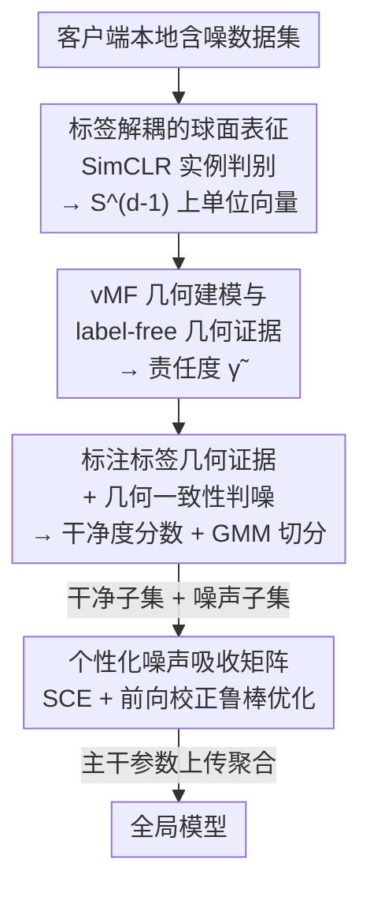

# FedRG: Unleashing the Representation Geometry for Federated Learning with Noisy Clients

**会议**: CVPR 2026  
**论文**: [CVF Open Access](https://openaccess.thecvf.com/content/CVPR2026/html/Wen_FedRG_Unleashing_the_Representation_Geometry_for_Federated_Learning_with_Noisy_CVPR_2026_paper.html)  
**代码**: https://github.com/Tianjoker/FedRG  
**领域**: 联邦学习 / 噪声标签学习  
**关键词**: 联邦学习, 噪声标签, 表征几何, vMF混合模型, 数据异质性  

## 一句话总结
针对联邦学习里"客户端标注有噪声 + 数据非独立同分布"的双重难题，FedRG 抛弃了不可靠的 small-loss 启发式，改从**表征几何**判断样本干净与否——先用自监督在超球面上学出与标签无关的表征，再用 vMF 混合模型把"几何证据"和"标注标签证据"在同一空间里做一致性比对来挑出噪声样本，最后用个性化噪声吸收矩阵做鲁棒优化，在多个数据集和四种噪声场景下都拿到 SOTA。

## 研究背景与动机
**领域现状**：联邦学习（FL）让多客户端在不共享原始数据的前提下协同训练，但真实部署中标注往往不完美——众包/弱监督导致客户端本地数据里混入噪声标签。现有"抗噪 FL"方法（FedCorr、FedNoRo、FedClean 等）几乎都沿用集中式噪声学习的经典直觉：**用样本 loss 值大小来区分干净/噪声样本**（small-loss heuristic），loss 大的判为噪声。

**现有痛点**：作者抛出 Question 1——在异质（Non-IID）的 FL 场景里，loss 值还可靠吗？答案是不可靠。FL 的一个主要异质性是 label skew，本地数据呈长尾分布，模型会偏向多数类，导致**尾部类的正确样本天然 loss 偏高**，于是被误判为噪声（高 FN）；同时深度模型最终会记住错标样本、把它们的 loss 压低，反而被当成干净样本留下。标量 loss 把"错标"、"稀有但正确"、"域偏移"三件事混为一谈，在异质场景彻底失灵。

**核心矛盾**：噪声判别需要一个**不被标签污染、也不被类别不平衡带偏**的信号，而 loss 恰恰是建立在（可能有噪的）标签和有偏分类器之上的预测空间产物。

**本文目标**：(1) 找到一个比 loss 更鲁棒的"样本干净度"判据；(2) 在判出噪声后，把噪声样本的监督信号利用起来而不是简单丢弃。

**切入角度**：作者把视线从预测空间转向**表征空间**，提出"表征几何优先（representation geometry priority）"原则——一个干净样本的**内在表征聚类（与标签无关）**应当和它**标注标签所暗示的聚类模式一致**；错标样本则会表现出几何上的不一致。这个信号天生不依赖标签，也就绕开了 loss 的两大陷阱。

**核心 idea**：用自监督在超球面上学出 label-free 表征，再用 vMF 混合模型把"几何证据"与"标注标签证据"投影到同一组语义簇空间，**通过两者的分布一致性（而非 loss）来识别噪声**。

## 方法详解

### 整体框架
FedRG 是一个两阶段（Stage I / Stage II）的联邦训练框架，每个客户端本地完成"学表征 → 判噪声 → 鲁棒优化"，只有主干模型参数上传服务器聚合，而 vMF 状态与类-几何映射矩阵 $\mathbf{B}$ 始终留在本地以保留个性化噪声特征。

- **Stage I（标签解耦的球面表征）**：用 SimCLR 实例判别做联邦预训练，把每个样本编码成超球面 $\mathbb{S}^{d-1}$ 上的单位向量，得到一个**完全不看标签**的几何底座。
- **Stage II（表征几何优先的噪声识别 + 鲁棒优化）**：在球面上拟合 vMF 混合模型抽取语义簇 → 算出每个样本的"label-free 几何证据" $\tilde{\gamma}$ → 用（含噪）标签统计出"类-几何证据" $\mathbf{B}$ → 两者做内积得到几何干净度分数 → 用 GMM 把本地样本切成干净子集 $D_k^c$ 与噪声子集 $D_k^n$ → 最后对干净样本用 SCE 损失、对噪声样本用个性化噪声吸收矩阵做前向校正，联合优化主干模型。

### 关键设计

**1. 标签解耦的球面表征：先造一个不被标签污染的几何底座**

噪声识别要可靠，前提是判据本身不能建立在（可能有噪的）标签上。作者在 Stage I 用 SimCLR 实例判别做联邦预训练：每个样本经两次随机增广，编码并归一化为超球面上的 $z=\frac{f_\theta(x)}{\|f_\theta(x)\|}\in\mathbb{S}^{d-1}$，用对称 NT-Xent（InfoNCE）目标优化：

$$\mathcal{L}_{\text{SimCLR}}=\frac{1}{2b}\sum_{i=1}^{2b}-\log\frac{\exp(z_i^\top z_{i^+}/\tau)}{\sum_{a\neq i}\exp(z_i^\top z_a/\tau)}$$

这个目标只用"同一样本的两个视图互为正对"，**完全不碰标注标签**，因此得到的几何结构不会被噪声标签带偏。它在球面上促成"对齐 + 均匀"：语义相近的样本聚成方向性集中的簇，方向结构弱的样本得到更分散的几何证据——这恰好为后面用 vMF 建模、用"是否落在某个语义簇里"判干净度提供了天然契合的底座。这一步是整个"表征几何优先"原则能落地的关键前提。

**2. vMF 混合的几何建模与 label-free 几何证据：把"落在哪个语义簇"量化成软证据**

有了球面表征，需要一个尊重方向性几何的概率模型来刻画语义簇。作者选 von Mises–Fisher（vMF）分布——它定义在单位超球面上，能从"绕某个均值方向尖锐集中"平滑过渡到"无方向偏好的均匀分布"。把归一化表征建模为 vMF 混合 + 一个均匀背景分量：

$$p(z)=\pi_0\,U(z)+\sum_{g=1}^{G}\pi_g\,\mathrm{vMF}(z\mid\mu_g,\kappa_g)$$

其中每个 vMF 分量 $g$ 对应一个**与标签无关的语义簇**（可能把一个类细分成子模式，也可能跨类捕捉共同纹理），均匀分量 $U(z)$ 专门吸收不对齐任何语义模式的几何离群点。对每个样本算它属于簇 $g$ 的后验责任度 $\gamma_{i,g}=\frac{\pi_g p_g(z_i)}{\sum_h \pi_h p_h(z_i)}$。再用多视图一致性细化：同一样本两次增广得 $z_{i,1},z_{i,2}$，其一致性映射成一个 precision-like 的回火因子 $r_i$，对一致性低的样本**抚平责任度**、对对齐好的样本**保持锐利分配**，得到细化责任度 $\tilde{\gamma}_{i,g}$。这组 $\tilde{\Gamma}_i=\{\tilde{\gamma}_{i,1},\dots,\tilde{\gamma}_{i,G}\}$ 就是 label-free 几何证据——它只回答"这个样本在几何上像哪些语义簇"，全程不看标签。

**3. 标注标签几何证据 + 几何一致性判噪：在同一空间里比对两类证据**

光有几何证据还不够，得把（含噪的）标注标签拉进**同一组语义簇空间**才能比对。作者把 label-free 语义簇当作稳定参照，统计每个类 $c$ 的标注样本在各语义簇上的分布，用 Dirichlet 平滑（小常数 $\eta>0$）得到类-几何分布：

$$\beta_{c,g}=\frac{\sum_{i:\tilde{y}_i=c}\tilde{\gamma}_{i,g}+\eta}{\sum_{g'=1}^{G}\big(\sum_{i:\tilde{y}_i=c}\tilde{\gamma}_{i,g'}+\eta\big)}$$

注意求和**显式排除均匀背景分量 $g=0$**，避免被几何离群点污染。向量 $\mathbf{B}_c=\{\beta_{c,1},\dots,\beta_{c,G}\}$ 描述"类 $c$ 在语义几何上长什么样"。于是噪声判别变成一个直白的内积——样本 $i$ 的几何干净度分数就是它的几何责任度与其标注类模板的一致性：

$$P_i^{\text{clean}}=\langle\bar{\Gamma}_i,\mathbf{B}_{\tilde{y}_i}\rangle=\sum_{g=1}^{G}\beta_{\tilde{y}_i,g}\,\tilde{\gamma}_{i,g}$$

分数大说明"几何上解释这个样本的簇"和"它标注类常落的簇"对得上，是干净样本；分数小则几何与标签矛盾，疑似错标（背景责任度大也会通过缩小语义质量隐式拉低分数）。接着对 $1-P_i^{\text{clean}}$ 拟合两分量 GMM，把本地样本切成干净子集 $D_k^c$ 和噪声子集 $D_k^n$。整个判噪在每轮通信的 Stage II **本地完成**，vMF 状态和 $\mathbf{B}$ 不上传服务器，从而支持异质 FL 下的个性化噪声判别。

**4. 个性化噪声吸收矩阵 + 鲁棒优化：判出噪声后不丢弃而是"校正利用"**

判出噪声后，作者不是简单丢掉噪声样本，而是为每个客户端引入一个**个性化噪声吸收矩阵** $\mathbf{T}\in\mathbb{R}^{C\times C}$，其中 $T_{c,c'}\approx P(\tilde{y}=c'\mid y^\star=c)$ 估计本客户端的噪声转移概率。$\mathbf{T}$ 实现为接在分类头之后的一个线性层：分类器输出干净标签分布 $p_i$，吸收层通过前向校正 $p_i\mathbf{T}$ 把它映射到观测的含噪标签空间，于是无需让模型直接预测未知真标签。总损失把干净样本的对称交叉熵和噪声样本的前向校正损失加权组合：

$$\mathcal{L}=\lambda_s\mathcal{L}_{\text{SCE}}+\lambda_n\mathcal{L}_n,\qquad \mathcal{L}_n=-\frac{1}{\sum_i m_i^{\text{noisy}}+\epsilon}\sum_{i=1}^{B}m_i^{\text{noisy}}\log[(p_i\mathbf{T})_{\tilde{y}_i}+\epsilon]$$

$\mathcal{L}_{\text{SCE}}$ 是对全部本地样本的对称交叉熵（本身抗噪），$\mathcal{L}_n$ 只对 GMM 判为噪声（$m_i^{\text{noisy}}=1$）的样本生效。关键在于 $\mathbf{T}$ **保持客户端个性化、不跨客户端聚合**——消融显示一旦把它聚合成全局矩阵，性能就掉，因为不同客户端的噪声模式（尤其 localized noise）本就不同。

### 损失函数 / 训练策略
Stage II 中 vMF 模型用**全部本地样本**的软责任度更新以捕捉演化中的特征几何，而类-几何矩阵 $\mathbf{B}$ **只用判为干净的样本**更新；二者随轮次保留在设备上。全局优化目标即上式 $\mathcal{L}=\lambda_s\mathcal{L}_{\text{SCE}}+\lambda_n\mathcal{L}_n$，主干参数按 FedAvg 风格聚合。⚠️ 回火因子 $r_i$ 的具体计算式与 vMF 参数 $(\mu_g,\kappa_g,\pi_g)$ 的更新细节在附录，正文未给完整公式，以原文为准。

## 实验关键数据

### 主实验
数据集 CIFAR-10 / SVHN / CIFAR-100，主干 ResNet-18 / ResNet-34；强非 IID（Dirichlet $\alpha=0.1$，$K=10$ 客户端），噪声率 $\epsilon=0.4$；四种噪声场景 = {对称, pairflip} × {localized, globalized}。对比 8 个代表性 FL 方法 + 6 个抗噪方法。

CIFAR-10 主结果（Accuracy / Precision / F-score，节选）：

| 配置（CIFAR-10） | 指标 | FedRG | 次优方法 | 说明 |
|------|------|------|----------|------|
| 对称-localized | Acc / Prec / F | **59.99 / 70.32 / 55.31** | SymmetricCE 55.01 / FedProx 62.70 / SymmetricCE 49.78 | 三指标基本全面领先 |
| 对称-globalized | Acc / Prec / F | **63.29 / 72.94 / 59.14** | SymmetricCE 59.23 / 64.55 / 54.38 | Acc 大幅领先 |
| pairflip-localized | Acc / Prec / F | **61.52 / 73.01 / 57.09** | MOON 51.68 / FedELC ~ / MOON 48.80 | 优势明显 |
| pairflip-globalized | Acc / Prec / F | **64.88 / 64.88 / 60.98** | FedSAM 59.03 / 64.00 / 54.80 | 综合最佳 |

SVHN / CIFAR-100（globalized 设置，Accuracy 节选）：

| 数据集 | 噪声 | FedRG Acc | 次优 Acc | 备注 |
|--------|------|-----------|----------|------|
| SVHN | 对称 | **62.70** | SymmetricCE 57.82 | F-score 58.83 同样最佳 |
| SVHN | pairflip | **80.62** | FedSAM 75.25 | Acc 80.62 / F 68.83，优势最大 |
| CIFAR-100 | 对称 | 51.95 | SymmetricCE 56.36 | ⚠️ 此格 Acc 不及 SymmetricCE，但作者称其跨 localized 场景不稳定 |
| CIFAR-100 | pairflip | **60.80** | FedELC 41.89 | 大幅领先 |

### 消融实验
原文以雷达图（Fig. 3，CIFAR-10 四种噪声场景）给出消融，去掉任一组件均掉点：

| 配置 | 改动 | 趋势性结论 |
|------|------|-----------|
| Full（FedRG） | 完整模型 | 各场景综合最佳 |
| w/o Noise Absorption Matrix | 去掉前向噪声吸收矩阵 | 噪声样本无法被校正利用，Acc/F 下降 |
| w/o Label Decoupled Spherical Rep. | 去掉 Stage I 的 SimCLR 自监督 | 失去 label-free 几何底座，判噪质量下滑 |
| replace SCE with CE | 把对称交叉熵换成普通 CE | 抗噪能力减弱 |
| w/o Localized Noise Absorption Matrix | 把个性化 $\mathbf{T}$ 跨客户端聚合 | 个性化噪声特征被抹平，性能下降 |

> ⚠️ 雷达图未给逐格数值，上表为定性趋势，具体掉点幅度以原文 Fig. 3 为准。

### 关键发现
- **几何证据比 loss 更可靠**：Fig. 1 显示 loss-based 方法在严重异质下高 FN、低 TP（把大量正确标签误判为噪声），FedRG 用空间几何过滤更稳；这正是其在尾部类、pairflip 等困难场景领先的原因。
- **个性化 > 聚合**：噪声吸收矩阵保持客户端本地（不聚合）是涨点关键，呼应"localized noise 各客户端模式不同"的设定。
- **客户端采样比例敏感性**：选取客户端比例从 0.4→1.0，Acc 从 55.29 升到约 63，说明更多参与客户端有助于几何建模，但 0.8 之后趋于饱和。

## 亮点与洞察
- **范式转换很干净**：把"噪声识别"从预测空间（loss）整体搬到表征空间（几何一致性），一句话点破 small-loss 启发式为何在 Non-IID + 长尾下失效——这是全文最"啊哈"的洞察。
- **两类证据投到同一簇空间做内积**：label-free 责任度 $\tilde{\gamma}$ 与类-几何模板 $\mathbf{B}$ 用同一组 vMF 语义簇做坐标系，判噪退化成一个可解释的内积分数 $\langle\bar{\Gamma},\mathbf{B}\rangle$，既优雅又便于落地。
- **可迁移 trick**：用均匀背景分量吸收几何离群点、用多视图一致性回火责任度，这两招对任何"超球面表征 + 软聚类"的任务（开放集识别、OOD 检测）都能借鉴。
- **判噪不丢样本**：噪声吸收矩阵把判出的噪声样本通过前向校正继续利用，而非简单丢弃，在数据稀缺的客户端尤其划算。

## 局限与展望
- **依赖 Stage I 自监督质量**：整套判据建立在 SimCLR 学出的球面表征上，若客户端数据极少或增广不当，几何底座不稳会连锁影响后续判噪；消融也证实去掉 Stage I 明显掉点。
- **CIFAR-100 上并非全面领先**：globalized 对称噪声下 Acc 不及 SymmetricCE，作者用"跨场景不稳定"解释，但说明在类别多、噪声规则全局共享时，几何簇数 $G$ 的设置与细粒度类的可分性可能成为瓶颈。⚠️ 这是自己读表发现的局限。
- **超参与开销**：vMF 混合分量数 $G$、$\lambda_s/\lambda_n$、温度 $\tau$ 等需调；额外的 vMF 建模与每轮本地 GMM 拟合带来计算开销，正文把成本分析放到附录，正文未量化通信/计算代价。
- **改进方向**：可探索 $G$ 的自适应估计、把几何证据反哺到 Stage I 表征学习形成闭环，或将"表征几何优先"扩展到 noisy + 类不平衡同时存在的更极端联邦场景。

## 相关工作与启发
- **vs FedNoRo / FedCorr / FedClean（small-loss 系）**：它们用 loss 值（GMM/一致性）区分噪声，本文论证该信号在 Non-IID 长尾下不可靠，改用与标签解耦的表征几何证据，故在异质场景更稳。
- **vs MOON（对比表征对齐）**：MOON 也做表征层面的对比学习，但目的是对齐缓解 Non-IID、并不处理噪声标签；FedRG 把对比表征当作判噪的几何底座，目标不同。
- **vs SymmetricCE 等鲁棒损失**：这类方法只改本地训练目标、不显式识别噪声，FedRG 把 SCE 当作鲁棒监督分量之一，并额外加几何判噪 + 个性化吸收矩阵，整体更系统；在多数场景超过单纯换损失的方案。

## 评分
- 新颖性: ⭐⭐⭐⭐⭐ 把噪声判别从 loss 空间换到表征几何空间，"几何优先"原则 + vMF 双证据一致性是真正的范式转换。
- 实验充分度: ⭐⭐⭐⭐ 覆盖 3 数据集 × 4 噪声场景、14 个基线，消融完整；但消融只给雷达图无逐格数值，CIFAR-100 部分场景未夺冠。
- 写作质量: ⭐⭐⭐⭐ 用两个 Question 串起动机、图文清晰；但关键回火因子与 vMF 更新细节下放附录，正文略欠自洽。
- 价值: ⭐⭐⭐⭐ 为联邦抗噪提供了不依赖 loss 的新判据，思路对 OOD/开放集等场景有迁移价值。

<!-- RELATED:START -->

## 相关论文

- [\[CVPR 2026\] Enhancing Visual Representation with Textual Semantics: Textual Semantics-Powered Prototypes for Heterogeneous Federated Learning](enhancing_visual_representation_with_textual_semantics_textual_semantics_powered_p.md)
- [\[ICML 2026\] Learning Locally, Revising Globally: Global Reviser for Federated Learning with Noisy Labels](../../ICML2026/optimization/learning_locally_revising_globally_global_reviser_for_federated_learning_with_no.md)
- [\[CVPR 2026\] Revisiting Learning with Noisy Labels: Active Forgetting and Noise Suppression](revisiting_learning_with_noisy_labels_active_forgetting_and_noise_suppression.md)
- [\[CVPR 2026\] Domain Sensitive Federated Learning with Fisher-Informed Pruning](domain_sensitive_federated_learning_with_fisher-informed_pruning.md)
- [\[CVPR 2026\] From Selection to Scheduling: Federated Geometry-Aware Correction Makes Exemplar Replay Work Better under Continual Dynamic Heterogeneity](from_selection_to_scheduling_federated_geometry-aware_correction_makes_exemplar_.md)

<!-- RELATED:END -->
