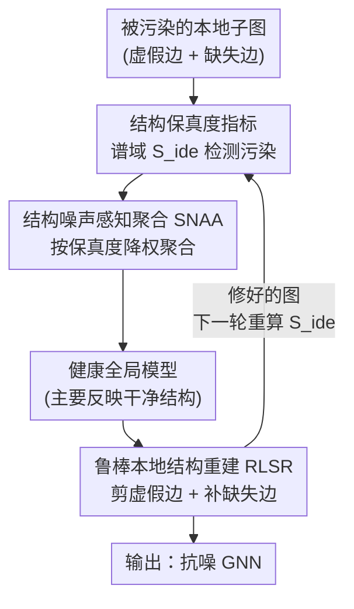

# FedSDR: Federated Graph Learning with Structural Noise Detection and Reconstruction

**会议**: CVPR 2026  
**论文**: [CVF Open Access](https://openaccess.thecvf.com/content/CVPR2026/html/Liu_FedSDR_Federated_Graph_Learning_with_Structural_Noise_Detection_and_Reconstruction_CVPR_2026_paper.html)  
**代码**: https://github.com/Subtleazure/FedSDR  
**领域**: 联邦图学习 / 图神经网络  
**关键词**: 联邦图学习, 结构噪声, 谱图理论, 鲁棒聚合, 图结构重建

## 一句话总结
针对子图联邦学习里"客户端图结构被随机加边/删边污染"这一被忽视的问题，FedSDR 用一个谱域结构保真度指标 $S_{\text{ide}}$ 把被污染的客户端揪出来、在聚合时降权（SNAA），再借健康全局模型的特征相似度对本地受损图做"剪虚假边 + 补缺失边"的修复（RLSR），在 7 个数据集上显著超过 17 个联邦基线。

## 研究背景与动机

**领域现状**：联邦图学习（FGL）把联邦学习和图神经网络（GNN）结合起来，让多个客户端在不交换原始图数据的前提下协作训练 GNN，已经成为医疗、金融、社交网络等隐私敏感场景的主流范式。GNN 的核心是消息传递（message-passing），节点表征严重依赖图的拓扑结构。

**现有痛点**：现实里图数据在采集和存储时会引入**结构噪声**——大规模、随机地多出一批虚假边（spurious edge）、又丢掉一批真实边（missing edge）。比如社交网络里的机器人账号会制造大量假关注关系。这种噪声会从两个层面破坏 FGL：（1）**全局**：被污染客户端的消息传递被扭曲，上传的模型更新携带"有害知识"，污染全局模型，造成客户端之间的知识冲突；（2）**本地**：全局模型部署回被污染客户端时，缺失边切断了关键邻居的信息通路、虚假边引入了误导邻居，导致节点表征有偏、推理不可靠、性能掉得很惨。

**核心矛盾**：现有鲁棒 FGL 方法要么针对**对抗攻击**（高估了威胁的恶意性），要么针对**自然拓扑异质性**（把随机噪声误当成良性的 non-IID 分布）。而随机结构噪声"伪装成良性异质性"，恰好从这两类方法的检测盲区里溜走——既不像恶意攻击那样有明确模式，又比单纯的分布差异更具破坏性。作者实验（论文 Fig.2a）显示，连 FedAvg 这种基础方法在单个被污染客户端下都会失效。

**切入角度**：作者从**谱图理论**出发提出一个假设——结构噪声会在谱域留下可检测的异常。直觉是：真实世界的图呈现"异配混合"（disassortative mixing，枢纽节点连叶子节点），度差异大；而随机加删边会把拓扑推向 Erdős–Rényi 随机图，度分布趋于均匀、度差异变小。于是可以构造一个对"度差异"敏感的标量指标来判别客户端是否被污染（论文 Fig.2b 验证：污染客户端该指标显著更低）。

**核心 idea**：先用谱域保真度指标在聚合层面"识别并降权"被污染客户端（治全局），再用健康全局模型的特征一致性在本地"剪虚假边、补缺失边"修复结构（治本地），两者互相增强，构成 detection + reconstruction 双管齐下的 FedSDR。

## 方法详解

### 整体框架

FedSDR 是一个标准的"客户端本地训练 + 服务器加权聚合"的联邦轮次循环，但在两个环节注入了抗结构噪声的机制。**SNAA（Structural Noise-Aware Aggregation）跑在服务器侧**：每个客户端本地算出自己的结构保真度指标 $S_{\text{ide}}^k$ 上传，服务器据此重新分配聚合权重，把可疑客户端的贡献压下去，得到一个主要反映干净结构的健康全局模型。**RLSR（Robust Local Structure Reconstruction）跑在客户端侧**：客户端拿健康全局模型算出节点嵌入，构造特征相似度矩阵，对照"真实边应该高相似、噪声边会偏离"的规律，剪掉低相似的虚假边、补回高相似的缺失边，修出一张和全局共识对齐的图。修好的图反过来又让下一轮 $S_{\text{ide}}$ 检测更准——两个组件形成正反馈。

### 关键设计

**1. 结构保真度评估指标 $S_{\text{ide}}$：把"图是否被污染"压成一个可比的标量**

要在不暴露原始图的前提下判断客户端是否被结构噪声污染，作者用拉普拉斯矩阵 $\mathbf{L}=\mathbf{D}-\mathbf{A}$（度矩阵减邻接矩阵）构造了一个谱域指标。对客户端 $k$，定义

$$S_{\text{ide}}^k = \frac{\langle \mathbf{D}^{k^T}\mathbf{L}^k\mathbf{D}^k, \mathbf{1}\rangle_F}{\langle \mathbf{D}^{k^T}\mathbf{D}^k, \mathbf{1}\rangle_F}$$

其中 $\langle\cdot,\cdot\rangle_F$ 是 Frobenius 内积、$\mathbf{1}$ 是全 1 矩阵（即对矩阵所有元素求和），分母做跨图规模的归一化。关键在于分子可化简成拉普拉斯二次型 $\mathbf{d}^T\mathbf{L}\mathbf{d}=\sum_{(u,v)\in\mathcal{E}}(d_u-d_v)^2$（$d_u$ 是节点 $u$ 的度），所以 $S_{\text{ide}}\propto\sum_{(u,v)\in\mathcal{E}}(d_u-d_v)^2$，本质是在量化"相连节点的度差异总和"。真实图异配混合让 $(d_{\text{hub}}-d_{\text{leaf}})^2$ 很大、$S_{\text{ide}}$ 偏高；随机加删边把度分布均匀化、度差异塌缩，$S_{\text{ide}}$ 随之衰减。这就把"结构是否被破坏"变成了一个本地可算、隐私安全、客户端间可横向比较的标量信号，是后续 SNAA 降权和 RLSR 评估的共同基石。

**2. SNAA 结构噪声感知聚合：按保真度重分配客户端权重，让全局模型只信干净客户端**

普通 FedAvg 按数据量平均聚合，被污染客户端会把有害知识塞进全局模型。SNAA 改成按结构保真度动态降权。先算每个客户端相对全局平均噪声水平的偏置 $\delta_k = S_{\text{ide}}^k - \frac{\sum_i N_i S_{\text{ide}}^i}{\sum_j N_j}$（用节点数 $N_i$ 加权求均值，保证不同规模客户端公平比较），$\delta_k$ 越低说明噪声越重、越不可靠。再对 $\delta_k$ 做 min-max 归一化得 $\gamma(\delta_k,\boldsymbol{\delta})$，最后用负指数把它转成聚合权重：

$$w_k = \frac{\exp(-\gamma(\delta_k,\boldsymbol{\delta}))}{\sum_{i=1}^K \exp(-\gamma(\delta_i,\boldsymbol{\delta}))}$$

指数变换平滑地给干净客户端更高权重、压低噪声客户端，最终聚合 $\theta^{t+1}=\sum_k w_k\theta_k^{t+1}$。本地训练这边，损失在交叉熵基础上加了标签平滑（$\frac{\epsilon}{2}\|\mathbf{Z}\|_2^2$）和对全局模型的近端正则 $\lambda\|\theta_k^t-\theta^t\|_2^2$ 来缓解灾难性遗忘，更新时还注入高斯噪声以保证 $(\epsilon,\delta)$-差分隐私。这样全局模型主要对齐干净图的结构特性，为下游 RLSR 提供一个"健康知识源"。

**3. RLSR 鲁棒本地结构重建：用健康全局模型的特征相似度剪虚假边、补缺失边**

光降权会把被污染客户端的有用知识一起丢掉，本地图依然有噪声、部署性能差。RLSR 的洞察是：真实边的两端节点在健康全局模型下特征相似度高，而虚假边相似度偏低、缺失边则是本该相似却没连。于是先用全局模型 $f_\theta$ 算节点嵌入 $\mathbf{H}^k$，构造归一化的特征相似度矩阵 $\mathbf{C}^k_{uv}=\frac{\langle\mathbf{h}_u^k,\mathbf{h}_v^k\rangle}{\|\mathbf{h}_u^k\|\cdot\|\mathbf{h}_v^k\|}$（余弦相似度）。

接着做两步对称的边操作。**剪枝**：对现有边的相似度取 $\alpha$-分位数作阈值 $\tau_p^k=Q(\{\mathbf{C}^k_{uv}\mid\mathbf{A}^k_{uv}=1\},\alpha)$，把相似度低于它的边判为虚假边删除。**重连**：从原本不相邻的节点对里挑相似度最高的一批补成新边，阈值 $\tau_r^k$ 取一个特意算过的分位点，使补回的边数恰好等于剪掉的 $\alpha|\mathcal{E}^k|$ 条，避免图被剪稀疏后消息传递动力学被破坏。合并起来得到修复后的邻接矩阵：

$$\tilde{\mathbf{A}}^k_{uv}=\begin{cases}0 & \mathbf{A}^k_{uv}=1\ \&\ \mathbf{C}^k_{uv}<\tau_p^k\\ 1 & \mathbf{A}^k_{uv}=0\ \&\ u\neq v\ \&\ \mathbf{C}^k_{uv}\geq\tau_r^k\\ \mathbf{A}^k_{uv} & \text{otherwise}\end{cases}$$

相比"只删虚假边"的做法，剪 + 补的等量替换既清掉了噪声、又保住了图的密度和客户端特有的有效模式，还顺带矫正了图的谱性质，让修复后的结构和全局共识一致——这又会提升下一轮 $S_{\text{ide}}$ 检测的准确度，和 SNAA 形成协同闭环。

### 损失函数 / 训练策略
本地训练损失为 $\mathcal{L}(\theta_k^t)=\frac{1}{|\mathcal{M}_{\text{train}}|}\sum_{v}\ell(\mathbf{Z}_v^k,y_v^k)+\frac{\epsilon}{2}\|\mathbf{Z}\|_2^2+\lambda\|\theta_k^t-\theta^t\|_2^2$，即交叉熵 + 标签平滑正则 + 对全局模型的近端正则。更新规则注入高斯机制噪声 $\mathcal{N}(0,(\frac{B\sigma}{|\mathcal{M}_{\text{train}}|})^2\mathbf{I})$（$B$ 为梯度裁剪阈值、$\sigma$ 为噪声乘子）实现差分隐私。默认设置：污染比例（被污染客户端占比）为 1、噪声强度（随机加删边比例）为 0.5、剪枝比例 $\alpha=0.3$；图用 Louvain 算法划分得到 non-IID 客户端。

## 实验关键数据

### 主实验
在 7 个数据集（同配 PubMed / Coauthor-CS / Coauthor-Phy / ogbn-products，异配 Actor / Roman-empire / ogbn-mag）上与 17 个联邦基线对比平均测试精度（%），FedSDR 全面第一：

| 数据集 | FedAvg | MOON | FedGTA | FedIIH | **FedSDR** |
|--------|--------|------|--------|--------|-----------|
| PubMed | 78.41 | 68.55 | 78.04 | 78.34 | **82.57** |
| Coauthor-CS | 82.01 | 75.91 | 81.24 | 79.34 | **82.29** |
| Coauthor-Phy | 86.37 | 88.14 | 85.77 | 87.03 | **89.37** |
| Actor | 31.28 | 31.14 | 31.03 | 30.73 | **32.36** |
| Roman-empire | 41.72 | 42.51 | 40.65 | 39.84 | **48.33** |
| ogbn-mag | 42.74 | 42.96 | 42.52 | 42.16 | **47.41** |
| ogbn-products | 72.66 | 67.94 | 71.52 | 71.70 | **78.57** |

异配数据集（Roman-empire +6.6 vs FedAvg、ogbn-products +5.9）提升最明显。值得注意的是，FedAvg/FedProx 这类基础算法反而超过了不少复杂方法（如 Scaffold 在 PubMed 仅 41.76），说明严重结构噪声会把多数针对其他问题设计的方法直接打垮。

### 消融实验
在 PubMed / Actor / ogbn-products 上逐个开关 SNAA 与 RLSR：

| SNAA | RLSR | PubMed | Actor | ogbn-products |
|------|------|--------|-------|---------------|
| ✗ | ✗ | 78.41 | 31.28 | 72.66 |
| ✓ | ✗ | 81.82 | 31.56 | 74.25 |
| ✗ | ✓ | 82.26 | 32.07 | 75.92 |
| ✓ | ✓ | **82.57** | **32.36** | **78.57** |

### 关键发现
- **两个组件都不可或缺，且互补**：单独 SNAA（全局降权）在 PubMed 上 +3.4，单独 RLSR（本地修图）+3.85，合起来 +4.16。在 ogbn-products 上协同效应更突出——SNAA 单独 74.25、RLSR 单独 75.92，但合起来跳到 78.57，明显大于两者各自增量，印证"修好的图反哺检测"的正反馈。
- **保真度指标确实可分**：论文 Fig.2b 显示污染客户端的 $S_{\text{ide}}$ 显著低于干净客户端，为 SNAA 的可靠降权提供了经验依据。
- **对污染强度鲁棒**：在 PubMed 上变化污染比例和噪声强度，FedAvg 随噪声增强持续掉点，FedSDR 始终保持稳定且全面超过基线。
- **剪枝比例 $\alpha$ 不敏感且单调**：$\alpha$ 从 0.2 到 1.0 全程超过 FedAvg，且 $\alpha$ 增大性能持续提升，说明重建能稳定区分噪声边与有意义的边。

## 亮点与洞察
- **把"图被污染"翻译成一个谱域标量**：$S_{\text{ide}}\propto\sum(d_u-d_v)^2$ 的化简很漂亮——只需本地的度信息就能算，既保护隐私又能跨客户端比较，是整个框架能"无监督地把坏客户端揪出来"的关键。这个"随机噪声让图趋向 ER 图、度差异塌缩"的直觉可迁移到任何需要无标签判别图结构质量的场景。
- **detection 与 reconstruction 的正反馈闭环**：SNAA 产出健康全局模型 → RLSR 用它修图 → 修好的图让 $S_{\text{ide}}$ 检测更准 → SNAA 降权更精确。两个组件不是简单叠加，消融里 ogbn-products 的超线性增益就是证据。
- **等量剪 + 补的设计很克制**：补回的边数严格等于剪掉的边数（用一个算好的分位点保证），避免了"只删边导致图过稀、消息传递崩掉"的常见陷阱，这个细节体现了对 GNN 机制的理解。
- **问题定义本身有价值**：明确区分"随机结构噪声"与"对抗攻击/拓扑异质性"，指出前者会伪装成良性异质性逃过现有检测，这个 framing 为鲁棒 FGL 开了一个新方向。

## 局限与展望
- **重建依赖全局模型质量**：RLSR 的剪/补完全靠健康全局模型的特征相似度。如果污染比例极高、SNAA 也救不回一个足够干净的全局模型，相似度矩阵本身就不可靠，重建可能放大错误。论文虽测了污染比例为 1 的极端设置，但全局模型崩溃的边界条件未充分讨论。⚠️
- **噪声模型较理想化**：实验用"随机加删等量边"模拟结构噪声，真实世界的噪声可能有结构偏好（如机器人账号倾向连特定节点），这种非随机噪声未必呈现同样的谱域塌缩，指标的普适性有待验证。
- **超参 $\alpha$ 全局共享**：剪枝比例 $\alpha$ 对所有客户端取同一值，但不同客户端污染程度不同，自适应的 per-client $\alpha$（比如直接由 $S_{\text{ide}}$ 推导）可能更合理。
- **谱指标只用了度差异**：$S_{\text{ide}}$ 本质只刻画度分布层面的异常，对"保持度分布但破坏高阶结构"的噪声可能失效，可考虑引入更高阶的谱特征。

## 相关工作与启发
- **vs FedSage+ / FED-PUB（子图 FL）**：它们假设原始拓扑是完好的，FedSage+ 只生成缺失邻居来补跨子图链接稀疏，没有"识别并修复被污染图"的能力，结构噪声下大幅掉点。FedSDR 直接把图结构是否受损当作一等公民来诊断和修复。
- **vs FedATH / AdaFGL（拓扑异质性）**：它们针对自然的拓扑异质性做因果子图提取或自适应传播，但把随机结构噪声误当成良性异质性，无法识别，因此在高噪声下失效。
- **vs FedTGE / RHFL（鲁棒/抗攻击 FL）**：面向 byzantine/backdoor 攻击，高估了噪声的恶意性与模式性，对"非恶意但大规模随机"的结构噪声检测不出来。FedSDR 的谱保真度指标恰好填补了这块——它不假设噪声有恶意模式，只看结构是否偏离真实图的谱特性。

## 评分
- 新颖性: ⭐⭐⭐⭐⭐ 首次把"随机结构噪声"从对抗攻击/异质性中剥离出来，并用谱保真度指标 + 检测重建闭环系统求解
- 实验充分度: ⭐⭐⭐⭐ 7 数据集对比 17 个基线、消融/污染强度/超参齐全，但噪声模型偏理想化、缺真实噪声验证
- 写作质量: ⭐⭐⭐⭐ 问题 framing 清晰、公式推导完整，谱指标的直觉解释到位
- 价值: ⭐⭐⭐⭐ 为鲁棒 FGL 开了"诊断并修复结构损伤"的新方向，方法本地可算、隐私友好、易落地

<!-- RELATED:START -->

## 相关论文

- [\[CVPR 2026\] FedSST: Rethinking Fair Federated Graph Learning under Structural Shift](fedsst_rethinking_fair_federated_graph_learning_under_structural_shift.md)
- [\[CVPR 2026\] Revisiting Learning with Noisy Labels: Active Forgetting and Noise Suppression](revisiting_learning_with_noisy_labels_active_forgetting_and_noise_suppression.md)
- [\[CVPR 2026\] Few-for-Many Personalized Federated Learning](few-for-many_personalized_federated_learning.md)
- [\[CVPR 2026\] Single-Round Scalable Analytic Federated Learning](single-round_scalable_analytic_federated_learning.md)
- [\[CVPR 2026\] Domain Sensitive Federated Learning with Fisher-Informed Pruning](domain_sensitive_federated_learning_with_fisher-informed_pruning.md)

<!-- RELATED:END -->
