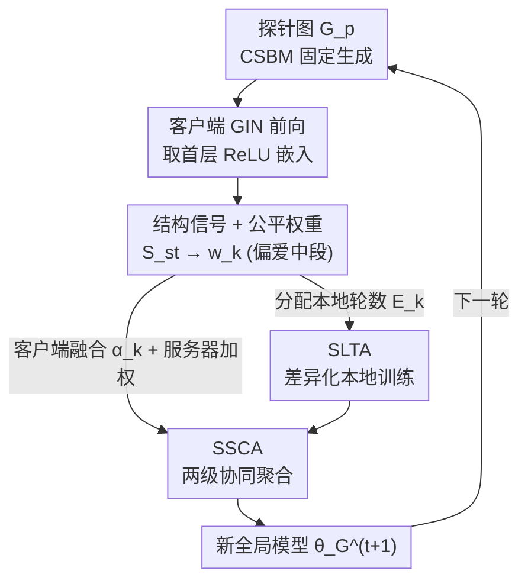

# FedSST: Rethinking Fair Federated Graph Learning under Structural Shift

**会议**: CVPR 2026  
**论文**: [CVF Open Access](https://openaccess.thecvf.com/content/CVPR2026/html/Zhao_FedSST_Rethinking_Fair_Federated_Graph_Learning_under_Structural_Shift_CVPR_2026_paper.html)  
**代码**: 未公开  
**领域**: 联邦优化 / 图联邦学习  
**关键词**: 联邦图学习, 泛化公平, 结构异质性, 自适应聚合, 探针图  

## 一句话总结
FedSST 用一张共享"探针图"探测各客户端 GNN 的结构偏好、压成一个标量信号并映射成"偏爱中间客户端"的公平权重，再用这个权重同时驱动差异化的本地训练轮数分配（SLTA）和两级自适应聚合（SSCA），在跨域图分类上同时提升平均精度与降低客户端间精度方差。

## 研究背景与动机
**领域现状**：联邦图学习（FGL）让多个持有图数据的客户端在不共享原始图的前提下协同训练 GNN。但在真实的跨域场景里，不同客户端的图拓扑差异极大——小分子图、社交网络、生物信息图、视觉场景图的连接模式天差地别，这种**拓扑异质性**远比一般联邦学习里的特征/标签 non-IID 更棘手。

**现有痛点**：拓扑异质性会让全局模型被一小撮"占优客户端"主导，从而损害**泛化公平性**（generalization fairness，即各客户端测试精度是否均衡）。作者把它拆成两个具体毛病：(1) **全局聚合偏差**——标准的 FedAvg 按数据量或模型对齐度加权，会放大那些结构简单、梯度与全局一致的客户端，压制结构稀有但有价值的少数客户端；(2) **本地盲目优化**——所有客户端用统一的本地训练强度，结果是已经对齐全局的客户端过拟合本地偏置，而结构独特的客户端又训练不充分、难以收敛。

**核心矛盾**：现有 FGL 方法（FedStar、FedSSP、FedIGL 等）大多从谱特征或不变特征入手提升**整体性能**，却没有一个**标准化、隐私安全的结构度量**来衡量每个客户端的"功能贡献"，因此既无法在聚合时显式再平衡结构贡献，也无法按需调节本地训练；而 q-FedAvg / AFL 这类公平方法只看 loss 信号、对图结构无感知，可能误伤"本地精度高但结构知识珍贵"的客户端。

**核心 idea**：构造一个**统一的结构信号** $S_{st}$ 去量化每个客户端偏离全局结构分布的程度，把它非线性映射成"中段客户端权重最高"的公平权重 $w_k$，再用同一个 $w_k$ 同时指挥本地训练分配与全局聚合——一个信号、两个自适应机制，统一解决聚合偏差与盲目优化。

## 方法详解

### 整体框架
FedSST 是一个结构感知的自适应公平优化框架。每个通信轮 $t$ 走三步：① 服务器分发一张固定的探针图，每个客户端 $k$ 用当前 GIN 模型对它做一次前向，把输出嵌入压成一个标量结构度量 $S_{st}(k)$ 回传；服务器把所有 $S_{st}$ 非线性映射成公平权重 $w_k$（偏爱结构居中的客户端）。② 用 $w_k$ 驱动 **SLTA**，给每个客户端算出本轮应跑的本地训练轮数 $E_k$（贡献潜力高的多训、极端的少训）。③ 客户端完成 $E_k$ 轮本地训练后，用 $w_k$ 驱动 **SSCA** 做两级融合：先在客户端侧按 $\alpha_k$ 把本地模型与全局模型加权融合再上传，再在服务器侧用 $w_k$ 对上传模型做加权平均得到新全局模型。整个结构通信开销只是一个 32-bit 标量，复杂度 $O(1)$。

### 关键设计

**1. 结构信号与公平权重：用一张探针图把"客户端有多偏离全局结构"压成一个标量，再非线性偏爱中段客户端**

要量化拓扑异质性，难点在隐私约束下不能直接比较各客户端的图。FedSST 的做法是用 **Community/Contextual 随机块模型（CSBM）** 生成一张所有客户端共享的固定探针图 $G_p$（$n=20$ 节点、平均度 $d=3$、同质率 $0.75$、特征维 $p=128$），节点特征由社区信号加高斯噪声合成：$x_i = \sqrt{\mu/n}\, y_i\, u + Z_i/\sqrt{p}$。由于 GNN 参数隐式编码了它学到的结构偏好，不同客户端的模型在处理这张统一探针时会给出不同的嵌入模式。每个客户端 $k$ 用当前 GIN 对 $G_p$ 前向，取第一层 GIN 卷积 ReLU 后的嵌入 $H_k$，先 $\ell_2$ 归一化，算余弦相似度矩阵 $S_k = H_{k,\text{norm}}H_{k,\text{norm}}^\top$，再构造度向量 $d_k = S_k \mathbf{1}$ 与拉普拉斯 $L_k = \mathrm{diag}(d_k) - S_k$，最终得到一个**图平滑度度量**：

$$S_{st}(k) = \frac{d_k^\top L_k d_k}{d_k^\top d_k + \varepsilon}.$$

相比 FedStar / FedSSP 要传输高维结构编码器参数，这里只回传一个 32-bit 标量，结构通信成本几乎为零、复杂度 $O(1)$。拿到所有 $S_{st}(k)$ 后，服务器先归一化成相对距离 $d_k = (S_{st}(k)-S_{\min})/(S_{\max}-S_{\min}+\delta) \in [0,1]$，再用一个三项复合打分函数算未归一化分数：

$$\text{score}_k = \text{base} + \lambda_{\text{far}}\big(1 - e^{-k_{\text{far}}d_k}\big) + \lambda_{\text{mid}}\exp\!\Big(-\tfrac{(d_k-\mu_{\text{mid}})^2}{2\sigma_{\text{mid}}^2}\Big).$$

三项各司其职：**基线项** base 保证所有客户端都有基本参与权；**远端补偿项** 随距离 $d_k$ 增大但有上限，适度承认结构稀有客户端的潜在价值；**高斯项** 以 $\mu_{\text{mid}}=0.5$ 为中心，给结构居中的客户端最大的权重放大——这正是全文的核心洞察：中段客户端在"信息增益"与"训练稳定性"之间最平衡，既不像对齐全局的客户端那样只会过拟合，也不像极端结构客户端那样会把模型带跑偏。最后阈值化并归一化得到 $\sum_j w_j = 1$ 的公平权重 $w_k$。

**2. SLTA（信号驱动的本地训练分配）：让贡献潜力高的客户端多训、极端的少训，用算力换收敛公平**

针对"统一本地训练强度导致盲目优化"的痛点，SLTA 不再让所有客户端跑相同轮数，而是用公平权重 $w_k$ 当信号，按贡献潜力分配本地训练轮数：

$$E_k = \max\Big(E_{\min},\ \min\big(\mathrm{round}(E_{\text{base}}(1+\lambda_{\text{reg}}w_k)),\ E_{\max}\big)\Big).$$

$w_k$ 越高（结构居中、对全局收敛贡献大）的客户端拿到越多本地 epoch，让它有益的本地模型被充分优化；$w_k$ 低（结构极端）的客户端只拿基础轮数，避免它过度本地训练后把模型带偏。$E_{\min}/E_{\max}$ 防止欠训/过训，$\lambda_{\text{reg}}$ 控制权重影响强度。这一步的代价是中段客户端略增本地计算，换来的是整体通信轮数大幅减少（实验里 100 轮就收敛，多数 baseline 要 200 轮）。

**3. SSCA（结构信号协同聚合）：客户端侧按信任度融合 + 服务器侧加权平均，两级防聚合偏差**

SLTA 解决了"训多少"，但还没解决"训完怎么合"。SSCA 用同一个 $w_k$ 做两级融合。**第一级在客户端侧（自适应本地融合）**：客户端跑完 $E_k$ 轮得到本地模型 $\theta_k^{\text{local}}$ 后并不直接上传，而是先算一个客户端专属融合系数 $\alpha_k = \alpha_{\min} + (\alpha_{\max}-\alpha_{\min})\cdot w_k$，再把本地模型与收到的全局模型融合后上传：

$$\theta_k^{\text{integration}} = \alpha_k\,\theta_G + (1-\alpha_k)\,\theta_k^{\text{local}}.$$

$\alpha_k$ 反映"对全局模型的信任度"：$w_k$ 高的客户端 $\alpha_k$ 大、多吸收全局知识促收敛；$w_k$ 低（结构疏远）的客户端 $\alpha_k$ 小、保留更多本地个性化知识，避免独特结构知识在聚合前就被全局模型覆盖掉。**第二级在服务器侧**：服务器收集所有 $\theta_k^{\text{integration}}$，再用归一化的 $\tilde{w}_k = w_k/\sum_j w_j$ 做加权平均得到新全局模型：

$$\theta_G^{(t+1)} = \sum_k \tilde{w}_k\,\theta_k^{\text{integration}}.$$

这样同一套非线性映射在聚合时放大中段客户端、抑制极端客户端，从根上纠正"占优客户端主导全局模型"的聚合偏差，同时通过客户端侧的个性化保留实现"公平且稳定"的融合。

## 实验关键数据

### 主实验
跨域图分类，四个领域数据集（小分子 SM / 生物信息 BIO / 社交网络 SN / 视觉 CV），每个客户端持一个独立数据集，构造五种异质设置。两个核心指标：**AVG↑**（所有客户端平均测试精度）与 **STD↓**（客户端精度标准差，衡量泛化公平）。GIN 2 层、200 通信轮、5 种子取最后 5 轮平均。

| 设置 | 指标 | FedSST | 次优 baseline | 对比 |
|------|------|--------|---------------|------|
| SM（单域） | AVG↑ / STD↓ | **82.29** / **10.37** | 79.43(FedIGL) / 10.95(APPLE) | AVG +2.86，STD 最低 |
| SM-BIO | AVG↑ / STD↓ | **76.17** / 13.86 | 72.83(FedSSP) / 13.18(GCFL) | AVG +3.34 |
| SM-CV | AVG↑ / STD↓ | 82.17 / **10.81** | 83.70(FedSSP) / 11.12(AFL) | STD 最低、AVG 次优 |
| BIO-SM-SN | AVG↑ / STD↓ | **73.86** / 14.53 | 72.58(FedSSP) / 13.91(Local) | AVG 最高 |
| SM-SN-CV | AVG↑ / STD↓ | **79.48** / 13.29 | 79.07(FedSSP) / 13.53(AFL) | AVG 最高 |

FedSST 在多数设置同时拿到最高 AVG 与最低 STD。值得注意的是经典 FedAvg 在强拓扑异质场景下甚至打不过纯本地训练的 Local，印证了传统 FL 处理结构 non-IID 的无力；而只看 loss 的 q-FedAvg/AFL 虽优于 FedAvg，但缺结构感知，作者据此论证"结构感知信号比 loss 重加权是更有效的公平基础"。

### 消融实验
在 SM、SM-CV、SM-SN-CV 三个设置上逐个开关 SSCA / SLTA：

| SSCA | SLTA | SM (AVG/STD) | SM-CV (AVG/STD) | SM-SN-CV (AVG/STD) |
|------|------|--------------|------------------|---------------------|
| ✗ | ✗ | 75.04 / 13.64 | 75.81 / 14.00 | 74.15 / 14.60 |
| ✓ | ✗ | 78.75 / 12.56 | 79.84 / 11.72 | 77.36 / 13.80 |
| ✗ | ✓ | 80.07 / 12.22 | 78.90 / 12.46 | 74.98 / 14.16 |
| ✓ | ✓ | **82.29 / 10.37** | **83.17 / 10.81** | **79.48 / 13.29** |

单开 SLTA 或 SSCA 都能同时提升精度与公平，两者协同最优。⚠️ 主表 SM-CV 的 full model AVG 记为 82.17，消融表同设置记 83.17，两处数字不一致，以原文为准。

### 关键发现
- **收敛效率**：SLTA 让 FedSST 约 100 轮即收敛到最高精度/最低方差，多数 baseline 需 200 轮，是"用适度增加的本地计算换通信轮数大幅减少"。
- **超参敏感性**：SSCA 的 $\alpha_{\max}$ 在所有设置都稳定在最优 0.9；而 SLTA 的 $\lambda_{\text{reg}}$ 对异质程度敏感，chem/chemcv/chemsncv 的最优值分别为 20/25/30——异质性越强需要的训练强度调节越大。
- **结构信号 vs loss 信号**：结构感知重加权在 STD 上整体优于 q-FedAvg/AFL 的 loss 重加权，说明拓扑异质场景下公平的"抓手"应是结构而非损失。

## 亮点与洞察
- **"探针图"把不可比的图结构变成可比的标量**：不直接比客户端的私有图，而是让各客户端模型处理同一张合成图、看输出嵌入的平滑度，巧妙绕开隐私约束，且通信成本压到一个 32-bit 标量——这个"用统一刺激探测不同模型"的思路可迁移到任何"想比较异质客户端但不能共享数据"的联邦场景。
- **"偏爱中段"的非线性权重**：跳出"越稀有越加权"或"越对齐越加权"的二元思维，用高斯项把权重峰值放在结构居中处，背后是"中段客户端在信息增益与稳定性间最平衡"的洞察，比单调权重更贴合公平目标。
- **一个信号驱动两个正交机制**：$w_k$ 同时管"训多少"（SLTA）和"怎么合"（SSCA），训练侧与聚合侧用同一把尺子，避免两套机制各行其是。

## 局限与展望
- **探针图依赖合成假设**：CSBM 探针图的统计参数（同质率 0.75 等）是人为设定的，对同质率极低/极高或强异配（heterophily）的真实图，单层 GIN 嵌入的平滑度是否仍能可靠区分结构贡献，文中未充分检验（作者称对各种探针设计稳定，详见附录，⚠️ 正文未给数据）。
- **只在 inter-graph、图分类上验证**：每个客户端持一个完整数据集的设定，未覆盖 intra-graph（子图补全）或节点分类任务，泛化性待考。
- **$\lambda_{\text{reg}}$ 需按场景调**：超参研究显示 $\lambda_{\text{reg}}$ 随异质程度变化最优值不同（20/25/30），缺一个自适应确定 $\lambda_{\text{reg}}$ 的机制，实际部署需先调参。
- **结构信号粒度有限**：把整张图的结构偏好压成一个标量，可能丢失细粒度的多模式结构信息；多维结构签名或许能进一步提升。

## 相关工作与启发
- **vs FedStar / FedSSP**：它们靠传输专门的结构对齐编码器参数来处理异质性、目标是提升整体性能；FedSST 只传一个标量信号、显式以"公平"为目标在聚合与本地训练两端再平衡结构贡献，结构通信成本从高维降到 $O(1)$。
- **vs q-FedAvg / AFL**：同样追求泛化公平，但它们基于 loss 信号重加权（min-max 或损失重加权保护最差客户端），对图拓扑无感知，可能误伤"本地精度高但结构知识珍贵"的客户端；FedSST 用结构信号，作者实验显示在 STD 上更优。
- **vs FedProx / SCAFFOLD**：传统 FL 用近端项或控制变量纠正客户端漂移、追求单一全局模型，在强拓扑异质下表现差（FedAvg 甚至不及 Local）；FedSST 通过客户端侧自适应融合 $\alpha_k$ 保留个性化，兼顾全局共性与本地特性。

## 评分
- 新颖性: ⭐⭐⭐⭐ 探针图标量化结构信号 + 偏爱中段的公平权重 + 一信号双机制，组合新颖且切中 FGL 公平的真问题
- 实验充分度: ⭐⭐⭐⭐ 五种跨域设置、12 个 baseline、消融/收敛/超参齐全；但仅图分类、主表与消融表有一处数字不一致
- 写作质量: ⭐⭐⭐⭐ 动机—机制—公式链条清晰，框架图与三大机制对应明确
- 价值: ⭐⭐⭐⭐ 把"结构感知 + 公平"落到可低成本部署的标量信号上，对跨域 FGL 有实用参考价值

<!-- RELATED:START -->

## 相关论文

- [\[CVPR 2026\] FedSDR: Federated Graph Learning with Structural Noise Detection and Reconstruction](fedsdr_federated_graph_learning_with_structural_noise_detection_and_reconstructi.md)
- [\[CVPR 2026\] Fed-ADE: Adaptive Learning Rate for Federated Post-adaptation under Distribution Shift](fed-ade_adaptive_learning_rate_for_federated_post-adaptation_under_distribution_.md)
- [\[CVPR 2025\] Federated Learning with Domain Shift Eraser](../../CVPR2025/optimization/federated_learning_with_domain_shift_eraser.md)
- [\[ICLR 2026\] Rethinking Consistent Multi-Label Classification Under Inexact Supervision](../../ICLR2026/optimization/rethinking_consistent_multi-label_classification_under_inexact_supervision.md)
- [\[CVPR 2026\] Few-for-Many Personalized Federated Learning](few-for-many_personalized_federated_learning.md)

<!-- RELATED:END -->
