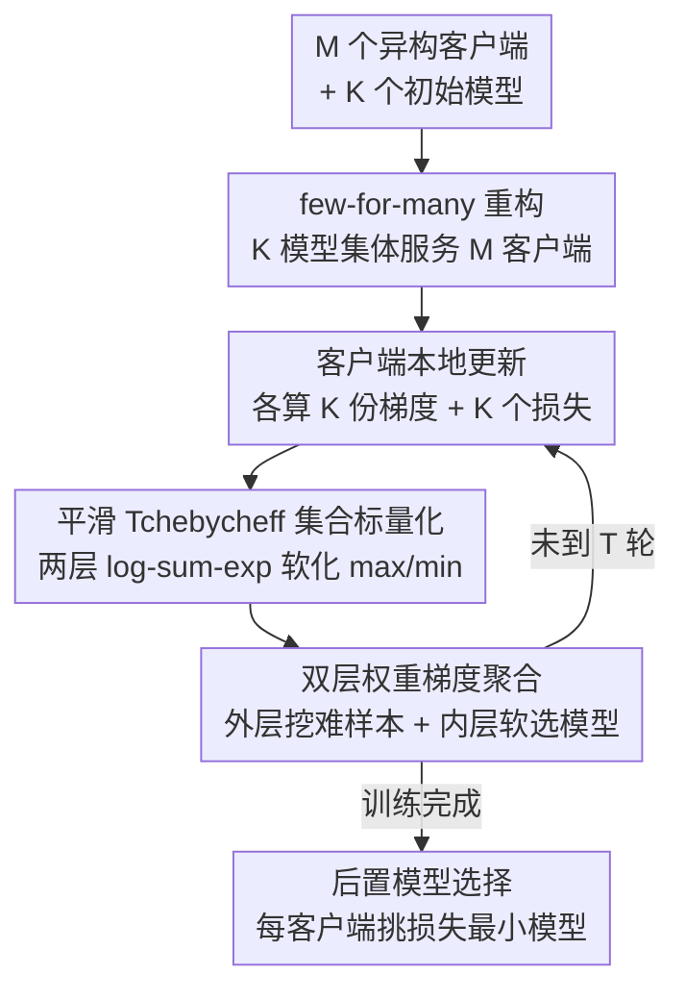

# Few-for-Many Personalized Federated Learning

**会议**: CVPR 2026  
**论文**: [CVF Open Access](https://openaccess.thecvf.com/content/CVPR2026/html/Guo_Few-for-Many_Personalized_Federated_Learning_CVPR_2026_paper.html)  
**代码**: https://github.com/pgg3/FedFew  
**领域**: 个性化联邦学习 / 多目标优化  
**关键词**: 个性化联邦学习, 多目标优化, Pareto 最优, Tchebycheff 集合标量化, 模型多样性  

## 一句话总结
把个性化联邦学习重构成"用 K 个共享模型服务 M 个客户端"（K≪M）的少对多多目标优化问题，并用可微的平滑 Tchebycheff 集合标量化（STCH-Set）联合训练这 K 个模型，只用 3 个模型就在视觉、NLP 和真实医学影像上稳定超过现有方法。

## 研究背景与动机

**领域现状**：个性化联邦学习（PFL）要在隐私约束下为数据分布高度异构的客户端各自训练贴合本地分布的模型。主流做法分三类——单全局模型（FedAvg/FedProx）、每客户端一模型（FedRep/Ditto/APFL），以及在服务器维护多个模型再做聚类分配（IFCA/CFL/FedSoft）。

**现有痛点**：当客户端分布 $P_i \neq P_j$ 时，对一个客户端有利的更新往往损害另一个，本质是 M 个相互冲突的目标。要达到"最优个性化"理想上需要 Pareto 前沿上的 M 个不同模型，但在成百上千客户端的联邦里维护 M 个独立模型的通信/计算开销不可承受。多目标方法（FedMGDA、FedMTL）只求出 Pareto 前沿上的**单个**折中解，给不出逐客户端最优；启发式聚类/插值方法虽给出多个模型，却没有任何 Pareto 最优性保证，且依赖手工分组或精细调参。

**核心矛盾**：个性化质量（需要更多模型逼近 Pareto 前沿）与可扩展性/通信成本（模型数随 M 线性膨胀）之间的根本权衡。直接逼近整个 Pareto 前沿到 $\varepsilon$ 精度需要 $O((1/\varepsilon)^{M-1})$ 个模型——M=10、$\varepsilon=0.01$ 就要 $10^{18}$ 个模型，完全不现实。

**本文目标**：在不为每个客户端单独存模型的前提下，提供有理论保证的近最优个性化，且模型数与客户端总数 M 解耦。

**切入角度**：作者的关键观察是——达到最优个性化**不需要**逼近整条连续 Pareto 前沿，只需要前沿上 M 个离散点（每客户端一个）；而这 M 个点又可以被远少于 M 个的共享模型"覆盖"，因为很多客户端的最优解彼此接近。于是把问题降维成"维护 K 个模型，每个客户端挑最合适的一个"。

**核心 idea**：把 PFL 重构为 **few-for-many（K-for-M）** 集合优化——只维护 $K \ll M$ 个服务器模型集体服务所有客户端，并用平滑标量化把"离散选模型"变成可微目标，让梯度下降自动发现最优的模型多样性。

## 方法详解

### 整体框架
FedFew 的输入是 M 个持有异构本地数据的客户端和 K 个初始模型（实验里 K=3），输出是训练好的 K 模型集合 $\Theta=\{\theta_1,\dots,\theta_K\}$ 以及每个客户端选定的最佳模型索引 $k_i^*$。整体分两段：**训练阶段**在 T 个通信轮里反复"客户端本地算 K 份梯度+K 个损失 → 服务器用 STCH-Set 权重聚合更新每个模型"；**训练后**每个客户端在本地评估全部 K 个模型、挑损失最小的那个作为自己的个性化模型。

关键在于：客户端"挑哪个模型"是离散选择，与标准梯度优化不兼容。FedFew 用两层 log-sum-exp 平滑把内层 $\min_k$（客户端选模型）和外层 $\max_i$（跨客户端的 Tchebycheff 最差项）都软化成可微，于是整个 K-for-M 目标变成一个可由 SGD 优化的标量函数，模型选择被"软化"成对各模型按损失加权——训练中无需硬分配，模型多样性在优化中自然涌现。

### 关键设计

**1. few-for-many（K-for-M）重构：把"M 个模型"降维成"K 个共享模型 + 各自挑选"**

针对"理想个性化需要 M 个模型、但 M 太大不可扩展"这一矛盾。作者把原始 M 目标问题 $\min_\theta [L_1(\theta),\dots,L_M(\theta)]$ 重写为集合优化：维护 $\Theta=\{\theta_1,\dots,\theta_K\}$，每个客户端 $i$ 由使其本地损失最小的模型服务，目标变成

$$\min_\Theta\ F(\Theta) = \Big[\min_{k}L_1(\theta_k),\ \dots,\ \min_{k}L_M(\theta_k)\Big]^T.$$

这样模型数 K 成了可调旋钮：K=1 退化为 FedAvg（无个性化），K=M 可恢复逐客户端模型，$1<K<M$ 是本文工作区间。更重要的是作者给出了收敛定理：平均误差被分解为两个会消失的项，

$$\frac{1}{M}\sum_{i=1}^{M}\Big(\mathbb{E}[\min_{k}L_i(\theta_k)] - L_i(\theta_i^*)\Big) \le \underbrace{\frac{M-K}{M}\Delta_{\text{het}}}_{\text{Pareto 覆盖间隙}} + \underbrace{O\!\Big(\sqrt{Kd/n}\Big)}_{\text{统计误差}},$$

其中 $\Delta_{\text{het}}$ 是客户端两两最大异构度、$d$ 是模型复杂度、$n$ 是平均样本量。前一项随 K 增大而缩小（K=M 时归零，恢复完全个性化），后一项随本地数据量 $n\to\infty$ 而消失。这正是它区别于纯启发式聚类/插值方法的地方——后者对"学到的模型集好不好"没有任何理论保证。

**2. 平滑 Tchebycheff 集合标量化（STCH-Set）：把离散选模型变成可微目标**

针对设计 1 里那个含嵌套 $\min/\max$ 的目标无法做梯度优化的问题。作者先用 Tchebycheff 集合标量化（TCH-Set）把多目标聚成一个标量：$g_{\text{TCH-Set}}(\Theta|\lambda)=\max_i \lambda_i(\min_k L_i(\theta_k)-z_i^*)$，它的好处是保证 Pareto 最优、天然处理异构目标而无需显式加权聚合。但其中的 $\max_i$（跨客户端取最差）和 $\min_k$（客户端选模型）都不可微。

于是对两层都做 log-sum-exp 平滑：$\max_i x_i \approx \mu\log\sum_i e^{x_i/\mu}$、$\min_i x_i \approx -\mu\log\sum_i e^{-x_i/\mu}$，取 $\lambda_i=1,\ z_i^*=0$ 后得到完全可微的目标

$$g_{\text{STCH-Set}}(\Theta) = \mu\log\sum_{i=1}^{M}\Big(\sum_{k=1}^{K}\exp\!\big(-L_i(\theta_k)/\mu\big)\Big)^{-1},$$

其中 $\mu>0$ 控制平滑程度：$\mu\to0$ 时无偏逼近原 min-max 目标（逼近误差 $O(\mu\log M+\mu\log K)$），但梯度更尖、优化更难。理论上它还保证解是（弱）Pareto 最优、且梯度收敛点是原多目标问题的 Pareto 稳定点；相比之下 IFCA 的硬聚类分配造成非凸、不连续的优化地形，没有收敛保证——作者由此论证"优化策略本身"才是性能与理论保证的关键。

**3. 双层权重梯度：外层挖难客户端、内层软选模型**

这是 STCH-Set 求梯度后自然浮现的机制，也是 FedFew 既"协作"又"个性化"的来源。对 $g_{\text{STCH-Set}}$ 关于 $\theta_k$ 求导得到

$$\nabla_{\theta_k}g_{\text{STCH-Set}} = \sum_{i=1}^{M}\alpha_i\cdot w_{ik}\cdot\nabla_{\theta_k}L_i(\theta_k),$$

记 $S_i=\sum_{k}\exp(-L_i(\theta_k)/\mu)$，则**外层权重** $\alpha_i = S_i^{-1}/\sum_j S_j^{-1}$、**内层权重** $w_{ik}=\exp(-L_i(\theta_k)/\mu)/S_i$。两者分工明确：$\alpha_i$ 给"在所有模型下都表现差"（$S_i^{-1}$ 大）的客户端更高权重，相当于**难样本挖掘**，让全局照顾掉队的客户端；$w_{ik}$ 对每个客户端把权重压向损失最低的那个模型，相当于**软模型选择**，让每个模型逐渐专精到适合它的客户端子群。正是这套权重让 K 个模型在训练中自动分化出多样性，无需手工聚类或调多样性超参。

**4. 联邦训练与后置模型选择：低通信开销地落地到标准 FL 协议**

针对前述目标如何在真实联邦协议里高效执行。每个通信轮：服务器广播当前 $\Theta$；每个客户端对全部 K 个模型各做 E 轮本地更新，回传 K 份梯度 $g_{ik}$ 和 K 个标量损失 $L_i(\theta_k)$；服务器用式 (11)(12) 算出 $\{\alpha_i,w_{ik}\}$，对每个模型聚合 $\nabla_{\theta_k}g_{\text{STCH-Set}}=\sum_i\alpha_i w_{ik}g_{ik}$ 并更新。每客户端通信成本 $O(Kd)$，K 固定（3~10）且不随 M 增长，开销温和；用 $E>1$ 还能成比例减少所需通信轮 T。训练结束后做一次**后置模型选择**：每个客户端在本地用 K 个模型各跑一遍前向、选损失最小的 $k_i^*=\arg\min_k L_i(\theta_k^{(T)})$ 作为自己的个性化模型——把"选哪个模型"留到训练后用真实损失硬选，既简单又稳。

## 实验关键数据

### 主实验
七个数据集（CIFAR-10/100、TinyImageNet、AG News、FEMNIST + 两个真实医学数据集 Kvasir/FedISIC），统一 K=3。基准上 FedFew 在多数设置排第一/第二（准确率 %）：

| 数据集（设置） | FedFew(本文) | 最强基线 | 提升 |
|--------|------|------|------|
| CIFAR-100 病态 M=20 | **64.98** | FedRep 61.46 | +3.52 |
| CIFAR-100 实用 M=20 | **53.69** | 最强基线 46.67 | +7.02 |
| TinyImageNet M=10 | **30.31** | FedRep 27.24 | +3.07 |
| AG News M=20 | **96.07** | FedRep 94.68 | +1.39 |
| CIFAR-10 实用 M=20 | **88.26** | APFL 87.36 | +0.90 |
| FEMNIST M=20 | 100.00 | 多方法 100.00 | 持平 |

真实医学影像（Avg/Min/Max 准确率 %），FedFew 在平均与最差客户端上都领先：

| 数据集 | 方法 | Avg±Std | Min | Max |
|--------|------|---------|-----|-----|
| Kvasir | FedFew | **92.84±6.08** | **83.90** | 99.77 |
| Kvasir | IFCA(同类多模型) | 82.05±21.88 | 40.24 | 100.00 |
| FedISIC | FedFew | **69.57±14.59** | **55.40** | 95.35 |
| FedISIC | IFCA | 53.61±20.45 | 23.23 | 85.74 |

值得注意：采用多目标视角的 FedFew 与 FedMTL 在**最差客户端准确率**上显著更高（FedISIC 上比其他基线至少 +1.2%、比 local-only +13.0%），体现多目标优化在异构客户端间"兜底"的价值；而同为"多服务器模型"的 IFCA 因硬聚类在医学数据上严重退化（Min 仅 23~40%）。

### 消融实验
在 CIFAR-10（Dirichlet α=0.5，M=20）上研究 K 与通信-计算权衡：

| 配置 | 关键指标 | 说明 |
|------|---------|------|
| K=1~10 | 加权准确率 89.4~91.3% | 全程远超 FedAvg 的 61.2%；K=1 反而最高 91.3% |
| K 增大 | $g_{\text{STCH-Set}}$ 收敛变慢 | 参数空间扩大、固定轮数内收敛不充分 |
| 本地轮 LE=1/2/4/8/16 | 平均准确率 87.8~88.3% | 总更新数固定为 2000 时各配置准确率几乎一致 |
| LE=16 | 收敛最快、方差最小 | 用更多本地轮可大幅减少通信轮 |

### 关键发现
- **K 与性能非单调**：在 CIFAR-10 这种同分布采样、且训练轮固定的设定下，K=1 反而最好（91.3%）。作者归因于两点——数据本就较同质（单一好模型够用）+ K 增大扩张参数空间、固定轮数内收敛不足。这提示 K 不是越大越好，要看异构程度和训练预算。
- **多目标视角主要赢在"兜底"**：FedFew/FedMTL 的优势集中在最差客户端准确率，说明 STCH-Set 的外层难样本挖掘权重 $\alpha_i$ 确实在照顾掉队客户端。
- **通信高度可压缩**：固定总更新数下，多本地轮（LE=16）收敛更快更稳且准确率不掉，意味着可用本地计算换通信，适合通信受限的边缘场景。

## 亮点与洞察
- **把"个性化 vs 可扩展性"的权衡显式参数化为一个旋钮 K**，并给出带 Pareto 覆盖间隙 + 统计误差的双消失项收敛界——这让"用几个模型"从工程拍脑袋变成有理论刻画的设计选择。
- **两层 log-sum-exp 平滑**是核心 trick：内层软化"客户端选模型"、外层软化"跨客户端取最差"，一举把离散组合优化变成可微，且天然导出"难样本挖掘 + 软模型选择"两类权重。这种"集合标量化 + 双层平滑"的范式可迁移到任何"少数解覆盖多数目标"的场景（如多任务学习里少量专家覆盖多任务）。
- **训练软选、推理硬选**的设计很务实：训练期用软权重保梯度可导与协作，推理期用真实损失硬选模型保个性化质量。

## 局限与展望
- **K 非单调现象未给自动选 K 的方法**：论文展示了 K 对性能的复杂影响，但 K 仍是预设超参（实验固定 3），如何按异构度/预算自动定 K 是开放问题。
- **每轮要对全部 K 个模型各做 E 轮本地训练**：客户端计算量约为单模型的 K 倍，对算力极弱的端设备仍有压力（虽然通信只 $O(Kd)$）。
- **平滑参数 $\mu$ 的权衡未充分剖析**：$\mu$ 小逼近紧但梯度尖、优化难，论文给了 bound 但没系统给出选 $\mu$ 的实操指引。⚠️ 文中实现取 $\lambda_i=1,z_i^*=0$ 并按样本量归一化加权，更细的超参在补充材料，正文未全列。
- **后置模型选择依赖本地验证/训练集评估**：在本地数据极少时，挑出的"最佳模型"可能因评估噪声而不稳。

## 相关工作与启发
- **vs IFCA / CFL（硬聚类多模型）**：同样求解 K-for-M 问题，但它们用硬客户端→簇分配，造成非凸不连续地形、无收敛保证，且对异构敏感（医学数据上严重退化）。FedFew 用平滑标量化把硬选择软化，保证收敛到 Pareto 稳定点，模型多样性在优化中自动发现而非手工分组。
- **vs FedMGDA / FedMTL（多目标单解）**：它们采纳多目标视角但只求 Pareto 前沿上的单个折中解，给不出逐客户端最优，且 bi-level 优化通信开销大。FedFew 维护 K 个解覆盖多客户端，兼顾个性化与效率。
- **vs FedRep / Ditto / APFL（每客户端一模型）**：这类方法个性化强但牺牲协作、易在小数据上过拟合，且模型数随 M 线性增长。FedFew 用 K≪M 个共享模型在协作与个性化间取得更好折中，在大多数基准上反超它们。

## 评分
- 新颖性: ⭐⭐⭐⭐⭐ 把 PFL 重构成 few-for-many 集合优化并配双消失项收敛界，视角与理论都有原创性
- 实验充分度: ⭐⭐⭐⭐ 七数据集含真实医学影像、含 K/通信权衡消融，但缺自动选 K 与大规模客户端（M≫20）验证
- 写作质量: ⭐⭐⭐⭐⭐ 动机—理论—算法—实验链条清晰，公式与权重含义解释到位
- 价值: ⭐⭐⭐⭐⭐ 只用 3 模型即超 SOTA、通信开销温和，对医疗/边缘等异构联邦场景实用价值高

<!-- RELATED:START -->

## 相关论文

- [\[CVPR 2026\] Generalized and Personalized Federated Learning with Black-Box Foundation Models via Orthogonal Transformations](generalized_and_personalized_federated_learning_with_black-box_foundation_models.md)
- [\[ICLR 2026\] Personalized Collaborative Learning with Affinity-Based Variance Reduction](../../ICLR2026/optimization/personalized_collaborative_learning_with_affinity-based_variance_reduction.md)
- [\[NeurIPS 2025\] Personalized Subgraph Federated Learning with Differentiable Auxiliary Projections](../../NeurIPS2025/optimization/personalized_subgraph_federated_learning_with_differentiable_auxiliary_projectio.md)
- [\[AAAI 2026\] Personalized Federated Learning with Bidirectional Communication Compression via One-Bit Random Sketching](../../AAAI2026/optimization/personalized_federated_learning_with_bidirectional_communication_compression_via.md)
- [\[ICML 2025\] Understanding the Statistical Accuracy-Communication Trade-off in Personalized Federated Learning with Minimax Guarantees](../../ICML2025/optimization/understanding_the_statistical_accuracy-communication_trade-off_in_personalized_f.md)

<!-- RELATED:END -->
