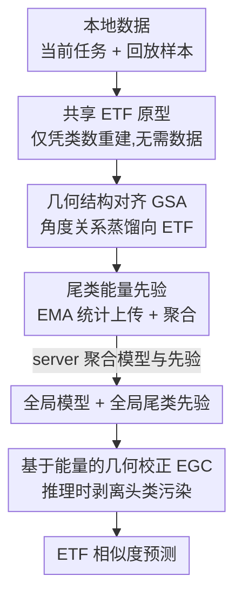

# From Selection to Scheduling: Federated Geometry-Aware Correction Makes Exemplar Replay Work Better under Continual Dynamic Heterogeneity

**会议**: CVPR 2026  
**论文**: [CVF Open Access](https://openaccess.thecvf.com/content/CVPR2026/html/Qi_From_Selection_to_Scheduling_Federated_Geometry-Aware_Correction_Makes_Exemplar_Replay_CVPR_2026_paper.html)  
**代码**: 无  
**领域**: 联邦学习 / 持续学习  
**关键词**: 联邦持续学习, 样本回放, 等角紧框架, 几何对齐, 类不平衡去偏  

## 一句话总结
针对联邦持续学习里"光会挑样本、不会用样本"的痛点，FEAT 不改回放策略，而是用一组所有客户端共享的固定 ETF 原型，在训练时做几何结构蒸馏拉齐各客户端的特征角度、在推理时用基于能量的几何校正把尾类特征从头类子空间里"拽回来"，作为即插即用模块叠在 Re-Fed+/FedCBDR 上即可稳定涨点。

## 研究背景与动机

**领域现状**：联邦持续学习（FCL）里，缓解灾难性遗忘的主流是**样本回放**——每个客户端在本地内存里存一小批过去任务的代表性样本，学新任务时混进去一起训。相比生成式回放（训 GAN/VAE 合成伪样本），存真实样本的 exemplar replay 计算便宜、保真度高，更适合边缘设备。

**现有痛点**：几乎所有工作都在卷"**怎么挑样本**"——设计各种 sample-importance 打分（Re-Fed 学个性化重要性模型、FedCBDR 重建全局特征再做类感知采样）去筛信息量大的样本。但它们都默认"挑对了样本就万事大吉"，**几乎没人管挑出来的样本到底怎么用**。在客户端分布持续漂移、任务不断来新类的"持续动态异质性"下，光有好样本并不够。

**核心矛盾**：回放本身是把双刃剑。一方面它把过去任务的少量样本塞进当前训练，**当前任务类（头类）样本多、过去任务类（尾类）样本少**，制造出严重的类不平衡；另一方面各客户端看到的类分布随时间各不相同，回放进一步放大了**客户端间异质性**。两者叠加导致"不平衡诱导的表示坍缩"：尾类特征被频繁出现的头类"拖拽"过去，决策边界向头类倾斜，预测对尾类极不敏感。即便用了从 Neural Collapse 理论来的固定 ETF 分类器（让各类方向天然等角、对称），在这种动态异质下尾类的跨客户端对齐仍明显弱于头类。

**本文目标**：在不动样本选择标准、不动内存分配的前提下，解决两件事——(1) 把各客户端漂移的特征几何拉回一致；(2) 在推理时纠正尾类被头类污染的预测偏置。

**核心 idea**：把研究重心**从"selection"（挑样本）转向"scheduling"（用样本）**。用一套全客户端共享、无需数据即可重建的固定 ETF 原型当"几何标尺"：训练时蒸馏特征间的角度关系向标尺对齐，推理时按能量把混进头类子空间的尾类成分剥离。整套方法与回放策略正交，可即插即用。

## 方法详解

### 整体框架
FEAT（Federated gEometry-Aware correcTion）的输入是各客户端本地的"当前任务数据 + 回放的过去任务样本"，输出是一个在异质 + 长尾下都更鲁棒的全局分类模型。它不替换任何回放策略，而是在标准 FedAvg 式的"本地训练→聚合"循环上挂两个模块：本地训练阶段用 **几何结构对齐（GSA）** 把特征角度蒸馏向共享 ETF 原型，并把尾类的统计能量做 EMA 上传聚合；推理阶段用 **基于能量的几何校正（EGC）** 对每个测试特征做去污染，再用 ETF 相似度出预测。

关键前提是那组 **ETF 原型**：在增量任务 $t$ 观测到的类集合 $\mathcal{C}_t$ 上构造一个 simplex ETF 矩阵 $W_t = \sqrt{\frac{C_t}{C_t-1}}\, U_t (I_{C_t} - \frac{1}{C_t}\mathbf{1}\mathbf{1}^\top)$，使任意两个原型等范数、两两夹角相同（同类内积 1，异类内积 $-\frac{1}{C_t-1}$）。新任务来时它**只靠更新后的类数就能重建，完全不需要数据**——这正是它能在联邦 + 持续场景里当"跨客户端共享标尺"的原因。

### 关键设计

**1. 共享固定 ETF 原型：给联邦持续学习一把"无需数据的几何标尺"**

痛点是异质 + 持续下没有一个稳定的参照系——各客户端特征空间各自漂移，没法对齐。FEAT 把可学习分类器换成固定的 simplex ETF 分类器 $W_t=[w_c]_{c\in\mathcal{C}_t}$（式 1），它天生满足等角性：$w_i^\top w_j = 1$（$i=j$）或 $-\frac{1}{C_t-1}$（$i\ne j$），各类方向对称、margin 一致。它的妙处在于**只要类数变了就能重新初始化、不依赖任何样本**，因此天然适合"新任务不断带来新类"的增量设定，又能作为所有客户端共用的统一先验。分类损失也据此定义：$z_i=\langle f, w_i\rangle$ 是特征与原型的相似度，$L_{CLS}=-\sum_i y_i \log \frac{e^{z_i}}{\sum_j e^{z_j}}$（式 6）。这把标尺是后面两个模块共同的地基。

**2. 几何结构对齐 GSA：蒸馏的是"角度关系矩阵"而非单点特征，且对尾类做类平衡**

仅用 ETF 还不够——论文实测（图 3）尾类（过去任务）的跨客户端对齐明显弱于头类。GSA 的做法是把"特征两两之间的角度结构"向"ETF 原型两两之间的角度结构"对齐，做的是**关系级（pairwise）蒸馏**而不是逼近单个原型。对一个 batch，分别算特征余弦相似度矩阵 $M_F^{a,b}=\frac{\langle f_a,f_b\rangle}{\|f_a\|\|f_b\|}$ 和原型余弦相似度矩阵 $M_P^{a,b}=\frac{\langle w_{y_a},w_{y_b}\rangle}{\|w_{y_a}\|\|w_{y_b}\|}$（式 3），两者都是 $B\times B$、行列顺序一致，于是可以逐样本对齐角度。再对每行做带温度 $\tau$ 的 softmax 变成分布 $P_F, P_P$（式 4），用 KL 散度蒸馏。

关键的去偏巧思在**聚合方式**：头类在 batch 里行数远多于尾类，直接平均会被头类主导。GSA 改成**先按类内平均、再按类平均**：

$$L_{GSA}=\frac{1}{|C_B|}\sum_{c\in C_B}\frac{1}{n_c}\sum_{a:y_a=c}\mathrm{KL}\!\left(P_F^{a,:}\,\|\,P_P^{a,:}\right)$$

其中 $C_B$ 是当前 batch 出现的类、$n_c$ 是类 $c$ 的样本数。这样每个类的几何监督权重相等，**保证尾类也拿到足够的对齐信号**，从源头缓解尾类向头类漂移。

**3. 基于能量的几何校正 EGC：把混进头类子空间的尾类成分在推理时"减掉再补回"**

GSA 缓解了漂移但没根治——论文测得（图 4）相当一部分尾类样本在头类子空间里的能量仍大于尾类子空间（$e_H>e_T$），即被头类污染。EGC 是个**只在推理时做、几乎零成本**的轻量校正。先把 ETF 原型按头类/尾类拆成 $W_H, W_T$，用 Moore–Penrose 伪逆构造两个正交投影算子 $P_H=W_H(W_H^\top W_H)^\dagger W_H^\top$、$P_T$ 同理（式 8）。

训练时顺便统计尾类的"典型能量"：对回放的尾类归一化特征，维护两个子空间上 rank-normalized 能量的 EMA $\bar e_H^{(T)}, \bar e_T^{(T)}$（式 9），客户端**只上传这两个标量**，server 按样本数加权聚合成全局先验 $\bar e_H^{(G)}, \bar e_T^{(G)}$（式 10）——通信开销可忽略。推理时，对任意归一化特征 $\tilde x$ 算它的头/尾子空间能量 $e_H(\tilde x)=\frac{\|P_H\tilde x\|^2}{|C_H|-1}$、$e_T(\tilde x)$ 同理（式 11），再用"超出全局尾类先验的程度"算一个置信门控：

$$g(\tilde x)=\max\!\left(\frac{e_H(\tilde x)-\bar e_H^{(G)}}{e_H(\tilde x)+e_T(\tilde x)+\varepsilon},\,0\right)$$

门控越大说明这个特征越偏向头类污染。校正就是**按门控削弱头类分量、增强尾类分量**，再 $\ell_2$ 归一化：$\tilde x'=\tilde x - g(\tilde x)P_H\tilde x + g(\tilde x)P_T\tilde x$（式 13），最后用 $z_c=(\tilde x')^\top w_c$ 出预测。这一步直接降低对头类的过度自信、提升对尾类的敏感度。

### 损失函数 / 训练策略
分阶段优化（式 15）：首个任务 $t=1$ 时只有分类损失 $L=L_{CLS}$；后续任务 $t>1$ 加上 GSA 蒸馏，$L=L_{CLS}+\lambda L_{GSA}$，$\lambda$ 为平衡系数。回放本身仍交给 Re-Fed+ 或 FedCBDR，EGC 只在推理时触发，整个训练轮数与聚合协议与 baseline 完全一致，只多上传两个标量。

## 实验关键数据

### 主实验
三个数据集（CIFAR10/100、TinyImageNet-Subset），用 Dirichlet 划分模拟 non-IID，对比 7 个 SOTA。把 FEAT 叠到 Re-Fed+ / FedCBDR 上得到 FEAT$_R$ / FEAT$_F$。Top-1 准确率（5 客户端，节选）：

| 数据集/设置 | FedCBDR | LANDER | Re-Fed+ | FEAT$_R$ | FEAT$_F$ |
|------|------|------|------|------|------|
| CIFAR10 3任务 β=1.0 | 65.88 | 59.88 | 61.64 | 70.28 | **74.21** |
| CIFAR10 5任务 β=0.5 | 61.77 | 39.63 | 54.15 | 60.38 | **70.19** |
| CIFAR100 5任务 β=0.1 | 45.84 | 43.59 | 31.92 | 37.14 | **50.14** |
| CIFAR100 10任务 β=0.5 | 45.96 | 32.64 | 38.62 | 43.34 | **49.18** |
| TinyImageNet 5任务 β=0.5 | 26.38 | 24.77 | 26.07 | 27.36 | **29.31** |

FEAT$_F$ 在**所有 setting 下都是最高**；FEAT$_R$、FEAT$_F$ 都稳定超过各自 baseline，验证即插即用。值得注意的是：异质性越强、客户端越多（10 客户端）这种更难的场景下，FEAT 的领先**没有缩水**，说明涨点不靠简单 case。

### 消融实验
CIFAR10（3任务）/ CIFAR100（5任务），5 客户端，在 FedCBDR 上逐步叠加：

| 配置 | CIFAR10 β=0.5 | CIFAR10 β=1.0 | CIFAR100 β=0.1 | CIFAR100 β=0.5 |
|------|------|------|------|------|
| FedCBDR | 63.32 | 65.88 | 45.84 | 50.33 |
| +ETF | 62.17 | 63.66 | 44.58 | 48.69 |
| +ETF+GSA | 68.54 | 70.42 | 47.77 | 52.23 |
| +ETF+EGC | 69.12 | 70.83 | 47.16 | 51.72 |
| +ETF+GSA+EGC（Full） | **72.67** | **74.21** | **50.14** | **53.31** |

### 关键发现
- **光加 ETF 反而掉点**（62.17 vs 63.32）：严重类不平衡会破坏跨源表示对齐，固定分类器单独用救不了，必须配 GSA/EGC。
- **GSA、EGC 各自都有效且互补**：单加 GSA 或单加 EGC 都能在 FedCBDR 上涨 5~7 个点，两者一起叠到最高——GSA 管训练时跨客户端几何一致、EGC 管推理时任务级去偏，分工互不重叠。
- **通信几乎零增**：每轮每客户端只多传 $\bar e_H,\bar e_T$ 两个标量，GSA 纯本地、EGC 纯推理，相比模型参数可忽略。
- **超参鲁棒**：$\lambda\in\{0.05,0.1,0.5\}$、$\rho\in\{0.5,0.7,0.9\}$、$\tau\in\{0.07,0.5\}$ 内准确率只小幅波动；趋势是较小 $\lambda$ 更能利用几何结构、较大 $\rho$ 去偏更稳，$\tau$ 影响很小。
- **抗遗忘更强**：FEAT$_F$ 初始精度最高、遗忘曲线下降最慢最平稳。

> ⚠️ 正文 5.7 节描述 $\lambda$ 取值范围为 $\{1,5,10\}$，但图 7 标注与实现细节均为 $\{0.05,0.1,0.5\}$，前者疑为笔误，以 $\{0.05,0.1,0.5\}$ 为准。

## 亮点与洞察
- **"从选择到调度"的视角切换很有价值**：FCL 社区长期卷 sample selection，本文指出真正被忽视的是"选出来怎么用"，并证明一个与选择策略正交的模块能稳定加分——这个 reframe 本身就是贡献。
- **蒸馏关系矩阵而非单点特征**：GSA 对齐的是 $B\times B$ 的角度关系结构，比逼近单个原型更能保住类间几何，且天然能配 ETF 这种"角度已知"的标尺。
- **把去偏拆到训练 + 推理两段**：训练时拉齐几何（GSA）、推理时减污染（EGC），用能量门控量化"被头类污染多少"再定向校正，这种"测得出偏置就补得回来"的思路可迁移到其他长尾/不平衡场景。
- **联邦友好到极致**：ETF 无需数据即可重建、模块只上传两个标量，几乎不增加通信和隐私风险，工程落地性强。

## 局限与展望
- 方法只在 ResNet-18 + CIFAR/TinyImageNet 规模上验证，**没有大模型/大规模数据集**的结果，TinyImageNet 上绝对精度仍很低（β=0.1 下不到 30%），说明难场景远未解决。
- EGC 的几何校正强依赖"头类/尾类子空间能用 ETF 正交投影干净分离"这一前提；当类数极多、ETF 维度受限（$d\ge C_t$）或头尾边界模糊时，投影去偏是否仍成立有待验证。⚠️ 论文未讨论 $d<C_t$ 时的退化。
- 全局尾类先验是按 EMA 聚合的单一标量，假设各客户端尾类能量分布相近；若某客户端尾类极端稀少，标量先验可能不准。
- EGC 是推理时校正，对**部署延迟**虽小但非零，且需要在推理端持有全局先验，跨任务原型扩张时的先验维护成本未细究。

## 相关工作与启发
- **vs Re-Fed+ / FedCBDR（样本选择类）**：它们专注"挑哪些样本回放"，FEAT 不碰选择标准、只优化"选出来怎么用"，因此能正交叠加；实验里 FEAT$_F$/FEAT$_R$ 一致超过各自 baseline，证明两条线互补而非竞争。
- **vs 普通 ETF-in-FL 方法**：已有工作固定 simplex-ETF 分类器来减分类器偏置、部分对齐 non-IID 表示，但本文指出它们在"持续动态异质 + 长尾"下尾类仍漂移、仍被头类污染，于是补上 GSA（关系蒸馏强化尾类对齐）+ EGC（推理去污染）两层修正。
- **vs 生成式回放（LANDER/GenFCIL）**：生成式靠合成伪样本，省内存但训练生成器贵、样本质量不稳；FEAT 走 exemplar replay 路线保真度高，且把重点放在"用好真实样本"上，实验中也优于 LANDER。

## 评分
- 新颖性: ⭐⭐⭐⭐ "从 selection 到 scheduling"的 reframe 有洞察，GSA 关系蒸馏 + EGC 能量去偏组合新颖，但 ETF/关系蒸馏/能量投影各自都有渊源。
- 实验充分度: ⭐⭐⭐⭐ 三数据集多异质度多任务粒度、7 个 baseline、消融/敏感性/通信/回放预算齐全；但规模偏小、缺大模型与真实联邦场景。
- 写作质量: ⭐⭐⭐⭐ 动机清晰、公式完整、图示到位；个别超参范围标注前后不一致。
- 价值: ⭐⭐⭐⭐ 即插即用、通信开销可忽略、与现有回放策略正交，落地友好，对 FCL 长尾去偏有实用价值。

<!-- RELATED:START -->

## 相关论文

- [\[CVPR 2026\] FedRG: Unleashing the Representation Geometry for Federated Learning with Noisy Clients](fedrg_unleashing_the_representation_geometry_for_federated_learning_with_noisy_c.md)
- [\[CVPR 2026\] BD-Merging: Bias-Aware Dynamic Model Merging with Evidence-Guided Contrastive Learning](bd-merging_bias-aware_dynamic_model_merging_with_evidence-guided_contrastive_lea.md)
- [\[ICCV 2025\] Federated Continual Instruction Tuning](../../ICCV2025/optimization/federated_continual_instruction_tuning.md)
- [\[CVPR 2026\] FedSST: Rethinking Fair Federated Graph Learning under Structural Shift](fedsst_rethinking_fair_federated_graph_learning_under_structural_shift.md)
- [\[CVPR 2026\] Dynamic Momentum Recalibration in Online Gradient Learning](dynamic_momentum_recalibration_in_online_gradient_learning.md)

<!-- RELATED:END -->
