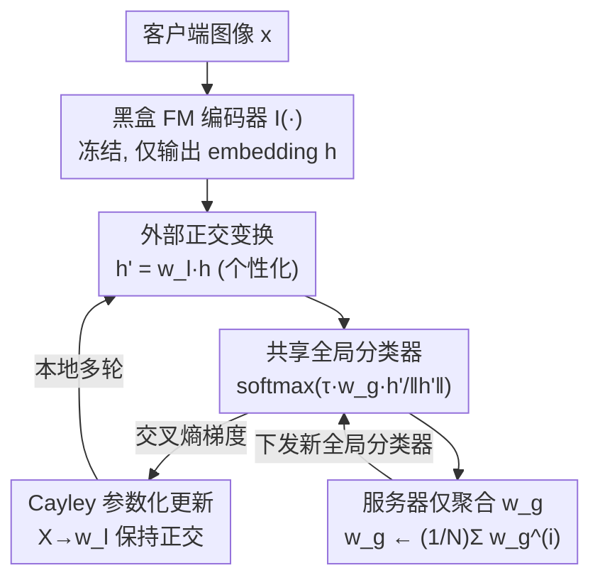

# Generalized and Personalized Federated Learning with Black-Box Foundation Models via Orthogonal Transformations

**会议**: CVPR 2026  
**论文**: [CVF Open Access](https://openaccess.thecvf.com/content/CVPR2026/html/Kong_Generalized_and_Personalized_Federated_Learning_with_Black-Box_Foundation_Models_via_CVPR_2026_paper.html)  
**代码**: 未公开  
**领域**: 联邦学习 / 优化  
**关键词**: 联邦学习, 黑盒基础模型, 正交变换, 泛化与个性化, 双重隐私  

## 一句话总结
FEDOT 把冻结的黑盒基础模型当成纯特征提取器，每个客户端在它输出的 embedding 上叠一个**本地正交变换**做个性化、所有客户端共享并聚合一个**全局分类器**做泛化；作者证明正交约束（条件数 $\kappa=1$）能把跨客户端的梯度冲突上界压到最小，从而在严重 non-IID 下同时拿到 SOTA 级的泛化和个性化，且全程不碰 FM 内部参数。

## 研究背景与动机
**领域现状**：联邦学习（FL）让多个客户端在不上传原始数据的前提下协同训练。把 CLIP 这类强泛化的基础模型（FM）接进 FL 是很自然的诉求——既能蹭到 FM 的表示能力，又能保护数据隐私。

**现有痛点**：现实里 FM 大多是厂商的私有资产，只通过 API 或编译好的二进制对外提供，客户端**拿不到权重、结构和梯度**，只能黑盒调用。这一下子废掉了一大票方法：LoRA、Adapter 这些 PEFT 要往网络内部插模块；OFT（正交微调）要重参数化已有权重矩阵；大多数个性化联邦学习（PFL）也要访问内部梯度。它们全都假设白盒访问，在黑盒约束下统统失效。

**核心矛盾**：这里有两层张力。第一层是 FL 本身的老问题——在 non-IID 下，既要一个能泛化到未见客户端的全局模型，又要适配每个客户端本地分布的个性化模型，二者难以兼得。第二层是 FM 引入的**双重隐私**：既要保护客户端数据（FL 本职），又要保护服务器手里 FM 的知识产权（IP），后者强制要求严格黑盒。已有的黑盒 FL 方法 ZooPFL 靠零阶优化估计梯度，查询复杂度高、算得很慢。

**本文目标**：在严格黑盒、只能拿到 FM 输出 embedding 的前提下，用一种轻量、基于梯度的方式，同时把泛化和个性化做好。

**切入角度**：既然不能改 FM 内部，那就只在它**输出的特征向量上动手**。作者的关键观察是：如果在 embedding 外侧叠的变换是**正交**的，它既能做个性化适配，又是等距变换（保长度、保夹角），不会破坏 FM 表示空间的几何结构；更妙的是正交矩阵条件数恒为 1，这恰好能把跨客户端梯度冲突的理论上界压到最小。

**核心 idea**：用"**全局共享分类器 + 客户端各自的本地正交变换**"这套外挂式双参数结构，替代任何需要白盒访问的内部微调，在黑盒约束下同时解决泛化、个性化和双重隐私。

## 方法详解

### 整体框架
FEDOT 把每个客户端的模型拆成两半：一半是**全局参数**——所有客户端共享、且会在服务器聚合的任务分类器 $w_g \in \mathbb{R}^{K\times d}$（$K$ 类、$d$ 维特征）；另一半是**本地参数**——每个客户端 $i$ 私有、永不上传的正交变换 $w_l^{(i)}\in\mathbb{R}^{d\times d}$。黑盒 FM 编码器 $I(\cdot)$ 全程冻结，只负责把图像 $x$ 映成特征 $h=I(x)$。

前向时，本地正交变换先把特征线性变换成 $h'=w_l^{(i)}h$，再喂给全局分类器算分类概率：

$$P\big(y\mid x; w_g, w_l^{(i)}\big)=\mathrm{softmax}\Big(\tau\, w_g\, \tfrac{h'}{\|h'\|}\Big),$$

其中 $\tau$ 是温度超参。本地训练时客户端最小化标准交叉熵 $\ell^{(i)}=\mathbb{E}_{(x,y)\sim D^{(i)}}[-\log P(y\mid x; w_g^{(i)}, w_l^{(i)})]$，同时更新 $w_g^{(i)}$ 和正交变换；一轮结束后，**服务器只聚合全局分类器** $w_g\leftarrow\frac{1}{N}\sum_{i=1}^N w_g^{(i)}$，本地正交变换留在设备上。这样个性化靠各自的 $w_l^{(i)}$，泛化靠被聚合的 $w_g$，双重隐私由架构本身保证——FM 内部从不被访问、本地变换从不被传输。

### 关键设计

**1. 外部正交变换：在黑盒侧实现个性化而不碰 FM**

个性化的难点在于黑盒约束——传统 PFL 要么往编码器里插模块、要么微调特征提取器，黑盒下全做不到。FEDOT 的做法是把个性化彻底搬到 FM **外面**：每个客户端学一个 $d\times d$ 的正交矩阵 $w_l^{(i)}$，对 FM 吐出的特征做 $h'=w_l^{(i)}h$。之所以坚持用**正交**而不是任意线性变换，是因为正交变换是等距的——它保持向量的长度和夹角，因此 FM 原始表示空间的语义完整性和流形结构在变换后依然成立，只是被"旋转/反射"到更贴合本地分布的朝向。正交矩阵还天然可逆，保证原空间里不同的特征变换后仍然可区分，不会信息坍缩。更进一步，一个 $d\times d$ 正交矩阵只有 $\frac{d(d-1)}{2}$ 个自由度（约为一般线性变换 $d^2$ 的一半），这种受约束的容量正好抑制了对本地数据的过拟合。

**2. 共享全局分类器：靠聚合换来跨客户端泛化**

光有本地变换只能各管各的，没法泛化到未见客户端。FEDOT 让所有客户端共享同一个任务相关分类器 $w_g\in\mathbb{R}^{K\times d}$，它可以随机初始化，也可以在用 VLM 时用文本编码器 $T$ 把类别提示 $\{T(p_c)\}_{c=1}^K$ 编成类向量来初始化（只在初始化时用一次文本编码器）。训练中每个客户端在本地更新自己的 $w_g^{(i)}$，**服务器端只对这一个分类器做平均聚合** $w_g\leftarrow\frac1N\sum_i w_g^{(i)}$。这一步是泛化的来源——它把各客户端学到的任务知识揉进一个共享分类头，从而能直接用于未见域；同时实验里它还反过来增强了个性化（聚合带来的跨客户端知识迁移让本地表现也更好）。通信代价极低：只交换 $K\times d$ 的分类器，FEMNIST 上仅约 5K 参数，本地 $d\times d$ 变换完全不出设备。

**3. Cayley 参数化 + 正交性的梯度冲突上界：为什么正交是最优解**

要在 SGD 里保持 $w_l^{(i)}$ 严格正交并不平凡。FEDOT 用可微的 **Cayley 变换**：优化一个无约束矩阵 $X^{(i)}$，由它构造斜对称矩阵 $R^{(i)}=\frac12\big(X^{(i)}-(X^{(i)})^\top\big)$，再令 $w_l^{(i)}=(I+R^{(i)})(I-R^{(i)})^{-1}$。这是 Stiefel 流形上的光滑参数化，保证每一步更新后 $w_l^{(i)}$ 都严格正交。真正解释"为什么必须正交"的是 Theorem 1：两个客户端 $i,j$ 的全局参数梯度之差满足

$$\Big\|\nabla_{w_g^{(i)}}\ell^{(i)}-\nabla_{w_g^{(j)}}\ell^{(j)}\Big\|\le 2\tau\big[\kappa(w_l^{(i)})+\kappa(w_l^{(j)})\big],$$

其中 $\kappa(\cdot)$ 是变换的条件数。当两个本地变换都正交时 $\kappa=1$，上界收紧到常数 $4\tau$——这是该线性变换框架下能达到的**最小**上界。直观含义是：梯度冲突的上界正比于条件数，正交约束把条件数钉死在 1，于是即便在严重 non-IID 下、各客户端梯度方向本会发散，全局参数聚合也能稳定进行。所以正交不只是"有帮助"，在这个框架里是**最优**的。

**4. 块对角正交变换：按任务复杂度调自由度（FEDOT(+B)）**

正交约束虽好，但 $\frac{d(d-1)}{2}$ 的自由度对简单任务可能仍偏多。FEDOT(+B) 把维度 $d$ 切成 $r$ 个块，每块 $Q_k$ 独立正交，整体取块对角 $B=\mathrm{diag}(Q_1,\dots,Q_r)$。由于每块正交，整体条件数仍然 $\kappa(B)=1$，Theorem 1 的最小上界依旧成立；但总自由度降到 $\frac{d(d/r-1)}{2}$。这给了一个在"本地适配能力"和"全局语义结构保持"之间调节的旋钮：简单任务（如 FEMNIST）用更少自由度防过拟合、收益最大，复杂任务（如 Office-Home）则需要更高自由度去捕捉域特定模式。实验中 FEDOT(+B) 是综合表现最好的变体。

### 损失函数 / 训练策略
本地目标就是标准交叉熵 $\ell^{(i)}$；本地更新 $w_g^{(i)}$ 与无约束矩阵 $X^{(i)}$，每步用 Cayley 变换从 $X^{(i)}$ 重算 $w_l^{(i)}$ 以维持正交；服务器端仅对 $w_g$ 做 FedAvg 式平均，本地正交变换不参与聚合。骨干为 CLIP ViT-B/32，FM 全程冻结、梯度不回传进编码器。

## 实验关键数据

### 主实验
五个域偏移明显的数据集（FEMNIST / PACS / Office-Home / VLCS / TerraIncognita），采用 leave-one-out 跨域协议，构造 $N\times N$ 精度矩阵：对角线（泛化 G）为聚合全局模型在留出域上的精度，非对角（个性化 P）为已见域上的个性化精度，C 为整体平均。3 个随机种子（50/77/98）取均值。下表为五数据集平均（%）：

| 方法 | G(%) | P(%) | C(%) | 说明 |
|------|------|------|------|------|
| CLIP (ZS) | 67.31 | – | – | 零样本基线 |
| FedCLIP | 71.76 | 77.16 | 75.81 | adapter，纯全局 |
| PromptFL | 78.01 | 84.97 | 83.23 | 基于 CoOp 的提示微调 |
| VPT | 71.25 | 83.36 | 80.18 | 视觉提示微调 |
| FedLT | 74.77 | 88.43 | 84.24 | 无约束一般线性变换 |
| FedAdapter | 77.99 | 86.93 | 84.57 | 非线性 MLP adapter |
| FedOT(All Global) | 76.59 | 84.09 | 82.22 | 仅全局参数 |
| FedOT(All Local) | – | 84.54 | – | 仅本地、无聚合 |
| **FEDOT (Ours)** | 76.04 | 86.21 | 83.65 | 完整正交变换 |
| **FEDOT(+B) (Ours)** | **78.67** | **88.58** | **86.10** | 块对角变体，最优 |

FEDOT(+B) 拿到最高的平均综合精度 86.10%，且多种子标准差很小。对照很说明问题：纯全局的 FedOT(All Global) 个性化只有 84.09%，纯本地的 FedOT(All Local) 个性化 84.54%，而 FEDOT(+B) 同时把 G 和 P 都拉满——聚合全局参数不仅带来泛化，还反过来增强了个性化。值得注意的是，为公平对比而改用 CLIP 骨干的传统 PFL（FedGH(C)、FedAKT(C)）表现崩坏（平均 C 仅 34.85% / 53.88%），说明为轻量模型设计的 PFL 直接搬到 FM-FL 反而会破坏 FM 本就很好的表示。

### 消融实验

**梯度冲突与条件数（验证 Theorem 1）**：用跨轮平均伪梯度余弦相似度衡量冲突，越高越好。

| 数据集 | FEDOT ($\kappa=1$) | FedLT (一般线性, $\kappa\ge1$) | FedAdapter (非线性) |
|--------|------|------|------|
| FEMNIST | **0.401** | 0.309 | 0.258 |
| VLCS | **0.002** | -0.084 | -0.307 |
| TerraIncognita | **0.029** | -0.045 | -0.235 |
| PACS | **0.036** | 0.002 | -0.117 |
| OfficeHome | **0.052** | 0.000 | -0.150 |

正交约束的 FEDOT 始终保持最高且近零或正的相似度（冲突最小）；一旦放开约束，FedLT 的相似度频繁掉到负值，非线性 FedAdapter 最差。条件数对精度的影响更直接：FEMNIST 上 FedLT 的平均 $\kappa$ 飙到 32.26，泛化精度从 FEDOT 的 94.93% 掉到 88.74%，强力印证"放开 $\kappa$ → 松开梯度界 → 损害泛化"。

**分类器初始化**（Tab. 4）：用 CLIP 文本编码器初始化 vs 随机初始化，五数据集上随机初始化反而在 FEMNIST（C 96.51% vs 95.84%）、Office-Home 上更好，说明 FEDOT 的效力主要来自正交适配 + 稳健聚合这套优化方法，而非依赖 CLIP 的多模态对齐——因此也适用于纯视觉 FM。

### 关键发现
- **正交是最优而非可选**：去掉正交约束后梯度冲突显著上升、泛化掉点，与 Theorem 1 的 $4\tau$ 最小上界一一对应，是少见的"理论预测—实验验证"闭环。
- **块对角自由度要按任务调**：简单任务低自由度防过拟合收益最大，复杂任务需更高自由度，FEDOT(+B) 因此普遍优于完整正交版。
- **可扩展性**：FEMNIST 上把参与客户端从 1 扩到 75，FEDOT 泛化精度单调上升至 71.18%（CLIP 零样本仅 44.00%），且比最强基线 PromptFL 更稳（PromptFL 从 40 客户端的 73.54% 暴跌到 75 客户端的 65.30%）。
- **效率**：梯度不回传进编码器，计算开销与骨干规模无关；只通信 $K\times d$ 分类器（FEMNIST 约 5K 参数），通信极省。

## 亮点与洞察
- **把"个性化"搬到模型外面**：不动 FM 一根毫毛，只在输出 embedding 上叠一个正交旋转，就同时拿下个性化、黑盒约束和 FM 的 IP 保护——这种"外挂式适配"思路可迁移到任何只给 embedding 接口的私有大模型上。
- **用条件数把梯度冲突显式量化**：Theorem 1 把抽象的"客户端异质导致训练不稳"翻译成"梯度差上界 $\propto$ 条件数"，再用 $\kappa=1$ 的正交矩阵把它打到下确界，理论与工程动机高度统一，很"啊哈"。
- **块对角是个干净的容量旋钮**：在保持 $\kappa=1$ 的同时单调降自由度，给了一个不破坏最优界、又能按任务难度调适配能力的设计接口。

## 局限与展望
- **个性化变换是纯线性正交**：表达力受限于旋转/反射，对需要高度非线性本地适配的任务可能不够；作者也观察到自由度需按任务手调（块数 $r$ 是超参）。
- ⚠️ **泛化并非全面第一**：平均 G 上 FEDOT(+B) 78.67% 最高，但 PACS 上纯全局的 FedOT(All Global) 泛化（94.55%）仍略高于 FEDOT（94.53%），个别域上泛化与个性化仍有取舍。
- **依赖 FM 表示本身够好**：方法保持而不重塑 FM 的几何结构，若黑盒 FM 在某域表示本就很差（如 TerraIncognita，G 仅二三十），正交变换也救不回来。
- **理论界限于线性变换框架**：$4\tau$ 最小上界是在"本地变换为线性"这一前提下的最优，跳出线性框架后是否仍最优是开放问题。

## 相关工作与启发
- **vs OFT / 正交微调**：OFT 也用正交矩阵，但它重参数化 FM 内部权重，需要白盒访问；FEDOT 把正交变换放到 embedding 外侧，专为黑盒设计，二者机制相同但访问假设相反。
- **vs ZooPFL（黑盒 FL）**：ZooPFL 同样面向黑盒 FM，但靠零阶优化估梯度、查询复杂度高；FEDOT 因为只在外部特征上做变换，能直接用基于梯度的高效学习，与 FM 完全解耦。
- **vs FedCLIP / PromptFL 等 PEFT-FL**：它们要么纯全局（FedCLIP）缺个性化，要么需对编码器全反传（PromptFL/VPT/CoCoOp）开销随骨干增大；FEDOT 用全局分类器 + 本地正交变换的双参数结构兼顾泛化与个性化，且计算成本与骨干规模无关。

## 评分
- 新颖性: ⭐⭐⭐⭐⭐ 首个为黑盒 FM-FL 引入正交变换并给出梯度冲突最优界的框架，问题设定和解法都新。
- 实验充分度: ⭐⭐⭐⭐ 五数据集 + 多种子 + 扩到 75 客户端 + 理论验证齐全，但缺更大规模/更强 FM 骨干的验证。
- 写作质量: ⭐⭐⭐⭐⭐ 动机—方法—理论—实验闭环清晰，Theorem 1 与消融一一对应，可读性强。
- 价值: ⭐⭐⭐⭐⭐ 私有大模型只给 API 的趋势下，"外挂式黑盒个性化"很有现实落地价值。

<!-- RELATED:START -->

## 相关论文

- [\[CVPR 2026\] Few-for-Many Personalized Federated Learning](few-for-many_personalized_federated_learning.md)
- [\[CVPR 2026\] SCOPE: Semantic Coreset with Orthogonal Projection Embeddings for Federated learning](scope_semantic_coreset_with_orthogonal_projection_embeddings_for_federated_learn.md)
- [\[AAAI 2026\] Instance Generation for Meta-Black-Box Optimization through Latent Space Reverse Engineering](../../AAAI2026/optimization/instance_generation_for_meta-black-box_optimization_through_latent_space_reverse.md)
- [\[AAAI 2026\] Personalized Federated Learning with Bidirectional Communication Compression via One-Bit Random Sketching](../../AAAI2026/optimization/personalized_federated_learning_with_bidirectional_communication_compression_via.md)
- [\[NeurIPS 2025\] Personalized Subgraph Federated Learning with Differentiable Auxiliary Projections](../../NeurIPS2025/optimization/personalized_subgraph_federated_learning_with_differentiable_auxiliary_projectio.md)

<!-- RELATED:END -->
