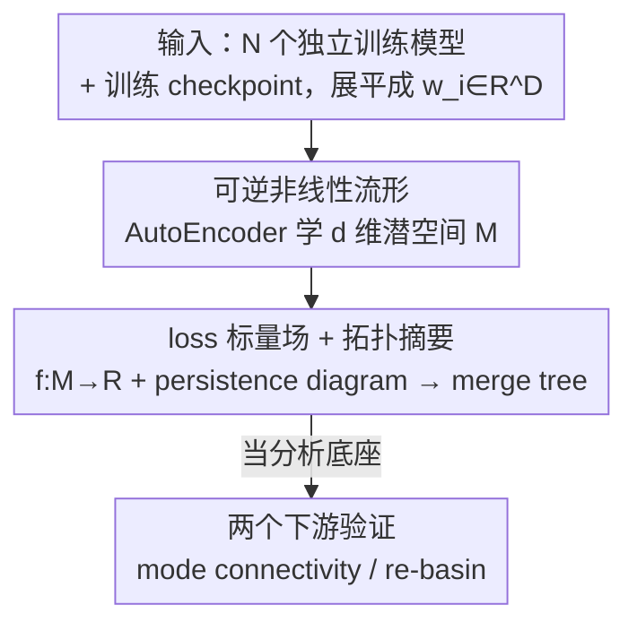

# Globscope: Toward a Global View of the Loss Landscape

**会议**: CVPR 2026  
**论文**: [CVF Open Access](https://openaccess.thecvf.com/content/CVPR2026/html/Mustaq_Globscope_Toward_a_Global_View_of_the_Loss_Landscape_CVPR_2026_paper.html)  
**代码**: 无（论文未提供）  
**领域**: 优化 / 损失景观分析 / 可视化  
**关键词**: 损失景观、全局可视化、自编码器、merge tree、mode connectivity  

## 一句话总结
用一个**可逆的自编码器**把一堆独立训练好的网络（每个模型展平成参数向量）压进二维潜空间，再在这个潜空间上把"loss"当作标量场做拓扑分析（merge tree），第一次给出能同时容纳**多个极小值/盆地及其连通关系**的全局损失景观可视化，并用它复现 mode connectivity 与置换对称（re-basin）等理论现象。

## 研究背景与动机
**领域现状**：损失景观（loss landscape）是参数空间 $\theta$ 上由损失函数 $L(\theta)$ 定义的高维曲面，它的几何编码了泛化、优化难度、模型相似性等关键信息。但几百万维的参数空间没法直接看，所以历来都靠降维可视化。经典做法（Goodfellow 等的线性插值、filter-wise 归一化方向、Hessian 主曲率方向）几乎全是**局部分析**——只刻画**单个**训练好的解附近的曲面形状。

**现有痛点**：局部方法天生看不到"多个解之间的关系"。要做**全局分析**（多个独立训练的模型分别落在哪些盆地、盆地之间怎么连通），现有手段要么是基于度量的（CKA 相似度、mode connectivity 标量、LossLens 的图视角），只给数字不给连续的几何图像；要么是聚类嵌入（t-SNE / Isomap），能把模型聚成团却**画不出盆地的几何组织与连通结构**。

**核心矛盾**：一个合格的全局景观可视化必须同时满足两个互相拉扯的条件——(i) 在**同一坐标系**里表示多个极小值及其盆地；(ii) **逆映射**：能把降维后的点映回原始参数空间，从而真的算出该点的 loss。线性方法（PCA）逆映射现成但表达不了多解诱导的非线性结构；非线性方法（Kernel-PCA、UMAP）表达力够却往往没有可靠的逆变换，实测画出来的全局图也没有有意义的几何信息。也就是说，"非线性表达力"和"可逆能算 loss"之间一直没被同时满足。

**本文目标**：造出第一个**连续、可逆、几何感知**的全局损失景观可视化工具，既能容纳多个极小值，又能把潜空间的点解码回权重去评估真实 loss。

**切入角度**：作者注意到自编码器（AE）天然是"编码器 + 可逆解码器"的结构——编码器给出低维嵌入提供表达力，解码器给出逆映射让你能算 loss。再叠一层拓扑数据分析（merge tree）把连续景观浓缩成可读的层级结构。

**核心 idea**：用**可逆 AE 学一个低维参数流形**代替线性投影/无逆非线性投影，再在流形上用 **merge tree** 做拓扑摘要，从而第一次让"全局损失景观"既看得见又算得出。

## 方法详解

### 整体框架
输入是一**批**独立训练好的神经网络（既包含同一条训练轨迹上每隔若干 epoch 采样的 checkpoint，也包含改了超参——batch size / 学习率 / weight decay 等——重训出的不同变体），把每个模型的可训练参数展平成一维向量 $w_i \in \mathbb{R}^D$。整条管线分三步把这堆高维向量变成一张可读的全局景观图：先用 AutoEncoder 把 $\{w_i\}$ 压进 $d$ 维潜空间（$d \ll D$，主实验取 $d=2$）得到流形 $M$；然后在 $M$ 上把每个潜空间点解码回权重、算出它的 loss，得到一个标量场 $f: M \to \mathbb{R}$；最后对这个标量场算 persistence diagram 去噪、简化，再构造 merge tree，把景观浓缩成"极小值—鞍点—盆地"的层级树。得到的流形与树再被当作**分析底座**，去投影 mode connectivity 曲线、可视化 re-basin 后的模型落在哪个盆地。

### 关键设计

**1. 可逆非线性流形：用自编码器同时拿到表达力和逆映射**

这一步直击"非线性表达力"与"可逆能算 loss"不可兼得的核心矛盾。作者把模型集合 $\{w_i\}_{i=1}^N$ 喂进一个自编码器 $A=(E,D)$，编码器 $E:\mathbb{R}^D\to\mathbb{R}^d$ 把高维参数向量映到 $d$ 维潜表示，解码器 $D:\mathbb{R}^d\to\mathbb{R}^D$ 再重建回原空间；编码器是三层逐渐变窄的隐层（宽度 128、64、16），后接维度 $d<16$ 的潜层。训练目标就是均方重建损失

$$\mathcal{L}_{rec} = \frac{1}{N}\sum_{i=1}^{N}\bigl\|\,w_i - D(E(w_i))\,\bigr\|_2^2 = \mathrm{MSE}(W,\hat{W}).$$

之所以选 AE 而不是 PCA：PCA 逆映射现成但只能线性表达，装不下多个独立解诱导的非线性结构；而 Kernel-PCA / UMAP 虽非线性，逆变换却只是近似且不稳定，实测重建误差高、画出的潜空间没有可读的盆地几何（见实验 Table 1）。AE 的解码器 $D$ 提供了一个**学到的、误差极小的逆映射**，于是潜空间里任意一点都能解码回权重、评估真实 loss——这正是"既看得见又算得出"的前提。另外，不同于前人把 AE 潜空间锁死在二维，本文允许 $d$ 灵活取 2/3/4 乃至更高（主结果取 $d=2$ 只为和已有方法对齐比较），从而能分析超出二维投影的高维非线性结构。

**2. loss 标量场 + merge tree 拓扑摘要：把连续景观浓缩成可读的层级树**

光有连续流形还不够直观——盆地有几个、谁和谁通过鞍点相连，肉眼在散点图上数不清。作者在流形 $M$ 上定义标量函数 $f:M\to\mathbb{R}$，给每个潜空间点赋上"其解码模型的 loss 值"，然后用 **merge tree（具体是 join tree）** 描述这个标量场的拓扑：它追踪**子水平集** $M_a=\{x\in M\mid f(x)\le a\}$ 的连通分量随阈值 $a$ 升高如何"出现"和"合并"——新分量在局部极小处诞生、在鞍点处合并，最终长成一棵树 $T_J$，**根节点**对应全局最大、**叶节点**代表各自独立的盆地/局部极小、**内部节点**是连接相邻盆地的鞍点。为避免树被大量低显著度的噪声特征淹没，先算 **persistence diagram** 挑出最显著的拓扑特征再做简化（实现上借助 ParaView 的 Topology Toolkit TTK 完成去噪与特征抽取）。这一步把"一张连续的彩色景观图"翻译成"七个叶子分别对应七个模型变体"的层级结构，让盆地数量与连通关系一目了然。

**3. 当分析底座：投影 mode connectivity 与 re-basin 来验证景观的几何忠实度**

前两步给出的是工具，这一步用两个已被理论刻画的现象来检验"这张景观图是不是真的忠实于原始 loss 几何"。其一是 **mode connectivity**：Garipov 等指出两个最优解常能被一条 loss 几乎不变的低损曲线连起来；作者按其算法在七个 ResNet56 变体间两两算出低损曲线，把曲线上的中间点投影到学到的二维景观上，看它们是否贴着可视化里的低损通路走。其二是**置换对称 / re-basin**：独立训练的模型考虑层间置换不变性后可被线性连通；作者用 DEEP-ALIGN 算出对齐置换矩阵、把一个模型 re-basin 到另一个的盆地，再投影到景观里，看 re-basin 后的网络是否真的落进了配对模型所在的同一盆地。这两个应用本身不提出新算法，而是把景观当"显微镜"去**复现并可视化**已知理论——既验证工具的几何忠实度，也反过来给 re-basin / mode connectivity 这类方法提供了前所未有的定性观察手段。

### 损失函数 / 训练策略
唯一的训练目标就是上面的重建损失 $\mathcal{L}_{rec}$（参数向量的 MSE），没有额外正则。merge tree 侧不涉及训练，是对已学好流形的后处理（persistence + 简化 + TTK 抽取临界点）。

## 实验关键数据

### 主实验
评测数据是七个 ResNet56 变体（A–G，通过改 batch size / 学习率 / weight decay 等生成）在 CIFAR-10 上训练，外加每条轨迹每 10 个 epoch 的 checkpoint。第一项硬指标是**重建误差**（衡量逆映射可靠性），AE 把 Kernel-PCA、UMAP 甩开几个数量级：

| 降维方法 | 重建损失（ResNet56，约 857 万参数，CIFAR-10） |
|----------|------|
| Kernel-PCA | 0.004270 |
| UMAP | 0.501484 |
| **AutoEncoder（本文）** | **0.000007** |

定性上（Figure 3），UMAP 和 Kernel-PCA 虽能给出连续潜空间，却看不出盆地几何；AE 学到的流形把不同变体的盆地清晰分开，且与聚类方法（MDS、Isomap）结论一致——变体 D 都被单独甩在景观一角。对 AE 流形做 merge tree 得到恰好**七个叶节点**，分别对应七个变体，完整捕捉了主要极小值与鞍点。

### 下游验证实验
**mode connectivity 投影**（Table 2）：把 mode connectivity 算法生成的真实低损曲线，与投影到学到二维景观上对应曲线的 loss 做逐点对比，两者 loss 范围高度吻合、中位绝对误差 $<0.01$：

| 模型对 | MC 曲线 loss 范围 | 景观投影 loss 范围 | MAE |
|--------|------|------|------|
| G–A | 2.308–2.335 | 2.304–2.331 | 0.007 |
| G–B | 2.305–2.352 | 2.317–2.353 | 0.016 |
| G–C | 2.304–2.322 | 2.310–2.326 | 0.011 |
| G–D | 2.308–2.322 | 2.305–2.335 | 0.011 |
| G–E | 2.306–2.322 | 2.305–2.323 | 0.006 |
| G–F | 2.305–2.358 | 2.307–2.358 | 0.014 |

作为对照，Kernel-PCA 分不开盆地、投影曲线毫无结构可言；UMAP 能分开盆地但内部几何被破坏，曲线在盆地里乱抖；只有 AE 给出平滑、可解释、贴合已知连通性的轨迹。

**re-basin 可视化**：用 DEEP-ALIGN 在 MNIST-MLP 上取 32 对独立训练模型、共 64 个 checkpoint 建联合景观；对每对算对齐置换并作用到其中一个模型，re-basin 后的网络在景观里**始终落进配对模型的同一盆地**，与理论预测一致。UMAP 因聚类能力也能把 re-basin 模型聚到一起，但其 loss 值范围极大（逆变换不稳、重建误差高所致）；Kernel-PCA 直接画不出有意义的景观。进一步把同一置换施加到整条训练轨迹的每个 epoch，变换后的轨迹会平滑地演化向对齐模型，说明对齐关系在训练全程大体稳定——AE 流形比其他方法更清晰地呈现了这一行为。

### 关键发现
- **可逆性是分水岭**：AE 重建损失（7e-6）比 Kernel-PCA / UMAP 低 3–5 个数量级，这直接决定了"潜空间点能否算出可信 loss"，也是 UMAP 那种 loss 范围动辄上万的失真根源。
- **merge tree 叶子数 = 变体数（7）**：拓扑摘要的临界点结构与真实模型集合自洽，说明流形没有把盆地揉乱或多造盆地。
- **景观对已知理论的双重复现**：mode connectivity 的 MAE $<0.01$、re-basin 模型落入同盆，两项独立证据共同支撑"学到的流形忠实于原始 loss 几何"。

## 亮点与洞察
- **用 AE 的解码器当"逆映射"是点睛之笔**：可视化领域长期被"非线性强但不可逆"卡住，作者把这个工程化的 AE 重建能力直接当成评估 loss 的逆变换，一举绕开 Kernel-PCA/UMAP 近似逆的不稳定——这是个可迁移的思路（任何需要"降维后还要回到原空间算目标值"的场景都能借鉴）。
- **把 loss 当潜空间上的标量场 + merge tree**，等于把"看散点猜盆地"变成"读一棵树数盆地"，定量化了原本只能定性的全局结构；且 merge tree 支持高于二维的分析，突破了前人 AE 景观锁死二维的限制。
- 最"啊哈"的是：这套工具不证明新定理，却给 mode connectivity、re-basin 这些**只有标量度量**的理论第一次提供了连续几何画面，把抽象结论"画"了出来。

## 局限与展望
- **潜维度受采样诅咒限制**：作者承认 $d$ 越大、采样需求指数增长，主结果只能停在 $d=2$，3D 仅放在附录，真正的高维全局结构仍难分析。
- **缺乏全局最优路径的客观评判**：原文坦言"没有有效办法验证网格里的路径是否真是最低损路径"，mode connectivity 的吻合只是视觉/范围层面的旁证，⚠️ 严格的最优性证明缺位。
- **AE 需对一批模型重训**：流形是针对给定模型集合学出来的，换一批模型或换架构（论文只在 ResNet56 / MNIST-MLP 上验证）需重新训练 AE，跨架构/大模型的可扩展性未知。
- 改进思路：引入显式保持 loss 距离的正则、或用更可控的归一化流替代 AE 以获得更稳的高维逆映射。

## 相关工作与启发
- **vs 局部可视化（Goodfellow 线性插值 / filter-wise 归一化 / Hessian 方向）**：它们只刻画单个解邻域的曲率，本文做的是跨多个独立解的全局视图，能看到盆地间连通——这是从"局部切片"到"全局地图"的跃迁。
- **vs 度量法（CKA / mode connectivity / LossLens）**：度量法只给数字或图结构、不产生连续几何，也无法在参数空间里合成新点；本文给出连续可逆流形，能解码任意潜点算 loss，从而揭示盆地几何与低能路径等度量法看不到的细节。
- **vs 非线性降维（Kernel-PCA / UMAP / t-SNE / Isomap）**：这些方法要么逆变换不可靠（Kernel-PCA、UMAP 重建误差高），要么根本没有逆映射（t-SNE），实测画不出有意义的全局盆地几何；本文以 AE 的低误差解码器兼得表达力与可逆性。
- **vs Elhamod & Karpatne 的 AE 景观**：本文沿用其 AE 降维思路，但解除了"二维潜空间"的限制并叠加 merge tree 拓扑摘要，把单纯的嵌入升级为可做拓扑分析的全局工具。

## 评分
- 新颖性: ⭐⭐⭐⭐ 首个能同时容纳多盆地、又可逆评估 loss 的全局景观可视化，切入点（AE 解码器当逆映射）干净有效。
- 实验充分度: ⭐⭐⭐ 重建误差 + 两个理论现象复现颇有说服力，但模型只覆盖 ResNet56/MNIST-MLP 两个小设置、主结果停在二维。
- 写作质量: ⭐⭐⭐⭐ 动机链条（局部→全局、表达力↔可逆的矛盾）讲得清楚，merge tree 与应用衔接自然。
- 价值: ⭐⭐⭐⭐ 给 model merging / 联邦学习 / 超参选择等几何感知决策提供了可视化底座，工具属性强。

<!-- RELATED:START -->

## 相关论文

- [\[ICLR 2026\] Rolling Ball Optimizer: Learning by Ironing Out Loss Landscape Wrinkles](../../ICLR2026/optimization/rolling_ball_optimizer_learning_by_ironing_out_loss_landscape_wrinkles.md)
- [\[ICML 2026\] Sharp Description of Local Minima in the Loss Landscape of High-Dimensional Two-Layer ReLU Networks](../../ICML2026/optimization/sharp_description_of_local_minima_in_the_loss_landscape_of_high-dimensional_two-.md)
- [\[ICML 2026\] Taming the Loss Landscape of PINNs with Noisy Feynman-Kac Supervision: Operator Preconditioning and Non-Asymptotic Error Bounds](../../ICML2026/optimization/taming_the_loss_landscape_of_pinns_with_noisy_feynman-kac_supervision_operator_p.md)
- [\[NeurIPS 2025\] Gradient Descent as Loss Landscape Navigation: a Normative Framework for Deriving Learning Rules](../../NeurIPS2025/optimization/gradient_descent_as_loss_landscape_navigation_a_normative_framework_for_deriving.md)
- [\[ICML 2025\] A Unified View on Learning Unnormalized Distributions via Noise-Contrastive Estimation](../../ICML2025/optimization/a_unified_view_on_learning_unnormalized_distributions_via_noise-contrastive_esti.md)

<!-- RELATED:END -->
