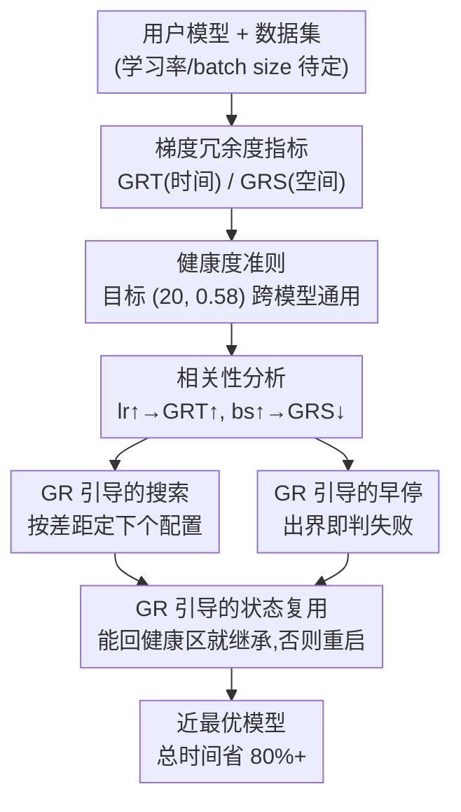

# GR-Gauge: Cost-efficient Training Configuration By Gauging the Gradient Redundancy

**会议**: CVPR 2026  
**论文**: [CVF Open Access](https://openaccess.thecvf.com/content/CVPR2026/html/Wang_GR-Gauge_Cost-efficient_Training_Configuration_By_Gauging_the_Gradient_Redundancy_CVPR_2026_paper.html)  
**代码**: 无  
**领域**: 优化 / 超参数优化 / 高效训练  
**关键词**: 超参数优化, 梯度冗余度, 学习率, batch size, 训练即服务  

## 一句话总结
把模型训练看成"梯度在时间和样本两个维度上的投票过程"，提出梯度冗余度指标 GRT/GRS 作为一把跨模型通用的"健康度尺子"，用它来指导学习率和 batch size 的超参搜索、早停和状态复用，从而在不跑昂贵验证集的前提下把达到目标精度的总时间最多压掉 80%+。

## 研究背景与动机
**领域现状**：越来越多没有专用 GPU 集群的非专业用户（个人、初创团队）通过云上的"训练即服务"（Training-as-a-Service, TaaS）来训自己的模型，只把模型、数据集和验证指标交给服务商，期望以较低成本拿到一个够用的模型。对服务商来说，关键是替任意用户模型自动配好两个最经典的超参——**学习率和 batch size**。配错（过大或过小）会直接拖垮"达到目标精度所需时间"，而且存在"关键学习期"现象：早期超参没配对、又没及时纠正，最终性能会被**永久性损坏**，后期再怎么调也救不回来。

**现有痛点**：主流的超参数优化（HPO）方法——网格/随机搜索、贝叶斯优化（BO）做"搜索"，Successive Halving / Hyperband / BOHB 做"调度/早停"——几乎都靠**外部验证指标**（如 accuracy、F1）来做决策。作者点出这套依赖在三处吃亏：① 验证本身贵，在大验证集上跑一遍很慢（如 RTX 2080 Ti 上 BERT 算一次 F1 要约 250 秒）；② 验证曲线在训练早期未必"形状良好"，好超参早期也可能表现差，据此早停容易误杀；③ 验证指标只能告诉你"这个配置差"，**没法指出下一步该往哪个方向搜**。

**核心矛盾**：HPO 想要"对任意超参都通用"，于是只能用验证指标这种与超参无关的外部信号；但通用性是用效率换来的——既慢又指导不了搜索方向。当目标超参专门收窄到学习率和 batch size 时，其实可以**牺牲这种通用性来换效率**，转而利用训练内部、随手就能拿到的梯度信号。

**切入角度**：作者把训练重新看成一个**二维梯度投票过程**——时间维上，不同迭代的全局梯度持续给"参数更新方向"投票；空间维上，一个 mini-batch 内不同样本的局部梯度给"本次迭代的更新方向"投票。投票要高效，就既不能"冗余"（不同投票者梯度高度一致，等于在重复同样信息、白烧算力），也不能"对抗"（梯度互相打架导致参数震荡）。两种都是"不健康"状态，对应训练低效。

**核心 idea**：用**梯度冗余度**（gradient redundancy）量化这种健康度——在时间维和空间维各定义一个指标 GRT、GRS。作者发现"健康区间"在不同模型间居然高度稳定（GRT 大致都靠近 20，GRS 大致落在 [0.5, 0.65]），于是这把尺子可以当作一个**跨模型通用的 gauge**，反过来指导 HPO 该搜哪个学习率/batch size、何时早停、能否复用旧状态。

## 方法详解

### 整体框架
GR-Gauge 的核心逻辑分两步：先**测**（定义并验证两把尺子）、再**用**（拿尺子指导 HPO 的三个动作）。

第一步是动机分析里建立的两件事：(1) 定义 GRT（时间维梯度冗余）和 GRS（空间维梯度冗余）两个指标；(2) 在 5 个代表性模型（ResNet18/NeuMF/BERT/Stable-Diffusion/Llama-3.2-3B）上实测，确认在"关键学习期"早期（如第 50 次迭代）测到的 (GRT, GRS) 既能预示整段训练的最终效率，又有一个跨模型几乎一致的健康目标 $(GR_T^*, GR_S^*) = (20, 0.58)$。

第二步是把这把尺子接到 HPO 上。关键的可操作性来自一个相关性分析：GRT/GRS 本身不能直接调，但它们和学习率/batch size 存在**单调关系**——学习率越大 GRT 越大，batch size 越大 GRS 越小。于是测到当前 (GRT, GRS) 与目标的差距，就能反推出学习率/batch size 该往哪个方向、调多少。基于此，GR-Gauge 在一次 HPO 里同时做三件事：**GR 引导的早停**（周期性检查是否出界）、**GR 引导的搜索**（按差距定下一个配置）、**GR 引导的状态复用**（换配置时尽量继承上一次的训练状态而非从头来）。

### 关键设计

**1. 梯度冗余度 GRT / GRS：把"训练健康度"变成两个可测的标量**

这两把尺子是全文地基，针对的痛点是"验证指标又贵又指导不了方向"——改用随手可得的梯度统计量来刻画训练是否健康。

时间维冗余 GRT 衡量不同迭代之间全局梯度的一致程度。借鉴 Adam/AdaGrad 的一二阶矩思路，定义为

$$GR_T(t) = d \cdot \frac{\hat{v}_t}{\hat{m}_t^2}$$

其中 $d$ 是梯度维度，$\hat{m}_t = m_t/(1-\beta^t)$、$\hat{v}_t = v_t/(1-\beta^t)$ 是偏差校正后的一阶/二阶矩（$m_t = (1-\beta)g_{t-1} + \beta m_{t-1}$，$v_t$ 类似但用 $g_{t-1}^2$，$\beta$ 默认 0.9）。直觉上 $\hat m_t^2$ 是"平均梯度"的能量、$\hat v_t$ 是"梯度平方"的平均，二者之比刻画了跨迭代梯度方向有多发散——一致性高（冗余）时比值偏一个方向，震荡时偏另一个方向（按坐标逐维算再取全局平均）。

空间维冗余 GRS 衡量一个 batch 内不同样本局部梯度的一致程度：

$$GR_S(t) = \frac{\left\| \sum_{i=1}^{B} g_{ti}^2 \right\|_1}{\left\| \sum_{i=1}^{B} g_{ti} \right\|_2^2}$$

其中 $B$ 是全局 batch size，$g_{ti}$ 是样本 $i$ 在迭代 $t$ 的梯度。分子是各样本梯度平方和（不管方向的"总能量"），分母是先求和再取范数平方（方向一致才大）。样本梯度越一致，分母越接近分子、比值越小；越打架则比值越大。关键的好处是：GR 指标是从**原始梯度**算的，在 momentum、smoothing 这些优化器特定变换之前——这让健康度准则成为各种优化器**共享的目标**，不同优化器只是用不同策略去逼近同一个健康态，而不是改变了健康态本身。

**2. 跨模型通用的健康度准则：一个目标 (20, 0.58) 走天下**

光有指标还不够——必须知道"多少算健康"，否则没法当尺子用。作者在 5 个模型上把不同 (学习率, batch size) 跑出来，用一个自定义指标 **AUPC**（Area-Under-Performance-Curve，把每个模型的性能曲线归一化到 [0,100%] 后求训练全过程的平均归一化性能，AUPC 越高表示"用更少算力拿到更好性能"）来统一刻画"训练效率"。结果（论文 Fig.1）显示每个模型都存在一个 (GRT, GRS) 的**健康区**能给出高 AUPC，印证了"冗余过大或过小都低效"的判断；更关键的是这些健康区**跨模型高度相似**——GRT 理想值都靠近 20，GRS 理想值大多在 [0.5, 0.65]（取均值 0.58 当默认目标）。作者强调这不是巧合，有理论推导和 OpenAI 工业实践佐证（细节在附录）。Fig.2 进一步显示：在整个关键学习期内，配得好的 run 会持续稳定在目标 GRT 附近，配错的 run 则持续偏离并伴随验证性能退化——说明这个目标不是只在某一早期快照上有效，而是贯穿关键期都有指导意义。⚠️ AUPC、健康区间的具体数值以原文为准。

**3. (GRT, GRS)-引导的三动作 HPO：把尺子接到搜索/早停/复用上**

这是把指标真正变现的地方，靠的是一个**单调相关性**（论文 Theorem 1/2）：$\frac{\partial}{\partial \eta}\mathbb{E}[GR_T] > 0$（学习率 $\eta$ 越大 GRT 越大）、$\frac{\partial}{\partial B}\mathbb{E}[GR_S] < 0$（batch size $B$ 越大 GRS 越小）。有了方向，三件事顺势而成：

- **早停（scheduling）**：每隔 $k$（默认 5）次迭代检查一次 GRT/GRS，只要出健康区就判这个 trial 失败、立刻换下一个；每个新 trial 跳过前 20 次迭代以躲开启动时的梯度抖动。
- **搜索（searching）**：按当前值与目标 $(20, 0.58)$ 的差距定下一个配置——GRT 低于目标就调大学习率、反之调小；GRS 超过目标就调小 batch size、反之调大。具体地（Algorithm 1）学习率按 $(GR_T^*/GR_T)^{1/\xi_T}$ 缩放（$\xi_T$ 控制激进程度，默认 3），batch size 按 $(GR_S/GR_S^*)^{1/\xi_S}$ 缩放（$\xi_S$ 默认 1）；当相对偏差 $|GR_T - GR_T^*|/GR_T^* \le 0.1$ 时就不动，避免在目标附近反复抖。
- **状态复用（state-reuse）**：这是少有人探索的角度。换配置时不一定要从头训——作者发现很多情况下不重置训练状态、直接在新配置下继续训，(GRT, GRS) 仍能在一个豁免期（默认 20 次迭代）内回到健康区，且最终精度与重训相当。于是 GR-Gauge 换配置时先尝试**继承旧状态**，若豁免期后 GR 指标回不到健康区（说明模型已被改坏、不可逆）才从头重启。这样能省下大量 trial 失败浪费的算力。

为了让"算 GR 指标"本身别太贵，作者用了两招降本：GRS 按**每设备**而非每样本粒度算（保持有效性同时大减计算）；GRT/GRS 只用**采样的 $L = 5\times10^7$ 个参数**（按层大小比例采样）而非全模型来估——已有工作表明同层参数的梯度统计模式相近。

### 损失函数 / 训练策略
GR-Gauge 不改训练目标本身，是套在 HPO 外层的配置策略，所有模型都用 AdamW 优化器。它只在"关键学习期"内做健康度检查（关键期用与 [58] 相同的梯度范数法识别，阈值 0.01，通常约占总迭代的 10%），关键期把训练塑造成好模式后，剩余阶段交给 AdamW 这类经典优化器即可。新引入的超参 $k, T, \xi_T, \xi_S$ 实测对模型不敏感，可用统一默认值。

## 实验关键数据
实验在 16 节点、共 64 张 RTX 2080 Ti 的集群上完成，覆盖推荐（NeuMF/MovieLens）、图像分类（ResNet18/CIFAR10）、问答（BERT/SQuAD）、文生图（Stable-Diffusion-v1-5/Naruto BLIP）、指令微调（Llama-3.2-3B/FineTome-100k）5 类任务。基线为 RS、SH、HB、BOHB、CFO 五种。

### 主实验
达到不同验证目标所需 GPU-Time（以 GR-Gauge 为 1×，其余为相对倍数；越大越慢）：

| 模型 | 目标 | RS | SH | HB | BOHB | CFO | GR-Gauge |
|------|------|------|------|------|------|------|----------|
| ResNet18 | 85% | 9.13× | 8.56× | 7.81× | 7.53× | 3.54× | **977s** |
| ResNet18 | 89% | 6.27× | 6.02× | 5.47× | 4.23× | 3.11× | **2010s** |
| BERT | 80% | 24.8× | 7.47× | 6.96× | 6.52× | 6.37× | **5090s** |
| BERT | 85% | 18.5× | 9.27× | 7.86× | 7.95× | 3.32× | **11000s** |
| Diffusion | 92% | N/A | 3.55× | 3.61× | 2.50× | 2.08× | **2350s** |
| Llama3 | 59% | N/A | 2.62× | 1.83× | 1.30× | 2.56× | **75300s** |

ResNet18 达到 85% 时，GR-Gauge 比第二名 BOHB 省 63.6% 时间。固定 GPU-Time 预算下能达到的验证性能（%）：

| 模型 | 预算 | RS | SH | HB | BOHB | CFO | GR-Gauge |
|------|------|------|------|------|------|------|----------|
| ResNet18 | 1000s | 63.50 | 58.93 | 58.08 | 63.09 | 25.09 | **85.64** |
| BERT | 20000s | 55.14 | 74.15 | 74.27 | 74.72 | 74.45 | **87.47** |
| Diffusion | 1000s | 84.41 | 84.22 | 82.02 | 81.62 | 84.88 | **88.60** |

BERT 在 20000s 时 GR-Gauge 已到 87.47% F1，其余方法全在 75% 以下。注：NeuMF 在 200s 这种极小预算下 GR-Gauge（36.18）反而不如几种基线，说明优势在中长预算更明显。

### 消融实验
拆掉三种健康度引导后达到目标所需时间（相对 GR-Gauge 的倍数）：

| 配置 | ResNet18[89%] | NeuMF[68%] | BERT[85%] | Llama3[59%] | 说明 |
|------|------|------|------|------|------|
| no-R（去状态复用） | 1.17× | 1.27× | 3.39× | 2.32× | 仅丢复用就变慢 |
| no-RS（再去搜索引导） | 1.46× | 2.16× | 4.45× | 4.71× | 进一步变慢 |
| no-RT（再去早停引导） | 1.96× | 2.70× | 7.95× | 2.47× | 最慢 |
| GR-Gauge（完整） | 1.00× | 1.00× | 1.00× | 1.00× | — |

状态复用对最终精度的影响（最佳配置下）：

| 方法 | ResNet | NeuMF | BERT | Diffusion | Llama3 |
|------|------|------|------|------|------|
| 从头训 | 90.75 | 69.86 | 88.40 | 95.75 | 60.54 |
| GR-Gauge（复用） | 89.51 | 69.11 | 88.19 | 94.17 | 60.81 |

### 关键发现
- **三种引导缺一不可**：no-R < no-RS < no-RT 的时间逐级增大，说明早停、搜索、状态复用三处健康度引导都有用，去掉哪个都掉效率，其中早停引导（no-RT 最慢）和搜索引导贡献尤为关键。
- **状态复用几乎不伤最终精度**：复用版与从头训的差距各模型都很小（如 ResNet 90.75→89.51），Llama3 甚至略升（60.54→60.81），说明"换配置继承旧状态"在多数情况下不会造成不可逆损坏，省时是赚的。
- **GR-Gauge 自带超参不敏感**：$k, T, \xi_T, \xi_S$ 会影响性能（如 $k=1$ 检查太频增开销、$k=50$ 太疏伤搜索），但统一默认值跨模型都工作得不错——用户无需像调学习率/batch size 那样逐模型调它们。
- **指标开销很低**：维护 GRT/GRS 的额外开销通常 <4%（如 BERT 在 85% 目标下 GRT 占 1.96%、GRS 占 3.15%），相对它带来的加速完全可接受。

## 亮点与洞察
- **"训练 = 二维梯度投票"这个视角很有启发**：把时间维（跨迭代）和空间维（跨样本）拆开，分别用一致性来诊断"白烧算力"和"参数震荡"两种病，比单看 loss 曲线更接近问题本质。
- **健康度跨模型通用**是最让人"啊哈"的点：(GRT, GRS) 的理想值在 ResNet、BERT、扩散模型、LLM 上居然几乎一致（≈20、≈0.58），把"调超参"从"每个模型重新摸索"变成"瞄准一个固定靶心"。
- **GR 算在原始梯度上**这一设计巧妙：绕开了优化器的 momentum/smoothing 变换，使健康度成为优化器无关的共享目标，迁移性强。
- **状态复用**是少被探索的省钱角度：把"换配置就重训"改成"先试着继承、回不到健康区才重启"，可迁移到任何带 trial 的搜索流程（如架构搜索、调度搜索）。

## 局限与展望
- **目标超参窄**：方法专为学习率和 batch size 设计，是用"超参通用性"换效率，换层数等架构类超参时这套梯度信号未必适用。
- **健康靶心的普适边界存疑**：(20, 0.58) 来自 5 个模型的实测+附录推导，是否覆盖更大规模模型、更多任务（如 RL、超大 batch 分布式）仍待验证 ⚠️。
- **状态复用有精度代价**：虽然实测差距小，但毕竟存在（如 Diffusion 95.75→94.17），对精度极敏感的场景需权衡。
- **小预算下不占优**：NeuMF 200s 这种极低预算时不如部分基线，说明 GR-Gauge 需要一定关键期长度来发挥作用，对超短训练任务收益有限。

## 相关工作与启发
- **vs BOHB / Hyperband / Successive Halving**：它们靠验证指标做早停和搜索，既贵（要跑验证集）又只能判"好坏"、指不出方向；GR-Gauge 改用内部梯度信号，既省掉验证开销，又能凭单调相关性直接推出"学习率/batch size 该往哪调"。
- **vs CFO（基于超梯度的在线连续调参）**：CFO 在整个训练过程中持续在线缩放超参，但其好坏仍依赖初始配置；GR-Gauge 抓的是"关键学习期"把初始配置一次配对，二者关注点不同（初始化 vs 全程在线）。
- **vs 在线调度（gradually scaling lr/bs）类方法**：这类方法的良好表现仍依赖初始超参，而关键学习期理论指出初始没配对会永久损坏性能——GR-Gauge 正是补上"早期把初始超参快速配对"这块。

## 评分
- 新颖性: ⭐⭐⭐⭐⭐ "二维梯度投票 + 跨模型通用健康靶心"是少见且自洽的新视角，状态复用角度也鲜有人做。
- 实验充分度: ⭐⭐⭐⭐ 覆盖 5 类任务 5 个基线，端到端/固定预算/消融/敏感性/开销都有，但模型规模偏中小、缺超大规模验证。
- 写作质量: ⭐⭐⭐⭐ 动机—指标—相关性—三动作的逻辑链清晰，公式定义到位；部分关键数值依赖附录。
- 价值: ⭐⭐⭐⭐⭐ 直击 TaaS 场景的真实痛点，省时 80%+ 且开销 <4%，对成本敏感用户实用价值高。

<!-- RELATED:START -->

## 相关论文

- [\[CVPR 2026\] InTrain: Intrinsic Trainability for Zero-Cost Neural Architecture Search](intrain_intrinsic_trainability_for_zero-cost_neural_architecture_search.md)
- [\[NeurIPS 2025\] Cost-Sensitive Freeze-thaw Bayesian Optimization for Efficient Hyperparameter Tuning](../../NeurIPS2025/optimization/cost-sensitive_freeze-thaw_bayesian_optimization_for_efficient_hyperparameter_tu.md)
- [\[ICML 2026\] Cost-Aware Stopping for Bayesian Optimization](../../ICML2026/optimization/cost-aware_stopping_for_bayesian_optimization.md)
- [\[CVPR 2026\] Dynamic Momentum Recalibration in Online Gradient Learning](dynamic_momentum_recalibration_in_online_gradient_learning.md)
- [\[AAAI 2026\] Beyond the Mean: Fisher-Orthogonal Projection for Natural Gradient Descent in Large Batch Training](../../AAAI2026/optimization/beyond_the_mean_fisher-orthogonal_projection_for_natural_gradient_descent_in_lar.md)

<!-- RELATED:END -->
