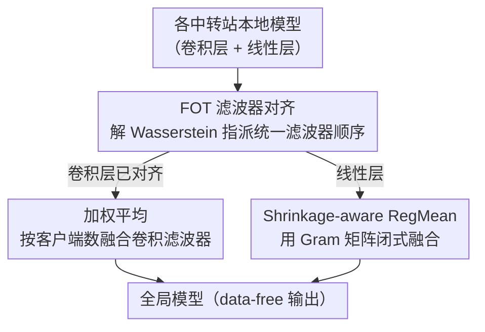

# HFedATM: Hierarchical Federated Domain Generalization via Optimal Transport and Regularized Mean Aggregation

**会议**: CVPR 2026  
**论文**: [CVF Open Access](https://openaccess.thecvf.com/content/CVPR2026/html/Nguyen_HFedATM_Hierarchical_Federated_Domain_Generalization_via_Optimal_Transport_and_Regularized_CVPR_2026_paper.html)  
**代码**: 未提供  
**领域**: 优化 / 联邦学习  
**关键词**: 联邦学习, 域泛化, 最优传输, 分层聚合, RegMean

## 一句话总结
本文首次形式化「分层联邦域泛化（HFedDG）」并推导出按客户端/中转站/服务器三级分解的泛化误差界，据此提出 HFedATM——一个无需访问数据、只改服务器聚合步骤的即插即用方法：先用 Filter-wise Optimal Transport 把各中转站的卷积滤波器对齐，再用 Shrinkage-aware RegMean 闭式融合线性层，在视觉与 NLP 基准上稳定提升 FedAvg/FedProx/FedSR/FedIIR 等多种基线。

## 研究背景与动机
**领域现状**：联邦学习（FL）让多个客户端不共享原始数据就能协同训练。当客户端规模变大时，单中心服务器成为通信与计算瓶颈，于是「分层联邦学习（HFL）」在客户端和服务器之间插入一层中转站（station）分担聚合，提升可扩展性。

**现有痛点**：HFL 解决了可扩展性，却没解决「域偏移」——模型在训练域上学得好，部署到未见域就崩。而已有的「联邦域泛化（FedDG）」方法（FedSR、FedIIR、FedProx 等）几乎都假设单服务器架构，没人系统研究过分层场景下的泛化。少数 HFL 变体（FedRC、MTGC）虽改进了聚合，却需要交换中间统计量或多层梯度，**违反了 DG 场景固有的「data-free（不泄露数据/统计）」约束**，且缺乏理论保证。

**核心矛盾**：分层结构带来了一层额外的「中转站之间的分布散度」，而朴素的权重平均（weight averaging）会把语义不对齐的滤波器、统计不兼容的线性层硬糊在一起，反而放大这层散度。问题根子是：跨站聚合时既要 data-free，又要在语义层面对齐，二者难以兼顾。

**本文目标**：(1) 把 HFedDG 形式化并给出可分解的泛化误差界，看清「分层」到底从哪几项影响 DG；(2) 设计一个 data-free、不改客户端训练、能挂在任意 FedDG 基线上的分层聚合方法，直接压缩中转站间散度。

**切入角度**：作者从误差界出发——当局部 FedDG 训练已把站内（intra-station）风险压低后，剩下的泛化缺口主要由「站间（inter-station）散度」$(\eta,\omega)$ 主导。于是只要在聚合这一步把站间散度打下来即可，无需碰客户端。

**核心 idea**：站间散度来自两处——卷积滤波器**索引错位**和线性层**站点特有的通道相关性**。用最优传输对齐前者、用激活几何感知的 RegMean 融合后者，一次性收掉站间 gap。

## 方法详解

### 整体框架
HFedATM 只作用在「中转站 → 服务器」这一层聚合上，输入是各中转站本地训练好的模型权重，输出是一个泛化更好的全局模型；客户端侧训练完全不变，因此可以直接套在 FedAvg/FedProx/FedSR/FedIIR 之上。

整个流程分两步走：**第一步**用 FOT（Filter-wise Optimal Transport）解一个 Wasserstein 指派问题，把所有中转站的卷积滤波器排到统一且语义一致的顺序上，消除「同一个边缘检测器在 A 站是第 1 个滤波器、在 B 站却是第 10 个」这种索引错位；**第二步**在对齐后的特征空间里做聚合——卷积层因为已经对齐，直接按客户端数加权平均即可；线性层则用 Shrinkage-aware RegMean，借助各客户端上传的 Gram 矩阵做闭式融合，从而尊重激活几何而非简单参数平均。两步合起来，正好对应误差界里被点名的两类散度：FOT 压 $\omega$（卷积特征空间的站间宽度），RegMean 压 $\eta$（线性层残差散度）。整个过程除了对齐后的权重和（可加 DP 噪声的）Gram 矩阵外不泄露任何数据。

### 关键设计

**1. 分层泛化误差界：看清「站间散度」才是分层场景下的病根**

本文先把 HFedDG 形式化（定义 1：站集合 $E$、每站客户端集合 $C_e$，站点不持有/不访问原始数据，目标域 $P^\star_{XY}$ 未见），再把单服务器的 DG 界推广成三级分解的 Theorem 1。其上界为

$$D_{\text{target}}(h) \le \sum_{e}\sum_{i}\rho^\star_{e,i}D_{e,i}(h) + \tfrac{1}{2}\sum_e \rho^\star_e\omega_e + \tfrac{1}{2}\omega + \sum_e \rho^\star_e\eta_e + \eta + \lambda_{\mathcal{H}}(P^\star_X, P^\dagger_X)$$

其中 $D_{e,i}(h)$ 是客户端级风险，$(\eta_e,\omega_e)$ 是某站内部（intra-station）的内散度与宽度，$(\eta,\omega)$ 是跨站（inter-station）的内散度与宽度。这个分解的价值在于：当局部用强 FedDG 方法训练后，$D_{e,i}(h)$ 已经很小，于是泛化缺口几乎完全由散度项主导——而其中跨站项 $(\eta,\omega)$ 正是「分层」相比单服务器多出来的那部分。这就把「该优化什么」精确地指给了聚合步骤，也解释了后面实验里为何「客户端学得越好（FedSR/FedIIR），HFedATM 增益越大」：只有局部散度被压下去后，跨站这部分才成为可摘的果子。Theorem 2 进一步给出，HFedATM 输出的假设满足比朴素平均更紧的目标域误差界。

**2. FOT Alignment：用最优传输把跨站卷积滤波器排成同一个语义顺序**

卷积滤波器的索引是任意的——index-wise 平均会把语义不同的滤波器糊在一起，破坏特征。FOT 在每个卷积层 $l$ 上把每个 kernel 展平并 $\ell_2$ 归一化得到 $\widetilde{w}^{(l)}_e[a]$，以平方欧氏距离构造代价矩阵 $D^{(l)}_{e,e'}(a,b)=\lVert\widetilde{w}^{(l)}_e[a]-\widetilde{w}^{(l)}_{e'}[b]\rVert_2^2$，固定 station 1 作参考，对其余每个站求解离散最优传输（指派）问题

$$\Pi^{(l)}_{1,e}=\arg\min_{\Pi\in U}\;\langle\Pi, D^{(l)}_{1,e}\rangle,\quad U=\{\Pi\mid \Pi\mathbf{1}=\mathbf{1},\ \Pi^\top\mathbf{1}=\mathbf{1},\ \Pi\ge 0\}$$

即在 Birkhoff 多胞形上找一个一一置换（可用 Sinkhorn 类求解器快速解），然后把置换作用回原滤波器 $W^{(l)}_e\leftarrow\Pi^{(l)}_{1,e}W^{(l)}_e$，让所有站点对应索引处的滤波器捕捉同一视觉原语；若各站滤波器空间尺寸不同，再用双线性插值 resize 到参考站尺寸。由于指派代价只依赖 kernel 数 $k$、resize 又很便宜，这一步开销很小却扫清了后续平均的语义障碍——对齐之后，卷积层就可以放心地按客户端数 $\gamma_e=|S_e|$ 做加权算术平均 $\overline{W}^{(l)}[a]=\sum_e\gamma_e W^{(l)}_e[a]/\sum_e\gamma_e$。

**3. Shrinkage-aware RegMean：用 Gram 矩阵在激活几何下闭式融合线性层**

线性层编码的是各站数据特有的**通道间相关性**，即便滤波器对齐了，直接参数平均仍会把不兼容的统计混到一起。本文沿用 RegMean 思路：在本地 FedDG 最后一个 epoch 的最后一次前向中，客户端 $\langle e,i\rangle$ 记录每个全连接层的激活矩阵 $X^{(l)}_{e,i}\in\mathbb{R}^{d\times m}$ 并算出本地 Gram $G^{(l)}_{e,i}=X^{(l)\top}_{e,i}X^{(l)}_{e,i}$；可选地对其做范数裁剪 $\lVert G\rVert_2\le C$ 并加高斯噪声以满足差分隐私，再连同权重更新一起上传。站点（无原始数据）只对收到的 Gram 取平均 $G^{(l)}_e=\frac{1}{|S_e|}\sum_{i\in S_e}G^{(l)}_{e,i}$，并做对角收缩

$$\widehat{G}^{(l)}_e=\alpha G^{(l)}_e+(1-\alpha)\,\mathrm{diag}(G^{(l)}_e),\quad 0\le\alpha\le 1$$

默认 $\alpha=0.75$（收缩是为了在 Gram 估计噪声大/病态时稳住求逆）。最终服务器在 $\{\widehat{G}^{(l)}_e,\widetilde{W}^{(l)}_e\}$ 上求解一个「data-free 但感知站间差异」的目标 $\arg\min_W\sum_e\lVert W^\top X^{(l)}_e-\widetilde{W}^{(l)\top}_e X^{(l)}_e\rVert_F^2$，用 $\widehat{G}^{(l)}_e$ 替换 $X^{(l)\top}_e X^{(l)}_e$ 后得到闭式解

$$W^{(l)}_{\text{ATM}}=\Big(\sum_e \widehat{G}^{(l)}_e\Big)^{-1}\Big(\sum_e \widehat{G}^{(l)}_e\,\widetilde{W}^{(l)}_e\Big)$$

它本质上是用各站激活的二阶统计加权融合权重，让融合结果在所有站的激活几何下都尽量「行为一致」，比纯参数平均更尊重数据分布。整条链路里离开站点的只有收缩后的 Gram 和对齐权重，原始数据始终不出站。

### 损失函数 / 训练策略
HFedATM 不引入新的训练损失，客户端仍按原 FedDG 方法（FedAvg/FedProx/FedSR/FedIIR）训练；它只是一层服务器侧聚合算子。关键超参为收缩系数 $\alpha=0.75$、卷积加权 $\gamma_e=|S_e|$（按活跃客户端数）。OT 用熵正则的 Sinkhorn 求解（数十次迭代收敛，每层数十毫秒级 CPU 开销）。⚠️ 完整算法伪代码与定理证明放在原文附录，本文正文未给全。

## 实验关键数据

实验模拟 10 个中转站 × 每站 10 客户端 = 100 客户端的 HFL 系统，用异质划分参数 $\lambda\in\{1.0,0.1,0.0\}$ 控制客户端级域异质性（$\lambda$ 越小越异质）。视觉用 LeNet-5（默认）/ResNet-18/VGG-11，NLP 用 RoBERTa-base（默认）/DeBERTa-base；数据集为 PACS、Office-Home、TerraInc（视觉）与 Amazon Reviews（NLP）。

### 主实验
把 HFedATM 挂到四种 FedDG 基线上，对比站间聚合用朴素平均（+Avg）还是 +HFedATM（节选 $\lambda=1.0$，准确率 %）：

| 基线 | 聚合 | PACS-P | Office-Home-Pr | TerraInc-L38 | Amazon-B |
|------|------|--------|----------------|--------------|----------|
| FedAvg | +Avg | 81.8 | 64.3 | 45.7 | 70.3 |
| FedAvg | +HFedATM | **83.7** | **65.7** | 45.5 | **78.1** |
| FedSR | +Avg | 84.1 | 68.9 | 47.9 | 72.2 |
| FedSR | +HFedATM | **87.7** | **72.6** | **51.3** | **80.9** |
| FedIIR | +Avg | 85.1 | 69.4 | 48.3 | 72.6 |
| FedIIR | +HFedATM | **88.3** | **73.5** | **51.9** | **81.3** |

跨骨干网络鲁棒性（平均准确率 %，节选）：

| 基线 | 聚合 | ResNet-18 PACS | VGG-11 PACS | DeBERTa Amazon |
|------|------|----------------|-------------|----------------|
| FedSR | +Avg | 89.4 | 88.3 | 77.3 |
| FedSR | +HFedATM | **92.8** | **91.7** | **81.2** |
| FedIIR | +Avg | 89.7 | 88.7 | 77.9 |
| FedIIR | +HFedATM | **93.0** | **91.9** | **81.9** |

可见 HFedATM 对四种基线、多种骨干都稳定加分；在 NLP（Amazon Reviews）上增益尤其大（FedAvg+Avg 70.3 → +HFedATM 78.1，跨站间通信那一栏从 ~70 跳到 ~78）。作者还对比了 HFL 专用方法 MTGC、FedRC：HFedATM（配 FedAvg/FedSR）在四个数据集上准确率最高，同时保持 data-free 且更简单。

### 消融实验
分别去掉 FOT、RegMean（$\lambda=1.0$，准确率 %）：

| 配置 | PACS | Office-Home | TerraInc | Amazon Reviews |
|------|------|-------------|----------|----------------|
| FedSR w/o FOT | 80.2 | 63.2 | 44.2 | 73.0 |
| FedSR w/o RegMean | 79.7 | 65.9 | 45.3 | 76.1 |
| FedSR Full | **81.3** | **67.7** | **47.5** | **81.0** |
| FedIIR w/o FOT | 78.5 | 65.7 | 44.6 | 78.3 |
| FedIIR w/o RegMean | 77.4 | 65.8 | 45.8 | 77.3 |
| FedIIR Full | **82.2** | **67.6** | **48.8** | **81.6** |

### 关键发现
- **两个组件互补，缺一不可**：去掉 FOT 主要伤视觉卷积特征（如 FedIIR-PACS 82.2 → 78.5），去掉 RegMean 主要伤 NLP/线性层（如 FedSR-Amazon 81.0 → 76.1）；Full 始终最好。这正对应理论——FOT 压卷积特征空间的站间散度 $\omega$，RegMean 压线性层残差散度 $\eta$。
- **客户端学得越好，HFedATM 增益越大**：在强域偏移（$\lambda\le0.1$）下 FedAvg/FedProx 的局部散度本就大，分层聚合能捞回的有限；换成 FedSR/FedIIR 把局部散度压低后，HFedATM 才能显著收掉剩余的站间 gap——与 Theorem 2 一致。
- **差分隐私下稳健**：对所有客户端 Gram 矩阵加高斯噪声，$\varepsilon\ge1$ 时准确率下降 <2% 且仍优于 +Avg；即便 $\varepsilon=0.1$ 也优雅退化。作者还指出 $G=X^\top X$ 是多对一映射、代数上不可逆，加噪后重建 $X$ 更困难。
- **开销可控**：每轮训练时延仅增加 <10%（OT 用 Sinkhorn 数十毫秒/层 + 每客户端最后一轮多一次无反传前向）；服务器峰值显存——视觉 LeNet-5 从 ~2.6–2.8 MB 增到 <4 MB，Amazon（RoBERTa）只多 ~27 MB（占整条 pipeline <1%）。

## 亮点与洞察
- **「先诊断再开药」的范式**：先推三级分解的误差界把病根定位到 inter-station divergence，再用两个针对性模块分别压 $\omega$ 和 $\eta$——理论和方法严丝合缝，消融结果也正好印证（FOT 治视觉、RegMean 治 NLP）。这种「界—模块」一一对应的写法很值得借鉴。
- **即插即用、不碰客户端**：只改服务器聚合一步，能挂在任意 FedDG 基线上，工程落地成本极低；且保持 data-free，只让收缩后的 Gram 离站。
- **OT 解滤波器置换**：把「跨模型滤波器对齐」建模成 Birkhoff 多胞形上的指派问题，代价只依赖 kernel 数 $k$，是一个轻量但语义正确的对齐手段，可迁移到任意需要融合多个 CNN 的场景（如模型合并、Federated Merging）。
- **Gram 矩阵 + 收缩做隐私-效用折中**：用二阶激活统计而非原始激活做闭式融合，天然不可逆、可叠加 DP，且对角收缩稳住病态求逆——是一个实用的隐私友好聚合配方。

## 局限与展望
- **方法主要面向 CNN + 线性层结构**：FOT 专门对齐卷积滤波器，RegMean 处理线性层；对纯 Transformer（注意力权重、LayerNorm）这类结构如何对齐，正文未深入（NLP 实验里 RegMean 实际只作用在最后的分类头上，⚠️ 以原文为准）。
- **依赖局部 FedDG 足够强**：理论与实验都表明，若客户端局部散度大（弱基线 + 强异质 $\lambda\to0$），HFedATM 能捞回的有限——它解决的是「站间」而非「站内」问题。
- **Gram 矩阵仍有攻击面**：虽不可逆且可加 DP，但共享二阶统计是否在某些威胁模型下泄露信息，作者只在附录讨论，正文未给完整结论。
- **实验骨干偏小**：视觉默认 LeNet-5，最大到 ResNet-18/VGG-11，未在大规模视觉骨干或更深 NLP 模型上验证可扩展性。

## 相关工作与启发
- **vs 朴素权重平均（HFedAvg）**：HFedAvg 直接 index-wise 平均，破坏滤波器语义、忽略激活几何；HFedATM 先 OT 对齐再激活几何感知融合，理论上给出更紧的目标域误差界。
- **vs FedRC / MTGC（HFL 专用）**：它们交换中间统计量或多层梯度来处理异质性，隐私风险高、优化更重；HFedATM 只在聚合步动手、保持 data-free（仅出收缩 Gram），更简单且准确率反而更高。
- **vs 单服务器 FedDG（FedSR / FedIIR / FedProx）**：这些方法假设单服务器、改的是客户端训练；HFedATM 与之正交——挂在它们之上专门收掉分层结构多出来的站间 gap，二者叠加增益最大。

## 评分
- 新颖性: ⭐⭐⭐⭐⭐ 首次形式化 HFedDG 并给出三级分解误差界，用 OT + RegMean 针对性收站间散度，理论与方法高度自洽。
- 实验充分度: ⭐⭐⭐⭐ 覆盖视觉/NLP、多基线、多骨干、消融、DP 与开销分析；但骨干偏小、缺大模型验证。
- 写作质量: ⭐⭐⭐⭐ 「界—模块」对应讲得清楚，公式完整；部分细节（NLP 上 RegMean 作用范围、完整算法）压在附录。
- 价值: ⭐⭐⭐⭐⭐ data-free、即插即用、几乎零客户端改动且开销 <10%，是分层 DG 场景实用的 drop-in 聚合层。

<!-- RELATED:START -->

## 相关论文

- [\[CVPR 2026\] Domain Sensitive Federated Learning with Fisher-Informed Pruning](domain_sensitive_federated_learning_with_fisher-informed_pruning.md)
- [\[CVPR 2026\] FedAdamom: Adaptive Momentum for Improved Generalization in Federated Optimization](fedadamom_adaptive_momentum_for_improved_generalization_in_federated_optimizatio.md)
- [\[CVPR 2025\] Federated Learning with Domain Shift Eraser](../../CVPR2025/optimization/federated_learning_with_domain_shift_eraser.md)
- [\[ICML 2026\] Delayed Momentum Aggregation: Communication-efficient Byzantine-robust Federated Learning with Partial Participation](../../ICML2026/optimization/delayed_momentum_aggregation_communication-efficient_byzantine-robust_federated_.md)
- [\[NeurIPS 2025\] Optimal Rates for Generalization of Gradient Descent for Deep ReLU Classification](../../NeurIPS2025/optimization/optimal_rates_for_generalization_of_gradient_descent_for_deep_relu_classificatio.md)

<!-- RELATED:END -->
