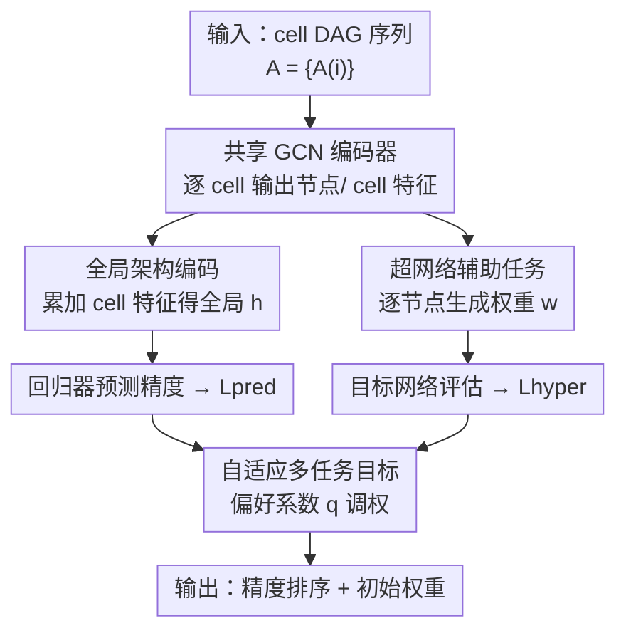

# HyperNAS: Enhancing Architecture Representation for NAS Predictor via Hypernetwork

**会议**: CVPR 2026  
**论文**: [CVF Open Access](https://openaccess.thecvf.com/content/CVPR2026/html/Lv_HyperNAS_Enhancing_Architecture_Representation_for_NAS_Predictor_via_Hypernetwork_CVPR_2026_paper.html)  
**代码**: 未公开  
**领域**: NAS / AutoML / 神经预测器  
**关键词**: 神经架构搜索, 性能预测器, 超网络, 多任务学习, 少样本

## 一句话总结
HyperNAS 把"超网络生成架构权重"当作一个辅助任务挂在 NAS 性能预测器旁边，让两者共享同一个 GCN 编码器，再配上带偏好系数的自适应多任务损失，从而在标注样本极少时学到泛化更好的架构表示——CIFAR-10 上用至少 5 倍更少的样本就拿到 97.60% top-1。

## 研究背景与动机
**领域现状**：神经架构搜索（NAS）本质是一个昂贵的双层优化问题，瓶颈在于"评估一个候选架构要把它训练到收敛"。为了绕开这个开销，predictor-based NAS 用一个代理数据集（architecture–accuracy 对）训练一个回归器，直接预测未见架构的精度，从而把评估从"训一遍网络"压成"一次前向"。

**现有痛点**：作者指出现有神经预测器有两个老毛病。其一是**孤立的 cell 编码**——在 cell-based 搜索空间里，主流做法假设整个网络由若干相同的 cell 按手工层级堆叠，于是只编码一个 cell 就拿去评估，这样虽然省算力，却丢掉了 cell 之间的 reduction 操作、cell 间依赖这些**宏观结构**信息。其二是**泛化差**——预测器只在很小的代理数据集上训练，而架构之间的关系高度非线性，简单预测器很难从少量样本里学出底层规律，容易过拟合到见过的 architecture–accuracy 对上。

**核心矛盾**：少样本 + 架构关系复杂这两件事叠在一起。样本一少，预测器就只会死记硬背训练对，而不是理解"什么样的架构会好"。已有的两条改良路线——数据增强（合成同构架构对、半监督）和表示增强（换更强的 MLP / GCN / GIN / Transformer 编码器）——要么得额外造数据对，要么只在编码器结构上打转，没从根本上给预测器补上"理解架构间关系"的监督信号。

**切入角度**：作者注意到超网络（hypernetwork）天生擅长"按输入动态生成权重"，过去 SMASH、GHN 直接拿超网络当架构评估器用，但受限于超网络自身的优化目标，排序能力一般。HyperNAS 的转念是：**不让超网络直接当裁判，而是把它降格成一个辅助任务**——让它给各种架构生成权重，借这个任务逼共享编码器去刻画跨架构的共性。

**核心 idea**：用"超网络生成架构权重"作辅助任务，和性能预测主任务共享同一个 GCN 编码器联合训练，让编码器在被迫服务两个任务的过程中学到更可迁移、更不易过拟合的架构表示。

## 方法详解

### 整体框架
HyperNAS 是一个**多任务范式**：输入是一个 cell-based 架构（被表示成若干 cell 的 DAG 序列 $A=\{A^{(i)}\}_{i=1}^N$，每个 cell 是上三角邻接矩阵 $E^{(i)}$ + 节点特征 $V^{(i)}$），输出是该架构的预测精度（搜索时用来排序）以及一组可直接拿来初始化的权重。中间靠一个**共享 GCN 编码器** $G$ 把每个 cell 顺序编码成节点特征 $\tilde V^{(i)}$ 和 cell 特征 $z^{(i)}$，然后分叉成两条任务支路：蓝色的**性能预测支路**把 cell 特征聚成全局特征 $h$ 再回归出精度，绿色的**超网络支路**拿节点特征逐 cell 生成权重 $w^{(i)}$ 并施加到目标网络上算损失。两条支路的损失最后被一个带偏好系数 $q$ 的**自适应多任务损失**统一调权。训练完后，评估阶段可以只留预测支路、关掉超网络支路，让它退化成一个普通的快速预测器。

### 关键设计

**1. 全局架构编码：让预测器看到 cell 之间的宏观结构，而不是只看一个孤立 cell**

针对"孤立 cell 编码丢掉宏观信息"的痛点，HyperNAS 不再只编码单个 cell，而是用同一个共享 GCN 把所有 cell **顺序串起来**编码。GCN 对 DAG 的更新同时走前向和反向信息流：$V_{l+1}=\tfrac12\mathrm{ReLU}(EV_lW_l^+)+\tfrac12\mathrm{ReLU}(E^\top V_lW_l^-)$。关键在于，第 $i$ 个 cell 进 GCN 之前，它的节点特征要先叠加上前一个 cell 的特征：$V^{(i)}=\{v+z^{(i-1)}\mid v\in V^{(i)}\}$，其中 $z^{(i)}=\mathrm{pool}(\tilde V^{(i)})$、$z^{(0)}=0$。这样每个 cell 特征都携带了前序 cell 的上下文，连"结构相同但位置不同"的 cell 都能被区分开。最后把所有 cell 特征平均成全局嵌入 $h=\tfrac1N\sum_i z^{(i)}$ 喂给回归器 $\hat y=f_\theta(h)$，预测损失用 MSE。作者还试过用 cell 位置编码代替"叠加前序 cell 特征"，效果更差——说明真正起作用的是 cell 间的特征传递，而非简单的位置标号。

**2. 超网络辅助任务：用"生成权重"这个副任务给预测器补上跨架构的监督信号**

针对"少样本下泛化差"的痛点，HyperNAS 挂了一个**共享超网络** $H$（实现为多头 MLP，固定输出维度、用不同 head 适配不同 kernel size），输入是共享 GCN 产出的逐节点特征 $v\in\tilde V$，输出该节点对应操作的权重 $w_v=H(v;\phi)$，整架构权重 $w=\{w^{(i)}\}_{i=1}^N$。生成的权重被施加到目标网络上，在一个**独立的辅助数据集** $D_{aux}$（如 CIFAR-10）上用标准交叉熵算 $L_{hyper}$——注意超网络自己没有损失函数，它"借"目标网络的任务来获得监督。训练时通过链式法则同时回传更新超网络参数 $\phi$ 和 GCN 参数 $\phi$（编码器）。这个辅助任务带来两重收益：其一，超网络在所有架构间**软权重共享**，逼共享编码器去做跨架构的知识迁移、隐式正则化模型复杂度，从而缓解过拟合；其二，超网络按输入架构的拓扑动态调权重，扩大了模型对架构空间的覆盖。和 SMASH/GHN 直接拿超网络当裁判不同，这里超网络只是个"陪练"，主裁判仍是预测器。

**3. 自适应多任务目标：用偏好系数 q 在 Pareto 前沿上做个性化探索，兼顾两任务的平衡与稳定**

两条支路要联合训练，固定权重的线性加权（Linear Scalarization）需要大量调参且易陷次优。已有的不确定性自适应损失（按任务方差自动调权、方差小的任务权重大）能收敛到 Pareto 前沿，但忽略了"用户对各任务重要性的偏好"。HyperNAS 在加权前**非线性地缩放任务损失**，引入偏好系数 $q$：

$$L_{total}=\sum_{t\in T}\frac{L_t^{(q-1)}}{2u_t^2}\cdot L_t+\ln(1+u_t^2)$$

其中 $u_t$ 是每个任务可学习的自适应权重，$\ln(1+u_t^2)$ 是防止 $u_t$ 过大的正则项。作者证明引入 $q$ 只改变任务间的相对权重、不破坏 Pareto 最优性（可重标定出一个 scaler $s$ 使权重和为 1），因此收敛解仍保证 Pareto 最优。$q=2$ 时退化为已有的自适应损失；实验里 $q=1.5$ 在多数数据划分上让两个任务都达到最优，比 $q=2$ 更好。

### 损失函数 / 训练策略
总损失即上式的 $L_{total}$，由预测任务 $L_{pred}$（MSE）和超网络任务 $L_{hyper}$（交叉熵）两项构成；$D_{aux}$ 与训练预测器用的 architecture–accuracy 对相互独立。搜索阶段在 DARTS / ViT 搜索空间用进化算法做策略，预测器评估候选；CIFAR-10 上 HyperNAS 只用 200 个采样对（单任务变体 HyperNAS-P 用 1000 个），评估时默认关掉超网络支路以省时。

## 实验关键数据

### 主实验
在 NAS-Bench-101/201 上用 Kendall's Tau 衡量"预测精度与真实精度的排序相关性"。下表为 NAS-Bench-201 的排序结果（训练样本占比极低），HyperNAS 在所有划分上都领先，相对当时 SOTA 的 PINAT 平均提升约 0.13–0.17。

| 训练样本占比 | NP (GCN) | PINAT (Transformer) | HyperNAS (GCN) | 对 PINAT 提升 |
|--------------|----------|---------------------|----------------|---------------|
| 0.25% (39)   | 0.655    | 0.494               | **0.667**      | +0.173        |
| 0.5% (78)    | 0.626    | 0.549               | **0.677**      | +0.128        |
| 1% (156)     | 0.696    | 0.631               | **0.765**      | +0.134        |
| 3% (469)     | 0.757    | 0.706               | **0.836**      | +0.130        |

搜索实验（DARTS 空间 CIFAR-10 → 迁移 ImageNet；ViT 空间 ImageNet）显示，HyperNAS 用极少 query 就达到/超过 SOTA：

| 搜索场景 | 指标 | HyperNAS | 对照 SOTA | 备注 |
|----------|------|----------|-----------|------|
| CIFAR-10 (DARTS) | best top-1 | 97.60% | PINAT 97.58% | 仅 200 query；单任务变体 HyperNAS-P 97.61%，搜索成本仅 0.1 GPU·天 |
| ImageNet (DARTS 迁移) | top-1 | 75.4% | PINAT 75.1% | 6.6M 参数 |
| ImageNet (ViT-Base) | top-1 | 82.4% | AutoFormer 82.4% | 仅 ~20% query 成本，搜索 <1 分钟 |

### 消融实验
| 配置 | 现象 | 说明 |
|------|------|------|
| NP（孤立 cell 编码） | 排序最弱 | 传统单 cell 编码基线 |
| HyperNAS-P（全局编码，单任务） | 全数据划分超过 NP | 验证全局编码方案的增益 |
| HyperNAS（+ 超网络辅助任务） | 多数划分超过 HyperNAS-P | 软权重共享促进跨架构信息交换 |
| HyperNAS-H（仅超网络，去掉预测器） | 验证精度低于完整模型 | 反向印证两任务互补 |
| $q=1.25/1.5/2/3$ | $q=1.5$ 最优 | 偏好系数调节 Pareto 前沿，优于 $q=2$ 的常规自适应损失 |

### 关键发现
- **全局编码靠的是"cell 间特征传递"而非位置编码**：把前序 cell 特征 $z^{(i-1)}$ 换成位置嵌入后排序明显变差（t-SNE 上特征与精度不再相关），说明叠加前序上下文才是宏观信息的来源。
- **超网络辅助任务在样本极少时增益最大**：t-SNE 显示加入超网络后架构特征按精度聚类更清晰；它还能把"位置嵌入版"掉下去的性能重新补回来，证明其在学习底层架构规律上的作用。
- **多任务范式两头都赚**：完整 HyperNAS 的预测器排序优于单任务 HyperNAS-P，其超网络验证精度也高于单超网络 HyperNAS-H，说明两任务相容、互相促进。

## 亮点与洞察
- **把"评估器"降格成"陪练"是关键转念**：以往超网络要么当主裁判（SMASH/GHN），要么不用；HyperNAS 让它只提供辅助监督，规避了超网络排序能力差的硬伤，又借它给共享编码器灌入跨架构知识——一个被压制的任务反而成了泛化的来源。
- **无需造数据对**：相比依赖合成同构架构对的 HAAP 等增强方法，HyperNAS 的额外监督来自"在 $D_{aux}$ 上评估生成的权重"，省掉了构造增强对的工程。
- **偏好系数 $q$ 可迁移到其他多任务场景**：把不确定性自适应损失改成"先非线性缩放再加权"，并证明不破坏 Pareto 最优性，这套做法可复用到任何需要个性化平衡多任务的训练上。

## 局限与展望
- 作者承认超网络对**极大架构**仍可能带来不小的时间开销，未来计划在保留辅助任务范式的同时优化效率、提升可扩展性。
- ⚠️ 论文未公开代码，超网络多头 MLP 的具体结构、$D_{aux}$ 规模等细节散落在附录，缓存正文里仅给出梗概，复现需参照原文附录。
- 自己看：实验主要在 cell-based / ViT 搜索空间，"全局编码"依赖"架构由 cell 串成"这一前提；对非 cell 结构（如不规则连接的大模型）是否仍奏效未验证。横向比较里不同搜索空间的 query 预算与难度不同，accuracy 数字不宜直接横比大小。

## 相关工作与启发
- **vs SMASH / GHN**：它们直接用训练好的超网络当架构评估器、靠继承权重评估，受超网络优化目标束缚导致排序次优；HyperNAS 改用超网络作辅助任务、由独立预测器负责排序，组合两者优点。
- **vs PINAT / TNASP（Transformer 预测器）**：它们在编码器结构上发力（Transformer 表示更强）；HyperNAS 仅用 GCN 主干，靠"全局编码 + 辅助任务"就在少样本排序上反超，说明监督信号的设计比单纯堆编码器容量更有效。
- **vs HAAP / Semi-NAS（数据增强路线）**：它们造合成数据对或用半监督扩样本；HyperNAS 不造数据对，而是用超网络在辅助数据上提供监督，是"表示增强"与"额外监督"的结合。

## 评分
- 新颖性: ⭐⭐⭐⭐⭐ 首个把超网络当辅助任务来提升 NAS 预测器泛化的工作，转念巧妙
- 实验充分度: ⭐⭐⭐⭐ 覆盖五个搜索空间 + 多组消融，但代码未放、部分细节在附录
- 写作质量: ⭐⭐⭐⭐ 动机清晰、公式与 Pareto 证明完整，图表略密
- 价值: ⭐⭐⭐⭐ 少样本 NAS 排序的实用增益明显，偏好系数损失可迁移

<!-- RELATED:START -->

## 相关论文

- [\[CVPR 2026\] InTrain: Intrinsic Trainability for Zero-Cost Neural Architecture Search](intrain_intrinsic_trainability_for_zero-cost_neural_architecture_search.md)
- [\[CVPR 2026\] Enhancing Visual Representation with Textual Semantics: Textual Semantics-Powered Prototypes for Heterogeneous Federated Learning](enhancing_visual_representation_with_textual_semantics_textual_semantics_powered_p.md)
- [\[CVPR 2026\] The Power of Decaying Steps: Enhancing Attack Stability and Transferability for Sign-based Optimizers](the_power_of_decaying_steps_enhancing_attack_stability_and_transferability_for_s.md)
- [\[CVPR 2026\] FedRG: Unleashing the Representation Geometry for Federated Learning with Noisy Clients](fedrg_unleashing_the_representation_geometry_for_federated_learning_with_noisy_c.md)
- [\[ICML 2026\] Enhancing LLM Training via Spectral Clipping](../../ICML2026/optimization/enhancing_llm_training_via_spectral_clipping.md)

<!-- RELATED:END -->
