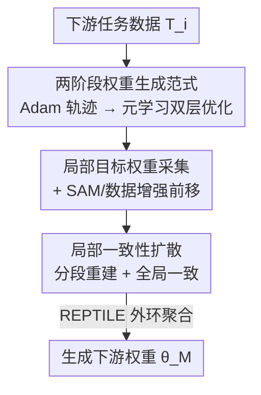

# Learning to Learn Weight Generation via Local Consistency Diffusion

**会议**: CVPR 2026  
**论文**: [CVF Open Access](https://openaccess.thecvf.com/content/CVPR2026/html/Guan_Learning_to_Learn_Weight_Generation_via_Local_Consistency_Diffusion_CVPR_2026_paper.html)  
**代码**: 待确认  
**领域**: 优化 / 元学习 / 扩散模型  
**关键词**: 权重生成, 扩散模型, 元学习, 局部一致性, 无梯度微调

## 一句话总结
Mc-Di 把元学习的双层优化和扩散式权重生成结合起来，并把原本只学"全局最优权重"的扩散过程改造成"局部一致性扩散"——让模型沿优化轨迹上的多个中间权重逐段重建，从而在迁移学习、小样本、域泛化、语言模型微调等需要频繁更新权重的任务上同时拿到更高精度和更低推理延迟。

## 研究背景与动机

**领域现状**：用扩散模型 $f^G_\phi$ 直接为下游任务"生成"神经网络权重 $\theta$ 是近年新兴方向（OCD、D2NWG 等），它把训练/微调变成无梯度的生成过程，对迁移学习、小样本学习、域泛化、语言模型微调这类需要频繁换权重的场景很有吸引力。

**现有痛点**：作者指出两个具体短板。其一是**泛化性差**——VAE、Hypernetwork、OCD、D2NWG 等都建立在单层优化（single-level optimization）框架上，缺乏跨任务的知识迁移能力，换到新任务上性能就掉。其二是**缺少局部监督信号**——现有方法只把"全局最优权重 $\theta_M$"当作生成目标，忽略了优化轨迹上那些中间权重；而这些中间权重恰恰编码了优化器（如 Adam）的策略性细节。

**核心矛盾**：直接把轨迹上的中间权重 $\theta_{i\times d}$ 也塞进 vanilla 扩散当生成目标，会破坏局部目标与全局目标的一致性——因为 vanilla 扩散把每个目标都当成"去噪 $T$ 步后才到达的终点 $x_T$"，多个目标互相打架，引入的局部目标反而拖累整体性能。所以"既要用局部目标、又要保持全局一致"成了一个非平凡的开放问题。

**本文目标**：(1) 给权重生成注入跨任务泛化能力；(2) 让扩散过程能利用优化轨迹上的局部目标而不破坏全局最优；(3) 在不增加额外时间开销的前提下改善权重生成范式的收敛性。

**切入角度**：把"学会生成权重"看成一个元学习问题（用 REPTILE 做双层优化），并重新定义扩散的目标序列——不再是"$T$ 步到终点"，而是"在 $T/k$ 步间隔上依次命中 $\theta_d, \theta_{2d}, \dots, \theta_{k\times d}=\theta_M$"。

**核心 idea**：用"局部一致性扩散"沿优化轨迹分段重建权重，再用元学习把这套生成能力跨任务迁移。

## 方法详解

### 整体框架
Mc-Di 分两个阶段。**权重准备阶段**：对每个下游任务用真实优化器 Adam 跑一遍训练，记录完整优化轨迹 $\{\theta_0, \theta_1, \dots, \theta_M\}$（$\theta_0$ 是高斯初始化权重，$M$ 是下游训练 epoch 数），再以固定间隔 $d=M/k$ 均匀采样出 $k$ 个局部目标权重 $\{\theta_d, \theta_{2d}, \dots, \theta_{k\times d}\}$。**元训练阶段**：用 REPTILE 这套双层优化，外环维护元学习器 $f^G_\phi$，内环给每个局部目标分配一个 base learner $f^G_{\phi_i}$，用"局部一致性扩散"去建模 $\theta_0 \to \theta_{i\times d}$ 的生成过程，并以 ResNet101 算出的任务嵌入 $\text{Emb}_{T_i}$ 作为条件。**推理阶段**：和 vanilla 扩散一致，从高斯噪声出发迭代去噪，逐段命中局部目标，最终恢复出全局最优权重 $\theta_M$。

### 关键设计

**1. 两阶段权重生成范式：用元学习的双层优化换跨任务泛化**

针对"单层优化框架泛化性差"的痛点，Mc-Di 把权重生成拆成"权重准备 + 元训练"两段，并用 REPTILE 实现双层优化。外环元学习器 $f^G_\phi$ 在大量任务上学习一个好的初始化，内环为采样到的目标 $\theta_{i\times d}$ 临时复制出 $\phi_i$ 并做 $K$ 步更新 $\phi_i \leftarrow \phi_i - \eta\nabla_{\phi_i} L^{loc}_i$，外环再以 $\phi \leftarrow \phi + \frac{\zeta}{B}\sum_{i=1}^{B}(\phi_i - \phi)$ 聚合各内环的位移。和只做单层优化的 OCD 相比，这种双层结构让扩散模型学到的是"如何快速适配新任务的生成策略"，而不是死记某个任务的权重分布——消融里 OCD（单层扩散）与 Mv-Di（加了双层优化）的对比正是为了凸显这一点。

**2. 局部目标权重采集 + 功能组件前移：把优化器的策略细节喂给扩散，还顺手提了收敛**

现有方法只盯着全局最优 $\theta_M$，丢掉了轨迹中段的信息。Mc-Di 在 Adam 优化过程中按间隔 $d$ 均匀采样，得到 $\{\theta_d, \theta_{2d}, \dots, \theta_{k\times d}\}$，这些中间权重"封装了优化器的策略性细节"，给扩散提供了更密的监督信号。更巧的是，作者把两个功能组件**从内环前移到权重准备阶段**：用 Sharpness-Aware Minimization（SAM）约束全局最优附近的曲率、压低 Hessian 最大特征值 $\lambda$，从而改善范式的收敛上界（Theorem 2 给出 $L_D(\hat\theta)-L_D(\theta^*) \le \frac{\lambda}{2}(c+\frac{2\psi}{\mu})(1-\frac{\mu}{l})^M$，收敛只随 $\lambda$ 线性变化）；再用数据增强提鲁棒性。因为元训练阶段只要攒够几个权重就能同步开跑，这些组件的加入"不产生额外时间开销"。

**3. 局部一致性扩散：让分段目标各就各位，而不是互相打架**

这是全文核心。Vanilla 扩散把 $\theta_{i\times d}$ 和 $\theta_M$ 都当成"去噪 $T$ 步后的同一个终点 $x_T$"，导致局部目标和全局目标不一致、引入局部目标反而掉点。局部一致性扩散重新定义目标：从高斯噪声出发，让局部目标 $\theta_d, \theta_{2d}, \dots, \theta_{M=k\times d}$ 在**等间隔 $T/k$ 步**处被依次命中。对应的局部一致性损失为

$$L^{loc}_i = \mathbb{E}_{t\in[0,\,i\times T/k)}\left\|\sqrt{1-\bar\alpha^i_t}\,f^G_\phi(x_t,t) - \sqrt{1-\bar\alpha_t}\,\epsilon\right\|^2,\quad x_t = \sqrt{\bar\alpha^i_t}\,\theta_{i\times d} + \sqrt{1-\bar\alpha^i_t}\,\epsilon$$

其中 $\bar\alpha^i_t = \prod_{j=t}^{i\times T/k - 1}\alpha_j$（⚠️ 公式据 OCR 缓存转录，以原文为准）。当 $k=1$ 时它退化为 vanilla 扩散（此时模型只建模 $\theta_M$，作者称这一退化版为 Mv-Di），所以 Mc-Di 是已有方法的严格推广。一个反直觉的收益是**计算更省**：虽然 $L^{loc}$ 名义复杂度 $O(k\times T/2)$ 高于 vanilla 的 $O(T)$，但把半径 $T$ 的搜索空间切成 $k$ 个半径 $T/k$ 的小问题后，靠近 $\theta_0$ 的 $L^{loc}_1$ 最先收敛、再递归求解后段，实测在固定 GPU 预算下 MSE 更低、可容忍更少的扩散步数。

### 损失函数 / 训练策略
内环目标用局部一致性损失 $L^{loc}=\mathbb{E}_{i\in(0,k]}L^{loc}_i$；外环用 REPTILE 聚合。默认超参：段数 $k=3$、扩散步 $T=20$、内环学习率 $\eta=0.005$、元学习率 $\zeta=0.001$、内环步数 3、元训练 6000 epoch，全文实验统一沿用。$k$ 的选择来自 Omniglot/Mini-ImageNet 上 segment number vs. 重建 MSE 的权衡曲线，$k=3$ 在多个数据集上最稳。

## 实验关键数据

平台为 2×A100，所有结果取 5 次独立实验的均值与标准差。

### 主实验

迁移学习（ImageNet-1k 元训练，跨数据集评测，全程不用标签微调）：

| 数据集 | ICIS | GHN3 | D2NWG | Mv-Di(ours) | Mc-Di(ours) |
|--------|------|------|-------|-------------|-------------|
| CIFAR-10 | 61.75 | 51.80 | 60.42 | 61.14 | **63.57** (↑1.82) |
| CIFAR-100 | 47.66 | 11.90 | 51.50 | 49.62 | 50.69 (↓0.81) |
| STL-10 | 80.59 | 75.37 | 82.42 | 81.43 | **85.02** (↑2.60) |
| Aircraft | 26.42 | 23.19 | 27.70 | 29.37 | **29.97** (↑2.27) |
| Pets | 28.71 | 27.16 | 32.17 | 30.28 | **35.16** (↑2.99) |
| 延迟(ms) | 9.2 | 14.5 | 6.7 | 4.7 | **3.5** (×1.9 加速) |

Mc-Di 在 6 个任务里 5 个最优（CIFAR-100 仅落后最佳 0.81%），相对次优方法平均提升 2.42%，同时比最快的 D2NWG 还快 1.9×。小样本（5-way）、域泛化（DomainNet）上结论一致：DomainNet (5,1)/(20,5) 上 Mc-Di 达 69.05/72.86，较次优平均高 4.47%/5.28%，比 OCD 快 1.7×。语言模型微调（生成 RoBERTa-base 的 LoRA 矩阵）：MRPC 89.43 / QNLI 91.86，精度与梯度微调相当，但微调速度快 3.6×~4.0×。

### 消融实验

主成分增量消融（Omniglot / Mini-ImageNet，5-way 1-shot 精度）：

| 配置 | C1 元学习+扩散 | C2 局部目标 | C3 局部一致性 | Omniglot | Mini-ImageNet |
|------|:---:|:---:|:---:|---------|---------------|
| REPTILE | | | | 95.39 | 47.07 |
| OCD | | | | 95.04 | 59.76 |
| Mv-Di | ✓ | | | 96.65 | 62.53 |
| Tw-Di | ✓ | ✓ | | 94.28 | 49.72 |
| Mc-Di | ✓ | ✓ | ✓ | **97.34** | **64.87** |

### 关键发现
- **C3（局部一致性）是关键**：只加局部目标却不维护一致性的 Tw-Di（94.28 / 49.72）反而比 Mv-Di（96.65 / 62.53）更差，验证了"裸塞局部目标会打架"的论断；补上局部一致性损失后 Mc-Di 才反超到最高。
- **段数 $k$ 的甜点在 3**：$k=1$ 退化为 vanilla 扩散；$k>1$ 靠局部目标提精度，但太大也无益，跨数据集权衡后定 $k=3$。
- **功能组件免费午餐**：SAM、数据增强前移到权重准备阶段后，精度-GPU 时间曲线整体上移而收敛速率不变，即"不增时间开销也能涨点"。

## 亮点与洞察
- **把扩散的"终点"概念改成"等间隔打点"**：vanilla 扩散只关心 $x_T$，Mc-Di 让 $T/k$ 步间隔上各有一个局部目标，这是个很巧的重定义——既用上了优化轨迹的密集监督，又用 $k=1$ 退化保证了对已有方法的兼容（理论上严格推广 OCD/D2NWG 等）。
- **"名义更贵、实际更省"的反直觉结论**：把半径 $T$ 的搜索切成 $k$ 个 $T/k$ 的子问题，前段目标先收敛再带动后段，固定 GPU 预算下 MSE 反而更低——分而治之在扩散步数上的体现值得借鉴。
- **功能组件解耦前移**：把 SAM/数据增强从内环挪到权重准备阶段，既改善收敛（压 Hessian 特征值）又不占元训练时间，这种"在数据侧而非优化侧动刀"的思路可迁移到其他双层优化框架。

## 局限与展望
- **依赖真实优化轨迹**：每个任务都要先用 Adam 跑出完整轨迹再采样，权重准备阶段的成本（尤其大模型）没有充分讨论；轨迹质量直接决定局部目标质量。
- **理论假设偏强**：收敛分析依赖 $l$-smooth、$\mu$-strongly convex 假设，神经网络损失面并不满足，作者也承认这是为可分析性所做的简化。
- **验证规模有限**：语言模型实验只到 RoBERTa-base + LoRA 二分类任务，是否能扩到更大模型、生成式任务、更长轨迹仍待验证。⚠️ 部分公式据缓存转录，复现前建议核对原文附录。

## 相关工作与启发
- **vs OCD / D2NWG**：它们用单层优化的扩散模拟权重优化，只建模全局最优 $\theta_M$；Mc-Di 用双层优化（元学习）+ 局部目标，泛化性与精度都更强，且把它们纳为 $k=1$ 的特例。
- **vs REPTILE / Meta-Baseline（梯度方法）**：纯梯度元学习推理时要算梯度、延迟高（Omniglot 上 20ms 量级）；Mc-Di 无梯度生成权重，延迟降到个位数 ms。
- **vs Meta-Diff / Meta-Hypernetwork**：同样面向小样本权重生成，但 Mc-Di 的局部一致性扩散额外利用了轨迹中段监督，在 Mini/Tiered-ImageNet 上提升明显。

## 评分
- 新颖性: ⭐⭐⭐⭐⭐ 把扩散目标从"单终点"重定义为"等间隔多目标"并证明是已有方法的推广，思路新且自洽。
- 实验充分度: ⭐⭐⭐⭐ 覆盖迁移/小样本/域泛化/LM 微调四类任务并配增量消融，但 LM 侧规模偏小。
- 写作质量: ⭐⭐⭐⭐ 动机—理论—实验链条清晰，图 1/图 3 把"局部一致性"讲得直观。
- 价值: ⭐⭐⭐⭐ 无梯度、低延迟的权重生成对频繁换权重场景有实用价值。

<!-- RELATED:START -->

## 相关论文

- [\[CVPR 2026\] DABO: Difficulty-Aware Bayesian Optimization with Diffusion-Learned Priors](dabo_difficulty-aware_bayesian_optimization_with_diffusion-learned_priors.md)
- [\[ICLR 2026\] LCA: Local Classifier Alignment for Continual Learning](../../ICLR2026/optimization/lca_local_classifier_alignment_for_continual_learning.md)
- [\[CVPR 2026\] Defending Unauthorized Model Merging via Dual-Stage Weight Protection](defending_unauthorized_model_merging_via_dual-stage_weight_protection.md)
- [\[CVPR 2026\] DC-Merge: Improving Model Merging with Directional Consistency](dc-merge_improving_model_merging_with_directional_consistency.md)
- [\[CVPR 2025\] Model Poisoning Attacks to Federated Learning via Multi-Round Consistency](../../CVPR2025/optimization/model_poisoning_attacks_to_federated_learning_via_multi-round_consistency.md)

<!-- RELATED:END -->
