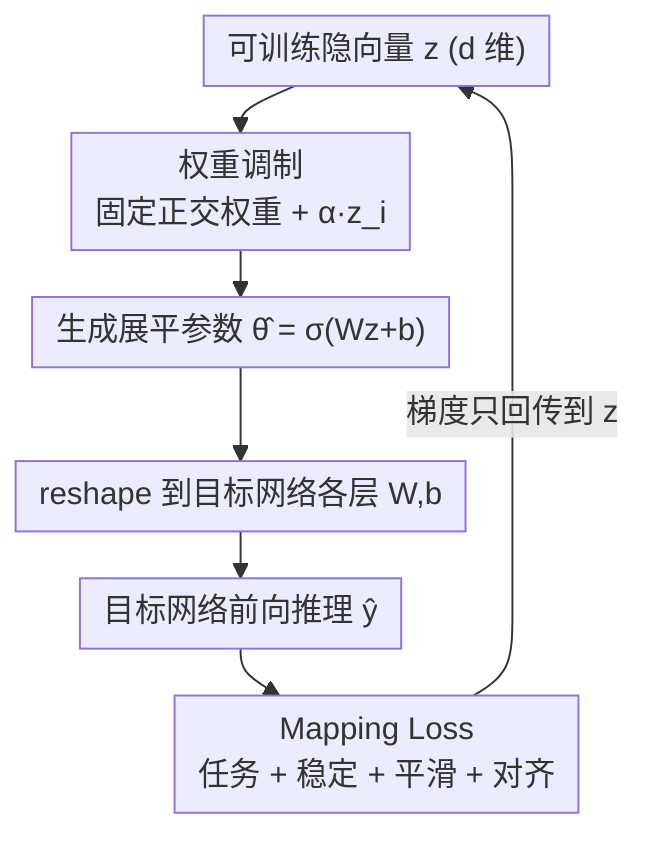

# Mapping Networks

**会议**: CVPR 2026  
**论文**: [CVF Open Access](https://openaccess.thecvf.com/content/CVPR2026/html/Sen_Mapping_Networks_CVPR_2026_paper.html)  
**代码**: 无  
**领域**: 优化 / 参数高效训练  
**关键词**: 超网络, 元参数化, 权重流形, 隐向量, 过拟合抑制

## 一句话总结
本文提出 Mapping Networks——一种"元参数化"方法，用一个低维可训练隐向量 $z$（配合固定的、被 $z$ 调制的映射权重）来生成目标网络的全部参数，从而把训练从高维权重空间搬到低维隐空间，在图像分类、deepfake 检测、分割等任务上以约 500× 更少的可训练参数达到甚至超过原网络的精度，同时显著抑制过拟合。

## 研究背景与动机

**领域现状**：现代深度网络参数量动辄百万到万亿，直接在高维权重空间 $\mathbb{R}^P$ 上做梯度下降训练既昂贵又难追踪，还容易过拟合。降低训练成本主要有两条路：减少训练时间（靠分布式多卡）或减少可训练参数。后者更关键，因为它同时能提升泛化、削弱模型的黑箱性。

**现有痛点**：现有"减参"手段各有局限。剪枝（Pruning）、彩票假设（Lottery Ticket）、量化主要面向**推理**阶段，目标网络仍需先被完整训练；低秩压缩（如 SVD、$W\approx UV^\top$）直接作用在高维权重张量上，要么是事后分解、要么强加先验线性约束；HyperNetworks 虽然也"生成权重"，但超网络与目标网络是**联合训练**的，无法绕开目标网络的训练，且压缩率远不及本文。

**核心矛盾**：训练发生在高维 $\mathbb{R}^P$ 空间，但大量经验与理论证据（损失地形的低内在维度、训练轨迹收敛到共享低维流形）表明，训练好的参数其实只落在一个**低维流形**上——也就是说 $P$ 个权重值并非彼此独立。既然真正的自由度远小于 $P$，为什么还要在 $P$ 维空间里训练？

**本文目标**：(1) 在理论上证明确实存在一个从低维隐空间到高维权重空间、且误差任意小的可微映射；(2) 设计一个能实际实现该映射的架构，把训练完全转移到低维隐向量上，**让目标网络一次都不被直接训练**。

**切入角度**：作者先对一个在 MNIST 上训练的小 CNN 做参数快照，用 PCA / t-SNE 观察到每层参数沿近似仿射子空间平滑演化（图 2），由此提出"权重-流形假设"，再据此构造映射。

**核心 idea**：用一个低维可训练隐向量 $z$ 经过"固定但被 $z$ 调制"的映射网络生成目标网络的全部权重，把优化问题从 $\mathbb{R}^P$ 降到 $\mathbb{R}^d$（$d\ll P$），从而结构性地把搜索约束在高效流形上。

## 方法详解

### 整体框架
Mapping Networks 是一种 Hypernetwork（本文称为"外部约简"）：目标网络 $f_\theta$ 不被直接训练，取而代之的是一个低维可训练隐向量 $z\in\mathbb{R}^d$ 和一组**固定、正交初始化、被 $z$ 调制**的映射权重。隐向量经映射网络生成一个展平的高维参数向量 $\hat\theta\in\mathbb{R}^P$，再 reshape 回目标网络各层的权重/偏置张量；目标网络仅用这些生成的参数做前向推理，**梯度只回传到映射网络（最终落到 $z$ 与调制系数）**，永远不更新目标网络本身。整个过程由 Mapping Loss 约束，使其既满足下游任务，又满足映射定理要求的几何/解析性质。

### 关键设计

**1. 权重-流形假设与映射定理：为"低维训练"提供存在性证明**

直接把训练搬到低维空间，前提是"低维 → 高维权重"的良好映射确实存在。作者先形式化**权重-流形假设**：对网络参数 $\theta\in\mathbb{R}^P$，存在一个可微嵌入流形 $\mathcal{M}_\theta\subset\mathbb{R}^P$，其内在维度 $d=\dim(\mathcal{M}_\theta)\ll P$，且训练好的最优参数 $\theta^*$ 落在（或接近）该流形上。在三条假设下（参数→输出 $L_\theta$-Lipschitz、损失 $L_\ell$-Lipschitz、流形 $C^2$ 且曲率有界），证明了**映射定理**：对任意 $\varepsilon>0$，存在 $C^2$ 映射 $g:\mathbb{R}^d\to\mathbb{R}^P$ 和隐向量 $z^*$，使得 $\|g(z^*)-\theta^*\|\le\delta$（$\delta=\varepsilon/(L_\ell L_\theta)$），进而 $|L(g(z^*))-L(\theta^*)|\le\varepsilon$。证明思路是用流形局部的 $C^2$ 微分同胚 $\varphi$ 加一个光滑 bump 函数拼出全局光滑的 $g$。作者还补充 Theorem 2（加性调制下的可解性），证明实验里用的"固定权重 + 加性调制"架构正是这样一个合法的 $g$，且该误差界对初始残差独立成立。这一步把"低维训练能逼近最优"从直觉变成了有界保证。

**2. 映射网络：可训练隐向量 + 固定调制权重**

这是把映射定理落地的架构。隐向量 $z=(z_0,\dots,z_{d-1})$ 是**唯一可训练**的核心，其长度作为超参，用来匹配目标网络的有效参数分布。映射网络本身的权重 $w_{ij}$ 是**固定、正交初始化、不参与梯度更新**的，只通过隐向量做一个简单的加性仿射调制：

$$w_{ij}\leftarrow w_{ij}+\alpha\, z_i,\quad \forall j$$

其中 $\alpha$ 是小的调制尺度。之所以保留固定权重而不是纯靠 $z$ 直接投影，是为了"提供上下文、防止投影变成随机映射"。调制后生成展平参数 $\hat\theta=\sigma(W\cdot z+b)$，再按各层累积索引切片、reshape 成 $W^{(l)},b^{(l)}$（式 22）。目标网络拿这些参数做标准前向 $\hat y=\sigma(W_t^\top x+b_t)$，梯度只穿过映射网络。由于真正学习的自由度只有 $z$（与少量调制系数），可训练参数从 $P$ 骤降到 $d$ 量级——这正是 260×–525× 压缩的来源。

**3. 映射损失：把定理假设变成可优化的正则项**

光有架构不够，还要保证生成的参数流形真的满足映射定理的光滑/稳定假设。作者设计四项联合损失，并让各项系数本身**可训练**，让网络自适应平衡任务与正则：

$$L_{map}=L_{task}+\lambda_{st}L_{stab}+\lambda_{sm}L_{smooth}+\lambda_{al}L_{align}$$

- **任务损失** $L_{task}$：分类用交叉熵，保证生成参数对下游任务最优；
- **稳定损失** $L_{stab}=\mathbb{E}\big[\|f_{\theta'}(z+\epsilon)-f_{\theta'}(z)\|_2^2\big]$（$\epsilon\sim\mathcal N(0,\sigma^2I)$），惩罚隐向量微扰带来的大输出变化，对应假设 A1 的局部 Lipschitz；
- **平滑损失** $L_{smooth}=\|\nabla_z M_\phi(z)\|_F^2$，惩罚映射 Jacobian 的 Frobenius 范数，强制 $C^2$ 连续、抑制振荡；
- **对齐损失** $L_{align}=1-\cos(z,W_m)$，让隐向量与调制投影层权重的行均值方向对齐，提升泛化。

消融（Table 6）显示四项叠加（Full）总是优于只用任务损失，例如 Ours† 2688 参数从 91.11% 提到 94.08%。

**4. 训练策略与扩展：让方法 scale 到大网络与微调**

为应对大网络的内存问题，作者给出两种训练策略：**单隐向量训练（SLVT）**用一个 $z$ 近似整张网络（小网络够用，但大网络下固定映射权重数量暴涨吃 RAM）；**逐层训练（LWT）**为每层用各自的小隐向量分别近似（因为不同层参数可能落在不同流形上），实验中 Ours†（LWT）普遍优于 Ours*。三项扩展进一步增强实用性：(a) **低秩分解（LRD）**——映射网络直接生成 $U,V$ 而非 $W\approx UV^\top$，把全连接层参数从 $mn$ 降到 $r(m+n)$；(b) **剪枝/量化**与本方法正交，可叠加用于推理加速；(c) **微调扩展**——生成调制向量 $o$ 而非完整参数，每个 $o_i$ 调制 $L$ 个待微调权重（$w_{ij}\leftarrow w_{ij}+\alpha\,o_i$），从而用极少参数微调整张预训练网络（实验中以 2048 参数微调 ResNet50）。

## 实验关键数据

> 评测覆盖图像分类（MNIST/FMNIST）、deepfake 检测（Celeb-DF/FF++）、分割（Cityscapes）、时序预测（空气污染）与微调（ResNet50）。`Ours*` = 单隐向量训练（SLVT），`Ours†` = 逐层训练（LWT）。

### 主实验

| 任务 / 数据集 | 基线（# 参数 → 指标） | 本文（# 参数 → 指标） | 压缩比 |
|------|------|------|------|
| 图像分类 MNIST | CNN1: 537,994 → 99.32% | Ours* 2072 → 99.56% | ~260× |
| 图像分类 FMNIST | CNN1: 537,994 → 92.89% | Ours† 4078 → 94.83% | ~131× |
| Deepfake Celeb-DF | CNN2: 108,618 → 79.03% | Ours* 2048 → 85.90% | ~53× |
| Deepfake FF++ | CNN2: 108,618 → 79.85% | Ours† 2688 → 86.28% | ~40× |
| 分割 Cityscapes (mIoU) | CNN3: 1,734,803 → 0.4957 (像素准 93.21%) | Ours* 8192 → 0.4623 (像素准 97.92%) | ~211× |
| 时序 空气污染 (MSE) | LSTM: 12961 → 0.0035 | Ours* 2048 → 0.00061 | ~6× |

亮点：分类/检测精度不降反升，分割的像素准确率从 93.21% 提到约 97.9%（mIoU 略降），说明低维约束起到了类似正则化的作用。摘要宣称约 500× 减参（99.5%），与 FMNIST 上 1024 参数对 CNN1 的 525× 一致。⚠️ 不同行的"压缩比"按各自参数计算，原文未逐项列出，此处为据表换算。

### 微调实验（ResNet50 → deepfake 检测）

| 方法 | # 可训练参数 | 微调层 | Celeb-DF | FF++ |
|------|------|------|------|------|
| ResNet50 | 25M | 全部 | 95.23% | 91.78% |
| Ours* | 2048 | 全部 | 95.10% | 91.02% |
| ResNet50 | 17M | L-4 + FC | 91.11% | 88.03% |
| Ours* | 1024 | L-4 + FC | 92.10% | 89.23% |

仅以 2048 个可训练参数即逼近全量微调 25M 参数的精度，部分配置（L-4+FC）甚至反超基线。

### 消融实验（Mapping Loss，FashionMNIST，Table 6）

| 配置 | Ours* 2048 | Ours† 2688 |
|------|------|------|
| 仅任务损失 | 87.88% | 91.11% |
| + 稳定 | 89.91% | 91.89% |
| + 平滑 | 90.23% | 91.50% |
| + 平滑 + 对齐 | 90.67% | 93.63% |
| Full（四项全开） | 91.88% | 94.08% |

### 关键发现
- **流形假设的正则化红利**：低维隐向量训练显著抑制过拟合——CNN1 在 FMNIST 上训练/测试精度差距大（训练 99.10% → 测试 92.89%），而 2072 参数的 Mapping Network 该差距仅 1.8%。
- **四项损失缺一不可**：去掉稳定/平滑/对齐任一项都掉点，Full 配置在两种容量下都最优，验证了"把定理假设写成正则项"的有效性。
- **逐层训练（LWT）更强**：Ours† 普遍优于 Ours*，印证"不同层参数落在不同流形、需分别建模"的判断。
- **鲁棒性对照**：Table 7 中 Full DNN（隐向量不可训练、只训练映射权重，6.75M 参数）只有 97.12%（MNIST），反衬"训练隐向量"才是关键，而非靠映射权重容量。⚠️ Table 7 部分数值在缓存中被截断，以原文为准。

## 亮点与洞察
- **理论 + 架构闭环**：先用映射定理证明低维到高维参数映射存在且误差有界，再用"固定调制权重 + 可训练隐向量"把这个 $g$ 显式造出来，最后用四项损失强制满足定理假设——理论、架构、损失三者一一对应，逻辑自洽。
- **真正绕开目标网络训练**：与 HyperNetwork 联合训练不同，目标网络一次都不被直接训练，梯度只在映射网络里流动，这才换来约 500× 的减参。
- **baseline 无关 + 正交可叠加**：方法对目标架构（CNN/LSTM/ResNet）无关，且与剪枝、量化、低秩分解正交，可组合用于边缘部署。
- **把"过拟合"当几何问题解**：低维流形约束天然偏好更平、更鲁棒的解，等价于一种结构性正则——这个视角可迁移到任何想减参/抗过拟合的训练场景。

## 局限与展望
- **规模受限**：受算力限制（Kaggle P100 / NVIDIA T1000），实验只到中小型 CNN/LSTM 与 ResNet50 微调，未在大模型/大数据集上验证；作者称方法可扩展但未给证据。
- **固定映射权重的内存代价**：SLVT 下固定映射权重数量随目标网络增大而暴涨、吃 RAM，虽用 LWT 与 LRD 缓解，但大网络下生成-存储映射权重的开销仍是瓶颈。
- **超参敏感**：隐向量维度 $d$、调制尺度 $\alpha$、微调时每个 $o_i$ 调制的权重数 $L$ 都需调，论文对其敏感性分析多放在附录。
- ⚠️ 缓存为 OCR 文本，部分公式（如式 20–24 的下标、Table 7 的数值）存在断行/缺失，关键符号以原文 PDF 为准。

## 相关工作与启发
- **vs HyperNetworks**：两者都"生成目标网络权重"，但 HyperNetwork 与目标网络联合训练、无法避免目标网络训练，压缩率也低；本文映射网络只训练隐向量、目标网络零训练，减参量级更大。
- **vs 剪枝 / 彩票假设 / 量化**：这些都面向推理阶段、且需先完整训练目标网络；本文面向训练阶段，从根上不训练目标网络，且与它们正交可叠加。
- **vs 低秩压缩（SVD / $W\approx UV^\top$）**：低秩法直接在高维权重张量上做事后分解或先验线性约束；本文是非线性、可微的元参数化，把搜索域整体降到低维隐空间，而非逐矩阵约束。

## 评分
- 新颖性: ⭐⭐⭐⭐ 元参数化 + 映射定理的理论-架构-损失闭环视角较新颖。
- 实验充分度: ⭐⭐⭐ 任务覆盖面广，但规模偏小、大模型验证缺失，部分结论靠附录。
- 写作质量: ⭐⭐⭐ 理论部分严谨，但符号繁多、图表 OCR 后可读性一般。
- 价值: ⭐⭐⭐⭐ 把"训练在低维流形上"做成可落地、可叠加的训练范式，参数高效训练方向有迁移价值。

<!-- RELATED:START -->

## 相关论文

- [\[NeurIPS 2025\] Auto-Compressing Networks](../../NeurIPS2025/optimization/auto-compressing_networks.md)
- [\[ICLR 2026\] Entropic Confinement and Mode Connectivity in Overparameterized Neural Networks](../../ICLR2026/optimization/entropic_confinement_and_mode_connectivity_in_overparameterized_neural_networks.md)
- [\[ICLR 2026\] Rapid Training of Hamiltonian Graph Networks using Random Features](../../ICLR2026/optimization/rapid_training_of_hamiltonian_graph_networks_using_random_features.md)
- [\[ICML 2026\] The Implicit Bias of Adam and Muon on Smooth Homogeneous Neural Networks](../../ICML2026/optimization/the_implicit_bias_of_adam_and_muon_on_smooth_homogeneous_neural_networks.md)
- [\[ICLR 2026\] Πnet: Optimizing Hard-Constrained Neural Networks with Orthogonal Projection Layers](../../ICLR2026/optimization/pinet_optimizing_hard-constrained_neural_networks_with_orthogonal_projection_lay.md)

<!-- RELATED:END -->
