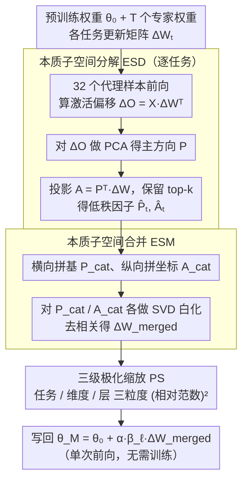

# Model Merging in the Essential Subspace

**会议**: CVPR 2026  
**arXiv**: [2602.20208](https://arxiv.org/abs/2602.20208)  
**代码**: 无  
**领域**:优化
**关键词**: 模型合并, 主成分分析, 本质子空间, 极化缩放, 低秩分解

## 一句话总结
提出 ESM 框架，通过对参数更新引起的激活偏移做 PCA 构建"本质子空间"（而非直接对参数做 SVD），并用三级极化缩放增强关键参数、抑制噪声，在 ViT-B/32 的 20 任务合并中比 Iso-CTS 提升 3.2%（绝对准确率）。

## 研究背景与动机

**领域现状**：模型合并将多个基于同一预训练 checkpoint 微调的专家模型融合为一个多任务模型，无需重训。近期 SVD-based 方法（TSV-M, Iso-CTS）通过对任务矩阵做 SVD 截断来减少干扰，取得了较好效果。

**现有痛点**：SVD 分解最小化的是参数矩阵 $\Delta W$ 的 Frobenius 范数重建误差，但忽略了输入特征分布。截断误差为 $\sum_{i=k+1}^r \sigma_i^2 \cdot \mathbb{E}[(v_i^\top x)^2]$——即使 $\sigma_i$ 小，如果输入在 $v_i$ 方向投影大，截断仍导致严重的功能损失。

**核心矛盾**：SVD 子空间与任务的特征空间不对齐，导致低秩合并时丢弃了功能上重要的方向；同时大量任务合并时，噪声参数可能淹没关键知识。

**本文目标** (1) 构建更本质的、与特征分布对齐的低秩子空间；(2) 在合并过程中增强高信噪比参数、抑制噪声。

**切入角度**：不直接分解参数矩阵，而是对参数更新引起的**激活偏移** $\Delta O = X_{\text{proxy}} \Delta W^\top$ 做 PCA，得到与任务功能直接相关的主方向。同时观察到参数范数与方向重要性高度相关。

**核心 idea**：在激活偏移的主成分空间（而非参数的奇异值空间）中做低秩分解和合并，并用极化缩放放大共识信号。

## 方法详解

### 整体框架
给定预训练权重 $\theta_0$ 和 $T$ 个在其上微调出来的专家权重，ESM 要把它们合并成一个多任务模型 $\theta_M$，而不丢掉任何一个任务的能力。它的核心判断是：合并该保留的不是参数能量最大的方向，而是对输出激活影响最大的方向。于是整条流程分三步走——先对每个任务的更新矩阵在「激活偏移」的主方向上做本质子空间分解（ESD），把它压缩到一个与任务功能直接对齐的子空间里；再把 $T$ 个任务的低秩因子正交拼起来做本质子空间合并（ESM）；最后用三级极化缩放（PS）放大那些跨任务一致的高置信信号、压住噪声。最终每一层按 $\theta_M^{(\ell)} = \theta_0^{(\ell)} + \alpha \cdot \beta_\ell \cdot \Delta W_{\text{merged}}^{(\ell)}$ 写回，全程只需一次前向传播，不需要训练。

### 关键设计

**1. 本质子空间分解 ESD：在激活空间而非参数空间做低秩截断**

传统 SVD 直接分解参数矩阵 $\Delta W$，截断误差里带着 $\mathbb{E}[(v_i^\top x)^2]$ 这个输入权重项——即使某个方向的奇异值很小，只要输入恰好在该方向上投影很大，丢掉它就会造成严重的功能损失，所以 SVD 的低秩近似和任务实际用到的特征空间是错位的。ESD 把分解的对象从参数换成了输出。它用 32 个无标签代理样本前向跑一遍，算出参数更新引起的激活偏移 $\Delta O = X_{\text{proxy}} \Delta W^\top \in \mathbb{R}^{n \times d_{\text{out}}}$，对 $\Delta O$ 做 PCA 得到主方向 $P = [p_1, \dots, p_{d_{\text{out}}}]$，再把 $\Delta W$ 投影上去得坐标矩阵 $A = P^\top \Delta W$，只保留能量最高的 top-$k$ 个方向得到 $\widehat{\Delta W} = \hat{P}\hat{A}$。这样截断误差变成纯粹的 $\sum_{i=k+1}^{d_{\text{out}}} \lambda_i$，只取决于被丢弃方向的特征值、与输入分布彻底解耦，意味着扔掉的一定是对功能贡献最小的方向。实验里 ESD 只保留 5% 成分时与原模型的 CKA 相似度就远高于 SVD，正是这种「按功能而非按参数能量排序」带来的。

**2. 本质子空间合并 ESM：把 $T$ 个任务的低秩因子正交融合**

ESD 解决了单任务怎么压缩，但多个任务各自的本质子空间彼此不正交，直接相加会互相干扰。ESM 用三步把它们干净地拼起来：先给每个任务分配 rank 预算 $k = \lfloor d_{\text{out}} / T \rfloor$ 各自截断；再把所有任务的基矩阵横向拼成 $P_{\text{cat}} = [\hat{P}_1 \mid \dots \mid \hat{P}_T]$、坐标矩阵纵向拼成 $A_{\text{cat}}$；最后对两者分别做 SVD 白化 $\tilde{P} = U_P V_P^\top$、$\tilde{A} = U_A V_A^\top$，把奇异值拉平、只留正交的方向骨架。白化这一步是关键——它强行让跨任务的基向量最大程度去相关，使得不同任务占据互不重叠的方向，合并时谁也不会盖掉谁。

**3. 三级极化缩放 PS：用「相对范数的平方」放大共识、压制噪声**

拼接之后所有任务被一视同仁地相加，但任务有强弱、维度有主次、层有轻重，弱任务的噪声很容易在 20 个任务一起合并时淹没掉关键知识。PS 不去学任何系数，而是统一用 $(\text{相对范数})^2$ 这一个形式在三个粒度上做极化——平方让强的更强、弱的更弱，自动拉开置信度。在任务粒度，$s_t^{(\ell)} = \big(\lVert\hat{A}_t^{(\ell)}\rVert_F \,/\, \mathbb{E}_i[\lVert\hat{A}_i^{(\ell)}\rVert_F]\big)^2$ 防止重要任务被大量弱任务的噪声稀释；在维度粒度，$c_j^{(\ell)} = \big(\lVert\mathbf{a}_j^{(\ell)}\rVert_2 \,/\, \mathbb{E}_i[\lVert\mathbf{a}_i^{(\ell)}\rVert_2]\big)^2$ 增强那些跨任务一致性强的输入维度；在层粒度，$\beta_\ell = \big(\lVert\Delta W_{\text{merged}}^{(\ell)}\rVert_F \,/\, \mathbb{E}_{i \in \mathcal{L}_{\text{type}}}[\lVert\Delta W_{\text{merged}}^{(i)}\rVert_F]\big)^2$，且只在同类型层之间（如所有 QKV 层）比较，避免残差连接让不同层不公平地相互竞争。这套缩放之所以成立，是因为作者验证了「高范数对应高置信方向」这一前提：按范数从高到低顺序加载参数始终表现最好，即便把范数归一化后仍然如此，说明起作用的是方向质量而非单纯的幅度；反过来用倒数缩放（reciprocal）则会让性能暴跌 5% 以上。

### 损失函数 / 训练策略
ESM 不涉及训练，仅需 32 个无标签代理样本做一次前向传播。合并系数 $\alpha$ 在验证集上选择。总额外开销极小：ViT-B/16 上 PCA 1.39s/task + 正交化 13.89s（一次性）。

## 实验关键数据

### 主实验

**ViT-B/16，平均绝对准确率 (%)**

| 方法 | 8 tasks | 14 tasks | 20 tasks |
|------|---------|----------|----------|
| Task Arithmetic | 75.4 | 70.5 | 65.8 |
| TSV-M | 89.0 | 84.6 | 80.6 |
| Iso-CTS | 91.1 | 86.4 | 82.4 |
| **ESM (Ours)** | **91.8** | **87.4** | **84.9** |

**ViT-L/14，平均绝对准确率 (%)**

| 方法 | 8 tasks | 14 tasks | 20 tasks |
|------|---------|----------|----------|
| TSV-M | 93.0 | 89.2 | 87.7 |
| Iso-CTS | 94.7 | 91.0 | 90.1 |
| **ESM (Ours)** | **94.8** | **91.3** | **90.4** |

### 消融实验

| 分解方式 | PS | ViT-B/16 8tasks | ViT-B/16 20tasks | 说明 |
|---------|-----|-----------------|-----------------|------|
| SVD | 无 | 89.0 | 80.6 | 基线(TSV-M) |
| SVD | 全部 | 89.6 | 82.1 | PS 对 SVD 也有效 |
| ESD | 无 | 90.9 | 82.8 | ESD 本身提升 +1.9/+2.2 |
| ESD | 仅层间 | 91.4 | 83.7 | 层间缩放贡献最大 |
| ESD | 全部 | **91.8** | **84.9** | 三级缩放进一步提升 |

### 关键发现
- ESD 的能量集中度远高于 SVD：保留更少成分就能捕获同等能量，且 CKA 相似度显著更高
- 极化缩放是通用模块：即使用在 SVD 分解上也能提升 1.5%，说明范数缩放的思路具有普适性
- 代理数据集的组成对结果影响极小：OOD 数据（ImageNet-1k）与 ID 数据性能几乎相同（差异 <0.1%），甚至单类别采样也不影响，说明激活偏移的主方向具有输入不变性
- 仅 4 个代理样本就能稳定优于 SVD 基线
- 反向缩放（reciprocal）导致严重性能下降（-5%+），验证了"高范数=高重要性"的假设

## 亮点与洞察
- **SVD vs ESD 的对比极具说服力**：从理论（截断误差公式的区别）到实验（能量集中度、CKA）全方位论证了"在激活偏移空间分解优于在参数空间分解"。核心 insight 是模型合并应关注功能性影响而非参数能量
- **代理数据集的鲁棒性令人惊讶**：即使用完全 OOD 的数据做 PCA，效果也几乎不变。这暗示微调模型的激活偏移主方向是一种内在属性，与输入数据无关——这本身就是一个有趣的发现
- **极化缩放设计简洁高效**：(相对范数)² 的简单公式就实现了"放大信号、压缩噪声"的效果，且在三个层次独立作用互不干扰。比学习缩放系数的方法（如 AdaMerging）更高效且不需验证集（层间缩放部分）

## 局限与展望
- 需要 32 个代理样本做前向传播——虽然数据量极小，但严格意义上不是完全 data-free（相比 ACE-Merging）
- 仅在视觉任务（ViT/CLIP）上验证，缺少语言模型的实验
- 全局 $\alpha$ 系数仍需验证集选择，未实现完全自动化
- rank 预算 $k = \lfloor d_{\text{out}} / T \rfloor$ 对所有任务均匀分配，未考虑任务复杂度差异——可探索自适应 rank 分配
- 白化操作丢弃了奇异值信息，可能过度压缩有用的尺度差异

## 相关工作与启发
- **vs TSV-M**: TSV-M 在参数 SVD 空间中合并，ESM 在激活 PCA 空间中合并，ESM 在所有设置下一致优于 TSV-M（+2~3%）
- **vs Iso-CTS**: Iso-CTS 通过奇异值归一化构建各向同性公共子空间，ESM 从功能角度构建本质子空间，20-task 场景下 ESM 优势更明显（+2.5%）
- **vs ACE-Merging**: 两篇都是 CVPR'26 的模型合并工作，但思路完全不同——ACE 从协方差估计出发用闭式解，ESM 从激活偏移 PCA 出发用低秩分解+正交化。ACE 完全 data-free，ESM 需要 32 样本。两者可能互补

## 评分
- 新颖性: ⭐⭐⭐⭐ ESD 分解思路新颖，但 PCA on activations 的想法在其他领域不算全新
- 实验充分度: ⭐⭐⭐⭐⭐ 消融详尽、代理数据鲁棒性分析、缩放系数可视化、计算开销报告齐全
- 写作质量: ⭐⭐⭐⭐ 逻辑清晰，图表丰富，但极化缩放部分的实验动机展示略冗长
- 价值: ⭐⭐⭐⭐ 视觉模型合并 SOTA，但缺少语言模型验证限制了影响力

<!-- RELATED:START -->

## 相关论文

- [\[CVPR 2026\] ACE-Merging: Data-Free Model Merging with Adaptive Covariance Estimation](ace-merging_data-free_model_merging_with_adaptive_covariance_estimation.md)
- [\[CVPR 2026\] BD-Merging: Bias-Aware Dynamic Model Merging with Evidence-Guided Contrastive Learning](bd-merging_bias-aware_dynamic_model_merging_with_evidence-guided_contrastive_lea.md)
- [\[CVPR 2026\] Defending Unauthorized Model Merging via Dual-Stage Weight Protection](defending_unauthorized_model_merging_via_dual-stage_weight_protection.md)
- [\[CVPR 2026\] DC-Merge: Improving Model Merging with Directional Consistency](dc-merge_improving_model_merging_with_directional_consistency.md)
- [\[CVPR 2026\] Label-Free Cross-Task LoRA Merging with Null-Space Compression](label-free_cross-task_lora_merging_with_null-space_compression.md)

<!-- RELATED:END -->
