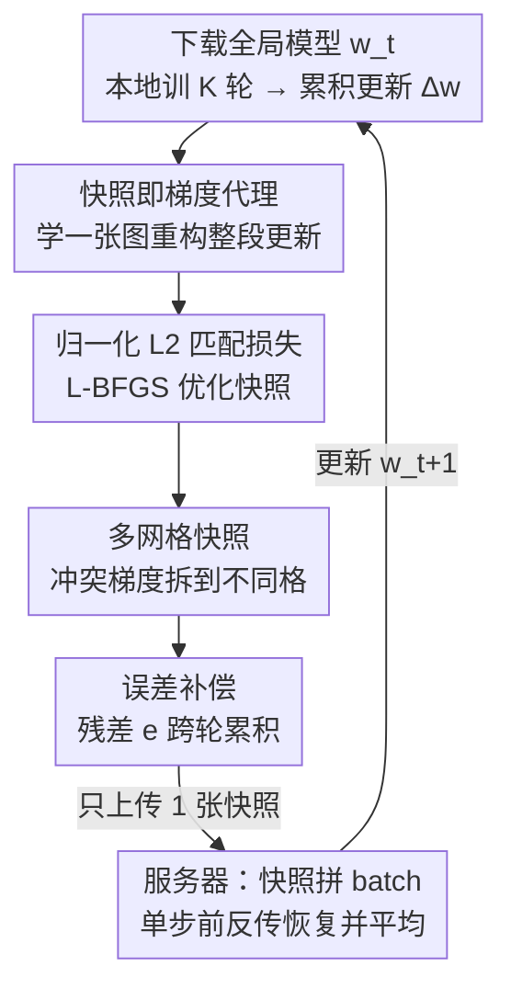

# OS-FED: One Snapshot Is All You Need

**会议**: CVPR 2026  
**论文**: [CVF Open Access](https://openaccess.thecvf.com/content/CVPR2026/html/Qian_OS-Fed_One_Snapshot_Is_All_You_Need_CVPR_2026_paper.html)  
**代码**: 无  
**领域**: 联邦学习 / 通信高效优化  
**关键词**: 联邦学习, 通信效率, 梯度压缩, 数据蒸馏, One-Shot

## 一句话总结
OS-FED 把客户端整段本地训练的累积梯度"画"成一张 224×224 的合成图像 + 一组可学习标签（一个 snapshot），每轮只传这一张图，服务器单步前反传就能恢复并聚合全局更新，相比 SOTA 把通信量降 1.5–16×、收敛加快 18–45%。

## 研究背景与动机

**领域现状**：联邦学习（FL）让多个客户端在不上传原始数据的前提下协同训练全局模型，FedAvg 是事实标准——客户端下载全局模型、本地训若干轮、把模型更新 $\Delta w$ 传回服务器做平均。

**现有痛点**：$\Delta w$ 是百万级参数向量，通信开销随模型增大而爆炸。论文给的例子很扎心：在 ImageNet-10 上训一个中等大小的 RegNetX，仅 10 轮就产生 8040 MB 流量。LLM 时代这个瓶颈只会更糟。

**核心矛盾**：现有两条减负路线都有硬伤。一是"增加本地计算、减少通信轮数"，但在非 IID 数据上做大量本地更新会引发 client drift 乃至发散；二是"直接压缩梯度"（稀疏化 / 量化），但有损压缩丢信息严重，且 FL 客户端是无状态的，服务器很难把复杂梯度结构还原回来。还有一条"本地数据蒸馏成小合成集再上传"的路线，但它把数据代理集中到服务器做再训练，违背 FL 去中心化初衷、有隐私风险，还要昂贵的双层优化并访问真实标签。

**核心 idea**："a picture is worth a thousand words"——与其压缩高维梯度本身，不如学一个**紧凑代理**去重构它。作者观察到：一个模型的梯度可以由一张普通图像 + 对应标签有效重构。于是发明 OS-FED：每轮每个客户端只传**一张合成快照**（image + learnable labels），服务器用它单步恢复梯度并聚合。一张 32-bit 的 224×224×3 图只要 0.57 MB，比 80.4 MB 的 RegNetX 更新省 140×。

## 方法详解

### 整体框架

OS-FED 的核心是把"客户端这一整轮本地训练做了什么"压成一个**信息稠密的合成快照** $S$，服务器对所有客户端的快照做一次单步聚合就能更新全局模型。一轮流程是：客户端 $i$ 先下载全局模型 $w_t$、在私有数据上做 $K$ 轮本地训练，得到累积更新 $\Delta w_{t,i} = \eta_{local}\sum_{k=1}^{K} g_{t,i}^{(k)}$；接着把"这一段梯度轨迹"（叠加上历史残差）作为压缩目标，优化出一张多网格快照 $S^*_{t,i}$；计算本轮压缩残差存入误差向量，留给下一轮；只把 $S^*_{t,i}$ 上传。服务器侧把各客户端快照拼成一个 batch，统一生成合成梯度并平均（即 gradient recovery），用这个聚合梯度更新全局模型。

关键转变在于：传统压缩在**梯度空间**里做有损操作，OS-FED 则在一个独立的**紧凑参数空间**里优化快照，再让快照通过可微函数"生成"梯度——压缩和梯度空间解耦，既绕开信息丢失，也让服务器恢复变成一次 O(1) 前反传，而非再训练。

### 关键设计

**1. 快照即梯度代理：把整段本地更新压成一张可生成梯度的图**

针对"高维梯度传不起、直接压又丢信息"的痛点，OS-FED 不再传 $\Delta w$，而是为客户端学一个紧凑快照 $S_i$（合成图像 + 可学习标签），让"由这张快照生成的合成梯度"逼近整段累积更新。形式化为一个带预算约束的优化问题：

$$S^*_{t,i} = \underset{S_i}{\arg\min}\; D(\nabla \mathcal{L}(S_i, w_t), \Delta w_{t,i}) \quad \text{s.t.}\quad \|S_i\|_0 \le B$$

其中 $\nabla \mathcal{L}(S_i, w_t)$ 表示"把快照 $S_i$ 喂给当前模型 $w_t$ 前反传得到的合成梯度"，$D(\cdot,\cdot)$ 是梯度距离度量，$\|\cdot\|_0 \le B$ 用 L0 范数（非零参数个数）卡死通信预算。服务器侧的恢复同样优雅：把 $C$ 个客户端快照沿 batch 维拼接，一次前反传得到平均合成梯度，正好近似 FedAvg 的理想全局更新

$$\frac{1}{C}\sum_{i=1}^{C}\Delta w_{t,i} \approx \nabla \mathcal{L}_{mean}([S^*_{t,i}]_{i=1}^{C}, w_t)$$

然后 $w_{t+1} = w_t - \nabla \mathcal{L}_{mean}(\cdot)$。这一步把服务器聚合从"逐梯度还原"变成 O(1) 单步，并且天然兼容 LoRA、量化等现有框架（即插即用）。和数据蒸馏路线的本质区别：标签是**可学习且独立于客户端真实标签**的，快照生成是单层优化而非双层元学习，服务器只做恢复不做再训练。

**2. 多网格快照（Multi-Grid Snapshot）：把冲突的梯度方向拆到不同空间格**

单张图配单个标签的"整体式"快照表达力不够——$K$ 轮本地训练的累积更新在非 IID 数据上往往编码了指向多个方向的丰富特征，单个合成样本会把它们糊在一起（论文 Figure 3：'2' 和 '9' 的特征混叠成模糊纹理），形成表达力瓶颈。OS-FED 把快照 $S$ 参数化为一组可学习张量，包含一张网格特征图 + $M^2$ 个独立的标签嵌入，再设计一个确定性、可微的多网格函数 $\mathcal{F}(\cdot)$ 来"展开"它：$\mathcal{F}$ 把特征图当作一格格 patch，每格双线性插值上采样到目标输入尺寸，配上各自的标签嵌入，得到 $M^2$ 个不同的合成样本。这样快照的不同部分各自专攻目标梯度轨迹的不同侧面，表达力大幅提升。作者还给了理论支撑（Proposition 1）：在合理假设下，多网格函数能取到更优的最优值，即 $\min_S D(\mathcal{F}(S),\mathcal{T}) \le \min_S D(S,\mathcal{T})$，多网格生成的梯度比单图更接近目标。

**3. 误差补偿（Error Compensation）：把每轮压不进去的残差留到下一轮**

极高压缩率下，每轮压缩算子引入的误差不可忽略，若直接丢弃会跨轮累积、拖慢甚至破坏收敛。OS-FED 在每个客户端本地维护一个误差累积向量 $e$（初始为零）。每轮真正的压缩目标不是当轮更新 $\Delta w$，而是叠加了历史残差的**目标梯度轨迹**

$$\Delta g_{t,i} = \Delta w_{t,i} + e_{t-1,i}$$

优化出 $S^*_{t,i}$ 后，本轮残差更新为目标与实际合成梯度之差

$$e_{t,i} = \Delta g_{t,i} - \nabla \mathcal{L}(\mathcal{F}(S^*_{t,i}), w_t)$$

若 $e_{t,i}=0$ 即无损压缩，否则非零残差不丢弃、滚到下一轮再压。这保证任何一轮没被快照捕获的信息都有机会被后续补偿，是高压缩率下维持模型性能的关键。

**4. 归一化 L2 匹配损失：自校准跨层梯度幅度**

快照参数通过最小化"合成梯度与目标轨迹 $\Delta g$ 的差距"来学。OS-FED 用归一化 L2 距离作为匹配损失：

$$\mathcal{L}_{match} = \frac{\|\nabla \mathcal{L}(\mathcal{F}(S_i), w_t) - \Delta g_{t,i}\|_2^2}{\|\Delta g_{t,i}\|_2^2 + \varepsilon}$$

分母加小正数 $\varepsilon$ 防止 $\Delta g$ 范数趋零时数值不稳。这个归一化干两件事：一是训练后期 $\Delta g$ 幅度变小时仍能给出强优化信号；二是自校准模型内不同层、不同参数间的幅度差异。由于 $\mathcal{F}$ 全程可微，从 $S_i$ 到 $\mathcal{L}_{match}$ 端到端可导，作者用 L-BFGS 迭代求最优快照。消融显示归一化项相比非归一化 L2 在 ResNet-18 上涨 2.5%，比余弦距离更稳更好。

### 损失函数 / 训练策略
CV 任务用 SGD（lr=0.01，cosine 退火），10 客户端 / 100 轮 / 每轮本地 $K=5$ epoch，ImageNet 子集默认 grid 4×4、MNIST/FMNIST 用 2×2；NLP 用 GPT2-mini + AdamW（lr=1e-4，线性 warmup+decay），快照参数化为一串可学习嵌入。非 IID 划分用 Dirichlet($\alpha$=0.5)。

## 实验关键数据

### 主实验

CIFAR-10/100 上（ResNet-18），OS-FED 在精度更高的同时通信量降到 0.12 MB 量级：

| 方法 | 消息类型 | CIFAR-10 Acc | CIFAR-10 Size(MB) | CIFAR-100 Acc | CIFAR-100 Size(MB) |
|------|---------|------|------|------|------|
| FedAvg | 梯度 | 47.6% | 447.2 | 27.4% | 451.2 |
| FedMPQ（量化） | 梯度 | 31.5% | 13.9 | 20.2% | 14.1 |
| FedAF（数据蒸馏） | 数据集 | 41.9% | 23.4 | 26.4% | 234.4 |
| LoRA-FAIR | 梯度 | 41.8% | 3.58 | 26.3% | 3.61 |
| **OS-FED (4×4)** | **快照** | **44.9%** | **0.12** | **30.3%** | **0.12** |

CIFAR-100 上比最强基线 LoRA-FAIR 高 4.0%，通信量却少 30×。ImageNet-10 上要达到 65% 精度，OS-FED 只需 80.5 MB，而 LoRA-FAIR 要 280 MB、FedAvg 要 8100+ MB（降 100×+）。

NLP（GPT2-mini）上同样验证，且实测延迟优势惊人：

| 方法 | 消息类型 | AGNews Acc | Size(MB) | 客户端压缩耗时 | 服务器解压耗时 |
|------|---------|------|------|------|------|
| FedAvg | 梯度 | 82.3% | 3124 | - | - |
| LoRA-FAIR | 梯度 | 75.5% | 25.0 | - | - |
| FedAF+（数据蒸馏） | 数据集 | 80.0% | 11.2 | 56 min | 13 min |
| **OS-FED (4×4)** | **快照** | **81.6%** | **7.66** | **5.46 s** | **0.82 s** |

OS-FED 比 LoRA-FAIR 高 6.1%、比 FedAF+ 高 1.6%，服务器解压因为是"单步前反传"而非"再训练"，从 FedAF 的 8–13 分钟降到亚秒级（↓1147×）。

### 消融实验

| 配置 | 关键指标（ResNet-18 / RegNetX, ImageNet-10） | 说明 |
|------|------|------|
| OS-FED（端到端多网格） | 63.5% / 68.0% | 完整方法 |
| OS-FED-post（先优化后下采样） | 48.8% / 53.1% | 非端到端，大幅掉点 |
| Oracle（无压缩上界） | 65.6% / 69.7% | OS-FED 已逼近上界 |
| Single+Norm.+L2（本文损失） | 63.5% / 68.0% | 完整损失 |
| Single+L2（去归一化） | 61.0% / 64.6% | 掉 2.5% / 3.4% |
| Bi（FedAF 式双层优化） | 28.3% / 28.7% | 双层方案在此任务上崩 |

误差补偿（EC）的消融（ImageNet-10，不同 Multi-Grid 因子 $M$）：带 EC 在 $M$=2/4/8/16 上稳定高于不带 EC（如 $M$=16 时 69.1% vs 不带 EC 的水平），且 $M$ 越大收益越明显。

### 关键发现
- **多网格 + 端到端是性能主力**：去掉端到端改成"先优化再下采样"（OS-FED-post）在 ResNet-18 上从 63.5% 暴跌到 48.8%，说明可微展开函数 $\mathcal{F}$ 端到端训练至关重要。
- **归一化项不是小修饰**：去掉归一化掉 2.5–3.4%，自校准跨层梯度幅度是有效压缩的关键。
- **学习呈 "easy-to-hard" 动态**：可视化显示早期快照集中刻画少数易分类别（如 2、3、7），随训练推进才扩散到更难、易混的类别。
- **隐私性**：拟合梯度动态而非原始像素，>75% 的快照与原数据余弦相似度 <0.25；加噪 $\mathcal{F}(S_i+z)$ 可把视觉相似度压到与 DP-SGD 相当，但开销小得多（+0.15 GB / +0.2 s，对比 DP-SGD 的 10.3 GB / 10.1 s）。

## 亮点与洞察
- **范式切换很巧**：把"压缩高维梯度"重构成"学一个能生成梯度的紧凑代理"，绕开了有损压缩的信息丢失和无状态客户端的恢复难题——这是整篇论文最"啊哈"的地方。
- **服务器恢复 O(1)**：恢复只是把快照当 batch 跑一次前反传，不是数据蒸馏那种再训练，所以服务器解压从分钟级降到亚秒级，这对真实 FL 部署是决定性的。
- **多网格把"梯度方向冲突"空间化**：用 $M^2$ 个网格格子各管一个方向，配合 $M^2$ 个可学习标签，是个可迁移的表达力扩容 trick——任何"单样本表达力不足"的合成/蒸馏场景都能借鉴。
- **误差反馈思想复用得漂亮**：把经典的 error-feedback 残差补偿搬到 snapshot 压缩上，目标梯度 $\Delta g = \Delta w + e$ 一行公式就解决了高压缩率下的累积漂移。

## 局限与展望
- **客户端要额外优化快照**：每轮要跑 L-BFGS 拟合（CV ~3.6 s，NLP ~5–6 s），虽然不大但对极弱边缘设备仍是额外算力，论文也承认内存与 $M^2$ 个合成样本的前反传相关。
- **理论假设较强**：Proposition 1 依赖"自然数据落在子空间 $\mathcal{N}$"等正则性假设，⚠️ 实际数据分布是否满足、更宽松假设下结论强度如何，需以原文 Appendix 为准。
- **隐私是经验性而非形式化**：默认版本只给余弦/SSIM 相似度等经验证据，严格保证需叠加加噪，隐私-精度权衡仍待更系统的攻击下评估。
- **超大模型与异构 grid**：论文主打 GPT2-mini 级别，真·大模型 LLM 上 snapshot 容量是否够、$M$ 该如何自适应选取，是自然的延伸方向。

## 相关工作与启发
- **vs 梯度压缩（稀疏化 / 量化，如 RandTopk、FedMPQ、signSGD）**：它们在梯度空间做有损操作，复杂梯度结构难恢复；OS-FED 在独立紧凑参数空间学代理再生成梯度，避开信息丢失，且通信量小 1–2 个量级。
- **vs LoRA-FAIR（低秩）**：低秩压缩受秩约束、精度受限；OS-FED 与 LoRA 正交，可叠加（OS-FED on LoRA-FAIR 进一步降流量）。
- **vs 数据蒸馏 / 本地数据压缩（FedAF、FedSD2C）**：它们把合成数据集上传到服务器再训练，违背去中心化、有隐私风险、需双层优化且访问真实标签；OS-FED 标签可学习且独立于私有标签，单层优化，服务器只恢复不再训练，压缩/解压快几个数量级。

## 评分
- 新颖性: ⭐⭐⭐⭐⭐ "把梯度画成图、单张快照一轮通信"的范式切换在 FL 通信压缩里很新颖
- 实验充分度: ⭐⭐⭐⭐⭐ 覆盖 CV/NLP、多模型多客户端规模、消融 + 隐私 + 理论俱全
- 写作质量: ⭐⭐⭐⭐ 动机清晰、图表到位，部分理论部分较密需对照原文
- 价值: ⭐⭐⭐⭐⭐ 通信降 1.5–16×、服务器恢复亚秒级，对真实 FL 部署有直接价值

<!-- RELATED:START -->

## 相关论文

- [\[CVPR 2026\] Fed-ADE: Adaptive Learning Rate for Federated Post-adaptation under Distribution Shift](fed-ade_adaptive_learning_rate_for_federated_post-adaptation_under_distribution_.md)
- [\[AAAI 2026\] Personalized Federated Learning with Bidirectional Communication Compression via One-Bit Random Sketching](../../AAAI2026/optimization/personalized_federated_learning_with_bidirectional_communication_compression_via.md)
- [\[AAAI 2026\] A Unified Convergence Analysis for Semi-Decentralized Learning: Sampled-to-Sampled vs. Sampled-to-All Communication](../../AAAI2026/optimization/a_unified_convergence_analysis_for_semi-decentralized_learni.md)
- [\[NeurIPS 2025\] Do Neural Networks Need Gradient Descent to Generalize? A Theoretical Study](../../NeurIPS2025/optimization/do_neural_networks_need_gradient_descent_to_generalize_a_theoretical_study.md)
- [\[AAAI 2026\] PEOAT: Personalization-Guided Evolutionary Question Assembly for One-Shot Adaptive Testing](../../AAAI2026/optimization/peoat_personalization-guided_evolutionary_question_assembly_for_one-shot_adaptiv.md)

<!-- RELATED:END -->
