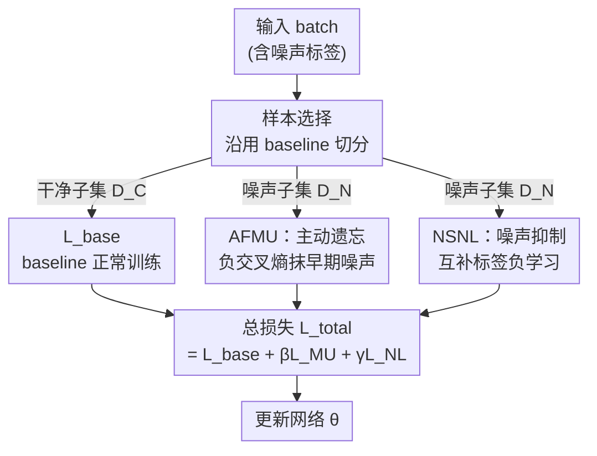

# Revisiting Learning with Noisy Labels: Active Forgetting and Noise Suppression

**会议**: CVPR 2026  
**论文**: [CVF Open Access](https://openaccess.thecvf.com/content/CVPR2026/html/Sheng_Revisiting_Learning_with_Noisy_Labels_Active_Forgetting_and_Noise_Suppression_CVPR_2026_paper.html)  
**代码**: https://github.com/NUST-Machine-Intelligence-Laboratory/FINE  
**领域**: 噪声标签学习 / 鲁棒训练 / 损失正则  
**关键词**: 噪声标签学习, 机器遗忘, 负学习, 即插即用正则项, 鲁棒训练

## 一句话总结
针对噪声标签学习长期依赖"挑干净样本"导致的过拟合瓶颈，本文提出即插即用框架 FINE：用基于机器遗忘的负交叉熵损失"主动遗忘"早期已吸收的噪声知识，再用基于负学习的互补标签损失"抑制"后期对噪声的过拟合，挂在 SED / ACT 等现有 SOTA 上即可稳定提升鲁棒性与泛化。

## 研究背景与动机
**领域现状**：噪声标签学习（Learning with Noisy Labels, LNL）的主流范式是"依赖干净样本"（clean-sample reliance）——通过样本选择（small-loss 准则、GMM/BMM 建模损失分布）、标签矫正（噪声转移矩阵、伪标签）、样本重加权（meta-learning 自适应权重）等手段，尽可能多地把可信样本挑出来、让模型只学它们。

**现有痛点**：作者通过观察训练动态发现，这类方法存在一个绕不过去的瓶颈。把训练过程拆开看，噪声拟合分两个阶段：**早期泛化学习**（Finding 1：模型快速拟合干净+噪声样本，训练精度很快超过真实干净率）和**后期噪声过拟合**（Finding 2：测试精度开始下降，但训练精度继续攀升、远超干净率）。也就是说，无论样本选择多准，只要没有 oracle 先验，模型在早期就已经不可避免地"吃进"了一部分噪声知识，后期又持续过拟合，单靠"挑干净的"无法把已经内化的污染清除掉。

**核心矛盾**：clean-sample reliance 的强项（专注可信监督）恰恰构成了它的天花板——它只解决"该学哪些"，从不处理"已经学坏的怎么办"和"怎么防止继续学坏"。

**本文目标**：跳出"只挑干净样本"的单一思路，回答两个新问题：(1) 如何**主动遗忘**模型已经内化的早期噪声知识；(2) 如何**抑制**后期对噪声监督的进一步吸收。

**切入角度**：把两个原本和 LNL 无关的范式引进来——机器遗忘（Machine Unlearning, MU）天然擅长"抹掉特定数据的影响"，负学习（Negative Learning, NL）天然擅长"教模型这个图不属于某类"而非"硬记给定标签"。两者刚好对应上面两个阶段。

**核心 idea**：用"负交叉熵主动遗忘早期噪声 + 互补标签负学习抑制后期过拟合"这对即插即用正则项，补上 clean-sample reliance 不管的部分，统一成框架 FINE（active **F**orgett**I**ng + **N**oise suppr**E**ssion）。

## 方法详解

### 整体框架
FINE 不替换现有 LNL 方法，而是挂在任意"基于样本选择"的 baseline（如 SED、ACT）之上：先沿用 baseline 把一个 batch 切成干净子集 $D_C$ 和噪声子集 $D_N$，干净子集照常用 baseline 的损失 $L_{base}$ 训练；FINE 只对**噪声子集** $D_N$ 额外施加两路损失——AFMU（主动遗忘）和 NSNL（噪声抑制）。整套流程在前 $T_w$ 个 epoch 先 warmup（普通交叉熵），之后进入鲁棒训练阶段才开启两路正则。两个模块都是轻量的损失项，不改网络结构，因此完全即插即用。

### 关键设计

**1. 双阶段噪声拟合诊断：把"何时学坏"讲清楚**

这是整套方法的动机基石，也是设计两个模块的依据。作者把噪声拟合分解为两条经验观察：Finding 1——早期模型对干净和噪声样本一视同仁地快速拟合，训练精度迅速超过真实干净率，说明早期就已吸收噪声；Finding 2——后期测试精度下滑、训练精度却继续超过干净率往上走，说明模型在持续过拟合噪声与难样本。这两条把"为什么挑干净样本不够"量化成了具体的训练动态：早期污染已成事实（要遗忘），后期污染仍在加剧（要抑制）。FINE 的两个模块正是分别对应这两个阶段，而非笼统地"增强鲁棒性"。

**2. AFMU：用负交叉熵主动遗忘早期噪声知识**

针对 Finding 1 暴露的"早期噪声已被内化"问题，AFMU（Active Forgetting via Machine Unlearning）把机器遗忘引入 LNL，对噪声子集 $D_N$ 施加一个**负交叉熵损失**：

$$l_{MU}(x_i, y_i) = +\frac{1}{C}\sum_{j=1}^{C} y_i^j \log\big(p_i^j(\theta)\big), \quad (x_i,y_i)\in D_N$$

注意它与标准交叉熵 $l_{ce} = -\frac{1}{C}\sum_j y_i^j \log p_i^j$ 只差一个符号：标准 CE 推高模型对给定标签的置信度，而 $l_{MU}$ **反转了优化方向**，主动压低模型对（疑似噪声的）给定标签的预测概率，从而把之前已经记住的污染知识逐步"擦掉"。这是 LNL 里首次用机器遗忘做"清除已学噪声"，与现有"只挑干净样本"的策略正交、互不干扰干净样本的学习，因此能即插即用。

**3. NSNL：用互补标签负学习抑制后期过拟合**

针对 Finding 2 的"后期持续过拟合噪声"，NSNL（Noise Suppression via Negative Learning）换一个思路：不去"拟合给定标签"，而是教模型"这个输入**不属于**某个互补类"。互补标签 $\tilde{y}_i$ 通过 $\mathrm{Random}(\{1-y_i^1,\dots,1-y_i^C\})_C^1$ 构造——即从所有非给定类里随机保留一个、其余置零，损失为：

$$l_{NL}(x_i, y_i) = -\frac{1}{C}\sum_{j=1}^{C} \tilde{y}_i^j \log\big(1-p_i^j(\theta)\big), \quad (x_i,y_i)\in D_N$$

它把目标从"最大化噪声标签概率"变成"压低互补（非给定）类的响应"，让噪声样本的间接监督不再强行把模型往可能错误的标签上拉，从而抑制后期对噪声的进一步吸收，同时保留模型学有意义表征的能力。与 NLNL、JNPL 等把 NL 当独立训练范式的做法不同，NSNL 是和 AFMU 配套、专打"后期"这一段的即插即用正则。

**4. 统一双层目标：遗忘 × 抑制协同**

两个模块通过一个总损失串起来，对 baseline 零侵入：

$$L_{total} = L_{base} + \beta \cdot L_{MU} + \gamma \cdot L_{NL}$$

其中 $L_{base}$ 是现有样本选择型 LNL 方法的损失，$\beta$、$\gamma$ 分别调节遗忘与抑制的强度（默认 $\beta=0.001$、$\gamma=0.1$）。AFMU 负责"清掉已积累的噪声"，NSNL 负责"防止继续学进噪声"，两者在时间维度上一前一后、协同把整条训练轨迹的噪声拟合压住——这是相比单一遗忘或单一负学习的关键区别。

### 损失函数 / 训练策略
- **两阶段训练**（Algorithm 1）：前 $T_w$ 个 epoch warmup，只用普通交叉熵 $L_{ce}$；之后进入鲁棒训练，每个 batch 先用 baseline 的样本选择切出 $D_C$/$D_N$，再分别算 $l_{MU}$、$l_{NL}$，合成 $L_{total}$ 更新 $\theta$。
- **超参**：$\beta=0.001$、$\gamma=0.1$ 在所有实验中固定；Fig. 4 显示模型对二者（尤其 $\gamma$）不敏感。
- **骨干**：合成噪声用 7 层 CNN，真实噪声用 ImageNet-1K 预训练的 ResNet50，SGD（momentum 0.9）+ 余弦退火。⚠️ warmup 与总 epoch 数等细节在补充材料，正文未给具体值。

## 实验关键数据

### 主实验
合成噪声基准 CIFAR100N（闭集）与 CIFAR80N（开集，后 20 类作为 OOD），报告最后 10 个 epoch 的平均测试精度（%）。FINE 挂到 SED / ACT 上均稳定提点：

| 数据集 / 设置 | SED | SED+FINE | ACT | ACT+FINE | 参照: CA2C (ICCV'25) |
|--------|------|----------|------|----------|------|
| CIFAR100N Sym-20% | 66.50 | **68.45** (+1.95) | 65.51 | 66.86 (+1.35) | 68.64 |
| CIFAR100N Sym-80% | 38.15 | **45.54** (+7.39) | 40.74 | 41.10 (+0.36) | 40.97 |
| CIFAR100N Asym-40% | 58.29 | **65.93** (+7.64) | 63.48 | 64.44 (+0.96) | 65.59 |
| CIFAR80N Sym-20% | 69.10 | 70.13 (+1.03) | 67.09 | 68.72 (+1.63) | 70.06 |
| CIFAR80N Sym-80% | 42.57 | 43.92 (+1.35) | 38.58 | 39.36 (+0.78) | 40.47 |
| 6 设置平均 | 55.91 | **59.79** (+3.88) | 56.63 | 57.68 (+1.05) | 58.57 |

最难的 CIFAR100N Sym-80% 上，SED+FINE 的 45.54% 比 CA2C 高 4.57 个点；平均也刷新了 SOTA。

真实噪声细粒度基准（ResNet50 骨干，web 采集，噪声结构未知）：

| 方法 | Web-Aircraft | Web-Bird | Web-Car | 平均 |
|------|------|------|------|------|
| ACT (MM'24) | 86.56 | 81.43 | 88.75 | 85.58 |
| ACT+FINE | 87.13 (+0.57) | 81.67 (+0.24) | 89.12 (+0.37) | 85.97 (+0.39) |
| SED (ECCV'24) | 86.62 | 82.00 | 88.88 | 85.83 |
| SED+FINE | **87.52** (+0.90) | **82.17** (+0.17) | **90.10** (+1.22) | **86.60** (+0.77) |
| CA2C (ICCV'25) | 87.70 | 82.48 | 89.11 | 86.43 |

SED+FINE 平均 86.60%，超过 SED、ACT、CA2C 等近期 SOTA。

### 消融实验
在 SED 上分别开关 AFMU 与 NSNL（测试精度 %）：

| 配置 | CIFAR100N Sym-20% | CIFAR100N Sym-80% | CIFAR100N Asym-40% |
|------|------|------|------|
| SED (baseline) | 66.50 | 38.15 | 58.29 |
| SED + AFMU | 68.23 | 42.46 | 65.69 |
| SED + NSNL | 67.47 | 42.70 | 65.59 |
| SED + FINE (两者) | **68.45** | **45.54** | **65.93** |

CIFAR80N 上同样规律：单开 AFMU 或 NSNL 都比 baseline 好，两者合用最佳（如 Asym-40%：60.87 → AFMU 61.38 / NSNL 61.92 / FINE 64.74）。

### 关键发现
- **两个模块各有侧重、合用最强**：AFMU 与 NSNL 单独都能提升，但在 Asym-40%、Sym-80% 这类高/结构化噪声下，两者协同（FINE）的增益明显大于任一单模块，印证"先遗忘已学噪声、再抑制继续学噪声"的双阶段假设。
- **越难越有效**：增益在 Sym-80%、Asym-40% 等高噪声设置下最大（如 SED 在 CIFAR100N Asym-40% 上 +7.64），说明它确实在 baseline 最吃亏的过拟合场景里补了短板。
- **超参鲁棒**：$\beta$、$\gamma$ 在较宽范围内性能稳定（尤其 $\gamma$），固定一组就能跨数据集用，便于即插即用。

## 亮点与洞察
- **视角转换很"啊哈"**：长期以来 LNL 都在卷"怎么挑得更准"，本文指出真正的瓶颈是"已经学坏的清不掉"，并把机器遗忘（原本做隐私/数据删除）和负学习这两个外部范式接进来分别治"早期"和"后期"，是一个干净的问题重构。
- **负交叉熵 = 交叉熵翻符号**：用一行符号翻转就实现"主动遗忘"，几乎零额外成本、零结构改动，正则项形态使其能挂在任意样本选择型 baseline 上——这种"最小侵入"的工程性很强。
- **双阶段诊断可迁移**：把训练精度是否超过真实干净率作为"噪声过拟合"的可观测信号，这套诊断思路可用于其他鲁棒训练或早停策略的设计。
- **互补标签构造的随机性**：NSNL 用随机保留一个非给定类的方式造互补标签，避免了对噪声结构的假设，对真实未知噪声更友好。

## 局限与展望
- **增益依赖底座**：FINE 是即插即用正则，绝对性能仍受 baseline（SED/ACT）上限约束；在 Web-Bird 等已接近饱和的基准上提升很小（+0.17~+0.24），边际收益有限。
- **仍依赖样本选择切干净/噪声**：两路损失只施加在被判为噪声的 $D_N$ 上，若 baseline 的样本选择把干净样本误判为噪声，AFMU 的"遗忘"可能误伤正确知识；论文未系统分析样本选择错误率对 FINE 的影响。
- **关键训练细节在补充材料**：warmup 轮数、总 epoch 等未在正文给出，复现需查附录。⚠️ 上述公式与符号以原文为准。
- **改进方向**：可探索把"遗忘强度"$\beta$ 随训练阶段自适应（早期强、后期弱），或让 AFMU/NSNL 的作用对象不依赖硬切分而用软噪声置信度加权。

## 相关工作与启发
- **vs 样本选择类（Co-teaching / JoCoR / SED / ACT）**：它们只决定"该学哪些干净样本"，对已内化的噪声无能为力；FINE 正交补上"遗忘已学噪声 + 抑制继续学噪声"，因此能挂在它们之上叠加提升，而非替代。
- **vs 标签矫正 / 重加权（DivideMix / L2RW / L2B）**：这些仍属 clean-sample reliance，受限于矫正标签或干净子集的可靠性；FINE 不试图"恢复正确监督"，而是直接在损失层面反向清除噪声影响。
- **vs 独立负学习（NLNL / JNPL）**：它们把负学习当作独立训练范式；本文的 NSNL 是和机器遗忘配套、专打后期过拟合的即插即用正则，二者在统一双层框架内协同。
- **vs 机器遗忘原始用途**：MU 原为隐私/数据删除而生，本文首次把它当作"训练中持续抹除噪声知识"的工具，拓展了 MU 的应用边界。

## 评分
- 新颖性: ⭐⭐⭐⭐⭐ 把机器遗忘 + 负学习重构为"主动遗忘 × 噪声抑制"双阶段框架，视角确实新。
- 实验充分度: ⭐⭐⭐⭐ 合成+真实双基准、两套 baseline、模块消融与超参敏感性齐全；但缺对样本选择错误率影响的分析。
- 写作质量: ⭐⭐⭐⭐ 动机—发现—方法逻辑闭环清晰，Fig.1/Fig.3 直观；部分训练细节甩到附录。
- 价值: ⭐⭐⭐⭐ 即插即用、零结构改动、超参鲁棒，对 LNL 实践友好；但绝对增益受底座限制。

<!-- RELATED:START -->

## 相关论文

- [\[ICML 2026\] Learning Locally, Revising Globally: Global Reviser for Federated Learning with Noisy Labels](../../ICML2026/optimization/learning_locally_revising_globally_global_reviser_for_federated_learning_with_no.md)
- [\[CVPR 2026\] FedRG: Unleashing the Representation Geometry for Federated Learning with Noisy Clients](fedrg_unleashing_the_representation_geometry_for_federated_learning_with_noisy_c.md)
- [\[CVPR 2026\] FedSDR: Federated Graph Learning with Structural Noise Detection and Reconstruction](fedsdr_federated_graph_learning_with_structural_noise_detection_and_reconstructi.md)
- [\[AAAI 2026\] Data Heterogeneity and Forgotten Labels in Split Federated Learning](../../AAAI2026/optimization/data_heterogeneity_and_forgotten_labels_in_split_federated_learning.md)
- [\[NeurIPS 2025\] Near-Exponential Savings for Mean Estimation with Active Learning](../../NeurIPS2025/optimization/near-exponential_savings_for_mean_estimation_with_active_learning.md)

<!-- RELATED:END -->
