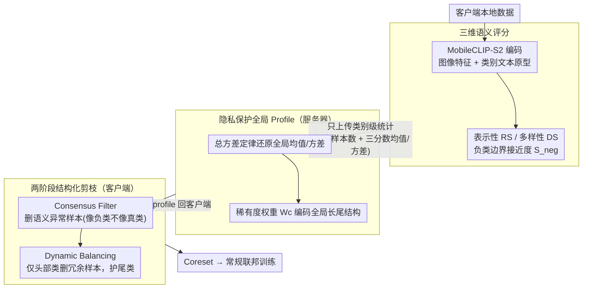

# SCOPE: Semantic Coreset with Orthogonal Projection Embeddings for Federated learning

**会议**: CVPR2026  
**arXiv**: [2603.12976](https://arxiv.org/abs/2603.12976)  
**代码**: 无  
**领域**: 优化  
**关键词**: 联邦学习, coreset selection, 长尾分布, Vision-Language Model, 数据剪枝

## 一句话总结
SCOPE 用一个零训练的视觉语言几何打分器，把每个样本压缩成表示性、多样性和负类边界接近度三个标量，再由服务器只聚合这些轻量统计量形成全局共识，指导各客户端先删语义异常样本、再删多数类冗余样本，从而在强非 IID 和长尾联邦场景下兼顾精度、鲁棒性和极低通信开销。

## 研究背景与动机
联邦学习里做数据剪枝并不新，但把它放到科学仪器驱动的真实分布上，问题会立刻变得更棘手。论文关心的是一种很典型的现实场景：每个边缘节点都握着自己采集的数据，数据量巨大、隐私敏感、类别极不均衡，而且不同节点之间不仅标签分布不同，数据质量也不同。

现有做法的第一个问题是“只看本地”。很多 coreset 方法依据局部密度、局部梯度或局部损失来判断哪些样本应该保留，但在联邦场景中，某个样本对单个客户端看起来冗余，并不代表它对整个联邦系统也是冗余。一个节点里的“普通样本”，在全局分布里可能恰恰属于稀有尾类。

第二个问题是“训练代价太高”。不少数据选择方法要先在本地全量数据上做 warmup 训练，靠 loss、gradient norm、forgetting events 之类信号找重要样本。这在高吞吐科学数据上很不经济，因为你本来想用剪枝来省算力，结果在剪枝前先把大头算力花掉了。

第三个问题是“高损失不一定代表高价值”。在自然图像 benchmark 上，高 loss 样本常被当作有信息量的 hard example；但在科学成像或传感器数据里，高 loss 很可能只是噪声、伪影、采样错误或标注不稳定。把这些样本保留下来，往往不是增强泛化，而是把噪声进一步注入联邦聚合。

第四个问题是“全局视角和隐私/带宽天然冲突”。想知道全局分布，就容易想到上传 embedding、梯度或代理数据集。但这些方式不是泄露更多语义信息，就是通信量太大，不适合真实边缘环境。

因此，这篇论文实际在解三个互相耦合的子问题。

第一，能不能不做本地训练，只靠预训练视觉语言模型的语义空间，就对样本效用做近似可靠的量化。

第二，能不能把这种量化结果压缩到极轻量的形式，让服务器拥有全局统计视角，但又不必拿到高维特征或原始样本。

第三，能不能在做数据压缩的同时不破坏长尾结构，尤其不要让头部类继续挤压尾部类的生存空间。

作者的切入点很明确：与其传高维 embedding，不如先在统一的 vision-language 语义空间中，把每个样本投影成少量几何指标；与其让客户端凭感觉做删样本，不如由服务器先汇总全局类别级统计，再把“全局共识”广播回去，指导本地剪枝。

论文的核心 idea 可以概括成一句话：先用 VLM 的语义投影把样本价值压缩成可通信的标量，再用全局类别统计把联邦剪枝从“局部启发式”升级为“全局知情的双阶段数据治理”。

## 方法详解
SCOPE 想解决的核心矛盾是：联邦场景里既要剪掉无用样本省算力和带宽，又不能凭单个客户端的局部视角乱删——一个节点眼里的冗余样本，在全局长尾分布里可能正是稀有尾类。它的破局思路是不去追问"哪些样本最难"，而是把样本分成三类区别对待：语义明显不对劲、像噪声或类别错配的先删；明显落在头部类中心、重复度高的再删；真正支撑决策边界、保持类内多样性或保护尾类的尽量留。这套判据完全建立在预训练 VLM 的语义几何上，不依赖任何训练动态，因此整个 coreset 构造是训练前、零训练、轻通信的。

### 整体框架
流程分四步串起来。首先每个客户端用 MobileCLIP-S2 把图像编码进共享语义空间，并用自然语言 prompt 为每个类别构造文本原型，再为每个样本算出三个标量分数——表示性 RS、多样性 DS、负类边界接近度 $S_{neg}$。接着客户端不上传任何样本级 embedding，只把类别级统计量（每类样本数 + 三个分数的均值和方差）发给服务器，服务器据此拼出一个全局 profile，既知道每个类在全局有多稀有，也知道每个语义指标在全局的正常分布范围。然后客户端拿回这份 profile，先跑 Consensus Filter 删掉语义自相矛盾的样本（更像负类却不太像真类的），再跑 Dynamic Balancing——这一步不再无差别删样本，而是只在"本地很多且全局也常见"的头部类里删最冗余的样本，从而压头部、保尾部。最终筛出的 coreset 才进入后续常规联邦训练。

### 关键设计

**1. 三维语义评分：用一次正交投影把样本价值拆成正交的三个标量**

单一指标没法同时兼顾"保核心锚点、保类内多样性、保决策边界"这三件事，SCOPE 干脆在 CLIP 空间里把样本价值拆成三个互补的维度。表示性分数 $RS_i = v_{img,i} \cdot t_{c_i}$ 是图像特征和本类文本原型的内积，衡量样本有多典型；多样性分数则取正交投影残差 $DS_i = \|v_{img,i} - RS_i\, t_{c_i}\|_2$，也就是把原型方向上的分量减掉后剩下的模长，专门捕捉"超出原型之外、属于这一类却带新意"的类内变化；边界接近度 $S_{neg,i} = \max_{j \neq c_i} v_{img,i} \cdot t_j$ 取与最近负类原型的相似度，刻画样本有多容易被混淆到别的类。关键在于 RS 和 DS 通过正交分解被显式拆开——不是简单地"和原型像/不像"二选一，而是把"标准性"和"新颖性"当成两个独立轴，于是后续筛选能干净地把噪声、冗余和有价值的边界样本区分开。

**2. 隐私保护的全局 Profile：只传类别级统计就还原出全局语义坐标**

想要全局视角，最直接的做法是上传 embedding，但那既泄露语义又吃带宽。SCOPE 让客户端只上传每类的样本数和三个分数的均值、方差，服务器靠总方差定律把组内方差和组间方差分别还原，从而算出每个指标真正的全局均值和方差，作为后续 Z-score 标准化的统一参考系。之所以要显式分解方差而不是简单平均，是因为联邦客户端之间分布差异极大，直接平均会严重低估异质性、给出偏窄的"正常范围"。同时服务器按全局类频率算出稀有度权重

$$W_c \propto \left(\frac{1}{F_c + \epsilon}\right)^{\gamma}$$

把全局长尾结构编码进来。这样通信量从传特征中心的高维降到类数量级，隐私和带宽都得到保证，全局知情却不暴露样本。

**3. 两阶段结构化剪枝：先按语义清噪、再按频率压头部**

把"删噪声"和"删冗余"塞进同一个排序分数里，很容易把困难样本误当噪声删掉。SCOPE 因此拆成两阶段、各管一件事。阶段一 Consensus Filter 用 Z-score 标准化后的分数算异常分 $AS_i = \hat{Z}_{S_{neg},i} - \hat{Z}_{RS,i}$，删掉前 $p_l$ 比例最异常的样本，也就是"更像负类、又不像真类"的那批——注意它判噪声靠的是语义错配而非高 loss，所以不会把正常的 hard example 误删。阶段二 Dynamic Balancing 换一个冗余分数 $R_i = \hat{Z}_{RS,i} - \hat{Z}_{S_{neg},i} - \hat{Z}_{DS,i}$，专门挑"典型、远离边界、又缺乏新颖性"的样本，但删除并非全局无差别：只对目标类指标 $T_c = f_c / W_c$（本地频率 $f_c$ 高且全局稀有度 $W_c$ 低，即头部类）较高的类别才执行删前 $p_f$ 比例的操作。这种非均匀的结构化压缩让削减集中落在头部类，尾类和边界样本被主动保护下来。

### 损失函数 / 训练策略
SCOPE 不引入任何新损失，它的口号就是"selection is training-free"——筛选发生在训练之前，下游沿用常规联邦训练（SGD + cosine decay 学习率，总通信 200 轮，报告最后 10 轮 Top-1 的平均值）。和它对比的 FedCS、FedCore、EL2N、Forgetting、GradND 都得先在本地全量数据上 warmup、靠训练信号选样本，而 SCOPE 跳过了这步 warmup，所以在 selection 阶段本身就更省。从优化视角看，这套数据构造相当于在训练前重塑经验分布：异常筛选压低梯度偏差项、动态平衡缓解 client drift、全局 rarity 约束阻止长尾被进一步破坏。论文据此在非凸情形下给出理论说明——不是改了优化器，而是让最终联邦目标的异质性项和逼近误差项更小，从而收敛到更紧的 stationary point。

## 实验关键数据
实验覆盖四个数据集和多种模型配置：

- CIFAR-10 + ResNet-18
- Tiny-ImageNet + ResNet-50
- CIFAR-100 + ViT-B-16
- UHCS 显微组织数据 + Swin-Tiny

联邦设置上，作者同时控制两类难度：

- 用 Dirichlet 参数 $\alpha \in \{0.1, 1.0\}$ 制造局部 label skew。
- 用长尾不平衡比 $IR \in \{2, 5, 10\}$ 控制全局类不均衡。

超参数方面：

- 异常过滤比例 $p_l = 0.1$。
- 冗余过滤比例 $p_f$ 在 $0.1, 0.3, 0.5, 0.7, 0.9$ 上做扫描。
- 动态平衡阈值默认 $\beta = 0.5$，附录验证这是最稳妥的取值。

作者最想强调的结论有三条。

第一，SCOPE 在高剪枝率下明显更稳。很多 baseline 在 $p_f$ 上升后会快速掉点，而 SCOPE 的曲线波动更小，说明它对“删多少数据”不那么敏感。

第二，SCOPE 有时能超过 Full DB。最直观的例子是 CIFAR-10 上 IR=2、$\alpha=0.1$、$p_f=0.1$ 时，SCOPE 达到 56.48%，略高于全量数据库训练的 55.63%。这说明原始数据里确实存在会伤害联邦聚合的噪声和偏置样本。

第三，SCOPE 的系统效率优势非常夸张。因为它只传类别级标量统计，不传高维特征中心，所以 server-side communication 从 $O(K \times C \times D)$ 下降到 $O(K \times C)$，在不同数据集上带来 128 倍到 512 倍不等的带宽缩减。

### 主实验

| 数据集/设置 | 指标 | 本文 SCOPE | 代表性基线 | Full DB | 结论 |
|--------|------|------|----------|------|------|
| CIFAR-10, ResNet-18, IR=2, $\alpha=0.1$, $p_f=0.1$ | Top-1 Acc | 56.48 | FedCore 55.96 / FedCS 53.09 | 55.63 | SCOPE 略超全量训练，说明清噪+平衡能改善优化轨迹 |
| CIFAR-10, ResNet-18, IR=10, $\alpha=0.1$, $p_f=0.1$ | Top-1 Acc | 45.65 | FedCore 44.98 / FedCS 43.40 | 45.07 | 在重度长尾下仍优于主要基线 |
| Tiny-ImageNet, ResNet-50, IR=2, $\alpha=1.0$, $p_f=0.3$ | Top-1 Acc | 60.31 | GradND 59.49 / FedCS 58.81 | 59.85 | 中等剪枝时达到该组最佳，鲁棒性突出 |
| Tiny-ImageNet, ResNet-50, IR=5, $\alpha=0.1$, $p_f=0.9$ | Top-1 Acc | 55.38 | FedCore 52.42 / FedCS 52.57 | 54.41 | 极端压缩下仍保持竞争力，明显抗头部偏置 |
| UHCS, Swin-Tiny, IR=10, $\alpha=0.1$, $p_f=0.9$ | Top-1 Acc | 92.62 | GradND 83.33 / FedCS 80.33 | 93.99 | 在专业科学图像上优势非常显著，说明语义几何比梯度信号更稳 |
| CIFAR-100, ViT-B-16, IR=2, $\alpha=0.1$, $p_f=0.1$ | Top-1 Acc | 85.10 | FedCS 84.56 / FedCore 84.40 | 85.09 | 复杂类别空间下仍保持最佳或并列最佳 |

### 消融实验

| 配置 | CIFAR-10, IR=10, $p_f=0.1/0.5/0.9$ | Tiny-ImageNet, IR=5, $p_f=0.1/0.5/0.9$ | 说明 |
|------|---------|------|------|
| Full SCOPE | 45.65 / 45.04 / 42.80 | 54.65 / 54.28 / 55.28 | 完整的全局 profile + 异常过滤 + 冗余平衡 |
| w/o Global Profiling | 38.68 / 31.61 / 19.04 | 53.76 / 50.19 / 38.36 | 去掉全局共识后，高剪枝率下几乎崩盘，说明本地启发式不够 |
| w/o Anomalies Filter | 43.18 / 41.87 / 39.79 | 54.46 / 54.11 / 52.25 | 不先清噪会保留语义异常样本，拖累聚合稳定性 |
| w/o Redundant Filter | 42.61 / 42.45 / 42.61 | 54.07 / 54.03 / 54.78 | 不做头部类去冗余时，长尾保护和压缩效率都受损 |

### 关键发现
- 全局 profiling 是最关键组件。CIFAR-10 上当 $p_f=0.9$ 时，去掉它会从 42.80 直接掉到 19.04，说明“知道全局长尾结构”几乎是联邦剪枝成立的前提。
- 异常过滤和冗余过滤是互补关系。前者主要控制噪声与语义错配，后者主要控制头部类重复；两者任一缺失，收益都会明显缩小。
- SCOPE 不是简单保留 hard sample。它保留的是“边界重要但不明显脏”的样本，同时主动删除“像负类又不像真类”的异常点，这比传统 high-loss 策略更稳。
- 在通信与算力上，SCOPE 的优势来自指标表达方式，而不是某个工程 trick。以 ResNet-50 + Tiny-ImageNet 为例，通信量从约 160 MB 降到约 320 KB，约 512 倍缩减。
- 在 coreset selection 开销上，ViT-B-16 配置下，SCOPE 选择阶段耗时 283 秒，对比 FedCS 的 2186 秒，约 7.72 倍加速；峰值显存 1039 MB，对比 8208 MB，约 7.9 倍下降。
- scorer backbone 不需要越大越好。表 7 显示 MobileCLIP-S2 只有 99M 参数，但在 Tiny-ImageNet 上 58.25% 的结果并不输更大的 ViT-H-14 和 MetaCLIP，说明做数据筛选更看重语义结构是否稳定，而不一定追求最强表征模型。
- 动态平衡阈值 $\beta=0.5$ 是最稳妥的默认值。阈值太低会 under-prune，阈值太高会把尾类支撑点误删，呈现明显的倒 U 型规律。

## 亮点与洞察
- 最大亮点是把联邦全局视角压缩成“类别级标量统计”。这比上传 embedding center 更符合联邦约束，也让方法自然获得很强的可扩展性。
- 正交投影这一步很巧。作者不是直接用与类原型的相似度判定样本价值，而是把“类原型方向”和“正交残差信息”拆开，显式地区分标准性与新颖性。
- 两阶段筛选比单一分数排序更合理。先删异常、再删冗余，相当于先处理噪声污染，再处理分布压缩，避免把噪声和难样本混为一谈。
- 方法和下游训练架构解耦，这一点很有价值。SCOPE 用 MobileCLIP-S2 打分，但最后 coreset 可以服务于 CNN 和 Transformer，不要求选择器与训练器同构。
- 这篇论文给出的一个重要启发是：联邦数据治理未必要围绕梯度做文章，也可以围绕“共享语义空间中的统计几何”来做。这为后续轻量联邦 sample selection 提供了很好的方向。

## 局限与展望
- 方法强依赖预训练 VLM 的语义空间质量。虽然作者展示了在 UHCS 这样的专业数据上仍然有效，但如果文本类名非常抽象、或类别语义无法被自然语言 prompt 充分表达，RS/DS/$S_{neg}$ 的稳定性可能会下降。
- 论文主要比较的是现有 coreset/pruning baseline，没有深入比较更现代的联邦重加权、重采样、个性化 FL 或 class-balanced optimization 方法，因此“它到底更像数据层方案还是优化层方案替代品”还不够清楚。
- 理论部分更像合理性说明，而不是非常紧的收敛分析。很多关键假设，如语义异常分数到梯度偏差的 Lipschitz 映射，仍较强。
- 当前方案仍需要所有客户端共享统一类别词表。若遇到开放世界类别、类名不一致、跨机构标签空间不完全对齐的情况，SCOPE 需要扩展。
- 多样性分数本质上仍由 RS 派生而来，虽然作者通过标准化和非线性解释强化了其独立价值，但两者并非真正完全独立的信号源。
- 一个可改进方向是把文本 prompt 学习做成联邦可更新的轻量模块，而不是固定模板。这样能更适配专业领域标签。
- 另一个方向是把 SCOPE 和联邦主动学习结合，让服务器不仅决定“删什么”，也指导“后续优先采什么”。

## 相关工作与启发
- **vs FedCS**: FedCS 依赖高维特征中心和本地训练信息，通信和算力都更重；SCOPE 只上传类别级标量，且剪枝依据更偏语义几何，尤其适合带宽受限场景。
- **vs FedCore**: FedCore 试图降低联邦 coreset 选择成本，但仍需要 warmup 训练；SCOPE 则把选择过程前移到训练前，思路更彻底。
- **vs EL2N / GradND / Forgetting**: 这些方法都基于训练动态信号，容易把科学噪声误认成高价值困难样本；SCOPE 通过异常过滤机制显式地对这种误判做抑制。
- **vs 传统几何筛选**: 传统欧氏距离或 herding 方法更关注分布中心覆盖，SCOPE 则同时考虑原型对齐、正交残差和跨类边界，语义层次更丰富。
- 对我自己的启发是，若后续做联邦长尾学习，不必把“压缩”“公平”“鲁棒”拆成三个模块分别优化，也许可以先找一个足够可解释的共享语义空间，再在空间内定义少量低带宽统计量，让全局信息自然进入本地决策。

## 评分
- 新颖性: ⭐⭐⭐⭐☆ 以 VLM 语义几何做联邦 coreset，并把全局共识压成标量 profile，这个组合很新，但底层组件本身并非全新。
- 实验充分度: ⭐⭐⭐⭐☆ 数据集和模型覆盖较广，系统开销也分析得很完整；但与更广泛联邦长尾方法的比较还可以更深。
- 写作质量: ⭐⭐⭐⭐☆ 动机、方法和系统收益讲得很顺，图表也能支持核心结论；理论部分略偏直觉化。
- 价值: ⭐⭐⭐⭐⭐ 如果目标是做真实边缘环境中的联邦数据治理，这篇工作很有参考价值，尤其在低带宽和极端长尾条件下。

<!-- RELATED:START -->

## 相关论文

- [\[CVPR 2026\] Fed-ADE: Adaptive Learning Rate for Federated Post-adaptation under Distribution Shift](fed-ade_adaptive_learning_rate_for_federated_post-adaptation_under_distribution_.md)
- [\[CVPR 2026\] Enhancing Visual Representation with Textual Semantics: Textual Semantics-Powered Prototypes for Heterogeneous Federated Learning](enhancing_visual_representation_with_textual_semantics_textual_semantics_powered_p.md)
- [\[ICLR 2026\] Learning to Recall with Transformers Beyond Orthogonal Embeddings](../../ICLR2026/optimization/learning_to_recall_with_transformers_beyond_orthogonal_embeddings.md)
- [\[CVPR 2026\] UniFusion: A Unified Image Fusion Framework with Robust Representation and Source-Aware Preservation](unifusion_a_unified_image_fusion_framework_with_robust_representation_and_source.md)
- [\[ICLR 2026\] DeepAFL: Deep Analytic Federated Learning](../../ICLR2026/optimization/deepafl_deep_analytic_federated_learning.md)

<!-- RELATED:END -->
