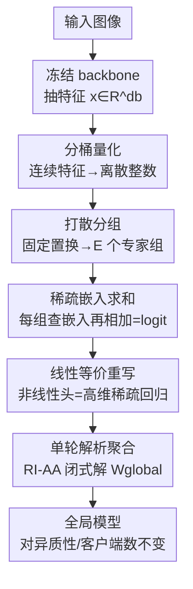

# Single-Round Scalable Analytic Federated Learning

**会议**: CVPR 2026  
**论文**: [CVF Open Access](https://openaccess.thecvf.com/content/CVPR2026/html/Bacellar_Single-Round_Scalable_Analytic_Federated_Learning_CVPR_2026_paper.html)  
**代码**: 无  
**领域**: 联邦学习 / 优化  
**关键词**: 解析联邦学习, 单轮通信, 非IID不变性, 稀疏嵌入, 闭式解

## 一句话总结
SAFLe 用「特征分桶 + 打散分组 + 稀疏嵌入求和」搭出一个确定性的非线性分类头，并证明它在数学上等价于一个高维稀疏线性回归，从而能直接套用解析联邦学习（AFL）的单轮闭式聚合律——既拿到非线性的表达力，又保留 AFL「一轮通信 + 对数据异质性完全不变」的两大优势，在三个视觉联邦基准上同时超过线性 AFL 和多轮 DeepAFL。

## 研究背景与动机
**领域现状**：联邦学习（FL）让多个客户端在不暴露本地数据的前提下协同训练一个共享模型。主流范式 FedAvg 及其变体靠多轮「本地更新 → 服务器聚合」迭代，往往要几百上千轮才收敛。

**现有痛点**：迭代式 FL 有两个老大难。一是**通信开销巨大**，客户端速度不一、会掉线、会中途崩溃，落地时全局模型可能要几天甚至几周才收敛；二是**非 IID 下性能崩塌**，各客户端本地分布差异大时，每个客户端的梯度方向都偏离全局最优，越异质掉点越狠（论文里 FedAvg 在 CIFAR-100 上从 α=0.1 的 56.62% 一路跌到 α=0.01 的 32.99%）。

**核心矛盾**：解析联邦学习（AFL）本来漂亮地解决了这两点——它冻结一个预训练 backbone 抽特征，只对一个线性回归头求最小二乘闭式解，靠「绝对聚合律（AA）」一轮就能从各客户端本地解精确重构出集中式训练才能得到的全局模型，且这个解对数据如何切分、客户端有多少**严格不变**。但 AFL 只能训一个线性层，**表达力被锁死**。后续的 DeepAFL 用随机投影堆深层找回了非线性精度，却为此**牺牲了单轮性**：每加一层就要两轮额外聚合，T=20 的模型要 41 轮通信，等于把 AFL 想消灭的多轮负担又请了回来。于是出现一个清晰的二选一：AFL 单轮但线性，DeepAFL 非线性但多轮。

**本文目标**：打破这个 trade-off——在**不增加通信轮数、不破坏闭式解和异质不变性**的前提下，给解析 FL 注入非线性表达力。

**切入角度**：作者认为 DeepAFL 的「随机投影找非线性」太低效——它赌的是堆够多随机矩阵 + 激活就能碰巧逼近数据的非线性曲面，所以得堆很深才够准。换个思路：与其靠随机，不如**确定性地把连续特征空间分桶**，切成一堆离散「区域」，再用嵌入层直接为落进特定区域组合的输入学最优 logit——这等于直接显式建模非线性函数。

**核心 idea**：把非线性头设计成「分桶 → 打散分组 → 稀疏嵌入求和」的确定性流水线，并证明这个结构可以**重写成一个高维稀疏的线性回归**，从而原封不动地继承 AFL 的单轮闭式聚合。

## 方法详解

### 整体框架
SAFLe（Sparse Analytic Federated Learning with nonlinear embeddings）要解决的是「让解析 FL 既非线性又单轮」。它把 AFL 那个简单线性回归头，换成一个**确定性的非线性变换头** $f_{NL}(x)$。

整条流水线是：图像先过一个冻结的预训练 backbone 抽出特征向量 $x \in \mathbb{R}^{d_b}$；接着头部分三步把它变成类别 logit $\hat{y} \in \mathbb{R}^C$——① **分桶**把每个连续特征量化成离散整数；② **打散分组**用固定置换打乱整数向量再切成 $E$ 个独立小组（每组就是一个「专家」）；③ **稀疏嵌入求和**把每组 $G$ 个整数当成 $k$ 进制数字算出一个复合索引，去查该组专属的嵌入矩阵，最后把所有 $E$ 个嵌入的输出**直接相加**得到 logit。关键之处在于：这套路由是**确定性、不学习**的，因此整个非线性头能被改写成一个高维稀疏线性回归，进而用 AFL 的绝对聚合律一轮解出。

### 关键设计

**1. 分桶 + 打散分组 + 稀疏嵌入：用确定性结构造出可解析的非线性头**

这是 SAFLe 表达力的来源，针对的是「AFL 只能线性」这个痛点。具体三步：

第一步**分桶**（Pre-Non-Linearity Bucketing）：对 backbone 输出的每一维特征 $x_i$，用 $L$ 个不同的分桶函数 $B_l(\cdot)$ 把它量化成 $k$ 个离散 bin 之一，得到整数向量 $b \in \mathbb{Z}^{d_q}$，新维度 $d_q = d_b \times L$。这一步把连续空间切成离散「区域」，是注入非线性的根本。

第二步**打散分组**（Shuffling and Grouping）：用一个固定确定性置换 $P$ 打乱整数向量得 $b' = P(b)$，再切成 $E$ 个组，每组 $G$ 个整数，满足 $E \times G = d_q$。打散是为了**打破特征局部性**，让每个专家拿到的是跨特征的多样「子视图」而非相邻的一小块。

第三步**稀疏嵌入与求和**：每组把 $G$ 个整数当作 $k$ 进制的数位，算出一个复合索引

$$idx_j = \sum_{i=1}^{G} g_{j,i} \cdot k^{i-1}$$

该索引最大值 $V = k^G$，即每个嵌入矩阵 $W_j \in \mathbb{R}^{V \times C}$ 的「词表大小」（行数）。最终 logit 是所有 $E$ 个嵌入查表结果的**稠密相加**：

$$\hat{y} = f_{NL}(x) = \sum_{j=1}^{E} W_j[idx_j, :]$$

为什么有效：朴素做法是用一张大查找表覆盖所有特征组合，那会 intractable 且严重过拟合。SAFLe 改成「很多个小而独立的嵌入，每个只看一个固定子视图」，最终预测是所有「子视图专家」的求和，**强制泛化**——模型必须从多样的、局部的特征组合里做预测。消融显示「多个小嵌入（高 $E$、小 $G$ 和小 $V$）」对泛化至关重要。

这个结构概念上像 MoE（每个嵌入是一个专家），但有两点关键不同：路由不是学出来的门控网络，而是**固定的分桶+打散预路由**；激活不是稀疏选 top-k，而是**所有 $E$ 个专家对每个输入全部激活**（稠密求和）。正是这种固定确定性路由，才让整个非线性头能被重写成线性回归。

**2. 线性等价证明：把非线性查表改写成高维稀疏 one-hot 线性回归**

这是让上面那个非线性结构「可解析」的理论关键，直接回应「如何在保住闭式解的同时非线性」。非线性来自分组索引 $idx_j$，而一次嵌入查表 $W_j[idx_j,:]$ 本质是一个**线性的选行操作**，可以写成 one-hot 向量 $\phi_j(x) \in \{0,1\}^V$（仅 $idx_j$ 位为 1）与 $W_j$ 的乘积：$W_j[idx_j,:] = \phi_j(x)^T W_j$。于是总输出

$$\hat{y} = \sum_{j=1}^{E} \phi_j(x)^T W_j$$

把所有 $E$ 个 one-hot 横向拼成一个高维稀疏特征 $\Phi(x) = [\phi_1^T|\phi_2^T|\dots|\phi_E^T]^T \in \mathbb{R}^{D_e}$（$D_e = E \times V$），把所有嵌入矩阵纵向堆成 $W_{global} \in \mathbb{R}^{D_e \times C}$，则非线性模型被**完美表示为一个标准线性模型** $\hat{y} = \Phi(x)^T W_{global}$。这样全局目标就退化成一个最小二乘：$\mathcal{L}(W_{global}) = \|Y - \Phi W_{global}\|_F^2$，与 AFL 求解的问题**形式完全一致**，只是把 AFL 的特征矩阵 $X_k$ 换成高维稀疏的 $\Phi_k$。换言之，SAFLe 的「非线性」全部被吸收进了特征构造 $\Phi(\cdot)$ 里，权重对 $\Phi$ 仍是线性的——这正是它能解析求解的根。

**3. 单轮 RI-AA 解析聚合：用闭式解一轮拿到与集中式等价的全局模型**

有了线性等价，SAFLe 直接继承 AFL 的「正则中介 + 绝对聚合（RI-AA）」单轮聚合。每个客户端 $k$ 基于本地高维特征 $\Phi_k$ 算两个矩阵：正则化协方差 $C_k^r = \Phi_k^T \Phi_k + \gamma I \in \mathbb{R}^{D_e \times D_e}$ 和互相关 $M_k = \Phi_k^T Y_k \in \mathbb{R}^{D_e \times C}$，一次性传给服务器。服务器只做求和聚合 $C_{agg}^r = \sum_k C_k^r$、$M_{agg} = \sum_k M_k$，先解正则化解 $W_{global}^r = (C_{agg}^r)^{-1} M_{agg}$，再用 AFL 的恢复公式**解析地把正则项剥掉**，拿到精确无正则的全局解：

$$W_{global} = (C_{agg}^r - K\gamma I)^{\dagger} M_{agg}$$

因为这是 normal equation 的精确闭式解（$W_{global} = (\Phi^T\Phi)^{\dagger}(\Phi^T Y)$，且 $\Phi^T\Phi = \sum_k \Phi_k^T\Phi_k$、$\Phi^T Y = \sum_k \Phi_k^T Y_k$ 都是本地分量的简单求和），最终全局模型对数据如何在客户端间切分、客户端有多少**数学上完全不变**——这就是「单轮 + 异质不变」两大性质的由来。而且模型表达力靠加宽（增大专家数 $E$）来 scale，$D_e = E \times V$ 是可控超参，**和通信轮数解耦，永远只要一轮**，从根上避开了 DeepAFL「加深 → 多轮」的死结。

## 实验关键数据

### 主实验
三个视觉联邦基准（CIFAR-10 / CIFAR-100 / Tiny-ImageNet），所有方法统一用 ImageNet 预训练的 ResNet-18 作冻结 backbone，指标为 Top-1 准确率（%）。下表取各数据集在 α=0.1 设置下的代表值（解析方法在所有非 IID 设置下数值完全相同）：

| 数据集 | FedAvg | AFL (单轮线性) | DeepAFL (多轮非线性) | SAFLe (本文) |
|--------|--------|---------------|---------------------|-------------|
| CIFAR-10 | 64.02 | 80.75 | 86.43 | **90.73** |
| CIFAR-100 | 56.62 | 58.56 | 66.98 | **70.61** |
| Tiny-ImageNet | 46.04 | 54.67 | 62.35 | **64.58** |

SAFLe 在所有数据集和所有非 IID 设置下都同时超过迭代式和解析式基线：CIFAR-10 上比次优的 DeepAFL 高 4.3%、比 AFL 高约 10%；且仍保持单轮通信，准确率却高于多轮的 DeepAFL。

### 异质不变性
| 方法 | CIFAR-100 @ α=0.1 | CIFAR-100 @ α=0.01 | 掉点 |
|------|-------------------|--------------------|------|
| FedAvg（迭代） | 56.62 | 32.99 | **-23.6%** |
| AFL（解析） | 58.56 | 58.56 | 0 |
| DeepAFL（解析） | 66.98 | 66.98 | 0 |
| SAFLe（本文） | 70.61 | 70.61 | **0** |

迭代式方法越异质掉点越狠，而所有解析方法（含 SAFLe）在四种非 IID 设置下数值**完全不变**——SAFLe 成功把 AFL 的数学不变性扩展到了更强的非线性模型，对客户端数 $K$ 从 100 增到 1000 同样保持恒定。

### 消融实验

**通信成本（达到目标精度所需总传输量）**：虽然 SAFLe 单轮的 payload 更大，但比拼「达到某精度的总通信量」时反而更省：

| 场景 | DeepAFL | SAFLe | 节省 |
|------|---------|-------|------|
| CIFAR-100 达 ~67% | 146 MB | 70 MB | >50% |
| Tiny-ImageNet 达 62.3% | 170 MB | 60 MB | ~3× |

**分桶策略**（在 CIFAR-100、8 桶下）：

| 分桶方式 | 准确率 | 说明 |
|---------|--------|------|
| Integer（整数量化） | 58.28 | 最差，bin 边界「悬崖效应」毁泛化 |
| One-Hot | 61.66 | 稍好，但邻近输入仍被分到不相交表示 |
| Binary Overlap | **70.61** | 最好，邻近值给相似位模式，保住局部相似性 |

### 关键发现
- **嵌入配置是核心权衡**：多个小嵌入（高 $E$、低 $V$）泛化最好但相关矩阵更稠密、通信更贵；少数大嵌入（低 $E$、高 $V$）则更稀疏更省但过拟合掉点。最佳平衡点经验上在词表大小 $V \in [32, 64]$。
- **分桶方式影响巨大**：整数量化随桶数增多急剧掉点（CIFAR-10 从 2 桶 87% 跌到 20 桶 60%），因为跨 bin 边界的微小变化会产生完全不同的索引；Binary Overlapping 因保留局部相似性几乎不掉点。
- **不依赖特定 backbone**：换 ResNet-18 / VGG11 / ViT-B-16，SAFLe 都稳定超过 AFL；对比基于 ViT-B/16 视觉-语言 backbone 的 one-shot 方法 TOFA，SAFLe 在 CIFAR-10（95.31% vs 93.18%）和 CIFAR-100（77.83% vs 76.63%）上也更高。

## 亮点与洞察
- **把非线性「藏」进特征构造、让权重保持线性**：最漂亮的一招是用 one-hot 选行把嵌入查表写成线性算子，使非线性头整体退化成高维稀疏线性回归——这正是它能继承 AFL 闭式解的命门，思路可迁移到任何「想要非线性又想要解析解」的场景。
- **确定性预路由 = 可解析的 MoE**：把 MoE 的「学习门控 + 稀疏激活」换成「固定分桶打散 + 稠密求和」，用表达力换来了可解析性，是一种很有启发的设计取舍。
- **表达力与通信轮数解耦**：scale 靠加宽（专家数 $E$）而非加深，所以无论模型多大都恒定一轮通信——直接戳中 DeepAFL「加深必加轮」的痛点。
- **Binary Overlapping 分桶的细节巧思**：让邻近连续值拥有相似比特模式，避免整数量化的「悬崖效应」，是个可复用的离散化 trick。

## 局限与展望
- **单轮 payload 偏大**：虽然总通信量更省，但单次传输的 $C_k^r$ 维度是 $D_e \times D_e = (E \times V)^2$ 级别，当 $E$、$V$ 都大时单轮 payload 和服务器端求逆成本可能成为瓶颈，论文靠「稀疏 + 控制 $V \in [32,64]$」缓解。⚠️ 论文未给出大规模 $D_e$ 下求逆复杂度的定量分析。
- **依赖冻结预训练 backbone**：和 AFL 一脉相承，整套闭式解建立在「特征提取器固定、只解头部」之上，无法端到端更新 backbone，特征质量上限受预训练模型限制。
- **任务范围**：实验只覆盖图像分类，对检测/分割/序列等更复杂任务、以及 backbone 与下游分布差异大时的表现尚未验证。
- **分桶/分组超参敏感**：桶数、$E$、$V$ 都对精度和通信成本影响显著，换数据集可能需要重新调，缺乏自适应选择机制。

## 相关工作与启发
- **vs AFL**：AFL 只训一个线性头、单轮闭式解、异质不变；SAFLe 在完全保留这三点的前提下，用确定性非线性头把表达力做上去，三个基准全面反超，本质上是「AFL 的非线性升级版」。
- **vs DeepAFL**：DeepAFL 靠随机投影堆深层找非线性，但每层两轮、T=20 要 41 轮；SAFLe 靠加宽（专家求和）拿非线性且永远单轮，精度更高、达标总通信量更省（最多约 3×）。区别在于「确定性结构化路由 vs 随机投影」。
- **vs 迭代式 FL（FedAvg/FedProx/MOON/FedDyn/FedNTD）**：它们都是梯度迭代、要多轮、非 IID 下严重掉点；SAFLe 是无梯度闭式解、单轮、对异质性零掉点。
- **vs One-Shot FL（FedSD2C/FedCGS/TOFA）**：这些单轮方法靠集成、合成数据蒸馏或预训练特征统计，但通常缺乏「与集中式精确等价 + 异质不变」的严格保证，且仍有精度差距；SAFLe 兼具解析保证与更高精度。
- **vs Federated WiSARD（无权重神经网络）**：同样用「对数据切分不变」的计数式 RAM 聚合，但靠启发式与近似记忆而非闭式解析解，精度较低；SAFLe 的精确闭式解是其优势所在。

## 评分
- 新颖性: ⭐⭐⭐⭐⭐ 「非线性查表 ≡ 高维稀疏线性回归」的等价证明，干净地打破了 AFL「非线性 vs 单轮」的二选一。
- 实验充分度: ⭐⭐⭐⭐ 三数据集 × 两种非 IID × 多 backbone + 通信成本/分桶/嵌入配置消融齐全，但仅限图像分类。
- 写作质量: ⭐⭐⭐⭐⭐ 动机—直觉—证明—实验逻辑顺，等价推导步骤清晰，图文对照好读。
- 价值: ⭐⭐⭐⭐ 给解析 FL 提供了即插即用的非线性升级，单轮+异质不变在真实异步联邦部署里很实用。

<!-- RELATED:START -->

## 相关论文

- [\[ICLR 2026\] DeepAFL: Deep Analytic Federated Learning](../../ICLR2026/optimization/deepafl_deep_analytic_federated_learning.md)
- [\[CVPR 2025\] Model Poisoning Attacks to Federated Learning via Multi-Round Consistency](../../CVPR2025/optimization/model_poisoning_attacks_to_federated_learning_via_multi-round_consistency.md)
- [\[CVPR 2026\] Few-for-Many Personalized Federated Learning](few-for-many_personalized_federated_learning.md)
- [\[CVPR 2026\] Domain Sensitive Federated Learning with Fisher-Informed Pruning](domain_sensitive_federated_learning_with_fisher-informed_pruning.md)
- [\[CVPR 2026\] FedRG: Unleashing the Representation Geometry for Federated Learning with Noisy Clients](fedrg_unleashing_the_representation_geometry_for_federated_learning_with_noisy_c.md)

<!-- RELATED:END -->
