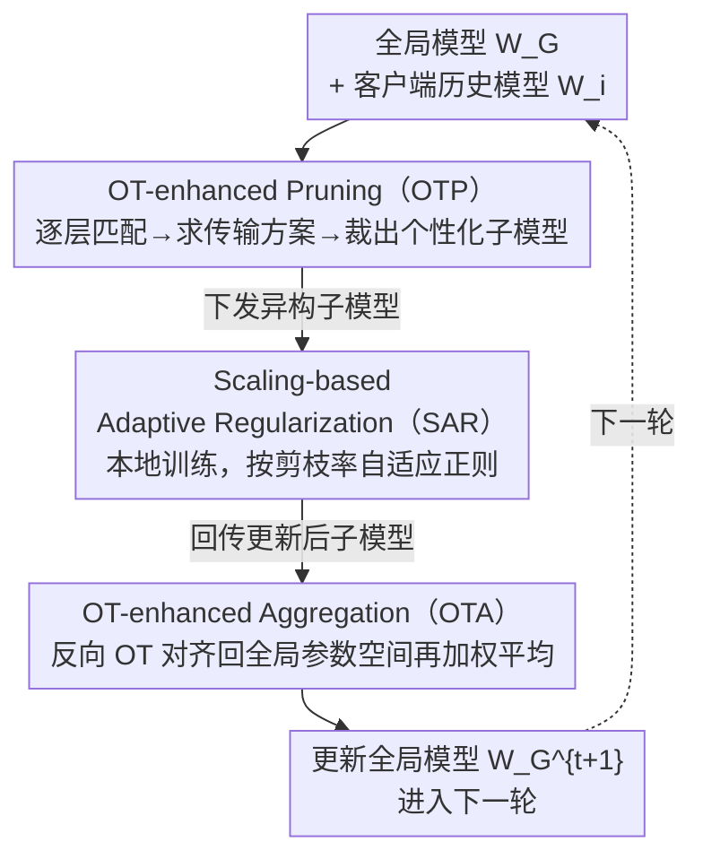

# SubFLOT：基于最优传输的高效个性化联邦学习子模型抽取

**会议**: CVPR 2026  
**论文**: [CVF Open Access](https://openaccess.thecvf.com/content/CVPR2026/html/Jiang_Submodel_Extraction_for_Efficient_and_Personalized_Federated_Learning_via_Optimal_CVPR_2026_paper.html)  
**代码**: 无  
**领域**: 联邦学习 / 优化  
**关键词**: 联邦学习, 网络剪枝, 最优传输, 个性化, 模型异构

## 一句话总结
SubFLOT 把"个性化剪枝"从客户端搬到服务端：用客户端的历史模型当作本地数据分布的代理，靠最优传输（Wasserstein 距离最小化）在服务端就为每个设备裁出贴合它数据的异构子模型，再配一个随剪枝率自适应的正则项稳住本地训练、一个同款 OT 对齐的聚合模块缓解参数漂移，在 8 个数据集上大幅超过 9 个 SOTA 联邦剪枝方法。

## 研究背景与动机
**领域现状**：联邦学习（FL）让多设备协同训练又不共享原始数据，但落地时被两类异构卡住——**系统异构**（设备算力差异大，能跑的模型大小不一）和**统计异构**（各端数据 non-IID，特征偏移+标签不均）。联邦网络剪枝是当前主流的对症方案：让每个客户端只训练一个稀疏、贴合自己硬件的子模型，既省算力/通信，又能借数据相关的剪枝准则做个性化。

**现有痛点**：剪枝"在哪儿做决策"形成了一个死结。**服务端全局剪枝**通信省、但因隐私约束看不到本地数据，只能一刀切地裁，谈不上个性化；**客户端本地剪枝**（典型是"train-prune-finetune"）能裁出高度定制的模型，但客户端必须先吃下完整大模型再裁，算力开销对资源受限的边缘设备是不可承受之重。

**核心矛盾**：服务端剪枝（统一、无个性化）和客户端剪枝（个性化、计算爆炸）二者不可兼得。更糟的是，剪枝本身会**加剧异构**——剪得越狠的子模型，权重幅值越往大处漂、越偏离全局模型的参数分布（pruning-induced parametric drift），既destabilize本地训练，又拖累聚合时的全局收敛。

**本文目标**：拆成两个具体子问题——(1) 怎样在服务端、不碰本地数据的前提下做个性化剪枝？(2) 怎样设计一个本地目标，自适应地约束子模型发散、把训练动态拉回来？

**切入角度**：作者抓住一个观察——**客户端的历史模型参数本身就是本地数据分布的高保真代理**，它隐式编码了这个客户端见过的数据。既然不能看数据，那就拿历史模型来"代言"数据分布。

**核心 idea**：把服务端个性化剪枝重写成**全局模型与客户端历史模型之间的最优传输（OT）问题**——通过最小化二者参数的 Wasserstein 距离来对齐功能等价的神经元，由此算出一个传输方案来指导针对该客户端的剪枝；同一套 OT 机制反着用又能做异构聚合，再加一个随剪枝率缩放的正则项稳训练。

## 方法详解

### 整体框架
SubFLOT 是一个**服务端个性化联邦剪枝**框架，输入是全局模型 $W_G$ 与各客户端上传的历史模型 $W_i$，输出是每轮更新后的全局模型。它把一轮通信拆成三段、由三个模块串起来：服务端用 **OTP** 给每个客户端裁出个性化异构子模型并下发；客户端在 **SAR** 正则约束下本地训练裁好的子模型并回传；服务端再用 **OTA**（OTP 的"反向复用"）把结构各异的子模型对齐后聚合，更新全局模型进入下一轮。三个模块共享同一套"渐进式逐层 OT 对齐"的几何机制，区别只在对齐的方向和用途。

### 关键设计

**1. OTP：用最优传输把历史模型"翻译"成个性化子模型**

这一招直击"服务端看不到数据、没法个性化"的痛点。作者不去碰原始数据，而是把客户端 $i$ 的历史模型 $W_i$ 当成它本地数据分布的代理，把"为 $i$ 裁子模型"重写成全局模型 $W_G$ 与 $W_i$ 之间对齐功能等价神经元的 OT 问题。直接对整个深网求 OT 计算上不可行，于是用**渐进式逐层匹配**把全局 OT 拆成一串逐层的小问题，迭代算出每层的传输方案 $\{T_i^{(l)}\}_{l=1}^{L}$。

具体地，对第 $l$ 层：先用上一层的传输方案 $T_i^{(l-1)}$ 把全局权重的输入空间重映射到与客户端对齐的特征空间 $\widehat{W}_G^{(l,l-1)} = W_G^{(l,l-1)} T_i^{(l-1)}$；再把对齐后全局权重的输出神经元与客户端本地权重的输出神经元看成两个离散分布 $\mu^{(l)},\nu^{(l)}$，以神经元两两欧氏距离构造代价矩阵 $C^{(l)}$，求解离散 OT

$$T_i^{(l)} = \arg\min_{T\in\Pi(\mu^{(l)},\nu^{(l)})}\ \langle C^{(l)}, T\rangle_F$$

其中 $\Pi(\mu^{(l)},\nu^{(l)})$ 是边缘为 $\mu^{(l)},\nu^{(l)}$ 的所有合法传输方案，$\langle\cdot,\cdot\rangle_F$ 是 Frobenius 内积。拿到 $T_i^{(l)}$ 后，把全局层权重投影进客户端参数空间得到对齐版 $W_{\text{aligned}}^{(l,l-1)} = {T_i^{(l)}}^{\top}\widehat{W}_G^{(l,l-1)}$，最后**自适应融合**全局知识与客户端的本地特化参数：

$$\widetilde{W}_i^{(l,l-1)} = \alpha\cdot W_{\text{aligned}}^{(l,l-1)} + (1-\alpha)\cdot W_i^{(l,l-1)}$$

$\alpha\in[0,1]$ 平衡"吸收最新全局知识"与"保留本地特化"。这样裁出来的子模型 $\widetilde{W}_i$ 在本地训练开始前就已经预适配了客户端 $i$ 的数据特性——和服务端一刀切剪枝的根本区别就在于：剪枝方案是从该客户端的参数几何里"学"出来的，而非全局统一施加。

**2. SAR：让正则强度随剪枝率自适应缩放，专治"剪得越狠漂得越凶"**

剪枝会诱发参数发散——剪得更狠的小模型本地更新幅度更大、更易跑偏，destabilize 训练。HeteroFL 等做法是训练后再对权重幅值做事后修正，SAR 则**主动**在训练时约束轨迹，不让模型漂进对聚合有害的参数区域。它的动机很具体：高剪枝率的子模型最容易发散，那就给它们更强的约束。

SAR 的核心是一个把客户端当前模型 $W_i$ 锚到服务端下发的 anchor $\widetilde{W}_i$ 的正则项，且惩罚强度按该客户端剪枝率 $\rho_i$ 缩放：

$$L_{\text{SAR}}(W_i) = \rho_i\cdot \lVert W_i - \widetilde{W}_i\rVert_2^2$$

这带来两个好处：(1) **自适应控制**——惩罚正比于 $\rho_i$，所以模型越小（$\rho_i$ 越大、越危险）受到的正则越强，把它的更新牢牢拴在初始化良好的 anchor 上；(2) **抑制发散**——锚定到服务端子模型，劝阻大幅参数漂移，让更新后的模型留在"可协同"的参数区域。完整本地目标把标准交叉熵与 SAR 项相加：$L_i(W_i) = L_{\text{CE}}(W_i;D_i) + \lambda\cdot L_{\text{SAR}}(W_i)$，$\lambda$ 平衡任务学习与训练稳定性。

**3. OTA：把 OTP 的几何"反向复用"，对齐后再聚合**

标准联邦平均在异构场景里常翻车——它直接平均可能对应语义不同特征的参数，造成破坏性干涉。OTA 优雅地复用了 OTP 的几何洞察：对每个客户端 $i$，用**同一套渐进逐层 OT**、但方向反过来（把更新后的客户端模型 $W_i^t$ 匹配回上一轮全局模型 $W_G^t$），算出把 $W_i^t$ 拉回全局规范参数空间的传输映射 $T_i$，再加权聚合对齐后的模型：

$$W_G^{t+1} = \sum_{i=1}^{N} p_i\cdot T_i(W_i^t)$$

$p_i = |D_i|/\sum_j|D_j|$ 按数据量加权。先对齐再平均带来两点收益：OT 对齐天然归一化参数尺度，**缓解不同剪枝率导致的幅值差异**；OT 又能匹配功能相近的神经元，**压制特征偏移的负面效应**，让全局更新更稳更有效。值得注意的是，消融里 OTA 是去掉后掉点最猛的模块——因为 OTP 产出的子模型结构高度异构，没有这个事后对齐机制根本聚合不好。

### 损失函数 / 训练策略
本地目标即 $L_i(W_i)=L_{\text{CE}}+\lambda L_{\text{SAR}}$。默认 $N=20$ 客户端全参与，200 轮通信、每轮本地 5 epoch、SGD（lr=0.001、batch=256）；剪枝率从 $\{0,1/4,1/2,3/4\}$ 随机采样；融合系数 $\alpha=0.5$、正则权重 $\lambda=1.0$。作者还给出线性收敛到全局最优邻域的理论保证（Theorem 1），邻域大小由梯度噪声 $\sigma^2$、统计异构 $G^2$、个性化偏差 $\delta_P^2$、OT 对齐扰动 $\delta_{OT}^2$ 与 SAR 强度共同决定。

## 实验关键数据

### 主实验
跨 8 数据集（CV/NLP/IoT）对比 10 个联邦剪枝方法，指标为本地模型平均准确率（3 次随机种子均值）。标签偏移 + 真实场景下，SubFLOT 全面、显著领先，且任务越难优势越大：

| 设置 | 数据集 | SubFLOT | 次优(FlexFL) | 提升 |
|------|--------|---------|--------------|------|
| 病态标签偏移 | CIFAR100 | **58.37** | 49.21 | +9.16 |
| 病态标签偏移 | TinyImageNet | **29.30** | 22.23 | +7.07 |
| 实际标签偏移(Dir) | CIFAR100 | **44.88** | 35.27 | +9.61 |
| NLP | AG News | **87.88** | 86.02 | +1.86 |
| IoT | HAR | **79.72** | 76.24 | +3.48 |

特征偏移设置（Digit5 / PACS）差距更夸张——PACS 平均 41.58 vs 次优 20.17（翻倍），Digit5 平均 92.58 vs 79.25，说明 OTP 个性化 + OTA/SAR 抗域偏移的联合作用极强。

### 消融实验
CIFAR10($\beta{=}0.1$) 与 Digit5 上逐个去掉核心模块：

| 配置 | CIFAR10 | Digit5 | 说明 |
|------|---------|--------|------|
| Full SubFLOT | 83.78 | 92.58 | 完整模型 |
| w/o OTP | 83.21 | 90.37 | 换成固定位置剪枝 |
| w/o SAR | 82.77 | 89.73 | 去掉自适应正则 |
| w/o OTA | 81.41 | 78.74 | 换成基于位置的聚合 |

三个模块缺一不可；**去掉 OTA 掉点最猛**（Digit5 暴跌 13.84），印证它作为事后对齐机制对聚合异构子模型不可或缺。

### 超参与效率
- **$\alpha$（OTP/OTA 融合）**：增大 $\alpha$ 提准确率（0.7 时 84.39）但训练更不稳；存在收敛速度 vs 稳定性的 trade-off。**$\lambda$（SAR 正则）**：先升后降，过大会扼杀模型适配本地数据的灵活性（$\lambda{=}1$ 时 83.78 较优）。
- **可扩展性**：客户端数从 10→100、10% 部分参与时，多数 baseline 准确率骤降，SubFLOT 几乎不掉（N=100,p=0.1 仍达 32.61 vs FlexFL 16.26）。
- **资源效率**：OTP 复杂度 $O(L\cdot M^2)$，VGG11/MobileNetV2/ResNet18 单客户端 OTP 仅 0.12/1.15/0.20 秒；通信与计算成本相比 FedAvg 一致降低 50%+。

### 关键发现
- OTA 是性能基石——结构异构的子模型若不先对齐参数空间，直接平均会破坏性干涉。
- Grad-CAM 可视化显示 SubFLOT 子模型的注意力图与客户端历史模型高度吻合，定性验证 OTP 确实保留并适配了任务相关特征，而固定/幅值/随机剪枝都做不到。
- 客户端越多、个性化越难时 SubFLOT 的抗衰减能力最突出，是其规模化落地的关键证据。

## 亮点与洞察
- **"历史模型当数据代理"是绕过隐私约束的巧思**：服务端碰不到数据，但碰得到历史参数，而参数隐式编码了数据分布——这把"无数据个性化"变成了纯参数空间问题。
- **一套 OT 机制三用**：OTP（剪枝时对齐全局↔历史）、OTA（聚合时反向对齐回全局），同一个渐进逐层 OT 换个方向就复用，框架因此非常自洽紧凑。
- **正则强度随剪枝率缩放**这个细节很可迁移：任何"模型容量不均导致更新幅度不均"的场景（异构蒸馏、混合精度训练）都可借鉴"越弱的分支约束越强"的思路。
- 把计算重负从边缘设备移回服务端，对真实 IoT 部署友好——客户端只需训练已裁好的小模型。

## 局限与展望
- 收敛分析依赖 L-smooth + $\mu$-强凸假设，对深度非凸网络只是近似保证，理论与实践之间有 gap（⚠️ 强凸假设在真实 CNN 上不成立）。
- "历史模型是数据分布的高保真代理"在客户端数据剧烈漂移（concept drift）或冷启动（无历史模型）时是否成立，论文未充分讨论。
- 逐层 OT 虽降到 $O(L\cdot M^2)$，但对超大模型（如 Transformer）的层宽 $M$ 仍可能偏贵，需要稀疏/低秩 OT 近似来扩展。
- 代码未公开，OT 求解器选择与逐层匹配的实现细节复现门槛较高。

## 相关工作与启发
- **vs HeteroFL / FedRolex（服务端静态剪枝）**: 它们一刀切裁固定位置、无个性化；SubFLOT 用 OT 让服务端"看历史模型猜数据"裁个性化子模型，且 SAR 主动正则而非像 HeteroFL 事后修正幅值。
- **vs 客户端剪枝（train-prune-finetune）**: 它们个性化但要客户端先吃全模型、计算爆炸；SubFLOT 把这套搬到服务端，客户端只训小模型，通信/计算降 50%+。
- **vs FedOTP / FedAli（联邦中的 OT）**: 它们在**客户端、特征空间**做对齐，开销和隐私风险都高；SubFLOT 首次把 OT 用于**联邦网络剪枝**，并把对齐挪到**服务端、参数空间**，更高效也更保护隐私。

## 评分
- 新颖性: ⭐⭐⭐⭐⭐ 首个服务端个性化剪枝框架，"历史模型代理 + 一套 OT 三用"的组合很巧。
- 实验充分度: ⭐⭐⭐⭐⭐ 8 数据集、CV/NLP/IoT 全覆盖，含可扩展性/稀疏度/超参/可视化/效率多维度。
- 写作质量: ⭐⭐⭐⭐ 方法与动机清晰，公式完整，但部分模块描述略学术腔。
- 价值: ⭐⭐⭐⭐⭐ 直击边缘设备联邦学习的算力痛点，提升幅度大、效率收益实打实。

<!-- RELATED:START -->

## 相关论文

- [\[CVPR 2026\] HFedATM: Hierarchical Federated Domain Generalization via Optimal Transport and Regularized Mean Aggregation](hfedatm_hierarchical_federated_domain_generalization_via_optimal_transport_and_r.md)
- [\[CVPR 2026\] Generalized and Personalized Federated Learning with Black-Box Foundation Models via Orthogonal Transformations](generalized_and_personalized_federated_learning_with_black-box_foundation_models.md)
- [\[CVPR 2026\] Domain Sensitive Federated Learning with Fisher-Informed Pruning](domain_sensitive_federated_learning_with_fisher-informed_pruning.md)
- [\[CVPR 2026\] FedRAC: Rolling Submodel Allocation for Collaborative Fairness in Federated Learning](fedrac_rolling_submodel_allocation_for_collaborative_fairness_in_federated_learn.md)
- [\[CVPR 2026\] FedAlign: Differentially Private Distribution Alignment for Non-IID Federated Learning](fedalign_differentially_private_distribution_alignment_for_non-iid_federated_lea.md)

<!-- RELATED:END -->
