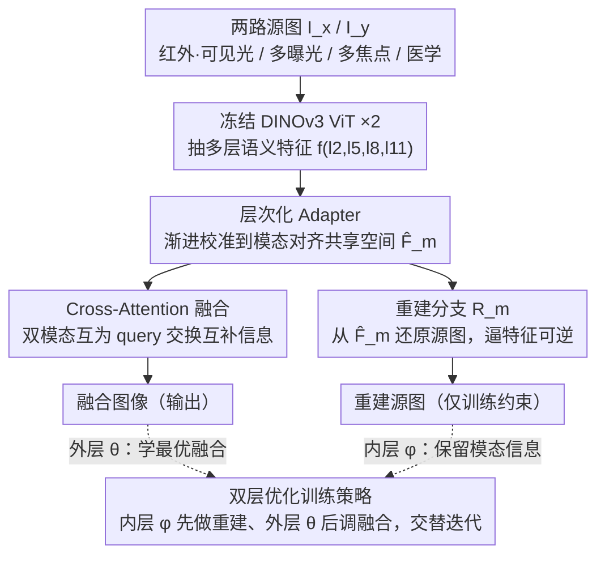

# UniFusion: A Unified Image Fusion Framework with Robust Representation and Source-Aware Preservation

**会议**: CVPR2026  
**arXiv**: [2603.14214](https://arxiv.org/abs/2603.14214)  
**代码**: [dusongcheng/UniFusion](https://github.com/dusongcheng/UniFusion)  
**领域**: 优化  
**关键词**: unified image fusion, DINOv3, bilevel optimization, reconstruction alignment, cross-task generalization

## 一句话总结

提出 UniFusion 统一图像融合框架，利用 DINOv3 自监督语义先验构建跨模态共享特征空间，通过重建对齐机制保留源图信息，并以双层优化策略解耦重建与融合目标，在红外-可见光、多曝光、多焦点、医学图像等多任务上均达到 SOTA。

## 研究背景与动机

**图像融合的核心目标**：将多源图像的互补信息整合为单一、信息丰富且视觉一致的表示，服务于目标检测、医学诊断、自动驾驶等下游任务。

**任务特定方法的局限**：现有方法（CDDFuse、CoCoNet、LRRNet 等）大多针对特定融合场景设计（红外-可见光、多曝光、多焦点），采用定制化的 CNN/AE/GAN 架构，泛化能力有限，难以适应多样化融合需求。

**通用融合框架的现状**：近期的 Transformer 架构（SwinFusion）、扩散模型方法、以及 TC-MoA 等尝试用单一模型处理多任务，但仍受限于两个核心瓶颈。

**瓶颈一：缺乏模态一致的特征提取机制**——现有共享 backbone 无法在异质信号（红外热成像 vs. 可见光纹理）间建立原则性的、鲁棒的统一编码。

**瓶颈二：深层传播中源信息退化**——特征在深层网络中传播时，模态特有线索（如可见光纹理、红外辐射对比）逐渐丢失，导致融合质量次优。

**本文切入点**：能否利用大规模自监督预训练模型（DINOv3）的强语义先验，配合显式的重建约束和优化解耦策略，同时解决上述两个瓶颈？

## 方法详解

### 整体框架

UniFusion 想用一套模型吃下所有融合任务，办法是把"模态一致的特征怎么提"和"源图信息怎么不丢"这两个老问题分别交给两个机制去管。整条管线这样转：两路源图（如红外、可见光）先各自喂进一个冻结的 DINOv3 ViT 抽多层语义特征，再经轻量 Adapter 校准到一个模态对齐的共享空间；校准后的特征一边送进 Cross-Attention 模块做跨模态融合、输出融合图，另一边各自挂一个重建分支把特征还原回源图，逼特征不丢信息。训练时不把这两条路一锅端，而是用双层优化拆开——内层只管重建（更新 Adapter + 重建分支参数 $\phi$），外层只管融合（更新融合网络参数 $\theta$），交替迭代。下图按这条数据流自上而下展开，也对应下面四个关键设计的顺序：

### 关键设计

**1. DINOv3 语义先验适配：用冻结大模型当通用语义骨架，靠轻量 Adapter 抹平模态域偏差**

第一个瓶颈是异质信号之间建不起统一编码——红外的热成像和可见光的纹理本就是两类信号，过去各任务专属的 backbone 各编各的，换个任务就失效。UniFusion 直接搬来一个在海量自然图像上自监督预训练的 DINOv3 ViT 当通用骨架，从每个模态分别抽出多层特征 $f^{(l_2)}, f^{(l_5)}, f^{(l_8)}, f^{(l_{11})}$，再用一个层次化 Adapter 做渐进式校准：通过多阶段残差融合和上采样，把深层的全局语义和浅层的细粒度结构逐级整合，最后吐出模态对齐的嵌入。这样做的好处在于，DINOv3 自带强物体中心先验和长程上下文依赖，是天然的"语义公分母"；它的潜空间虽然和红外、医学影像这类特殊模态有域偏差，但 Adapter 以极低的参数开销就能把这点偏差补上，而 backbone 始终冻结，既保住了预训练的泛化能力，也不会因为微调而灾难性遗忘。

**2. Cross-Attention 融合模块：让两模态互相 query，细粒度交换互补信息**

特征对齐好之后，怎么融才是关键。简单的拼接或加权平均只能在通道维做粗放的混合，处理红外-可见光这种信息高度互补的场景时，往往该强调的区域没强调、该抑制的也没抑制。UniFusion 用 4 个 Cross-Attention Block 做这件事：让每个模态的特征作为 query 去关注另一模态的 key/value，自适应地挑出并强化对方有价值的互补区域。注意力机制天然能在空间和语义两个层面做细粒度的信息交换，比起静态权重，它能针对每个位置动态决定从另一模态借多少信息，正好契合互补性强的融合任务。这条分支直接产出融合图，是整条管线的"主路"。

**3. 重建对齐机制：在编码端做自重建，逼特征"可逆"以锁住模态特有信息**

在融合主路之外，第二个瓶颈是源信息在深层网络里会一路退化——可见光纹理、红外辐射对比这些模态特有线索越传越淡，融合质量自然次优。常规做法是在融合输出端约束它和源图的像素级相似（L1/SSIM），但这种约束容易让网络偷懒去模仿浅层纹理，反而丢了深层语义对应。UniFusion 把约束挪到编码端：给每个模态分支挂一个轻量重建分支 $R_m$（几层 Transformer 加投影头），从 Adapter 校准后的特征 $\hat{\mathbf{F}}_m$ 把原始输入重建回来 $\bar{I}_m = R_m(\hat{\mathbf{F}}_m)$。能还原回源图，就意味着特征本身是"可逆的"、没把模态特有信息丢在半路——信息完备性是在特征层面被保证的，而不是事后在输出端补救。消融的特征可视化（Fig. 8）很直观：去掉重建分支后，编码特征明显丢掉了模态特有的语义表示。

**4. 双层优化策略：把重建与融合解耦成不同时间尺度的子问题**

上面的融合分支和重建分支共享同一套校准特征，两个目标其实是耦合的，如果一锅端做端到端联合训练，重建信号会干扰融合梯度，收敛容易不稳。UniFusion 把训练形式化成一个双层优化：

$$\phi^* = \arg\min_\phi \mathcal{L}_{\text{rec}}(\phi), \quad \theta^* = \arg\min_\theta \mathcal{L}_{\text{fuse}}(\theta; \phi^*)$$

内层（lower-level）快速更新 Adapter + 重建参数 $\phi$ 去捕获模态特有语义，外层（upper-level）则在更新后的特征空间上慢慢调融合网络参数 $\theta$。实现上用的是一阶交替近似：每次迭代先用较大学习率 $\eta_L$ 更新 $\phi$，再用较小学习率 $\eta_U$ 更新 $\theta$，并对 $\theta$ 施加 EMA 正则增强时序稳定性。这套拆法的逻辑是先后有序——先让特征"记住"源图信息（内层把信息保留这件事做扎实），再在这个可靠的特征空间上学最优融合策略（外层），从而在信息保留和融合质量之间取得稳定的平衡，而不是让两个梯度互相拉扯。

## 实验关键数据

### 表 1：多模态 & 多曝光融合定量对比

| 方法 | M3FD MI↑ | M3FD VIF↑ | M3FD $Q_{abf}$↑ | M3FD $Q_y$↑ | MEFB MI↑ | MEFB VIF↑ | MEFB CC↑ | MEFB PSNR↑ |
|------|----------|-----------|-----------------|-------------|----------|-----------|----------|------------|
| CDDFuse | 3.776 | 0.839 | 0.610 | 0.978 | 6.575 | 1.430 | 0.837 | 56.809 |
| SwinFusion | 2.945 | 0.618 | 0.480 | 0.936 | 5.318 | 1.459 | 0.894 | 59.009 |
| TC-MoA | 3.466 | 0.870 | 0.636 | 0.983 | 4.889 | 1.406 | 0.885 | 59.152 |
| **UniFusion** | **4.268** | **0.899** | **0.637** | 0.982 | **6.861** | **1.484** | **0.906** | **59.219** |

- UniFusion 在 M3FD 上 MI 指标达到 4.268，大幅领先 TC-MoA（3.466）约 23%
- MEFB 上四项指标全面最优，VIF 达 1.484（超越 SwinFusion 的 1.459）

### 表 2：消融实验（M3FD / MEFB / MFIF）

| 配置 | M3FD MI↑ | M3FD VIF↑ | MEFB MI↑ | MEFB VIF↑ | MFIF MI↑ | MFIF $Q_{abf}$↑ |
|------|----------|-----------|----------|-----------|----------|-----------------|
| w/o Adapter | 3.646 | 0.863 | 5.512 | 1.232 | 5.375 | 0.532 |
| w/o DINOv3 | 3.681 | 0.879 | 5.709 | 1.334 | 5.624 | 0.491 |
| w/o Reconstruction | 3.846 | 0.870 | 6.434 | 1.396 | 5.838 | 0.579 |
| w/o Bilevel Opt | 3.924 | 0.876 | 6.374 | 1.424 | 6.021 | 0.583 |
| **Full Model** | **4.268** | **0.899** | **6.861** | **1.484** | **6.253** | **0.685** |

- 每个组件均有显著贡献；去掉 Adapter 后 MFIF $Q_{abf}$ 从 0.685 降至 0.532（-22%）
- DINOv3 编码器的语义先验是基础，替换为普通 4 层 Transformer 后跨任务性能全面下降
- 重建对齐和双层优化各自独立贡献，两者协同效果最佳

## 亮点与洞察

1. **DINOv3 作为通用语义骨架的思路具有启发性**：冻结预训练 ViT + 轻量 Adapter 的范式类似 NLP 中的 LoRA/Adapter-tuning，首次在图像融合领域系统性验证了这一路线的有效性。
2. **重建对齐是一个优雅的信息保留机制**：不在融合输出端做约束，而在编码端通过自重建确保特征的信息完备性，思路新颖且 Fig. 8 的可视化令人信服。
3. **双层优化的形式化清晰**：将重建与融合解耦为不同时间尺度的优化子问题，理论上有据（bilevel optimization），实践中通过一阶交替近似高效实现。
4. **跨任务泛化能力强**：单一模型在 IVIF、MIF、MEF、MFF 四类任务上均达到或接近 SOTA，训练仅需 10K 迭代，具有实际应用价值。

## 局限与展望

1. **DINOv3 依赖**：冻结的 DINOv3 backbone 参数量大（ViT-Large/Giant 级别），推理开销较高，部署于边缘设备有挑战。可以探索蒸馏到更小的 backbone。
2. **双层优化的计算成本**：虽然采用了一阶近似，但两阶段交替更新仍增加了每迭代的计算量，且 $\eta_L / \eta_U$ 的比率需要仔细调参。
3. **缺乏非对齐场景的评估**：实验中未涉及源图存在几何失配（如手持多曝光、运动模糊）的场景，实际应用中这类情况很常见。
4. **重建分支的必要性讨论不足**：推理时重建分支是否可以去掉以加速？论文未明确说明推理阶段的架构简化策略。
5. **融合损失直接沿用 SwinFusion**：未对融合损失函数本身做创新，可能存在进一步优化空间。

## 相关工作与启发

- **TC-MoA** [Zhu et al.]：基于任务特定路由网络的通用融合方法，是本文最强 baseline；UniFusion 通过更强的语义先验和双层优化策略超越之。
- **SwinFusion** [Ma et al.]：跨域 Swin Transformer 框架，UniFusion 沿用其融合损失设计并在此基础上大幅提升。
- **U2Fusion** [Xu et al.]：先驱性的 all-in-one 融合方法，启发了后续统一框架研究。
- **DINOv2/v3**：自监督 ViT 预训练范式，本文验证了其在低级视觉任务中的迁移潜力。
- **Bilevel Optimization in Vision**：在 meta-learning、NAS、超参优化中有广泛应用，本文将其引入图像融合是有意义的尝试。
- **Adapter-tuning 的启发**：冻结大模型 + 轻量适配器的范式在 NLP 已成熟，本文在 CV 低级任务上的成功应用值得关注。

## 评分

- **新颖性**: ⭐⭐⭐⭐ — DINOv3 + Adapter 作为通用融合 backbone 的思路新颖，重建对齐机制设计巧妙，双层优化的引入有理论支撑；但各组件（Adapter-tuning、bilevel opt）本身并非全新，贡献在于有效组合。
- **实验充分度**: ⭐⭐⭐⭐⭐ — 覆盖 IVIF/MIF/MEF/MFF 四大类任务共 6+ 个 benchmark，与 10 个 SOTA 方法对比，消融实验完整（4 个变体），定性可视化丰富（特征图、融合结果），并在附录中提供下游任务验证。
- **写作质量**: ⭐⭐⭐⭐ — 结构清晰，方法描述逻辑性强，公式推导完整；图表质量高，Fig. 8 的特征可视化很有说服力；但部分符号定义可以更早引入。
- **价值**: ⭐⭐⭐⭐ — 提供了一个实用的统一融合框架，单模型跨任务泛化具有工程价值；DINOv3 + Adapter 范式可推广到其他低级视觉任务；代码开源进一步增加可复现性和影响力。

<!-- RELATED:START -->

## 相关论文

- [\[NeurIPS 2025\] AutoOpt: A Dataset and a Unified Framework for Automating Optimization Problem Solving](../../NeurIPS2025/optimization/autoopt_a_dataset_and_a_unified_framework_for_automating_optimization_problem_so.md)
- [\[CVPR 2026\] HyperNAS: Enhancing Architecture Representation for NAS Predictor via Hypernetwork](hypernas_enhancing_architecture_representation_for_nas_predictor_via_hypernetwor.md)
- [\[CVPR 2026\] FedRG: Unleashing the Representation Geometry for Federated Learning with Noisy Clients](fedrg_unleashing_the_representation_geometry_for_federated_learning_with_noisy_c.md)
- [\[CVPR 2026\] DABO: Difficulty-Aware Bayesian Optimization with Diffusion-Learned Priors](dabo_difficulty-aware_bayesian_optimization_with_diffusion-learned_priors.md)
- [\[AAAI 2026\] SMoFi: Step-wise Momentum Fusion for Split Federated Learning on Heterogeneous Data](../../AAAI2026/optimization/smofi_step-wise_momentum_fusion_for_split_federated_learning_on_heterogeneous_da.md)

<!-- RELATED:END -->
