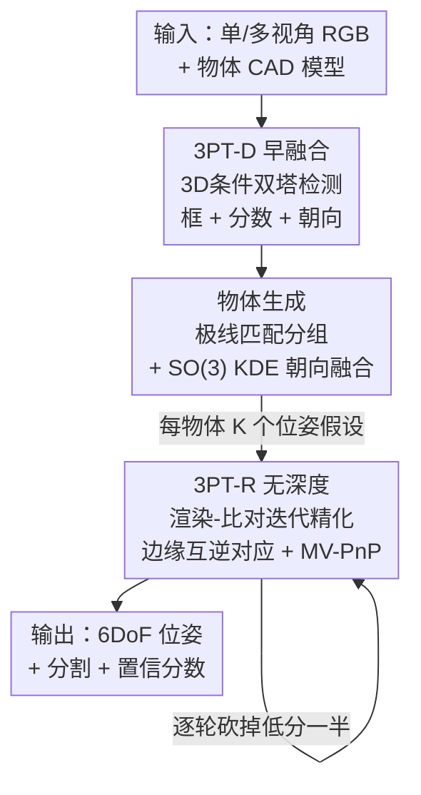

# 3D-Object Perception Transformer (3PT)

**会议**: CVPR 2026  
**论文**: [CVF Open Access](https://openaccess.thecvf.com/content/CVPR2026/html/Kalra_3D-Object_Perception_Transformer_3PT_CVPR_2026_paper.html)  
**代码**: 无（项目页 https://www.intrinsic.ai/publications/3pt-cvpr2026）  
**领域**: 3D视觉  
**关键词**: 零样本6DoF位姿估计, 3D物体检测, 多视角RGB, 早融合检测, 工业机器人抓取  

## 一句话总结
3PT 用一个端到端训练、直接以 CAD 模型为条件的统一 Transformer 框架（检测 + 物体分组 + 迭代精化）替代了现有"冻结基础模型拼装 + 依赖深度"的零样本 3D 物体感知流水线，仅靠多视角 RGB 就在 BOP 系列基准的检测和 6DoF 位姿上大幅超过 SOTA（工业数据集位姿 AP-mm 相对提升 56.5%），并在 BOP Challenge 2025 的 11 个赛道中拿下 7 个第一。

## 研究背景与动机
**领域现状**：零样本 3D 物体感知（给一个之前没见过的物体的 3D 模型，在场景里把它检测、分割、估计 6DoF 位姿）是 AR、物流、工业自动化的核心能力。目前主流做法是"propose-and-match"两阶段流水线：先用 FastSAM / GroundingDINO 这类通用分割器/检测器生成类无关候选框，再把候选框的 DINOv2 特征和物体的模板渲染图做相似度匹配来分类；位姿则走 Initialize→Refine→Score 三段式，且严重依赖深度图。

**现有痛点**：这套流水线有两个根本问题。其一，检测阶段完全依赖**为别的任务训练的冻结基础模型**（SAM、GroundingDINO、DINOv2），它们靠"外观相似度"匹配而非真正理解 3D 几何，一旦测试物体偏离训练分布（如在网络图片上预训练的模型遇到工业金属件）就给出不可靠预测。为了压噪声，SOTA 只能堆**多模型集成 + 多阶段流水线**，但这些刚性接口、缺乏任务级微调的拼装架构反而限制了泛化——以至于"逐物体训练的模型"长期还能压过"用一堆冻结模型拼起来的零样本流水线"。其二，位姿精化**依赖深度数据**，而深度往往要从多视角对应（多相机或相机-投影仪）估出来，遮挡、强光、反光表面都会引入对应误差并直接传到最终位姿上。

**核心矛盾**：现有方法把"检测、匹配、位姿精化"拆成互不通气、各用一堆冻结模型/启发式的模块，导致每一环都不是为"以 3D 模型为条件的物体感知"专门训练的；同时对深度这种"被加工过的脆弱证据"的依赖，让方法在工业场景必然退化。

**本文目标**：用一个**直接为 3D 物体感知端到端训练**的统一框架，同时解决检测、分割、6DoF 位姿，并且**不需要深度输入**。

**切入角度**：作者提出"早融合（early-fusion）"假设——与其把物体和图像分别编码再"晚融合"做相似度匹配，不如在检测阶段就把 3D 模型的条件信息注入图像编码器，让模型**联合学习物体表示和定位**。这就像训练文本条件检测器（OwL-ViT）需要海量词表暴露一样，训练 3D 模型条件检测器也需要同等规模——于是用约 10 亿图-渲染对、11 万独特 CAD 训练。

**核心 idea**：把"以 CAD 为条件的检测 / 多视角位姿融合 / 无深度迭代精化"全部换成**原生大规模训练的 Transformer**，用早融合取代晚融合相似度匹配，用多视角 RGB 取代深度。

## 方法详解

### 整体框架
3PT 把 3D 物体感知拆成三个**串行阶段**：① **检测阶段（3PT-D）**——一个双塔 ViT，输入单/多视角 RGB 图像 + 物体 CAD，输出每个物体假设的 2D 框、检测分数和粗朝向分布；② **物体生成阶段（Object Generation）**——把跨视角的框按物体身份分组，用极线匹配过滤外点、用 SO(3) 上的核密度估计融合朝向假设，为每个物体产出 K 个 SE(3) 位姿候选；③ **精化阶段（3PT-R）**——把每个候选用"渲染-比对"迭代精化，每轮做边缘互逆对应 + 多视角 PnP 更新位姿，同时输出分割掩码和置信分数，并按分数逐轮砍掉一半假设，最终收敛到一个最优 6DoF 位姿。整条流水线全程不依赖深度，仅用标定后的多视角 RGB（单视角也能跑）。

### 关键设计

**1. 3PT-D 早融合：把 CAD 条件直接灌进图像编码器，而不是事后做相似度匹配**

针对"冻结基础模型靠外观相似度匹配、不懂 3D 几何"这个痛点，3PT-D 用一个双塔 ViT 做原生的 3D 模型条件检测。塔 1（Object Encoder）把 CAD 渲染成两套嵌入并缓存：一套是 12 个预定义朝向的渲染图经骨干网络池化拼接成的 **Prior Embeddings（条件向量）**，另一套是稠密覆盖旋转空间的 $N_t=5140$ 个渲染图编码成的 **Query Embeddings（朝向模板）**。塔 2（Image Encoder）把图像 token 与 Prior Embeddings **拼接后一起送进 ViT（早融合）**，让 ViT 直接把图像 patch 变成"该物体专属的假设嵌入"，再由回归头解码出 2D 框和置信分数。朝向则通过假设嵌入与缓存的 Query Embeddings 做一次矩阵乘的余弦距离得到，检测分数取所有朝向模板上的最大相似度。

这与"先各自编码物体和图像、再晚融合做相似度匹配"的旧范式根本不同：早融合让模型**联合**学习物体表示和定位，而不是用一个为别的任务训练的特征空间硬比对。作者证明这需要规模支撑——把训练 CAD 词表从 3.5 万扩到 11 万带来 5.1 AP 的提升，最终在 BOP-Industrial 上比 MUSE 高 23.6 AP。多物体查询时每个物体跑一次模型，再跨框做 NMS。

**2. 物体生成：用极线匹配 + SO(3) 核密度估计把多视角朝向假设融成稳健候选**

单视角检测给出的朝向可能因视觉歧义而很噪，痛点是如何把多视角的噪声朝向假设聚合成可靠的 SE(3) 候选。多视角时，作者用**极线匹配**把多张图的 2D 检测转成 3D 假设：沿穿过各检测框中心的射线三角化物体在 3D 空间的位置，只有在 $v\ge 3$ 个视角都成功匹配的物体才保留，以此过滤外点。对单个物体的 $vN_t$ 个朝向提议，作者在旋转群 SO(3) 上用**核密度估计（KDE）** 建模朝向的连续分布，核函数取各向同性的 von Mises-Fisher 分布（为提速每视角只取 top 500 旋转），再用这个 KDE 分布去重加权所有朝向提议的分数，最后选出彼此保持最小角距、得分最高的 top $K$，得到每物体 $K$ 个融合后的 SE(3) 位姿假设。单视角时则退化为：用框对角线与 CAD 对角线之比估 $z$、投影质心估 $x,y$，朝向取相距至少 $45°$ 的 top $K$ 旋转。这一步把"检测塔的粗朝向 + 多视角几何"系统地变成精化阶段可用的少量高质量初始假设。

**3. 3PT-R 无深度迭代精化：用边缘互逆对应 + 多视角 PnP 做渲染-比对，并在线砍假设**

针对"位姿精化依赖深度、深度对应易被遮挡/反光污染"的痛点，3PT-R 把精化建成一个**只用 RGB 的渲染-比对迭代循环**（推理通常跑 3 轮）。每轮四步：(1) 前向——把当前位姿假设生成"真实图-渲染图"对送进网络，得到置信分数、分割掩码、真实图特征图 $F$ 和渲染图特征图 $Z$；(2) **互逆匹配**——在 $F$ 与 $Z$ 之间找特征空间余弦相似度下互为最近邻的像素对，且**只在渲染图的边缘上做匹配**以降低稠密匹配的算力；(3) **位姿更新**——由于每个渲染像素都有已知 3D 位置，匹配即得到稀疏 2D-3D 对应，再用**多视角 PnP（MV-PnP）** 最小化重投影误差算出下一轮的位姿更新；(4) **假设选择**——每轮对每个假设都打一个置信分数，**砍掉后 50% 的假设**，逐轮收缩到最优候选。

架构上，真实图按检测框裁剪缩放、CAD 在 $K$ 个假设位姿下渲染到 $V$ 个裁剪视角，两者都用同一个 DINOv2 编码，再让每个真实视角（query）与所有渲染嵌入（key/value）做交叉注意力，最后由 DPT 解码器输出逐像素描述子和分割掩码，DINOv2 的 register token 用来预测每个假设的标量分类分数。这套设计的妙处在于：它把对应、分割、打分**在一次前向里联合预测**，且彻底摆脱深度——消融显示，把这个 RGB 多视角精化 + 打分加到 FRTPose 预测上就贡献了 12.3 AP-mm 改进中的 10.0，最终多视角 RGB 精化的毫米级精度甚至超过用高端深度传感器、集成多个 RGB-D 精化方法的 FRTPose。

### 损失函数 / 训练策略
两个网络都在 90 万张 Blender 合成图上训练（用了 10 万+ 个网格、平均每图 110 个标注实例，约 1 亿个独特实例）。

- **检测塔（3PT-D）**：在约 10 亿图-渲染对上**对比训练**，用 sigmoid focal 交叉熵把假设嵌入对齐到对应的朝向模板，框回归用 L1 + GIoU。还引入**Soft-Scaled Matching Loss**：标准匹配损失是"赢家通吃"，把所有非最优匹配都当硬负样本而不管空间重叠度，产生噪声梯度；3PT-D 改为按框 IoU **反比下调"差一点命中"假设的惩罚**，让模型集中精力区分真·难负样本和真正例，稳定训练。还用**动态 pan-and-scan**：把图切成重叠的 $512\times512$ 块，训练时随机裁剪缩放让目标落在 128–350px，给模型嵌入尺度先验；BOP 不能假设固定深度范围时就跑 $S=3$ 次覆盖足够深度范围。
- **精化塔（3PT-R）**：在已知 GT 位姿的合成数据上训练，对 GT 位姿加扰动生成训练假设。三项损失：**匹配损失** $L_m(\theta\mid P)=\sum_{(x,y)\in \mathrm{Seg}[Z]} -\log p_{f(x,y\mid P)}$（$p_{ij}$ 是 $Z_{xy}\cdot F_{ij}$ 的 softmax，$f$ 把渲染特征图像素按 GT 位姿映到真实图对应像素，鼓励 GT 对应对高相似、非对应对低相似）；**分类损失**——采 5 个随机抖动初始位姿、各跑一步精化，用 softmax 交叉熵训练打分器去预测误差更小的那个图-渲染对；**分割损失**——标准逐像素二元交叉熵。

## 实验关键数据

跨 BOP 的 13 个数据集评估，重点在更难的 **BOP-H3**（AR 场景：无深度、鱼眼畸变、手部遮挡）和 **BOP-Industrial**（机器人抓取：严重杂乱、金属反光、强光）。统一只用 **AP / AP-mm**（而非 AR，因为 AR 假设已知物体数量、会掩盖假阳）。

### 主实验

2D 检测 AP（节选自三大 BOP 套件平均）：

| 方法 | BOP-H3 Avg | BOP-Industrial Avg | BOP-Classic Avg |
|------|-----------|--------------------|-----------------|
| CNOS | 30.3 | 26.5 | 42.8 |
| SAM-6D | – | 33.6 | 47.1 |
| MUSE | 41.8 | 34.3 | 53.3 |
| **3PT-D** | **55.1** | **57.5（IPD 63.4）** | **52.8** |
| ∆ vs 次优 | **+13.3** | **+23.6** | +4.6（YCB-V −1.2） |

6DoF 位姿 AP（单视角 RGB）与工业毫米级 AP-mm：

| 任务 / 数据 | 之前 SOTA | 本文 3PT (D+R) | 提升 |
|------------|-----------|----------------|------|
| 单视角 RGB 位姿 BOP-H3 Avg | Co-Op 46.4 | **58.7** | **+12.3** |
| 单视角 RGB 位姿 BOP-Classic Avg | Co-Op 60.6 | **66.0** | +5.4 |
| 工业 AP-mm 平均（零样本） | FreeZeV2.2 51.5（RGB-D） | **80.6（仅 MV-RGB）** | **+29.1** |
| 工业 AP-mm vs 非零样本 FRTPose | 68.3（4 检测+3 精化集成，RGB-D） | **80.6** | +12.3 |
| T-LESS AR（vs 监督 MV-RGB(D)） | Haugaard 85.8 | **90.0（零样本）** | +4.2 |

亮点：3PT 仅用 RGB 就超过所有零样本 RGB-D 方法（工业 AP-mm +29.1），甚至超过逐物体微调的 RGB-D 方法和高端深度传感器集成的非零样本 FRTPose；在 BOP Challenge 2025 的 11 个赛道里拿下 7 个第一。

### 消融实验

逐组件归因（把 3PT 的各部分加到旧 SOTA 上，看各自贡献）：

| 配置 | 关键指标 | 说明 |
|------|---------|------|
| MUSE（检测，HANDAL AP） | 35.7 | 旧 SOTA 基线 |
| + class id / + scoring / + regression | 40.1 / 42.3 / 43.7 | 每个组件单独加都涨 |
| 3PT-D Full | **53.6** | 端到端训练比逐件加更强（+17.9） |
| FRTPose（工业 AP-mm） | 68.3 | 非零样本集成基线 |
| + 本文 RGB 多视角精化 | 78.3 | **单这一步 +10.0**，已超 RGB-D 集成 |
| 3PT Full（D+R） | 80.6 | 再 +2.3 |
| Co-Op（单视角 RGB 位姿 BOP-H3） | 46.4 | 基线 |
| + 本文精化 / + 用 3PT-D 初始(K=1) / K=5 | 47.8 / 55.1 / 58.7 | 精化 +1.4、好的检测初始化 +8.7、多假设再 +3.6 |

超参与规模消融：

| 变量 | 关键指标 | 说明 |
|------|---------|------|
| 训练 CAD 词表 35k → 110k | Mean AP 49.7 → 54.8 | **+5.1**，规模是关键 |
| 训练迭代 100k → 300k | Mean AP 54.8 → 56.4 | 再 +1.6 |
| 假设数 K=1 → K=8（工业 AP-mm） | 71.1 → 80.9 | **+9.8**，多假设 + 3PT-R 细粒度打分是主力 |
| 是否已知物体类别 O | 80.9 vs 80.6 | 仅差 0.3，几乎不依赖类别先验 |
| 精化迭代 1 → 3 轮 | 79.3 → 80.9 | 迭代有效但边际递减 |

### 关键发现
- **检测的初始化质量是单视角位姿的最大驱动**：把 Co-Op 换成 3PT-D 的初始位姿（K=1）直接 +8.7 AP，远大于"只把本文精化加到 Co-Op 上"的 +1.4，说明早融合 3D 条件检测给出的好朝向先验比精化本身更值钱。
- **多视角 RGB 精化能干掉对深度的依赖**：单这一步加到 FRTPose 就贡献了工业毫米级 12.3 AP-mm 改进里的 10.0，且最终精度超过用高端深度传感器的 RGB-D 集成方法——证明"多视角 RGB > 高分辨率 RGB-D"在精化上成立。
- **规模是 3D 条件检测的命门**：CAD 词表从 3.5 万扩到 11 万 +5.1 AP，呼应"训练文本条件检测器需要海量词表"的类比。
- **几乎不靠类别先验**：已知物体类别只带来 0.3 AP-mm，说明模型真的在做"以几何模型为条件"的感知而非类别捷径。
- **代价是速度**：BOP-Industrial 上平均 30.5s（H100），主要瓶颈是物体数量多时每个物体都要过一遍 3PT-D 图像塔的前向。

## 亮点与洞察
- **早融合 vs 晚融合**：把 CAD 条件直接拼进图像 token 一起编码（而非各自编码再相似度匹配），是从"借用通用特征空间硬比对"到"原生联合学习"的范式切换——这个思路可迁移到任何"以参考模板为条件"的检测任务（如以示例图为条件的开放词表检测）。
- **用 SO(3) 上的 vMF-KDE 融合多视角朝向**：把"多视角噪声朝向假设"当成旋转群上的密度估计问题，用核密度重加权后取 top-K，比简单平均/投票更稳健，是处理旋转歧义的可复用 trick。
- **只在渲染边缘做互逆对应**：稠密匹配很贵，作者观察到渲染图的边缘像素信息量最大、且都有已知 3D 坐标，于是只在边缘匹配，把稠密 2D-3D 对应的算力压下来又不掉精度。
- **在线砍假设**：每轮精化后按置信分砍掉一半假设，把"维护 K 个候选"的成本随迭代指数级降下来，是 render-and-compare 类方法值得借鉴的预算分配方式。
- **最"啊哈"的点**：一个纯 RGB 的零样本方法，在工业毫米级位姿上压过了用高端深度传感器、逐物体微调、运行时长两分钟的集成系统——直接挑战了"工业精密位姿必须靠深度"的共识。

## 局限与展望
- **运行时是硬伤**：物体种类多时，每个物体都要单独过一遍 3PT-D 图像塔，BOP-Industrial 平均 30.5s，明显慢于 FreeZeV2 的 16.8s；作者把"共享/批量化每物体前向"列为未来工作。
- **依赖标定的多视角与已知 CAD**：方法需要标定相机外参和物体的 3D 模型，且多视角融合要求 $v\ge 3$ 个视角匹配成功，单视角下退化为更弱的几何启发式初始化（实测单视角 BOP-H3 AP 比 K=5 多视角融合低不少）。
- **尺度先验依赖深度范围假设**：pan-and-scan 在工业部署里靠"已知深度范围"很实用，但 BOP 不支持固定深度假设时要跑 $S=3$ 次覆盖，增加算力；⚠️ 跨数据集比较 AP 时需注意各基准难度/设置不同，不能直接比大小。
- **全合成训练**：训练数据 100% 是 Blender 合成（90 万图），真实-合成域差距对极端真实场景的影响主要靠基准间接验证，缺乏对失败模式的细粒度分析。

## 相关工作与启发
- **vs CNOS / SAM-6D / MUSE（晚融合集成检测）**：它们用 FastSAM/GroundingDINO 提框 + 冻结 DINOv2 特征启发式匹配；3PT-D 改为原生大规模训练的早融合 3D 条件检测，BOP-Industrial 检测 AP +23.6，本质区别是"为本任务端到端训练" vs "拼装通用模型"。
- **vs FoundationPose / FreeZe / MatchU（RGB-D 零样本位姿）**：它们都依赖深度（点云匹配 + ICP）；3PT-R 用多视角 RGB 的边缘互逆对应 + MV-PnP 取代深度，工业 AP-mm +29.1，证明 RGB 多视角足以替代深度。
- **vs MegaPose / GigaPose / Co-Op（render-and-compare 精化）**：3PT-R 沿用迭代渲染-比对范式，但把对应限制在边缘、联合输出分割/打分、并在线砍假设；相比 Co-Op 的光流对应，作者用互逆最近邻 + 在每轮打分筛选，单视角位姿 BOP-H3 +12.3。
- **vs FRTPose-WAPRv2（非零样本工业 SOTA）**：FRTPose 集成 4 检测 + 3 精化、逐物体训练 5 分钟、运行 >2 分钟才达到高精度；3PT 零样本、纯 RGB，反而高出 12.3 AP-mm——是"统一端到端"对"集成 + 逐物体微调"的胜利。

## 评分
- 新颖性: ⭐⭐⭐⭐⭐ 早融合 3D 条件检测 + 无深度多视角 RGB 精化，是对零样本 3D 感知主流范式的系统性重构。
- 实验充分度: ⭐⭐⭐⭐⭐ 13 个 BOP 数据集 + 逐组件归因消融 + 规模/超参/速度全覆盖，还有真实机器人 100+ 次抓取验证。
- 写作质量: ⭐⭐⭐⭐ 动机和方法清晰，三阶段架构讲得明白；部分关键模块（数据生成、补充实验）压到了附录。
- 价值: ⭐⭐⭐⭐⭐ 直接面向工业抓取/精密插装的可部署精度，BOP Challenge 2025 拿 7/11 第一，工程与学术价值都高。

<!-- RELATED:START -->

## 相关论文

- [\[CVPR 2026\] AniMimic: Imitating 3D Animation from Video Priors](animimic_imitating_3d_animation_from_video_priors.md)
- [\[ICML 2026\] Vision Transformer 微调中的非光滑分量优势](../../ICML2026/others/vision_transformer_finetuning_benefits_from_non-smooth_components.md)
- [\[CVPR 2026\] Efficient Unrolled Networks for Large-Scale 3D Inverse Problems](efficient_unrolled_networks_for_large-scale_3d_inverse_problems.md)
- [\[CVPR 2026\] 4DWorldBench: A Comprehensive Evaluation Framework for 3D/4D World Generation Models](4dworldbench_a_comprehensive_evaluation_framework_for_3d4d_world_generation_mode.md)
- [\[CVPR 2026\] MooCap: A Multi-View Benchmark for Cow-Object-Human Interaction and Behavior Dynamics](moocap_a_multi-view_benchmark_for_cow-object-human_interaction_and_behavior_dyna.md)

<!-- RELATED:END -->
