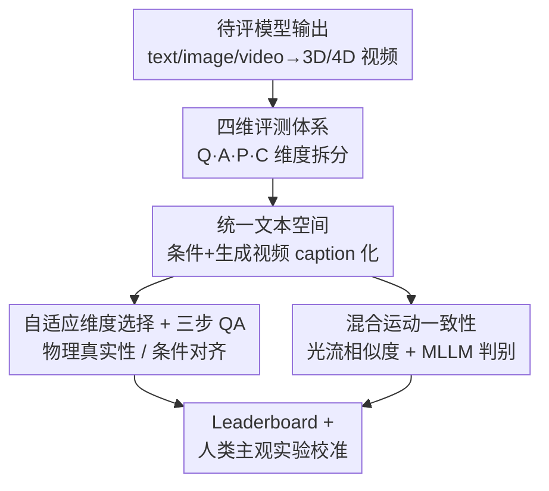

# 4DWorldBench: A Comprehensive Evaluation Framework for 3D/4D World Generation Models

**会议**: CVPR 2026  
**论文**: [CVF Open Access](https://openaccess.thecvf.com/content/CVPR2026/html/Lu_4DWorldBench_A_Comprehensive_Evaluation_Framework_for_3D4D_World_Generation_Models_CVPR_2026_paper.html)  
**代码**: https://yeppp27.github.io/4DWorldBench （项目页）  
**领域**: 世界生成评测 / 3D视觉 / 多模态评测  
**关键词**: 世界生成模型, 评测基准, 物理真实性, 4D一致性, LLM-as-judge

## 一句话总结
4DWorldBench 提出一个统一、多模态、物理感知的 3D/4D 世界生成评测框架：把 text/image/video 三种条件全部映射到统一文本空间，沿"感知质量、条件-4D 对齐、物理真实性、4D 一致性"四个维度，用「LLM-as-judge + MLLM-as-judge + 传统度量」的自适应混合策略打分，并通过人类主观实验验证其打分比现有 benchmark 更贴近人的判断。

## 研究背景与动机

**领域现状**：世界生成模型（World Generation Models）正成为下一代多模态智能的基石——它们不再只追求 2D 帧的保真度，而是要从文本/图像/视频出发，生成在空间、时间、物理、指令控制上都自洽的 3D/4D 世界，服务 VR、自动驾驶、具身智能等场景。配套的评测 benchmark 大致分三类：视频中心型（VBench、VBench2.0）、世界生成型（WorldScore、WorldSimBench）、物理感知型（PhyGenBench、VideoPhy、Physics-IQ）。

**现有痛点**：这三类 benchmark 各看一块、互不覆盖。视频型靠手工预定义的问题模板，对物理真实性和 4D 一致性只做粗粒度评估；世界生成型在细粒度的"条件-4D 对齐"上不够、对物理真实性覆盖不足；物理感知型则受限于手工规则，缺乏模态多样性、语义丰富度和可扩展性。作者用一张对比表（Table 1）点明：没有任何一个 benchmark 能在「感知质量 Q / 条件对齐 A / 物理真实 P / 4D 一致 C」四个维度上同时做到全支持。

**核心矛盾**：世界生成的评测本质上是**多模态条件 × 多评测维度**的笛卡尔积——条件可以是 text/image/video，维度从低层画质到高层物理推理跨度极大。单一打分工具（无论是特征相似度、还是某个 MLLM）都无法覆盖全谱：特征相似度容易被"只有细微运动"的视频骗高分；MLLM 擅长表层视觉问答却拙于复杂物理推理（流体、受力）；LLM 推理强但看不了视频。

**本文目标**：建一个 general-purpose、多模态、物理感知、可扩展的**单一框架**，把四个维度的评测统一进来，并支持 Image-to-3D/4D、Video-to-4D、Text-to-3D/4D 全部任务设定。

**切入角度**：与其为每种条件、每个维度各配一套工具，不如**先把所有模态条件统一映射到文本空间**——图像/视频先被 caption 成文字，这样异构条件就被对齐到同一表示，随后可以让最擅长抽象推理的 LLM 来做物理判断、让 MLLM 做需要视觉 grounding 的对齐判断、让传统度量守住低层信号，三者按维度自适应分工。

**核心 idea**：把"看视频判好坏"改写成"先把条件和生成结果都翻成文本 → LLM/MLLM 自适应生成诊断性问题并作答 → 答案对错率即分数"的 QA 评测范式，再叠加传统度量做混合，得到一个跨模态、可扩展、且更贴近人类判断的世界生成评测标准。

## 方法详解

### 整体框架
4DWorldBench 是一个**评测框架**而非生成模型，输入是"某个世界生成模型在给定条件（text/image/video）下产出的 3D/4D 视频"，输出是四个维度上的一组连续分数及总分排行榜。它的运转可拆成四步串行管线：① 用一个精心构建、覆盖 physics / non-physics 两域的多模态数据集提供评测条件；② 把非文本条件和生成视频统一 caption 成文本，进入统一文本空间；③ 沿四大维度（感知质量、条件-4D 对齐、物理真实性、4D 一致性）施加各自的评测工具，其中物理与对齐两维走"自适应维度选择 + 三步 QA"的核心流程，4D 一致性中的运动一致性走"光流相似度 + MLLM-as-judge"混合策略；④ 汇总成 leaderboard，并用人类主观实验回头校准每个度量的可靠性。

### 关键设计

**1. 四维评测体系：把"世界真实感"拆成可单独打分的四个正交维度**

现有 benchmark 各看一块，缺一个把"世界生成到底好不好"说全的坐标系。4DWorldBench 定义四个互补维度，并为每个维度选配最合适的工具。**感知质量（Perceptual Quality）**再细分：空间质量用 CLIPIQA+ 测技术质量、CLIP-Aesthetic 测美学，两者相加；时间质量用 FastVQA 测帧间时序稳定性；3D 纹理质量用 mPLUG-Owl3 打分。**条件-4D 对齐（Condition-4D Alignment）**衡量生成结果是否忠实于输入条件（事件/运动/属性/场景），走 QA 流程。**物理真实性（Physical Realism）**衡量是否遵守自然规律，走 QA 流程。**4D 一致性（4D Consistency）**从三个角度评估时空稳定性：3D 一致性用稠密可微 SLAM 重建 3D 点后算重投影误差（在短时片段上计算再平均，降低对 FPS 和相机运动的敏感）；运动一致性走混合策略；风格一致性比较帧间深度特征的 Gram 矩阵（同样在短片段上算再平均）。这套拆分的价值在于：它让"模型在哪一维强、哪一维弱"变得可诊断——实验中作者正是据此发现"风格/场景语义基本被攻克，而运动控制、时序推理、物理真实性是共同短板"。

**2. 统一文本空间 + 混合评测：异构模态条件对齐到同一表示，再分而治之**

不同模态条件（文本/图像/视频）表示形态完全不同，无法直接送进同一个判分器；而单一判分器又各有盲区。本设计先把"非文本条件 $C$"和"生成的 4D 视频 $V$"都用 Keye-VL 1.5 caption 成文本——条件得到文本描述、生成视频得到 caption $\hat{T}$，从而把所有输入对齐到**统一文本空间**。随后按维度自适应挑选工具，组成四类混合度量：model-based score（如 CLIPIQA+/FastVQA）、feature-based similarity（光流/Gram 矩阵）、LLM-based QA、MLLM-based QA。这样设计的关键洞察是：**LLM 与 MLLM 各有所长**——MLLM 擅长表层视觉问答、能做具体视觉 grounding，适合条件对齐；LLM 在拿到高质量文本描述后擅长抽象/组合推理（流体动力学、受力交互），适合高层物理真实性判断。把视频先翻成文字再交给 LLM 推理，恰好绕开了 MLLM 物理推理弱的短板，这也是消融里"LLM-as-judge 一致地优于 MLLM-as-judge"的原因。

**3. 自适应维度选择 + 三步 QA：用诊断性问答把"物理/对齐"量化成 0–1 分**

物理真实性和条件对齐都是抽象语义判断，没有现成数值指标。本设计把它统一为一个**三步 QA 框架**。以物理真实性为例：(1) **Captioning**——把非文本条件 $C$ 和生成视频 $V$ 都用 Keye-VL 1.5 转成文本 caption $\hat{T}$；(2) **Question Generation**——结合条件 prompt 与典型物理定律，构造一组诊断性问题 $\{Q_i\}_{i=1}^N$，覆盖基础物理、物理事件推理、力与运动、热与相变等维度（例如"抽真空后易拉罐侧壁是否向内塌陷？"这类必须成立才算物理合理的可观测结果）；(3) **Scoring**——把 caption $\hat{T}$ 和问题集送入 LLM 得到预测答案 $\{\hat{A}_i\}$，与期望答案 $\{A_i^*\}$ 比对，每题二值打分 $s_i = \mathbb{1}(\hat{A}_i = A_i^*)$，最终分数取平均：

$$S_{phy} = \frac{1}{N}\sum_{i=1}^{N} s_i, \quad S_{phy} \in [0,1]$$

条件对齐用同构的三步流程，最终 $S_{align}=\frac{1}{N}\sum_i s_i \in [0,1]$。其中最点睛的是 **AdaDimen（自适应维度选择）**：不固定用全部物理维度提问，而是让 LLM 根据每条输入 caption 的语义，自适应挑选**相关**的物理维度再生成问题——对"抽真空易拉罐"就问力学/形变，对加热场景就问热与相变。消融证明这比固定维度（FixDimen）显著更贴近人类打分，因为它避免了用不相关问题稀释信号。

**4. 混合运动一致性：用 MLLM 判别堵住特征相似度被"细微运动"欺骗的漏洞**

运动一致性若只用 feature-based 光流相似度，会被一个隐患击穿：**只含细微无意运动的视频**会让光流相似度虚高，骗到一个不该有的高对齐分。本设计因此对运动一致性采用双组件混合：一边对相邻帧估计光流、与生成运动场诱导的光流比较（低层时序相干）；另一边复用 MLLM-as-Judge 对视频做 yes/no 问答，评估物体级运动的合理性——连续性、交互、速度与轨迹的可信度（高层语义一致），取正确率为运动合理性分。两者合一，既守住低层信号、又用语义判断堵住"看似有运动其实没动"的欺骗样本，这是统一文本空间外、专门为运动维度补的一道保险。

### 评测数据集构建
数据集横跨 physics / non-physics 两域、覆盖 text/image/video 三模态，强调类别多样性与物理合理性。**文本条件**：非物理类从 WorldScore 采样（按 Scene/Event/Attribute 分类），物理类改写自 PhyGenBench 并用 GPT-5 对热学做数据增强，按 Material/Mechanics/Optics/Thermal 四大类细分子类（如 Optics 含折射/反射/丁达尔效应），共 50 条物理 + 76 条非物理文本条件。**图像条件**：非物理类从 VBench2.0 采样（Scene/Event/Object），物体级 3D 从 Objaverse-XL 采 25 张无背景物体图，物理类取 WISA 视频首帧（48 物理 + 63 非物理）。**视频条件**：非物理类来自 VUDG（按风格/域分层 + 按帧间光流幅度分 low/high-motion），物理类来自 WISA 三个物理域（Dynamic/Optic/Thermodynamic），每子集 48 条。

## 实验关键数据

### 主实验：4D / 3D 生成模型排行榜
作者在统一框架下评测了多类世界生成模型，给出四维 + 总分的 leaderboard。以下摘录 4D 模型（Table 2）与 3D 模型（Table 3）的代表性总分，分数越高越好。

| 任务类别 | 模型 | 物理真实(力学/运动/动态) | 4D一致(视角/运动/风格) | Overall |
|----------|------|----------|----------|---------|
| Image-to-4D | DiffusionAsShader | 0.781 / 0.688 / 0.850 | 0.874+0.750 / 0.918 | **0.763** |
| Image-to-4D | CamI2V | 0.756 / 0.650 / 0.738 | 0.553+0.816 / 0.887 | 0.697 |
| Video-to-4D | ReCamMaster | 0.796 / 0.680 / 0.714 | 0.859+0.834 / 0.985 | 0.685 |
| Video-to-4D | TrajectoryCrafter | 0.856 / 0.671 / 0.667 | 0.454+0.883 / 0.878 | 0.670 |
| Text-to-4D | 4Dfy | 0.545 / 0.265 / 0.417 | 0.934+0.705 / 0.993 | 0.535 |
| Text-to-4D | dreamin4D | 0.416 / 0.235 / 0.238 | 0.761+0.360 / 0.850 | 0.439 |

| 任务类别 | 模型 | 3D一致(视角/风格) | Overall |
|----------|------|----------|---------|
| Image-to-3D | MotionCtrl (Sce) | 0.970 / 0.888 | **0.770** |
| Image-to-3D | Viewcrafter (Sce) | 0.801 / 0.698 | 0.761 |
| Image-to-3D | V3D (Obj) | 0.470 / 0.904 | 0.692 |
| Text-to-3D | Text2NeRF | 0.988 / 0.878 | 0.699 |
| Text-to-3D | Director3D | 0.991 / 0.992 | 0.671 |

**关键结论**：① 物理真实性上，video-based 模型（ReCamMaster、TrajectoryCrafter）在动态/光学维度领先，image-conditioned 里 DiffusionAsShader 称霸，text-conditioned 一致垫底——说明视觉输入（尤其图/视频）提供的物理 grounding 远强于纯语言。② 整体看，风格与场景级语义已基本被攻克，但**运动控制、时序推理、物理真实性**是跨模态的共同短板。

### 消融与可靠性：度量设计 vs 人类判断
作者请约 15 名被试在 100 个视频上构建物理评估测试集，用 PLCC/SRCC（与人类打分的相关性）验证度量设计。

| 设置 | Judge | 维度 | #问题 | PLCC / SRCC |
|------|-------|------|-------|-------------|
| VBench2 | MLLM (Llava-Video) | FixDimen | 2 | 0.341 / 0.379 |
| Ours-v1 | LLM (GPT-5→GPT-5) | FixDimen | 10 | 0.351 / 0.402 |
| Ours-v2 | LLM (GPT-5→GPT-5) | **AdaDimen** | 10 | **0.452 / 0.461** |
| Ours | Hybrid (GPT-5→Qwen2.5-VL) | AdaDimen | 10 | 0.247 / 0.237 |

物理真实性消融给出三条发现：① **LLM-as-judge 一致优于 MLLM-based**（0.452 vs 0.341），文本驱动推理对物理评估更有效；② **问题更多更贴人**（2→10 题，相关性上升），更丰富的提问提升可靠性；③ **AdaDimen 显著优于 FixDimen**（0.452 vs 0.351），让 LLM 自选语义相关的物理维度比预定义更准。⚠️ 表中 "Ours"（Hybrid，GPT-5→Qwen2.5-VL）相关性反而最低（0.247/0.237），看似与"混合更好"的叙述张力较大——疑为该行展示的是把生成视频交给 MLLM(Qwen2.5-VL) 作答的对照设置，具体读法以原文/附录为准。

此外，与物理一致性 benchmark 的横向对比（Videophy2-test，Table 4）显示：4DWorldBench 作为**training-free** 方法，在 Min(PC,SA) 的 ACC/F1（0.469/0.439）上达到甚至超过需训练的 VideoPhy2（0.450/0.452），并大幅超过 PhyGenBench、VBench2 等其他 training-free 基线。Table 6 进一步表明，在属性/场景/事件/运动/关系/风格/视角等多个对齐与一致性维度上，本文重设计的度量与人类判断的 PLCC/SRCC 普遍优于 VBench2.0 与 WorldScore 基线（如 Event Ctrl. 0.555/0.580 vs 0.320/0.347）。

### 关键发现
- **贡献最大的设计是"统一文本空间 + LLM-as-judge"**：它让最弱的物理真实性维度获得了远超 MLLM 直判的人类一致性，是整套框架"更可靠"的核心来源。
- **自适应维度选择（AdaDimen）是性价比最高的小改动**：仅把"用哪些物理维度提问"交给 LLM 决定，PLCC 就从 0.351 提到 0.452。
- **视觉条件 > 语言条件**：无论物理、对齐、一致性还是感知质量，image/video 条件的模型都系统性强于 text 条件，暴露出"把丰富文本 grounding 成连贯时序交互"仍是开放难题。

## 亮点与洞察
- **"先 caption 再 LLM 推理"绕开 MLLM 物理短板**：把判物理这件难事从"看视频"转成"读文本+抽象推理"，正好把任务派给最擅长它的模型类型——这个分工思路可迁移到任何"视觉证据 + 高层推理"的评测场景。
- **混合运动一致性堵漏洞的工程直觉很实在**：作者明确指出特征相似度会被"细微无意运动"骗高分，于是补一个 MLLM yes/no 判别——这是对"指标被 hack"的清醒防御，值得任何做生成评测的人借鉴。
- **统一框架的可扩展性**：四维 + 多工具 + 统一文本空间的设计，使新任务（如新增 Image-to-3D 模型）能即插即用地纳入同一排行榜，避免了"每来一个新设定就重做一套评测"。
- **training-free 却比训练方法更可靠**：在 Videophy2-test 上超过需训练的 VideoPhy2，说明"好 prompt + 好分工"在评测任务上可以替代专门训练，降低落地成本。

## 局限与展望
- 作者承认：计划扩展到更广的真实世界场景，并研究**轻量级评测范式**以提升可扩展性与可及性——暗示当前依赖 GPT-5/Keye-VL 等大模型的流程成本不低。
- **强依赖 caption 质量**：整套物理/对齐评测都建立在 Keye-VL 1.5 把视频翻成文本这一步上，若 caption 漏掉关键物理细节（如细微形变），下游 QA 无从判起，误差会沿管线传播。⚠️ 论文未量化 caption 错误对最终分数的影响。
- **二值打分可能损失信息**：$s_i=\mathbb{1}(\hat{A}_i=A_i^*)$ 把每题压成对/错，对"部分正确"的物理表现不够细腻；且参考答案 $A_i^*$ 的构造细节放在附录，外部复现一致性存疑。
- **评测样本规模偏小**：物理文本 50 条、人类主观集 100 视频/15 人，作为 benchmark 的统计置信度还有提升空间。

## 相关工作与启发
- **vs WorldScore**：WorldScore 把世界生成建模为带显式指令（如相机轨迹）的序列生成、评测可控性/质量/动态，但在细粒度条件-4D 对齐和物理真实性覆盖不足；4DWorldBench 复用其文本条件与部分一致性度量，但补齐了物理维度与多模态条件，并用人类实验证明对齐/一致性度量更贴人。
- **vs VBench / VBench2.0**：VBench 系把视频质量拆成 identity/motion/flicker 等细粒度维度、靠 VLM 评测，但物理与 4D 一致性只是 partial；4DWorldBench 用"统一文本空间 + LLM 推理"替代手工问题模板，把物理真实性做到 full support。
- **vs PhyGenBench / VideoPhy2**：物理感知 benchmark 靠手工规则/curated prompt，模态单一、可扩展性差；4DWorldBench 的 AdaDimen + QA 范式让物理评测语义自适应、可扩展，且 training-free 下相关性追平甚至超过需训练的 VideoPhy2。

## 评分
- 新颖性: ⭐⭐⭐⭐ "统一文本空间 + LLM/MLLM 自适应分工 + AdaDimen"是评测范式上的实质创新，而非简单堆指标。
- 实验充分度: ⭐⭐⭐⭐ 覆盖 3D/4D 多任务多模型 leaderboard + 人类一致性消融 + 跨 benchmark 对比，但主观集规模偏小、Hybrid 行读法存疑。
- 写作质量: ⭐⭐⭐ 框架与四维定义清晰，但表格排版（如 Table 2 数字粘连）与个别结论（Hybrid 反低）表述不够顺畅。
- 价值: ⭐⭐⭐⭐ 填补了"多模态 + 物理感知 + 4D 一致"统一评测的空白，对推动世界生成从"视觉生成"走向"世界生成"有标准化意义。

<!-- RELATED:START -->

## 相关论文

- [\[ICML 2026\] iWorld-Bench: A Benchmark for Interactive World Models with a Unified Action Generation Framework](../../ICML2026/others/iworld-bench_a_benchmark_for_interactive_world_models_with_a_unified_action_gene.md)
- [\[CVPR 2026\] CAD-Refiner: A Unified Framework for CAD Generation and Iterative Editing](cad-refiner_a_unified_framework_for_cad_generation_and_iterative_editing.md)
- [\[CVPR 2026\] 3D-Object Perception Transformer (3PT)](3d-object_perception_transformer_3pt.md)
- [\[ICCV 2025\] C4D: 4D Made from 3D through Dual Correspondences](../../ICCV2025/others/c4d_4d_made_from_3d_through_dual_correspondences.md)
- [\[CVPR 2026\] PAI-Bench: A Comprehensive Benchmark For Physical AI](pai-bench_a_comprehensive_benchmark_for_physical_ai.md)

<!-- RELATED:END -->
