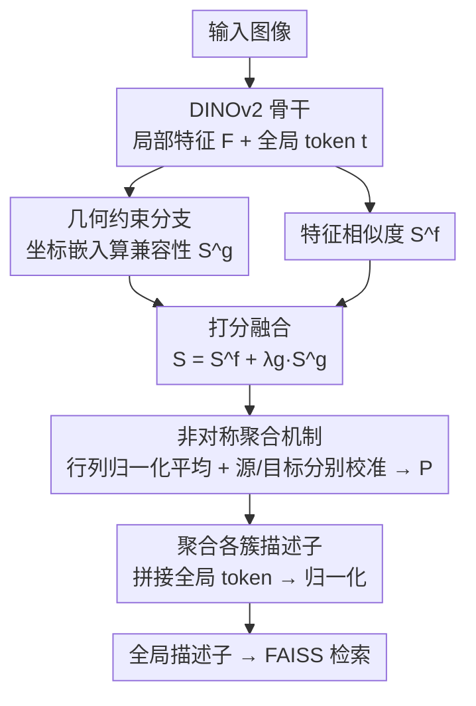

# A2GC: Asymmetric Aggregation with Geometric Constraints for Locally Aggregated Descriptors

**会议**: CVPR 2026  
**论文**: [CVF Open Access](https://openaccess.thecvf.com/content/CVPR2026/html/Li_A2GC_Asymmetric_Aggregation_with_Geometric_Constraints_for_Locally_Aggregated_Descriptors_CVPR_2026_paper.html)  
**代码**: https://github.com/CV4RA/A2GC  
**领域**: 视觉地点识别 / 图像检索  
**关键词**: 视觉地点识别, 最优传输, 特征聚合, 非对称 Sinkhorn, 几何约束

## 一句话总结
针对视觉地点识别（VPR）中"特征聚合靠对称 Sinkhorn"这一假设的失效，A2GC 把最优传输求解器改成**非对称**（行列归一化平均 + 源/目标边缘分别校准），再叠加一个**几何约束分支**（用可学习坐标嵌入让空间相邻的特征更倾向分到同一簇），在 Pitts30k 上把 Recall@1 推到 95.6%。

## 研究背景与动机

**领域现状**：现代 VPR 走的是"两段式"——深度骨干（如 DINOv2 ViT）抽局部特征，再用聚合模块把一堆局部特征压成一个紧凑的全局描述子供检索。聚合环节是性能瓶颈，近年最优传输（OT）成了主流框架：SALAD 把"局部特征 → 学习到的簇中心"的软分配重新表述成一个运输问题，用 Sinkhorn 算法求解传输矩阵，并加一个 dustbin 簇丢弃无信息特征。

**现有痛点**：标准 Sinkhorn 假设**源边缘和目标边缘是对称、均衡的**——也就是默认"图像特征的分布"和"簇中心的分布"长得差不多。但实际中图像特征来自五花八门的城市场景，可能聚成几团、带重尾、甚至多峰；簇中心数量（m=64）和图像 token 数量（n=H×W，几百上千）也对不上。强行对称归一化会让传输计划在分布失配时表现受限。另一个被忽略的点是：现有 OT 方法把每个特征当成**独立**实体，完全无视特征在图像里的空间排布——而空间相邻往往意味着语义相关。

**核心矛盾**：Sinkhorn 的"对称边缘约束"与 VPR 里"源/目标分布天然不对称"之间的冲突；以及"特征独立假设"与"空间结构本可提供有用先验"之间的浪费。

**本文目标**：(1) 放开 OT 求解的对称假设，让源、目标边缘各自校准；(2) 把空间几何信息显式编码进特征-簇分配，鼓励空间相邻的特征落到同一簇。

**核心 idea**：用**非对称最优传输**替换对称 Sinkhorn，并融合一条**几何兼容性**通路——两者都嵌在原有聚合框架里，不改骨干、不加重排，几乎零额外开销。

## 方法详解

### 整体框架

A2GC-VPR 的输入是一张查询/底库图像，输出是一个用于检索的紧凑全局描述子。流程是：DINOv2 ViT 骨干抽出局部特征图 $F\in\mathbb{R}^{768\times H\times W}$ 和一个全局 token $t\in\mathbb{R}^{768}$；局部特征经投影后，一路计算与 $m=64$ 个可学习簇中心的**特征相似度** $S^f$，另一路由坐标嵌入算出**几何兼容性** $S^g$，两者加权融合成最终打分矩阵 $S$；这个 $S$ 作为 log-affinity 喂进**非对称 OT 求解器**（行列归一化平均 → 源/目标分别校准）得到传输矩阵 $P$；用 $P$ 把局部特征聚合成各簇描述子，再与投影后的全局 token 拼接、归一化，得到最终全局描述子。检索阶段对 L2 归一化的描述子用 FAISS 做 L2 距离最近邻。

整套方法是"双分支算分 → 非对称求解 → 聚合拼接"的清晰 pipeline，框架图如下（节点名即下方关键设计名）：

### 关键设计

**1. 非对称聚合机制：让源、目标边缘各自校准，摆脱对称 Sinkhorn 的束缚**

痛点很直接：标准 Sinkhorn 在源（簇，$m+1$ 个，含 dustbin）和目标（图像 token，$n$ 个）的分布、数量都不对等时，对称的行列交替归一化会被某一维主导，传输计划无法贴合真实的失配分布。A2GC 的求解器分两阶段。第一阶段是**行列归一化平均**：把打分矩阵初始化为 $Z^{(0)}=M/\max(\tau,\epsilon)$（$\tau$ 为温度，$\epsilon=10^{-6}$ 保数值稳定），然后迭代 $T=3$ 次，每次在 log 域同时做行归一化和列归一化再取平均：

$$Z^{(t)}_r = Z^{(t-1)} - \mathrm{logsumexp}(Z^{(t-1)},\dim=2),\quad Z^{(t)}_c = Z^{(t-1)} - \mathrm{logsumexp}(Z^{(t-1)},\dim=1),\quad Z^{(t)}=\tfrac12\big(Z^{(t)}_r+Z^{(t)}_c\big)$$

取平均而非交替，是为了同时平衡行、列约束，防止解被某一维度"压垮"，收敛更稳。第二阶段是**非对称边缘校准**：迭代结束后，先按源边缘 $\log a$ 校准 $u=\log a-\mathrm{logsumexp}(Z^{(T)},\dim=2)$，施加 $Z'=Z^{(T)}+u\mathbf{1}_n^\top$；再按目标边缘 $\log b$ 校准 $v=\log b-\mathrm{logsumexp}(Z',\dim=1)$，得到最终 $\log P=Z'+\mathbf{1}_{m+1}v^\top$。关键在于 $u$ 和 $v$ 是**分开独立**算的——这正是"非对称"的来源：标准 Sinkhorn 强制源、目标用同一套对称约束，而这里允许传输计划针对各自分布单独适配，从而能处理 VPR 里"源特征数与目标 token 数不同、分布本就不对称"的常见情形。

**2. 几何约束：用可学习坐标嵌入注入空间先验，让相邻特征更倾向同簇**

痛点是现有 OT 聚合把特征当独立点，丢掉了"空间相邻 → 语义相关"这个免费先验。A2GC 给每个空间位置 $(x,y)$ 生成归一化坐标 $\mathrm{coord}_{xy}=\big(\tfrac{2x}{H-1}-1,\tfrac{2y}{W-1}-1\big)\in[-1,1]^2$，再用一个可学习投影网络 $\varphi_g$（实现为 $1\times1$ 卷积）映射到几何嵌入 $g_{xy}=\varphi_g(\mathrm{coord}_{xy})\in\mathbb{R}^{d_g}$（$d_g=16$）。每个簇中心 $c_j$ 同时维护一个可学习几何嵌入 $c^g_j$ 表示它的"空间偏好"，于是位置 $(x,y)$ 与簇 $j$ 的几何兼容性是内积 $S^g_{ij}=g_{xy}^\top c^g_j$。最终打分把几何项加权融进特征相似度：

$$S_{ij} = S^f_{ij} + \lambda_g\, S^g_{ij}$$

其中 $\lambda_g$ 是**可学习标量**（初始化 0.15），自适应控制几何约束的影响强度。这样做的效果是：当某个簇在空间上有明确偏好（比如总爱聚某一区域的特征）时，几何兼容性会把空间相邻的特征往同一簇拉，增强分配的局部性与一致性——而代价仅是一个 $1\times1$ 卷积加几个嵌入向量，几乎不增加计算量。

### 损失函数 / 训练策略
骨干用 DINOv2 ViT-B/14，只**微调最后 4 个 transformer block**，更早的块冻结（消融显示微调最后 2–4 块最优，全微调反而过拟合）。聚合模块含三组投影网络：全局 token 投到 $g=256$、局部特征投到簇维度、打分网络处理 $m=64$ 个簇。训练数据为 GSV-Cities（约 120 万张、23 城，每地点采 4 张）；优化器 AdamW，学习率 $6\times10^{-5}$、权重衰减 $9.5\times10^{-9}$，线性衰减到 20%；损失用 MultiSimilarityLoss（$\alpha=1.0,\beta=50$）配 MultiSimilarityMiner（余弦相似度，margin 0.1）；batch size 60，单卡 V100-32G。

## 实验关键数据

### 主实验

四个标准 VPR 基准上对比 SOTA，A2GC（ViTg、描述子 33280 维）取得最佳：

| 数据集 | 指标 | A2GC | 次优对比 | 说明 |
|--------|------|------|----------|------|
| Pitts30k | R@1/5/10 | **95.6**/99.3/99.8 | Pair-VPR 95.4/97.5/98.0 | 城市场景全面领先 |
| Pitts250k-test | R@1/5/10 | **97.3**/99.3/99.7 | FoL 97.0/99.2/99.5 | 超过 FoL、SelaVPR |
| MSLS-val | R@1/5/10 | 93.6/97.5/97.9 | FoL 93.5 / Pair-VPR 95.4 | 略超 FoL，R@1 不及 Pair-VPR |
| MSLS-challenge | R@1/5/10 | 80.6/90.9/92.5 | Pair-VPR 81.7 / FoL 80.0 | 与 FoL、Pair-VPR 相当 |

注：Pair-VPR、SelaVPR、CricaVPR 等带 `*` 为两段式重排方法，A2GC 是**单段聚合**就达到可比甚至更优的结果。⚠️ MSLS-challenge 上 Pair-VPR 的 R@1（81.7）实际高于 A2GC（80.6），论文措辞为"comparable"，横向比较需注意。

### 消融实验

**组件贡献**（Pitts30k 验证集，ViTb）：

| 配置 | R@1 | R@5 | R@10 | 说明 |
|------|-----|-----|------|------|
| Full A2GC | **94.9** | 98.5 | 99.5 | 完整模型 |
| w/o 非对称聚合 (A2GC) | 93.9 | 98.1 | 99.3 | R@1 掉 1.0% |
| w/o 几何约束 (GC) | 94.1 | 97.9 | 99.5 | R@1 掉 0.8% |
| w/o 两者 | 92.5 | 96.4 | 97.8 | 同时去掉掉 2.4% |

**骨干规模**（Pitts30k）：

| 骨干 | 参数量 | 延迟 | R@1 | R@5 | R@10 |
|------|--------|------|-----|-----|------|
| ViTs | 22.9M | 1.32ms | 94.0 | 98.5 | 99.3 |
| ViTb | 88.0M | 2.41ms | 94.9 | 98.5 | 99.5 |
| ViTl | 306.1M | 7.85ms | 95.4 | 99.2 | 99.7 |
| ViTg | 1106.3M | 25.06ms | 95.6 | 99.3 | 99.8 |

### 关键发现
- **两个组件互补且都不可或缺**：单独去掉非对称聚合 R@1 掉 1.0%、单独去掉几何约束掉 0.8%，但**两者同时去掉**掉 2.4%（94.9→92.5），说明它们的收益不是简单叠加而是协同的，缺一性能就回到 SALAD 量级。
- **非对称聚合对 R@1 影响更大**，几何约束则更多提升 top-5/10 的一致性（去掉 GC 后 R@5 从 98.5 掉到 97.9）。
- **规模-效率权衡**：从 ViTs 到 ViTg，R@1 仅涨 1.6%（94.0→95.6），但延迟暴涨 19×、参数 48×；ViTl 以 7.85ms 就拿到接近最优的 R@5/10，是实际部署的甜点。
- **微调策略**：只调最后 2–4 块最优（R@1 94.9%），**全微调反而掉到 94.0%**，提示过度微调会破坏预训练表征。
- **描述子尺寸**：R@1 随尺寸单调上升（93.7→95.0），但 R@10 在 2048+64 之后就饱和在 99.5%，高位召回对维度不敏感。

## 亮点与洞察
- **"对称 Sinkhorn 是个隐含且可疑的假设"是个干净的切入点**：把求解器从对称改成"行列平均 + 源/目标分别校准"，改动小、可解释，且直接对应 VPR 里源/目标数量与分布不等的真实情况——这种"指出主流方法一个被默认成立的前提其实不成立"的叙事很有说服力。
- **几何约束几乎零成本**：一个 $1\times1$ 卷积坐标嵌入 + 每簇一个几何向量 + 一个可学习 $\lambda_g$，就把"空间相邻 → 同簇"的先验注入软分配，思路可迁移到任何基于簇分配/软聚合的检索或分割任务。
- **单段方法打平两段式重排**：A2GC 不做 re-ranking 就逼近甚至超过 Pair-VPR、SelaVPR 这类带重排的方法，意味着把改进放在聚合算分这一层比堆重排更省。

## 局限与展望
- **绝对增益偏小**：在已经很高的基线上（SALAD/BoQ 等 92–95% R@1），A2GC 的提升多在 0.5–1% 量级，且 MSLS-challenge 上并未稳超 Pair-VPR，说明非对称建模在更难、视角/季节变化更大的场景里红利有限。
- **几何约束的假设较强**："空间相邻 → 同簇"在规整城市街景成立，但在重复纹理、对称建筑或大视角变化下，空间坐标的可学习偏好是否仍有效、$\lambda_g$ 会不会被学到接近 0，论文未深入分析。⚠️ 几何嵌入维度 $d_g=16$ 偏小，几何项的表达能力上限值得探究。
- **非对称求解的理论性质**：行列平均 + 独立校准不再是严格的双随机投影，其收敛性/最优性保证弱于标准 Sinkhorn，论文以经验稳定性带过，缺少理论刻画。
- **改进思路**：让 $\lambda_g$ 随簇/位置自适应（而非全局标量）、把坐标嵌入升级为相对位置或可变形偏移，可能在大视角变化场景进一步获益。

## 相关工作与启发
- **vs SALAD**：同样把聚合表述为最优传输并用 dustbin 丢弃无信息特征，但 SALAD 用标准对称 Sinkhorn；A2GC 把求解器换成非对称版本并叠加几何约束，在 Pitts250k 上 R@1 从 95.1 提到 97.3。核心区别就是"对称 → 非对称"这一刀。
- **vs NetVLAD/MixVPR**：早期 VLAD 系（NetVLAD、MixVPR）用可学习软分配或多尺度混合做聚合，没有 OT 的传输约束，也不建模分布失配；A2GC 站在 OT 框架上更细地刻画了分配过程。
- **vs SelaVPR/CricaVPR/Pair-VPR**：这些是 transformer 自学习或跨图注意力 + 两段式重排，往往需要改架构或额外重排开销；A2GC 强调**无需重排、无缝嵌入现有聚合框架**，以更低成本拿到可比性能。

## 评分
- 新颖性: ⭐⭐⭐⭐ 把"对称 Sinkhorn 假设失效"作为切入点并给出非对称求解器，角度清晰；但几何约束部分较常规。
- 实验充分度: ⭐⭐⭐⭐ 四基准 + 骨干/尺寸/微调/组件四组消融，覆盖全面；缺与重排方法的统一开销对比。
- 写作质量: ⭐⭐⭐⭐ 动机叙事干净、公式完整；个别横向比较（MSLS-challenge）措辞偏乐观。
- 价值: ⭐⭐⭐⭐ 单段、低开销、可即插现有聚合框架，对 VPR/检索的聚合层是实用增量。

<!-- RELATED:START -->

## 相关论文

- [\[NeurIPS 2025\] On Topological Descriptors for Graph Products](../../NeurIPS2025/others/on_topological_descriptors_for_graph_products.md)
- [\[ICML 2026\] Networked Information Aggregation for Binary Classification](../../ICML2026/others/networked_information_aggregation_for_binary_classification.md)
- [\[NeurIPS 2025\] Asymmetric Duos: Sidekicks Improve Uncertainty](../../NeurIPS2025/others/asymmetric_duos_sidekicks_improve_uncertainty.md)
- [\[AAAI 2026\] Improved Differentially Private Algorithms for Rank Aggregation](../../AAAI2026/others/improved_differentially_private_algorithms_for_rank_aggregation.md)
- [\[ICCV 2025\] Joint Asymmetric Loss for Learning with Noisy Labels](../../ICCV2025/others/joint_asymmetric_loss_for_learning_with_noisy_labels.md)

<!-- RELATED:END -->
