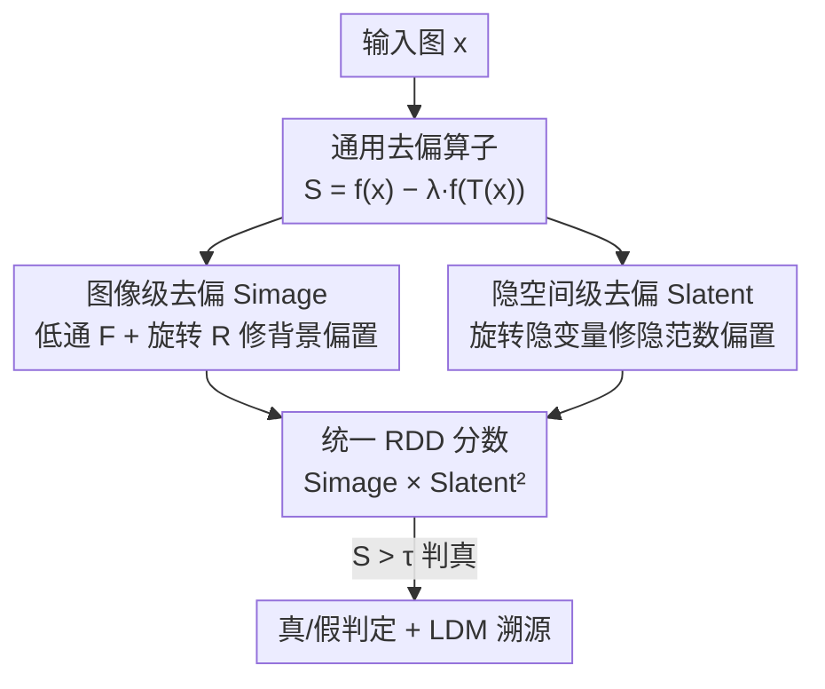

# A Debiased Reconstruction-based Framework for Training-Free Detection of AI-Generated Images

**会议**: CVPR 2026  
**论文**: [CVF Open Access](https://openaccess.thecvf.com/content/CVPR2026/html/Choi_A_Debiased_Reconstruction-based_Framework_for_Training-Free_Detection_of_AI-Generated_Images_CVPR_2026_paper.html)  
**代码**: 待确认  
**领域**: AI生成图像检测  
**关键词**: 训练无关检测, AIGI取证, 重建误差去偏, 隐空间扩散, 数据增强

## 一句话总结
针对"基于重建误差的免训练 AI 生成图检测"会被简单背景/大范数隐变量带偏的问题，本文用**旋转 + 低通滤波**这类"保留偏置因子、破坏取证信息"的增强对重建误差做归一化去偏，在图像级和隐空间级各得到一个去偏分数，相乘融合成统一分数 RDD，在 GenImage、LSUN-Bedroom 等 18 个子基准上取得免训练 SOTA（平均 AUROC 0.981 / 0.940）。

## 研究背景与动机

**领域现状**：检测一张图是不是 AI 生成（AIGI detection）已成刚需，但主流做法是"训练式"——拿真实图和某些生成模型的图训分类器学判别特征。问题是生成模型种类多、迭代快，训练数据往往拿不到，于是"免训练（training-free）检测"更实用：不依赖任何真/假训练样本，只靠预训练基础模型设计一个打分函数 $S(x)$，$S(x)>\tau$ 判真、否则判假。

**现有痛点**：免训练这条线里最常用的信号是 **LDM 自编码器的图像级重建误差** $f_{AE}(x)=d(x,\text{AE}(x))$（AEROBLADE）。直觉是：AE 在生成图的隐流形上训练，对 AIGI 几乎无损重建（误差小）；真实图偏离训练分布，重建误差大。但作者发现这个分数有两个**实例级偏置（instance-specific bias）**，与"真/假"这件事无关却主导了打分：
- **背景偏置（background bias）**：背景简单/纹理少的真实图，重建误差被严重低估，被误判成 AI 生成（假阳性）。作者做了个 toy 实验——拿 ImageNet "南瓜灯" 1100 张真图，用 CLIPSeg 把背景涂黑，再和 SDv1.4 生成的 1100 张对比，发现去背景后的真图重建误差竟和生成图分不开。
- **泛化差**：$f_{AE}$ 强依赖 AE，对非 AE 类生成模型（如 GAN）几乎失效——在 LSUN 上检测 ProGAN，$f_{AE}$ 的真/假分布完全重叠（AUROC 仅 0.476）。

**核心矛盾**：重建误差里"取证信号（真假差异）"和"实例固有属性（背景复杂度、隐变量范数）"耦合在一起，后者方差大、把前者淹没了。

**本文目标**：(1) 把背景这种混杂因子从图像级分数里消掉；(2) 给免训练检测引入一个对 GAN 等也有效的新信号；(3) 把两路信号在不引入额外超参的前提下融成一个统一分数。

**切入角度**：与其改进重建误差本身，不如找一种变换 $T$，它**保留偏置因子、但破坏取证信息**——那么对原图和变换图的误差做差，就能把偏置抵消、只留下真假差异。作者发现旋转和低通滤波恰好满足这个性质。

**核心 idea**：用"保偏置、毁取证"的增强做归一化去偏——$S(x)=f(x)-\lambda f(T(x))$，并在图像级和隐空间级各做一次，最后相乘统一。

## 方法详解

### 整体框架

RDD 的输入是一张待检测图 $x$，输出是一个标量分数 $S_{RDD}(x)$（越大越像真实图）。它走两条并行支路，最后相乘：

1. **图像级支路**：用 LDM 的自编码器算重建误差 $f_{AE}$，再用低通滤波 $F$ 和 90° 旋转 $R$ 两种增强分别去偏，得到 LFID、RID 两个分数，递归合成图像级去偏分数 $S_{image}$——专门修掉背景偏置，擅长检测 LDM 类生成图。
2. **隐空间级支路**：把图编码到隐空间 $z_0=E(x)$，用扩散模型在小噪声步 $t$ 下的去噪重建误差 $f_{latent}$ 作为新信号，再用旋转后的隐变量做归一化去掉"隐范数偏置"，得到 $S_{latent}$——专门扩展到 GAN/像素级扩散等非 AE 模型。
3. **统一**：$S_{RDD}=S_{image}\times S_{latent}^2$，相乘是因为两个分数量纲/取值范围不同，乘法天然平衡。

整条管线的关键不是某个新网络，而是反复套用同一个去偏算子 $S_{f,T,\lambda}(x)=f(x)-\lambda f(T(x))$：换 $f$（图像重建 / 隐重建）、换 $T$（低通 / 旋转），就拼出整个框架。

### 关键设计

**1. 通用去偏算子：保偏置、毁取证的增强做差**

痛点直击重建误差的"偏置耦合"：$f(x)$ 里既有真假取证信号、又有背景/范数这类实例属性，后者把前者盖住了。作者给出一个统一公式：

$$S_{f,T,\lambda}(x) = f(x) - \lambda f(T(x)),\quad \lambda\in[0,1].$$

它要求变换 $T$ 满足两个相反的性质：(1) **保留偏置因子**——$T(x)$ 上的背景/范数偏置和 $x$ 上几乎一样，于是做差时被抵消；(2) **破坏取证信息**——$T(x)$ 上真假差异被放大或扭曲，做差后只剩这部分。换句话说，$f(T(x))$ 充当"只含偏置、不含取证"的参照系，减掉它就把偏置归一化掉了。这是全文的母公式，后面图像级、隐空间级、统一分数全是它的特例，好处是**几乎不引入新超参**（只有一个 $\lambda$）。

**2. 图像级去偏 $S_{image}$：低通 + 旋转双增强消背景偏置**

针对背景偏置。作者先用傅里叶分析给出依据：真实图在 $(x,\text{AE}(x))$ 的差异谱里**高频偏离更大**，而背景信息主要在低频。这导出两种互补增强：

- **低通滤波去偏（LFID）**：高频被滤掉后真实图更易重建、生成图变化小，而背景（低频）几乎不动——满足"保偏置毁取证"。$S_{LFID}(x)=f_{AE}(x)-f_{AE}(F(x))$，固定 $\lambda_F=1$。
- **旋转去偏（RID）**：作者验证旋转图 $R(x)$ 经 AE 重建后，生成图的失真比真实图明显得多（图 5 比图 4 在生成数据上扭曲更剧烈）。$S_{RID}(x)=f_{AE}(x)-\lambda_R f_{AE}(R(x))$，$R$ 为 90° 旋转。

两者基于独立增强，可协同。最终递归套用：

$$S_{image}(x)=S_{RID}(x)-S_{RID}(F(x))=f_{AE}(x)-f_{AE}(F(x))-\lambda_R f_{AE}(R(x))+\lambda_R f_{AE}(F(R(x))).$$

一个良好性质是 $S_{image}$ **对操作顺序可交换**（先转后滤 = 先滤后转）。涂黑背景的真图上，原始 $f_{AE}$ 分不开，而 $S_{image}$ 能成功把它们识别为真——背景偏置被消掉。

**3. 隐空间级去偏 $S_{latent}$：旋转隐变量消隐范数偏置**

针对 $f_{AE}$ 对非 AE 模型失效的泛化问题。作者引入一个**全新的免训练信号**——隐空间重建误差（论文称是首次将其用于免训练 AIGI 检测）：在小噪声步 $t$ 加噪后，用扩散去噪网络 $\epsilon_\theta$ 预测噪声，量误差

$$f_{latent,t}(z_0)=\mathbb{E}_{\epsilon}\, d_{latent}(\epsilon_\theta(z_t,t,\phi),\epsilon)\approx\frac1n\sum_{i=1}^n d_{latent}(\epsilon_\theta(z_{t,i},t,\phi),\epsilon_i),$$

其中 $\phi$ 是空文本、$t$ 取得很小以保证可重建、$n$ 是噪声采样数。直觉：真实图的隐变量在扩散模型流形上（训练用过），去噪损失低；外来生成图偏离流形、损失高。但作者发现它有**隐范数偏置（latent-norm bias）**——$\ell_2$ 范数大的隐变量天然重建误差低，不论真假。于是同样套去偏算子，用**旋转后的隐变量**（与原隐变量同范数、但偏离流形）做参照：

$$S_{latent}(z_0)=f_{latent,t}(R(z_0))-f_{latent,t}(z_0).$$

旋转隐变量保住了范数（偏置因子）、又把它推到流形外（破坏取证），归一化后在 ProGAN 等 GAN 数据上的真/假区分大幅提升（LSUN AUROC 从 0.666 升到 0.963）。

**4. 统一 RDD 分数：乘法融合两路互补信号**

两路分数互补——$S_{image}$ 强在 LDM、$S_{latent}$ 强在 GAN/像素扩散，恰好各补各的短板。但它们取值范围差异大，直接相加会被某一路主导。作者用乘法融合：

$$S_{RDD}(x)=S_{image}(x)\times S_{latent}(E(x))^2.$$

对 $S_{latent}$ 取平方是有依据的：$S_{image}$ 里的 LPIPS 距离本质是 VGG 特征空间里平方 $\ell_2$ 距离之和，与隐空间结构同构，平方后量纲对齐。消融（表 4）显示加法融合无法平衡两路（系数稍变就偏向一侧），而乘法在 GenImage 上甚至出现**协同增益**：$S_{RDD}$ 0.981 高于单路最好的 $S_{image}$ 0.969。

### 损失函数 / 训练策略

本方法**完全免训练**，无任何训练目标——所有分数都直接复用预训练 LDM（SDv1.4/v2-base、MiniSD 做集成）的 AE 与去噪网络在测试时计算。关键超参跨所有基准统一固定：$t=0.05$、$\lambda_R=0.5$（低通核默认 size 3、$\sigma=0.8$），单张 A100 即可推理。

## 实验关键数据

### 主实验

GenImage（主测 LDM 类 T2I，对真实 ImageNet）与 LSUN-Bedroom（主测 GAN + 像素扩散，对真实 LSUN）两个基准，指标为 AUROC，18 个子基准里 RDD 拿下 16 个最优/次优。

| 基准（平均 AUROC） | AEROBLADE | RIGID | Manifold Bias | WaRPAD | RDD（本文） |
|--------|------|------|------|------|------|
| GenImage（8 模型） | 0.932 | 0.820 | 0.719 | 0.946 | **0.981** |
| LSUN-Bedroom（10 模型） | 0.476 | 0.861 | 0.920 | 0.934 | **0.940** |

对比说明：AEROBLADE 在 LSUN 上塌到 0.476（AE 模型未知时失效），RDD 靠隐空间支路稳住 0.940；即便对比训练式检测器（AIDE/FatFormer），它们只在与训练分布相近的数据上强，跨分布时被多个免训练方法反超。

### 消融实验

各组件单独贡献（表 3）清楚显示"图像级管 LDM、隐级管 GAN"的互补性，去偏对两个原始分数都有提升：

| 配置 | GenImage | LSUN-Bedroom | 说明 |
|------|------|------|------|
| $f_{latent}$（原始隐重建） | 0.408 | 0.666 | 未去偏，弱 |
| $f_{AE}$（原始图像重建） | 0.902 | 0.476 | LDM 强、GAN 塌 |
| $S_{latent}$（去偏隐级） | 0.667 | 0.963 | GAN 上大幅翻盘 |
| $S_{image}$（去偏图像级） | 0.969 | 0.464 | LDM 上进一步提升 |
| $S_{RDD}$（统一） | **0.981** | **0.940** | 两路互补，整体最稳 |

融合方式消融（表 4）：加法在某系数下两基准不可兼得（如 $\lambda_A=10^{-4}$ 时 GenImage 0.973 但 LSUN 仅 0.515），乘法 $\lambda_M=2$ 同时拿到 0.981 / 0.940，验证乘法更能平衡两路。

### 关键发现

- **去偏是真有效，不是噱头**：$f_{AE}$→$S_{image}$ 在 GenImage 从 0.902 升到 0.969；$f_{latent}$→$S_{latent}$ 在 LSUN 从 0.666 升到 0.963，两路都靠"减去增强参照"显著去偏。
- **超参鲁棒**：$\lambda_R$、$t$ 只在极小值区掉点，其余区间稳定；低通核 size/$\sigma$ 在 3–7 / 0.5–1.4 范围 AUROC 几乎不变（表 5，均 0.96–0.98）；45°/180° 旋转给 0.983/0.984，与默认相当。
- **增强选择有讲究**：换成自监督常用的 ColorJitter / RandomResizedCrop 只有 0.907 / 0.841，远逊于低通+旋转——印证作者"保偏置毁取证"的增强设计准则不是随便选的。
- **抗扰动**：在 JPEG 压缩、中心裁剪重采样下 RDD 仍稳，优于 AEROBLADE / RIGID。
- **额外应用——LDM 溯源**：$S_{image}$ 可直接用于"判断图属于哪个 LDM"的归属任务，9 个子任务上超过专门的 LatentTracer，且单样本 0.292s，比 LatentTracer（14.65s）快约 50×。

## 亮点与洞察
- **"保偏置、毁取证"是个可迁移的去偏范式**：母公式 $f(x)-\lambda f(T(x))$ 的精髓在于挑一个变换，让混杂因子在做差中抵消、判别信号被放大。这套思路不止用于 AIGI 检测，任何"打分被实例固有属性带偏"的免训练任务都能借鉴——关键是找到那个满足双重性质的 $T$。
- **旋转一物两用很巧**：90° 旋转在图像级当 OOD 增强（生成图重建失真更大），在隐空间级又恰好生成"同范数、离流形"的参照隐变量——一个简单算子同时服务两个层级的去偏，几乎零成本。
- **首次把隐空间重建误差用于免训练检测**，且专门诊断出"隐范数偏置"并对症下药，把 GAN 这种 AE 信号失效的硬骨头啃下来。
- **乘法融合 + 平方对齐量纲**这个细节有理有据（LPIPS 与隐空间都是平方 $\ell_2$ 同构），避免了加法融合的尺度失衡，还白捡协同增益。

## 局限与展望
- 作者承认：需要在增强图上做 AE 重建、又要在增强隐变量上跑网络评估，**比单分数 baseline 慢**（要多次前向）。
- ⚠️ 自己发现：方法强依赖一个"好的预训练 LDM"作为重建器，对训练分布之外、且与所用 LDM 隐流形差异极大的全新生成范式，泛化上限仍受 LDM 表征限制——论文未充分测试与 SD 系差异很大的生成器。
- $\lambda_R$、$t$ 虽鲁棒但仍是手调固定值；增强只验证了旋转/低通两种，是否存在更优"保偏置毁取证"增强（如可学习的去偏变换）值得探索。
- 隐范数偏置只用旋转归一化，是否还有其他实例级偏置（如纹理密度、语义复杂度）未被消除，可进一步系统排查。

## 相关工作与启发
- **vs AEROBLADE**：同样用 LDM 重建误差，但 AEROBLADE 直接用 $f_{AE}$，会被背景偏置带偏、且 AE 未知时（如 ADM、GAN）失效；本文用增强做差去偏，并补一条隐空间支路，LSUN 上 0.940 vs 0.476。
- **vs Manifold-induced Bias**：他们在 CLIP 嵌入空间量图像与预测噪声的相似度并组合其他指标；本文首次"图像级 + 隐空间级联合"，且专门做去偏，LDM 类数据上更稳。
- **vs RIGID / MINDER**：二者靠自监督模型（DINOv2）对高斯模糊/噪声的扰动敏感度；本文不依赖额外自监督表征，直接复用 LDM 重建信号，平均更高。
- **vs LatentTracer（溯源任务）**：LatentTracer 在测试时做输入优化、耗时（14.65s/样本）；本文 $S_{image}$ 免优化、0.292s/样本、9 任务更优——免训练去偏分数顺手解决了模型归属问题。

## 评分
- 新颖性: ⭐⭐⭐⭐⭐ 把"保偏置毁取证"的增强去偏统一成母公式，并首次引入隐空间重建误差，框架简洁且洞察深。
- 实验充分度: ⭐⭐⭐⭐⭐ 两大基准 18 子任务 + 组件/融合/超参/增强/抗扰动/溯源全套消融，证据扎实。
- 写作质量: ⭐⭐⭐⭐ 逻辑清晰、公式与傅里叶分析有理有据；个别符号（$f_{latent}$ 大小写、$t$ 取值在正文与设置间略有出入）需对原文核对。
- 价值: ⭐⭐⭐⭐⭐ 免训练、超参跨基准固定、单卡可跑，AIGI 取证落地价值高，去偏范式可迁移。

<!-- RELATED:START -->

## 相关论文

- [\[CVPR 2026\] A Difference-in-Difference Approach to Detecting AI-Generated Images](a_difference-in-difference_approach_to_detecting_ai-generated_images.md)
- [\[CVPR 2026\] DPGF-Net: Dual-Prior Guided Fusion Network for Joint Assessment of Perceptual Quality and Semantic Consistency in AI-Generated Images](dpgf-net_dual-prior_guided_fusion_network_for_joint_assessment_of_perceptual_qua.md)
- [\[CVPR 2026\] Debiased Sample Selection for Learning with Noisy Labels](debiased_sample_selection_for_learning_with_noisy_labels.md)
- [\[CVPR 2026\] ALLNet: Multi-task Dense Prediction for Degraded Images](allnet_multi-task_dense_prediction_for_degraded_images.md)
- [\[CVPR 2026\] Region-Wise Correspondence Prediction between Manga Line Art Images](region-wise_correspondence_prediction_between_manga_line_art_images.md)

<!-- RELATED:END -->
