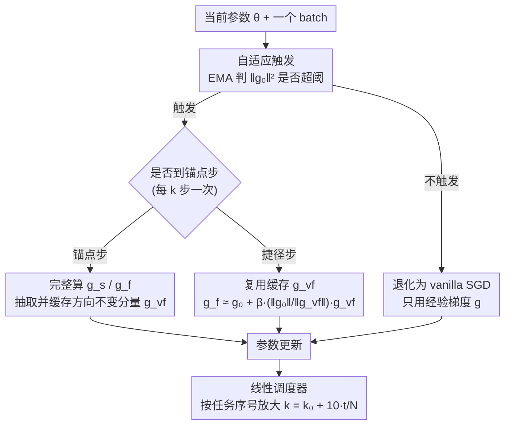

# A Faster Path to Continual Learning

**会议**: CVPR 2026  
**代码**: 暂未公开（基于 PILOT / C-Flat 仓库实现）  
**领域**: 持续学习 / 优化器 / 平坦极小值  
**关键词**: 持续学习, C-Flat, Sharpness-Aware Minimization, 方向不变梯度, 自适应触发

## 一句话总结
针对持续学习优化器 C-Flat 每步要多算三次梯度、训练太慢的问题，本文发现一阶平坦度梯度里存在「方向不变」的分量，于是把它缓存下来在后续若干步里复用、跳过冗余的扰动梯度计算，再配上一个随任务推进逐渐放大跳步间隔的线性调度器和一个基于梯度统计量的自适应触发开关，让 C-Flat Turbo 在精度持平甚至略升的同时比 C-Flat 快 1.0×~1.25×（吞吐从约 27% 拉回到约 60%）。

## 研究背景与动机

**领域现状**：持续学习（Continual Learning, CL）要让模型在不断到来的任务流上学习而不遗忘旧知识。除了记忆回放、正则化、结构扩展、预训练模型（PTM）这些主流路线外，近年从「优化几何」角度切入的工作很活跃——大量证据表明，把模型推向**平坦极小值**（flat minima）能显著缓解灾难性遗忘，因为平坦区域对参数扰动不敏感，新任务的更新不容易破坏旧任务学到的解。C-Flat 正是这条路线上的代表：它是一个即插即用的优化器，同时优化零阶 sharpness 和一阶 flatness，鼓励模型收敛到新旧任务联合空间里「均匀低损失、低曲率」的区域。

**现有痛点**：C-Flat 的平坦度对齐机制非常贵。在 C-Flat 的目标 $\min_{\boldsymbol\theta}\ \mathcal L(\boldsymbol\theta)+R^0_\rho(\boldsymbol\theta)+\lambda\,R^1_\rho(\boldsymbol\theta)$ 里，每一步迭代除了正常的经验梯度 $\boldsymbol g=\nabla\mathcal L(\boldsymbol\theta)$，还要：(i) 在对抗扰动点上算零阶 sharpness 梯度 $\boldsymbol g_s$，多一次反向传播；(ii) 算一阶 flatness 梯度 $\boldsymbol g_f$，要在代理模型和它的扰动态两处分别求梯度范数，多两次反向传播。一步要算 3~4 次反传，整体成本翻好几倍。从表里看，C-Flat 把吞吐量从 vanilla 的 100% 直接拉到只有约 26%~34%，在长任务序列和大规模 PTM 场景下这个开销尤其致命。

**核心矛盾**：「追求更平坦的极小值」和「保持训练效率」之间存在尖锐的 trade-off。大多数 sharpness-aware 的 CL 方法直接照搬 SAM 的全部计算开销，没人去问：那些为追求平坦而多算的梯度，是不是每一步都必须从头重算？

**本文目标**：在**不牺牲** C-Flat 平坦化效果的前提下，把多出来的梯度计算砍掉一大部分，让它跑得接近甚至超过 SAM 的速度。

**切入角度**：作者观察到一个关键现象——把 SAM 梯度沿主梯度方向做正交分解后，那个**正交分量变化得比主梯度慢得多**（这正是 LookSAM 的发现）。作者进一步追问：一阶 flatness 梯度里是否也存在这种「方向不变、缓慢变化」的分量？实验给出肯定答案，而且 flatness 的正交分量 $\boldsymbol g_{vf}$ 比 sharpness 的 $\boldsymbol g_{vs}$ 变化得**更慢**。既然这个方向几步之内几乎不变，那就没必要每步重算，缓存复用即可。

**核心 idea**：用「缓存方向不变的平坦度分量 + 周期性复用」代替「每步重算 sharpness/flatness 梯度」，并让复用间隔随任务推进自适应放大。

## 方法详解

### 整体框架
C-Flat Turbo 不改变 C-Flat 的优化目标，只改变**怎么省着算**这些正则梯度。它的核心机制是一个「每 $k$ 步做一次完整计算、其余 $k-1$ 步走捷径」的循环：在第 1 步（锚点步）老老实实算出完整的 sharpness 梯度 $\boldsymbol g_s$ 和 flatness 梯度 $\boldsymbol g_f$，并从中抽取方向不变分量 $\boldsymbol g_{vf}$ 缓存下来；接下来的 $k-1$ 步里，直接拿缓存的 $\boldsymbol g_{vf}$ 叠到当前代理梯度上近似出 flatness 更新，跳过那两次昂贵的反向传播。在此之上叠两层动态控制：一个**线性调度器**让间隔 $k$ 随任务序号变大（早期任务梯度抖动大、$k$ 小算得勤，后期梯度趋稳、$k$ 大省得多），一个**自适应触发器**根据梯度范数统计量决定「这一步到底要不要上 C-Flat 正则」，不值得时就退化成纯 SGD。

### 关键设计

**1. 沿方向不变分量走捷径：把「每步重算 flatness」换成「缓存复用」**

这是省时间的主引擎，针对的是 C-Flat 最贵的那两次反传。作者先回顾 LookSAM 的做法：把 SAM 梯度沿经验梯度 $\boldsymbol g$ 做正交分解，得到方向不变的 sharpness 分量 $\boldsymbol g_{vs}:=\boldsymbol g_s-\frac{\langle\boldsymbol g_s,\boldsymbol g\rangle}{\|\boldsymbol g\|^2}\boldsymbol g$，它变化很慢所以可以缓存。本文把同样的思路搬到一阶 flatness 上：注意到近似 $R^1_\rho$ 时扰动点 $\boldsymbol\theta_p=\boldsymbol\theta+\boldsymbol\epsilon^*_1$ 天然是个「代理模型」，于是对 flatness 梯度 $\boldsymbol g_f$ 沿**代理梯度** $\boldsymbol g_0=\nabla\mathcal L(\boldsymbol\theta+\boldsymbol\epsilon^*_1)$ 做正交分解，抽出方向不变的平坦度分量

$$\boldsymbol g_{vf}:=\boldsymbol g_f-\frac{\langle\boldsymbol g_f,\boldsymbol g_0\rangle}{\|\boldsymbol g_0\|^2}\boldsymbol g_0.$$

关键实证（图 3）是：虽然代理梯度 $\boldsymbol g_0$ 本身因为处在高曲率区抖得很厉害，但正交分量 $\boldsymbol g_{vf}$ 却出奇地稳，甚至比 LookSAM 里的 $\boldsymbol g_{vs}$ 还要稳——用「与五步之前梯度的 L2 距离」度量，$\boldsymbol g_{vf}$ 的曲线几乎贴地。既然这个方向在连续若干步里几乎不变，就没必要每步都重算 $\boldsymbol g_1$。具体地，在锚点步算一次并缓存 $\boldsymbol g_{vf}$ 后，后续 $k-1$ 步直接用

$$\boldsymbol g_f\approx \boldsymbol g_0+\beta\,\frac{\|\boldsymbol g_0\|}{\|\boldsymbol g_{vf}\|}\,\boldsymbol g_{vf}$$

来近似 flatness 更新（$\beta$ 是缩放因子，实验取 0.8），从而避免重算 $\boldsymbol g_1$、把那一次昂贵反传省掉。这就是 "Turbo" 的来源：用一个缓存方向的线性外推，换掉真·重算。

**2. 阶段式线性调度器：让跳步间隔随任务推进越放越大**

固定间隔 $k$ 不是最优的，因为梯度的稳定程度本身在变。作者观察到（图 4a/4b）：sharpness 和 flatness 梯度在每个任务的早期阶段都抖动剧烈，但随训练推进逐渐稳定，而且这种「趋稳」不只发生在单个任务内部，**跨任务**也成立——越往后的任务，整个参数空间越平坦、早期类别区分得越开，梯度越稳。既然后期梯度更稳、缓存方向更可靠，那后期就该「省得更狠」。据此引入一个线性调度器，让间隔随任务序号 $t$ 线性增长：

$$k_t = k_0 + 10\cdot t/N,$$

其中 $k_0$ 是初始间隔、$N$ 是总任务数。早期任务 $k$ 小、算得勤保证精度，后期任务 $k$ 大、复用得多换速度。作者特别说明这个调度器对 $N$ 不敏感：即使 $N$ 估不准甚至未知也没关系，因为它的作用只是「让 $k_t$ 逐步变大」，后期任务上 schedule 的小偏差对结果几乎没影响。实验里这个调度器在 MEMO 上额外带来约 15% 加速、在 EASE 上约 30% 加速，精度基本不掉。

**3. 自适应触发：用梯度范数统计量决定「这一步要不要上 C-Flat」**

省下重算还不够，作者更进一步——有些步根本不需要 C-Flat 正则，那就直接退化成 vanilla SGD。零阶 sharpness 领域已有 SS-SAM（伯努利试验随机决定是否用 SAM）、AE-SAM（sharpness 低于动态阈值时才用）这类做法，但一阶 flatness 几乎没人管。作者通过 Q-Q 图（图 4c/4d）发现 $\|\boldsymbol g\|^2$ 和 $\|\boldsymbol g_0\|^2$ 随训练逐渐逼近正态分布，于是用指数滑动平均（EMA）在线估计代理梯度范数 $\|\boldsymbol g_0\|^2$ 的均值和离散度：

$$\mu_{f,j}=\delta\mu_{f,j-1}+(1-\delta)\|\boldsymbol g_{0j}\|^2,\qquad \sigma_{f,j}=\delta\sigma_{f,j-1}+(1-\delta)\big(\|\boldsymbol g_{0j}\|^2-\mu_{f,j}\big)^2$$

（$\delta=0.9$ 为衰减因子）。只有当 $\|\boldsymbol g_{0j}\|^2 > \mu_{f,j}+\sigma_{f,j}$、即当前曲率显著偏高、模型处在「确实需要被拉平」的区域时，才触发 flatness 正则；否则这一步走纯 SGD。这样把算力花在刀刃上，进一步压低平均每步成本。

> ⚠️ 上面 $\sigma_{f,j}$ 的公式按原文 Eq.(8) 转写，原文写作方差形式的 EMA（未开根号），具体以原文为准。

### 损失函数 / 训练策略
优化目标完全沿用 C-Flat 的 $\mathcal L(\boldsymbol\theta)+R^0_\rho(\boldsymbol\theta)+\lambda R^1_\rho(\boldsymbol\theta)$，本文不引入新的损失项，只在「如何近似计算正则梯度」上做文章。关键超参：邻域半径 $\rho=0.05$、平衡系数 $\lambda=0.2$、缩放因子 $\beta=0.8$、采样间隔 $k$（消融里取 2/5/10）、EMA 衰减 $\delta=0.9$。作者还在附录给了 Turbo 的收敛性证明思路：由于 C-Flat 本身已被证明收敛，只需控制这 $k-1$ 个「代理梯度替身步」引入的额外近似误差即可。

## 实验关键数据

### 主实验（PTM backbone，ViT-B/16-IN1K）
五个 SOTA CL 方法上插 C-Flat / C-Flat Turbo 对比，Img/s 括号内为相对 vanilla 的吞吐占比（越高越快）。

| 方法 | CIFAR100 Avg/Last | IN-R Avg/Last | ObjNet Avg/Last | Img/s（占比） |
|------|------|------|------|------|
| EASE | 91.91 / 87.30 | 80.49 / 75.05 | 64.38 / 52.02 | 166.67 (100%) |
| +C-Flat | 92.05 / 87.91 | 80.97 / 75.64 | 64.89 / 52.47 | 44.25 (**26.5%**) |
| +C-Flat Turbo | **92.36 / 87.96** | **81.18 / 75.76** | **64.96 / 52.61** | 102.74 (**61.6%**) |
| Ranpac | 94.32 / 90.72 | 82.07 / 76.80 | 71.66 / 60.17 | 154.64 (100%) |
| +C-Flat | 94.41 / 90.70 | 82.66 / 77.25 | 72.15 / 60.33 | 42.98 (27.8%) |
| +C-Flat Turbo | **94.45 / 90.74** | **83.13 / 77.83** | 72.16 / 60.33 | 94.34 (61.0%) |
| iCaRL | 77.83 / 66.64 | 72.13 / 61.62 | 48.06 / 28.20 | 73.35 (100%) |
| +C-Flat | 79.72 / 67.15 | 72.92 / 62.35 | 49.59 / 29.03 | 19.72 (26.9%) |
| +C-Flat Turbo | **79.82 / 68.54** | **73.11 / 62.38** | **50.49 / 29.30** | 45.89 (62.6%) |

要点：在精度持平或略升（Last 普遍 +0.1~1.4）的同时，把 C-Flat 被砍到约 27% 的吞吐拉回到约 60%——相当于训练速度约为 C-Flat 的 2×、vanilla 的 0.6×。

### 从零训练（ResNet，无 PTM）
| 方法 | ResNet-18 Avg/Last | Img/s（占比） | ResNet-34 Avg/Last |
|------|------|------|------|
| MEMO | 48.63 / 29.19 | 2413.8 (100%) | 68.49 / 57.05 |
| +C-Flat | 49.98 / 30.76 | 886.1 (36.7%) | 69.00 / 59.29 |
| +C-Flat Turbo | **50.51 / 32.24** | 1891.9 (**78.4%**) | **69.48 / 59.33** |
| iCaRL +Turbo | 59.84 / 42.84 | 1750.1 (75.0%) | 59.75 / 42.34 |

MEMO 在 ResNet-18 上 Last 提升 **+3.05%**、ResNet-34 上 +2.28%，且遗忘比 C-Flat 更少。作者推测扩展式方法（MEMO 每个新任务扩结构）模块更新多、稳定性差，Turbo 更软的 sharpness 约束对它收益最大。

### 与其他优化器对比（CIFAR100 B0_Inc10，间隔固定 $k=5$）
| 优化器 | EASE Avg / Last | Img/s（占比） |
|------|------|------|
| Vanilla | 91.16 / 87.49 | 166.67 (100%) |
| +SAM | 91.36 / 87.61 | 86.71 (52.0%) |
| +LookSAM | 90.89 / 86.99 | 132.74 (79.6%) |
| +C-Flat | 91.60 / 87.69 | 44.25 (26.5%) |
| +C-Flat Turbo | **91.75 / 87.74** | 102.74 (**61.6%**) |

关键发现：
- **LookSAM 在 EASE 上反而掉点**（Last 86.99 < vanilla 87.49），因为它只有单一零阶正则又简单粗暴地复用历史梯度；C-Flat Turbo 渐进更新 sharpness 梯度且约束更严，所以既快又不掉点。
- **PTM 场景下 SAM/LookSAM 几乎没增益**：预训练 backbone 本身泛化强、局部极小值附近损失已经很平，单靠零阶 sharpness 没多少可挖；C-Flat 系列靠一阶 flatness 才进一步提升。
- **超参鲁棒**（图 5a）：$\beta=0.8$ 多数情况最优；$k=2$ 和 $k=5$ 在 $\beta\in[0.4,1.0]$ 内精度波动相近，说明缓存复用的近似很稳。
- **收敛不变慢**（图 5b/c/d）：Turbo 收敛速度和其他优化器一样，且因为中间的代理步不带正则约束，sharpness/flatness 梯度反而收敛到比 C-Flat 更低的值。

## 亮点与洞察
- **「方向不变分量」从一阶 flatness 上的复用，是整篇的灵魂**：把 LookSAM「正交分量变化慢」的洞察从零阶 sharpness 迁移到一阶 flatness，还反直觉地发现——尽管代理梯度 $\boldsymbol g_0$ 抖得厉害，它的正交分量 $\boldsymbol g_{vf}$ 却比 sharpness 分量更稳，这是缓存复用能成立的实证根基。
- **跨任务的梯度趋稳现象，直接催生了线性调度器**：把「越往后越省」这件事用 $k_t=k_0+10t/N$ 一行公式落地，而且对 $N$ 不敏感、几乎零调参成本，工程上很友好。
- **三层省算是正交叠加的**：方向复用（省重算）+ 调度器（动态调间隔）+ 自适应触发（该上才上），各自针对不同的冗余来源，可叠加。这个「拆解 oracle 梯度里哪些部分可以省」的思路，可迁移到任何 SAM/GAM 家族的昂贵正则优化器上，不限于 CL。
- **即插即用**：完全不动 C-Flat 的目标函数，五个差异很大的 CL 方法（典型/PTM/扩展式）都能直接套上去且稳定。

## 局限与展望
- **加速倍率的「1.0×~1.25×」措辞略保守且依设置而变**：标题里说 1.0×~1.25× faster than C-Flat，但表里吞吐占比从约 27% 拉到约 60%，实际上更接近 2× 的 wall-clock 加速——加速幅度高度依赖 backbone、方法和任务序列，不能简单横向比大小。
- **依赖一个核心经验假设**：$\boldsymbol g_{vf}$ 在 $k-1$ 步内「足够稳」是整套捷径的前提。论文在 PTM/ViT 和若干 ResNet 上验证了这点，但在梯度剧烈变化的场景（如任务分布突变极大、或没有强泛化先验的从零长序列）缓存方向可能失效，文中未充分压力测试。
- **自适应触发的阈值规则较硬**：用 $\mu+\sigma$ 单阈值 + EMA 估计，假设 $\|\boldsymbol g_0\|^2$ 近似正态（Q-Q 图支持但非严格成立），阈值附近的抖动是否会造成触发频繁跳变、影响稳定性，论文没细究。
- **代码与 arXiv 暂未确认**：本笔记基于 CVF Open Access 版本，部分公式（如 $\sigma_{f,j}$ 的 EMA 形式）和实现细节以原文/附录为准。

## 相关工作与启发
- **vs C-Flat**：同一个优化目标，C-Flat 每步重算 sharpness+flatness 梯度（3~4 次反传），本文把方向不变的 flatness 分量缓存复用、配调度器和触发器，精度持平/略升而吞吐翻倍。本文是 C-Flat 的「加速版」，不是新目标。
- **vs LookSAM**：LookSAM 只在零阶 sharpness 上复用方向不变分量 $\boldsymbol g_{vs}$，且简单复用历史梯度，在 EASE 上甚至掉点；本文把这一招扩到一阶 flatness（$\boldsymbol g_{vf}$，更稳），并渐进更新、约束更严，既快又不掉点。
- **vs SS-SAM / AE-SAM**：它们用伯努利试验或 sharpness 阈值来「跳过」零阶 SAM 计算；本文的自适应触发借鉴了 AE-SAM 的阈值思路，但把对象换成一阶 flatness 的代理梯度范数，填补了「一阶 flatness 几乎没人做自适应触发」的空白。
- **启发**：任何用「在扰动点多次求梯度」来追求平坦/鲁棒的优化器（SAM/GAM/对抗训练），都值得问一句——这些昂贵梯度里有没有方向不变、可缓存复用的分量？

## 评分
- 新颖性: ⭐⭐⭐⭐ 把方向不变分量复用从零阶搬到一阶 flatness，并配跨任务调度，洞察具体且站得住。
- 实验充分度: ⭐⭐⭐⭐ 五个 CL 方法 × 四个数据集 + 从零训练 + 优化器对比 + 多组消融，覆盖面广。
- 写作质量: ⭐⭐⭐⭐ 机制讲解清晰，图 3/4 的实证支撑有说服力；加速倍率措辞略保守、个别符号需查附录。
- 价值: ⭐⭐⭐⭐ 即插即用、几乎零调参代价地把 C-Flat 训练速度翻倍，对长序列/大模型 CL 很实用。

<!-- RELATED:START -->

## 相关论文

- [\[CVPR 2026\] Spectral Mixture-of-Experts for Continual Learning](spectral_mixture-of-experts_for_continual_learning.md)
- [\[CVPR 2026\] Exemplar-Free Continual Learning for State Space Models](exemplar-free_continual_learning_for_state_space_models.md)
- [\[CVPR 2026\] Subspace Alignment for CLIP-based Continual Learning via Canonical Correlation Analysis](subspace_alignment_for_clip-based_continual_learning_via_canonical_correlation_a.md)
- [\[CVPR 2026\] Parameter-efficient Continual Learning for Enhancing Plasticity without Forgetting under Limited Model Capacity](parameter-efficient_continual_learning_for_enhancing_plasticity_without_forgetti.md)
- [\[CVPR 2026\] AdaPrior: Bayesian-Inspired Adaptive Prior Correction for Long-Tailed Continual Learning](adaprior_bayesian-inspired_adaptive_prior_correction_for_long-tailed_continual_l.md)

<!-- RELATED:END -->
