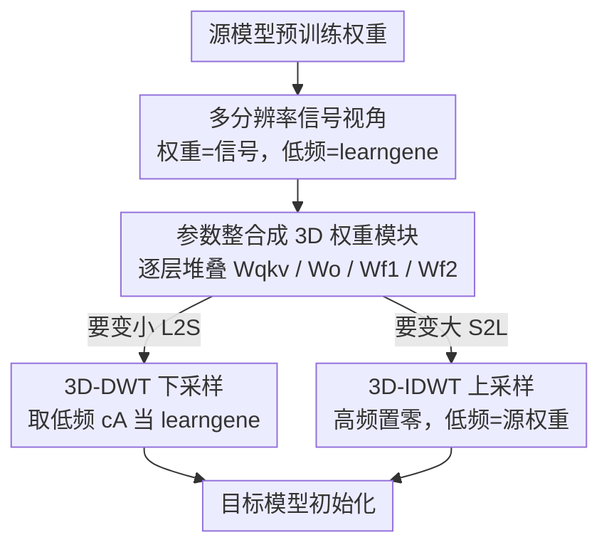

# A Unified Framework for Knowledge Transfer in Bidirectional Model Scaling

**会议**: CVPR 2026  
**论文**: [CVF Open Access](https://openaccess.thecvf.com/content/CVPR2026/html/Shen_A_Unified_Framework_for_Knowledge_Transfer_in_Bidirectional_Model_Scaling_CVPR_2026_paper.html)  
**代码**: 未公开（论文未提供）  
**领域**: 模型压缩 / 知识迁移 / 高效预训练  
**关键词**: 跨架构初始化, 小波变换, learngene, 模型扩张, 模型压缩  

## 一句话总结
BoT 把神经网络权重看成"连续信号"、不同大小的模型只是同一信号的不同分辨率离散化，于是用 3D 离散小波变换（DWT）下采样实现大变小（L2S）、用逆变换（IDWT）零填充高频后上采样实现小变大（S2L），首次用一个**免训练、无额外参数**的框架统一了两个方向的跨架构知识迁移，在 DeiT/BERT/GPT 上最多省 67.1% 预训练 FLOPs。

## 研究背景与动机
**领域现状**：现在大家都靠"模型动物园"里那些固定尺寸（-Base / -Large）的预训练权重做迁移。但 pre-train + fine-tune 这套范式有个硬约束——知识迁移基本只能在**源、目标架构完全相同**时才奏效。一旦目标模型尺寸不一样，怎么把已有知识搬过去就成了难题。

**现有痛点**：实践里这个需求有两个方向。一是 **S2L（Small-to-Large）**：受 Scaling Law 驱动要训更大的模型，但从零开始训练算力代价惊人，理应复用小模型已学到的知识来加速大模型收敛。二是 **L2S（Large-to-Small）**：大模型推理贵、显存占用高，部署时需要把它的泛化知识塞进一个资源受限的小架构里。问题是，现有方法把这两个方向当成**互不相容的两类问题**各搞各的——S2L 被当作"参数合成"（layer 复制如 bert2BERT、可训练映射如 LiGO/Mango，都要额外训练开销），L2S 被当作"参数选择"（如 Weight Selection 直接从大模型采样子集，启发式地挑权重）。

**核心矛盾**：这种割裂导致整个领域只能造一堆专用、临时的工具，掩盖了一个事实——**S2L 和 L2S 本质是同一个"双向模型缩放"问题**。learngene 范式提供了理论视角：预训练模型里浓缩着一份与具体架构维度解耦的"知识基因"，如果能把它隔离出来、任意尺寸的模型都能继承它。于是问题变成：**怎么把这份 size-agnostic 的 learngene 物化出来，用一套机制同时打通 S2L 和 L2S？**

**切入角度**：作者观察到，表现好的模型其参数空间并非随机，而是高度结构化、分布在一个低维流形上。由此**假设**：这个底层"信号"代表了可迁移的泛化知识，而其中**最基本的低频谱就是 learngene**。小模型因容量有限，被迫只能捕捉知识的低分辨率全局近似（像一张模糊的缩略图）；大模型则有容量在此基础上补上高分辨率、任务相关的细节。

**核心 idea**：既然不同大小的模型就是同一信号的不同分辨率离散化，那么 **L2S = 下采样、S2L = 上采样**——直接套用信号处理里的离散小波变换 DWT / 逆变换 IDWT，靠小波的递归多分辨率特性、用分解层数当动态缩放因子，免训练地在任意尺寸间搬运 learngene。

## 方法详解

### 整体框架
BoT 是一个**免训练、零额外参数**的跨架构初始化方法：输入是某个已预训练好的源模型权重，输出是一个被良好初始化、可直接继续预训练或下游微调的目标模型（比源模型更大或更小都行）。整条流水线只有三步：先把源模型一堆 2D 权重矩阵**整合成 3D 权重模块**，给小波变换准备好结构化输入；然后根据迁移方向走两条对称的支路——要变小（L2S）就对 3D 模块做 **3D-DWT 下采样**、取低频近似子带当 learngene 去初始化小模型；要变大（S2L）就把小模型权重当 learngene 塞进低频位、把七个高频细节子带全置零、再做 **3D-IDWT 上采样**重建出大模型。整个过程没有任何可学习参数，全靠 DWT/IDWT 这对可逆变换完成。

之所以能"同一套机制做两个方向"，关键在于小波变换天生是**分解与重建的对偶**：DWT 把信号拆成 1 个低频近似子带 cA 加 7 个高频细节子带（3D 情形下沿三个轴各做一次低通/高通滤波 + 下采样），IDWT 则把这些子带合成回原始信号。而且 IDWT 的妙处是——**即使高频细节全为零，也能从低频子带合成出一个完整尺寸的输出**，这正是 S2L"凭空补出更大模型"的数学基础。

### 关键设计

**1. 多分辨率信号视角：把权重当连续信号，低频谱就是 learngene**

以往方法在"参数空间"里硬搬权重（复制、映射、采样），始终绕不开"源和目标尺寸必须对齐"这个坎。BoT 换了一个看问题的维度：既然表现好的模型其参数高度结构化、躺在低维流形上，那就把权重看成一个**连续信号**，不同尺寸的模型不过是这个信号在不同分辨率下的离散采样。这一步是整篇文章的发动机——它把"尺寸不匹配"这个看似离散、棘手的工程问题，翻译成了信号处理里再标准不过的**上/下采样**问题。更进一步，作者把信号的**低频近似**等同于跨尺寸不变的"知识基因"（learngene）、把高频细节等同于大模型才有余力补充的任务相关细节。有了这个对应，**小波分解的层数**就自然成了一个连续可调的"缩放因子"：想缩放多少倍，就选让低频子带 cA 的维度恰好匹配目标尺寸的那一级分解，从而支持**任意尺寸**之间的迁移，而不是只能 2 倍、4 倍这种整数倍。

**2. 参数整合成 3D 权重模块：给 3D 小波变换喂结构化输入**

小波要做的是 3D 变换，可 Transformer 的权重天然是一堆 2D 矩阵，直接逐个矩阵做变换既丢失了层间结构、也无法沿"深度"方向缩放。BoT 的做法是**按功能分组、跨层堆叠**：对一个有 $L_{src}$ 层的模型，把所有层里**功能相同**的 2D 权重矩阵沿层数维堆成一个 3D 张量。比如把全部层的 query/key/value 投影权重叠成一个模块 $W_{qkv}$，注意力输出投影叠成 $W_o$，两层 FFN 分别叠成 $W_{f1}, W_{f2}$，于是源参数被组织成

$$\Theta_{src} = \{W_{qkv}, W_o, W_{f1}, W_{f2}\} \in \mathbb{R}^{L_{src}\times d_{in,src}\times d_{out,src}}$$

这样一来，3D 张量的三个轴分别对应"层深 × 输入维 × 输出维"，小波沿三个轴下/上采样就能**同时缩放网络的深度和宽度**——这也是它叫"3D"小波、而不是直接对单个矩阵做 1D/2D 变换的原因。这一步是后面 DWT/IDWT 能成立的前提：没有这个整合，就没有可供多分辨率分解的结构化 3D 信号。

**3. L2S 用 3D-DWT 下采样：把大模型蒸成紧凑 learngene**

要把大模型变小，BoT 对每个整合好的源模块 $W_{src}$ 做 **3D-DWT**，并选一个分解层级（即下采样因子 $f$，通常每级 $f=2$）让分解后低频子带的尺寸**精确匹配**目标小模型的维度。3D-DWT 沿三个轴各做一次低通滤波 + 下采样，得到 1 个低频近似子带

$$cA = \mathcal{L}_k(\mathcal{L}_j(\mathcal{L}_i(W)))$$

（$\mathcal{L}$ 为低通算子，沿 $i,j,k$ 三轴依次作用）以及 7 个由低/高通算子组合得到的高频细节子带 $\{cD_m\}_{m=1}^{7}$。BoT 直接**丢弃高频、只继承低频** $cA$ 当作 learngene 去初始化目标小模型（$W_{tgt}=cA_{src}$）。这背后的逻辑是：低频近似抓住了大模型权重"全局、低分辨率的本质结构"，小模型容量本就只配得上这份全局近似；相比 Weight Selection 那种从大模型里**采样子集**的启发式（采样会割裂参数间已经建立好的相互依赖、破坏学到的结构模式），小波下采样是对整体结构的**平滑压缩**，保留的是连贯的结构化知识，所以初始化质量更高。

**4. S2L 用 3D-IDWT 上采样：高频置零、从 learngene 凭空长出大模型**

反过来要把小模型变大，BoT 把小模型整合后的权重 $W_{src}$ 直接当作 learngene，**塞进 IDWT 的低频近似位**（令 $cA = W_{src}$），再把 7 个高频细节子带**全部置零**，做 3D-IDWT 合成出匹配大模型尺寸的权重：

$$W_{tgt} = \text{IDWT}_{3D}(W_{src}, O_1, \dots, O_7)$$

其中 $\{O_i\}_{i=1}^{7}$ 是相应形状的零张量。"高频置零仍能合成全尺寸输出"正是 IDWT 的数学性质，意味着大模型一开始就站在一个**完全由源模型已学表示构成的、连贯稳定的地基**上，剩下的高频任务细节交给后续训练去补。和 bert2BERT 那种直接复制/拆分神经元相比，复制会让新权重被源分布"绑死"、初始多样性受限从而拖慢收敛；和 LiGO/Mango 那种可训练映射相比，BoT 不引入任何需要训练的映射器，是**纯免训练、一次性**完成初始化，省掉了额外的算力和实现复杂度。

### 一个例子：DeiT-S(6 层) ↔ DeiT-B(12 层) 双向走一遍
- **L2S（B→S）**：先把 DeiT-B 全部 12 层的 QKV/输出投影/两层 FFN 各自堆成 4 个 3D 模块，每个模块第一维是 12；对每个模块做一级 3D-DWT（$f=2$），低频子带 cA 的层维降到 6、宽度也对半，恰好是 DeiT-S 的尺寸；丢掉高频，用 cA 初始化 6 层的 DeiT-S。结果它达到 70% 精度只需 39.0% 的 FLOPs（相对从零训练省下的比例）。
- **S2L（S→B）**：把 DeiT-S 的 4 个 3D 模块当 learngene 放进 IDWT 低频位、7 个高频子带置零，IDWT 上采样合成出 12 层的 DeiT-B 初始化。它收敛曲线更陡、终点更高，达到目标 80.8% 精度省 22.0% FLOPs。

## 实验关键数据

### 主实验：三种架构上的预训练 FLOPs 节省
横跨视觉（DeiT）、编码器（BERT）、解码器（GPT）三类架构，双向都测。指标是 **FLOPs Saving Ratio** $r=\frac{\phi_{scratch}-\phi'}{\phi_{scratch}}$，即达到同一目标性能 $M$ 时、初始化模型相对从零训练省下的算力比例，越高越好。

| 架构 | 方向 | 目标性能 | BoT 省 FLOPs | 对最强 baseline 的领先 |
|------|------|----------|--------------|------------------------|
| BERT | S2L (S→B) | 同一 MLM loss | **67.1%** | 比 LiGO/Mango +22.2% |
| GPT  | S2L (S→B) | 同一 GEN loss | **58.3%** | 比 LiGO/Mango +10.4% |
| BERT | L2S (B→S) | 同一 MLM loss | **52.8%** | 比 WS +19.8% |
| GPT  | L2S (B→S) | 同一 GEN loss | **31.0%** | 比 WS +24.1% |
| DeiT | L2S (B→S) | 70% acc | 39.0% | 超过 KD、WS |
| DeiT | S2L (S→B) | 80.8% acc | 22.0% | 比 LiGO +11.4%、Mango +5.3% |

### 下游直接微调（不额外预训练）
把初始化后的模型**直接**在下游任务上微调，考查初始化本身的知识质量。

DeiT 七数据集精度（节选）：

| 设置 | 方法 | C100 | CUB | Cars |
|------|------|------|-----|------|
| L2S (DeiT-S) | Scratch | 66.5 | 27.3 | 23.8 |
| L2S (DeiT-S) | WS | 75.2 | 57.7 | 72.1 |
| L2S (DeiT-S) | **BoT** | 75.3 | **61.3** | **74.6** |
| S2L (DeiT-B) | Mango | 82.3 | 73.7 | 87.2 |
| S2L (DeiT-B) | **BoT** | **82.4** | **74.1** | **88.6** |

BERT 上的 GLUE / SQuAD（直接微调）更夸张：L2S 设置下 BoT 的 GLUE 平均 70.29 比 WS 的 60.90 高 **+9.39%**，SQuAD 平均 48.25 比 WS 的 21.28 **翻了一倍多（+26.97%）**；S2L 设置下 GLUE 73.24 / SQuAD 56.51 也都超过 LiGO、Mango。

### 消融实验：小波族的选择
对 BERT、GPT 双向各换一组小波基，看固定步数后的验证 loss。

| 配置 | 最优小波 | 结论 |
|------|----------|------|
| BERT L2S (B→S) | Haar | 编码器压缩偏好最简单、分段常数的小波 |
| BERT S2L (S→B) | bior6.8 | 编码器**扩张**独爱高阶消失矩、更平滑的小波 |
| GPT L2S (B→S) | coif3 | 解码器整体偏好紧支撑小波 |
| GPT S2L (S→B) | db2 | 同上，短滤波器更合适 |
| 全部四种 | — | **任何**小波初始化都显著优于 Scratch |

### 关键发现
- **方向最大贡献来自 S2L**：BERT/GPT 上 S2L 的 FLOPs 节省（67.1% / 58.3%）明显高于 L2S（52.8% / 31.0%），说明"凭低频地基长出大模型"这条路省得最多，也是相对可训练映射方法（LiGO/Mango）拉开差距最大的地方。
- **最优小波依架构和方向而变**，没有万能选择：编码器扩张要平滑高阶小波，其余场景偏好短滤波器；但"用哪种小波"是二阶问题——**用不用小波**才是一阶，任意小波都碾压从零初始化，说明收益主要来自"多分辨率迁移"这个机制本身。
- **省算力不掉点**：先把模型预训练到与初始化模型相同的 MLM loss 再微调，BoT 在 BERT-S 省 52.8% FLOPs / 66.8% Walltime、BERT-B 省 67.1% FLOPs / 65.3% Walltime 的同时，最终下游分数与需要训练映射的 LiGO/Mango **持平甚至略好**。
- **可视化佐证结构继承**：自注意力层里预训练模型特有的强对角结构，BoT 初始化后自动保留了下来；CAM 也显示 BoT 模型一开始就更聚焦显著局部特征——这解释了它在 CUB、Cars 等细粒度任务上领先尤其明显（这类任务最吃高分辨率结构特征）。

## 亮点与洞察
- **一个视角统一两个割裂的子领域**：把"模型变大/变小"统一成"信号上采样/下采样"，让 S2L 和 L2S 第一次共用同一套数学。这种"换坐标系把离散难题变连续标准问题"的思路非常漂亮，也很可迁移——任何"跨尺寸/跨分辨率搬运"的问题都值得想一想能不能套信号处理工具。
- **免训练 + 零额外参数**是真正的实用价值：DWT/IDWT 是确定性可逆变换，初始化就是一次前向变换，没有要训的映射器、没有教师推理的累计开销（对比 KD），这让它在工程上几乎"即插即用"。
- **3D 整合是被低估的关键 trick**：把同功能权重跨层堆成 3D 张量，才让小波能同时缩放深度和宽度。这个"把分散的 2D 权重组织成可做谱变换的结构化张量"的做法，可复用到其他想对网络参数做谱分析/压缩的场景。
- **learngene = 低频谱**这个假设给了一个干净的可检验命题：知识里"跨尺寸不变的核"对应信号低频，"任务相关细节"对应高频——并被可视化和消融间接验证。

## 局限与展望
- **依赖低频假设**：整套方法建立在"低频谱 = 可迁移知识基因、高频可丢/可补零"的假设上。这对参数高度结构化的 Transformer（堆叠同构层）成立得好，但对结构不规整、层间异质的架构是否仍成立，论文未深入讨论。⚠️ 以原文为准。
- **缩放因子受小波层级离散性约束**：虽然作者强调"任意尺寸"，但每级 DWT 通常是 $f=2$ 的下采样，目标尺寸要"恰好匹配"某一级分解的输出维度；非 2 的幂次或非整除的尺寸比该如何精确对齐，正文未给完整说明（细节在附录），可能需要 padding/裁剪等额外处理。
- **小波族需按场景挑选**：消融显示最优小波随架构和方向变化，意味着实际用时存在一个超参选择问题，缺乏一个"自动选小波"的机制——目前更像经验法则。
- **S2L 的高频全置零或许过于粗暴**：把所有高频细节直接归零虽然给了稳定地基，但也等于"大模型多出来的容量初始为最朴素状态"。能否用更聪明的方式（如基于源模型统计的高频先验）填充高频，可能进一步加速收敛，是值得探索的方向。

## 相关工作与启发
- **vs Weight Selection (WS, L2S)**：WS 直接从大模型**采样**权重子集，启发式选择会割裂参数间已建立的依赖、破坏结构模式；BoT 用 DWT 平滑下采样保留整体结构，免训练且 L2S 下大幅领先（BERT 上 +19.8% FLOPs）。
- **vs bert2BERT (S2L)**：bert2BERT 靠复制/拆分神经元堆出大模型，新权重被源分布绑死、初始多样性受限拖慢收敛；BoT 用 IDWT 合成出连贯地基，收敛更快。
- **vs LiGO / Mango (S2L)**：二者学一个可训练的线性/多线性映射把源权重投到目标空间，引入额外训练开销和实现复杂度；BoT 纯免训练，在 FLOPs 节省上领先（BERT S2L +22.2%）且下游持平甚至略好。
- **vs 频域剪枝（Ulicny et al. 1D/2D-DCT）**：以往把谱变换用于参数都是**架构内**的（压缩/剪枝单个模型）；BoT 是据作者所知**首个把 3D 小波用于跨架构初始化**的工作，把谱变换从"数据分析/剪枝"重新定位成"双向、任意尺寸知识迁移"的机制。

## 评分
- 新颖性: ⭐⭐⭐⭐⭐ 把双向模型缩放统一成小波上/下采样，视角新颖且首创 3D 小波用于跨架构初始化。
- 实验充分度: ⭐⭐⭐⭐ 覆盖 DeiT/BERT/GPT 三类架构 + 双向 + 下游 + 消融，较全面；但缺非 2 幂次尺寸、非 Transformer 架构的验证。
- 写作质量: ⭐⭐⭐⭐⭐ "信号—分辨率—learngene"的故事线清晰，图表把双向对比讲得很直观。
- 价值: ⭐⭐⭐⭐⭐ 免训练、零参数、即插即用地省下最多 67% 预训练算力，实用性和启发性都强。

<!-- RELATED:START -->

## 相关论文

- [\[CVPR 2026\] Rethinking Knowledge Transfer in Image Quality Assessment: A Perceptual Preference Structure Alignment Perspective](rethinking_knowledge_transfer_in_image_quality_assessment_a_perceptual_preferenc.md)
- [\[CVPR 2026\] CAD-Refiner: A Unified Framework for CAD Generation and Iterative Editing](cad-refiner_a_unified_framework_for_cad_generation_and_iterative_editing.md)
- [\[CVPR 2026\] Event Structural Valley: A Unified Theoretical and Practical Framework for Event Camera Autofocus](event_structural_valley_a_unified_theoretical_and_practical_framework_for_event_.md)
- [\[CVPR 2026\] Bidirectional Normalizing Flow: From Data to Noise and Back](bidirectional_normalizing_flow_from_data_to_noise_and_back.md)
- [\[CVPR 2026\] Bidirectional Query-Driven Generation of Parametric CAD Sketch](bidirectional_query-driven_generation_of_parametric_cad_sketch.md)

<!-- RELATED:END -->
