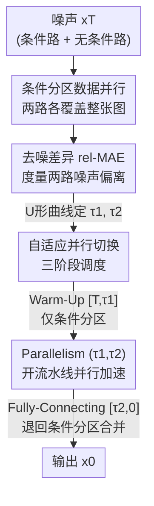

# Accelerating Diffusion via Hybrid Data-Pipeline Parallelism Based on Conditional Guidance Scheduling

**会议**: CVPR 2026  
**论文**: [CVF Open Access](https://openaccess.thecvf.com/content/CVPR2026/html/Jung_Accelerating_Diffusion_via_Hybrid_Data-Pipeline_Parallelism_Based_on_Conditional_Guidance_CVPR_2026_paper.html)  
**代码**: https://github.com/kaist-dmlab/Hybridiff  
**领域**: 扩散模型 / 推理加速 / 分布式并行  
**关键词**: 扩散模型加速, 混合并行, 条件分区, 流水线并行, Classifier-Free Guidance

## 一句话总结
针对多 GPU 扩散推理"加速达不到线性、还掉画质"的痛点，本文把 Classifier-Free Guidance 天然的"条件/无条件双路"当成数据并行的切分维度（条件分区），再用一个度量两路噪声差异的指标（去噪差异 rel-MAE）自适应决定何时开/关流水线并行，在 2 张 RTX 3090 上对 SDXL / SD3 分别取得 2.31×/2.07× 加速且几乎不掉画质。

## 研究背景与动机
**领域现状**：扩散模型质量虽高但推理慢——几十步迭代去噪是天然的延迟瓶颈。单卡侧的加速（减采样步数、压缩架构、数学近似）往往要额外训练，且在"质量 vs 速度"之间硬权衡。多卡分布式并行是一条不用重训就能提吞吐的路，代表工作有数据并行的 DistriFusion 和流水线并行的 AsyncDiff。

**现有痛点**：两类并行都达不到理想的 N× 线性加速，而且会掉画质。DistriFusion 把一张图切成 N 块 patch 分到 N 卡上各自去噪，但每块只是图的局部子区域，patch 边界处会出现接缝伪影；而且块间要靠 all-gather 同步特征，通信开销大，2 卡实测只有 1.2× 加速。AsyncDiff 把 U-Net 按层切成 N 段做流水线，靠异步通信把上一段输出喂给下一段，但异步（而非顺序）去噪会累积估计误差，2 卡只有 1.3× 加速。

**核心矛盾**：把两者朴素拼成"混合并行"（patch 切分 + 模型分段）理论上能超线性，但两个掉质来源叠加——局部 patch 带来边界伪影、异步通信带来误差累积——画质会更糟。问题根子在于 **patch 切分破坏了全局一致性**，而流水线的**静态切换点**没有对齐条件引导在去噪过程中的动态行为。

**切入角度**：作者观察到，条件扩散里 CFG 本就要同时算"有提示词"的条件噪声 $\epsilon_\theta(x_t,c,t)$ 和"无提示词"的无条件噪声 $\epsilon_\theta(x_t,t)$ 两条路。这两条路各自覆盖**整张图**，天生就是两份可并行的数据，而且它们之间的差异随时间步呈现规律性的 U 形——早期差异大、中段趋近、末期又拉开。这给了"切分数据"和"何时并行"两个问题一个统一的物理依据。

**核心 idea**：从数据并行侧把"patch 切分"换成"条件/无条件切分"（保留全局一致性），从模型并行侧把"静态切换"换成"按去噪差异自适应切换"，二者融成统一的混合并行框架。

## 方法详解

### 整体框架
输入各向同性噪声 $x_T$ 同时进入两条去噪分支：无条件路 $f_\theta(x_t,t)$ 与条件路 $f_\theta(x_t,c,t)$。整个去噪过程按"条件影响随时间的动态"被切成三段：**Warm-Up 阶段 $[T,\tau_1]$**、**Parallelism 阶段 $(\tau_1,\tau_2)$**、**Fully-Connecting 阶段 $[\tau_2,0]$**。三段的边界 $\tau_1,\tau_2$ 不是手调死值，而是实时根据"去噪差异"自动确定的。

直觉是：早期两路差异大（条件在搭全局语义骨架、无条件在稳粗结构），异步并行会让两路发散，所以**只做条件分区数据并行、不开流水线**；中段两路收敛、差异平稳，此时**开启自适应流水线并行**狠狠加速；末期细粒度条件线索主导、差异再度拉开，**退回条件分区**合并两路做最终精修。形式上，N 卡上的去噪写成 $x^{(n)}_{t-1}=f_{\theta^{(n)}}(x^{(n)}_t, c^{(b_n)}, t)$，其中 $\theta^{(n)}$ 是分到第 $n$ 卡的模型参数子集（体现自适应流水线切换），$b_n\in\{\text{cond},\text{uncond}\}$ 标记该卡处理条件还是无条件分支（体现条件分区）。

### 关键设计

**1. 条件分区数据并行：用 CFG 的双路当切分维度，避开 patch 边界伪影**

patch 切分的根本毛病是每块只是图的局部，块边界缝合处必然出伪影、还要靠 all-gather 频繁同步。本文不切空间，而是切"条件维度"：CFG 本就要算条件噪声 $\epsilon_c=\epsilon_\theta(x_t,c,t)$ 和无条件噪声 $\epsilon_u=\epsilon_\theta(x_t,t)$，把这两条路分到两张卡上各自跑。关键在于**每条路处理的都是整张图**，全局一致性天然保留，不存在 patch 接缝问题；而且两路只在必要时交换信息，特征聚合的通信量大幅下降。这等于"白嫖"了 CFG 已经要做的双路计算——本来串行算两遍的条件/无条件 forward，现在并行起来，不增加额外推理工作量就换来加速。

**2. 去噪差异 rel-MAE：量化两路何时该交互、何时该独立**

要决定何时切到并行，得先有个能刻画"两路是否对齐"的指标。本文定义**去噪差异**（denoising discrepancy）为两路噪声预测的相对平均绝对误差：

$$\text{rel-MAE}_t(\epsilon_c,\epsilon_u)=\frac{\mathbb{E}_{x,\epsilon}\big[\lVert\epsilon_\theta(x_t,c,t)-\epsilon_\theta(x_t,t)\rVert_1\big]}{\mathbb{E}_{x,\epsilon}\big[\lVert\epsilon_\theta(x_t,t)\rVert_1\big]}$$

值越大代表两路偏离越大、当前时间步条件影响越强。作者在 MS-COCO 2014 验证集 5000 条 prompt 上测得这条曲线随时间呈清晰的 **U 形**：早期大、中段近零、末期回升。更进一步，通过 score 分解可把它近似解释为"条件信息强度与无条件数据先验之比" $\text{rel-MAE}_t\approx\frac{\lVert\nabla_{x_t}\log p(c|x_t)\rVert_1}{\lVert s_u(x_t,t)\rVert_1}$——早期 $x_t$ 接近纯噪声、无条件 score 几乎不含结构信息，条件梯度主导（差异大）；中段无条件 score 重建出局部结构、两者量级相当（差异趋零、导数≈0，正是该并行的信号）；末期高信噪比下结构基本恢复、条件只做细节精修（差异轻微回升）。这给三阶段切分提供了理论支撑，而不只是经验观察。

**3. 自适应并行切换：按 rel-MAE 自动定 τ₁、τ₂ 而非静态切换**

既然 rel-MAE 是 U 形，就用它自动找两个拐点。**确定 $\tau_1$**：对每步算去噪差异，再取最近 $L$ 步的平均斜率 $G_t=\frac{M_t-M_{t-L}}{L}$，选第一个斜率不再快速下降的点 $\tau_1'=\min\{t\mid 0\le G_t<g_{\text{slope}}\}$，再用安全上界 $\tau_{\text{cap}}$（差异曲线全局最小点）约束，最终 $\tau_1=\min(\tau_1',\tau_{\text{cap}})$——加 $\tau_{\text{cap}}$ 是为了在 $\tau_1$ 因离群行为被推得太晚或无定义时兜底，保住画质。**确定 $\tau_2$**：进入并行段后 $\epsilon_c$ 与 $\epsilon_u$ 已收敛到几乎相同，差异度量失去意义，于是 $\tau_2$ 经验性地固定在 $\tau_1$ 之后 $k$ 步：$\tau_2=\tau_1+k$。这里 $k$ 是直接控速度-画质权衡的旋钮：$k$ 越大并行段越长、越快但画质略降，越小则更保真但更慢。与 AsyncDiff 那种固定 warm-up 步数的静态切换相比，本文把"何时开/关并行"绑定到模型自身的去噪动态上，因而能把并行只开在两路真正对齐、异步误差最小的窗口里，既最大化加速又把误差传播压到最低。

### 损失函数 / 训练策略
本方法是**纯推理期**的并行调度，不引入任何额外训练或微调，直接套在预训练扩散模型上。框架对去噪范式不挑：去噪扩散模型用噪声 $\epsilon$ 算 rel-MAE，flow matching 模型则把 $\epsilon_\theta$ 换成预测速度场 $v_\theta$、用 $\text{rel-MAE}_t(v_c,v_u)$ 扮演同样角色，因此 U-Net 与 DiT 架构都适用。扩展到更多 GPU 有两种策略：**批级扩展**（N 卡每两卡产一张图、加速随卡数线性增，适合大批量生成）和**层级流水线扩展**（把最优并行区间再切成 N 段做更细粒度流水线，适合单图生成，但加速效率与画质略降）。

## 实验关键数据

### 主实验
SDXL（U-Net）与 SD3（DiT flow-matching）上、MS-COCO 2014 的 5000 条 prompt、1024×1024 文生图。FID/LPIPS 越低越好、PSNR 越高越好。

| 模型 | 卡数 | 方法 | 延迟(s)↓ | 加速↑ | 通信(GB)↓ | FID(w/ Orig.)↓ |
|------|------|------|---------|-------|----------|----------------|
| SDXL | 1 | Original | 16.49 | — | — | — |
| SDXL | 2 | DistriFusion | 13.53 | 1.22× | 0.525 | 4.864 |
| SDXL | 2 | AsyncDiff (stride=1) | 12.54 | 1.31× | 9.830 | 4.103 |
| SDXL | 2 | **Ours (k=5)** | **7.12** | **2.31×** | **0.516** | **4.100** |
| SDXL | 4 | **Ours (k=5)** | 4.83 | 3.41× | 0.751 | 5.544 |
| SD3 | 1 | Original | 19.36 | — | — | — |
| SD3 | 2 | AsyncDiff (stride=1) | 9.82 | 1.97× | 1.290 | 2.032 |
| SD3 | 2 | Parastep | 9.98 | 1.94× | 0.032 | 3.350 |
| SD3 | 2 | xDiT-Ring | 14.31 | 1.35× | 121.646 | 1.909 |
| SD3 | 2 | **Ours (k=5)** | **9.33** | **2.07×** | **0.189** | **1.878** |
| SD3 | 4 | **Ours (k=5)** | 5.53 | 3.50× | 0.572 | 2.109 |

2 卡上对 SDXL 取得 2.31× 加速（DistriFusion 1.22×、AsyncDiff 1.31×），且通信量比 AsyncDiff 降约 19.6×（0.516 vs 9.830 GB），FID 还略优；4 卡到 3.41×。SD3 上 2 卡 2.07×、4 卡 3.50×，验证了对 U-Net 与 DiT 两类架构的通用性。

### 消融实验
SDXL、1024×1024、2 卡，拆解两个组件的贡献：

| 配置 | 延迟(s)↓ | 加速↑ | FID(w/ Orig.)↓ | 说明 |
|------|---------|-------|----------------|------|
| Original Model | 16.49 | — | — | 单卡基线 |
| Full Condition-Based Partitioning | 9.24 | 1.78× | 3.623 | 只用条件分区、全程不切并行 |
| **Ours (Hybrid Parallelism)** | 7.12 | 2.31× | 4.100 | 条件分区 + 自适应并行切换 |

仅条件分区一项就拿到 1.78× 且几乎不掉质（FID 3.623），说明"用 CFG 双路当数据切分"本身就是有效的加速来源；再叠加自适应并行切换，加速进一步提到 2.31×、FID 仍维持在 4.100 的可比水平——两个组件叠加才把"加速最大化、掉质最小化"同时做到。

### 关键发现
- **条件分区是加速主力、自适应切换是锦上添花**：单条件分区已 1.78×，混合再加 0.53× 到 2.31×；前者保全局一致性、后者压异步误差，互补而非冗余。
- **超参 $k$ 是速度-画质旋钮**：图 6 的权衡前沿上 $k=5$ 是甜点（兼顾保真与加速），$k$ 增大（10/20/30）更快但 FID 升高；不同 $k$ 下本方法的前沿都压在 DistriFusion/AsyncDiff 之上。
- **通信开销远低于对手**：SD3 上 xDiT-Ring 通信高达 121.6 GB（ring attention 的代价），本方法仅 0.189 GB，因为只在必要窗口开并行。
- **高分辨率仍可扩展**（H200×2，⚠️ 数值以原文图 7 为准）：SDXL 在 1024² 达 2.72×、2048² 约 1.54×、2560² 约 1.62×，随分辨率上升仍稳定领先。

## 亮点与洞察
- **把 CFG 的"双路冗余"反转成"免费并行维度"**：条件/无条件 forward 本来就要各算一遍，作者不是去消除这份冗余，而是让它并行起来当数据切分——既绕开 patch 边界伪影，又不增加额外计算，是非常巧的视角转换。
- **用一个可解释的标量调度整条流水线**：rel-MAE 的 U 形曲线把"何时该并行"这个工程问题变成"读一条曲线找拐点"，而且能用 score 分解从理论上解释为何是 U 形，机制清晰、可迁移。
- **可迁移性**：只要模型遵循"可量化条件/无条件相对影响"的顺序去噪过程，这套调度就能用——把 $\epsilon$ 换成 $v$ 就覆盖了 flow matching，不绑定 U-Net 或 DiT，比 ring attention 那类 transformer 专用方案通用得多。

## 局限与展望
- 框架**为 2 卡优化**，扩到多卡靠批级/层级两种扩展；层级流水线扩展在单图生成时加速效率与画质都会略降，超线性优势主要在 2 卡场景最明显。
- 强依赖 **CFG 的双路结构**：不带 classifier-free guidance、或无法量化条件/无条件差异的生成范式（如某些无条件生成或单路引导）就用不上这套切分。
- $\tau_2=\tau_1+k$ 中 $k$ 是经验固定值，需按模型/任务调（论文给的甜点是 $k=5$）；$\tau_2$ 没像 $\tau_1$ 那样自适应，是因为并行段内两路已收敛、差异度量失效——但这也意味着末段切换点缺少自动化，换数据集可能要重调 $k$。⚠️ 高分辨率部分数值引自原文图，未在正文给出完整表格。
- 实验主要在 SDXL/SD3 文生图上，视频/音频等更长序列、更大模型上的表现待验证。

## 相关工作与启发
- **vs DistriFusion**：它做 patch 级数据并行，每卡处理图的一块、靠 all-gather 同步，导致边界伪影 + 高通信；本文改成条件级切分，每路覆盖整张图、保全局一致性，通信也低得多。
- **vs AsyncDiff**：它把 U-Net 按层切段做异步流水线，静态 warm-up 后全程并行，异步误差累积掉质（SDXL 2 卡仅 1.31×）；本文用 rel-MAE 自适应只在两路对齐窗口开并行，误差小、通信降约 19.6×。
- **vs ParaStep**：它靠复用相邻步噪声相似性做跨步并行、通信极低，但早晚期相邻噪声差异大、复用会累积误差；本文不复用而是按条件差异调度，画质更稳（SD3 上 FID 1.878 vs 3.350）。
- **vs xDiT-Ring / PipeFusion**：transformer 专用的 ring attention 扩展性有限、通信极高（121.6 GB）；本文架构无关、通信仅 0.189 GB。

## 评分
- 新颖性: ⭐⭐⭐⭐⭐ "把 CFG 双路当数据切分维度 + 用去噪差异自适应调度并行"是此前并行加速没用过的视角，且有 score 分解理论支撑。
- 实验充分度: ⭐⭐⭐⭐ 覆盖 U-Net/DiT、2/4 卡、高分辨率、$k$ 敏感性，但多卡(8) 与高分辨率细节放在附录、正文表格略少。
- 写作质量: ⭐⭐⭐⭐ 三阶段动机与理论解释清晰，但部分关键数值（高分辨率）只在图里、可读性稍打折。
- 价值: ⭐⭐⭐⭐⭐ 免训练、架构无关、2 卡即超线性加速且不掉质，对扩散推理部署有直接落地价值。

<!-- RELATED:START -->

## 相关论文

- [\[ICLR 2026\] Harpoon: Generalised Manifold Guidance for Conditional Tabular Diffusion](../../ICLR2026/others/harpoon_generalised_manifold_guidance_for_conditional_tabular_diffusion.md)
- [\[CVPR 2026\] OntoAug: Rethinking Generative Data Augmentation via Ontology Guidance](ontoaug_rethinking_generative_data_augmentation_via_ontology_guidance.md)
- [\[CVPR 2026\] AVGGT: Rethinking Global Attention for Accelerating VGGT](avggt_rethinking_global_attention_for_accelerating_vggt.md)
- [\[ICML 2026\] AMDP: Asynchronous Multi-Directional Pipeline Parallelism for Large-Scale Models Training](../../ICML2026/others/amdp_asynchronous_multi-directional_pipeline_parallelism_for_large-scale_models_.md)
- [\[CVPR 2026\] Smart Replay: Adaptive Scheduling of Memory Rehearsal for Computational Resource-Aware Incremental Learning](smart_replay_adaptive_scheduling_of_memory_rehearsal_for_computational_resource-.md)

<!-- RELATED:END -->
